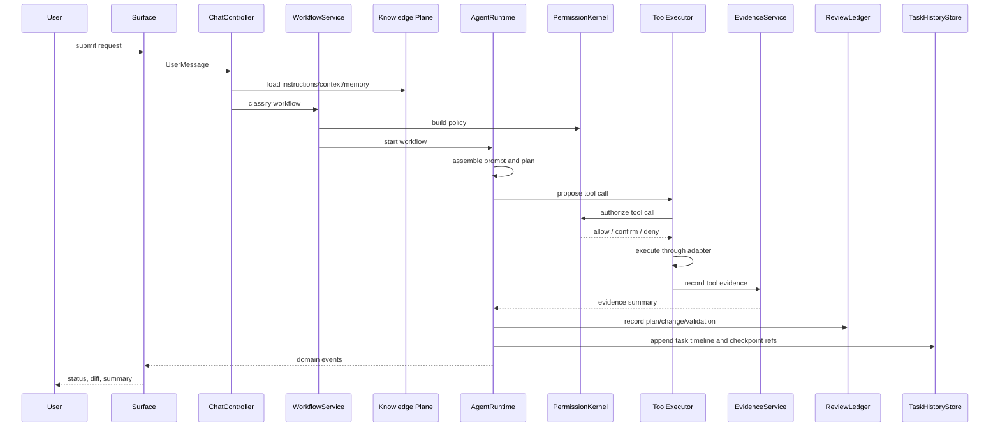
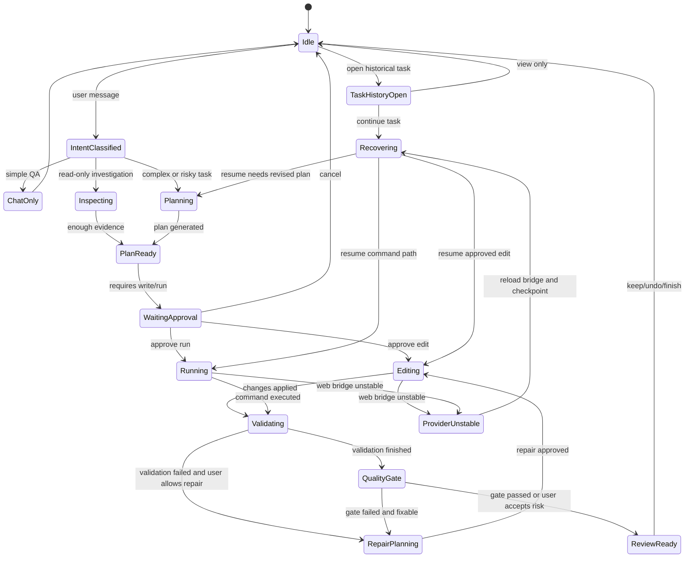
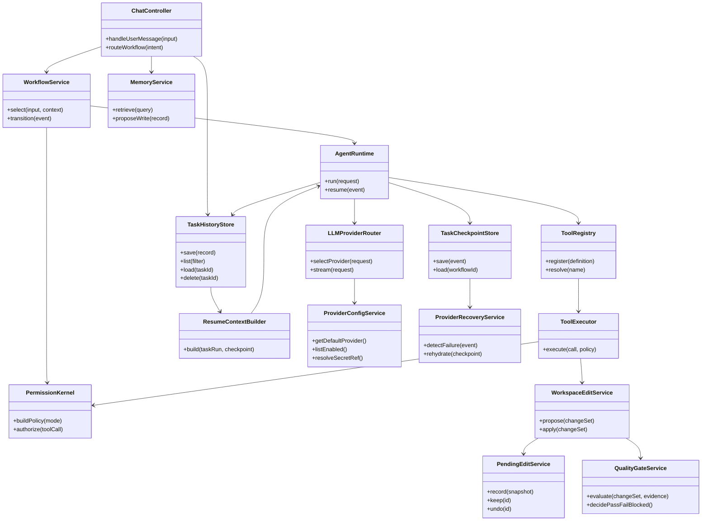

# DevSeek 顶级编程智能体总体架构设计

文档编号：ARCH-01
最后更新：2026-06-21
对应需求：[../requirements/02-顶级编程智能体需求基线.md](../requirements/02-顶级编程智能体需求基线.md)、[../requirements/07-架构重构需求澄清.md](../requirements/07-架构重构需求澄清.md)
状态：活跃总体架构，取代旧 DeepSeek Web 包装器式总体设计

## 1. 设计结论

DevSeek 的目标不再是“把 DeepSeek 网页回复转成文件修改”，而是重构为本地优先、可审计、可回退、可扩展的编程智能体运行时。

核心结论：

1. 模型只负责推理和提出行动，DevSeek 内核负责权限、工具、文件变更、验证、记忆和审计。
2. 复杂任务默认先进入 Plan/Inspect，只读探索后再由用户批准进入 Edit/Run。
3. 所有外部副作用必须通过注册工具、权限策略和事件账本，不能由 prompt 约定替代。
4. 文件变更必须具有 diff/hunk、Keep/Undo、验证、回退和事实摘要。
5. 项目规则、上下文、记忆体、会话摘要要分层治理，不能继续混在 prompt 拼接逻辑里。
6. DeepSeek Web 输出必须先经过完整性检查、质量门禁和验证闭环，最后才进入可使用状态。
7. DeepSeek Web 是默认模型 Provider；DeepSeek API、OpenAI-compatible、本地模型和企业模型通过 API Provider 接入同一运行时。
8. DeepSeek Web Bridge 不稳定时，任务真相来自本地 checkpoint，而不是网页会话。
9. 历史聊天和历史任务必须分层，任务历史保存执行事实、恢复点、验证证据和继续工作入口。
10. 程序员工程事实必须进入独立工程上下文层：repository map、环境、依赖、忽略规则、冲突、预算和预览验证不能散落在 prompt 拼接里。
11. 显示与功能必须分离：VS Code、CLI、非交互脚本、桌面/本地 Web 都只是 Surface，真实业务进入 Headless Agent Core。
12. `extension.ts` 和 `agent-loop.ts` 退回组合入口，真实业务进入 `app/*`、`agent/*`、`workspace/*`、`memory/*`、`llm/*`。

Phase 9 后补充结论：

13. 代码规模下降不是目标本身。它只是提示职责可能错位的信号；真正目标是让入口、Surface、应用内核、运行时、工具、权限、证据和 Provider 的边界清晰。
14. DevSeek 下一阶段必须把 VS Code 首发插件中的 `runChat` / `routeChat` 主编排迁入 Headless Agent Core。只有当 VS Code、CLI、JSONL、Desktop/local Web 都能复用同一 `AgentCommand` / `AgentEvent` 和任务事实时，才算达到顶级编程智能体架构。
15. Claude Code/Codex 的可借鉴点不是某个 UI 或命令名，而是：计划先行、权限硬执行、上下文渐进加载、工具事实优先、review 可回退、hooks/skills/subagents 可审计、多 Surface 共享同一 Agent Core。

## 2. 竞品能力取舍

| 来源 | 最优秀做法 | DevSeek 采用方式 |
| --- | --- | --- |
| Claude Code | Plan Mode、只读探索、hooks、skills/subagents、工具权限可控 | 设计 `WorkflowService` 状态机、`HookPolicy`、`Skill/Subagent` 扩展点 |
| OpenAI Codex | `AGENTS.md` 指令链、沙箱与审批、计划/执行分离、review/patch 工作流、记忆与 hooks | 设计 `ProjectInstructionService`、`PermissionKernel`、`ReviewLedger`、`MemoryService` |
| GitHub Copilot | IDE 原生 Agent、repo instructions、MCP、cloud agent 分支/PR/提交透明性 | 设计 UI 协议事件、MCP 工具域、Git/PR 辅助层、本地任务账本 |
| 三者共同点 | 模型输出不等于完成，必须经过工具事实、测试、review、权限和可恢复会话 | 新增 `QualityGateService`、`TaskCheckpointStore`、`TaskHistoryStore`、`ProviderRecoveryService`、`IdempotencyGuard` |
| 多模型共同经验 | 模型选择可以变化，但工具、权限、验证、历史任务和记忆不能随模型分叉 | 设计 DeepSeek Web 默认 Provider、API Provider 直连和统一 `LLMProvider` 契约 |
| 多 Surface 共同经验 | Claude/Codex/Copilot 都同时提供 IDE、CLI、桌面/云或 API 入口，但核心 Agent 能力保持一致 | 设计 `AgentApplicationService`、`SurfaceAdapter`、`AgentCommand` / `AgentEvent` 和 `PlatformRuntimeAdapter` |

设计原则：吸收三者最强的工程机制，而不是复刻某一个产品表面。DevSeek 的差异化目标是“本地可控 + 多 Provider + DeepSeek Web 兼容 + 顶级 Agent 内核”。

## 2.1 Phase 9 后现实状态

| 层级 | 当前进展 | 下一步 |
| --- | --- | --- |
| Presentation / Surface | VS Code WebView、命令注册、Inline Chat、artifact UI、task history UI 已部分迁入 `ui/*` | 完整实现 `VSCodeSurfaceAdapter`，禁止 Surface 直接裁判任务完成或验证结果 |
| Application | `ChatRouteController`、workflow、task history、provider recovery、quality gate 等服务已拆出 | 抽 `AgentApplicationService`，统一接收 `AgentCommand` 并输出 `AgentEvent` |
| Runtime | `agent-loop.ts` 已降到约 1797 行，工具循环和 host tool callbacks 已下沉 | 形成 `AgentRuntime`、`TaskOrchestrator`、`PromptAssembler`、`EvidenceLedger` |
| Provider | Phase 8 已统一 Provider config、events、fallback、secret redaction | Provider 调用迁入 Application port，Surface 不直接知道 Provider 细节 |
| Review / Evidence | QualityGate、ValidationEvidence、TaskCheckpoint 已能阻断假完成 | ReviewLedger 升级到 file/hunk/stage/revert/inline feedback 与 replay fixture |
| Extensibility | hooks/skills/subagents/MCP 已在设计中定义方向 | Phase 12 前补专项运行时契约，明确 trust、permission、memory、isolation |

## 3. 需求覆盖

| 需求 | 架构决策 |
| --- | --- |
| REQ-A1 项目指令发现链 | `ProjectInstructionService` 统一发现 `AGENTS.md`、`.devseek/rules.md`、`.github/copilot-instructions.md`、`CLAUDE.md` |
| REQ-A3 上下文预算可视化 | `ContextAssemblyService` 输出来源、预算、裁剪和注入报告 |
| REQ-B1 Plan Mode | `WorkflowService` 状态机保证 Plan/Inspect 只读，批准后才能进入 Edit/Run |
| REQ-B3 Todo 权威状态 | `TaskLedger` 以工具结果和验证事实更新任务状态，模型文本不能覆盖事实 |
| REQ-C1/C2 工具协议 | `ToolRegistry` + `ToolExecutor` + `ToolCallNormalizer` 统一 function calling 与文本伪工具 |
| REQ-C3 终端追踪 | `TerminalTool` 记录命令、cwd、确认、输出摘要、退出码 |
| REQ-D1/D2/D3 权限 | `PermissionKernel` 统一处理写盘、终端、网络、MCP、VS Code command |
| REQ-E1 File Changes | `WorkspaceEditService` + `PendingEditService` + `ReviewLedger` 支持 hunk 级审阅和回退 |
| REQ-I 记忆体 | `MemoryService` 独立设计，见 [04-记忆体架构设计.md](04-记忆体架构设计.md) |
| REQ-J 输出质量和恢复 | `QualityGateService`、`TaskCheckpointStore`、`ProviderRecoveryService`、`IdempotencyGuard` 保证结果正确和任务可恢复 |
| REQ-K 历史任务与续作 | `TaskHistoryStore`、`TaskTimelineService`、`ResumeContextBuilder` 保存任务事实、打开历史任务并继续工作 |
| REQ-L 模型供应商与大模型能力接入 | `ProviderConfigService`、`ProviderSelector`、`LLMProviderRouter` 保证 DeepSeek Web 默认实现和 API Provider 直连接入共享同一工具、权限、质量门禁、历史任务和记忆边界 |
| REQ-M 程序员工程完整性 | `EngineeringContextService`、`ContentExclusionService`、`CodebaseIndexService`、`EnvironmentProfileService`、`LanguageRuntimeRegistry`、`ConflictGuard`、`UsageBudgetService` 覆盖真实工程日常 |
| REQ-N 运行形态与界面解耦 | `AgentApplicationService`、`SurfaceAdapter`、`PlatformRuntimeAdapter` 保证 VS Code、CLI、非交互和桌面/本地 Web 共享同一 Agent Core |

## 4. 软件架构图

```mermaid
flowchart TB
  User[Developer] --> VSCode
  User --> CLI
  User --> Exec
  User --> Desktop

  subgraph Surface["Surface Layer"]
    VSCode[VS Code Commands and WebView]
    CLI[CLI TUI]
    Exec[CLI JSONL Exec]
    Desktop[Desktop / Local Web]
  end

  subgraph Adapter["Surface Adapter Layer"]
    VSAdapter[VSCodeSurfaceAdapter]
    CliAdapter[CliSurfaceAdapter]
    ExecAdapter[JsonlExecAdapter]
    DesktopAdapter[DesktopSurfaceAdapter]
    Protocol[AgentCommand / AgentEvent]
  end

  VSCode --> VSAdapter
  CLI --> CliAdapter
  Exec --> ExecAdapter
  Desktop --> DesktopAdapter
  VSAdapter --> Protocol
  CliAdapter --> Protocol
  ExecAdapter --> Protocol
  DesktopAdapter --> Protocol
  Protocol --> App[AgentApplicationService]
  App --> Chat[ChatController]

  subgraph Control["Agent Control Plane"]
    Chat --> Workflow[WorkflowService]
    Workflow --> Permission[PermissionKernel]
    Workflow --> Session[SessionService]
    Workflow --> TaskLedger[TaskLedger]
    Workflow --> TaskHistory[TaskHistoryStore]
  end

  subgraph Knowledge["Knowledge Plane"]
    ProjectRules[ProjectInstructionService]
    Context[ContextAssemblyService]
    Engineering[EngineeringContextService]
    CodeIndex[CodebaseIndexService]
    Environment[EnvironmentProfileService]
    LanguageRuntime[LanguageRuntimeRegistry]
    Exclusion[ContentExclusionService]
    Budget[UsageBudgetService]
    Memory[MemoryService]
    Evidence[EvidenceService]
    Timeline[TaskTimelineService]
  end

  subgraph Runtime["Agent Runtime Plane"]
    RuntimeCore[AgentRuntime]
    Prompt[PromptAssembler]
    ToolRegistry[ToolRegistry]
    ToolExecutor[ToolExecutor]
    Review[ReviewLedger]
    Checkpoint[TaskCheckpointStore]
    Resume[ResumeContextBuilder]
  end

  subgraph Execution["Execution Plane"]
    WorkspaceEdit[WorkspaceEditService]
    PendingEdit[PendingEditService]
    Terminal[TerminalTool]
    Diagnostics[DiagnosticsTool]
    QualityGate[QualityGateService]
    Verifier[VerificationPlanner]
    Conflict[ConflictGuard]
    Preview[PreviewVerificationService]
    MCP[MCPToolAdapter]
    Hooks[HookRunner]
  end

  subgraph Platform["Platform Runtime Plane"]
    PlatformAdapter[PlatformRuntimeAdapter]
    ShellAdapter[ShellAdapter]
    PathAdapter[PathAdapter]
    StorageAdapter[StorageAdapter]
    BrowserAdapter[BrowserBridgeAdapter]
    SecretAdapter[SecretStoreAdapter]
  end

  subgraph Model["Model and Provider Plane"]
    ProviderRouter[LLMProviderRouter]
    ProviderConfig[ProviderConfigService]
    ProviderSelector[ProviderSelector]
    ToolNormalizer[ToolCallNormalizer]
    Integrity[ResponseIntegrityChecker]
    Recovery[ProviderRecoveryService]
    DeepSeekWeb[DeepSeek Web Bridge]
    APIProviders[API Providers]
    VSCodeLM[VS Code LM Adapter]
  end

  Chat --> ProjectRules
  Chat --> Context
  Chat --> Engineering
  Context --> Memory
  Engineering --> Exclusion
  Engineering --> CodeIndex
  Engineering --> Environment
  Engineering --> LanguageRuntime
  LanguageRuntime --> CodeIndex
  LanguageRuntime --> Environment
  Engineering --> Budget
  Workflow --> RuntimeCore
  RuntimeCore --> Prompt
  Prompt --> ProviderRouter
  ProviderRouter --> ProviderConfig
  ProviderRouter --> ProviderSelector
  ProviderRouter --> DeepSeekWeb
  ProviderRouter --> APIProviders
  ProviderRouter --> VSCodeLM
  ProviderRouter --> Integrity
  Integrity --> ToolNormalizer
  Recovery --> ProviderRouter
  ToolNormalizer --> ToolRegistry
  ToolRegistry --> Permission
  Permission --> ToolExecutor
  ToolExecutor --> PlatformAdapter
  PlatformAdapter --> ShellAdapter
  PlatformAdapter --> PathAdapter
  PlatformAdapter --> StorageAdapter
  PlatformAdapter --> BrowserAdapter
  PlatformAdapter --> SecretAdapter
  ToolExecutor --> WorkspaceEdit
  WorkspaceEdit --> Conflict
  ToolExecutor --> Terminal
  ToolExecutor --> Diagnostics
  Diagnostics --> Verifier
  Verifier --> Preview
  WorkspaceEdit --> Verifier
  Verifier --> QualityGate
  ToolExecutor --> MCP
  ToolExecutor --> Hooks
  WorkspaceEdit --> PendingEdit
  WorkspaceEdit --> Review
  QualityGate --> Review
  RuntimeCore --> Checkpoint
  RuntimeCore --> Timeline
  Timeline --> TaskHistory
  Checkpoint --> Recovery
  Checkpoint --> Resume
  TaskHistory --> Resume
  ToolExecutor --> Evidence
  Evidence --> RuntimeCore
  RuntimeCore --> UI
```

## 5. 软件模块层次图

```mermaid
flowchart TB
  subgraph L1["Presentation Layer"]
    WebView[media/webview.js]
    CliTui[cli/tui]
    JsonlExec[cli/exec-jsonl]
    DesktopUI[desktop-or-local-web-ui]
    Protocol[ui/webview-protocol.ts]
    ViewAdapter[ui/view-adapter.ts]
    SurfaceAdapters[ui/surface-adapters]
  end

  subgraph L2["Application Layer"]
    AgentApplicationService[app/agent-application-service.ts]
    ChatController[app/chat-controller.ts]
    WorkflowService[app/workflow-service.ts]
    PermissionService[app/permission-service.ts]
    SessionService[app/session-service.ts]
    TaskHistoryStore[app/task-history-store.ts]
    ResumeContextBuilder[app/resume-context-builder.ts]
    ContextService[app/context-assembly-service.ts]
    ProjectInstructionService[app/project-instruction-service.ts]
    MemoryService[app/memory-service.ts]
    QualityGateService[app/quality-gate-service.ts]
    RecoveryService[app/provider-recovery-service.ts]
    ProviderConfigService[app/provider-config-service.ts]
    EngineeringContextService[app/engineering-context-service.ts]
    LanguageRuntimeRegistry[app/language-runtime-registry.ts]
    UsageBudgetService[app/usage-budget-service.ts]
  end

  subgraph L3["Agent Runtime Layer"]
    AgentRuntime[agent/agent-runtime.ts]
    PromptAssembler[agent/prompt-assembler.ts]
    ToolRegistry[agent/tool-registry.ts]
    ToolExecutor[agent/tool-executor.ts]
    EvidenceService[agent/evidence-service.ts]
    TaskLedger[agent/task-ledger.ts]
    TaskTimeline[agent/task-timeline-service.ts]
    CodebaseIndex[agent/codebase-index-service.ts]
  end

  subgraph L4["Domain Layer"]
    WorkflowTypes[workflow types]
    ToolSchema[tool schema]
    MemorySchema[memory schema]
    ChangeSchema[workspace change schema]
    SessionSchema[session schema]
    TaskRunSchema[task run schema]
    EnvironmentSchema[environment profile schema]
    LanguageRuntimeSchema[language runtime profile schema]
    AgentCommandSchema[agent command/event schema]
    PlatformProfileSchema[platform profile schema]
  end

  subgraph L5["Infrastructure Layer"]
    LLM[llm providers]
    ProviderSecrets[provider secret store]
    Workspace[workspace adapters]
    PlatformRuntime[platform runtime adapter]
    ShellRuntime[shell adapters]
    PathRuntime[path adapters]
    ContentExclusion[content exclusion adapter]
    PreviewInfra[preview/browser adapters]
    Storage[storage adapters]
    Bridge[bridge client]
    VSCodeAPI[VS Code API adapters]
    MCPInfra[MCP adapters]
  end

  L1 --> L2
  L2 --> L3
  L3 --> L4
  L3 --> L5
  L2 --> L4
  L5 --> L4
```

依赖规则：

1. 上层依赖下层抽象，不直接依赖具体平台实现。
2. Presentation / Surface 只能发协议事件，不直接读写工作区、记忆和权限状态。
3. Agent Runtime 只能通过工具执行副作用，不能绕过 `PermissionKernel`。
4. Surface Adapter 只能做输入输出转换，不能携带业务分支、权限绕过或 prompt 拼接策略。
5. Infrastructure 不承载产品策略，只实现外部能力。

## 6. 总体工作流时序图

## 7. 顶层状态图

## 8. 核心类图

## 9. 六大设计原则落地

| 原则 | 架构约束 |
| --- | --- |
| 单一职责原则 | 每个服务只拥有一个变化原因，入口文件只组合，不承载业务 |
| 开闭原则 | Provider、Tool、Workflow、Hook、MemoryPolicy 通过注册扩展 |
| 里氏替换原则 | DeepSeek Web、API Provider、VS Code LM 都实现同一 `LLMProvider` 契约 |
| 接口隔离原则 | Surface、Agent、Workspace、Memory、Permission 只暴露小接口 |
| 依赖倒置原则 | Workflow 依赖抽象服务，具体 VS Code、CLI、fs、Bridge 位于基础设施层 |
| 迪米特法则 | Surface 不知道存储细节，Agent 不知道 DOM/TUI，Tool 不知道 UI |

## 10. 旧设计审计结论

旧 ARCH-01 和 ARCH-02 保留了“DeepSeek Web 包装器”和“Provider 接入优先级”的历史视角，不再作为后续设计依据。本文件和 `02/03/04/05/09/10` 新架构文档是活跃入口。需要回看旧方案时，只能作为归档参考，不能把旧边界继续写入新实现。

## 11. 验收标准

1. 任意新增 Agent 能力都能映射到明确模块和 REQ/MEM 编号。
2. 任意写盘、终端、网络、MCP、VS Code command 都有权限判定和事件记录。
3. 任意文件变更都能在 ReviewLedger 中找到来源、diff、验证和回退信息。
4. 任意记忆注入都能说明来源、scope、token 预算和是否可删除。
5. DeepSeek Web 默认 Provider 与 API Provider 替换不要求修改 Workflow 主流程。
6. DeepSeek Web 输出没有通过 `QualityGateService` 前，不能标记为最终可用。
7. DeepSeek Web Bridge 中断、刷新、截断或重复输出后，可以从 `TaskCheckpointStore` 恢复当前任务。
8. 任意 Agent 任务都能在 `TaskHistoryStore` 中找到目标、计划、todo、变更、验证、QualityGate、checkpoint 和恢复状态。
9. 任意 Provider 都必须共享同一 `ToolRegistry`、`PermissionKernel`、`QualityGateService`、`TaskHistoryStore` 和 `MemoryService` 边界。
10. 任意 Surface 都必须通过 `AgentCommand` / `AgentEvent` 接入，不能直接调用 workspace 写入、终端执行、Provider 或记忆写入。
11. Linux/macOS/Windows native/WSL 差异必须通过 `PlatformRuntimeAdapter`、`ShellAdapter`、`PathAdapter` 和 `StorageAdapter` 收口，并具备 smoke test。
10. 任意工程任务都必须遵守内容排除、冲突检测、环境识别、预算可见和可追溯外部资料。
