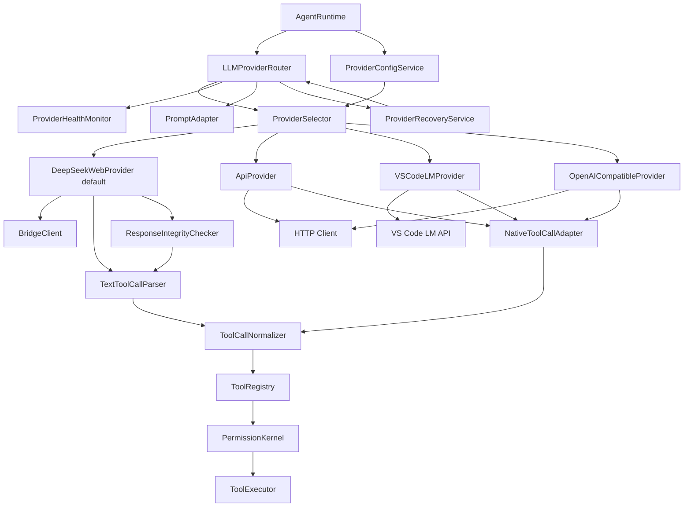
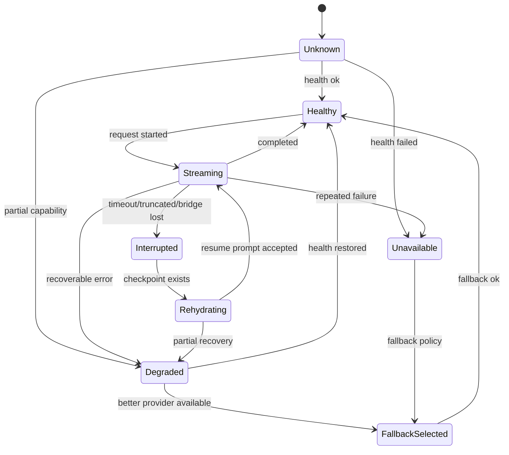
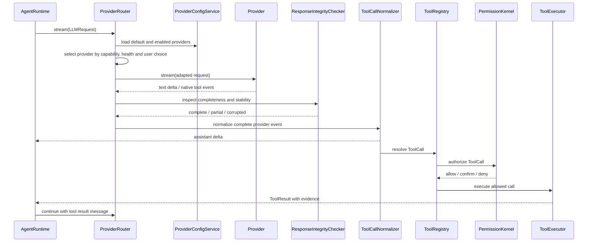
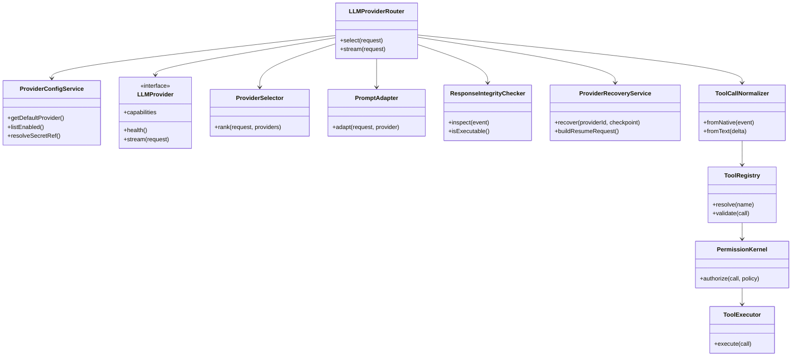

# DevSeek 模型供应商与工具协议架构设计

文档编号：ARCH-02
最后更新：2026-06-18
对应需求：[../requirements/02-顶级编程智能体需求基线.md](../requirements/02-顶级编程智能体需求基线.md)、[../requirements/07-架构重构需求澄清.md](../requirements/07-架构重构需求澄清.md)
状态：活跃模型与工具协议设计

## 1. 设计目标

本设计不再把 Provider 当成“换模型的 HTTP 客户端”。顶级编程智能体需要的是统一的模型能力契约和工具调用协议：不同 Provider 可以有不同能力，但进入 DevSeek Agent Runtime 后必须被规范化为同一套消息、工具调用、权限和证据结构。

目标：

1. DeepSeek Web Bridge 作为默认 Provider，保留低门槛网页路径。
2. 支持 API Provider 直接接入 DeepSeek API、OpenAI-compatible、本地模型和企业私有模型。
3. 支持 API Provider 的原生 function calling / structured output。
4. 支持 VS Code LM、OpenAI compatible、企业私有 Provider。
5. 把工具调用统一转换为 `ToolCall`，再交给 `ToolRegistry`、`PermissionKernel`、`ToolExecutor`。
6. Provider 失败时可健康检查、降级、重试和回退，不污染工作流状态。
7. DeepSeek Web 响应必须经过完整性检测；截断、重复、未闭合工具块不能进入执行链。
8. Provider 恢复只恢复模型会话，不重复执行已完成的副作用工具。

## 2. 能力模型

```typescript
export interface LLMProviderCapabilities {
  streaming: boolean;
  systemPrompt: boolean;
  nativeToolCalling: boolean;
  structuredOutput: boolean;
  toolResultMessages: boolean;
  reasoningEffort?: boolean;
  vision?: boolean;
  maxInputTokens?: number;
  maxOutputTokens?: number;
  resumableSession?: boolean;
  responseIntegritySignals?: boolean;
}

export interface LLMProvider {
  id: string;
  displayName: string;
  capabilities: LLMProviderCapabilities;
  health(): Promise<ProviderHealth>;
  stream(request: LLMRequest): AsyncIterable<LLMEvent>;
}

export interface LLMProviderConfig {
  id: string;
  kind: 'deepseek-web' | 'api' | 'openai-compatible' | 'vscode-lm' | 'local' | 'enterprise';
  enabled: boolean;
  priority: number;
  model?: string;
  baseUrl?: string;
  secretRef?: string;
  defaultFor?: WorkflowMode[];
}
```

设计约束：

1. Workflow 不判断 Provider 细节，只读取能力和统一事件。
2. Provider 不执行工具，只产生候选工具调用。
3. DeepSeek Web 的 `[TOOL:name {...}]` 是兼容输入，不是 Agent 内部协议。
4. 工具调用参数必须经过 schema 校验和权限判定。
5. API key、cookie、token 只能通过 `secretRef` 引用，不能进入 prompt、任务历史、记忆或日志。

## 3. 默认 Provider 与 API 接入策略

默认策略：

1. 首次启动和未配置模型时，`ProviderSelector` 选择 `DeepSeekWebProvider`。
2. 用户显式配置 API Provider 后，`ProviderConfigService` 记录 provider id、base url、model、capabilities 和 secret 引用。
3. API Provider 可以直接接入 DeepSeek API、OpenAI-compatible、本地模型、企业网关；接入后仍只实现 `LLMProvider`，不能改 Agent Runtime。
4. Provider 切换只影响模型请求和能力降级，不影响 `ToolRegistry`、`PermissionKernel`、`QualityGateService`、`TaskHistoryStore`、`MemoryService`。
5. DeepSeek Web 不可用时，可提示切换 API Provider；fallback 必须继承同一 workflow id、checkpoint、ReviewLedger 和 idempotency ledger。
6. 低能力 Provider 不能绕过功能缺口，例如无原生工具调用时必须走文本工具解析和完整性检查，无 structured output 时必须标低置信并进入校验。

## 4. 架构图



## 5. Provider 状态图



## 6. 请求时序图



## 7. 类图



## 8. 工具协议

```typescript
export interface ToolDefinition {
  name: string;
  kind: 'read' | 'search' | 'edit' | 'terminal' | 'network' | 'mcp' | 'memory' | 'vscode' | 'plan';
  description: string;
  inputSchema: JsonSchema;
  outputSchema: JsonSchema;
  mutatesWorkspace: boolean;
  requiresConfirmation: boolean;
  riskLevel: 'low' | 'medium' | 'high' | 'critical';
  allowedInModes: WorkflowMode[];
}

export interface ToolCall {
  id: string;
  name: string;
  input: unknown;
  origin: 'native-tool' | 'text-tool' | 'user-action' | 'hook';
  providerId?: string;
  operationId: string;
  replayPolicy: 'never' | 'read-only' | 'requires-confirmation';
}

export interface ToolResult {
  id: string;
  toolName: string;
  ok: boolean;
  structured?: unknown;
  summary: string;
  evidence: EvidenceRef[];
  error?: ToolError;
}
```

## 9. Provider 能力降级

| Provider 能力 | 优先实现 | 降级路径 |
| --- | --- | --- |
| 原生工具调用 | 直接输出 `ToolCall` | 文本工具解析后规范化 |
| structured output | JSON schema 校验 | 从文本提取计划并标低置信 |
| system prompt | 独立 system message | 合并到首条开发者上下文 |
| tool result message | role=tool 回传 | 摘要化为 assistant/user 上下文 |
| streaming | 增量事件 | 非 streaming Provider 输出完整响应 |
| 大上下文 | 完整 ContextAssembly | 预算裁剪和来源报告 |
| 响应完整性信号 | Provider 原生 finish reason / tool status | `ResponseIntegrityChecker` 基于文本块、工具闭合、停止原因和超时判断 |
| 可恢复会话 | Provider session id / thread id | `TaskCheckpointStore` 重建恢复 prompt |
| 默认可用性 | DeepSeek Web 默认 Provider | 用户配置的 API Provider 接管同一 workflow 和 checkpoint |
| API secret | VS Code SecretStorage / OS keychain | 禁止落入任务历史、记忆、prompt 和普通日志 |

## 10. 安全边界

1. Provider 无权决定是否执行工具。
2. Provider 无权绕过 protected files、workspace boundary、network confirmation。
3. Provider 失败不能直接重试破坏性工具。
4. 任何 fallback 都必须保留同一 workflow id 和审计事件。
5. DeepSeek Web Bridge 的 DOM/Playwright 变化只影响 `DeepSeekWebProvider`，不能泄漏到 Agent Runtime。
6. 响应截断、重复、半段 diff、半段工具调用必须进入 blocked 状态，不能被 normalizer 执行。
7. 任何 Provider retry 都必须经过 `IdempotencyGuard`，避免重复写盘、重复执行终端、重复调用 destructive MCP。
8. API Provider 的 `apiKey`、cookie、session token 只能保存在 SecretStorage 或系统密钥链，Provider transcript 只能保存摘要和 hash。

## 11. 迁移路径

1. 保留当前 `llm/provider-router.ts` 作为入口，扩展 capabilities 和 health。
2. 新增 `ProviderConfigService`，默认选择 DeepSeek Web，并支持 API Provider 配置、secret 引用和健康状态。
3. 把 `agent-loop.ts` 中的文本伪工具解析迁入 `ToolCallNormalizer`。
4. 把 Provider 响应统一转换为 `LLMEvent`，再由 Runtime 消费。
5. 给 DeepSeek Web、DeepSeek API、OpenAI-compatible、本地 API Provider、VS Code LM 写同一套 contract tests。
6. 在所有工具调用进入执行器前，强制经过 `ToolRegistry.validate()` 和 `PermissionKernel.authorize()`。
7. DeepSeek Web Bridge 先增加 `ResponseIntegrityChecker` 和 `ProviderRecoveryService`，再开放自动恢复。
8. 工具执行先增加 `operationId` 和 replay policy，再允许 Provider retry。

## 12. 验收标准

1. 无用户配置时，默认 Provider 是 DeepSeek Web Bridge。
2. 配置 API Provider 后，可使用 base url、model 和 secret 引用接入同一 Agent Runtime。
3. DeepSeek Web 文本工具和 API native tool calling 都规范化为同一种 `ToolCall`。
4. Provider 切换、fallback 或恢复不会重复执行已提交副作用。
5. Provider secret 不出现在 prompt、任务历史、记忆、ReviewLedger 或普通日志中。
