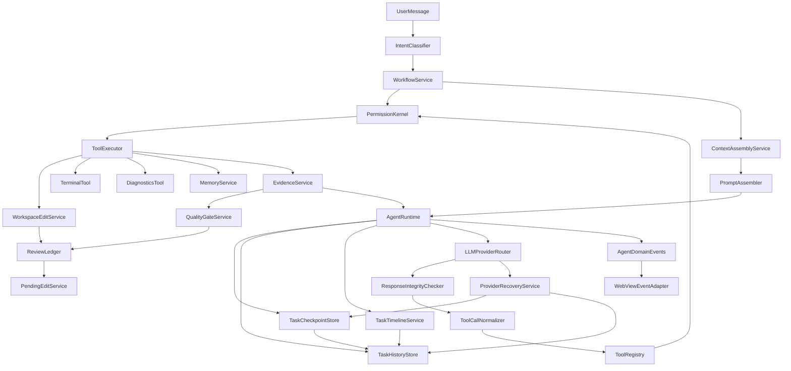
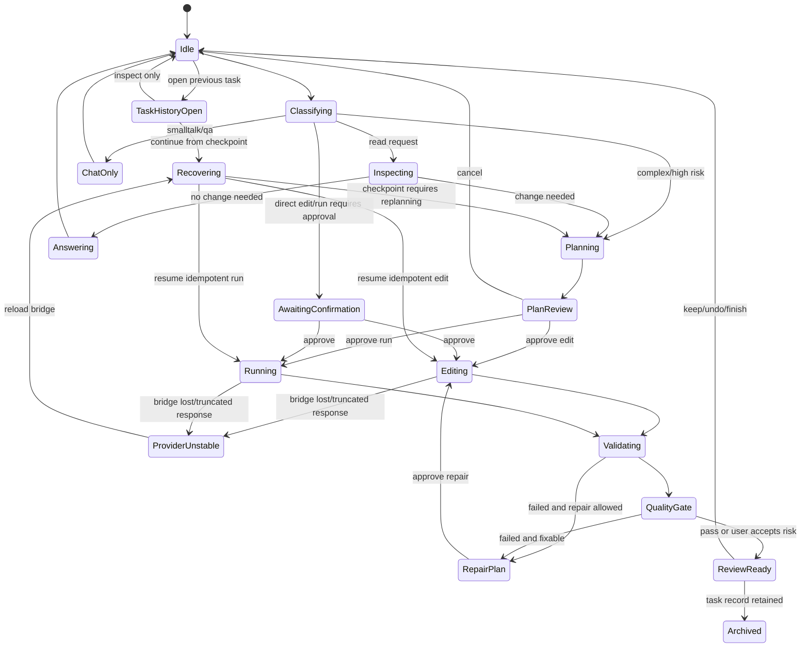
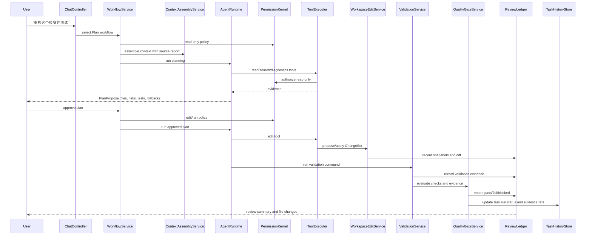
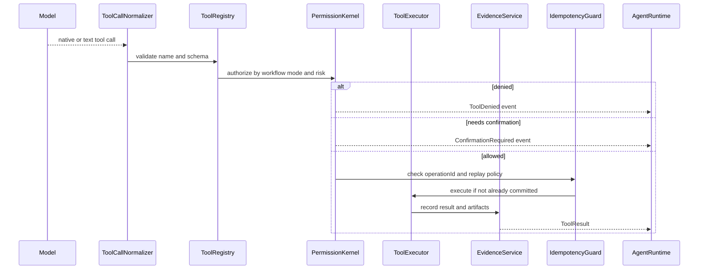
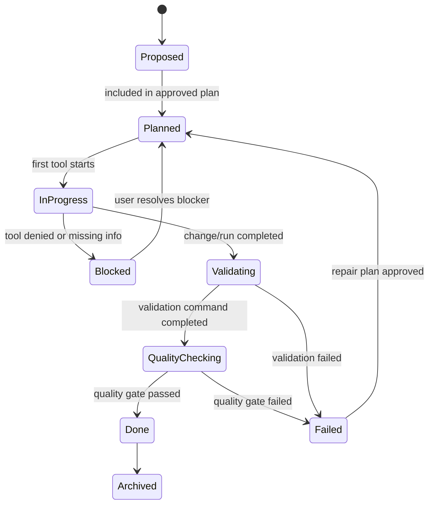
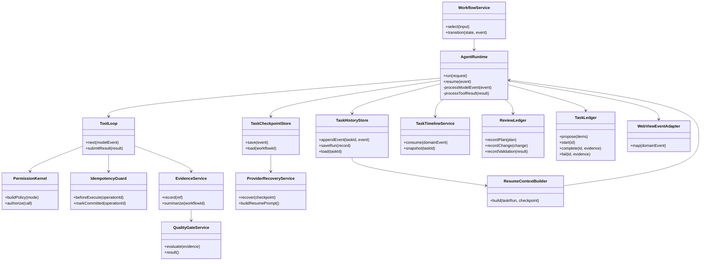

---
devseek_governance:
  generator: "devseek-doc-governance/v1"
  status: "historical"
  path: "docs/architecture/03-Agent运行时与工作流重构设计.md"
  source_group: "architecture"
  decision: "keep"
  relationship: "legacy-architecture"
  active_baselines:
    - "docs/architecture/01-顶级编程智能体总体架构设计.md"
  machine_sources:
    active_selector: "docs/process/devseek-active-baseline-selector.json"
    legacy_inventory: "docs/process/devseek-legacy-doc-inventory.json"
  asserts_gate_pass: false
---

<!-- DEVSEEK-GOVERNANCE-BANNER:START -->
> [!NOTE]
> DevSeek governance: this document is `historical` with decision `keep` and relationship `legacy-architecture`. Current authority: `docs/architecture/01-顶级编程智能体总体架构设计.md`. Machine source: `docs/process/devseek-legacy-doc-inventory.json`.
<!-- DEVSEEK-GOVERNANCE-BANNER:END -->

# DevSeek Agent 运行时与工作流重构设计

文档编号：ARCH-03
最后更新：2026-06-18
对应需求：[../requirements/02-顶级编程智能体需求基线.md](../requirements/02-顶级编程智能体需求基线.md)、[../requirements/07-架构重构需求澄清.md](../requirements/07-架构重构需求澄清.md)
状态：后续 Agent 主链路重构设计

## 1. 设计目标

DevSeek Agent Runtime 是一个“模型可替换、工具可治理、执行可验证”的本地智能体内核。它的目标不是让模型自由操作 IDE，而是把 Claude Code 的 Plan/工具治理、Codex 的 sandbox/patch/review、Copilot 的 IDE 原生体验组合成 DevSeek 的可演进主链路。

核心目标：

1. Chat、Inspect、Plan、Edit、Run、Review 有明确状态和转换条件。
2. 模型输出只产生建议、计划、工具调用和摘要，事实状态由工具结果和验证结果决定。
3. 工具执行统一经过 schema、权限、审计、错误恢复。
4. 文件改动进入 ReviewLedger，支持 hunk 级审阅、Keep/Undo、验证和修复循环。
5. DeepSeek Web 输出必须先通过完整性检查和 QualityGate，才能标记为可用。
6. DeepSeek Web Bridge 中断或响应不稳定时，Runtime 必须从本地 checkpoint 恢复任务。
7. Agent 任务必须写入历史任务记录，支持列表显示、打开详情和继续执行。
8. WebView 只消费协议事件，不承载 workflow 决策。

## 2. 当前代码差距

| 当前位置 | 现状 | 目标边界 |
| --- | --- | --- |
| `packages/vscode-extension/src/extension.ts` | 约 5500 行，混合命令、WebView、会话、Provider、文件变更、记忆写入 | VS Code composition root，只注册命令和适配器 |
| `packages/vscode-extension/src/agent-loop.ts` | 约 3600 行，混合 prompt、工具解析、执行、验证、UI 事件、记忆工具 | 拆成 Runtime、PromptAssembler、ToolLoop、Evidence、Validation |
| `app/chat-controller.ts` | 已有意图路由雏形 | 扩展为纯应用入口，输出 workflow request |
| `app/workflow-service.ts` | 已能区分 plain/inspect/plan/edit/run | 扩展为状态机和确认点 |
| `app/permission-service.ts` | 已有 ToolPolicy | 升级为统一 PermissionKernel |
| `agent/tool-registry.ts` | 已有工具元数据 | 增加 schema、mode、risk、audit |
| `workspace/edit-service.ts` | 已有编辑能力 | 统一 change set、hunk、snapshot、rollback |
| DeepSeek Web Bridge | 回复可能截断、重复、断线或刷新 | 需要完整性检查、任务 checkpoint、幂等重放保护和恢复 prompt |
| 验证闭环 | 有局部验证和失败修复能力 | 需要独立 `QualityGateService` 决定 pass/fail/blocked |
| 历史任务 | 当前有 session history 和旧版单 checkpoint | 需要 `TaskHistoryStore` 保存任务事实，`TaskTimelineService` 聚合事件，`ResumeContextBuilder` 构建续作上下文 |

## 3. Agent 主架构图

## 4. 模块层次图

```mermaid
flowchart LR
  subgraph UI["UI Boundary"]
    Webview[WebView]
    Commands[VS Code Commands]
  end
  subgraph App["Application Services"]
    Chat[ChatController]
    Workflow[WorkflowService]
    Permission[PermissionKernel]
    Session[SessionService]
    TaskHistory[TaskHistoryStore]
    Resume[ResumeContextBuilder]
  end
  subgraph Runtime["Agent Runtime"]
    Agent[AgentRuntime]
    Prompt[PromptAssembler]
    Tools[ToolLoop]
    Evidence[EvidenceService]
    Ledger[TaskLedger]
    Checkpoint[TaskCheckpointStore]
    Timeline[TaskTimelineService]
    Gate[QualityGateService]
  end
  subgraph Domain["Domain Model"]
    WorkflowState[WorkflowState]
    ToolCall[ToolCall]
    ChangeSet[ChangeSet]
    MemoryRecord[MemoryRecord]
    QualityGateResult[QualityGateResult]
    TaskCheckpoint[TaskCheckpoint]
    TaskRunRecord[TaskRunRecord]
  end
  subgraph Infra["Infrastructure"]
    LLM[LLM Providers]
    Bridge[DeepSeek Web Bridge]
    WS[Workspace APIs]
    FS[Storage]
    Shell[Terminal]
    MCP[MCP]
  end

  UI --> App
  App --> Runtime
  Runtime --> Domain
  Runtime --> Infra
  App --> Domain
```

## 5. 工作流状态图

## 6. Plan 到 Edit 时序图

## 7. 工具执行时序图

## 8. 任务状态图

Todo 规则：

1. 模型可以建议 todo，但不能直接把 todo 标为完成。
2. `TaskLedger` 只能根据工具结果、文件变更、验证结果或用户确认更新状态。
3. UI 展示的任务状态来自 `TaskLedger`，不是 assistant prose。

## 9. 核心类图

## 10. 工作流模式与权限

| 模式 | 允许工具 | 默认确认 | 禁止 |
| --- | --- | --- | --- |
| Chat | 无工具或只读上下文 | 无 | 写盘、终端、网络、MCP write |
| Inspect | read/search/diagnostics | 无 | edit、terminal、network write |
| Plan | read/search/diagnostics/plan | 无 | edit、破坏性 terminal、network write |
| Edit | read/search/diagnostics/edit | 受保护文件、批量写入 | 越界写入、敏感文件绕过 |
| Run | read/search/diagnostics/terminal | terminal 默认确认 | 写盘，除非切换 Edit |
| Auto | read/search/diagnostics/edit/terminal | 高风险命令、受保护文件 | 越界、网络默认关闭 |

权限不是 prompt 文案，而是执行前的硬门禁。

## 11. 事件协议

Agent Runtime 只产出领域事件：

| 事件 | 说明 |
| --- | --- |
| `WorkflowStarted` | 模式、原因、权限策略 |
| `ContextAssembled` | 上下文来源、预算、裁剪 |
| `PlanProposed` | 文件、风险、验证、回退 |
| `TaskRunCreated` / `TaskRunUpdated` | 任务标题、状态、session 关联、checkpoint 和证据引用 |
| `TaskHistoryOpened` | 用户打开历史任务详情 |
| `TaskContinueRequested` | 用户要求从历史任务继续 |
| `ToolStarted` / `ToolFinished` | 工具名、参数摘要、结果摘要 |
| `WorkspaceChangeProposed` | change set、hunk、风险 |
| `WorkspaceChangeApplied` | snapshot、pending edit id |
| `ValidationFinished` | 命令、退出码、摘要 |
| `ResponseIntegrityFailed` | DeepSeek Web 回复截断、重复、格式损坏或工具块不完整 |
| `ProviderRecoveryStarted` / `ProviderRecoveryFinished` | Bridge 重连、任务 rehydrate、恢复 prompt 结果 |
| `QualityGateFinished` | pass/fail/blocked、检查项、证据和下一步 |
| `IdempotencyReplayBlocked` | 恢复时阻断重复副作用 |
| `MemoryWriteProposed` | 记忆候选、scope、风险 |
| `WorkflowFinished` | 事实摘要、未完成事项 |

WebView 只能消费这些事件并渲染，不能反向拼业务逻辑。

## 12. DeepSeek Web 质量门禁

专项设计见 [07-DeepSeek网页异常与恢复设计.md](07-DeepSeek网页异常与恢复设计.md)。Runtime 必须把 DeepSeek Web 输出视为不可信输入：

1. `ResponseIntegrityChecker` 先判断回复是否完整、可解析、无重复工具块。
2. `ToolCallNormalizer` 只处理完整回复。
3. `WorkspaceEditService` 应用 change set 前后都写入 checkpoint。
4. `VerificationPlanner` 根据项目规则选择 build/test/lint/run。
5. `QualityGateService` 决定 pass/fail/blocked。
6. `WorkflowFinished` 只能在 QualityGate pass 或用户明确接受风险后产生。

## 13. DeepSeek Web 恢复策略

DeepSeek Web Bridge 失败不等于任务失败。Runtime 恢复策略：

1. 每个 workflow event 都进入 `TaskCheckpointStore`。
2. 关键 workflow event 同步进入 `TaskHistoryStore`，用于历史任务列表、详情和恢复审计。
3. Provider 断线、限流、登录失效、DOM 变化、输出截断时，先暂停副作用执行。
4. `ProviderRecoveryService` 恢复 transport 后，用 `ResumeContextBuilder` 从最后稳定 checkpoint 和任务记录生成最小恢复上下文。
5. `IdempotencyGuard` 阻止重复执行已 committed 的写盘、终端和 MCP 工具。
6. checkpoint 与模型恢复输出冲突时，本地 evidence 优先。

## 14. 历史任务续作策略

专项设计见 [08-历史任务与续作架构设计.md](08-历史任务与续作架构设计.md)。Runtime 对历史任务的规则：

1. 每个进入 Plan/Edit/Run 的 Agent 任务都有 `taskId`，且创建 `TaskRunRecord`。
2. `SessionService` 只负责聊天 UI；任务事实进入 `TaskHistoryStore`。
3. `TaskTimelineService` 从领域事件聚合任务详情，不允许 WebView 直接读取内部存储。
4. 打开历史任务默认只读展示；点击继续后才构建 `ResumeRequest`。
5. 继续任务前必须加载 checkpoint、已提交 operation、change set hash 和 QualityGate 状态。
6. 没有 checkpoint 的旧任务只能作为上下文继续，不能自动重放工具。
7. 任务完成后可以提炼 M1/M3/M5 记忆，但长期记忆写入必须走 `MemoryService` 审批。

## 15. 革命性目标

DevSeek 要重构成“Agent OS”式内核：

1. **Policy-first**：模型永远不能越权，所有动作由策略内核批准。
2. **Evidence-first**：完成状态来自证据，不来自模型自述。
3. **Review-first**：代码变更默认可审阅、可分块接受、可撤销。
4. **History-first**：重要任务可被打开、审计、恢复和继续，不依赖用户重新描述。
5. **Memory-governed**：记忆体有 schema、scope、审批、冲突和删除。
6. **Provider-agnostic**：DeepSeek Web 只是一个 Provider，不再定义架构上限。
7. **Extensible Agent**：hooks、skills、subagents、MCP 都是注册式扩展，不进入主入口大分支。
8. **Recoverable Web Runtime**：网页 Provider 不稳定时，任务能从本地 checkpoint 继续。

## 16. 验收标准

1. 新增 Plan Mode 后，Plan 阶段无法触发写盘或破坏性终端。
2. 任意工具执行都有 `ToolCall`、权限判定、`ToolResult` 和 evidence。
3. 任意文件变更都有 ReviewLedger 记录和 PendingEdit 快照。
4. Runtime 可在至少两类 Provider 下使用同一工具协议。
5. `extension.ts` 新增业务逻辑行数受控，核心职责迁入服务模块。
6. DeepSeek Web 输出不完整时不会写盘、不会执行终端、不会标记完成。
7. DeepSeek Web Bridge 中断后能从 checkpoint 恢复，且不会重复执行已提交副作用。
8. 历史任务能显示目标、计划、todo、变更、验证和 QualityGate，并能从可恢复 checkpoint 继续。
