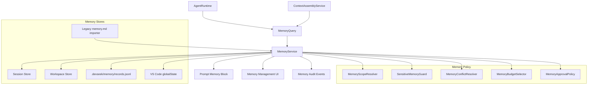
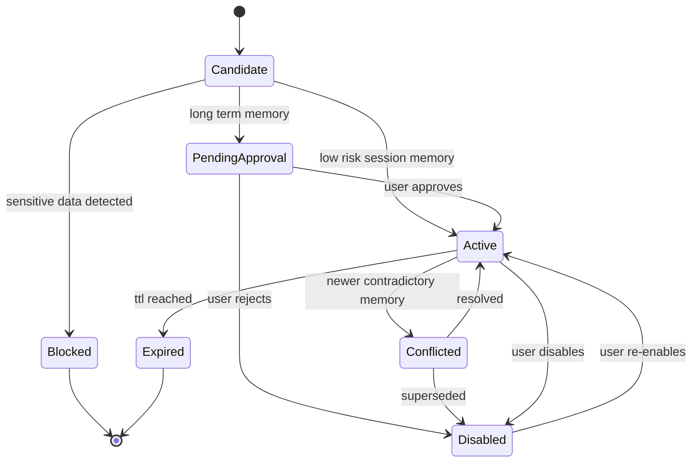
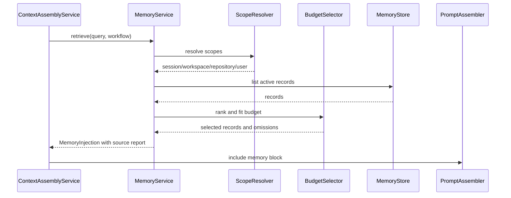
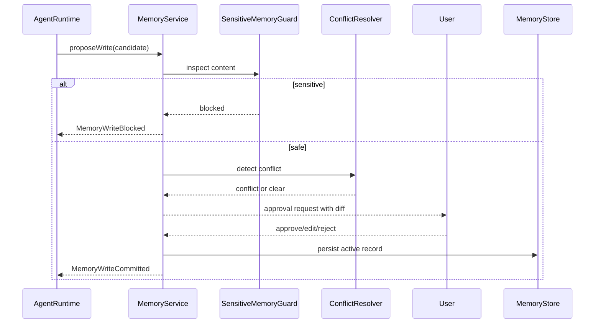
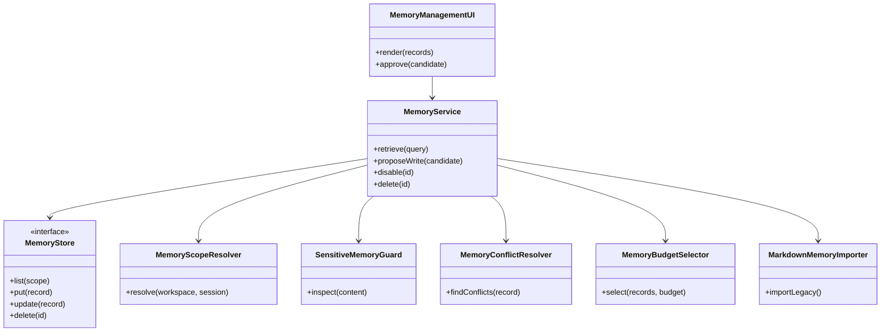

---
devseek_governance:
  generator: "devseek-doc-governance/v1"
  status: "historical"
  path: "docs/architecture/04-记忆体架构设计.md"
  source_group: "architecture"
  decision: "keep"
  relationship: "legacy-architecture"
  active_baselines:
    - "docs/architecture/01-顶级编程智能体总体架构设计.md"
  machine_sources:
    active_selector: "docs/process/devseek-active-baseline-selector.json"
    legacy_inventory: "docs/process/devseek-legacy-doc-inventory.json"
  asserts_gate_pass: false
---

<!-- DEVSEEK-GOVERNANCE-BANNER:START -->
> [!NOTE]
> DevSeek governance: this document is `historical` with decision `keep` and relationship `legacy-architecture`. Current authority: `docs/architecture/01-顶级编程智能体总体架构设计.md`. Machine source: `docs/process/devseek-legacy-doc-inventory.json`.
<!-- DEVSEEK-GOVERNANCE-BANNER:END -->

# DevSeek 记忆体架构设计

文档编号：ARCH-04
最后更新：2026-06-18
对应需求：[../requirements/06-记忆体需求.md](../requirements/06-记忆体需求.md)、[../requirements/07-架构重构需求澄清.md](../requirements/07-架构重构需求澄清.md)
状态：活跃记忆体设计

## 1. 设计目标

记忆体不是“把更多文本塞进 prompt”，而是让 DevSeek 在长期使用中可靠复用信息，同时保持可解释、可删除、可审计、可回退。

目标：

1. 分离项目规则、用户偏好、会话摘要、项目经验、工具验证经验和敏感阻断记录。
2. 读取时给出来源、scope、置信度、token 预算和裁剪原因。
3. 写入时经过敏感信息阻断、冲突检测、用户确认和 TTL/status 管理。
4. 记忆体不能替代权限、hooks、项目规则或用户本轮明确指令。
5. `.devseek/memory.md` 进入兼容导入层，新长期记忆使用结构化 records。

## 2. 当前问题

| 当前位置 | 行为 | 问题 |
| --- | --- | --- |
| `project-rules.ts` | 同时读取 `.devseek/rules.md` 和 `.devseek/memory.md` | 规则与记忆边界混淆 |
| `extension.ts` | 多处直接 append `.devseek/memory.md` 并注入 prompt | 无 schema、无审批、无敏感阻断 |
| `agent-loop.ts` | 直接声明和处理 `memory_write` | Runtime 知道存储形态 |
| `session-service.ts` | 只管理 session meta | summary、recent files、agent state 未聚合 |

## 3. 记忆体架构图



## 4. 记忆 schema

```typescript
export type MemoryType =
  | 'session-summary'
  | 'task-summary'
  | 'project-experience'
  | 'user-preference'
  | 'tool-validation'
  | 'workflow-lesson'
  | 'blocked-sensitive';

export type MemoryScope =
  | { kind: 'session'; sessionId: string }
  | { kind: 'workspace'; workspaceId: string }
  | { kind: 'repository'; root: string; branch?: string }
  | { kind: 'user' };

export interface MemoryRecord {
  id: string;
  type: MemoryType;
  scope: MemoryScope;
  content: string;
  source: {
    kind: 'user' | 'agent' | 'project-file' | 'session-summary' | 'tool-result' | 'migration';
    ref?: string;
  };
  confidence: number;
  status: 'candidate' | 'pending-approval' | 'active' | 'conflicted' | 'disabled' | 'expired' | 'blocked';
  createdAt: number;
  updatedAt: number;
  lastUsedAt?: number;
  ttlMs?: number;
  tags: string[];
  evidence?: Array<{ kind: 'file' | 'command' | 'diagnostic' | 'user-message'; ref: string }>;
}
```

## 5. 记忆状态图



## 6. 读取注入时序图



## 7. 写入审批时序图



## 8. 类图



## 9. 存储策略

| scope | 默认存储 | 说明 |
| --- | --- | --- |
| session | VS Code workspaceState | 当前会话摘要、agent state、短期任务事实 |
| workspace | VS Code workspaceState | 本地项目经验，不进入仓库 |
| repository | `.devseek/memory/records.jsonl` | 可共享的非敏感项目经验 |
| user | VS Code globalState | 用户偏好，默认不写仓库 |
| legacy | `.devseek/memory.md` | 只读导入来源，逐步淘汰 |

第一阶段不强制删除 `.devseek/memory.md`，但新写入必须走 `MemoryService`。人类可读视图可由 records 生成，不能把 markdown append 作为唯一真相。

### 与历史任务存储的分工

历史任务设计见 [08-历史任务与续作架构设计.md](08-历史任务与续作架构设计.md)。记忆体与任务历史必须分层：

1. `TaskHistoryStore` 保存任务事实，包括目标、计划、todo、change set、工具结果、验证、QualityGate 和 checkpoint。
2. `MemoryService` 只保存可复用经验、用户偏好、任务摘要和验证经验，不保存完整任务过程。
3. 完成任务后，`TaskSummaryExtractor` 可把任务摘要提议写入 M1/M3/M5，但必须经过敏感信息阻断和冲突检测。
4. 未通过验证的任务不能写入项目经验记忆，只能保留为历史任务事实。
5. 删除历史任务时，应提示用户是否同时处理由该任务提炼出的长期记忆。

## 10. 敏感信息阻断

默认阻断：

1. API key、token、cookie、私钥、证书、密码。
2. 未经用户确认的个人身份信息。
3. 代码仓库外路径中的私密目录内容。
4. 终端输出中的凭据和环境变量原文。

阻断记录只保存摘要，例如“2026-06-18 阻断一次疑似 API token 写入”，不保存敏感原文。

## 11. 注入规则

1. 当前用户明确指令优先级最高。
2. 项目规则高于记忆体。
3. active 且 scope 匹配的记忆才可注入。
4. 冲突记忆不得默认注入。
5. 低置信记忆只能作为“可能相关”出现在可解释报告中。
6. 记忆 block 必须包含来源编号，便于用户追溯和删除。

## 12. 验收标准

1. `memory_write` 不再直接知道 `.devseek/memory.md` 路径。
2. 每条长期记忆都有 type、scope、source、status、confidence。
3. 读取注入可输出来源和预算报告。
4. 敏感信息写入会被阻断并有测试覆盖。
5. 用户可查看、禁用、删除或批准长期记忆。
