# DevSeek 代码重构实施计划

文档编号：ARCH-05
最后更新：2026-06-18
对应设计：[01-顶级编程智能体总体架构设计.md](01-顶级编程智能体总体架构设计.md)、[02-模型供应商与工具协议架构设计.md](02-模型供应商与工具协议架构设计.md)、[03-Agent运行时与工作流重构设计.md](03-Agent运行时与工作流重构设计.md)、[04-记忆体架构设计.md](04-记忆体架构设计.md)、[06-竞品实现方式对标审计与设计修正.md](06-竞品实现方式对标审计与设计修正.md)、[07-DeepSeek网页异常与恢复设计.md](07-DeepSeek网页异常与恢复设计.md)、[08-历史任务与续作架构设计.md](08-历史任务与续作架构设计.md)、[09-程序员工程完整性架构设计.md](09-程序员工程完整性架构设计.md)、[10-运行形态与界面解耦架构设计.md](10-运行形态与界面解耦架构设计.md)、[11-需求设计覆盖最终审计.md](11-需求设计覆盖最终审计.md)
状态：后续代码实施计划
建议开发分支：`devseek-multi`

## 1. 实施原则

1. **代码重构第一原则：实现必须符合设计原则和架构边界。** 如果必要功能暴露出单一职责、依赖倒置、接口隔离或迪米特法则问题，先小步重构边界，再落功能。
2. 先建立边界，再迁移职责，最后增强能力。
3. 每一阶段都必须能独立测试、独立回退。
4. 不做“大爆炸重写”，但目标态必须是革命性的 Agent Runtime，不继续给大文件堆分支。
5. 任何写盘、终端、网络、MCP、VS Code command 的新增路径，都必须先接入权限和审计。
6. 新增界面或入口时，必须先接入 `AgentCommand` / `AgentEvent` 和 Surface Adapter，不能复制 Agent 业务逻辑。
7. 多入口重构在 `devseek-multi` 分支推进，main 只接收阶段完成、测试通过、可回退的合并。
8. 修改 Extension 或 Bridge 行为后，按仓库要求执行 compile、package、install VSIX 的本地发布环。

## 2. 当前代码差异审计

| 模块 | 当前状态 | 设计差距 |
| --- | --- | --- |
| `extension.ts` | 约 5500 行，承载 UI、会话、Provider、Agent、文件变更、记忆 | 需要瘦身为 VS Code composition root |
| `agent-loop.ts` | 约 3600 行，承载 prompt、伪工具、执行、验证、UI 事件 | 需要拆为 Runtime、ToolLoop、PromptAssembler、Evidence |
| `app/chat-controller.ts` | 约 80 行，已有路由雏形 | 扩展为应用入口，不直接碰 UI/存储 |
| `app/workflow-service.ts` | 已区分 plain/inspect/plan/edit/run | 升级为工作流状态机和确认点 |
| `app/permission-service.ts` | 已有 ToolPolicy | 扩展到写盘、终端、网络、MCP、VS Code command |
| `agent/tool-registry.ts` | 已有工具定义 | 增加 schema、risk、mode、audit、输出类型 |
| `agent/tool-executor.ts` | 已有分类和权限判断 | 接入统一 ToolCall/ToolResult 和 Evidence |
| `project-rules.ts` | 规则与记忆混读 | 拆为 ProjectInstructionService 和 MemoryService |
| `workspace/*` | 已有应用与 pending edit 能力 | 收口 ChangeSet、hunk、snapshot、ReviewLedger |
| `llm/*` | ProviderRouter、DeepSeek Web Bridge、DeepSeek API、OpenAI-compatible 已有雏形 | 增加 `ProviderConfigService`、DeepSeek Web 默认选择、API Provider 直连配置、capabilities、health、fallback、ToolCallNormalizer |
| `app/session-service.ts` | 已有历史对话 meta/history/summary/files | 保留为聊天历史，新增 `TaskHistoryStore` 保存任务事实和续作状态 |
| 工程上下文 | 主要依赖 recent files、文本搜索、附件和诊断拼接 | 新增 `EngineeringContextService`、`CodebaseIndexService`、`EnvironmentProfileService`、`LanguageRuntimeRegistry`、`ContentExclusionService` |
| 写入冲突 | 已有 pending edit 和回退，但写入前用户并发修改保护不足 | 新增 `ConflictGuard`，写盘前检查 hash、mtime、dirty editor 和并发任务 |
| 成本/预算 | API Provider 与 DeepSeek Web 的成本、token、速率状态不统一 | 新增 `UsageBudgetService`，所有 Provider 输出 usage estimate 和 retry budget |
| 运行形态 | 当前主入口是 VS Code 插件，WebView/extension 仍容易牵引业务实现 | 新增 `AgentApplicationService`、`SurfaceAdapter`、`AgentCommand` / `AgentEvent`，为 VS Code、CLI、JSONL、桌面/本地 Web 共用 |
| 跨平台运行 | 终端、路径、浏览器桥接和存储差异未形成统一边界 | 新增 `PlatformRuntimeAdapter`、`ShellAdapter`、`PathAdapter`、`StorageAdapter`、`BrowserBridgeAdapter` |
| 构建方式 | 当前已有 shared build、bridge build/start/test、extension compile/watch/test/VSIX package | 新增 BuildProfile 和多目标矩阵，逐步纳入 CLI TUI、CLI JSONL、future desktop/local web |
| `packages/bridge/*` | 已拆出部分 browser/session/extractor，仍可能受 DOM、登录、限流、截断影响 | 增加 BridgeHealthMonitor、ResponseIntegrityChecker、ProviderRecoveryService |
| 验证与最终摘要 | 有验证失败范围收敛，但质量结论仍分散 | 增加 QualityGateService，未通过不能标记完成 |

## 3. 阶段路线图

```mermaid
flowchart LR
  P0[Phase 0 架构守卫] --> P1[Phase 1 指令与上下文]
  P1 --> P2[Phase 2 记忆体收口]
  P2 --> P3[Phase 3 工具协议与权限内核]
  P3 --> P4[Phase 4 Workflow 状态机]
  P4 --> P5[Phase 5 文件变更与 ReviewLedger]
  P5 --> P6[Phase 6 QualityGate 与自检查]
  P6 --> P7[Phase 7 历史任务与 Web 异常恢复]
  P7 --> P8[Phase 8 Provider Runtime]
  P8 --> P9[Phase 9 UI 协议与入口瘦身]
  P9 --> P10[Phase 10 运行形态与界面解耦]
  P10 --> P11[Phase 11 工程完整性补强]
  P11 --> P12[Phase 12 hooks/skills/subagents/MCP 增强]
```

## 4. Phase 0：架构守卫与测试基线

覆盖：REQ-07。

代码动作：

1. 新增架构守卫测试，阻止新业务默认进入 `extension.ts` 和 `agent-loop.ts`。
2. 建立 `app/*`、`agent/*`、`workspace/*`、`memory/*`、`llm/*` 的导出边界。
3. 记录当前单测、编译、打包基线。

验收：

1. 变更不改变用户行为。
2. 测试能发现新增的跨层直接依赖。

Phase 0 基线记录（2026-06-18）：

1. 新增 `src/app/index.ts`、`src/agent/index.ts`、`src/workspace/index.ts`、`src/llm/index.ts`、`src/memory/index.ts` 作为领域公开导出边界。
2. 新增 `src/memory/types.ts`，只建立记忆体 schema 类型边界，不改变运行行为。
3. 新增 `test/unit/architecture-boundary.test.mjs`，守卫 `extension.ts` 和 `agent-loop.ts` 不继续增长，并检查领域模块不反向依赖 legacy 入口或 UI 内部实现。
4. 当前组合入口基线：`extension.ts` 不超过 5511 physical lines / 5185 non-blank lines；`agent-loop.ts` 不超过 3609 physical lines / 3350 non-blank lines。
5. 验证基线：新增架构测试通过、27 个 unit suite 全部通过、领域边界入口可独立 esbuild bundle、VS Code extension compile/package/install 通过。

## 5. Phase 1：ProjectInstructionService 与 ContextAssemblyService

覆盖：REQ-A1、REQ-A2、REQ-A3。

代码动作：

1. 新增 `src/app/project-instruction-service.ts`，发现顺序兼容 `AGENTS.md`、`.devseek/rules.md`、`.github/copilot-instructions.md`、`CLAUDE.md`。
2. 新增 `src/app/project-init-service.ts` 或等价初始化工作流，支持 `/init` 生成 `.devseek/rules.md` 或推荐的项目指令草稿，内容包含构建、测试、架构、DoD 和已发现约束；默认只生成草稿或待确认变更。
3. 新增 `src/app/context-assembly-service.ts`，输出 `PromptContext`、`ContextSource[]`、`ContextBudgetReport`。
4. `extension.ts` 先调用新服务，旧 `project-rules.ts` 保留 fallback。

测试：

1. `project-instruction-service.test.mjs`
2. `project-init-service.test.mjs`
3. `context-assembly-service.test.mjs`
4. 现有 intent/workflow 回归。

Phase 1 实施记录（2026-06-18）：

1. 新增 `src/app/project-instruction-service.ts`，统一发现 `AGENTS.md`、`.devseek/rules.md`、`.github/copilot-instructions.md`、`CLAUDE.md`，并支持面向目标文件的近目录指令链。
2. 新增 `src/app/project-init-service.ts`，支持 `/init` 生成 `.devseek/rules.md` 草稿，默认只返回草稿，不自动写盘。
3. 新增 `src/app/context-assembly-service.ts`，输出 `PromptContext`、`ContextSourceReport[]`、`ContextBudgetReport`，并控制上下文截断与遗漏。
4. `src/project-rules.ts` 变为兼容适配器，旧调用路径改为委托 `ProjectInstructionService` 和 `ContextAssemblyService`。
5. VS Code 聊天入口接入 `/init`，但只保留组合根接线逻辑，`extension.ts` 和 `agent-loop.ts` 仍维持 Phase 0 行数基线。
6. 验证基线：Phase 1 新增测试通过、架构守卫通过、30 个 unit suite 全部通过、领域边界入口可独立 esbuild bundle、VS Code extension compile/package/install 通过。

## 6. Phase 2：MemoryService P0

覆盖：REQ-I、MEM-01~MEM-07，设计见 [04-记忆体架构设计.md](04-记忆体架构设计.md)。

代码动作：

1. 沿用 `src/memory/types.ts` schema 边界，新增 `memory-store.ts`、`sensitive-memory-guard.ts`。
2. 新增 `src/app/memory-service.ts`，实现 retrieve、proposeWrite、disable、delete。
3. 把 `extension.ts` 直接 append `.devseek/memory.md` 的逻辑迁入 MemoryService。
4. 把 `agent-loop.ts` 的 `memory_write` 改成 `MemoryWriteProposal`。
5. `.devseek/memory.md` 只作为 legacy importer。

测试：

1. schema/scope/status 单测。
2. 敏感信息阻断单测。
3. legacy markdown 导入兼容测试。
4. Agent memory_write 不知道文件路径的静态测试。

完成基线（2026-06-18）：

1. `MemoryStore`、`SensitiveMemoryGuard`、`MemoryService` 已落地，Agent 新记忆写入结构化 `.devseek/memory.json`。
2. `agent-loop.ts` 已改为发出 `MemoryWriteProposal`，不再知道 `.devseek/memory.md` 路径。
3. `extension.ts`、本地执行修复流程、`project-rules.ts` 已接入 MemoryService；`.devseek/memory.md` 保留为 legacy 导入和手工查看入口。
4. 验证基线：Phase 2 新增测试通过、架构守卫通过、31 个 unit suite 全部通过、VS Code extension compile/package/install 通过。

## 7. Phase 3：工具协议与权限内核

覆盖：REQ-C1/C2/C3、REQ-D1/D2/D3。

代码动作：

1. 扩展 `agent/tool-registry.ts`：schema、risk、allowed modes、mutatesWorkspace。
2. 新增 `agent/tool-call-normalizer.ts`，兼容 function calling 与文本伪工具。
3. 扩展 `app/permission-service.ts` 为 `PermissionKernel`，覆盖 read/edit/terminal/network/mcp/memory/vscode。
4. `ToolExecutor` 输出统一 `ToolResult` 和 `EvidenceRef[]`。

测试：

1. 未注册工具拒绝。
2. Plan 模式禁止 edit/terminal destructive。
3. Edit 模式写 protected file 需要拒绝或确认。
4. 文本伪工具与 native tool 生成同一 `ToolCall`。

完成基线（2026-06-18）：

1. `agent/tool-registry.ts` 已扩展为工具契约注册表，覆盖 `kind`、`risk`、`allowedModes`、`schema`、`mutatesWorkspace`、`requiresTerminal`，并纳入 network、memory、vscode、mcp 工具域。
2. 新增 `agent/tool-call-normalizer.ts`，把文本伪工具和 API native function calling 归一为同一 `ToolCall`，为后续 DeepSeek API、OpenAI-compatible、VS Code LM 等 Provider 共用工具协议打底。
3. `app/permission-service.ts` 已升级为 `PermissionKernel`，保留 `decideToolPermission` 兼容入口；当前覆盖 read/search/diagnostics/network/plan/memory/edit/terminal/vscode/mcp，并对受保护路径写入和破坏性风险给出确认判定。
4. `agent/tool-executor.ts` 已输出统一 `AgentToolExecutionPlan`、`ToolResult`、`EvidenceRef[]`，未注册工具在执行前拒绝。
5. 意图层工具域已与权限策略对齐：Inspect 可读/查网络，Plan/Edit/Run 可携带计划和记忆工具，Destructive 覆盖 VS Code command 与 MCP。
6. 验证基线：Phase 3 新增测试通过，架构守卫、意图路由、行为矩阵、ChatRouteController 回归通过；全量测试、编译、打包、安装记录见变更日志。

## 8. Phase 4：Workflow 状态机与 Plan Mode

覆盖：REQ-B1、REQ-B3。

代码动作：

1. `WorkflowService` 引入状态机和 transitions。
2. Plan/Inspect 使用 read-only policy。
3. 新增 `TaskLedger`，todo 状态由工具和验证事实更新。
4. WebView 增加 PlanReview / ConfirmationRequired 事件渲染。

测试：

1. 复杂重构请求进入 PlanReview。
2. Plan 阶段 edit 工具被拒绝。
3. 用户取消后无文件写入。
4. Todo 完成不能由模型 prose 覆盖。

完成基线（2026-06-19）：

1. `app/workflow-service.ts` 已引入 `WorkflowStateMachine`、`WorkflowState`、`WorkflowTransition`，保留 `selectWorkflow` 兼容入口。
2. 复杂编辑型重构请求先进入 `plan_review`，workflow kind 为 `plan-agent`，`toolPolicyMode` 降级为 `plan`；因此 PlanReview 阶段不能写盘或执行终端命令。
3. `ChatRouteController` 改为按 `workflow.toolPolicyMode` 构建 `ToolPolicy`，让 PlanReview 的权限约束由应用层统一决定，而不是入口层临时判断。
4. `InteractionService` 增加 `planReview` 交互请求；`extension.ts` 和 WebView 协议已接入 `planReview` 消息，并复用现有确认卡渲染。
5. 新增 `app/task-ledger.ts`，todo 状态只能由工具、验证或用户事实更新；模型普通 prose 不能把 todo 标记完成。
6. 验证基线：workflow、interaction、chat-controller、task-ledger、architecture boundary、workflow compliance、intent matrix 回归通过；全量测试、编译、打包、安装记录见变更日志。

## 9. Phase 5：文件变更、ReviewLedger 与验证闭环

覆盖：REQ-E1。

代码动作：

1. 新增 `workspace/change-set.ts` 和 `workspace/review-ledger.ts`。
2. `WorkspaceEditService` 统一 propose/apply/snapshot。
3. `PendingEditService` 承接 hunk、Keep/Undo、Undo All。
4. `ValidationService` 记录命令、退出码、摘要、失败定位文件。

测试：

1. 新建、修改、删除、patch 失败回滚。
2. hunk keep/undo 顺序确定。
3. 验证失败只把定位文件交给修复任务。
4. 完成摘要包含文件、验证、未完成事项。

## 10. Phase 6：QualityGate 与自检查

覆盖需求：REQ-J1、REQ-J2。

代码动作：

1. 新增 `src/app/quality-gate-service.ts`。
2. 新增 `src/app/verification-planner.ts`，根据项目规则、文件类型和变更范围选择验证命令。
3. `ValidationService` 输出结构化 `ValidationEvidence`。
4. `ReviewLedger` 记录 quality gate pass/fail/blocked。
5. `WorkflowFinished` 必须引用 QualityGate 结果；失败时进入 RepairPlanning 或等待用户确认。

测试：

1. DeepSeek Web 生成代码但编译失败时，不标记完成。
2. 无法运行测试时，必须产生替代检查和风险说明。
3. 用户接受风险时，ReviewLedger 记录确认来源。
4. 最终摘要必须绑定 evidence。

## 11. Phase 7：历史任务与 DeepSeek Web 异常恢复

覆盖需求：REQ-J3、REQ-J4、REQ-K1、REQ-K3、REQ-K4，专项设计见 [07-DeepSeek网页异常与恢复设计.md](07-DeepSeek网页异常与恢复设计.md)、[08-历史任务与续作架构设计.md](08-历史任务与续作架构设计.md)。

代码动作：

1. 新增 `src/app/task-checkpoint-store.ts`，持久化 workflow state、plan、todo、tool result、change set、validation。
2. 新增 `src/app/task-history-store.ts`，保存 `TaskRunRecord`、任务状态、证据引用和 checkpoint 引用。
3. 新增 `src/agent/task-timeline-service.ts`，把 workflow/tool/review/validation/quality/recovery 事件聚合为任务时间线。
4. 新增 `src/app/provider-recovery-service.ts` 和 `src/app/resume-context-builder.ts`。
5. 新增 `src/agent/idempotency-guard.ts`，所有副作用工具携带 `operationId`。
6. DeepSeek Web Provider 增加 `ResponseIntegrityChecker`、`StreamWatchdog`、`BridgeHealthMonitor`。
7. 登录失效、验证码/限流、DOM 变化、输出截断进入可解释 UI 状态，并写入历史任务暂停原因。

测试：

1. 输出截断时不写盘。
2. Bridge restart 后能从 checkpoint 继续。
3. 重试不重复应用同一 change set。
4. 已执行终端命令默认不自动重放。
5. 登录失效和限流会暂停任务并保留进度。
6. 历史任务记录包含目标、计划、todo、变更、验证、QualityGate 和暂停原因。
7. 打开历史任务继续时，只使用 `ResumeContextBuilder` 生成的最小恢复上下文。

## 12. Phase 8：Provider Runtime

覆盖：REQ-C、REQ-L、ARCH-02。

代码动作：

1. `LLMProviderRouter` 增加 capabilities、health、fallback 和 workflow 级 provider selection。
2. 新增 `ProviderConfigService`，默认选择 DeepSeek Web，并支持 API Provider 的 base url、model、secretRef、capabilities 配置。
3. DeepSeek Web、DeepSeek API、OpenAI-compatible、本地 API Provider、VS Code LM 实现统一 `LLMProvider`。
4. Provider 事件统一为 `LLMEvent`，再由 `ToolCallNormalizer` 转成 `ToolCall`。
5. Provider 不再直接触发工具执行，也不能绕过 `PermissionKernel`、`QualityGateService`、`TaskHistoryStore`、`MemoryService`。
6. Provider fallback 必须继承 workflow id、checkpoint、ReviewLedger 和 idempotency ledger。

测试：

1. DeepSeek Web 文本工具解析 contract test。
2. DeepSeek API / OpenAI-compatible API native tool calling contract test。
3. 未配置 Provider 时默认选择 DeepSeek Web。
4. 配置 API Provider 后可切换模型，但 Agent Runtime 主流程不变。
5. Provider 失败 fallback 不重复执行破坏性工具。
6. API key、cookie、token 不进入 prompt、历史任务、记忆和普通日志。

## 13. Phase 9：UI 协议与入口瘦身

覆盖：REQ-G、REQ-H、REQ-K、ARCH-03、ARCH-08。

代码动作：

1. 新增 `ui/webview-protocol.ts` 和 `ui/webview-event-adapter.ts`。
2. WebView 只渲染 domain events。
3. 新增历史任务 UI 协议：`listTasks`、`openTask`、`continueTask`、`archiveTask`、`deleteTask`、`exportTask`。
4. `extension.ts` 迁出 session/history/task history/pending edit/memory/provider 业务。
5. `agent-loop.ts` 只保留兼容适配，逐步替换为 `AgentRuntime`。

测试：

1. UI 协议快照测试。
2. 新对话、继续会话、PlanReview、FileChanges、Validation summary 回归。
3. 历史任务列表、详情、继续、删除、导出 UI 回归。
4. `extension.ts` 业务依赖守卫通过。
5. DeepSeek Web 异常状态 UI 快照测试。

## 14. Phase 10：运行形态与界面解耦

覆盖：REQ-N，专项设计见 [10-运行形态与界面解耦架构设计.md](10-运行形态与界面解耦架构设计.md)。

代码动作：

1. 新增 `AgentApplicationService`，作为 UI 无关应用入口，统一接收 `AgentCommand` 并输出 `AgentEvent`。
2. 新增 `SurfaceAdapter` 抽象和 `VSCodeSurfaceAdapter`，把当前 VS Code WebView/commands/Inline Chat/File Changes 迁到 adapter。
3. 新增 `AgentCommand`、`AgentEvent`、`SurfaceCapabilities`、`PlatformProfile` schema。
4. 新增 `PlatformRuntimeAdapter`、`ShellAdapter`、`PathAdapter`、`StorageAdapter`、`BrowserBridgeAdapter`。
5. 新增 BuildProfile 和多目标构建矩阵文档化脚本目标：shared/core、bridge、VS Code extension、CLI TUI、CLI JSONL、future desktop/local web。
6. 保持当前 VSIX release loop：`npm run compile --workspace=packages/vscode-extension`、`npm run extension:package`、本地安装验证。
7. 实现 CLI 交互最小闭环：`devseek` 启动、prompt、plan、permission、diff、history、resume。
8. 实现 CLI 非交互最小闭环：单 prompt、JSONL 事件、退出码、只读/受控写盘权限。
9. 为未来 Desktop/localhost Web UI 保留 `DesktopSurfaceAdapter`，但不在 Agent Core 稳定前实现完整界面。

测试：

1. `extension.ts` 和 WebView 不能直接调用 workspace 写入、终端执行、Provider 或记忆写入。
2. VS Code Surface 和 CLI Surface 对同一只读任务产生一致的 `TaskRunRecord`、权限事件、Provider 事件和验证结论。
3. JSONL 模式输出可逐行解析，失败时返回稳定非零退出码和错误类型。
4. Linux/macOS/Windows native/WSL smoke test 覆盖 path、shell、cwd、配置读取和只读命令。
5. Windows PowerShell/CMD/Git Bash/WSL 路径转换、CRLF、文件锁失败进入可恢复错误。
6. Surface 缺少 hunk UI、diagnostics 或 browser preview 时，必须通过 `SurfaceCapabilities` 显式降级。
7. 多目标构建测试覆盖 shared build、bridge build/test、extension compile/package、CLI build/JSONL parser。
8. `devseek-multi` 阶段合并点必须记录构建 profile、验证命令、回退方式和 main 合并条件。

## 15. Phase 11：程序员工程完整性补强

覆盖：REQ-A6、REQ-D6、REQ-D7、REQ-E6、REQ-G6、REQ-H5、REQ-M，专项设计见 [09-程序员工程完整性架构设计.md](09-程序员工程完整性架构设计.md)。

代码动作：

1. 新增 `EngineeringContextService`，统一工程事实装配。
2. 新增 `ContentExclusionService`，合并 `.gitignore`、`.devseekignore`、generated/vendor/large file、敏感路径和用户排除。
3. 新增 `CodebaseIndexService`，从 LSP、tree-sitter、`rg` 建立轻量 repository map。
4. 新增 `EnvironmentProfileService`，识别语言、包管理器、虚拟环境、devcontainer、build/test/lint/run 命令。
5. 新增 `LanguageRuntimeRegistry`，维护语言/运行时支持矩阵和 `LanguageRuntimeProfile`。
6. 新增 `ConflictGuard`，写盘前检查 hash、mtime、dirty editor 和并发任务。
7. 新增 `DependencyPolicyService`、`DocGroundingService`、`PreviewVerificationService`、`UsageBudgetService`。
8. 新增 `AgentEvalReplayStore`，从历史任务提炼可回放 regression case。

测试：

1. `.devseekignore` 和 `.gitignore` 路径不会被读取、写入或记忆。
2. 用户在 Agent 运行中修改同一文件时，写入被阻断并展示冲突。
3. npm/pip/cargo 等依赖安装会触发网络和 lockfile 审批。
4. 外部文档 grounding 记录来源、版本和联网原因。
5. API Provider usage estimate、限流、重试预算能进入 UI 协议事件。
6. 多根工作区任务能明确 root、cwd、规则和 checkpoint 边界。
7. TypeScript/JavaScript、Python、Go、Rust、C/C++ 等语言样例能生成 `LanguageRuntimeProfile`；未知语言必须降级并提示不可用验证项。

## 16. Phase 12：顶级增强

覆盖：REQ-F/G/H 后续增强。

增强项：

1. Hooks：格式化、测试、禁止敏感写入等确定性动作。
2. Skills：按任务类型加载专用 `SKILL.md` 能力。
3. Subagents：reviewer、test-writer、diagnostics、migration planner。
4. MCP：GitHub、Playwright、数据库、内部系统工具。
5. Git/PR 辅助：本地分支、提交摘要、PR 描述、code review checklist。

前置条件：

1. Phase 3 权限内核完成。
2. Phase 5 ReviewLedger 完成。
3. Phase 10 运行形态与界面解耦完成。
4. 编码前必须补充专项详细设计，覆盖 hooks 生命周期、skill 发现和隔离、subagent 输入输出契约、MCP 权限继承、插件分发边界和审计事件。

## 17. 总体验收矩阵

| 链路 | 必测场景 |
| --- | --- |
| Plan | 复杂请求只读探索，用户批准前无写盘 |
| Edit | 多文件变更有 diff/hunk/snapshot |
| Run | 终端命令确认、输出摘要、退出码记录 |
| Repair | 验证失败后只修复定位文件 |
| QualityGate | DeepSeek Web 输出经过完整性、静态/测试、review 后才完成 |
| WebRecovery | 登录失效、限流、截断、Bridge restart 后可从 checkpoint 继续 |
| TaskHistory | 历史任务可保存、显示、打开、继续、归档、删除和脱敏导出 |
| Memory | 写入审批、敏感阻断、注入来源报告 |
| Provider | DeepSeek Web 默认 Provider 和 API Provider 共享工具协议、权限、质量门禁、历史任务和记忆边界 |
| Surface | VS Code、CLI、JSONL、Desktop/local Web 只通过 `AgentCommand` / `AgentEvent` 接入 Agent Core |
| BuildMatrix | shared/core、bridge、VS Code extension、CLI TUI、CLI JSONL、future desktop/local web 有清晰 build/test/package/release profile |
| CrossPlatform | Linux/macOS/Windows native/WSL 的 shell、path、storage、browser bridge 有 adapter 和 smoke test |
| Engineering | repository map、环境识别、忽略规则、冲突检测、外部文档 grounding、预算状态均可追溯 |
| UI | Working、Todos、File Changes、Summary 状态一致 |
| 回退 | Cancel、Undo hunk、Undo All、Provider fallback |

## 18. 每阶段完成定义

1. 需求编号和设计文档已引用。
2. 代码实现符合六大设计原则和对应架构边界。
3. 单测覆盖主链路和失败链路。
4. `git diff --check` 通过。
5. Extension 行为变更时完成 compile/package/install。
6. CHANGELOG 和 TOP_AGENT_CHANGE_GATE 已更新。
