# DevSeek 代码重构实施计划

文档编号：ARCH-05
最后更新：2026-06-30
对应设计：[01-顶级编程智能体总体架构设计.md](01-顶级编程智能体总体架构设计.md)、[02-模型供应商与工具协议架构设计.md](02-模型供应商与工具协议架构设计.md)、[03-Agent运行时与工作流重构设计.md](03-Agent运行时与工作流重构设计.md)、[04-记忆体架构设计.md](04-记忆体架构设计.md)、[06-竞品实现方式对标审计与设计修正.md](06-竞品实现方式对标审计与设计修正.md)、[07-DeepSeek网页异常与恢复设计.md](07-DeepSeek网页异常与恢复设计.md)、[08-历史任务与续作架构设计.md](08-历史任务与续作架构设计.md)、[09-程序员工程完整性架构设计.md](09-程序员工程完整性架构设计.md)、[10-运行形态与界面解耦架构设计.md](10-运行形态与界面解耦架构设计.md)、[11-需求设计覆盖最终审计.md](11-需求设计覆盖最终审计.md)、[12-Agentic修复运行时专题设计.md](12-Agentic修复运行时专题设计.md)、[13-工程完整性与顶级增强核心设计.md](13-工程完整性与顶级增强核心设计.md)、[14-自动闭环迭代与测试方法论检讨.md](14-自动闭环迭代与测试方法论检讨.md)、[15-文件上下文与大文件治理专题设计.md](15-文件上下文与大文件治理专题设计.md)
状态：后续代码实施计划
建议开发分支：`devseek-multi`

## 1. 实施原则

1. **代码重构第一原则：实现必须符合设计原则和架构边界。** 如果必要功能暴露出单一职责、依赖倒置、接口隔离或迪米特法则问题，先小步重构边界，再落功能。
2. 先建立边界，再迁移职责，最后增强能力。
3. 每一阶段都必须能独立测试、独立回退。
4. 不做“大爆炸重写”，但目标态必须是革命性的 Agent Runtime，不继续给大文件堆分支。
5. 任何写盘、终端、网络、MCP、VS Code command 的新增路径，都必须先接入权限和审计。
6. 新增界面或入口时，必须先接入 `AgentCommand` / `AgentEvent` 和 Surface Adapter，不能复制 Agent 业务逻辑。
7. 多入口重构在 `devseek-multi` 分支推进，main 只接收阶段完成、测试通过、可回退的合并。
8. 修改 Extension 或 Bridge 行为后，按仓库要求执行 compile、package、install VSIX 的本地发布环。
9. **顶级编程智能体目标：每次迭代都必须对标 Claude Code/Codex 的最佳工程行为，并推动 DevSeek 在任务理解、工具边界、证据闭环、历史可追溯和用户可控性上追平甚至超越它们；不得用局部补丁掩盖错误边界。**
10. **竞品对标必须落到代码策略。** 每次涉及实现、优化或重构时，先确认 Claude Code/Codex 对同类问题的最优处理方式，再选择适合 DevSeek 架构的方案；不能只做现象级补丁。
11. **触达旧代码即审计边界。** 本次修改涉及到的旧代码如果已经违反设计原则、职责边界或权限/证据闭环，必须同步重构到正确边界；不得在错误位置继续堆逻辑。
12. **代码规模必须服务 AI 可维护性。** 原则上生产代码文件超过 1024 行就必须审计职责，复杂生产模块超过 2048 行必须制定拆分计划，超过 3000 行必须作为重构优先级处理；普通函数控制在 100 行以内，复杂编排函数控制在 300 行以内。新增能力优先拆入小型领域服务、纯函数和可单测模块，以减少上下文 token 占用并便于后续 AI 迭代。测试代码不作为规模重构对象，只维护准确性、覆盖度和可读性。
13. **按最优秀编程智能体目标充分重构。** DevSeek 的策略不是补丁式修补，而是对标 Claude Code/Codex 等优秀编程智能体的实现逻辑、工程闭环和软件设计质量；凡涉及旧代码，必须找出不合理职责、状态机、权限、验证、恢复和 UI 边界并进行充分重构，该完全重构就完全重构，直到代码结构符合优秀软件设计与顶级编程智能体目标。
14. **行数阈值不是重构目标，只是审计触发器。** 不能为了把文件切小而制造错误分层；每次拆分必须回答三个问题：职责是否更单一，依赖方向是否更正确，后续 Claude Code/Codex 类能力是否更容易接入。若答案是否定，宁可保留代码并先补设计。
15. **入口文件只允许组合装配。** `extension.ts`、CLI main、Desktop main 等入口只能注册 surface、注入依赖、启动服务和做生命周期清理；不得承载 Agent 决策、Provider 选择、权限判断、写盘、验证、恢复或 UI 业务状态机。
16. **Surface Adapter 不等于业务层。** VS Code WebView、命令、Inline Chat、CLI TUI、JSONL、Desktop/local Web 都只能把用户输入转换为 `AgentCommand`，把 `AgentEvent` 渲染为界面；同一任务事实必须由 Headless Agent Core 产生。
17. **同类型问题必须系统性修复。** 任何 bugfix、优化或重构都不能只修截图或当前复现路径；必须审计同类入口、同类状态流、同类消息/工具/权限/验证边界和历史恢复路径，找出是否存在相同缺陷模式。若存在重复逻辑或多处相同判断，必须收敛为单一抽象、单一出口或单一领域服务，并补上覆盖同类路径的测试与静态守卫；除非有明确架构差异，完全一样的逻辑在项目中原则上只能有一份。
18. **六大设计原则是修复准入条件。** 每次修改前后都要用单一职责、开闭、里氏替换、接口隔离、依赖倒置和迪米特法则做自检；发现为了修复而复制逻辑、跨层调用、UI/Provider/Agent/Workspace 互相知道过多、或业务层依赖具体基础设施时，应先重构边界再落修复，不得把局部补丁当成最终方案。
19. **文件上下文和工具协议必须词典化治理。** 大文件读取不得隐式截断；必须通过统一文件上下文服务返回总行数、返回范围、截断状态和续读方式。工具名、工具别名、参数别名、权限分类、执行路径和 UI 清理必须以 `tool-registry` 为单一事实源，并用测试守卫前后端镜像同步，避免模型输出新别名时只显示不执行。

### 1.1 代码规模治理执行策略

1. **阈值分级。** 生产代码文件 800 行进入关注清单，1024 行必须说明职责边界，2048 行禁止继续承载新职责并必须拆分计划，3000 行以上列为优先偿还对象；普通函数建议 80 行以内，超过 120 行必须解释，复杂编排函数 300 行为硬上限。
2. **增量守卫。** 新增或修改代码不得让已超限文件继续膨胀同一职责；确需触达超限文件时，本次改动必须同时迁出一个可复用纯函数、服务或 adapter，或者在任务报告中说明为什么本次只能先补测试并登记后续拆分。
3. **重复逻辑归一。** 协议解析、工具调用清洗、权限判断、路径解析、构建验证、Provider 恢复、UI 事件翻译等跨入口逻辑必须集中到单一模块；WebView 兜底逻辑只能作为显示防线，不能成为业务事实来源。
4. **测试守门。** 每次修复缺陷类必须补至少一个“同类变体”测试，而不是只覆盖截图文本；涉及重复逻辑迁移时，优先加纯函数单测，再加 UI/集成回归。
5. **滚动偿还。** 旧大文件采用分阶段瘦身：先抽纯函数和协议模块，再抽应用服务，最后让入口文件只保留组合装配。不得为了行数而切出错误抽象。

## 2. 当前代码差异审计

| 模块 | 当前状态 | 设计差距 |
| --- | --- | --- |
| `extension.ts` | Phase 9 后约 1942 行，已迁出 WebView Provider、命令注册、部分 UI adapter、Provider/恢复/上下文服务；仍承载 `runChat` 主编排、路由和 VS Code 生命周期 | 下一步不是继续按行数硬切，而是抽 `AgentApplicationService`，让入口只保留 composition root |
| `agent-loop.ts` | Phase 8/9 后约 1797 行，工具执行、agentic loop、host tool callbacks 已拆到 `agent/*`；仍是两阶段 Agent 兼容编排入口 | 继续拆为 `AgentRuntime`、`PromptAssembler`、`EvidenceLedger`、`TaskOrchestrator`，旧入口最终只做兼容适配 |
| `app/chat-controller.ts` | 约 80 行，已有路由雏形 | 扩展为应用入口，不直接碰 UI/存储 |
| `app/workflow-service.ts` | 已区分 plain/inspect/plan/edit/run | 升级为工作流状态机和确认点 |
| `app/permission-service.ts` | 已有 ToolPolicy | 扩展到写盘、终端、网络、MCP、VS Code command |
| `agent/tool-registry.ts` | 已有工具定义 | 增加 schema、risk、mode、audit、输出类型 |
| `agent/tool-executor.ts` | 已有分类和权限判断 | 接入统一 ToolCall/ToolResult 和 Evidence |
| `project-rules.ts` | 规则与记忆混读 | 拆为 ProjectInstructionService 和 MemoryService |
| `workspace/*` | 已有应用与 pending edit 能力 | 收口 ChangeSet、hunk、snapshot、ReviewLedger |
| `llm/*` | ProviderRouter、DeepSeek Web Bridge、DeepSeek API、OpenAI-compatible 已有雏形 | 增加 `ProviderConfigService`、DeepSeek Web 默认选择、API Provider 直连配置、capabilities、health、fallback、ToolCallNormalizer |
| `app/session-service.ts` | 已有历史对话 meta/history/summary/files | 保留为聊天历史，新增 `TaskHistoryStore` 保存任务事实和续作状态 |
| 工程上下文 | 主要依赖 recent files、文本搜索、附件和诊断拼接 | 新增 `EngineeringContextService`、`CodebaseIndexService`、`EnvironmentProfileService`、`LanguageRuntimeRegistry`、`ContentExclusionService` |
| 写入冲突 | 已有 pending edit 和回退，但写入前用户并发修改保护不足 | 新增 `ConflictGuard`，写盘前检查 hash、mtime、dirty editor 和并发任务 |
| 成本/预算 | API Provider 与 DeepSeek Web 的成本、token、速率状态不统一 | 新增 `UsageBudgetService`，所有 Provider 输出 usage estimate 和 retry budget |
| 运行形态 | 当前主入口是 VS Code 插件，WebView/extension 仍容易牵引业务实现 | 新增 `AgentApplicationService`、`SurfaceAdapter`、`AgentCommand` / `AgentEvent`，为 VS Code、CLI、JSONL、桌面/本地 Web 共用 |
| 跨平台运行 | 终端、路径、浏览器桥接和存储差异未形成统一边界 | 新增 `PlatformRuntimeAdapter`、`ShellAdapter`、`PathAdapter`、`StorageAdapter`、`BrowserBridgeAdapter` |
| 构建方式 | 当前已有 shared build、bridge build/start/test、extension compile/watch/test/VSIX package | 新增 BuildProfile 和多目标矩阵，逐步纳入 CLI TUI、CLI JSONL、future desktop/local web |
| `packages/bridge/*` | 已拆出部分 browser/session/extractor，仍可能受 DOM、登录、限流、截断影响 | 增加 BridgeHealthMonitor、ResponseIntegrityChecker、ProviderRecoveryService |
| 验证与最终摘要 | 有验证失败范围收敛，但质量结论仍分散 | 增加 QualityGateService，未通过不能标记完成 |

### 2.1 Phase 9 后滚动审计结论（2026-06-21）

Phase 0 到 Phase 9 已经把 DevSeek 从“DeepSeek Web 包装器 + 大入口文件”推进到“有权限、工具、Provider、恢复、质量门禁和 UI 协议边界的 Agent 插件”。但按顶级编程智能体目标审计，当前真正的瓶颈不是某个文件多几十行，而是 **Headless Agent Core 尚未成为唯一业务事实来源**。

当前已达成：

1. Provider Runtime 已统一 DeepSeek Web 文本工具、API/native tool calling、fallback 和 secret redaction。
2. Task checkpoint、provider recovery、response corruption safe retry、QualityGate、ValidationEvidence 已能阻断“模型说完成但事实失败”。
3. WebView HTML、artifact UI、pending diff、task history UI、view provider、VS Code command registration 已从 `extension.ts` 迁出到 `ui/*` 或 `app/*`。
4. 架构守卫能发现 `app/*` 反向依赖 UI、legacy 入口继续膨胀、领域边界缺公共出口等问题。

仍需修正的根本差距：

1. `runChat` 仍在 VS Code 入口文件中承担 Agent 应用编排，导致 CLI/JSONL/Desktop 复用困难。
2. `routeChat` 仍绑定 extension session state，Provider 调用、历史追踪和错误恢复需要迁入应用层 runtime。
3. VS Code Surface 与 Agent Core 之间还不是完整 `AgentCommand` / `AgentEvent` 协议，当前仍有一部分 direct callback。
4. ReviewLedger 还没有达到 Codex/Copilot 类 review pane 的 per file/per hunk/stage/revert/inline feedback 完整能力。
5. Skills/hooks/subagents/worktrees 仍是设计扩展点，尚未成为可注册、可权限控制、可审计的运行时能力。

Phase 10 因此必须优先做“应用内核抽离”，而不是继续做零散 UI 修补。

## 3. 阶段路线图

```mermaid
flowchart LR
  P0[Phase 0 架构守卫] --> P1[Phase 1 指令与上下文]
  P1 --> P2[Phase 2 记忆体收口]
  P2 --> P3[Phase 3 工具协议与权限内核]
  P3 --> P4[Phase 4 Workflow 状态机]
  P4 --> P5[Phase 5 文件变更与 ReviewLedger]
  P5 --> P6[Phase 6 QualityGate 与自检查]
  P6 --> P7[Phase 7 历史任务与 Web 异常恢复]
  P7 --> P8[Phase 8 Provider Runtime]
  P8 --> P9[Phase 9 UI 协议与入口瘦身]
  P9 --> P10[Phase 10 运行形态与界面解耦]
  P10 --> P11[Phase 11 工程完整性补强]
  P11 --> P12[Phase 12 hooks/skills/subagents/MCP 增强]
```

## 4. Phase 0：架构守卫与测试基线

覆盖：REQ-07。

代码动作：

1. 新增架构守卫测试，阻止新业务默认进入 `extension.ts` 和 `agent-loop.ts`。
2. 建立 `app/*`、`agent/*`、`workspace/*`、`memory/*`、`llm/*` 的导出边界。
3. 记录当前单测、编译、打包基线。

验收：

1. 变更不改变用户行为。
2. 测试能发现新增的跨层直接依赖。

Phase 0 基线记录（2026-06-18）：

1. 新增 `src/app/index.ts`、`src/agent/index.ts`、`src/workspace/index.ts`、`src/llm/index.ts`、`src/memory/index.ts` 作为领域公开导出边界。
2. 新增 `src/memory/types.ts`，只建立记忆体 schema 类型边界，不改变运行行为。
3. 新增 `test/unit/architecture-boundary.test.mjs`，守卫 `extension.ts` 和 `agent-loop.ts` 不继续增长，并检查领域模块不反向依赖 legacy 入口或 UI 内部实现。
4. 当前组合入口基线：`extension.ts` 不超过 5511 physical lines / 5185 non-blank lines；`agent-loop.ts` 不超过 3609 physical lines / 3350 non-blank lines。
5. 验证基线：新增架构测试通过、27 个 unit suite 全部通过、领域边界入口可独立 esbuild bundle、VS Code extension compile/package/install 通过。

## 5. Phase 1：ProjectInstructionService 与 ContextAssemblyService

覆盖：REQ-A1、REQ-A2、REQ-A3。

代码动作：

1. 新增 `src/app/project-instruction-service.ts`，发现顺序兼容 `AGENTS.md`、`.devseek/rules.md`、`.github/copilot-instructions.md`、`CLAUDE.md`。
2. 新增 `src/app/project-init-service.ts` 或等价初始化工作流，支持 `/init` 生成 `.devseek/rules.md` 或推荐的项目指令草稿，内容包含构建、测试、架构、DoD 和已发现约束；默认只生成草稿或待确认变更。
3. 新增 `src/app/context-assembly-service.ts`，输出 `PromptContext`、`ContextSource[]`、`ContextBudgetReport`。
4. `extension.ts` 先调用新服务，旧 `project-rules.ts` 保留 fallback。

测试：

1. `project-instruction-service.test.mjs`
2. `project-init-service.test.mjs`
3. `context-assembly-service.test.mjs`
4. 现有 intent/workflow 回归。

Phase 1 实施记录（2026-06-18）：

1. 新增 `src/app/project-instruction-service.ts`，统一发现 `AGENTS.md`、`.devseek/rules.md`、`.github/copilot-instructions.md`、`CLAUDE.md`，并支持面向目标文件的近目录指令链。
2. 新增 `src/app/project-init-service.ts`，支持 `/init` 生成 `.devseek/rules.md` 草稿，默认只返回草稿，不自动写盘。
3. 新增 `src/app/context-assembly-service.ts`，输出 `PromptContext`、`ContextSourceReport[]`、`ContextBudgetReport`，并控制上下文截断与遗漏。
4. `src/project-rules.ts` 变为兼容适配器，旧调用路径改为委托 `ProjectInstructionService` 和 `ContextAssemblyService`。
5. VS Code 聊天入口接入 `/init`，但只保留组合根接线逻辑，`extension.ts` 和 `agent-loop.ts` 仍维持 Phase 0 行数基线。
6. 验证基线：Phase 1 新增测试通过、架构守卫通过、30 个 unit suite 全部通过、领域边界入口可独立 esbuild bundle、VS Code extension compile/package/install 通过。

## 6. Phase 2：MemoryService P0

覆盖：REQ-I、MEM-01~MEM-07，设计见 [04-记忆体架构设计.md](04-记忆体架构设计.md)。

代码动作：

1. 沿用 `src/memory/types.ts` schema 边界，新增 `memory-store.ts`、`sensitive-memory-guard.ts`。
2. 新增 `src/app/memory-service.ts`，实现 retrieve、proposeWrite、disable、delete。
3. 把 `extension.ts` 直接 append `.devseek/memory.md` 的逻辑迁入 MemoryService。
4. 把 `agent-loop.ts` 的 `memory_write` 改成 `MemoryWriteProposal`。
5. `.devseek/memory.md` 只作为 legacy importer。

测试：

1. schema/scope/status 单测。
2. 敏感信息阻断单测。
3. legacy markdown 导入兼容测试。
4. Agent memory_write 不知道文件路径的静态测试。

完成基线（2026-06-18）：

1. `MemoryStore`、`SensitiveMemoryGuard`、`MemoryService` 已落地，Agent 新记忆写入结构化 `.devseek/memory.json`。
2. `agent-loop.ts` 已改为发出 `MemoryWriteProposal`，不再知道 `.devseek/memory.md` 路径。
3. `extension.ts`、本地执行修复流程、`project-rules.ts` 已接入 MemoryService；`.devseek/memory.md` 保留为 legacy 导入和手工查看入口。
4. 验证基线：Phase 2 新增测试通过、架构守卫通过、31 个 unit suite 全部通过、VS Code extension compile/package/install 通过。

## 7. Phase 3：工具协议与权限内核

覆盖：REQ-C1/C2/C3、REQ-D1/D2/D3。

代码动作：

1. 扩展 `agent/tool-registry.ts`：schema、risk、allowed modes、mutatesWorkspace。
2. 新增 `agent/tool-call-normalizer.ts`，兼容 function calling 与文本伪工具。
3. 扩展 `app/permission-service.ts` 为 `PermissionKernel`，覆盖 read/edit/terminal/network/mcp/memory/vscode。
4. `ToolExecutor` 输出统一 `ToolResult` 和 `EvidenceRef[]`。

测试：

1. 未注册工具拒绝。
2. Plan 模式禁止 edit/terminal destructive。
3. Edit 模式写 protected file 需要拒绝或确认。
4. 文本伪工具与 native tool 生成同一 `ToolCall`。

完成基线（2026-06-18）：

1. `agent/tool-registry.ts` 已扩展为工具契约注册表，覆盖 `kind`、`risk`、`allowedModes`、`schema`、`mutatesWorkspace`、`requiresTerminal`，并纳入 network、memory、vscode、mcp 工具域。
2. 新增 `agent/tool-call-normalizer.ts`，把文本伪工具和 API native function calling 归一为同一 `ToolCall`，为后续 DeepSeek API、OpenAI-compatible、VS Code LM 等 Provider 共用工具协议打底。
3. `app/permission-service.ts` 已升级为 `PermissionKernel`，保留 `decideToolPermission` 兼容入口；当前覆盖 read/search/diagnostics/network/plan/memory/edit/terminal/vscode/mcp，并对受保护路径写入和破坏性风险给出确认判定。
4. `agent/tool-executor.ts` 已输出统一 `AgentToolExecutionPlan`、`ToolResult`、`EvidenceRef[]`，未注册工具在执行前拒绝。
5. 意图层工具域已与权限策略对齐：Inspect 可读/查网络，Plan/Edit/Run 可携带计划和记忆工具，Destructive 覆盖 VS Code command 与 MCP。
6. 验证基线：Phase 3 新增测试通过，架构守卫、意图路由、行为矩阵、ChatRouteController 回归通过；全量测试、编译、打包、安装记录见变更日志。

## 8. Phase 4：Workflow 状态机与 Plan Mode

覆盖：REQ-B1、REQ-B3。

代码动作：

1. `WorkflowService` 引入状态机和 transitions。
2. Plan/Inspect 使用 read-only policy。
3. 新增 `TaskLedger`，todo 状态由工具和验证事实更新。
4. WebView 增加 PlanReview / ConfirmationRequired 事件渲染。

测试：

1. 复杂重构请求进入 PlanReview。
2. Plan 阶段 edit 工具被拒绝。
3. 用户取消后无文件写入。
4. Todo 完成不能由模型 prose 覆盖。

完成基线（2026-06-19）：

1. `app/workflow-service.ts` 已引入 `WorkflowStateMachine`、`WorkflowState`、`WorkflowTransition`，保留 `selectWorkflow` 兼容入口。
2. 复杂编辑型重构请求先进入 `plan_review`，workflow kind 为 `plan-agent`，`toolPolicyMode` 降级为 `plan`；因此 PlanReview 阶段不能写盘或执行终端命令。
3. `ChatRouteController` 改为按 `workflow.toolPolicyMode` 构建 `ToolPolicy`，让 PlanReview 的权限约束由应用层统一决定，而不是入口层临时判断。
4. `InteractionService` 增加 `planReview` 交互请求；`extension.ts` 和 WebView 协议已接入 `planReview` 消息，并复用现有确认卡渲染。
5. 新增 `app/task-ledger.ts`，todo 状态只能由工具、验证或用户事实更新；模型普通 prose 不能把 todo 标记完成。
6. 验证基线：workflow、interaction、chat-controller、task-ledger、architecture boundary、workflow compliance、intent matrix 回归通过；全量测试、编译、打包、安装记录见变更日志。

## 9. Phase 5：文件变更、ReviewLedger 与验证闭环

覆盖：REQ-E1。

代码动作：

1. 新增 `workspace/change-set.ts` 和 `workspace/review-ledger.ts`。
2. `WorkspaceEditService` 统一 propose/apply/snapshot。
3. `PendingEditService` 承接 hunk、Keep/Undo、Undo All。
4. `ValidationService` 记录命令、退出码、摘要、失败定位文件。

测试：

1. 新建、修改、删除、patch 失败回滚。
2. hunk keep/undo 顺序确定。
3. 验证失败只把定位文件交给修复任务。
4. 完成摘要包含文件、验证、未完成事项。

## 10. Phase 6：QualityGate 与自检查

覆盖需求：REQ-J1、REQ-J2。

代码动作：

1. 新增 `src/app/quality-gate-service.ts`。
2. 新增 `src/app/verification-planner.ts`，根据项目规则、文件类型和变更范围选择验证命令。
3. `ValidationService` 输出结构化 `ValidationEvidence`。
4. `ReviewLedger` 记录 quality gate pass/fail/blocked。
5. `WorkflowFinished` 必须引用 QualityGate 结果；失败时进入 RepairPlanning 或等待用户确认。

测试：

1. DeepSeek Web 生成代码但编译失败时，不标记完成。
2. 无法运行测试时，必须产生替代检查和风险说明。
3. 用户接受风险时，ReviewLedger 记录确认来源。
4. 最终摘要必须绑定 evidence。

Phase 6 实施记录（2026-06-19）：

1. 新增 `QualityGateService` 和 `VerificationPlanner`，把验证计划、执行结果、失败/阻塞风险从 `ValidationService` 中拆成可单测领域服务。
2. `ValidationService` 输出结构化 `AutoValidationResult`，覆盖 passed/failed/blocked；非代码文件走文件检查证据，未知目标进入 blocked，不再让模型自造编译程序。
3. `WorkspaceApplier` 和 `ReviewLedger` 已记录 QualityGate pass/fail/blocked，失败或阻塞不能被总结成已完成。
4. `docs/testing/vscode-phase-manual-test-cases.md` 新增 Phase 6 用户手工测试 case，覆盖验证失败、文档验证、自动验证不可得和历史记录。
5. 验证基线：Phase 6 新增测试通过、43 个 unit suite 全部通过、VS Code extension compile/package/install 通过、packaged bridge 验证通过。

Phase 6 评审修正（2026-06-20）：

1. 针对 P6-01，`VerificationPlanner` 对 VS Code extension 的 TypeScript 变更先执行 targeted `tsc --noEmit` 语义检查，再执行现有 esbuild compile，避免未被入口引用的 `.ts` 文件被假通过。
2. 针对 P6-03，`extension.ts` 增加 `shouldRunClosedLoopRepair` 门控：只有真实执行过命令且 `status === 'failed'` 的验证失败才进入自动修复；QualityGate blocked 不再触发修复循环或生成无关脚本。
3. 针对 P6-04，Agentic 历史记录新增 QualityGate 折叠详情，reload 后保留 pass/fail/blocked、风险和证据引用。
4. 触达 `extension.ts` 时同步清理当前可定位的 `ChatMessage.content` 类型债，targeted `tsc` 已能覆盖本次修改入口。
5. 针对 `agent-loop.ts` 继续膨胀问题，按 Claude Code/Codex 的 orchestrator + tool service 边界做等价重构：`agent-loop.ts` 仅保留循环编排，工具分发/文件写入/terminal evidence/markdown fallback 下沉到 `agent/tool-loop.ts`，回调协议下沉到 `agent/loop-types.ts`，用户可见摘要清洗下沉到 `agent/agentic-summary.ts`，并新增架构 guard 防止工具执行细节回流。

## 11. Phase 7：历史任务与 DeepSeek Web 异常恢复

覆盖需求：REQ-J3、REQ-J4、REQ-K1、REQ-K3、REQ-K4，专项设计见 [07-DeepSeek网页异常与恢复设计.md](07-DeepSeek网页异常与恢复设计.md)、[08-历史任务与续作架构设计.md](08-历史任务与续作架构设计.md)。

代码动作：

1. 新增 `src/app/task-checkpoint-store.ts`，持久化 workflow state、plan、todo、tool result、change set、validation。
2. 新增 `src/app/task-history-store.ts`，保存 `TaskRunRecord`、任务状态、证据引用和 checkpoint 引用。
3. 新增 `src/agent/task-timeline-service.ts`，把 workflow/tool/review/validation/quality/recovery 事件聚合为任务时间线。
4. 新增 `src/app/provider-recovery-service.ts` 和 `src/app/resume-context-builder.ts`。
5. 新增 `src/agent/idempotency-guard.ts`，所有副作用工具携带 `operationId`。
6. DeepSeek Web Provider 增加 `ResponseIntegrityChecker`、`StreamWatchdog`、`BridgeHealthMonitor`。
7. 登录失效、验证码/限流、DOM 变化、输出截断进入可解释 UI 状态，并写入历史任务暂停原因。

测试：

1. 输出截断时不写盘。
2. Bridge restart 后能从 checkpoint 继续。
3. 重试不重复应用同一 change set。
4. 已执行终端命令默认不自动重放。
5. 登录失效和限流会暂停任务并保留进度。
6. 历史任务记录包含目标、计划、todo、变更、验证、QualityGate 和暂停原因。
7. 打开历史任务继续时，只使用 `ResumeContextBuilder` 生成的最小恢复上下文。

Phase 7 实施记录（2026-06-20）：

1. 新增 `TaskCheckpointStore`、`TaskHistoryStore`、`TaskTimelineService`，把断点、历史任务事实和时间线从聊天/session 展示职责中拆出。
2. `extension.ts` 的断点续传读写改为委托 `TaskCheckpointStore`，兼容旧 `devseek.agentTaskCheckpoint` key，reload 时使用 `loadFresh` 清理过期 checkpoint。
3. 新增 `ResumeContextBuilder`，恢复时只注入目标、todo、变更、验证、QualityGate、checkpoint 和不可重放 operation facts，并对 token/cookie/password 等敏感文本脱敏。
4. 新增 `IdempotencyGuard`，固定 `operationId`、`replayPolicy`、committed/edit cached、terminal requires-confirmation、read-only replay 等恢复语义。
5. 新增 `ProviderRecoveryService`，把 LoginRequired、RateLimited、ResponseCorrupted、BridgeRestarted、StreamTimeout、DOMContractChanged、QualityGateFailed 归类为 paused/recoverable/quality-failed 等任务状态。
6. 新增 DeepSeek Web reliability 边界：`ResponseIntegrityChecker`、`StreamWatchdog`、`BridgeHealthMonitor`；BridgeProvider 对高置信不完整响应抛出 `RESPONSE_CORRUPTED`，避免进入工具执行链。
7. 新增 Phase 7 单元测试与架构守卫，覆盖 checkpoint 过期清理、任务历史暂停/归档、最小恢复上下文、幂等重放、Provider 恢复分类和 Web 响应完整性。

Phase 7 评审修正（2026-06-21）：

1. 任务完成判定改为证据优先：compile/run/test/read-check 等终端失败证据会进入 task ledger，阻断 todo 完成和 Agent 成功态，避免“编译失败但执行完成”。
2. 项目指令文件写入改为显式意图边界：普通源码/构建任务不能把 `AGENTS.md`、`CLAUDE.md`、`.devseek/rules.md` 等当作候选文件或替代源码写入；只有当前请求明确要求修改指令文件时才允许。
3. 自动驾驶接受策略迁入独立 `agent-autopilot-policy`：存在任务失败、验证失败或无成功证据时不自动接受 pending edits，只保留用户可审查的差异。
4. `agent-loop.ts` 继续保持编排器职责：分析摘要与任务执行结果辅助逻辑拆到 `agent/analysis-findings.ts` 和 `agent/task-execution-result.ts`，防止 Phase 7 修复继续扩大 legacy 入口。

## 12. Phase 8：Provider Runtime

覆盖：REQ-C、REQ-L、ARCH-02。

代码动作：

1. `LLMProviderRouter` 增加 capabilities、health、fallback 和 workflow 级 provider selection。
2. 新增 `ProviderConfigService`，默认选择 DeepSeek Web，并支持 API Provider 的 base url、model、secretRef、capabilities 配置。
3. DeepSeek Web、DeepSeek API、OpenAI-compatible、本地 API Provider、VS Code LM 实现统一 `LLMProvider`。
4. Provider 事件统一为 `LLMEvent`，再由 `ToolCallNormalizer` 转成 `ToolCall`。
5. Provider 不再直接触发工具执行，也不能绕过 `PermissionKernel`、`QualityGateService`、`TaskHistoryStore`、`MemoryService`。
6. Provider fallback 必须继承 workflow id、checkpoint、ReviewLedger 和 idempotency ledger。

测试：

1. DeepSeek Web 文本工具解析 contract test。
2. DeepSeek API / OpenAI-compatible API native tool calling contract test。
3. 未配置 Provider 时默认选择 DeepSeek Web。
4. 配置 API Provider 后可切换模型，但 Agent Runtime 主流程不变。
5. Provider 失败 fallback 不重复执行破坏性工具。
6. API key、cookie、token 不进入 prompt、历史任务、记忆和普通日志。

Phase 8 实施记录（2026-06-21）：

1. 新增 `ProviderConfigService`，把 active provider、capabilities、model、baseUrl、secretRef 和 fallback 顺序收敛为可测试快照；快照只记录 `secretRef/secretConfigured`，不携带密钥明文。
2. 新增 `LLMProviderRuntime`，按 workflow context、capability 和 health 选择 provider，并生成继承 workflow/checkpoint/review/idempotency facts 的 fallback plan；破坏性或工作区变更工具禁止自动重放。
3. 新增 `LLMEvent` 与 `provider-events`，DeepSeek Web 文本工具块和 API/native tool calling 都归一化为同一 `ToolCall`，Provider 仍不能直接执行工具或绕过权限/质量门禁。
4. 扩展统一 Provider 类型到 DeepSeek Web、DeepSeek API、OpenAI-compatible、本地 API、VS Code LM；`provider-router.ts` 退回 VS Code 配置/状态栏适配层。
5. 新增 Phase 8 contract test，覆盖默认 Web、API 模型切换、文本工具解析、native tool 调用、fallback 不重放破坏性工具、密钥脱敏。

## 13. Phase 9：UI 协议与入口瘦身

覆盖：REQ-G、REQ-H、REQ-K、ARCH-03、ARCH-08。

代码动作：

1. 新增 `ui/webview-protocol.ts` 和 `ui/webview-event-adapter.ts`。
2. WebView 只渲染 domain events。
3. 新增历史任务 UI 协议：`listTasks`、`openTask`、`continueTask`、`archiveTask`、`deleteTask`、`exportTask`。
4. `extension.ts` 迁出 session/history/task history/pending edit/memory/provider 业务。
5. `agent-loop.ts` 只保留兼容适配，逐步替换为 `AgentRuntime`。

测试：

1. UI 协议快照测试。
2. 新对话、继续会话、PlanReview、FileChanges、Validation summary 回归。
3. 历史任务列表、详情、继续、删除、导出 UI 回归。
4. `extension.ts` 业务依赖守卫通过。
5. DeepSeek Web 异常状态 UI 快照测试。

Phase 9 实施记录（2026-06-21）：

1. 扩展 `ui/webview-protocol.ts`，新增历史任务命令 `listTasks/openTask/continueTask/archiveTask/deleteTask/exportTask` 与对应 outbound 消息，并补 `ui/index.ts` 公共出口。
2. 新增 `ui/webview-event-adapter.ts`，把 workflow、agent、session、checkpoint、task history 等 domain event 映射为 WebView message；`extension.ts` 的 workflow status 发送已迁入 adapter。
3. 新增 `SessionDisplayService`，统一 sessionLoaded UI payload、legacy summary 清理和继续会话 LLM context 组装；`extension.ts` 从 4291 行降到 4258 行。
4. 新增 `TaskHistoryUiService`，历史任务列表、详情、继续请求、归档、删除、导出由 app 服务处理，`extension.ts` 只转发协议命令。
5. 新增 `webview-protocol.test.mjs`，覆盖 UI 协议快照、WebViewEventAdapter、session payload、历史任务 UI 操作；架构守卫新增 UI 公共出口。

Phase 9 补充重构记录（2026-06-21）：

1. 新增 `ui/deepseek-view-provider.ts`，把 WebView 生命周期、消息分发、pending attachment、checkpoint banner、session/task history UI 消息从 `extension.ts` 迁到 VS Code Surface adapter。
2. 新增 `ui/extension-command-registration.ts`，把 VS Code command、Inline Chat、Ghost Text completion、run terminal command、memory file command 等编辑器入口收口为 UI adapter；`app/*` 不反向依赖 `ui/*`。
3. `extension.ts` 降为 VS Code composition root + 兼容 `runChat/routeChat` 主编排，当前约 1942 行；后续行数下降只能通过 `AgentApplicationService` 抽离业务编排完成，不能再把业务随机搬到 UI 层。
4. 回归基线：`npx tsc --noEmit --pretty false` 通过，`architecture-boundary.test.mjs` 通过。

## 14. Phase 10：运行形态与界面解耦

覆盖：REQ-N，专项设计见 [10-运行形态与界面解耦架构设计.md](10-运行形态与界面解耦架构设计.md)。

代码动作：

1. 新增 `AgentApplicationService`，作为 UI 无关应用入口，统一接收 `AgentCommand` 并输出 `AgentEvent`。
2. 新增 `SurfaceAdapter` 抽象和 `VSCodeSurfaceAdapter`，把当前 VS Code WebView/commands/Inline Chat/File Changes 迁到 adapter。
3. 新增 `AgentCommand`、`AgentEvent`、`SurfaceCapabilities`、`PlatformProfile` schema。
4. 新增 `PlatformRuntimeAdapter`、`ShellAdapter`、`PathAdapter`、`StorageAdapter`、`BrowserBridgeAdapter`。
5. 新增 BuildProfile 和多目标构建矩阵文档化脚本目标：shared/core、bridge、VS Code extension、CLI TUI、CLI JSONL、future desktop/local web。
6. 保持当前 VSIX release loop：`npm run compile --workspace=packages/vscode-extension`、`npm run extension:package`、本地安装验证。
7. 实现 CLI 交互最小闭环：`devseek` 启动、prompt、plan、permission、diff、history、resume。
8. 实现 CLI 非交互最小闭环：单 prompt、JSONL 事件、退出码、只读/受控写盘权限。
9. 为未来 Desktop/localhost Web UI 保留 `DesktopSurfaceAdapter`，但不在 Agent Core 稳定前实现完整界面。

Phase 10 优先级修正（2026-06-21）：

1. **先抽应用内核，后做新入口。** 第一阶段只允许 VS Code Surface 继续存在，但 `runChat`、`routeChat`、session/task facts、Provider recovery、QualityGate 收口到 `AgentApplicationService`。
2. **先统一协议，后实现 CLI。** `AgentCommand` / `AgentEvent` 必须覆盖 chat、plan review、permission request、tool activity、file changes、validation、quality gate、provider recovery、task history、checkpoint、cancel/continue。
3. **先建立回放测试，后迁移复杂逻辑。** 从 Phase 5~9 手工 case 和用户截图问题中抽出 replay fixture，确保同一输入在 VS Code Surface 和 Headless Core 下得到同一任务事实。
4. **入口只装配，不裁判。** VS Code 入口不能判断任务是否完成、验证是否通过、Provider 是否可恢复；只能把 Agent Core 事件渲染出来。
5. **迁移顺序固定。** `routeChat` -> `AgentApplicationService` provider port；`runChat` -> workflow use case；session/checkpoint/task facts -> application stores；WebView callbacks -> SurfaceAdapter；最后再增加 CLI/JSONL。

测试：

1. `extension.ts` 和 WebView 不能直接调用 workspace 写入、终端执行、Provider 或记忆写入。
2. VS Code Surface 和 CLI Surface 对同一只读任务产生一致的 `TaskRunRecord`、权限事件、Provider 事件和验证结论。
3. JSONL 模式输出可逐行解析，失败时返回稳定非零退出码和错误类型。
4. Linux/macOS/Windows native/WSL smoke test 覆盖 path、shell、cwd、配置读取和只读命令。
5. Windows PowerShell/CMD/Git Bash/WSL 路径转换、CRLF、文件锁失败进入可恢复错误。
6. Surface 缺少 hunk UI、diagnostics 或 browser preview 时，必须通过 `SurfaceCapabilities` 显式降级。
7. 多目标构建测试覆盖 shared build、bridge build/test、extension compile/package、CLI build/JSONL parser。
8. `devseek-multi` 阶段合并点必须记录构建 profile、验证命令、回退方式和 main 合并条件。

Phase 10a 实施记录（2026-06-21）：

1. 新增 `app/agent-protocol.ts`，定义 `AgentCommand`、`AgentEvent`、`SurfaceCapabilities`、`PlatformProfile` 和 `AgentChatRequest`。当前协议先覆盖 chat、plan review、permission decision、task resume/cancel，并为 file changes、validation、quality gate、provider recovery、task history、checkpoint 预留事件类型。
2. 新增 `app/agent-application-service.ts`，把 Provider 类型判断、bridge/API 路由、非 bridge 会话历史拼接、vision payload 组装、API Key 失效恢复重试从 `extension.ts` 收口到 UI 无关应用服务。
3. `extension.ts` 的 `routeChat` 已变为薄委托：`getAgentApplicationService().routeChat(opts)`；入口只注入 Provider port、Bridge port、历史记录 port 和凭证更新 port，不再直接组装 provider `messages` 或调用 `provider.chat()`。
4. 新增 `agent-application-service.test.mjs`，覆盖 bridge 路由、API 历史拼接、vision 输入、API Key 恢复重试和 `chat.request` command/event 输出。
5. 架构守卫新增 Phase 10 检查：`app/index.ts` 必须暴露应用服务和协议，`extension.ts` 不得重新拼 provider messages 或直接调用 provider chat。
6. 当前 Phase 10 未完成项：`runChat` workflow use case、session/checkpoint/task facts、ReviewLedger/QualityGate 事件化、VSCodeSurfaceAdapter 完整命令渲染、PlatformRuntimeAdapter、CLI/JSONL 仍按迁移顺序继续推进。

Phase 10b 实施记录（2026-06-21）：

1. `AgentApplicationService`、`AgentCommand`、`AgentEvent`、`SurfaceCapabilities`、`PlatformProfile` 从 VS Code app facade 抽入 `packages/shared`，VS Code 侧只保留 re-export 兼容入口；shared core 不依赖 `vscode`。
2. 新增 `SurfaceAdapter`、`VSCodeSurfaceAdapter`、CLI/JSONL/Desktop capability presets，VS Code WebView chat 请求先转换为 `chat.request` command，再委托既有 `runChat` workflow。
3. 新增 `PlatformRuntimeAdapter`、`ShellAdapter`、`PathAdapter`、`StorageAdapter`、`BrowserBridgeAdapter` 抽象，当前落地 POSIX、Windows、PowerShell、CMD、WSL profile 检测和命令/路径适配。
4. 新增 `BuildProfile`，覆盖 shared core、bridge、VS Code extension、CLI TUI、CLI JSONL、future desktop/local web，并新增根脚本 `shared:build`、`cli:build`、`cli:test`、`verify:phase10`。
5. 新增 `packages/cli`，提供 `devseek exec`、`--jsonl`、`--mock`、`--cwd`、交互 prompt、`:history`、`:resume` 和 bridge provider 端口；CLI 入口只做参数解析和依赖装配，不读取 WebView 私有协议。
6. 新增 Phase 10 自动测试：CLI JSONL/text smoke、PlatformRuntime/SurfaceAdapter contract、shared AgentApplicationService contract，并更新架构守卫到 shared core。
7. 当前保留风险：完整 `runChat` workflow、session/checkpoint/task facts、ReviewLedger、QualityGate 和 pending edit 仍有部分 VS Code 历史编排，后续必须继续迁入 application workflow use case；本阶段不得把 CLI 扩展成复制 VS Code agent loop 的旁路实现。

Phase 10c 实施记录（2026-06-21）：

1. 新增 `app/chat-session-turn-service.ts`，把 `runChat` 中的新会话启动、历史压缩触发、上下文文件清理、session meta 写入、recent files/analysis/changed paths 清理和 learner reset 收口为应用层 turn lifecycle 服务。
2. `extension.ts` 的 `runChat` 不再直接执行这段 session 状态转换，而是调用 `getChatSessionTurnService(webview).beginTurn(...)`；WebView 只作为事件输出端口传入，service 不缓存 WebView，避免 reload 后向旧 surface 发送消息。
3. 新增 `chat-session-turn-service.test.mjs`，覆盖新会话、无附件 turn 清理上下文、显式附件保持上下文三类行为；架构守卫要求该服务通过 `app/index.ts` 暴露。
4. 当前剩余深水区：agent loop 任务事实、ReviewLedger、QualityGate、pending edit、terminal permission callbacks 仍在 `runChat` 主编排中；后续迁移必须继续按 use case/port 拆分，不能复制到 CLI 入口。

## 15. Phase 11：程序员工程完整性补强

覆盖：REQ-A6、REQ-D6、REQ-D7、REQ-E6、REQ-G6、REQ-H5、REQ-M，专项设计见 [09-程序员工程完整性架构设计.md](09-程序员工程完整性架构设计.md)。

代码动作：

1. 新增 `EngineeringContextService`，统一工程事实装配。
2. 新增 `ContentExclusionService`，合并 `.gitignore`、`.devseekignore`、generated/vendor/large file、敏感路径和用户排除。
3. 新增 `CodebaseIndexService`，从 LSP、tree-sitter、`rg` 建立轻量 repository map。
4. 新增 `EnvironmentProfileService`，识别语言、包管理器、虚拟环境、devcontainer、build/test/lint/run 命令。
5. 新增 `LanguageRuntimeRegistry`，维护语言/运行时支持矩阵和 `LanguageRuntimeProfile`。
6. 新增 `ConflictGuard`，写盘前检查 hash、mtime、dirty editor 和并发任务。
7. 新增 `DependencyPolicyService`、`DocGroundingService`、`PreviewVerificationService`、`UsageBudgetService`。
8. 新增 `AgentEvalReplayStore`，从历史任务提炼可回放 regression case。

测试：

1. `.devseekignore` 和 `.gitignore` 路径不会被读取、写入或记忆。
2. 用户在 Agent 运行中修改同一文件时，写入被阻断并展示冲突。
3. npm/pip/cargo 等依赖安装会触发网络和 lockfile 审批。
4. 外部文档 grounding 记录来源、版本和联网原因。
5. API Provider usage estimate、限流、重试预算能进入 UI 协议事件。
6. 多根工作区任务能明确 root、cwd、规则和 checkpoint 边界。
7. TypeScript/JavaScript、Python、Go、Rust、C/C++ 等语言样例能生成 `LanguageRuntimeProfile`；未知语言必须降级并提示不可用验证项。

Phase 11 实施记录（2026-06-21）：

1. 新增 [../requirements/10-工程完整性与顶级增强需求.md](../requirements/10-工程完整性与顶级增强需求.md) 和 [13-工程完整性与顶级增强核心设计.md](13-工程完整性与顶级增强核心设计.md)，把 Phase 11/12 从实施计划升级为可执行需求和共享内核设计。
2. 新增 `packages/shared/src/engineering-context.ts`，落地 `EngineeringContextService`、`ContentExclusionService`、`CodebaseIndexService`、`EnvironmentProfileService`、`LanguageRuntimeRegistry`、`DependencyPolicyService`、`DocGroundingService`、`UsageBudgetService`、`ConflictGuard`、`PreviewVerificationService`、`WorkspaceRootService` 和 `AgentEvalReplayStore`。
3. `.devseekignore`、`.gitignore`、默认 generated/vendor、用户排除、大文件和敏感路径策略进入 shared core；这类事实不再应由 VS Code WebView 或 CLI 入口临时判断。
4. 语言/运行时能力矩阵覆盖 TypeScript/JavaScript、Python、Go、Rust、C/C++ 和 unknown 降级；环境识别可从 manifest 和项目文件推导 build/test/lint/run 命令。
5. 新增 `packages/shared/test/engineering-context.test.mjs`，覆盖忽略规则、敏感路径、运行时识别、依赖审批、文档 grounding、预览计划、冲突检测、多 root 选择和 replay case。

## 16. Phase 12：顶级增强

覆盖：REQ-F/G/H 后续增强。

增强项：

1. Hooks：格式化、测试、禁止敏感写入等确定性动作。
2. Skills：按任务类型加载专用 `SKILL.md` 能力。
3. Subagents：reviewer、test-writer、diagnostics、migration planner。
4. MCP：GitHub、Playwright、数据库、内部系统工具。
5. Git/PR 辅助：本地分支、提交摘要、PR 描述、code review checklist。

前置条件：

1. Phase 3 权限内核完成。
2. Phase 5 ReviewLedger 完成。
3. Phase 10 运行形态与界面解耦完成。
4. 编码前必须补充专项详细设计，覆盖 hooks 生命周期、skill 发现和隔离、subagent 输入输出契约、MCP 权限继承、插件分发边界和审计事件。

Phase 12 实施记录（2026-06-21）：

1. 新增 `packages/shared/src/agent-enhancements.ts`，以共享内核服务落地 hooks、skills、subagents、MCP 权限继承和 Git/PR 辅助契约，避免把顶级增强堆到 `extension.ts` 或 CLI main。
2. `HookPlanner` 支持 `beforeEdit/afterEdit/beforeValidate/afterValidate`，并对敏感文件写入返回阻断原因。
3. `SkillDiscoveryService` 只从 `SKILL.md` 渐进发现 skill，并按 prompt trigger 选择，避免一次性污染上下文。
4. `SubagentRegistry` 声明 reviewer、test-writer、diagnostics、migration-planner 的输入输出契约和审批边界。
5. `McpPermissionService` 把 read/write/network/destructive MCP 风险映射到 inspect/edit/network/destructive 权限域。
6. `GitPrAssistantService` 基于 changed files、validation evidence 和风险生成 commit/PR 摘要和 checklist。
7. 新增 `packages/shared/test/agent-enhancements.test.mjs`，覆盖 hooks、skills、subagents、MCP 权限和 Git/PR 摘要。
8. CLI Bridge 长等待根因同步修复：`bridge-client` 不再强制 `stream:false`，`AgentEvent` 增加 `provider.status`，`CliSurfaceAdapter` 在真实 Provider 等待时通过 stderr 提示，JSONL 保持机器可读事件。

## 17. 总体验收矩阵

| 链路 | 必测场景 |
| --- | --- |
| Plan | 复杂请求只读探索，用户批准前无写盘 |
| Edit | 多文件变更有 diff/hunk/snapshot |
| Run | 终端命令确认、输出摘要、退出码记录 |
| Repair | 验证失败后只修复定位文件 |
| QualityGate | DeepSeek Web 输出经过完整性、静态/测试、review 后才完成 |
| WebRecovery | 登录失效、限流、截断、Bridge restart 后可从 checkpoint 继续 |
| TaskHistory | 历史任务可保存、显示、打开、继续、归档、删除和脱敏导出 |
| Memory | 写入审批、敏感阻断、注入来源报告 |
| Provider | DeepSeek Web 默认 Provider 和 API Provider 共享工具协议、权限、质量门禁、历史任务和记忆边界 |
| Surface | VS Code、CLI、JSONL、Desktop/local Web 只通过 `AgentCommand` / `AgentEvent` 接入 Agent Core |
| BuildMatrix | shared/core、bridge、VS Code extension、CLI TUI、CLI JSONL、future desktop/local web 有清晰 build/test/package/release profile |
| CrossPlatform | Linux/macOS/Windows native/WSL 的 shell、path、storage、browser bridge 有 adapter 和 smoke test |
| Engineering | repository map、环境识别、忽略规则、冲突检测、外部文档 grounding、预算状态均可追溯 |
| UI | Working、Todos、File Changes、Summary 状态一致 |
| 回退 | Cancel、Undo hunk、Undo All、Provider fallback |

## 18. 每阶段完成定义

1. 需求编号和设计文档已引用。
2. 代码实现符合六大设计原则和对应架构边界。
3. 单测覆盖主链路和失败链路。
4. `git diff --check` 通过。
5. Extension 行为变更时完成 compile/package/install。
6. CHANGELOG 和 TOP_AGENT_CHANGE_GATE 已更新。
