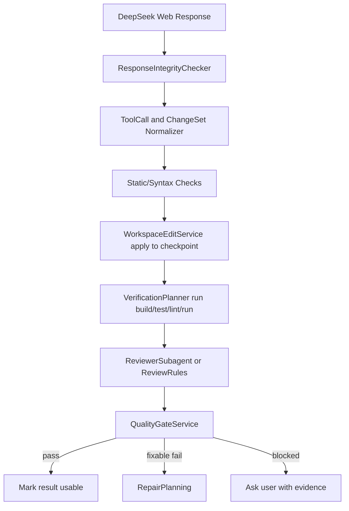
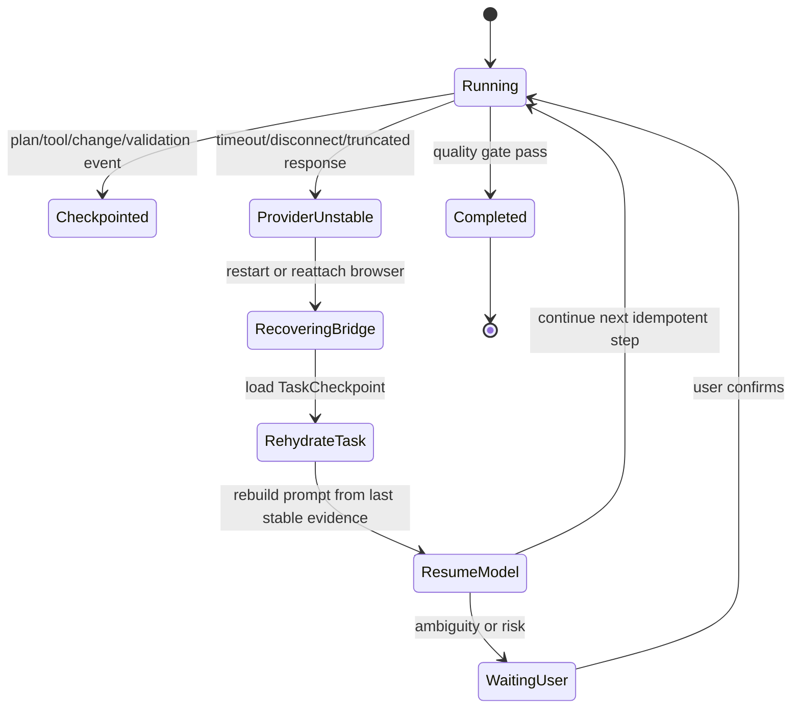

# DevSeek 竞品实现方式对标审计与设计修正

文档编号：ARCH-06
最后更新：2026-06-21
对应需求：[../requirements/02-顶级编程智能体需求基线.md](../requirements/02-顶级编程智能体需求基线.md)、[../requirements/07-架构重构需求澄清.md](../requirements/07-架构重构需求澄清.md)
状态：活跃审计文档；用于校验 DevSeek 设计是否符合 Claude Code / Codex / Copilot 的成熟实现方式

## 1. 审计结论

当前 DevSeek `01~05` 架构设计方向基本正确：已经具备 Plan Mode、工具协议、权限内核、ReviewLedger、MemoryService、Provider 抽象和分阶段重构计划。但若按 Claude Code / Codex / Copilot 的正式产品实现方式审计，还缺少两个 P0 级机制：

1. **模型输出质量门禁**：DeepSeek 网页模型生成的程序不能直接被视为正确结果，必须经过独立自检查、验证、审阅和失败修复，最后才进入“可使用”状态。
2. **网页不稳定恢复**：DeepSeek Web Bridge 断线、刷新、输出截断、重复响应时，DevSeek 必须能从任务检查点恢复当前编程任务，不能让用户重新描述整件事。
3. **Provider 内核一致性**：DeepSeek Web 可以作为默认实现，其他大模型可以通过 API 接入，但模型通道不能分叉工具、权限、验证、历史任务和记忆边界。

修正后，DevSeek 的设计目标从“Agent 能执行”升级为“Agent 能可靠执行、能证明结果、能从不稳定 Provider 中恢复”。

2026-06-21 复核结论：Phase 8/9 已完成 Provider Runtime、UI 协议和入口瘦身的主要落地，DevSeek 目前最大的差距已经从“缺少恢复/质量门禁”转为 **应用内核尚未完全脱离 VS Code Surface**。下一轮重构必须以 Headless Agent Core 为中心，而不是继续围绕 `extension.ts` 行数做机械拆分。

## 2. 官方实现方式摘要

| 产品 | 官方实现方式 | DevSeek 必须吸收的设计 |
| --- | --- | --- |
| Claude Code | 权限规则由产品执行，不靠模型；Plan Mode 只读；hooks 用于必须每次发生的确定性动作；subagents 可带工具限制、权限模式、hooks、skills；CLAUDE.md 和 auto memory 分离 | 权限内核硬执行、Plan 只读、hooks 作为硬门禁、subagent 权限隔离、规则和记忆分离 |
| OpenAI Codex | `AGENTS.md` 指令链；sandbox + approval；Plan before coding；测试、检查、review 后再接受；review pane 支持 per file/per hunk stage/revert；hooks 和 memories 有信任与范围控制 | 指令链、沙箱/审批、质量门禁、ReviewLedger、hunk 级操作、hook trust、记忆不替代规则 |
| GitHub Copilot | IDE agent / cloud agent 可研究仓库、制定计划、在分支上改代码、review diff、迭代、开 PR；VS Code 支持 instructions、skills、custom agents、MCP、hooks；MCP 跨 IDE/CLI/App/cloud surfaces | IDE 原生事件协议、分支/PR 思维、MCP 标准化工具层、可定制 agents/skills/hooks |

官方资料入口：

1. Claude Code permissions: https://code.claude.com/docs/en/permissions
2. Claude Code hooks: https://code.claude.com/docs/en/hooks-guide
3. Claude Code subagents: https://code.claude.com/docs/en/sub-agents
4. Claude Code memory: https://code.claude.com/docs/en/memory
5. OpenAI Codex manual: https://developers.openai.com/codex/codex-manual.md
6. GitHub Copilot cloud agent: https://docs.github.com/en/copilot/concepts/agents/cloud-agent/about-cloud-agent
7. VS Code AI customization: https://code.visualstudio.com/docs/agent-customization/overview
8. GitHub Copilot MCP: https://docs.github.com/en/copilot/concepts/context/mcp

## 2.1 2026-06-21 官方资料复核后的抽象原则

本节不是复刻某个产品的 UI，而是抽象 Claude Code/Codex 类优秀编程智能体的共同工程机制。

| 机制 | 官方资料复核 | DevSeek 设计原则 |
| --- | --- | --- |
| 上下文与项目规则 | Codex 使用 `AGENTS.md` 承载可复用工程指导；Claude Code 把 `CLAUDE.md`/rules/auto memory 区分为“指导上下文”而非硬执行配置 | 项目规则、记忆、技能、历史任务必须分层；规则可影响模型，但硬约束必须落到 Permission/Tool/Hook |
| Plan before coding | Codex 建议复杂任务先 plan；Claude Code 有只读 Explore/Plan subagent 和 permission modes | DevSeek 复杂任务默认只读探索，计划通过后才进入 Edit/Run；Plan 不能写盘或执行破坏性命令 |
| 权限硬执行 | Claude Code 权限按 deny/ask/allow 顺序执行，Codex 使用 sandbox + approval policy，网络和越界写入需审批 | DevSeek 不能靠 prompt 阻止危险行为；所有工具先过 ToolRegistry、PermissionKernel、sandbox/adapter 和 audit |
| Review 与可回退 | Codex review pane 面向 Git diff，支持 last turn/all branch/uncommitted 范围以及 file/hunk stage/revert | DevSeek ReviewLedger 需要从“记录变更”升级为“用户决策账本”，支持 file/hunk keep/undo/stage/revert 和 inline feedback |
| Skills/hooks/subagents | Codex skills 使用渐进加载，hooks 有 trust/review；Claude Code subagents 有独立上下文、工具限制、permission mode、memory 和 hooks | DevSeek Phase 12 必须把 skills/hooks/subagents 做成可注册、可权限控制、可审计能力，不能只是 prompt 模板 |
| 多 Surface | Codex 同时覆盖 CLI、IDE、App、云/非交互；Claude Code 覆盖 CLI、VS Code、Desktop/Web、SDK/automation | DevSeek 必须先形成 Headless Agent Core，再让 VS Code、CLI、JSONL、Desktop/local Web 作为 Surface Adapter 复用同一事实 |
| Provider 与工具分离 | 成熟 Agent 的模型通道不拥有文件写入、终端执行或权限最终裁判权 | DeepSeek Web/API/OpenAI-compatible/本地模型只能提供 `LLMEvent`；工具执行、验证、恢复、历史任务由 DevSeek runtime 统一控制 |

Phase 10/12 的所有设计评审都要用这张表做门槛：如果新增能力只能在 VS Code WebView 中工作，或需要复制 Agent 业务逻辑，它就没有达到对标要求。

## 3. 对标审计矩阵

| 能力 | Claude Code / Codex / Copilot 做法 | DevSeek 当前设计 | 审计结果 | 设计修正 |
| --- | --- | --- | --- | --- |
| Plan before coding | 复杂任务先只读探索和计划 | 已设计 `WorkflowService` Plan 状态机 | 符合 | 增加 Plan 退出审批事件和计划检查点 |
| 权限硬执行 | Deny/Ask/Allow、sandbox、网络默认关闭、工具权限由宿主执行 | 已设计 `PermissionKernel` | 基本符合 | 明确 deny > ask > allow，终端 compound command 拆分检查 |
| 工具协议 | 工具 schema、MCP、side-effect annotations、审批 | 已设计 `ToolRegistry`、`ToolExecutor` | 基本符合 | 增加幂等 key 和 destructive tool 重放保护 |
| 模型 Provider | 多模型可选，但宿主统一执行工具、权限和审查 | 已设计 `LLMProviderRouter` | 需加强 | DeepSeek Web 设为默认 Provider，API Provider 直连但共享同一 Runtime 和安全边界 |
| Review/diff | Codex review pane、Copilot diff、hunk stage/revert | 已设计 `ReviewLedger`、`PendingEditService` | 基本符合 | ReviewLedger 必须记录质量门禁结论 |
| 验证闭环 | 生成后运行测试、lint、review，再接受 | 只有 ValidationService 概念 | 不足 | 新增 `QualityGateService` 和 `VerificationPlanner` |
| Provider 不稳定 | 成熟产品多用 session/resume/log/checkpoint | Provider fallback 粗略存在 | 不足 | 新增 `TaskCheckpointStore` 和 `ProviderRecoveryService` |
| 历史任务续作 | 成熟产品保留 session log、task state、diff/review 和 resume 入口 | 现有 session history 与 checkpoint 分散 | 不足 | 新增 `TaskHistoryStore`、`TaskRunRecord`、`TaskTimelineService`、`ResumeContextBuilder` |
| Hooks | 生命周期确定性动作，不依赖模型自觉 | 作为增强项后置 | 不足 | PreToolUse/PostToolUse/Stop 进入 P0/P1 关键路径 |
| Subagents | 独立上下文、工具限制、权限隔离 | 作为 P2 增强项 | 偏后 | Reviewer/Verifier 子流程前移到 P1 |
| Memory | 规则与记忆分离，记忆可审计，不保存 secrets | 已设计 MemoryService | 符合 | 增加质量门禁经验写入受控规则 |
| MCP | 标准协议接入外部工具并治理权限 | 已有 MCP 适配目标 | 基本符合 | MCP destructive/readOnly annotation 进入权限判定 |

## 4. 设计修正一：DeepSeek Web 输出质量门禁

DeepSeek 网页模型输出属于“不可信建议”，不是最终事实。DevSeek 必须按以下顺序处理：

质量门禁规则：

1. 语法或解析失败：不能应用，进入修复或重新请求模型。
2. 写盘前：必须有 change set、目标路径、diff、风险说明。
3. 写盘后：必须有 snapshot、验证命令、退出码和输出摘要。
4. 测试失败：不能宣称完成，只能进入 RepairPlanning 或等待用户确认跳过。
5. 无法运行测试：必须说明原因，并执行至少一种替代检查，例如语法检查、静态检查、目标文件 diff 审查。
6. 最终摘要必须引用 evidence，不允许只复述模型自称成功。

新增模块：

| 模块 | 职责 |
| --- | --- |
| `ResponseIntegrityChecker` | 检查网页回复是否截断、重复、缺失工具闭合、缺失最终结论 |
| `VerificationPlanner` | 根据项目规则、文件类型、变更范围选择 build/test/lint/run |
| `QualityGateService` | 汇总语法、测试、review、用户确认，决定 pass/fail/blocked |
| `ReviewerSubagent` | 只读审阅变更，输出严重性、文件行号、修复建议 |

## 5. 设计修正二：DeepSeek Web 不稳定恢复

DeepSeek Web Bridge 可能出现刷新、断线、响应截断、DOM 变化、重复输出、浏览器进程重启。DevSeek 不能把 Provider 会话当成唯一状态来源，必须把任务状态持久化在本地。

恢复规则：

1. Provider 会话状态只作为 transport，任务真相来自 `TaskCheckpointStore`。
2. 每个工具调用、写盘、终端命令都有 `operationId` 和幂等状态。
3. 已成功写盘的 change set 不因网页重试重复应用。
4. 已执行的终端命令不自动重复，除非命令被标记为 read-only 或用户确认。
5. 回复截断时，不能把半段 diff 或半段工具调用当作可执行输入。
6. 恢复 prompt 只注入最后稳定状态：目标、批准计划、已完成工具、已应用 diff、验证结果、未完成任务。
7. 如果 Provider 恢复后模型输出与 checkpoint 冲突，以本地 evidence 为准。

新增模块：

| 模块 | 职责 |
| --- | --- |
| `TaskCheckpointStore` | 持久化 workflow state、plan、todo、tool result、change set、validation |
| `ProviderRecoveryService` | 侦测网页不稳定、重连 bridge、重建 Provider 会话 |
| `IdempotencyGuard` | 防止重放写盘、终端和 MCP 副作用 |
| `ResumeContextBuilder` | 由 checkpoint 和历史任务事实生成最小恢复上下文 |

## 6. 设计修正三：历史任务与续作

Claude Code / Codex / Copilot 的成熟体验都不是只保留聊天文本，而是保留可恢复的工作状态。DevSeek 必须把历史任务做成一等对象：

1. `SessionService` 继续负责聊天历史和 UI 会话。
2. `TaskHistoryStore` 保存任务事实，包括目标、计划、todo、工具结果、change set、验证、QualityGate、checkpoint 和暂停原因。
3. `TaskTimelineService` 从领域事件聚合任务详情，避免 WebView 直接读内部存储。
4. `ResumeContextBuilder` 只用最后稳定 checkpoint 和任务事实构建续作上下文。
5. 任务历史可删除、归档、导出，并默认脱敏。
6. 历史任务续作必须复用 `IdempotencyGuard`，不能重复执行已提交副作用。

## 7. 设计修正四：Provider 默认实现与 API 接入

成熟编程智能体不会让“换模型”导致“换一套 Agent”。DevSeek 的 Provider 设计必须满足：

1. DeepSeek Web Bridge 是默认 Provider，负责低门槛可用性和网页路径兼容。
2. DeepSeek API、OpenAI-compatible、本地模型、企业私有模型通过 API Provider 直接接入。
3. API Provider 只实现 `LLMProvider` 和 capabilities，不拥有工具执行权。
4. Provider 选择、健康检查、fallback 由 `ProviderConfigService`、`ProviderSelector`、`ProviderHealthMonitor` 控制。
5. 所有 Provider 输出都必须变成 `LLMEvent`，再经 `ToolCallNormalizer`、`ToolRegistry`、`PermissionKernel`、`QualityGateService`。
6. Provider fallback 必须继承 workflow id、checkpoint、ReviewLedger、TaskHistory 和 idempotency ledger。
7. Provider secret 只能以 secret 引用形式存在，不能进入 prompt、历史任务、记忆或普通日志。

## 8. 设计修正五：权限实现细节向成熟产品靠齐

DevSeek `PermissionKernel` 必须从“模式表”升级为“规则引擎”：

1. 规则顺序固定为 deny > ask > allow。
2. Bare deny 可以把工具从模型可见工具集中移除。
3. 终端命令需要解析 compound command，每个子命令单独判定。
4. 网络访问默认 deny；即使 Bash 可用，也不能通过 curl/wget 绕过 WebFetch/MCP 域名策略。
5. MCP 工具的 read-only/destructive 标注必须进入审批。
6. Auto 模式只能自动批准低风险动作，关键删除、越界写入、敏感文件和网络访问仍需确认。
7. Subagent 不自动继承父 Agent 权限，必须单独声明工具和模式。

## 9. 设计修正六：ReviewLedger 向 Codex/Copilot 靠齐

ReviewLedger 不能只是“记录 DevSeek 改了什么”，而要像成熟 Agent 的 review pane 一样承载用户决策。

必须支持：

1. 本轮变更、未提交变更、分支差异三个 scope。
2. 文件级、hunk 级 keep/undo/stage/revert。
3. 行级反馈作为下一轮修复上下文。
4. AI review 结果以 severity、file、line、evidence 存储。
5. QualityGate pass/fail 与每个 change set 绑定。

## 10. 其他优化设计

| 优化项 | 原因 | 优先级 |
| --- | --- | --- |
| Worktree 运行高风险任务 | 对齐 Claude/Codex worktree，避免污染用户当前分支 | P2 |
| Project `/init` 多阶段提案 | 对齐 Claude/Codex 初始化，不直接覆盖指令文件 | P1 |
| Hook trust UI | 对齐 Codex hook trust，避免项目脚本被静默执行 | P1 |
| Bridge 健康诊断面板 | DeepSeek Web 特有风险，需要用户看到登录/风控/DOM/超时状态 | P0 |
| Provider 配置与健康面板 | 用户需要看到默认 DeepSeek Web、API Provider、模型、能力和 fallback 状态 | P1 |
| Provider transcript archive | 恢复和审计需要保存模型输出摘要、hash、截断状态 | P1 |
| Minimal recovery prompt | 恢复时避免把全历史塞回模型，降低漂移 | P0 |
| Task history center | 任务列表、详情、继续、归档、删除和导出是长任务体验基础 | P1 |

## 11. 修正后的设计门槛

后续 DevSeek 代码重构必须满足：

1. 没有 QualityGate 的代码生成不能标记为完成。
2. 没有 TaskCheckpoint 的长任务不能进入 Edit/Run。
3. 没有 IdempotencyGuard 的副作用工具不能自动重试。
4. 没有 ReviewLedger 记录的文件变更不能进入 Keep/Undo。
5. 没有权限规则执行的工具调用不能只靠 prompt 放行。
6. 没有 evidence 的最终摘要不能宣称“已完成”。
7. 没有 TaskHistory 记录的长任务不能只依赖聊天历史恢复。
8. 没有统一 Provider 契约的模型接入不能进入 Agent Runtime。
