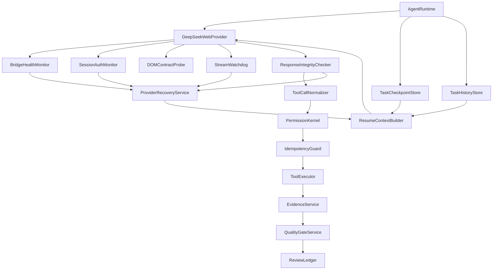
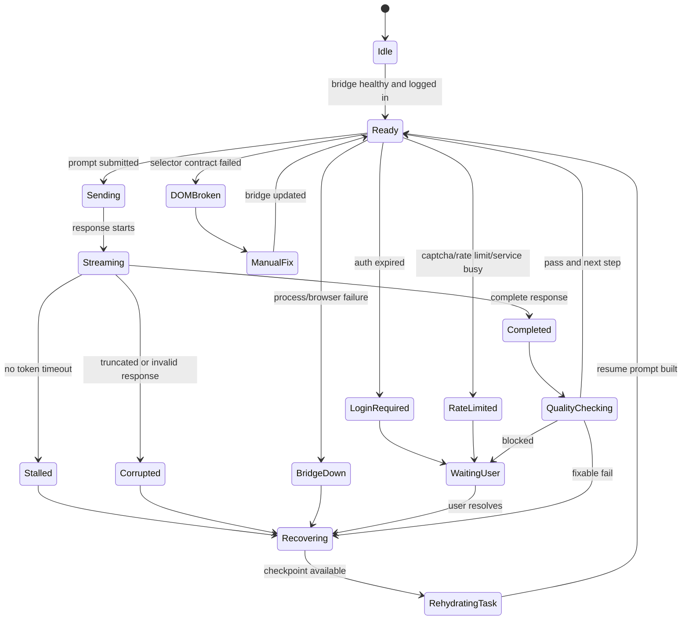
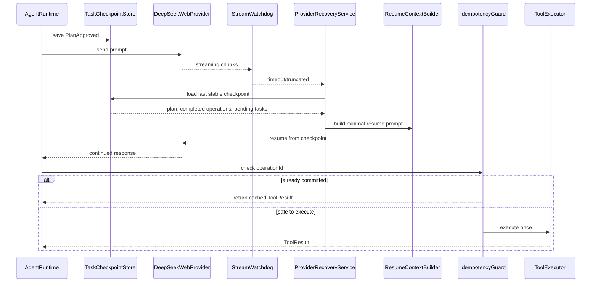
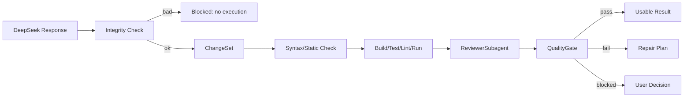

---
devseek_governance:
  generator: "devseek-doc-governance/v1"
  status: "historical"
  path: "docs/architecture/07-DeepSeek网页异常与恢复设计.md"
  source_group: "architecture"
  decision: "keep"
  relationship: "legacy-architecture"
  active_baselines:
    - "docs/architecture/01-顶级编程智能体总体架构设计.md"
  machine_sources:
    active_selector: "docs/process/devseek-active-baseline-selector.json"
    legacy_inventory: "docs/process/devseek-legacy-doc-inventory.json"
  asserts_gate_pass: false
---

<!-- DEVSEEK-GOVERNANCE-BANNER:START -->
> [!NOTE]
> DevSeek governance: this document is `historical` with decision `keep` and relationship `legacy-architecture`. Current authority: `docs/architecture/01-顶级编程智能体总体架构设计.md`. Machine source: `docs/process/devseek-legacy-doc-inventory.json`.
<!-- DEVSEEK-GOVERNANCE-BANNER:END -->

# DevSeek DeepSeek 网页异常与恢复设计

文档编号：ARCH-07
最后更新：2026-06-18
对应需求：[../requirements/02-顶级编程智能体需求基线.md](../requirements/02-顶级编程智能体需求基线.md) REQ-J、[06-竞品实现方式对标审计与设计修正.md](06-竞品实现方式对标审计与设计修正.md)
状态：DeepSeek Web Bridge 专项可靠性设计

## 1. 设计目标

DeepSeek 网页版是 DevSeek 的默认 Provider，但它不是稳定 API。设计上必须承认网页自动化会出现登录、风控、DOM、流式输出、截断、重复、上下文漂移等异常。其他大模型可以通过 API Provider 接入；本文件只定义默认 DeepSeek Web 路径的专项可靠性，统一 Provider 契约见 [02-模型供应商与工具协议架构设计.md](02-模型供应商与工具协议架构设计.md)。

目标：

1. DeepSeek Web 输出不直接等同于可用代码，必须经过质量门禁。
2. 网页或 Bridge 不稳定时，用户当前编程任务可以从本地 checkpoint 继续。
3. 恢复过程中不能重复执行已完成的写盘、终端、MCP 等副作用。
4. 异常需要可解释地展示给用户：什么失败、是否能自动恢复、需要用户做什么。
5. 所有异常都要回到同一套 Agent Runtime、QualityGate、ReviewLedger、TaskCheckpoint 和 TaskHistory，而不是在 Bridge 里写临时分支。

## 2. 异常分类总表

| 类别 | 异常 | 检测信号 | 设计对策 |
| --- | --- | --- | --- |
| 用户已提出 | 生成代码结果不正确 | 编译失败、测试失败、静态检查失败、reviewer 发现问题 | `QualityGateService` 阻断完成，进入修复或用户确认跳过 |
| 用户已提出 | 网页回复不稳定但任务要继续 | 超时、断线、输出截断、bridge restart | `TaskCheckpointStore` + `ProviderRecoveryService` 恢复任务 |
| 会话认证 | 登录失效、cookie 过期 | 页面跳登录、输入框不可用、401/重定向 | 暂停任务，展示 LoginRequired，登录后从 checkpoint 继续 |
| 风控限制 | 验证码、排队、速率限制、服务繁忙 | captcha、rate limit 文案、发送按钮禁用 | 暂停并提示用户；不自动绕过验证码；恢复后继续 |
| DOM 变化 | 选择器失效、页面结构变化 | bridge 找不到输入框、发送按钮、消息节点 | `DOMContractProbe` 降级诊断，阻断自动执行，提示更新 Bridge |
| 流式异常 | 长时间无 token、无最终结束、SSE 中断 | `StreamWatchdog` 超时或 finish reason 缺失 | 标记响应 partial，不能进入 ToolNormalizer |
| 输出完整性 | 代码块未闭合、JSON/diff 截断、工具块不完整 | markdown fence、JSON parse、diff parser、tool parser 失败 | 进入 ResponseCorrupted，要求模型续写或重新生成 |
| 输出重复 | 回复重复片段、重复工具调用 | chunk hash、tool call id、operationId 重复 | 去重；副作用工具由 `IdempotencyGuard` 阻断重复执行 |
| 格式漂移 | 模型没有按工具协议输出 | 无工具块、路径缺失、自然语言描述含糊 | 降级为 PlanClarification，不自动写盘 |
| 路径错误 | 幻觉文件路径、多根工作区误判 | 目标文件不存在、越界、路径不在 workspace | Workspace boundary 阻断，要求确认或重新定位 |
| 权限风险 | 生成危险命令或越权写入 | shell risk parser、protected file、network tool | `PermissionKernel` deny/ask；不能由模型解释绕过 |
| 上下文漂移 | 恢复后模型忘记已完成步骤 | 输出与 checkpoint 冲突 | 本地 evidence 胜出；恢复 prompt 只给最后稳定事实 |
| 副作用重放 | 重试导致重复写盘、重复运行命令 | operationId 已 committed | `IdempotencyGuard` 返回 cached result 或要求用户确认 |
| 大输出溢出 | 回复超长、上下文超过预算 | token budget、message size、truncation | 分段计划、分文件执行、summary checkpoint |
| 用户并发输入 | 运行中追加/取消/修改目标 | input queue 非空、cancel token | 进入 PlanRevision 或 CancelledCheckpoint |
| Bridge 进程异常 | 端口占用、浏览器崩溃、Playwright 失败 | health ping 失败、进程退出码 | restart bridge；失败则进入 ManualRecovery |
| 网络异常 | 本机断网、DNS、DeepSeek 服务错误 | request timeout、5xx、offline | exponential backoff；超过阈值转等待用户 |
| 安全污染 | 错误输出写入记忆或日志包含 secret | sensitive scan 命中 | 记忆写入阻断，日志脱敏 |
| Prompt 注入 | 仓库文件诱导绕过规则 | 文件内容含越权指令 | 项目指令和权限内核优先，工具执行不受文件指令影响 |

## 3. 可靠性层架构



## 4. DeepSeek Web 状态图



## 5. 异常恢复时序



## 6. 输出质量门禁



质量门禁最低要求：

1. **生成文件**：必须能解析目标路径和完整内容。
2. **修改文件**：必须能生成 diff 或 hunk，并能应用到当前文件版本。
3. **可运行代码**：至少运行一个相关验证；不能运行时必须说明原因并做替代检查。
4. **失败输出**：必须进入修复循环，不能生成“已完成”总结。
5. **最终可用**：必须有 evidence，包括 diff、验证结果或用户确认。

## 7. 幂等与重放保护

每个副作用操作必须有 `operationId`：

```typescript
export interface OperationRecord {
  operationId: string;
  workflowId: string;
  kind: 'edit' | 'terminal' | 'mcp' | 'memory' | 'vscode';
  inputHash: string;
  status: 'planned' | 'started' | 'committed' | 'failed' | 'cancelled';
  replayPolicy: 'never' | 'read-only' | 'requires-confirmation';
  resultRef?: string;
}
```

规则：

1. `committed + replayPolicy=never`：恢复时直接返回缓存结果，不重复执行。
2. `terminal` 默认 `requires-confirmation`，除非被识别为 read-only。
3. `edit` 重放前必须检查目标文件 hash 是否仍匹配 checkpoint。
4. `mcp` destructive tool 永远不自动重放。
5. `memory` 写入必须重新过敏感信息阻断。

## 8. 用户可见恢复体验

| 状态 | UI 展示 | 用户动作 |
| --- | --- | --- |
| LoginRequired | “DeepSeek 网页登录已失效，任务已暂停” | 登录后继续 |
| RateLimited | “DeepSeek 当前限流/验证码，已保存任务进度” | 等待或手动处理 |
| ResponseCorrupted | “模型回复不完整，未执行任何新操作” | 重试、换 Provider、取消 |
| Recovering | “正在从上次稳定步骤恢复” | 可取消 |
| QualityGateFailed | “代码生成未通过自检查” | 修复、查看日志、接受风险 |
| ManualFix | “Bridge 选择器或网页结构异常，需要更新适配” | 查看诊断 |

历史任务入口必须展示同一批状态。用户从历史任务打开 `LoginRequired`、`RateLimited`、`ResponseCorrupted` 或 `QualityGateFailed` 任务时，DevSeek 应展示暂停原因、最后稳定 checkpoint、已提交操作和可继续动作。

## 9. 设计验收

1. 网页输出截断时，不能产生文件写入。
2. Bridge 重启后，任务能恢复到最后一个 stable checkpoint。
3. 重试不会重复应用同一个 change set。
4. 验证失败时，最终摘要不能说“完成”。
5. 登录失效、验证码、限流必须暂停任务并保留进度。
6. DOM 变化不能让上层 Agent 崩溃，只能让 DeepSeekWebProvider 降级。
7. 所有异常都进入 ReviewLedger 或 TaskCheckpoint，可被用户追溯。
8. 所有可恢复异常都在 `TaskHistoryStore` 中关联任务状态，用户能从历史任务列表重新打开并继续。
