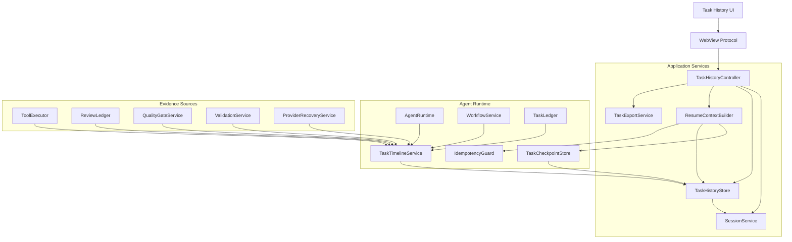
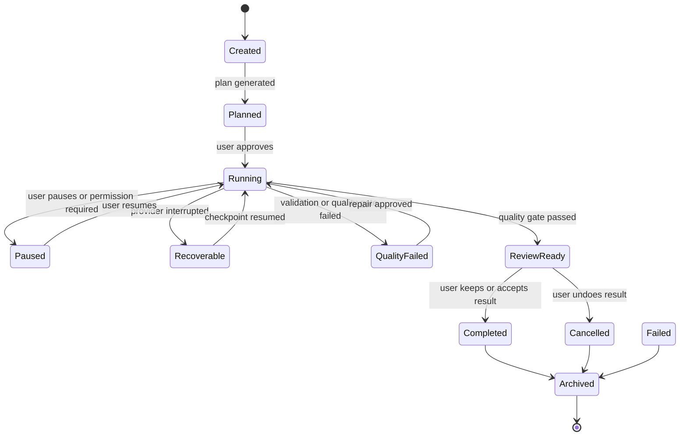
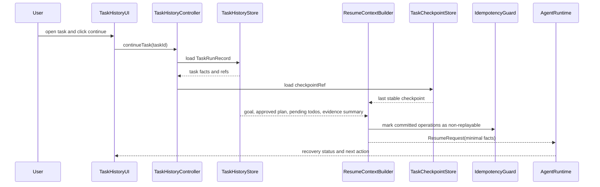
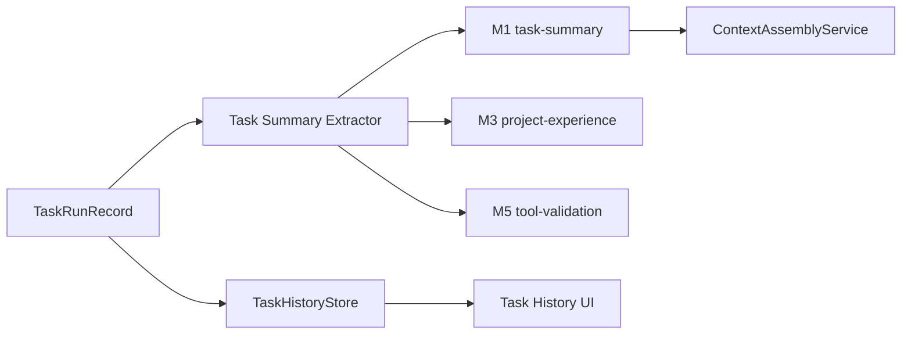

---
devseek_governance:
  generator: "devseek-doc-governance/v1"
  status: "historical"
  path: "docs/architecture/08-历史任务与续作架构设计.md"
  source_group: "architecture"
  decision: "keep"
  relationship: "legacy-architecture"
  active_baselines:
    - "docs/architecture/01-顶级编程智能体总体架构设计.md"
  machine_sources:
    active_selector: "docs/process/devseek-active-baseline-selector.json"
    legacy_inventory: "docs/process/devseek-legacy-doc-inventory.json"
  asserts_gate_pass: false
---

<!-- DEVSEEK-GOVERNANCE-BANNER:START -->
> [!NOTE]
> DevSeek governance: this document is `historical` with decision `keep` and relationship `legacy-architecture`. Current authority: `docs/architecture/01-顶级编程智能体总体架构设计.md`. Machine source: `docs/process/devseek-legacy-doc-inventory.json`.
<!-- DEVSEEK-GOVERNANCE-BANNER:END -->

# DevSeek 历史任务与续作架构设计

文档编号：ARCH-08
最后更新：2026-06-18
对应需求：[../requirements/02-顶级编程智能体需求基线.md](../requirements/02-顶级编程智能体需求基线.md) REQ-K、[../requirements/07-架构重构需求澄清.md](../requirements/07-架构重构需求澄清.md)
状态：历史任务保存、显示、打开和继续工作的专项设计

## 1. 设计目标

DevSeek 必须把“历史聊天”和“历史任务”分开治理。聊天历史帮助用户回看对话，任务历史帮助 Agent 继续执行真实编程任务。

目标：

1. 保存一次 Agent 任务的目标、计划、todo、工具结果、文件变更、验证证据、质量门禁和暂停原因。
2. 用户能在历史任务列表中查看任务状态、打开任务详情、继续未完成任务。
3. 继续任务时只注入最后稳定事实，不要求用户重新描述目标，不把全聊天记录塞回模型。
4. 任务恢复必须走 `TaskCheckpointStore` 和 `IdempotencyGuard`，不能重复执行已提交副作用。
5. 任务摘要可进入 `MemoryService` 的 M1/M3/M5，但原始任务事实仍归 `TaskHistoryStore` 管理。

## 2. 概念边界

| 概念 | 职责 | 生命周期 | 不负责 |
| --- | --- | --- | --- |
| `SessionService` | 对话显示、会话列表、聊天历史、会话摘要 | 用户可删除的 UI 会话 | 工具事实、验证证据、幂等恢复 |
| `TaskHistoryStore` | 任务事实、状态、计划、todo、change set、validation、QualityGate、暂停原因 | 工作区级，可归档/删除/导出 | 长期偏好和项目规则 |
| `TaskCheckpointStore` | 当前任务最后稳定恢复点 | 运行中和可恢复任务 | 历史浏览和全文搜索 |
| `TaskTimelineService` | 把 domain events 聚合为任务时间线 | 任务期 | 直接执行工具 |
| `MemoryService` | 提炼可复用经验、偏好、验证路径 | session/workspace/repo/user scope | 保存完整历史任务 |
| `ReviewLedger` | 文件变更、diff、hunk、review 和 QualityGate 结果 | change set 维度 | 聊天展示历史 |

## 3. 架构图



## 4. `TaskRunRecord` schema

```typescript
export interface TaskRunRecord {
  id: string;
  sessionId?: string;
  workspaceId: string;
  repositoryRoot?: string;
  branch?: string;
  title: string;
  userGoal: string;
  provider: {
    type: 'bridge' | 'deepseek-api' | 'openai-compat' | 'vscode-lm';
    model?: string;
  };
  status:
    | 'planned'
    | 'running'
    | 'paused'
    | 'recoverable'
    | 'quality-failed'
    | 'review-ready'
    | 'completed'
    | 'cancelled'
    | 'failed'
    | 'archived';
  workflowMode: 'chat' | 'inspect' | 'plan' | 'edit' | 'run' | 'review';
  approvedPlan?: PlanSnapshot;
  todos: TaskTodoSnapshot[];
  changedFiles: string[];
  operationRefs: string[];
  changeSetRefs: string[];
  validationRefs: string[];
  qualityGateRef?: string;
  checkpointRef?: string;
  pauseReason?: {
    kind: 'user' | 'provider' | 'permission' | 'quality' | 'validation' | 'system';
    message: string;
  };
  evidenceSummary: string;
  riskSummary?: string;
  createdAt: number;
  updatedAt: number;
  completedAt?: number;
  retention: 'active' | 'pinned' | 'archived' | 'delete-after-ttl';
}
```

规则：

1. `TaskRunRecord` 只保存索引和摘要，详细 diff、tool output、validation log 以 `ref` 关联到 `ReviewLedger`、`EvidenceService` 或本地日志摘要。
2. 敏感原文不进入 `TaskRunRecord`，只保存脱敏摘要和阻断事件。
3. `sessionId` 可为空，支持非交互或后台任务；有 `sessionId` 时，历史聊天和历史任务可以相互跳转。
4. `checkpointRef` 只指向最后稳定 checkpoint，不保存半段模型输出。

## 5. 历史任务状态图



状态规则：

1. `recoverable` 必须有可用 `checkpointRef`。
2. `completed` 必须有 `qualityGateRef` 或用户接受风险的审计事件。
3. `cancelled` 不能删除 ReviewLedger 快照，直到用户清理历史任务。
4. `archived` 只影响默认列表展示，不影响审计导出。

## 6. 打开历史任务并继续时序



恢复上下文只允许包含：

1. 用户目标和已批准计划。
2. 已完成 todo、未完成 todo、阻塞原因。
3. 已应用 change set 的文件路径、hash 和 ReviewLedger 引用。
4. 已运行命令的摘要、退出码和 replay policy。
5. 最新验证结果、QualityGate 结果和下一步建议。

## 7. UI 信息架构

历史任务面板必须至少有三个层次：

| 层次 | 展示内容 | 用户动作 |
| --- | --- | --- |
| 列表 | 标题、状态、仓库、更新时间、涉及文件、是否可继续 | 打开、继续、归档、删除 |
| 详情 | 目标、计划、todo、文件变更、验证、QualityGate、暂停原因、风险 | 查看 diff、打开文件、继续、导出 |
| 时间线 | 模型请求摘要、工具调用、权限确认、命令结果、恢复事件 | 展开证据、复制摘要、定位失败 |

UI 不能直接拼接恢复 prompt。继续任务只能发送 `continueTask(taskId)`，由应用层构建 `ResumeRequest`。

## 8. 与记忆体的关系



写入规则：

1. 任务历史默认保存任务事实，不等于长期记忆。
2. 只有完成或用户确认有价值的任务摘要，才能提炼为 M1/M3/M5。
3. 未通过验证的经验不得写入 M3，只能保留为任务失败事实。
4. 删除任务历史时，不自动删除已经独立批准的长期记忆，但 UI 必须提示二者关系。

## 9. 存储与隐私

| 数据 | 默认位置 | 清理策略 |
| --- | --- | --- |
| `TaskRunRecord` | VS Code workspaceState 或 workspaceStorage | 默认保留最近 100 个，可归档、固定或删除 |
| 任务时间线摘要 | workspaceStorage | 随任务删除 |
| 大型命令输出 | 只保存摘要和本地日志 ref | 默认 TTL |
| diff/hunk/snapshot | ReviewLedger / workspace edit storage | 随任务删除或用户清理 |
| 可复用经验 | MemoryService stores | 按记忆体规则单独治理 |

隐私规则：

1. 任务历史不保存 token、cookie、私钥、密码、证书原文。
2. 工具输出超长时只保存摘要、hash、前后文片段和日志引用。
3. 用户删除任务时，必须删除 `TaskRunRecord`、时间线摘要和 checkpoint；长期记忆按关联提示单独确认。
4. 导出任务时默认脱敏，并明确包含哪些 refs。

## 10. 与现有代码迁移关系

| 当前实现 | 迁移目标 |
| --- | --- |
| `SessionService` 保存 session meta/history/summary/files | 保留为聊天 UI 历史，增加 task ids 关联 |
| `AgentTaskCheckpoint` 单 key 断点续传 | 迁移为 `TaskCheckpointStore`，支持 taskId/workflowId 多任务 |
| `resumeAgentCheckpoint` Webview 消息 | 替换为 `continueTask(taskId)` 和 `resumeCheckpoint(checkpointRef)` |
| `nonBridgeChatHistory` 恢复摘要 | 只用于聊天上下文；任务续作由 `ResumeContextBuilder` 构建 |
| `lastAgentChangedPaths`/`analysisText` 分散状态 | 聚合为 `TaskRunRecord.changedFiles` 和 evidence refs |

## 11. 验收标准

1. 完成一次 Agent 任务后，历史任务列表能看到任务标题、状态、涉及文件、更新时间和验证结论。
2. 打开历史任务详情，能看到目标、计划、todo、change set、验证结果、QualityGate 和未完成项。
3. VS Code 重启后，未完成任务仍可从最后稳定 checkpoint 继续。
4. DeepSeek Web 中断后，继续任务不会重复应用已提交 change set，也不会重复执行 destructive terminal/MCP 操作。
5. 用户删除历史任务后，任务记录、时间线和 checkpoint 不再可见；长期记忆保留与否由用户确认。
6. 历史任务导出默认脱敏，敏感数据阻断有测试覆盖。
7. UI 只发送任务动作事件，不直接读取 workspaceState 或拼接恢复 prompt。
