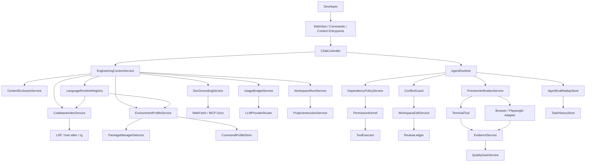
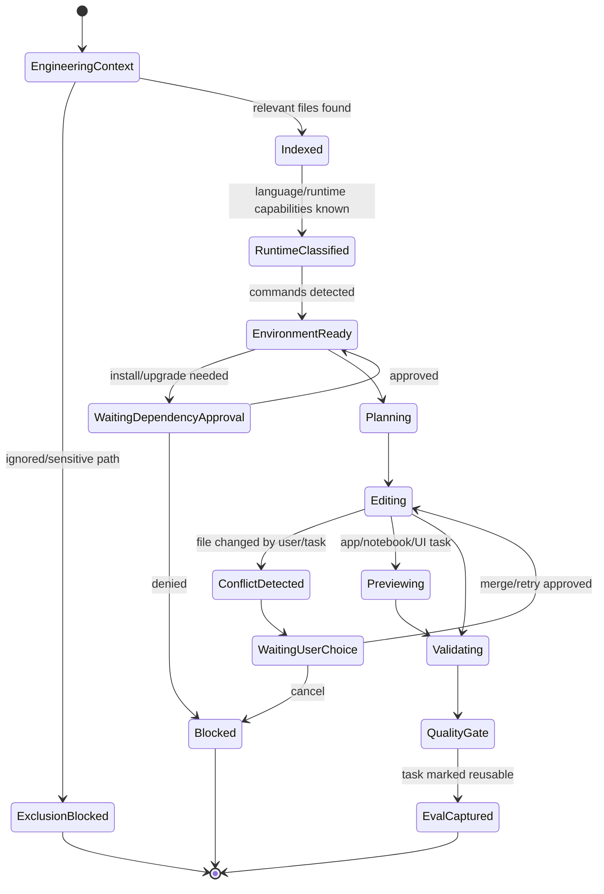
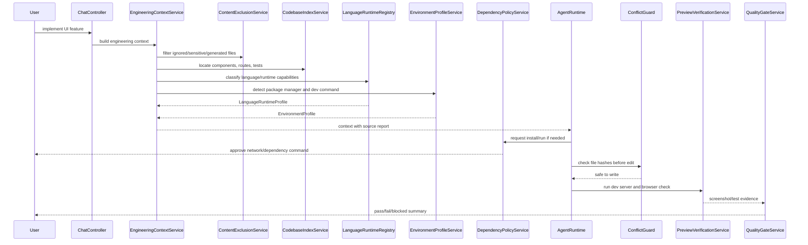

# DevSeek 程序员工程完整性架构设计

文档编号：ARCH-09
最后更新：2026-06-18
对应需求：[../requirements/02-顶级编程智能体需求基线.md](../requirements/02-顶级编程智能体需求基线.md) REQ-A6、REQ-D6/D7、REQ-E6、REQ-G6、REQ-H5、REQ-M；[../requirements/08-程序员智能编程体需求完备性审计.md](../requirements/08-程序员智能编程体需求完备性审计.md)
状态：活跃工程完整性设计

## 1. 设计目标

顶级编程智能体不能只会生成补丁。程序员真实使用时，还需要理解代码库、识别环境、遵守忽略规则、查当前文档、跑服务、处理依赖、控制成本、避免并发冲突，并把这些事实写入验证和审计。

目标：

1. 让 Agent 的上下文来自可解释工程事实，而不是全靠模型猜。
2. 让依赖安装、网络访问、dev server、浏览器验证和 Notebook 输出进入工具协议。
3. 让忽略规则、prompt injection、防冲突成为 P0 安全边界。
4. 让 API Provider 的 token、费用、速率限制和重试预算对用户可见。
5. 让历史任务可以沉淀为回放评测，支撑后续 Agent 质量提升。
6. 让每种语言/运行时的 Agent 能力可声明、可降级、可测试，而不是默认假设模型“都会”。

## 2. 架构图

## 3. 模块边界

| 模块 | 职责 | 设计原则 |
| --- | --- | --- |
| `ContentExclusionService` | 合并 `.gitignore`、`.devseekignore`、用户排除、generated/vendor/large file 和敏感路径策略 | 单一职责、依赖倒置 |
| `CodebaseIndexService` | 构建轻量 repository map，提供定义、引用、影响范围、测试文件候选 | 开闭原则，索引实现可替换 |
| `EnvironmentProfileService` | 识别语言、包管理器、虚拟环境、devcontainer、build/test/lint/run 命令 | 单一职责 |
| `LanguageRuntimeRegistry` | 维护语言/运行时能力矩阵，声明索引、诊断、格式化、构建、测试、运行、依赖和降级策略 | 开闭原则，新增语言通过 adapter 扩展 |
| `DependencyPolicyService` | 审批依赖安装、升级、迁移、lockfile 变化和网络副作用 | 迪米特法则，只和权限/终端协作 |
| `DocGroundingService` | 根据本地版本和任务需要获取当前官方文档或 MCP 文档摘要 | 接口隔离，网络访问受控 |
| `ConflictGuard` | 写入前检查文件 hash、用户改动、并发任务冲突和工作树状态 | 单一职责 |
| `PreviewVerificationService` | 启停 dev server、浏览器预览、截图、Playwright、Notebook 输出证据 | 开闭原则，验证器可扩展 |
| `UsageBudgetService` | 估算 token、上下文、费用、速率、重试和缓存命中 | 依赖 Provider 抽象 |
| `WorkspaceRootService` | 多根/monorepo 的 root、规则、cwd、Git 状态和 checkpoint 边界 | 里氏替换，root adapter 可替换 |
| `AgentEvalReplayStore` | 从历史任务生成可回放 regression case | 单一职责 |

## 4. 运行时状态图

## 5. 典型时序：Web 功能修改并预览

## 6. 设计验收

1. Agent 不能读取、写入或记忆被 `.devseekignore`、`.gitignore`、敏感路径策略排除的内容。
2. 写入文件前必须检查文件版本；用户并发修改时不能静默覆盖。
3. 依赖安装、升级、lockfile 变化和网络访问必须经过权限与审计。
4. 外部文档 grounding 必须记录来源、版本依据和联网原因。
5. API Provider 必须展示 token、上下文、费用或速率限制的可用估算。
6. Web/GUI/Notebook 任务必须能保留可视化或运行证据，无法验证时说明风险。
7. 多根工作区任务必须显示 root、cwd、规则来源、Git 状态和 checkpoint 边界。
8. 历史任务可被标记为 regression case，并用于后续 Agent 改动回放。
9. 每个语言/运行时必须有 `LanguageRuntimeProfile`，明确支持级别、可用命令、验证方式和未知能力的降级提示。
