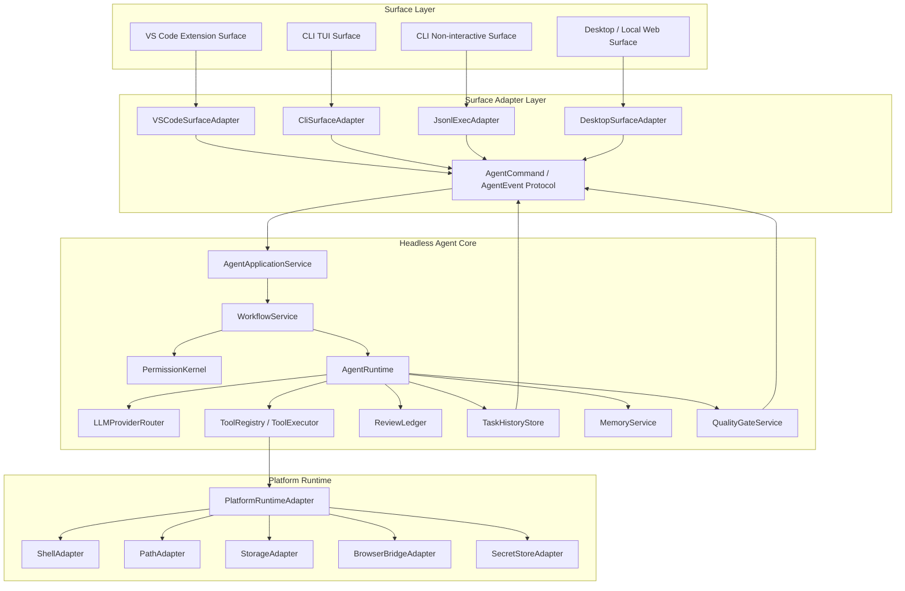
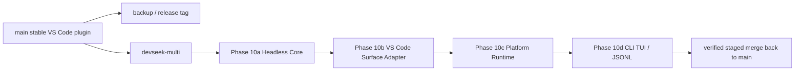
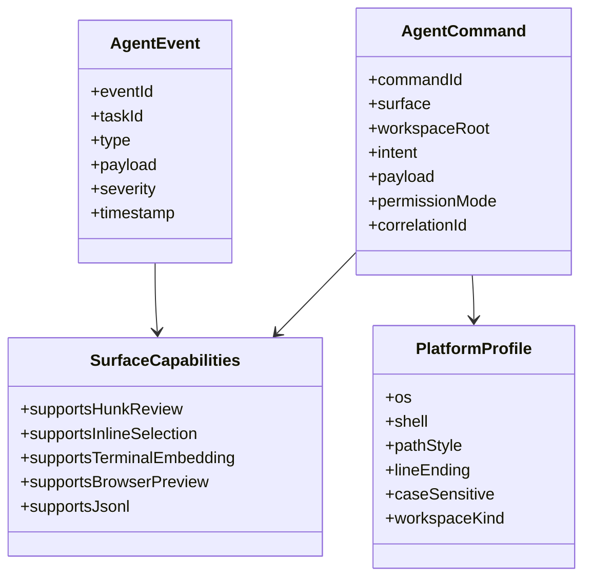
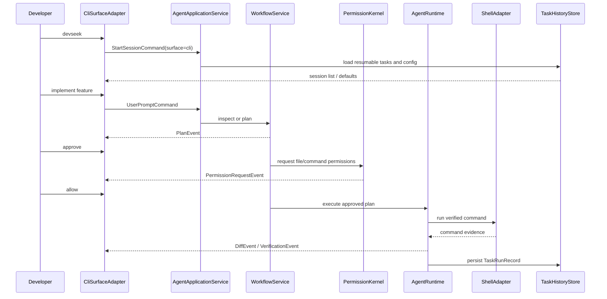
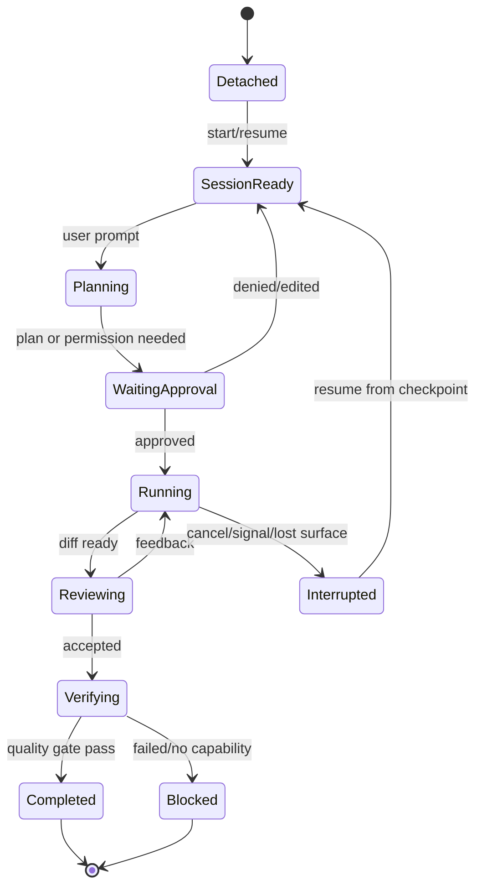
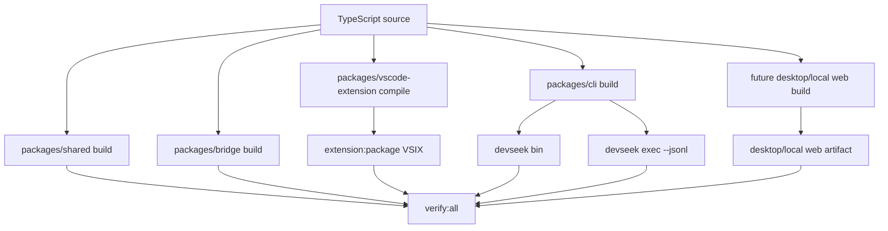

# DevSeek 运行形态与界面解耦架构设计

文档编号：ARCH-10
最后更新：2026-06-18
对应需求：[../requirements/02-顶级编程智能体需求基线.md](../requirements/02-顶级编程智能体需求基线.md) REQ-N；[../requirements/09-运行形态与界面解耦需求.md](../requirements/09-运行形态与界面解耦需求.md)
状态：活跃多入口与跨平台设计

## 1. 设计结论

DevSeek 必须从“VS Code 插件内的 Agent”重构为“Headless Agent Core + 多 Surface Adapter”。

1. VS Code 插件继续作为 P0 产品入口，但只负责展示、输入、VS Code 原生入口和 adapter。
2. CLI 交互模式作为 P1，优先对标 Claude Code 的终端优先体验，但复用同一 Agent Core。
3. CLI 非交互和非 VS Code 图形界面作为 P2，在协议稳定后实现。
4. Linux/macOS/Windows native/WSL 差异进入 `PlatformRuntimeAdapter`，不能散落在命令拼接和路径字符串里。
5. DeepSeek Web 默认 Provider、API Provider、记忆、历史任务、权限、工具、质量门禁都不依赖具体界面。
6. 多入口重构必须在 `devseek-multi` 分支推进，按 Phase 合并，不能直接在 main 上大规模替换入口。
7. 构建系统必须支持多目标产物：VSIX、Bridge、Shared/Core、CLI TUI、CLI JSONL，未来扩展 Desktop/local Web。

## 2. 总体架构图

## 2.1 分支与集成策略

| 分支 | 职责 | 保护条件 |
| --- | --- | --- |
| `main` | 稳定 VS Code 插件、可打包 VSIX、可从 tag 回退 | 不直接承接大规模入口迁移 |
| `devseek-multi` | Headless Core、Surface Adapter、CLI、Platform Runtime、多构建矩阵 | 每个 Phase 都要保留可运行 VS Code 插件 |
| feature 子分支 | 可选，处理 CLI、Platform、BuildProfile 等局部主题 | 合入 `devseek-multi` 前通过局部测试 |

阶段合并回 main 前，必须提供：变更范围、设计编号、构建 profile、验证命令、回退方式、是否影响 VSIX release loop。

## 3. 模块边界

| 模块 | 职责 | 禁止 |
| --- | --- | --- |
| `AgentApplicationService` | UI 无关应用入口，接收 `AgentCommand`，输出 `AgentEvent` | 依赖 WebView、TUI、DOM、VS Code API |
| `SurfaceAdapter` | 把具体界面输入转成命令，把事件转成显示状态 | 执行工具、写文件、拼 prompt、保存记忆 |
| `VSCodeSurfaceAdapter` | VS Code command、WebView、Inline Chat、Problems、Terminal selection、File Changes 显示 | 在 `extension.ts` 中继续堆业务 |
| `CliSurfaceAdapter` | 交互终端、权限提示、计划确认、diff 选择、任务恢复 | 私自绕过 `PermissionKernel` 执行 shell |
| `JsonlExecAdapter` | 单 prompt、JSONL 事件、退出码、CI/脚本输出 | 输出只有自然语言而无机器可读状态 |
| `DesktopSurfaceAdapter` | 本地 Desktop 或 localhost Web UI 的任务列表、diff、配置、预览 | 直接操作 workspace 或 Provider secret |
| `PlatformRuntimeAdapter` | 根据 OS/root/shell 选择路径、终端、浏览器、存储和 secret 实现 | 在业务层散落 `process.platform` 分支 |
| `ShellAdapter` | bash/zsh/fish/PowerShell/CMD/Git Bash/WSL 命令执行、引用、编码、退出码 | 让模型直接拼接不受控 shell |
| `PathAdapter` | POSIX/Windows/WSL 路径规范化、大小写、symlink、root 边界 | 用字符串替换处理路径安全 |

## 4. Agent 事件协议

## 5. 交互 CLI 时序

## 6. Surface 状态图

## 7. 跨平台策略

| 主题 | 设计 |
| --- | --- |
| OS profile | 启动时生成 `PlatformProfile`，包含 OS、shell、cwd、workspace kind、path style、case sensitivity、line ending、browser location |
| Shell | 命令执行必须通过 `ShellAdapter`；Linux/macOS 默认 POSIX shell，Windows 支持 PowerShell/CMD/Git Bash，WSL 使用 Linux adapter 但标记 Windows 互操作 |
| 路径 | 所有 workspace 路径必须通过 `PathAdapter` 规范化和边界校验；禁止业务层字符串拼路径 |
| 文件锁和换行 | 写盘前记录 line ending、mtime/hash、dirty editor 和 lock 失败；Windows 文件锁失败进入可恢复错误 |
| Browser Bridge | DeepSeek Web Bridge 和预览浏览器由 `BrowserBridgeAdapter` 定位浏览器、用户数据目录和进程生命周期 |
| Storage | VS Code 使用 extension storage；CLI/Desktop 使用用户目录和项目目录；都通过 `StorageAdapter` 读写同一 schema |
| Secret | API key、cookie、token 只通过 `SecretStoreAdapter`，不进入 prompt、JSONL、日志或历史任务 |

## 8. 多目标构建与发布矩阵

| Profile | 命令目标 | 用途 |
| --- | --- | --- |
| `dev` | `bridge:dev`、extension `watch`、future `cli:dev` | 本地开发、快速反馈 |
| `build` | `shared build`、`bridge:build`、extension `compile`、future `cli:build` | 生成可测试 JS/类型产物 |
| `test` | workspace unit tests、bridge tests、CLI parser/smoke、cross-platform smoke | 阶段验收 |
| `package` | `extension:package`、future CLI npm/bin package、future desktop/local web package | 发布候选产物 |
| `release` | compile + package + install VSIX；future CLI package smoke；artifact verification | 用户可用发布链 |

目标 package 划分：

| Package | 当前状态 | 后续目标 |
| --- | --- | --- |
| `packages/shared` | 已有 `tsc build` | 承载 schema、协议、纯类型和可复用核心基础件 |
| `packages/bridge` | 已有 build/start/test | 保持 DeepSeek Web Bridge 独立，可被 VS Code/CLI 共享 |
| `packages/vscode-extension` | 已有 compile/watch/test/VSIX package | 退回 VS Code Surface 和 composition root |
| `packages/cli` | 待新增 | 承载 CLI TUI、`devseek exec --jsonl`、shell/stdio 入口 |
| `packages/app-core` 或 `packages/agent-core` | 待评估 | 若 `app/*` 从 extension 中抽离，承载 Headless Agent Core |
| `packages/desktop` 或 `packages/local-web` | P2 待评估 | 承载非 VS Code 图形界面 |

多目标构建的约束：

1. Core/schema 不得依赖 `vscode`、DOM、TUI 或 Electron。
2. Bridge 不得依赖 VS Code extension host。
3. CLI 不得通过 WebView 协议私有字段驱动 Agent。
4. VSIX release loop 继续保留；新增 CLI/desktop 构建不能破坏既有 `compile -> package -> install`。
5. `verify:all` 作为目标聚合命令，逐步纳入 shared、bridge、extension、CLI、cross-platform smoke。

## 9. 实施顺序

1. 先抽出 `AgentApplicationService` 和 `AgentCommand` / `AgentEvent`，让 VS Code 插件也走协议。
2. 再把 `extension.ts` 退回 composition root，WebView 只渲染事件。
3. 引入 `PlatformRuntimeAdapter`、`ShellAdapter`、`PathAdapter`，先覆盖当前 VS Code 路径。
4. 补 BuildProfile 和构建矩阵，保证 VSIX release loop 不被破坏。
5. 实现 CLI 交互最小闭环：启动、prompt、plan、permission、diff、history、resume。
6. 实现 JSONL 非交互模式和跨平台 smoke test。
7. 最后评估 Desktop/localhost Web UI，不在 Agent Core 稳定前开新界面。

## 10. 验收标准

1. VS Code 插件和 CLI 对同一 prompt 产生同一类 `TaskRunRecord`、权限事件、工具证据和质量结论。
2. Presentation 层无 workspace 写入、终端执行、Provider 调用、记忆写入业务逻辑。
3. CLI 在 Linux/macOS/Windows native/WSL 均能启动、读取配置、执行只读任务并输出历史记录。
4. Windows 路径、PowerShell/CMD/Git Bash、CRLF、文件锁和 WSL 路径有独立测试。
5. JSONL 模式每个事件可被机器解析，失败时退出码和错误类型稳定。
6. Surface 缺少能力时必须通过 `SurfaceCapabilities` 降级，不能静默跳过 diff、权限或验证。
7. `devseek-multi` 的阶段合并点必须保留可运行 VS Code 插件，并说明构建/验证/回退路径。
8. 多目标构建矩阵必须覆盖 shared/core、bridge、VS Code extension、CLI TUI、CLI JSONL；Desktop/local Web 进入 P2 前不得影响 P0/P1 构建。
