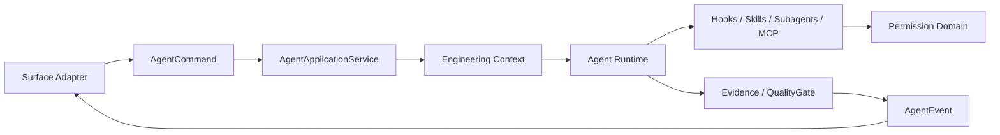

---
devseek_governance:
  generator: "devseek-doc-governance/v1"
  status: "historical"
  path: "docs/architecture/13-工程完整性与顶级增强核心设计.md"
  source_group: "architecture"
  decision: "keep"
  relationship: "legacy-architecture"
  active_baselines:
    - "docs/architecture/01-顶级编程智能体总体架构设计.md"
  machine_sources:
    active_selector: "docs/process/devseek-active-baseline-selector.json"
    legacy_inventory: "docs/process/devseek-legacy-doc-inventory.json"
  asserts_gate_pass: false
---

<!-- DEVSEEK-GOVERNANCE-BANNER:START -->
> [!NOTE]
> DevSeek governance: this document is `historical` with decision `keep` and relationship `legacy-architecture`. Current authority: `docs/architecture/01-顶级编程智能体总体架构设计.md`. Machine source: `docs/process/devseek-legacy-doc-inventory.json`.
<!-- DEVSEEK-GOVERNANCE-BANNER:END -->

# DevSeek 工程完整性与顶级增强核心设计

文档编号：ARCH-13
最后更新：2026-06-21
对应需求：[../requirements/10-工程完整性与顶级增强需求.md](../requirements/10-工程完整性与顶级增强需求.md)
状态：Phase 11/12 已落地共享内核

## 1. 设计结论

Phase 11/12 的实现必须进入 `packages/shared`，而不是进入 `extension.ts`、WebView 或 CLI main。原因是工程完整性、hooks、skills、subagents、MCP 和 Git/PR 辅助都属于 Headless Agent Core 的事实和策略边界，应该被 VS Code、CLI JSONL、CLI text、未来 Desktop/local Web 共同复用。

## 2. 模块结构

| 模块 | 文件 | 职责 |
| --- | --- | --- |
| EngineeringContextService | `packages/shared/src/engineering-context.ts` | 装配 workspace 工程事实 |
| ContentExclusionService | `engineering-context.ts` | 合并 `.devseekignore`、`.gitignore`、默认排除、用户排除和敏感路径 |
| CodebaseIndexService | `engineering-context.ts` | 生成 source/test/config/generated 轻量索引 |
| EnvironmentProfileService | `engineering-context.ts` | 识别语言、包管理器和 build/test/lint/run 命令 |
| LanguageRuntimeRegistry | `engineering-context.ts` | 声明语言能力矩阵和降级说明 |
| DependencyPolicyService | `engineering-context.ts` | 识别依赖安装、网络和 lockfile 风险 |
| ConflictGuard | `engineering-context.ts` | 写盘前检查 hash、mtime、dirty editor |
| DocGroundingService | `engineering-context.ts` | 记录外部文档来源和联网原因 |
| UsageBudgetService | `engineering-context.ts` | 估算上下文规模和 token 风险 |
| AgentEvalReplayStore | `engineering-context.ts` | 从历史任务生成可回放 regression case |
| HookPlanner | `packages/shared/src/agent-enhancements.ts` | 规划 deterministic hooks，阻断敏感写入 |
| SkillDiscoveryService | `agent-enhancements.ts` | 从 `SKILL.md` 渐进发现和选择技能 |
| SubagentRegistry | `agent-enhancements.ts` | 声明 reviewer/test-writer/diagnostics/migration-planner 契约 |
| McpPermissionService | `agent-enhancements.ts` | MCP 工具风险映射到权限域 |
| GitPrAssistantService | `agent-enhancements.ts` | 基于证据生成 commit/PR 摘要和 checklist |

## 3. CLI Bridge 静默等待根因与修正

根因：

1. CLI 创建 `AgentChatRequest` 时允许 `stream: true`。
2. `bridge-client` 调用 Bridge `/chat` 时又强制写成 `stream: false`。
3. CLI 只能等待 `response.json()`，无法接收 SSE delta。
4. text surface 没有 Provider 等待状态渲染，真实 DeepSeek 网页慢响应时超过 10 秒无任何反馈。

修正：

1. `bridge-client` 按 request 保留 `stream`，默认使用 Bridge SSE。
2. 读取 SSE `StreamDelta`，把 delta 转发给 `request.onDelta`，收到 `done` 后释放 reader。
3. 识别 Bridge `\x00RESET\x00` 快照控制标记：更新累计内容，只向 Surface 输出新增可见文本，不能把内部控制标记暴露给用户。
4. `AgentEvent` 增加 `provider.status`，Bridge 调用期间发出 `waiting/completed`。
5. `CliSurfaceAdapter` 只根据 `provider.status` 渲染等待提示；JSONL 仍输出机器可读事件。
6. 自动测试使用本地假 Bridge 延迟 SSE，稳定复现“长等待必须有提示”和“RESET 不可见”的行为。

## 4. 事件与权限边界

原则：

1. Surface 只能转换输入和渲染事件。
2. 工程事实来自 shared core，不由模型 prose 决定。
3. Hooks、skills、subagents 和 MCP 不能绕过权限和 evidence。
4. 真实 Provider 集成测试不替代 deterministic regression。

## 5. 自动测试

| 测试 | 覆盖 |
| --- | --- |
| `packages/shared/test/engineering-context.test.mjs` | 忽略规则、敏感路径、运行时识别、依赖审批、文档 grounding、预览计划、冲突检测、root 选择、replay |
| `packages/shared/test/agent-enhancements.test.mjs` | hooks、skills、subagents、MCP 权限、Git/PR 摘要 |
| `packages/cli/test/cli-jsonl.test.mjs` | CLI JSONL、text mock、Bridge SSE 延迟等待提示 |

## 6. 后续接入点

1. VS Code `runChat` workflow 继续迁入 `AgentApplicationService` use case。
2. File Changes、ReviewLedger、QualityGate 后续读取 `EngineeringContext` 作为任务事实。
3. CLI 可新增 `devseek doctor/context` 命令展示工程上下文。
4. MCP 与 subagent 真执行前必须接入 `PermissionKernel` 和 `ReviewLedger`。
