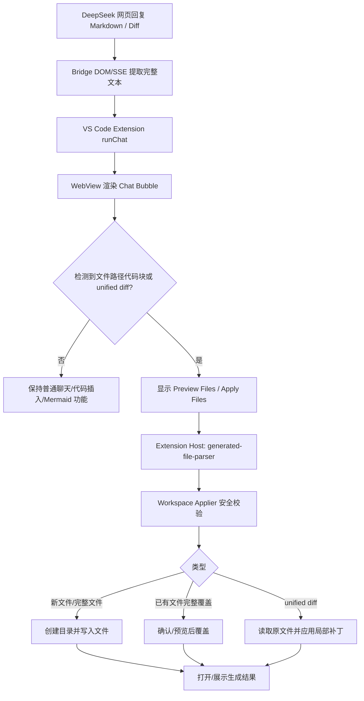
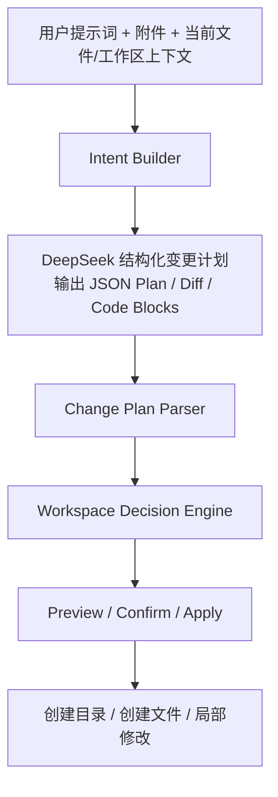

---
devseek_governance:
  generator: "devseek-doc-governance/v1"
  status: "historical"
  path: "docs/requirements/03-产品需求分析.md"
  source_group: "requirements"
  decision: "keep"
  relationship: "legacy-requirement"
  active_baselines:
    - "docs/requirements/02-顶级编程智能体需求基线.md"
  machine_sources:
    active_selector: "docs/process/devseek-active-baseline-selector.json"
    legacy_inventory: "docs/process/devseek-legacy-doc-inventory.json"
  asserts_gate_pass: false
---

<!-- DEVSEEK-GOVERNANCE-BANNER:START -->
> [!NOTE]
> DevSeek governance: this document is `historical` with decision `keep` and relationship `legacy-requirement`. Current authority: `docs/requirements/02-顶级编程智能体需求基线.md`. Machine source: `docs/process/devseek-legacy-doc-inventory.json`.
<!-- DEVSEEK-GOVERNANCE-BANNER:END -->

# DeepSeek NetAI 需求分析文档

**项目名称**: deepseek_netai
**文档版本**: v2.18
**日期**: 2026-05-15
**变更历史**:

| 版本 | 日期 | 说明 |
|------|------|------|
| v1.0 | 2026-04-27 | 初始版本 |
| v1.1 | 2026-04-27 | 可行性审计 — 修正技术方案、补充遗漏需求、升级优先级、新增风险项 |
| v1.2 | 2026-04-27 | 实施里程碑 — 核心功能已实现并通过本地端到端验证 |
| v1.3 | 2026-04-27 | UI 交互改进 — 明确 Copilot 交互模式要求：所有命令结果路由到聊天面板；增加代码块插入编辑器功能；浏览器默认无头模式 |
| v1.4 | 2026-04-29 | **Copilot 对标迭代** — 新增行内 Ghost Text 补全、行内聊天（Ctrl+I）、@workspace/@file/@terminal 上下文提供器、Agent 多步骤自主编码、工作区索引、终端集成、提交信息生成等模块；重构 Phase 3/4/5 规划 |
| v1.5 | 2026-04-29 | **Phase 3 完成状态更新** — Ghost Text、InlineChat、斜杠命令、@file、#problems、/shell、Git 提交信息、applyDiff 全部实现并打包为 v0.2.0；修复 webview `</style>` 缺失白板 Bug；Bridge 侧 SV-10/WB-12 服务端接口待 Phase 4 实装 |
| v1.6 | 2026-04-30 | **Mermaid 图表渲染 + UI 细节** — webview 内嵌 mermaid.js v11 渲染时序图/流程图等；Bridge 点击"代码"Tab（Playwright locator.click）提取源码；图表区域全宽显示、滚轮缩放、拖拽平移、工具栏（+/−/⊙/百分比）；表格加细线边框、列间距、表头背景色、隔行色 |
| v1.7 | 2026-04-30 | **Mermaid 渲染修复 + 早期渲染** — 修复 `parseFloat("100%")=100` 导致缩放比失真（巨量空白/图表偏小）；改用 `viewBox.baseVal` 读取真实尺寸；zoom 改为调整容器 px 宽度（替代 CSS transform scale）；`resetResponse` 时立即渲染不等 `endResponse`，消除人为感知延迟 |
| v1.8 | 2026-04-30 | **AI 生成文件落盘 + 局部修改** — DeepSeek 回复中识别带路径的代码块和 unified diff；支持在 VS Code 工作区创建目录、创建文件、覆盖文件、应用文件局部修改；WebView 提供“预览/应用文件”操作；Extension Host 负责路径安全、确认、写入和 diff 预览，Bridge 继续只负责 DeepSeek 网页交互，确保既有聊天、附件、Mermaid 功能不受影响 |
| v1.9 | 2026-05-01 | **Copilot 风格文件变更重构** — 将“生成文件/修改文件”能力从自由文本后处理重构为“提示词意图层 + 结构化变更计划层 + 工作区决策层 + 应用层”；明确当前 v1.8 为基础版能力，v1.9 目标是实现更稳定的文件创建、目录创建、局部修改与批量应用流程 |
| v2.0 | 2026-05-01 | **总体能力边界重检讨** — 从“DeepSeek 网页免费版 + Copilot 体验对标”双前提出发，明确哪些能力可以做到、哪些只能近似替代、哪些不应承诺；将产品目标收敛为“最优免费 AI 编程插件”而非“完整复刻 Copilot” |
| v2.1 | 2026-05-01 | **智能编程体闭环重检讨** — 新增“工程自编译 / 收集错误 / 自动回传 DeepSeek / 更新代码”的受控闭环需求；明确该能力可以实现，但只能按受控迭代和显式构建配置落地，不能承诺无限自动自治 |
| v2.2 | 2026-05-01 | **回退能力补充** — 新增“发现当前修复引入问题时必须可回退”的需求；要求文件变更链与编译-修复闭环都具备显式回退/停止能力 |
| v2.3 | 2026-05-01 | **状态反馈可视化补充** — 新增“Working / Reading / Generating / Apply / Validate / Rollback / Finish”等人性化状态提示；要求智能体自动与 DeepSeek 沟通时，在固定区域动态展示当前步骤与进度，作为下一迭代任务 |
| v2.4 | 2026-05-01 | **回复完整性补充** — 新增“同一轮 DeepSeek 回复即使被网页拆成多个 AI 消息块，也必须在插件侧聚合为完整结果显示”；要求流式渲染结束后用最终全文做一次一致性覆盖，避免聊天面板显示不全 |
| v2.5 | 2026-05-01 | **架构治理与追溯补充** — 新增“功能迭代默认最小修改、必要时可重构但必须给出架构依据；所有新增功能同步更新需求/设计/变更日志；重要变更必须纳入备份与追溯链路” |
| v2.6 | 2026-05-02 | **Copilot 人性化交互补充** — 新增“历史用户消息可点击编辑并重发、流式更新时上翻不打断、未读新消息提示、操作图标语义化、聊天视图统一焦点体验” |
| v2.7 | 2026-05-02 | **编程意图与验证策略审计补充** — 新增“非编程问题不得触发自动落盘/自动编译；单文件变更优先最小范围验证；多 main 场景默认 compile-only；验证策略需输出选择原因” |
| v2.8 | 2026-05-02 | **顶级智能体能力补充** — 明确“本地优先执行、混合理解、最小上下文发送、失败后升级 DeepSeek、可选人工审批、重复请求上下文复用”六项核心要求 |
| v2.9 | 2026-05-02 | **顶级工程规则补充** — 新增“每次代码修改都必须符合顶级编程智能体架构与实现规范；禁止补丁式头痛医头改法作为默认策略” |
| v2.10 | 2026-05-02 | **执行闭环强化补充** — 新增“编译通过后需执行确认（可安全场景）；默认修复上限 6 轮；上限后必须询问后续动作” |
| v2.11 | 2026-05-03 | **顶级变更闸门落地补充** — 新增统一变更闸门模板与 Definition of Done，要求每次功能开发必须产出"需求归因/架构定位/策略说明/主回退验证/追溯更新"完整记录 |
| v2.12 | 2026-05-07 | **Working 区 Copilot 对标 + File Changed 三层交互** — 对标 Copilot Working 区行为（进行中单步紧凑卡片 + 完成后小字脚注折叠）；File Changed 采用 L1/L2/L3 三层显示，取消每文件 Keep/Undo 按钮，目录项附加工作区前缀 |
| v2.13 | 2026-05-07 | **Working+FileChanged 细节优化** — Working 圆点添加呼吸动画；`fsr-btn` 失败步骤变橙警告色；`fsr-body` 改用 max-height CSS 过渡展开；chevron 改为旋转动画；完成摘要卡与队列卡文件 chip 改为 basename+tooltip；`pe-dirname` opacity .55→.65；L2 文件列表展开新增淡入动画 |
| v2.14 | 2026-05-07 | **Working 区逻辑链完整化** — 对标 Copilot 全链路展示（分析请求 → 接收回复 → 识别文件 → 写入文件 → 编译验证 → 自动修复）；修复 apply/validate/repair 完成步骤未被记录进快照的根本问题 |
| v2.15 | 2026-05-09 | **多模型接入 + Agent 智能化升级** — 新增 LLM Provider 抽象层（bridge/deepseek-api/openai-compat 三种 Provider）；状态栏模型选择器；项目规则文件 `.deepseek/rules.md`；诊断上下文自动注入；终端工具 `run_in_terminal`；多轮 Agent 循环（L-1/L-4）；跨任务对话历史；`manage_todo_list` 工具（L-2）；`task_complete` 工具（L-3）；AI 可通过文本格式调用工具动态更新 Todo 列表 |
| v2.16 | 2026-05-10 | **自动驾驶模式 + Append 风格任务行** — L-5 自动驾驶模式（状态栏切换按钮，Agent 完成后自动接受全部文件改动）；F-4 Append 风格任务行（计划阶段不预建占位行，任务行在执行阶段逐个追加，对标 Copilot 交互模式） |
| v2.17 | 2026-05-13 | **Copilot 执行流全链路深度对标** — 基于 7 张截图 + 源码逆向分析，补充 6 项 Copilot 任务执行行为规格：G-1 规划推理 bullet 可见化、G-2 终端确认内联卡片（替代 VS Code modal）、G-3 Ran 命令独立行、G-4 程序输出内联嵌入响应、G-5 编辑器标题 Keep/Undo 覆层、G-6 Allow 下拉选项；同步新增专题 C 详细规格 |
| v2.18 | 2026-05-15 | **文件/目录上下文作用域修正** — 修正两个上下文泄漏问题：(1) 用户附加文件/文件夹仅对当次消息有效，发送无附件的新消息时自动清除，不再跨消息继承；(2) 自动识别目录（prompt 路径探测）的文件不写入持久化上下文，仅服务当次请求；同步修正目录扫描时排除 `docs/`、`test/` 子目录，以及扩展名过滤（prompt 中含 `.hpp` 仅取 `.hpp` 文件）|
---

## 一、项目背景
### 1.6 顶级智能体能力目标（v2.8）

为了达到“最优秀编程智能体 AI 插件”的目标，本项目新增如下硬性能力要求：

1. 本地优先执行
- 对编译/运行/验证类请求，插件应优先在本地推导并执行动作，不得默认退化为“仅显示命令文本”。

2. 混合理解策略
- 能本地理解的请求由本地策略直接处理。
- 本地不确定时，允许调用 DeepSeek 进行意图/修复协助，再由插件执行动作。

3. 最小上下文发送
- 不得默认把全部附件发送给 DeepSeek。
- 仅发送失败栈、相关文件与必要上下文（最小集合）。

4. 失败升级与闭环
- 本地执行失败 -> 错误采集 -> DeepSeek 修复 -> 插件应用 -> 原命令重跑验证。
- 闭环“成功”标准应以原本地目标命令通过为准。

5. 用户协同审批
- 对高影响动作支持“执行前确认”模式。
- 支持自动与确认两种执行策略。

6. 对话上下文复用
- 对“再次编译/重新运行”等自然语言请求，插件应复用上一轮目标计划，而非退回普通聊天。

8. 顶级工程规则（强制）
- 每次代码修改都必须符合“顶级编程智能体”标准：先做需求归因、架构影响分析、策略分层设计，再实施代码。
- 禁止把“补丁式临时修复”作为默认实现路径；补丁仅可作为应急止血，并必须附带后续结构化重构计划。
- 每次修改必须产出最小合规记录：
  1) 变更属于哪个能力层（理解 / 规划 / 执行 / 验证 / 修复 / 回退）；
  2) 为什么选择当前方案而非补丁式替代；
  3) 对闭环成功判据的影响；
  4) 对文档与追溯链路的更新结果。

9. 执行闭环强化（强制）
- 自动验证在可安全识别单一入口场景下，必须在编译通过后执行程序并确认运行无错误。
- 当无法安全执行（如多 main）时，必须明确给出原因，不得静默当作“执行已确认”。
- 自动修复默认上限为 6 轮。
- 达到上限后必须询问用户后续动作：继续修复、给出手动修改建议、停止。

10. 统一变更闸门执行（强制）
- 每次功能新增或行为变更，必须先完成统一闸门记录，再进入实现。
- 闸门模板位于 `docs/process/TOP_AGENT_CHANGE_GATE.md`。
- 未完成闸门记录的改动，不得标记为完成交付。

11. Definition of Done（强制）
- 代码编译通过且关键文件无静态错误。
- 主链路和回退链路至少各有一条可复现验证记录。
- 需求、设计、变更日志同步更新完成。
- 涉及高风险改动时，具备版本追溯与回退路径。

---

### 专题 A：Working 区体验规格（v2.12）

**Copilot 行为分析**

1. **进行中**：仅显示当前最新步骤的单条紧凑卡片（小点 + 步骤标题 + 可选详情），不堆积历史步骤。
2. **完成后**：Working 卡片消失，原位替换为一行小字脚注：`已完成 · N步 ∨`，透明度 ~62%。
3. **展开**：点击 `∨` 切换展开/折叠，显示带序号的步骤列表，列表在 250px 内可滚动。
4. **无步骤/单步骤且无文件**：不渲染任何完成摘要，静默跳过。

**当前实现**

- `renderWorkingArea()`：仅取最新 `workingEntries` 条目，渲染 `working-card.compact`（`working-dot` + `wi-title` + 可选 `wi-detail`）。
- `addCompletionSummaryCard()`：渲染 `fsr-row`，包含 `fsr-btn`（`已完成 · N步 ∨`）和隐藏的 `fsr-body`（步骤列表）；点击按钮切换 `fsr-open` class。
- 文件摘要卡（绿色边框）仅当 `hasFiles` 时渲染；无文件时省略。
- 进行中 delta 阶段：显示 `已接收 N 字符` 字符计数作为 `wi-detail`。

**需求约束**

- 进行中不得积累历史步骤列表，避免视觉刷屏。
- 完成后脚注必须小字、低对比度，不阻断主内容阅读。
- 步骤列表展开/折叠必须在原位完成，不弹出浮层。

---

### 专题 B：File Changed 三层交互规格（v2.12）

**Copilot 行为分析**

- **L1（摘要行）**：`N files changed  +X -Y  [Keep All] [Undo All]`，带 `▶` 折叠箭头，默认折叠。
- **L2（文件列表）**：展开后每行显示 `文件名`（粗体 12px）+ `工作区名 • 目录/`（10px 灰色），带 `+X -Y` 差异统计；**无每文件 Keep/Undo**。
- **L3（diff 编辑器）**：点击文件行 → 在编辑器打开 diff 视图。
- 工作区前缀：dirname 格式为 `<wsFolderName> • <relDir>/`。

**当前实现**

- `renderPendingEdits()`：L1 渲染 `.pe-header`（N files changed + global Keep/Undo）；L2 渲染 `.pe-file-list`（每项含 `.pe-basename` + `.pe-dirname`）；点击行发送 `openPendingEdit` 消息。
- 已移除每文件 Keep/Undo 按钮（`.pe-file-btns`）。
- `window.__wsFolderName` 由 `extension.ts` 在 HTML 模板中注入：`window.__wsFolderName = ${JSON.stringify(wsFolderName)}`。
- `pe-dirname` 格式：`${wsFolderName} • ${relDir}/`（relDir 为空时显示 `${wsFolderName} • ./`）。

**需求约束**

- 操作按钮只在 L1 层提供，文件列表为纯信息展示。
- 工作区前缀必须正确反映当前 VS Code 工作区第一根目录名称。
- 点击文件行必须能打开对应 diff 预览。

---

### 专题 C：Copilot 任务执行全链路行为规格（v2.17）

> 本专题基于 7 张 Copilot 执行截图的逐帧分析，结合 `workbench.desktop.main.js` + `extension.js` 源码逆向，补充了之前文档未完整覆盖的 6 项执行行为规格。截图任务："在 code 目录下，编写一个 C 程序，打印 hello deepseek plus AI"（Claude Sonnet 4.6 执行）。

#### C.1 全链路执行时序（截图序列）

| 截图 | 阶段 | 关键显示内容 |
|------|------|------------|
| 1 | 规划 | `Working` 标题 + 推理 bullet 文本 + `Read □ code`（进行中）+ `Evaluating` |
| 2 | 执行 | `Read □ code` ✓ + `Created < hello_deepseek.c` ✓ + `Analyzing` |
| 3-4 | 终端确认 | `Finished with 3 steps ∨`（折叠）+ 下方内联确认卡片 |
| 5 | 命令运行中 | `Finished with 3 steps ∨` + `Ran cd /…/code && gcc hello_...` |
| 6 | 完成 | `Finished with 3 steps ∨` + 响应文字 + 内联输出代码块 |
| 7 | 全局视图 | 左：Diff 编辑器标题覆层 Keep/Undo；右：聊天面板；底：pe 面板；终端 ls 输出 |

---

#### G-1 规划推理 Bullet 可见化

**Copilot 行为**：执行开始时，Working 区内第一个元素是一条**纯文本规划推理句**，格式：
> `The user wants to {目标}. Let me {下一步动作}.`

该推理 bullet 在所有工具调用行**之前**出现，像第一个操作步骤一样排列在 thinking box 内。AI 在输出这段推理文字后才开始调用 `read_file`、`create_file` 等工具。

**与工具行的区别**：推理 bullet 无文件 chip 后缀，无图标前缀，是纯 markdown 段落文字。

**当前插件状态**：Working 区当前只显示任务行（action+desc），无规划推理句展示。

**需求约束**：
- 执行第一步前，Working 区应显示一条简短推理说明（当 AI 在 system prompt 中输出规划文字时提取并展示）。
- 该推理句作为 thinking box 的"第 0 步"展示，不计入 N 步统计。
- 若 AI 未输出规划推理，静默跳过，不强制制造假推理文字。

---

#### G-2 终端确认内联卡片（替代 VS Code Modal）

**Copilot 行为**：当 Agent 需要执行终端命令时，**不弹出 VS Code modal 对话框**，而是在聊天流中注入一张**内联确认卡片**，位于 `Finished with N steps ∨` 折叠块**之后**：

```
┌─ 内联确认卡片 ────────────────────────────────────┐
│  Run bash command within ~/work/.../code?           │
│                                                     │
│  ┌── shell ────────────────────────────────────┐   │
│  │  gcc hello_deepseek.c -o hello_deepseek \   │   │
│  │  && ./hello_deepseek                        │   │
│  └──────────────────────────────────────────── ┘   │
│                                                     │
│  [Allow ∨]   [Skip]                                │
└────────────────────────────────────────────────────┘
```

**卡片特征**：
- 标题行：`Run bash command within {目录}?`（含工作目录缩略）
- 命令完整展示在 monospace 代码块中
- `Allow ∨`：Allow 按钮带下拉箭头（选项见 G-6）
- `Skip`：跳过执行，Agent 继续但无终端输出

**当前插件状态**：使用 `vscode.window.showWarningMessage` 模态对话框，阻塞整个 VS Code 窗口，体验差。

**需求约束**：
- 终端确认必须在聊天面板内以内联卡片形式呈现，不得弹出全局 modal。
- 卡片必须显示完整命令（可滚动）。
- Allow/Skip 按钮在卡片内操作，结果通过 webview → extension 消息传递。
- 确认后卡片保持可见（不删除），按钮变为灰色不可用，显示"已允许"状态。

---

#### G-3 "Ran 命令" 独立行展示

**Copilot 行为**：用户点击 Allow 后，命令实际执行时，在聊天流中**`Finished with N steps ∨` 折叠块下方**出现一行独立的命令执行记录：

```
  Ran  cd /home/ff/work/.../code && gcc hello_deepseek.c -o…  [截断]
```

格式特征：
- `Ran` 关键词（粗体或语义前缀）
- 命令文字（超长时尾部截断，保留开头）
- 图标：codicon-terminal（绿色，成功）或 codicon-error（红色，失败）
- 位置：紧接 Finished block 之后、AI 响应正文之前

**当前插件状态**：终端执行状态仅通过 agentStatus 卡片传递，无独立 "Ran" 行样式，且位置在 Working 区而非聊天流主内容区。

**需求约束**：
- 终端命令执行后，应在聊天主流中以 "Ran" 行（区别于工具行）展示已执行命令摘要。
- 过长命令截断为约 120 字符，末尾加 `…`。
- 成功/失败通过图标颜色区分。

---

#### G-4 程序输出内联嵌入响应文字

**Copilot 行为**：程序执行结果直接嵌入 AI 的文字响应中，格式：

> 响应文字："**hello_deepseek.c 已创建，编译运行输出：**"
>
> ```
> hello deepseek plus AI
> ```

**关键点**：
- 程序输出是 AI **回复内容的一部分**（不是单独的 agentStatus 卡片）。
- 输出以代码块包裹，出现在响应正文中。
- AI 在写响应时已感知到执行输出（output 被回传给 LLM 作为 tool_result）。

**当前插件状态**：终端输出通过 agentStatus 消息传送到 Working 区，AI 的最终响应文字不包含实际程序输出（仅有编译结果描述）。

**需求约束**：
- 程序执行输出必须作为 tool_result 回传给 LLM，让 AI 在最终响应中引用并展示。
- AI 响应中的输出代码块应与普通代码块同等渲染（语法高亮 + 复制按钮）。
- 输出超过 2000 字符时截断，并附注"输出已截断"。

---

#### G-5 编辑器标题栏 Keep/Undo 覆层

**Copilot 行为**：Diff 编辑器打开后，编辑器**标题栏**叠加 Keep/Undo/复制按钮行（overlay），独立于底部 pe-panel 存在：

```
  hello_deepseek.c  [Keep]  [Undo]  [↗ 复制]
```

**与 pe-panel 的关系**：同一文件同时在两处显示操作入口：
- 编辑器标题覆层（L0）：单文件，紧贴文件名
- 底部 pe-panel（L1）：汇总所有 pending 文件的全局 Keep All / Undo All

**当前插件状态**：pe-panel 已实现（L1 全局层）；编辑器标题覆层（L0）未实现。

**需求约束**：
- 每次 Diff 编辑器打开时，标题栏应注入 Keep/Undo 按钮（`vscode.window.showTextDocument` + `EditorTitleMenu` contribution point 或 WebviewView overlay）。
- L0 操作的语义与 pe-panel 一致：Keep 确认保留，Undo 恢复原文件。
- L0 操作成功后同步更新 pe-panel 状态。

---

#### G-6 Allow 按钮下拉选项

**Copilot 行为**：G-2 确认卡片中 `Allow ∨` 按钮有下拉菜单，包含多个权限级别选项：

| 选项 | 语义 |
|------|------|
| Allow once | 仅本次允许（默认） |
| Always allow in workspace | 工作区范围内永久允许同类命令 |
| Manage terminal permissions | 打开权限管理设置 |

**关联设计**：Copilot 的 `permissionLevel`（`autopilot` / `autoApprove` / 手动）概念在此体现：选择 "Always allow" 等价于切换到 `autoApprove` 模式。

**当前插件状态**：Allow 按钮无下拉，点击即立即执行，无权限级别区分。

**需求约束**：
- G-2 确认卡片中，Allow 按钮应分拆为：主按钮"允许"（Allow once）+ 下拉展开选项。
- "总是允许（本工作区）"选项应持久化到 `devseek.executionApproval=auto` 配置。
- 选项通过 webview dropdown + Chevron 实现，不用 VS Code QuickPick。

---（https://chat.deepseek.com/）可免费访问，具备强大的代码理解与生成能力。VS Code 插件 GitHub Copilot 提供了优秀的 AI 辅助编程体验，但需要付费订阅。

本项目目标：**通过自动化封装 DeepSeek 网页版，构建一套本地可用的免费 AI 编程辅助工具，提供类 Copilot 的 VS Code 插件体验。**

### GitHub Copilot 功能对标矩阵

| Copilot 核心功能 | 本项目状态 | 计划阶段 |
|---|---|---|
| Chat 对话面板 | ✅ 已实现 | — |
| 代码解释/修复/重构/测试/文档 | ✅ 已实现 | — |
| 流式逐字输出 | ✅ 已实现 | — |
| 代码块插入编辑器 | ✅ 已实现 | — |
| LSP 诊断注入 | ✅ 已实现 | — |
| **行内 Ghost Text 补全**（Tab 接受） | ✅ 已实现（v0.2.0） | — |
| **行内聊天覆盖层 Ctrl+I** | ✅ 已实现（v0.2.0） | — |
| **斜杠命令**（/explain /fix 等） | ✅ 已实现（v0.2.0） | — |
| **@file 指定文件引用** | ✅ 已实现（v0.2.0） | — |
| **#problems 诊断列表** | ✅ 已实现（v0.2.0） | — |
| **提交信息自动生成** | ✅ 已实现（v0.2.0） | — |
| **自然语言转终端命令** | ✅ 已实现（v0.2.0，`/shell` 命令） | — |
| **多文件同步编辑**（Diff 视图） | ✅ 单文件 Diff 预览已实现（v0.2.0） | — |
| **Mermaid 图表渲染**（时序图/流程图等） | ✅ 已实现（v0.2.0，mermaid.js v11 内嵌；viewBox 精确尺寸；全宽适配；鼠标缩放/平移；"渲染\|代码"双 Tab；生成结束后立即渲染） | — |
| **AI 生成文件应用到工作区**（创建目录/文件/局部修改） | ⚠️ 已实现基础版（v0.2.0，支持路径代码块与 unified diff；需按 v1.9 重构为 Copilot 风格结构化变更计划） | Phase 4+ |
| **工程自编译 + 错误回传修复闭环** | ⚠️ 受控可行，需新增构建配置、错误采集和迭代上限 | Phase 5 |
| **修复失败后的可回退能力** | ⚠️ 受控可行，需记录每轮变更快照或 undo 计划 | Phase 5 |
| **智能体运行状态可视化提示** | ⚠️ 需新增统一状态事件与 WebView 固定状态框 | Phase 4 |
| **智能体自动沟通过程固定框动态显示** | ⚠️ 需把 Agent / Validate / Repair 步骤流与普通聊天回复分离展示 | Phase 5 |
| **DeepSeek 长回复完整显示** | ⚠️ 需聚合同轮多个 AI 消息块，并在流式结束后用最终全文覆盖 webview 渲染结果 | Phase 4 |
| **@terminal 终端输出上下文** | ❌ 未实现 | Phase 4 |
| **对话历史持久化** | ❌ 未实现 | Phase 4 |
| **@workspace 全库上下文** | ❌ 未实现 | Phase 4 |
| **Agent 多步骤自主编码** | ❌ 未实现 | Phase 5 |

### 1.1 总体目标重述

在“使用 DeepSeek 网页免费版能力”的前提下，本项目的正确目标不是机械复刻 GitHub Copilot 的全部形态，而是：

1. 尽可能复用 DeepSeek 免费能力，获得高性价比的编程辅助效果。
2. 在 VS Code 内把“聊天、上下文、文件变更、补全、诊断、终端建议”组织成接近 Copilot 的统一体验。
3. 明确承认网页自动化方案的上限，不承诺依赖底层专有 API 才能稳定实现的能力。
4. 把资源优先投入到“高频、稳定、可验证”的能力，而不是追求表面功能数量。

### 1.2 产品定位结论

因此，本项目更准确的定位应是：

**基于 DeepSeek 网页免费版的高性价比 VS Code AI 编程助手**

而不是：

**完全等价于 GitHub Copilot 的替代品**

这不是措辞保守，而是产品边界判断。只有先承认边界，后续设计才会收敛到真正可落地的“最优插件”。

### 1.3 架构演进与变更治理要求

为了支撑后续长期持续迭代，本项目除了功能需求外，还必须满足以下工程治理要求：

1. **默认最小修改**：新增功能优先复用既有模块和接口，避免为短期需求打穿层次、复制逻辑或在 WebView / Extension / Bridge 之间引入隐式耦合。
2. **必要时允许重构**：如果现有架构已经无法支撑新需求，允许重构；但重构必须说明触发原因、边界变化、兼容策略与回退方式，不能以“先改动再观察”为默认策略。
3. **设计模式约束**：后续功能扩展应优先采用可维护的模式组织，如 Strategy、Facade、Repository、Pipeline / Chain of Responsibility，而不是继续堆叠条件分支和跨层直接调用。
4. **文档同步要求**：任何新增功能、行为变更、架构调整，都必须同步更新 `docs/requirements/02-顶级编程智能体需求基线.md` 或 `docs/requirements/03-产品需求分析.md`、`docs/architecture/01-顶级编程智能体总体架构设计.md` 或对应编号设计文档、`docs/release/CHANGELOG.md`；若只改代码不改文档，视为交付不完整。
5. **追溯性要求**：重要功能上线、架构调整、回滚修复，都必须具备可追溯记录，包括版本号、日期、影响模块、对应文档条目和变更说明。
6. **备份管理要求**：涉及重要架构调整、接口变化或高风险功能时，应在 `backups/<版本>-<日期>/` 保留可回查快照，至少包含关键源码、包配置和对应文档版本。
7. **问题定位优先级**：排障时应优先沿“需求 -> 设计 -> 实现 -> 版本履历 -> 备份”链路定位，避免直接在现网代码中盲目试错。

### 1.4 Copilot 人性化交互补充（v2.6）

本次补充的目标不是“视觉仿制”，而是“操作习惯对齐”。

1. 历史消息编辑重发
- 用户点击历史用户消息后，可进入编辑态并重新发送。
- 重新发送默认复用原始 prompt（而非仅渲染文本），避免上下文丢失。

2. 流式更新不打断阅读
- 当用户滚动到历史内容区域时，流式更新继续在后台进行，不强制跳到底部。
- 新增“新内容”提示按钮；用户主动点击后回到底部继续追流。

3. 操作图标语义化
- 常用动作（预览/应用/编辑重发）增加图标语义，降低识别成本。

4. 视图焦点一致性
- 打开 DeepSeek 聊天应优先聚焦当前侧栏聊天视图，减少多层入口切换。

5. 可实现性结论
- 以上能力在当前架构下可实现，且不依赖 Bridge 改造。
- 实现位置应优先在 WebView 交互层与 Extension 焦点控制层，不应侵入模型交互主链路。

### 1.5 先进实现方式审计结论（v2.7）

结合 Copilot 与主流 AI 编程智能体（Cursor / Windsurf / Cline 类工作流）归纳，本项目应采用以下原则：

1. 意图路由优先于关键词触发
- 先进做法：先做任务类型判定（解释/方案/变更/修复），再决定是否进入自动应用链路。
- 本项目要求：非文件变更任务不得自动触发 apply/validate。

2. 最小验证范围优先于目录全量验证
- 先进做法：changed files first；目标不唯一时降级 compile-only。
- 本项目要求：单文件改动不得默认编译整个目录；多 main 先禁用 auto-run。

3. 运行与编译解耦
- 先进做法：先 compile，再按条件 run。
- 本项目要求：验证策略必须区分 `compile-only` / `compile-run` / `cmake`。

4. 策略可解释
- 先进做法：输出目标选择依据，便于审计与回归。
- 本项目要求：验证状态需显示策略模式与原因。

---

## 二、技术可行性分析

| 维度 | 结论 | 说明 |
|------|------|------|
| DeepSeek 网页访问 | ✅ 可行 | Playwright 可模拟完整浏览器行为，支持 Cookie 持久化 |
| 流式响应获取 | ✅ 可行（方案调整）| **推荐拦截网络请求**而非监听 DOM，稳定性更高（见 WB-04 修订）|
| VS Code 插件开发 | ✅ 可行 | Extension API 完整，TypeScript 生态成熟 |
| 本地桥接服务 | ✅ 可行 | Node.js + Express，与插件同语言，无需额外运行时 |
| 行内实时代码补全 | ⚠️ 有限支持 | 浏览器自动化延迟 1~5s，不适合逐字符触发；**可行方案：快捷键主动触发（Alt+\） + `InlineCompletionItemProvider` API 注册 Ghost Text**（见 EX-30 系列）|
| 终端错误注入 | ⚠️ 间接可行 | VS Code Terminal API **不支持直接读取终端输出**；方案：监听 `vscode.window.onDidWriteTerminalData`（实验性）；或让用户通过 `@terminal` 手动粘贴错误（见 EX-53）|
| 代码上下文注入 | ✅ 可行 | `vscode.TextDocument` / `Selection` / `Diagnostic` API 均可用 |
| 工作区全局索引 | ⚠️ 有限可行 | 大型项目不能全量发送；可行方案：用 `vscode.workspace.findFiles` 构建文件树摘要 + 关键文件内容按需加载（见 WB-12/EX-50 系列）|
| 行内聊天覆盖层（Ctrl+I） | ✅ 可行 | VS Code 支持 `QuickInput` + 浮动 Widget；结合 `vscode.diff()` 展示 AI 修改（见 EX-40 系列）|
| 反自动化检测规避 | ⚠️ 需处理 | DeepSeek 可能检测无头浏览器；需使用 stealth 参数，默认改为有头模式（见风险章节）|
| 工程级编译-修复闭环 | ⚠️ 受控可行 | 可以由插件调用受限 build/test 任务、收集 Problems/终端错误并回传 DeepSeek，再生成结构化修复计划；但必须限制迭代次数、限定命令来源，并提供人工确认 |

### 2.1 从“DeepSeek 网页免费版”出发的能力边界

#### 可以做到的能力

1. 基于网页自动化实现稳定聊天、附件上传、流式回复采集。
2. 在 VS Code 内叠加上下文组织能力，如当前文件、选区、诊断、附加文件、目录摘要。
3. 通过 Prompt + Parser + Workspace Apply，把 DeepSeek 的回复转化为可预览、可确认的工程变更。
4. 提供“近似 Copilot”的交互体验，例如聊天面板、行内聊天、受控补全、命令生成、diff 预览。

#### 只能近似替代、不能等价承诺的能力

1. **实时低延迟补全**：网页自动化链路先天比原生模型 API 更慢，难以达到 Copilot 级逐字符补全体验。
2. **稳定的全库语义索引**：没有底层 embedding / retrieval 服务时，只能做目录摘要 + 按需读取，不能宣称等价于成熟的全库语义系统。
3. **完全可靠的 Agent 自主编码**：基于网页模型和本地规则可以做多步骤编排，但稳定性和可控性不应被高估。
4. **长期会话一致性**：网页会话、登录状态、页面结构、风控策略都可能变化，不应把长期稳定性表述得过满。

#### 不应承诺的能力

1. 不应承诺“完全超越 Copilot”。
2. 不应承诺“所有编程问题都能自动可靠落盘”。
3. 不应承诺“像原生 API 一样稳定且可控”。
4. 不应承诺“复杂仓库中的全自动重构”可以默认安全完成。
5. 不应承诺“无限自动编译直到全部通过”的无人值守自治循环。
6. 不应承诺“自动修复即使失败也不会污染工作区”，回退能力必须显式设计。

#### 正确表述

最合理的产品目标表述应为：

**在免费前提下，尽可能逼近 Copilot 的高频核心体验，并在部分工作流中做到更强的可预览、可确认、可控落盘。**

### 2.2 长期演进可行性结论

从长期维护视角看，本项目不只是“当前能跑通”，还必须具备持续演进能力。因此技术可行性的判断标准需要再补充一层：

1. 新能力是否能放入既有层次，而不是新增一条平行主链路。
2. 新能力是否能复用统一的数据结构、状态流和错误处理机制。
3. 新能力失败时是否存在明确的降级与回退路径。
4. 新能力上线后，是否能通过文档和备份快速定位到引入点。

如果某项需求只能通过跨层直连、状态散落和隐式副作用实现，那么即使短期可行，也不应视为“架构上可接受”。

---

## 三、系统架构概览

```
┌──────────────────────────────────────────────────────────┐
│                     VS Code 编辑器                        │
│  ┌────────────────────────────────────────────────────┐  │
│  │            deepseek-netai 插件 (TypeScript)         │  │
│  │  - Chat 面板（侧边栏 WebView）✅                    │  │
│  │  - 行内聊天覆盖层（Ctrl+I）🆕                       │  │
│  │  - Ghost Text 行内补全（Alt+\ 触发，Tab 接受）🆕    │  │
│  │  - 右键代码操作菜单 ✅                              │  │
│  │  - 上下文提供器（@file @workspace @terminal）🆕     │  │
│  │  - 终端命令建议 & Git 提交信息生成 🆕               │  │
│  │  - Generated Files Parser / Workspace Applier ✅    │  │
│  └───────────────────┬────────────────────────────────┘  │
└──────────────────────┼───────────────────────────────────┘
                       │ HTTP + SSE (localhost)
┌──────────────────────▼───────────────────────────────────┐
│              本地桥接服务 (Node.js / Express)              │
│  - 接收插件请求，组装 Prompt                              │
│  - 请求队列管理 & 速率限制                               │
│  - Session 会话管理                                       │
│  - 工作区文件索引缓存（目录树 + 文件摘要）🆕             │
│  - Agent 任务编排（多步骤规划/读取/生成/回滚）🆕         │
└──────────────────────┬───────────────────────────────────┘
                       │ Playwright 浏览器自动化
┌──────────────────────▼───────────────────────────────────┐
│           DeepSeek 网页版 (https://chat.deepseek.com/)    │
│  - 自动登录 & Cookie 持久化                              │
│  - 发送消息 / 读取流式响应（DOM 轮询）                   │
│  - 新建/切换对话                                         │
└──────────────────────────────────────────────────────────┘
```

### 3.1 AI 生成文件应用架构（v1.8）



设计原则：

- **Bridge 不写文件**：Bridge 只负责 DeepSeek 网页自动化、附件上传和回复采集。
- **Extension Host 写文件**：所有路径校验、目录创建、文件写入、diff 预览都在 VS Code Extension Host 中完成。
- **WebView 只做交互**：WebView 检测是否可能存在生成文件，并把原始回复文本发给 Extension；最终解析以 Extension 为准。
- **默认不静默覆盖**：已存在文件或局部修改需要用户确认；支持 Preview Files。
- **路径安全**：拒绝绝对路径、`..` 越界路径、工作区外路径。

### 3.2 v1.8 需求检讨结论

| 需求 | 对策 | 风险控制 |
|---|---|---|
| 保持已有聊天、附件、Mermaid、插入代码功能不受影响 | 新增独立 parser/applier 模块；WebView 只追加按钮，不改原有渲染主链路 | 编译验证；按钮仅在检测到文件块时出现 |
| 创建目录 | 写入前使用 `vscode.workspace.fs.createDirectory()` 递归创建父目录 | 路径必须位于当前 workspace 内 |
| 创建文件 | 从回复中识别 `### path/to/file.ext` + 代码块，写入对应路径 | 新文件直接创建；写入后打开文件 |
| 覆盖完整文件 | 同格式路径代码块，如果目标文件已存在，则确认/预览后覆盖 | 默认弹窗确认；Preview 打开 diff |
| 文件局部修改 | 支持 unified diff 代码块（`--- a/file` / `+++ b/file` / `@@`） | 仅支持标准 diff；补丁应用失败则停止并提示 |
| 多文件批量应用 | 一个回复中识别多个文件/patch，支持 Apply All | 统计变更数量并统一确认 |
| DeepSeek 输出不规范 | 只处理明确带路径的代码块或标准 diff；无路径代码块保留原“插入/复制”功能 | 不猜测路径，避免误写 |

### 3.3 v1.9 需求重构结论（Copilot 风格）

v1.8 的核心问题不是“不会写文件”，而是“文件路径决策依赖自由文本猜测”。要做到接近 Copilot 的编程辅助体验，必须把这部分能力独立为稳定的变更规划链路。

#### v1.9 的目标定义

目标不是让插件“像人一样理解自然语言”，而是让插件具备以下四层能力：

1. **提示词意图层**
  从用户请求中提取：要新建还是修改、希望放在哪个目录、目标语言、候选文件名。
2. **结构化变更计划层**
  优先要求 DeepSeek 返回 JSON 变更计划或标准 unified diff，而不是只返回散文说明或 shell 步骤。
3. **工作区决策层**
  结合 VS Code 工作区目录结构、现有文件、用户附加文件上下文，对模型计划进行校验、修正、补全和确认。
4. **应用层**
  负责 Preview / Apply / Overwrite Confirm / Patch Apply / Rollback（或至少走 VS Code undo 栈）。

#### v1.9 核心需求

| 需求 | 说明 | 设计要求 |
|---|---|---|
| 提示词理解 | 识别“在 code 目录下创建 helloworld.cpp”“修改 test_count.cpp 增加参数校验”等意图 | 插件不做人类级理解；使用“规则 + 模型结构化计划”组合 |
| 创建目录 | 模型返回路径不存在时自动创建父目录 | 目录创建必须在 workspace 内 |
| 创建文件 | 支持完整文件内容落盘 | 新文件可直接创建；应提供预览 |
| 修改文件 | 支持完整覆盖和局部 patch | 优先 unified diff；失败时回退到预览确认 |
| 多文件应用 | 一次回复中包含多个文件创建/修改 | 必须有变更列表和批量确认 |
| 编程类提示模板分模式启用 | 编程相关请求不应一刀切强约束；应按“解释 / 方案 / 变更”模式选择不同模板强度 | 只有文件变更任务使用强结构化契约 |
| 不规范回复兼容 | DeepSeek 可能返回 shell 命令、自然语言描述、标题+代码块、diff、JSON 混合内容 | JSON plan > diff > 显式路径代码块 > 自然语言推断，按优先级处理 |
| 不影响已实现功能 | 现有聊天、附件、Mermaid、插入代码、#problems、/shell 等能力必须保持 | 文件变更链路独立，不污染普通聊天主链路 |

#### v1.9 Copilot 风格架构原则



说明：

- **Intent Builder**：从用户提示词和当前上下文生成“任务意图”，决定如何提示 DeepSeek 输出。
- **Change Plan Parser**：消费模型输出，优先处理 JSON Plan，其次 diff，再次显式路径代码块，最后才是自然语言推断。
- **Workspace Decision Engine**：负责路径安全、工作区目录匹配、文件冲突策略、批量变更计划确认。
- **Apply Layer**：不直接写文件，先生成结构化变更列表，必要时打开 diff 或预览。

#### v1.9 需求结论

1. 当前插件**可以**实现 Copilot 风格的文件生成/修改体验。
2. 插件**不需要也不应该**独立承担强语义理解任务，应该把模型理解约束为结构化输出。
3. 当前 v1.8 的 parser/resolver 方案应保留为 fallback，但主路径要迁移到 `Intent -> Plan -> Decision -> Apply`。
4. 需求落地应以“结构化变更计划”为核心，而不是继续单纯增强正则规则。
5. 编程类会话应引入分模式提示模板与回复契约，其中只有“文件变更模式”才强制收敛到 JSON Plan / Diff / 显式路径代码块。

### 3.4 v2.0 总体检讨结论

在“DeepSeek 网页免费版 + Copilot 体验对标”的双前提下，需求应进一步收敛为以下原则：

1. **优先打造高频核心链路**：聊天、上下文注入、文件变更预览/应用、受控补全、错误修复建议。
2. **放弃伪等价承诺**：不把“网页自动化 + 免费模型”包装成“全面等价 Copilot”。
3. **把优势做出来**：与其追求所有能力都像 Copilot，不如强化“可预览、可确认、可控写入工作区”的工程闭环。
4. **把不稳定能力降级为增强项**：如 Agent 多步骤自主编码、全库语义索引、终端自动理解，应作为增强能力，不应定义为主卖点。
5. **最优插件的定义不是功能最多，而是主链路最稳**：用户最常用的任务要稳定完成，少承诺高风险能力。

### 3.5 v2.1 智能编程体闭环检讨结论

在“使用 DeepSeek 网页版 + 目标接近 Copilot Agent 能力”的前提下，下面这个需求：

> AI 生成代码后，对整个工程执行自编译/自验证，收集错误，再自动发回 DeepSeek，继续更新代码

**可以实现，但只能实现为受控闭环，不能实现为无限自治循环。**

#### 可以实现的部分

1. 插件在应用文件变更后，调用用户预配置的 build/test/check 任务。
2. 收集编译错误、测试失败、Problems 列表和任务退出码。
3. 把这些结果连同最近一次变更计划回传给 DeepSeek。
4. 让 DeepSeek 返回新的结构化修复计划（JSON Plan / diff / code blocks）。
5. 在有限次数内重复“Apply → Validate → Repair”。

#### 不能按理想化方式承诺的部分

1. 不能承诺“对整个工程自动修到完全通过”。
2. 不能承诺“无需任何构建配置即可自动识别所有项目的正确编译命令”。
3. 不能承诺“终端所有输出都能稳定、完整、结构化采集”。
4. 不能承诺“每一次修复都不会引入新问题”。

#### 正确需求定义

这个能力应定义为：

**受控编译-验证-修复闭环（Controlled Compile-Validate-Repair Loop）**

而不是：

**完全自治的无限自我修复 Agent**

#### 需求约束

1. 必须有明确的构建入口：task、shell command 或工作区预设 build profile。
2. 必须限制最大迭代次数，例如 2 到 5 次。
3. 每轮修复后必须重新预览变更，不能默认静默改写整个工程。
4. 错误采集优先使用 Problems + 任务输出摘要，而不是依赖自由文本终端全量抓取。
5. 用户必须能随时停止循环并查看每轮变更和错误。
6. 如果最新一轮修复导致错误扩大、构建从通过变失败、或用户明确拒绝结果，系统必须支持回退到上一轮稳定状态。
7. 每个关键步骤必须向用户展示明确状态，例如 `Read`、`Working`、`Generating`、`Edited`、`Apply`、`Validate`、`Rollback`、`Finish`、`Stopped`、`Error`。
8. 智能体自动与 DeepSeek 通信时，不能只在聊天流里混出普通文本，必须在固定状态区域中动态显示“当前步骤、当前目标、最近结果、是否等待用户确认”。

#### 回退需求补充

1. 文件变更应用前必须保留可恢复信息，至少满足 VS Code undo 栈可用。
2. 多文件批量应用应具备按轮次回退的能力，而不是只能手工逐文件修复。
3. 编译-修复闭环中，一旦检测到“问题变多”或“核心构建从通过变失败”，应允许一键回退上一轮变更。
4. 回退动作必须向用户可见，不能静默恢复。

### 3.6 v2.3 状态反馈可视化结论

对于“智能编程体”这类多步骤能力，仅有最终结果是不够的。用户必须持续知道系统正在做什么，否则会明显降低可控性和信任感。

#### 必须新增的可视反馈能力

1. 普通聊天与文件应用流程，需要增加更明确的人性化状态提示，例如：`Reading`、`Working`、`Generating`、`Edited`、`Applying Patch`、`Finished`。
2. 智能体闭环流程，需要单独提供一个固定状态框，用于动态展示：
  - 当前阶段
  - 当前处理的文件或任务
  - 最近一次操作结果
  - 是否正在等待 DeepSeek 回复
  - 是否正在等待用户确认
  - 完成态摘要（例如完成步数、下一步可执行动作）
3. 状态提示不能只依赖通知弹窗，因为通知会消失，也无法完整表达多步骤链路。
4. 普通聊天气泡与 Agent 状态流必须分开展示，避免“AI 正在思考/验证/回退”的过程文本污染最终答复内容。
5. 结束态必须具备明确语义：`Working`、`Finished`、`Failed`，并在结束后自动收敛，避免长期噪音。

#### 设计约束

1. 状态提示必须来源于统一事件流，而不是每个模块各自直接拼接 UI 文案。
2. 状态文案应既可读又可扩展，后续可补充更多步骤，如 `Plan`、`Preview`、`Testing`、`Repairing`。
3. 固定状态框必须支持动态更新，不应为每一步重复插入新的聊天消息。
4. 结束态必须明确区分：成功完成、用户取消、等待确认、执行失败、已回退。

#### 需求结论

该能力不是单纯的 UI 美化，而是“智能体可用性”和“闭环可控性”的核心组成部分，应作为下一迭代正式任务进入实现范围。

### 3.7 v2.4 回复完整性结论

对于长回复、多文件回复、带代码/表格/图表的复杂回复，仅依赖“最后一个 AI 气泡”或单次流式增量是不够的。网页侧可能把同一轮回答拆成多个消息块，或者在生成完成后重新整理 DOM。如果插件只读取最后一个块，聊天面板就会出现“显示不全”。

#### 必须新增的完整性要求

1. Bridge 层必须支持按“本轮新产生的 AI 消息集合”聚合完整回复，而不是只读取最后一个消息块。
2. 流式渲染结束后，Extension Host 必须使用最终完整文本再做一次 `resetResponse` 覆盖，确保 webview 与 bridge 最终结果一致。
3. 如果网页在生成过程中复用原消息容器，也必须保留对“同计数、内容更新”场景的兼容。
4. 复杂回复的完整性应优先于局部实时性，必要时允许在结束态追加一次全量重绘。

#### 需求结论

该问题不属于单纯的前端显示细节，而是 Bridge 提取协议与 WebView 渲染一致性的正式需求，应纳入主链路稳定性要求。

---

## 四、模块需求详述

### 4.1 浏览器自动化层（DeepSeek Web Bridge）

**目标**：作为访问 DeepSeek 网页的底层驱动。

| 需求编号 | 功能 | 优先级 | 说明 |
|---------|------|--------|------|
| WB-01 | 启动/复用 Chromium 浏览器实例 | P0 | 使用 Playwright，支持有头/无头模式 |
| WB-02 | 账号登录 & Cookie 持久化 | P0 | 首次人工登录，后续自动加载 Cookie 保持会话 |
| WB-03 | 发送消息 | P0 | 向 contenteditable 输入框写入文本并提交；需处理输入防抖 |
| WB-04 | 拦截 API 响应获取流式数据 | P0 | **方案修订**：使用 `page.on('response')` 拦截 DeepSeek 后端 SSE 流（`/api/v0/chat/completion`），比 DOM 监听更稳定、延迟更低；DOM 监听作为降级方案 |
| WB-05 | 响应完成检测 | P0 | 网络拦截方案：检测 SSE 流中的 `[DONE]` 标记；DOM 降级方案：检测"停止生成"按钮消失 |
| WB-10 | 反自动化检测规避 | P0 | 启动时设置 `args: ['--disable-blink-features=AutomationControlled']`，隐藏 `navigator.webdriver` 标记；**生产默认无头模式**（`HEADLESS !== 'false'`）；调试时设 `HEADLESS=false` |
| WB-06 | 新建对话 | P1 | 点击"新建对话"按钮；每次 `newSession=true` 时触发 |
| WB-07 | 复用历史对话 | P2 | 按需复用已有会话保持上下文连续性 |
| WB-08 | 错误恢复 | P1 | 超时/网络异常自动重试，最多 3 次，指数退避间隔 |
| WB-09 | 并发限制 | P1 | 同一时间只允许一个请求，FIFO 队列化处理 |
| WB-11 | 请求取消 | P1 | 支持中途取消正在进行的请求；Playwright 侧点击"停止生成"按钮实现 |
| WB-12 | 工作区文件索引 | P1 | **新增**：接受插件推送的工作区文件树快照（`POST /index`），建立内存索引；支持按需读取指定文件完整内容（`GET /index/file?path=`）；⚠️ **客户端已实现**（`readWorkspaceFile` 调用 Bridge 或降级 VS Code FS），Bridge 服务端接口待 Phase 4 实装 |

---

### 4.2 本地桥接服务（Local Bridge Server）

**目标**：在浏览器自动化层与 VS Code 插件之间提供标准化 API 接口。

| 需求编号 | 功能 | 优先级 | 说明 |
|---------|------|--------|------|
| SV-01 | 启动本地 HTTP 服务（默认端口 3721） | P0 | 插件通过 HTTP 调用 |
| SV-02 | `POST /chat` 接口 | P0 | 接收 prompt，返回流式/完整响应 |
| SV-03 | WebSocket 支持 | P1 | 推送流式输出到插件，减少轮询 |
| SV-04 | 健康检查 `GET /ping` | P0 | 插件启动时确认服务可用 |
| SV-05 | 请求队列管理 | P1 | FIFO 队列，避免并发冲突 |
| SV-06 | 服务自动启动 | P1 | 插件激活时通过 `child_process.spawn` 拉起本地服务进程，插件停用时自动关闭 |
| SV-07 | 日志记录 | P2 | 记录请求/响应日志到 VS Code Output Channel，便于调试 |
| SV-08 | 取消请求接口 `POST /cancel` | P1 | 转发取消信号给 Playwright 层，中断当前请求 |
| SV-09 | 状态查询 `GET /status` | P1 | 返回当前是否空闲、队列长度、浏览器是否就绪 |
| SV-10 | 工作区索引接口 | P1 | ⚠️ **接口协议已定义，服务端未实装**：`POST /index` 和 `GET /index/file?path=` 规范已定；Bridge 服务端实现计划 Phase 4 |
| SV-11 | Agent 编排接口 `POST /agent` | P2 | ❌ 未实现（Phase 5）|

**核心接口定义：**

```typescript
// POST /chat
Request: {
  prompt: string,       // 完整提示词
  newSession?: boolean, // 是否新开对话（默认 false）
  stream?: boolean,     // 是否流式返回（默认 true）
  timeoutMs?: number    // 超时时间，默认 60000ms
}

Response (stream): text/event-stream
  data: { delta: string, done: false }
  data: { delta: "", done: true }
  data: { error: string, done: true }  // 错误时

Response (non-stream): {
  content: string,
  error?: string
}

// POST /cancel — 取消当前请求
Response: { ok: boolean }

// GET /status — 当前状态
Response: { idle: boolean, queueLength: number, browserReady: boolean }

// POST /index — 推送工作区文件树快照
Request: { files: Array<{ path: string, firstLines: string, size: number }>, tree: string }
Response: { ok: boolean, indexedCount: number }

// GET /index/file?path=src/foo.ts — 读取工作区文件完整内容
Response: { content: string } | { error: string }

// POST /agent — 启动多步骤 Agent 任务（Phase 5）
Request: { task: string, workspaceRoot: string, maxSteps?: number }
Response (stream): text/event-stream
  data: { step: number, type: 'plan'|'read'|'write'|'done', content: string, filePath?: string }
```

---

### 4.3 VS Code 插件（deepseek-netai Extension）

**目标**：提供类 GitHub Copilot 的用户界面与交互体验。

#### 4.3.1 Chat 对话面板

| 需求编号 | 功能 | 优先级 | 说明 |
|---------|------|--------|------|
| EX-01 | 侧边栏 Chat 面板（WebView） | P0 | 对话式交互界面，支持 Markdown 渲染 |
| EX-02 | 流式输出显示 | P0 | 回复逐字显示，体验丝滑 |
| EX-03 | 代码块语法高亮 | P1 | Chat 面板内代码块高亮渲染 |
| EX-04 | 代码一键插入编辑器 | P1 | 点击代码块上方"插入"按钮，将代码插入当前编辑器光标位置；若有选中区域则替换选中内容 |
| EX-05 | 一键复制代码块 | P1 | 复制回复中的代码到剪贴板 |
| EX-06 | 清除对话历史 | P1 | 清空本地显示的对话记录，开启新会话 |
| EX-07 | 加载状态指示 | P0 | 等待回复时显示 loading 动画，并提供"取消"按钮 |
| EX-08 | 本地对话历史持久化 | P2 | 将对话记录存入 `context.workspaceState`，重启 VS Code 后可恢复 |
| EX-09 | 斜杠命令（Slash Commands） | P1 | ✅ **已实现（v0.2.0）**：Chat 输入 `/` 弹出 suggest popup，ArrowUp/Down/Tab/Escape 键盘导航；`/commit` 路由 Git 命令，`/shell` 路由 Shell 提示，其余斜杠命令直接发送 |
| EX-17 | 统一运行状态提示 | P1 | ❌ 未实现（下一迭代）**新增**：在 Chat/WebView 中统一展示 `Reading`、`Working`、`Generating`、`Edited`、`Apply`、`Finished` 等状态，不再仅依赖 loading dots 或零散通知 |
| EX-18 | 固定状态框（Status Dock） | P1 | ❌ 未实现（下一迭代）**新增**：在聊天面板中增加固定状态区域，展示当前任务阶段、当前目标、最近动作结果、是否等待用户确认 |
| EX-19 | 状态事件标准化 | P1 | ❌ 未实现（下一迭代）**新增**：Extension Host / Bridge / Workspace Apply / Validation Loop 输出统一状态事件，WebView 只负责渲染，不直接推断业务状态 |
| EX-27 | 生成正文显示模式 | P1 | ✅ 已实现：支持 `hidden/collapsed/full` 三档策略；默认 `hidden`，仅显示文件映射与操作 |
| EX-28 | 文件映射增强（行号定位） | P1 | ✅ 已实现：路径映射支持 `:line` / `#Lline`，点击后在 VS Code 编辑区定位到对应行 |
| EX-29 | 未落地文件虚拟预览 | P1 | ✅ 已实现：映射点击目标未应用时，自动打开虚拟文档预览（不写入工作区） |
| EX-30A | 附件图片显示策略 | P1 | ✅ 已实现：默认仅显示附件标识（badge/路径），不在聊天正文内嵌渲染图片内容 |

#### 4.3.2 内联代码操作（右键菜单）

> **交互规则（v1.3 确认）**: 所有右键命令触发后，结果统一路由到**侧边栏聊天面板**（而非 Output Channel），与用户直接在面板输入保持一致的 Copilot Chat 体验。面板自动聚焦，用户消息气泡显示操作摘要，AI 回复流式出现在下方。

| 需求编号 | 功能 | 优先级 | 命令 | 说明 |
|---------|------|--------|------|------|
| EX-10 | 解释代码 | P0 | `deepseek.explain` | 将选中代码发送给 DeepSeek 解释，结果显示在聊天面板 |
| EX-11 | 修复 Bug | P0 | `deepseek.fix` | 发送代码+LSP诊断错误，获取修复方案，结果显示在聊天面板 |
| EX-12 | 重构代码 | P1 | `deepseek.refactor` | 对选中代码提出重构建议，结果显示在聊天面板 |
| EX-13 | 生成单元测试 | P1 | `deepseek.genTest` | 为选中函数/类生成测试代码，可用"插入"按钮放入文件 |
| EX-14 | 生成文档注释 | P1 | `deepseek.genDoc` | 为选中代码生成 JSDoc/docstring |
| EX-15 | 自定义提问 | P0 | `deepseek.ask` | 选中代码后输入自定义问题，结果显示在聊天面板 |
| EX-16 | Diff 差异视图 | P2 | `deepseek.applyDiff` | ✅ **已实现（v0.2.0）**：选中代码 + 指令 → DeepSeek 生成新代码 → `vscode.diff()` 预览 → 接受替换或放弃 |

---

### 4.4 行内 Ghost Text 代码补全 🆕

**目标**：模拟 GitHub Copilot 最核心的体验——在编辑器中按快捷键触发 AI 补全建议，灰色幽灵文字显示，Tab 键接受。

> **延迟约束**：DeepSeek 网页自动化单次响应约 2~6s，不支持逐字符实时触发。默认采用**快捷键主动触发**（Alt+\），而非自动触发；也可配置打字停顿后自动触发（默认关闭）。

| 需求编号 | 功能 | 优先级 | 说明 |
|---------|------|--------|------|
| EX-30 | 注册 `InlineCompletionItemProvider` | P1 | ✅ **已实现（v0.2.0）**：`registerInlineCompletionItemProvider` 已注册，受 `completionEnabled` 配置控制（默认 false）|
| EX-31 | 快捷键主动触发（Alt+\） | P1 | ✅ **已实现（v0.2.0）**：Alt+\ 触发 `editor.action.inlineSuggest.trigger`，`buildCompletionPrompt` 发送前缀+后缀给 DeepSeek |
| EX-32 | Tab 接受 / Esc 拒绝 | P1 | ✅ 随 EX-30 自动获得（VS Code 原生 Ghost Text 行为）|
| EX-33 | 光标后缀注入（Fill-in-the-Middle） | P2 | ✅ **已实现（v0.2.0）**：`buildCompletionPrompt(prefix, suffix, ...)` 同时发送光标后 20 行 suffix |
| EX-34 | 自动触发防抖（可配置） | P2 | ✅ **已实现（v0.2.0）**：`completionTriggerDelay` 配置项已加入；0 = 仅快捷键主动触发 |
| EX-35 | 补全结果缓存 | P2 | ✅ **已实现（v0.2.0）**：30s 内相同前缀哈希命中缓存，跳过网络请求 |

---

### 4.5 行内聊天覆盖层（Inline Chat，Ctrl+I）🆕

**目标**：选中代码后按 Ctrl+I，弹出浮动输入框，AI 修改结果以 Diff 高亮展示，可一键接受或放弃。对标 Copilot Inline Chat。

| 需求编号 | 功能 | 优先级 | 说明 |
|---------|------|--------|------|
| EX-40 | 注册 Inline Chat 命令 `deepseek.inlineChat` | P1 | ✅ **已实现（v0.2.0）**：Ctrl+I 触发，QuickPick 列表选择指令（/fix /refactor /tests /doc /rewrite）|
| EX-41 | 流式 Diff 预览 | P1 | ⚠️ **部分实现**：调用 `vscode.diff()` 展示最终结果；非实时逐行流式 Diff（QuickInput 模式限制），Phase 4 优化 |
| EX-42 | 接受（Enter）/ 放弃（Esc） | P1 | ✅ **已实现（v0.2.0）**：接受后以 `WorkspaceEdit` 替换选中区域；Esc / 点击放弃恢复原始内容 |
| EX-43 | 历史指令快速复用 | P2 | ❌ 未实现（Phase 4）|
| EX-44 | 预置斜杠命令 | P1 | ✅ **已实现（v0.2.0）**：QuickPick 内置 /fix /refactor /doc /tests /rewrite 五个预置指令 |

---

### 4.6 上下文提供器（Context Providers）🆕

**目标**：对标 Copilot 的 `@workspace`、`@file`、`@terminal`、`#problems`，用户在 Chat 面板输入框用 `@`/`#` 语法精确引入上下文。

| 需求编号 | 功能 | 优先级 | 说明 |
|---------|------|--------|------|
| EX-50 | `@file` 文件引用 | P1 | ✅ **已实现（v0.2.0）**：Chat 输入 `@<相对路径>` 触发 `resolveFile`，Bridge `/index/file` 优先，降级 VS Code FS 读取，注入文件内容（最多 4000 字符）|
| EX-51 | `@workspace` 全局上下文 | P1 | ❌ 未实现（Phase 4）|
| EX-52 | `#problems` 诊断列表注入 | P1 | ✅ **已实现（v0.2.0）**：Chat 输入含 `#problems`，`getProblemsContext()` 获取全工作区 LSP 诊断（最多 50 条），格式化注入 Prompt |
| EX-53 | `@terminal` 终端输出引用 | P2 | ❌ 未实现（Phase 4）|
| EX-54 | `@selection` 选中代码 | P1 | ✅ 原有实现保持（EX-22 已实现，`buildContext` 自动注入当前选中代码）|
| EX-55 | 上下文 token 预算管理 | P1 | ✅ **已实现（v0.2.0）**：`contextTokenBudget` 配置项已加入；`buildContext` 按优先级自动裁剪 |

---

### 4.7 终端集成（Terminal Integration）🆕

**目标**：对标 Copilot 的终端命令建议与错误解释。

| 需求编号 | 功能 | 优先级 | 说明 |
|---------|------|--------|------|
| EX-60 | 终端错误快速解释 | P1 | ❌ 未实现（Phase 4）|
| EX-61 | 自然语言转 Shell 命令 | P1 | ✅ **已实现（v0.2.0）**：Chat 输入 `/shell <描述>`，路由到专属 Shell 提示词，AI 只输出可执行命令本身 |
| EX-62 | 选中命令解释 | P2 | ❌ 未实现（Phase 4）|

---

### 4.8 Git 集成（Git Integration）🆕

**目标**：对标 Copilot 的提交信息生成与代码审查建议。

| 需求编号 | 功能 | 优先级 | 说明 |
|---------|------|--------|------|
| EX-70 | **提交信息自动生成** | P1 | ✅ **已实现（v0.2.0）**：Source Control 标题栏"✨ Commit"按钮；`generateCommitMessage()` 读取 `git diff --cached`，`buildCommitPrompt` 发送 DeepSeek，回填 `repo.inputBox.value` |
| EX-71 | 代码审查建议 | P2 | ❌ 未实现（Phase 4）|
| EX-72 | Branch 命名建议 | P2 | ❌ 未实现（Phase 4）|

---

### 4.9 Agent 多步骤自主编码模式 🆕

**目标**：对标 Copilot Agent Mode——用户描述高层任务，AI 自主规划、读取相关文件、生成代码变更，以多文件 Diff 展示，用户一次性审阅并接受。

> **约束**：DeepSeek 网页单次对话有上下文长度限制；Agent 模式需将大任务分解为多轮对话，Bridge 侧负责状态追踪和上下文压缩。所有写操作先展示 Diff 预览，用户确认后才 apply。

| 需求编号 | 功能 | 优先级 | 说明 |
|---------|------|--------|------|
| EX-80 | Agent 任务入口 | P2 | ❌ 未实现（Phase 5）|
| EX-81 | 任务规划展示 | P2 | ❌ 未实现（Phase 5）|
| EX-82 | 文件读取与分析 | P2 | ❌ 未实现（Phase 5）|
| EX-83 | 多文件 Diff 预览 | P2 | ❌ 未实现（Phase 5）|
| EX-84 | 步骤回滚 | P2 | ❌ 未实现（Phase 5）|
| EX-85 | Agent 固定进度框 | P1 | ❌ 未实现（下一迭代）**新增**：当智能体自动与 DeepSeek、验证器、工作区写入层交互时，在固定框中持续显示步骤流，而不是把过程埋进普通聊天内容 |
| EX-86 | Agent 动态步骤流 | P1 | ❌ 未实现（下一迭代）**新增**：支持显示 `Plan`、`Read`、`Generate`、`Apply Patch`、`Validate`、`Rollback`、`Finish`、`Stopped` 等事件，并标记当前活跃步骤 |
| EX-87 | Agent 最近结果摘要 | P1 | ❌ 未实现（下一迭代）**新增**：固定框中展示最近一步的摘要，例如“已读取 3 个文件”“验证失败，采集到 12 个问题”“已回退到上一轮稳定状态” |
| EX-88 | 文件修改队列（累加） | P1 | ✅ 已实现（2026-05-03）：输入框上方显示待确认修改队列，按文件累加展示 `+N/-M` 变化摘要 |
| EX-89 | 单项 Keep / Undo | P1 | ✅ 已实现（2026-05-03）：每个队列项支持 Keep（接受）与 Undo（回退至该项前状态） |
| EX-90 | 批量 Keep All / Undo All | P1 | ✅ 已实现（2026-05-03）：支持一键接受全部或回退全部待确认修改，满足“可控闭环”标准 |

#### 4.3.3 上下文感知

| 需求编号 | 功能 | 优先级 | 说明 |
|---------|------|--------|------|
| EX-20 | 自动注入当前文件语言类型 | P0 | Prompt 中包含语言信息（Python/TypeScript 等） |
| EX-21 | 注入当前文件名及相对路径 | P1 | 让 DeepSeek 了解项目文件结构 |
| EX-22 | 注入选中代码 | P0 | 将选中内容作为代码上下文发送 |
| EX-23 | 注入光标位置附近代码（±50行） | P1 | **升级 P2→P1**：`document.getText()` 易实现，无选中时作为默认上下文 |
| EX-24 | 注入 LSP 诊断错误信息 | P1 | **方案修订**：VS Code Terminal 无法直接读取输出；改为 `vscode.languages.getDiagnostics()` 获取当前文件 LSP 诊断（红色波浪线），注入 fix 命令 |
| EX-25 | 注入相关文件上下文（@file） | P1 | **升级**：统一到 EX-50 `@file` 上下文提供器实现，支持模糊搜索选择文件 |
| EX-26 | 多上下文组装（ContextBuilder） | P1 | **新增**：`context-builder.ts` 支持同时组装多个文件内容 + 目录树 + 诊断信息，输出统一的 Prompt 前缀；遵循 EX-55 token 预算自动裁剪 |

#### 4.3.4 配置项

| 配置键 | 类型 | 默认值 | 说明 |
|--------|------|--------|------|
| `devseek.serverPort` | number | 3721 | 本地桥接服务端口 |
| `devseek.newSessionPerRequest` | boolean | false | 每次请求是否新建会话 |
| `deepseek.browserHeadless` | boolean | **true** | **v1.3修订**：默认无头模式，后台静默运行；调试时通过环境变量 `HEADLESS=false` 切换有头模式 |
| `devseek.language` | string | "zh" | 回复语言（zh/en） |
| `devseek.maxContextLines` | number | 100 | 最大注入上下文行数 |
| `devseek.requestTimeoutMs` | number | 60000 | 单次请求超时时间（毫秒）|
| `deepseek.requestIntervalMs` | number | 2000 | 连续请求最小间隔（毫秒），避免触发速率限制 |
| `devseek.completionEnabled` | boolean | false | **新增**：是否启用行内 Ghost Text 补全（默认关闭，因延迟较高）|
| `devseek.completionTriggerDelay` | number | 0 | **新增**：打字停顿多少毫秒后自动触发补全（0=禁用自动触发，仅快捷键）|
| `devseek.contextTokenBudget` | number | 8000 | **新增**：上下文注入的 token 预算上限（粗估：1 token ≈ 4 英文字符 / 1.5 中文字）|
| `devseek.generatedContentDisplayMode` | string | "hidden" | **新增**：生成文件正文显示策略：`hidden`（仅映射与操作）/ `collapsed`（折叠）/ `full`（完整） |
| `devseek.workingCopyStyle` | string | "detailed" | **新增**：Working 区阶段文案风格：`concise`（简洁）/ `detailed`（详细） |
| `deepseek.agentMaxSteps` | number | 10 | **新增**：Agent 模式最大执行步骤数，防止无限循环 |
| `deepseek.indexOnStartup` | boolean | true | **新增**：插件激活时自动建立工作区索引并推送到 Bridge |

---

## 五、Prompt 模板设计

所有发往 DeepSeek 的 Prompt 使用统一模板，保证回复质量。

```
你是一个专业的编程助手。

当前文件：{filename}
编程语言：{language}

{context_code}

---
{user_instruction}

请用{reply_language}回复。
```

**各命令的 user_instruction 模板：**

- **explain**: `请详细解释上面的代码，包括功能、逻辑和关键点。`
- **fix**: `上面的代码存在以下问题：\n\`\`\`\n{error}\n\`\`\`\n请分析根本原因，并给出完整的修复后代码（仅返回代码，不要截断）。`
- **refactor**: `请对上面的代码进行重构，提升可读性、可维护性和性能。要求：1) 说明修改原因 2) 返回完整重构后的代码块。`
- **genTest**: `请为上面的代码编写完整的单元测试，测试框架使用 {testFramework}，覆盖正常情况、边界情况和异常情况。`
- **genDoc**: `请为上面的代码生成规范的文档注释（{language} 使用 {docStyle} 风格），不要修改代码本身。`
- **ask (with code)**: `关于下面的代码，{user_question}`
- **inline completion (EX-31)**: `补全下面的代码（只输出补全部分，不要重复已有代码，不要解释）：\n前缀：\n\`\`\`{lang}\n{prefix}\n\`\`\`\n后缀：\n\`\`\`{lang}\n{suffix}\n\`\`\``
- **inline chat edit (EX-40)**: `对下面的代码执行以下操作：{instruction}\n只输出修改后的完整代码块，不要解释：\n\`\`\`{lang}\n{code}\n\`\`\``
- **commit message (EX-70)**: `根据以下 git diff 生成一条符合 Conventional Commits 规范的提交信息（格式：type(scope): description），只输出提交信息本身：\n\`\`\`diff\n{diff}\n\`\`\``
- **workspace query (EX-51)**: `这是项目结构概览：\n\`\`\`\n{tree}\n\`\`\`\n{file_contents}\n\n基于以上项目上下文，{user_question}`

> **Prompt 工程注意事项：**
> - fix/refactor 命令明确要求"返回完整代码"，避免 DeepSeek 截断回复
> - 代码块用 markdown ` ``` ` 包裹并标注语言，提升 DeepSeek 理解质量
> - 上下文代码过长时（>200行）截断至选中行 ±100 行，并注明截断位置

---

## 六、技术选型

| 模块 | 技术方案 | 理由 |
|------|--------|------|
| 浏览器自动化 | **Playwright** (Node.js) | 支持 Chromium，网络请求拦截能力强，Cookie 持久化方案成熟 |
| 反检测 | Playwright 启动参数 `--disable-blink-features=AutomationControlled` | 无需额外依赖，隐藏自动化标记 |
| 本地桥接服务 | **Node.js + Express** | 与 VS Code 插件同语言，部署简单，无需额外运行时 |
| VS Code 插件 | **TypeScript + VS Code Extension API** | 官方推荐，类型安全，WebView 支持丰富 |
| 流式通信 | **Server-Sent Events (SSE)** | 比 WebSocket 实现简单，单向推送足够；插件用 `fetch` + `ReadableStream` 消费 |
| **行内补全** | `vscode.languages.registerInlineCompletionItemProvider` | VS Code 原生 API，支持 Ghost Text 显示和 Tab 接受 |
| **行内聊天** | `vscode.commands` + `QuickInput` + `vscode.diff()` | 浮动输入框 + Diff 视图组合实现 Inline Chat 体验 |
| **工作区索引** | `vscode.workspace.findFiles` + Bridge 内存 Map 缓存 | 轻量方案；大型项目截断摘要；无需向量数据库 |
| **Git 集成** | VS Code `vscode.git` 扩展 API + `child_process` 执行 `git diff` | 获取 staged diff，写入 `vscode.scm.inputBox.value` |
| Diff 视图 | **`vscode.diff()` API + `WorkspaceEdit`** | VS Code 内置，无需额外依赖，体验与原生工具一致 |
| 打包工具 | **esbuild** | 比 webpack 更快，VS Code 官方模板已默认使用 |
| 包管理 | **npm workspaces**（monorepo）| bridge 和 extension 共享 TypeScript 类型定义，避免重复 |

---

## 七、目录结构规划

```
deepseek_netai/
├── docs/
│   └── 03-产品需求分析.md       # 本文档
├── packages/
│   ├── shared/                  # 共享类型定义（monorepo）
│   │   ├── types.ts             # 接口 Request/Response 类型
│   │   └── package.json
│   ├── bridge/                  # 本地桥接服务
│   │   ├── src/
│   │   │   ├── server.ts        # Express HTTP 服务入口
│   │   │   ├── deepseek-agent.ts# Playwright 浏览器自动化 + DOM 轮询
│   │   │   ├── queue.ts         # FIFO 请求队列管理
│   │   │   ├── session.ts       # Cookie/Session 持久化
│   │   │   └── workspace-index.ts # 工作区文件索引缓存 🆕
│   │   ├── package.json
│   │   └── tsconfig.json
│   └── vscode-extension/        # VS Code 插件
│       ├── src/
│       │   ├── extension.ts     # 插件入口，管理 bridge 进程生命周期
│       │   ├── bridge-client.ts # SSE 客户端，与本地服务通信
│       │   ├── context-builder.ts # 上下文组装（多文件/目录树/诊断，EX-26）
│       │   ├── commands/        # 各命令实现
│       │   │   ├── index.ts     # explain/fix/refactor/genTest/genDoc/ask
│       │   │   ├── inline-chat.ts   # 行内聊天 Ctrl+I (EX-40~44) 🆕
│       │   │   ├── commit-msg.ts    # Git 提交信息生成 (EX-70) 🆕
│       │   │   └── terminal-cmd.ts  # 终端命令建议 (EX-61) 🆕
│       │   ├── providers/
│       │   │   ├── inline-completion.ts  # Ghost Text 补全 Provider (EX-30~35) 🆕
│       │   │   └── context-provider.ts   # @file @workspace #problems 解析 (EX-50~55) 🆕
│       │   └── workspace-indexer.ts  # 工作区索引同步（监听文件变更，WB-12）🆕
│       ├── media/
│       ├── package.json
│       └── tsconfig.json
├── package.json                 # workspace 根（npm workspaces）
└── README.md
```

---

## 八、开发阶段规划

### Phase 1 — MVP（核心可用）✅ 已完成
- [x] Playwright 启动 + 反检测参数（`--disable-blink-features=AutomationControlled` + navigator.webdriver 隐藏）
- [x] Cookie 持久化登录（`~/.deepseek-netai/cookies.json`）
- [x] DOM 轮询 + 停止按钮检测完成信号
- [x] 本地 HTTP 服务：`/chat`（SSE流式+非流式）`/ping` `/status` `/cancel`（端口 3721）
- [x] VS Code 插件 6 个代码命令（explain/fix/refactor/genTest/genDoc/ask）
- [x] Chat 面板基础对话（侧边栏 WebView）
- [x] 打包 `.vsix` 并安装到 VS Code
- [x] 端到端验证通过（DeepSeek 正常响应）

### Phase 2 — 功能完善 ✅ 已完成
- [x] SSE 流式输出（Playwright → Bridge → 插件 → WebView 逐字显示）
- [x] 请求取消（`/cancel` 接口 + 面板 ⏹ 按钮）
- [x] 上下文感知：文件名、语言类型、选中代码、光标附近 ±50 行
- [x] LSP 诊断错误自动注入 fix 命令
- [x] **所有命令结果路由到聊天面板**（Copilot 风格，而非 Output Channel）
- [x] 代码块"插入到编辑器"按钮（插入光标位置或替换选中区域）+ "复制"按钮
- [x] 用户消息气泡（右侧，含代码摘要）+ AI 回复（左侧）气泡布局
- [x] 浏览器默认无头模式（静默运行）
- [x] DeepSeek 深度搜索引用角标过滤（`-N`/`-N-M`、SVG crash 修复、内容去重）

### Phase 3 — Copilot 核心体验对齐（待开发）
- [ ] **Diff 差异视图**：`vscode.diff()` + `WorkspaceEdit` 单文件接受/拒绝 AI 代码修改（EX-16）
- [ ] **对话历史持久化**：`workspaceState` 存储，重启后恢复（EX-08）
- [ ] **斜杠命令**：Chat 输入框 `/` 弹出命令补全菜单（EX-09）
- [ ] **@file 上下文提供器**：`@` 弹出文件选择器，注入文件内容（EX-50）
- [ ] **#problems 诊断注入**：注入当前工作区所有 LSP 错误（EX-52）
- [ ] **行内聊天 Ctrl+I**：浮动输入框 + 流式 Diff 预览 + 接受/放弃（EX-40~44）
- [ ] **行内 Ghost Text 补全**：`InlineCompletionItemProvider` + Alt+\ 主动触发（EX-30~32）
- [ ] **提交信息自动生成**：读取 `git diff --cached`，生成 Conventional Commits 信息（EX-70）
- [ ] **终端自然语言转命令**：`/shell <描述>` + "在终端运行"按钮（EX-61）
- [ ] **登录态失效自动检测**：主动重登录提示

### Phase 4 — 深度 Copilot 对标（待开发）
- [ ] **统一状态提示体系**：Chat/WebView 增加 `Reading / Working / Generating / Edited / Apply / Finish` 等可视状态（EX-17）
- [ ] **固定状态框（Status Dock）**：在聊天面板中保留不滚动的动态状态区域，展示当前步骤和最近结果（EX-18）
- [ ] **状态事件标准化**：Bridge / Extension / Workspace Apply / Validation Loop 统一输出状态事件（EX-19）
- [ ] **@workspace 全局上下文**：目录树 + 文件摘要索引（WB-12 + SV-10 + EX-51）
- [ ] **上下文 token 预算管理**：多上下文自动裁剪（EX-55）
- [ ] **`@terminal` 终端输出引用**（EX-53）
- [ ] **`@selection` 统一 @ 语法**（EX-54）
- [ ] **多上下文 ContextBuilder 重构**（EX-26）
- [ ] **代码审查 PR Review**（EX-71）
- [ ] **Branch 命名建议**（EX-72）
- [ ] **错误重试（指数退避）+ 友好错误信息**

### Phase 5 — Agent 模式（待开发）
- [ ] **Agent 任务入口** `/agent` 命令（EX-80）
- [ ] **任务规划展示**：用户确认/修改计划（EX-81）
- [ ] **自主文件读取与分析**（EX-82）
- [ ] **多文件 Diff 一次性审阅**（EX-83）
- [ ] **步骤回滚**（EX-84）
- [ ] **Agent 固定进度框**：自动与 DeepSeek 沟通、验证、回退时在固定区域动态显示步骤流（EX-85~87）

---

## 九、风险与限制

| 风险 | 说明 | 缓解措施 |
|------|------|--------|
| 网页结构变更 | DeepSeek DOM/API 变化导致自动化脚本失效 | 网络拦截方案比 DOM 方案更稳定；选择器用 `data-testid` 或语义化属性 |
| 反自动化检测 | 无头浏览器被识别，导致登录拦截或功能异常 | 默认有头模式；设置 `--disable-blink-features=AutomationControlled`；模拟人类输入延迟 |
| 登录态失效 | Cookie 过期需重新登录 | 发请求前检测登录状态（检查页面 URL 或特定元素），失效时在 VS Code 通知栏提示手动登录 |
| 速率限制 | 频繁请求可能触发人机验证或临时封禁 | 请求间隔 ≥2s；检测到验证码时暂停并通知用户 |
| 响应时间不稳定 | 网络波动或 DeepSeek 服务繁忙 | 可配置超时（默认 60s）；超时后展示已获取部分内容 |
| 代码被截断 | AI 回复较长代码时可能不完整 | Prompt 明确要求"返回完整代码"；检测到截断时自动追问"请继续" |
| 仅单用户 | 共享浏览器实例，不支持多用户并发 | 定位为个人本地工具，单请求队列设计即可 |
| **行内补全延迟** | DeepSeek 网页响应 2~6s，逐字符触发体验差 | 默认关闭自动触发，仅支持快捷键主动触发（Alt+\）；结果缓存（EX-35）减少重复请求 |
| **@workspace 上下文过长** | 大型项目文件树 + 内容超出 DeepSeek 单次输入限制 | 仅发送 2 层目录树 + 用户指定文件内容；token 预算管理（EX-55）自动裁剪 |
| **Agent 幻觉/误操作** | Agent 自主修改文件可能产生不期望的变更 | 所有写操作先展示 Diff 预览，用户确认后才 apply；支持步骤回滚（EX-84）|

---

*本文档描述的所有功能均基于合法的个人学习与开发目的，仅供个人本地使用。*
