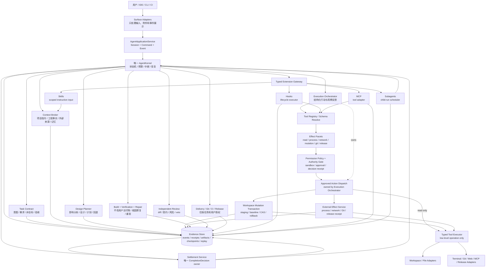
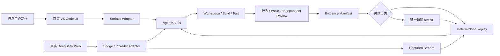

---
devseek_governance:
  generator: "devseek-doc-governance/v1"
  status: "historical"
  path: "docs/top-agent-convergence-audit-20260711/02-Codex-Claude-Code-DevSeek软件架构对比.md"
  source_group: "handoff"
  decision: "keep"
  relationship: "legacy-audit-report"
  active_baselines:
    - "docs/top-agent-convergence-audit-20260711/PLAN-当前收敛迭代计划.md"
  machine_sources:
    active_selector: "docs/process/devseek-active-baseline-selector.json"
    legacy_inventory: "docs/process/devseek-legacy-doc-inventory.json"
  asserts_gate_pass: false
---

<!-- DEVSEEK-GOVERNANCE-BANNER:START -->
> [!NOTE]
> DevSeek governance: this document is `historical` with decision `keep` and relationship `legacy-audit-report`. Current authority: `docs/top-agent-convergence-audit-20260711/PLAN-当前收敛迭代计划.md`. Machine source: `docs/process/devseek-legacy-doc-inventory.json`.
<!-- DEVSEEK-GOVERNANCE-BANNER:END -->

# Codex、Claude Code、DevSeek 软件架构对比

- 日期：2026-07-11
- DevSeek 基线：`591a266`
- 公开资料访问日：2026-07-11（产品功能会变化，后续应按页面/版本指纹重新核验）
- 接管定位：竞品公开行为与战略差距输入，不是 Codex/Claude 闭源实现声明，也不直接发出任务

## 1. 对比口径

本文不把用户举例的六个方面当成固定流程，也不推测 Codex、Claude Code 的闭源内部类或服务。对标分为两层：

1. **公开事实层**：只引用 OpenAI、Anthropic 官方公开的产品行为、扩展机制和安全边界。
2. **架构推导层**：把这些公开机制抽象为 DevSeek 应具备的可实现软件架构，并用仓库代码判断是否真正接入主链路。

这里的“具备”必须用两条状态轴和 applicability 描述：设计/实现/接线事实写 `implementation_state`，证据强度写入按 `profile id/hash + claim scope + Surface + Provider + platform` 键控的 `qualification_claims[]`；无作用域 level 只是对 required tuples 取最低值的生成视图。只有宣称 L4/L5/跨面顶级时，才必须覆盖 profile 中所有 required Surface/Provider；类、接口、单元测试或 prompt 描述至多支持“已设计/已实现”，不能冒充真实产品资格。

## 2. 顶级编程智能体的公开实际形态

### 2.1 Codex 的公开能力基线

OpenAI 官方资料表明 Codex 的工程能力不是固定瀑布阶段，而是围绕代码库理解、行动、验证和可控扩展形成工作系统：

- 通过 [`AGENTS.md`](https://developers.openai.com/codex/guides/agents-md) 建立从项目根到工作目录的分层指令链；每层优先 `AGENTS.override.md`、否则使用 `AGENTS.md`，越近目录的规则越晚生效且可覆盖上层。
- 通过 [sandbox 与 approval](https://developers.openai.com/codex/concepts/sandboxing) 分离“允许模型自主到什么程度”和“何时需要用户授权”，子进程继承约束。
- 通过 [Skills](https://developers.openai.com/codex/skills) 封装可复用说明、资源和脚本，并渐进加载任务所需上下文。
- 通过 [Subagents](https://developers.openai.com/codex/subagents) 隔离探索、测试、分诊等上下文并并行工作，再把结论汇总给主任务；官方也提醒写密集型并行可能冲突。
- 当前官方 [Customization](https://learn.chatgpt.com/docs/customization/overview) 和 Codex 文档导航还公开 Memories/Chronicle、MCP、Plugins、Hooks、Record & Replay 等机制；它们是可观察产品能力，不代表本文知道其内部拓扑。其中 [Plugins](https://learn.chatgpt.com/docs/plugins) 组合 skills、MCP、apps 等可复用扩展；[Record & Replay](https://learn.chatgpt.com/docs/extend/record-and-replay) 可把稳定图形工作流录制成可复用 skill。
- Codex 官方还公开 CLI、IDE、App 和 Cloud 多种 Surface，App 支持并行 agent/worktree 和定时 [Automations](https://openai.com/index/introducing-the-codex-app/)；[Browser/Computer Use](https://help.openai.com/en/articles/11369540-using-codex-with-your-chatgpt-plan/) 和长时间目标属于实际对标范围，但需按可用地区/版本声明适用性。
- 官方 [use cases](https://developers.openai.com/codex/use-cases) 覆盖大型代码库理解、功能实现、重构、审查、验证操作与可评分改进循环。

这些公开行为共同指向一个重点：模型负责推理，Agent harness 负责指令、上下文、工具、权限、执行和可验证反馈；安全与完成事实不能只存在于提示词。

### 2.2 Claude Code 的公开能力基线

Anthropic 官方把 Claude Code 的核心循环明确描述为“获取上下文 → 采取行动 → 验证结果 → 根据反馈重复”，并强调模型与 harness 的分工。公开资料还体现：

- [`How Claude Code works`](https://code.claude.com/docs/en/how-claude-code-works) 描述文件、搜索、执行、Web、代码智能等工具，以及 Skills、MCP、Hooks、Subagents 的扩展方式。
- [`Best practices`](https://code.claude.com/docs/en/best-practices) 建议给智能体可运行的测试、构建或截图验证，强调用证据而不是自我断言完成；复杂任务可先探索、再规划、再编码。
- [`Subagents`](https://code.claude.com/docs/en/sub-agents) 具有独立上下文、工具和权限，可用于 Explore、Plan 和并行只读研究，再向主会话返回摘要。
- [`Hooks`](https://code.claude.com/docs/en/hooks) 把可确定执行的检查接到生命周期事件，而不完全依赖模型记得执行。
- [`Memory`](https://code.claude.com/docs/en/memory) 支持从根到当前目录的项目说明链、同层更晚生效的 `CLAUDE.local.md`，以及访问子树时按需加载的嵌套说明；这些内容是上下文而不是独立强制策略。
- 官方扩展体系还包括 Skills、MCP、Plugins/marketplaces、worktrees、programmatic/headless usage 和 Agent SDK；[`Agent teams`](https://code.claude.com/docs/en/agent-teams) 支持 peer 会话与共享任务，但官方明确标记为 experimental、默认关闭，不应当成稳定基线。
- [`Permissions`](https://code.claude.com/docs/en/permissions) 明确将工具权限与 OS sandbox 作为互补层：权限覆盖 Bash/Read/Edit/WebFetch/MCP 等，sandbox 对 Bash 及其子进程做操作系统级约束。
- [`Computer use`](https://code.claude.com/docs/en/computer-use) 已作为 macOS CLI research preview 公开，可打开应用、点击、输入、看屏幕并验证原生/视觉流程；它有计划、版本、交互模式和逐会话应用审批限制，不能外推为所有平台/Surface 的稳定能力。

因此 Claude Code 公开定义的也不是“必须依次生成六份工件”，而是一个能按任务复杂度折叠、能观察环境、能执行工具、能验证并继续修复的反馈循环。

### 2.3 2026-08-11 规划与验证行为增量复核

- Claude Code 官方 [`permission modes`](https://code.claude.com/docs/en/permission-modes) 将 Plan Mode 定义为可分析代码库并形成计划、但不修改文件或执行命令的受限模式；[`permissions`](https://code.claude.com/docs/en/permissions) 继续把工具许可与 OS sandbox 分层。DevSeek 因而应把“探索/设计”和“有副作用执行”做成宿主可强制的状态与 authority 边界，而不是仅在 prompt 中要求先规划。
- Codex 开源的 [`default instructions`](https://github.com/openai/codex/blob/main/codex-rs/protocol/src/prompts/base_instructions/default.md) 要求较长任务用 `update_plan` 维护 `pending`、`in_progress`、`completed`，且任一时刻恰有一个步骤处于 `in_progress`；简单任务可以跳过计划。DevSeek 对标的是这种按复杂度折叠、可持续更新并与执行状态一致的可观察行为，不推测 Codex 私有实现。
- 本轮据此把需求 revision、验收 oracle、设计决策和 change plan 建成 shared typed owner，并让 mutation/external-effect authority 消费当前计划。当自然任务中的模型/工具提出新具体目标时，shared `ChangePlanRevisionPort` 会在副作用前封存证据、父计划和修订决策；显式用户范围和 workspace 边界不可扩大。实时外部调研、clarification/steer、外部新证据驱动的 requirement/design revision 和可审阅计划状态仍是后续差距。
- Claude Code 的反馈循环与 best practices 都把测试、构建或其他可观察结果作为继续修复和完成判断的依据；Codex 的公开默认指令同样要求实现后主动验证并把未运行项说清。DevSeek 本轮据此把验证会话绑定到当前 `runId` 与精确 acceptance，Runtime/Surface 只能提交观察证据，不能提交终态或声明旧失败已解除。
- 后续通过回执只有在同一 run、序列更新、scope 完整覆盖且 acceptance 全覆盖时，才由 shared Completion authority 解除较早失败；跨 run 回执、替换 acceptance、较窄 scope 或 Surface 的 completed 自报均 fail closed。
- Claude Code 的 [`permissions`](https://code.claude.com/docs/en/permissions) 明确 deny/ask 规则和 OS sandbox 是独立强制边界，[`hooks`](https://code.claude.com/docs/en/hooks) 也不能绕过权限；Codex 的 [agent approvals and security](https://learn.chatgpt.com/docs/agent-approvals-security) 将工作区、网络、受保护路径和审批边界分开，公开 review 行为要求以 diff 风险和验证证据裁决。由此抽象出的 DevSeek 契约是：实现回执不能自行证明完成，诊断、修复预算和回归范围必须由独立、fail-closed 的宿主 owner 决定。
- 2026-08-11 本地接线已实现上述契约：`CodeChangePort` / `IntegrationConformancePort` 绑定计划、tool、committed readback 和 verification；`DiagnosticPort` 生成稳定根因，`RegressionSelectionPort` 按影响与依赖扩展验证，`RepairDecisionPort` 仅在出现新证据时重试并将重复无进展转为 blocked。五项能力均已接入三 Surface canonical Kernel，I19 9/9 通过；这只支持本地 `wired`，不产生 Codex/Claude 等价或 qualification claim。

### 2.4 从公开事实抽象出的共同架构

两者产品形态不同，但公开机制呈现出相同的工程原则：

| 共同机制 | 对软件架构的要求 |
| --- | --- |
| 项目与会话指令 | 指令必须有作用域、优先级、来源和冲突规则 |
| 按需探索 | 搜索、读取、诊断和外部资料必须成为可追踪证据 |
| 工具行动 | 模型提出意图，宿主执行结构化工具并返回真实结果 |
| 权限与安全边界 | 写文件、终端、网络、MCP 等副作用必须经过不可绕过的策略点 |
| 验证反馈 | 构建、测试、检查、运行结果进入下一轮推理，而非运行后即宣布成功 |
| 上下文治理 | 长上下文、子任务、技能和记忆按需隔离或压缩 |
| 可扩展性 | Skills、Hooks、MCP、Subagents 接到同一执行模型，不成为新的平行内核 |
| 多种任务尺度 | 简单任务可折叠规划，复杂任务可显式探索和审批，但完成语义一致 |

## 3. 顶级编程任务的完整生命周期

基于上述公开能力，DevSeek 应采用以下生命周期。它不是固定瀑布流程；简单任务可以折叠若干状态，但不能绕开权限、mutation、验证和完成事实。

1. 请求接收、会话创建或恢复。
2. 用户意图、任务模式、授权范围和初始风险识别。
3. 目标、非目标、约束、交付物和验收条件澄清。
4. 项目指令、工程环境、依赖系统和外部边界收集。
5. 代码库探索、影响范围识别和事实图构建。
6. 需求契约、设计决策、计划与风险更新。
7. 权限审批、工具策略和 mutation 基线捕获。
8. 代码或配置实现、结构化工具执行和增量检查。
9. 编译、静态检查、测试、运行、打包及产物验证。
10. 失败诊断、针对根因修复和重新验证。
11. 独立 diff 审查、契约对账和 delivery-readiness 判定，但尚不写任务终态。
12. 若 TaskContract 要求且用户已授权，执行 commit、CI、发布、观测、回退或恢复，并先结算所有 effect receipt。
13. Settlement 对账契约、证据、审查与授权 effect 后原子写终态；Surface 再幂等展示结果、剩余风险和接管信息。

发布不是所有编程任务的必经阶段；但它若属于当前 TaskContract，就必须在 Settlement 前拥有制品身份、审批、环境、观测和回退契约，发布失败不得被结算为 completed。若发布是用户在旧 run 终态后新增的请求，则调用 `start(new TaskRequest)` 建立新 run 和新 TaskContract，只读引用旧 run/evidence，不向旧 terminal run 发 command、建 revision 或回写 decision。

## 4. 三方能力与架构矩阵

### 4.1 三方架构轮廓

| 架构维度 | Codex 官方公开行为 | Claude Code 官方公开行为 | DevSeek 当前实现 |
| --- | --- | --- | --- |
| 核心工作方式 | 围绕仓库理解、行动、验证和工程工作流；未公布固定 SDLC 或内部类图 | 明确“获取上下文 → 行动 → 验证 → 根据反馈重复” | VS Code agentic/agent 与 CLI Coding Loop 并行，循环语义不同 |
| 项目指令/记忆 | `AGENTS.md` 作用域链 + Memories/Chronicle | `CLAUDE.md`/Memory 提供项目和用户上下文 | Project Instructions 已有，但主要接 VS Code，CLI/Core 不等价 |
| 工具行动 | Agent harness 在受控环境执行仓库/命令相关工作；Skills 可携带脚本和资源 | 公开文件、搜索、执行、Web、代码智能等工具 | 工具丰富，但 registry、dispatcher、parser、writer 分散 |
| 安全边界 | sandbox 与 approval 分离；命令和子进程受边界约束 | permissions 覆盖各工具，OS sandbox 约束 Bash/子进程，两者 defense-in-depth | PermissionKernel 有设计，MCP/CLI/mkdir/delete 等仍可绕过；平台 sandbox 不统一 |
| 上下文治理 | 分层指令、渐进 Skills、独立 Subagent 上下文 | 项目 Memory、上下文管理、独立 Subagent 上下文 | rules/memory/compaction 局部存在，Engineering Context 未进入统一 Kernel |
| 规划与复杂任务 | 公开 use cases 包含大型代码库、重构、review 和可评分改进循环 | 官方建议复杂任务先探索、再计划、再编码，并允许反馈重规划 | Planner/Architect 受附件路由影响；CLI 无同一 Planner |
| 验证与完成 | 公开案例强调 verified operations 和可评分改进；未公开内部完成 schema | 官方明确强调给可运行 verifier，用 evidence 而非 assertion | 多套 validator/completion；无 verifier 可伪通过，terminal event 语义不统一 |
| 扩展机制 | Skills、MCP、Plugins、Hooks、Subagents、Record & Replay | Skills、MCP、Plugins/marketplaces、Hooks、Subagents | 对应类/registry 多已出现，但除 MCP 局部外多未接产品运行时；Plugins/recording 缺失 |
| 并行与隔离 | Subagents、App 多 agent 与 worktrees；写密集并行需防冲突 | Subagents + worktrees；Agent teams 为 experimental/default-off | 只有 descriptor registry，没有 spawn、隔离、合并、worktree 契约 |
| 多 Surface/长任务 | CLI、IDE、App、Cloud；Automations/Goals/background work 公开 | terminal/IDE/web、headless/programmatic/Agent SDK，并有 schedule/goals 公开入口 | VS Code/CLI 物理内核不同；long-run/recovery 只局部 |
| 视觉/操作验证 | Browser、Computer Use、Record & Replay 公开，受地区/版本限制 | Computer Use 已公开为受限 research preview；未核实与 Codex Record & Replay 完全等价的录制复用机制 | HTML mock/DeepSeek Web 测试与真实用户 UI 混同，缺 same-trace 自然 UI 闭环 |
| 产品事实 | 公开资料描述可观察行为，不公开私有拓扑 | 公开资料描述 model + harness 分工，不公开私有服务图 | 仓库可直接确认：Surface 承担业务、Shared Application Core 不完整、旧 owner 未删除 |

这张表保持三方分列；下面的详细矩阵把两款竞品的共同优秀行为合并为目标基线，以便逐项判断 DevSeek gap。

### 4.2 详细能力差距矩阵

图例：`D`=已设计，`I`=已有实现，`W`=已接入真实主链路，`Q`=已通过跨 Surface 和真实任务资格。

| 能力域 | Codex / Claude Code 公开优秀形态 | DevSeek 当前物理实现 | 状态 | 优先级 |
| --- | --- | --- | --- | --- |
| 会话与项目指令 | 分层指令、项目记忆、任务上下文进入每次行动 | `ProjectInstructionService` 已实现，但主要接入 VS Code 路径，CLI/Core 不对等 | D/I/W部分，Q✗ | P1 |
| 意图与模式识别 | 结合对话、仓库观察和工具反馈持续校准；必要时澄清、规划或行动 | Intent、Router、Workflow、Decomposer、TaskContract、Completion 多处解释同一语义；附件会改变引擎 | D/I/W，Q✗ | P0 |
| 需求与验收契约 | 目标、范围、约束、非目标和验证方式可持续修订 | TaskContract v2 由 shared `RequirementDecisionPort` 与 `AcceptanceContractPort` 转成不可变 revision；deliverable、non-goal、assumption/conflict 和 executable oracle 精确绑定，三 Surface 共用 | D/I/W，Q✗ | P1 |
| 工程环境识别 | 识别语言、构建系统、测试、仓库规则、依赖和风险 | `EngineeringContextService` 存在，但没有进入统一 Runtime | D/I，W✗ | P1 |
| 代码库探索 | 按需文件搜索、诊断、符号/引用查询；观察结果反馈给循环 | VS Code 工具较多，所谓 semantic search 仍偏文本 grep；CLI 使用另一套能力 | I/W部分 | P1 |
| 外部资料与边界 | Web/MCP/官方文档按需使用，来源可追踪，受网络权限约束 | shared `ExternalBoundaryPort` / `SourceGroundingPort` 要求 source 精确绑定 boundary、locator、内容摘要及 tool/effect evidence；缺来源时 Kernel 返回 exploration-required。实时 Web/MCP 获取循环仍待接线 | D/I/W本地，Q✗ | P0-安全 |
| 设计与规划 | 复杂任务先探索和规划，可审阅、可因新证据重规划 | shared `DesignDecisionPort` / `ChangePlanPort` 统一备选方案、trade-off、影响集、迁移/删除/回退和验收映射；`ChangePlanRevisionPort` 将工具提议的具体目标在执行前收口为证据化修订，authority 只消费当前计划。用户 review、clarification/steer 和外部证据触发的需求/设计修订仍待产品化 | D/I/W本地，Q✗ | P0 |
| 架构一致性 | 依据仓库规则、责任边界和影响分析约束修改 | change plan 已声明 owner/dependency checks、删除项和 acceptance mapping，并由 v25 静态 owner 基线以 30 个语义域防止 Surface 旁路；跨语言完整影响图和正式项目资格仍未完成 | D/I/W部分，Q✗ | P1 |
| Provider 协议 | 模型方言在 Adapter 归一，Core 只消费结构化 ToolCall | Extension 有大型 fake/parser 兼容层，CLI 又维护 JSON/XML/diff 解析 | D/I/W分叉 | P1 |
| 工具注册与执行 | 单一注册表、策略判定、执行器和结果协议 | ToolRegistry/Executor 已有，但 Extension 大循环仍自行调度，CLI 不复用 | D/I/W部分 | P0 |
| 文件 mutation | edit/delete/mkdir/undo 经同一受控、可回滚事务 | 新 baseline/CAS/atomic commit 主要只接入 Markdown；旧写入入口仍广泛存在 | D/I，W很少 | P0 |
| 终端与进程 | 命令受沙箱/审批约束，输出和退出码成为事实 | VS Code 有确认，CLI、MCP、mkdir/delete 未共享强制策略点 | D/I/W部分，Q✗ | P0-安全 |
| 编译测试验证 | 从工程事实选择 verifier；测试/构建失败必须反馈并修复 | Extension 与 CLI 两套验证；CLI 无 verifier 时可返回通过 | D/I/W分叉，Q✗ | P0 |
| 失败诊断与修复 | 观察失败、定位根因、修改、重跑，直到满足契约或诚实失败 | Agentic、AgentLoop、CLI 各有 repair 策略，预算和终止语义不同 | I/W分叉 | P0 |
| 完成事实 | 由宿主证据证明契约达成，区分成功、失败、等待和取消 | 两个 Loop 分别结算；RunContext 状态不足，失败事件也可叫 completed | D/I/W分叉 | P0 |
| 权限与沙箱 | 文件、命令、网络、MCP 由统一边界执行，审批与沙箱互补 | PermissionKernel 不是所有副作用入口的 choke point，平台级隔离不统一 | D/I/W部分，Q✗ | P0-安全 |
| 中断、steer、审批 | 用户可补充方向、批准高风险操作、暂停或取消 | VS Code 有局部实现；Shared `AgentApplicationService` 相关命令仍 Unsupported | D/I/W-VS Code | P1 |
| Checkpoint/resume | 恢复结构化状态、事实和待处理动作，而非仅恢复聊天文本 | VS Code 循环有局部 checkpoint；Shared Core 和 CLI 无等价恢复 | D/I/W部分 | P1 |
| 上下文和记忆 | 分层、预算化、可压缩；子任务隔离噪声 | VS Code 有 rules、memory、history compaction，未形成跨 Surface Context Broker | D/I/W部分 | P1 |
| Skills | 可复用流程按需发现、加载并在真实任务链执行 | 只有 discovery/trigger 选择和测试，未接 Runtime 执行 | D/I，W✗ | P2 |
| Hooks | 生命周期事件触发确定性检查，具有权限和失败语义 | `HookPlanner` 主要是命令选择壳，未进入运行时 | D/I，W✗ | P2 |
| Subagents | 独立上下文、工具和权限；适合并行探索/复核 | Registry 只返回 descriptor，没有 spawn、隔离、调度或结果合并 | D/I壳，W✗ | P2 |
| MCP | 外部工具进入统一注册、权限、审计和证据链 | MCP 已能调用，但绕过已设计的 `McpPermissionService` | D/I/W，不安全 | P0-安全 |
| 多 Surface | CLI、IDE、非交互入口消费同一 Kernel 和事件协议 | Shared Core 主要做 Provider Chat；VS Code 与 CLI 分别编排 Coding Loop | D/I，W✗ | P0 |
| 跨平台 | Shell、Path、Storage、Browser 差异由 Platform Adapter 收口 | `PlatformRuntimeAdapter` 有实现和测试，无生产引用 | D/I，W✗ | P1 |
| 审查、Git、交付 | 基于 diff、验证和风险交付；外部提交需授权 | Git/PR assistant 主要为纯函数和测试，无真实主链路 | D/I壳，W✗ | P2 |
| 发布与回退 | 按任务和授权执行制品、CI、发布、观测、回退 | DevSeek 自身有 VSIX 发布链；没有用户项目通用发布状态和审批模型 | D/I/W局部 | P2 |
| Trace/replay | 行动、证据和失败可回放并定位到阶段 | RunContext/trace/replay 是已有优势，但多 Loop 使事实不一致 | D/I/W部分 | P0 |
| 行为资格 | 从小任务到真实项目逐级验证真实入口和 Provider | PA benchmark 主要走 CLI+Fake Bridge；当前真实 VS Code 配额为 `0/3、0/2、0/1` | D/I，Q✗ | P0 |
| 架构防漂移 | 限制 owner、旁路、依赖方向、执行引擎和 mutation API 数量 | drift gate 只检查少量文件行数，新千行热点不在预算 | D/I弱 | P0-治理 |

> 2026-08-11 状态注记：上表大部分行仍保留 2026-07-11 物理审计快照；后续已重核 C4/C5、C8/C9 以及 C1 verification/completion/settlement 相关结论。完整当前状态、计数和下一任务只以 `PLAN-当前收敛迭代计划.md` 与 capability ledger 为准。`wired` 只表示对应本地 owner、产品接线和确定性证据已满足，不产生 qualification claim。

### 4.3 公开能力差异附录

4.2 的“共同优秀形态”是 DevSeek 目标抽象，不表示两个竞品各自都公开了每一项。下表防止合并列掩盖差异；`not assessed` 表示本审计没有足够官方证据，不等于产品不具备。

| 公开机制 | Codex observable | Claude Code observable | DevSeek 范围裁决 |
| --- | --- | --- | --- |
| 分层项目指令 | documented: `AGENTS.override.md` / `AGENTS.md`，root-to-leaf | documented: `CLAUDE.md` / `CLAUDE.local.md`，root-to-leaf 与嵌套按需加载 | C3 5/5 本地 wired；shared precedence/provenance owner 统一裁决，资格效力仍为 `NONE` |
| 本地/持续记忆 | documented: Memories/Chronicle | documented: Memory | P1，统一 C12 policy，外部内容不提权 |
| Skills | documented | documented | P2，C13-SKILL-BOUNDARY |
| MCP | documented | documented | P0 安全，C13-MCP-BOUNDARY |
| Plugins/marketplaces | documented | documented | conditional/deferred，`C13-PLUGIN-SUPPLY-CHAIN` 覆盖 packaging/signing/source/permission/update/uninstall/revoke |
| Hooks | documented | documented | P2，只做 lifecycle executor/defense-in-depth，不是 trust root |
| Subagents | documented | documented | P2，child-run scheduler + 主 Kernel settlement |
| Peer agent teams | no directly equivalent stable mechanism assessed | experimental, disabled by default | deferred/experimental，不作 R1～R3 强制基线 |
| Worktree 隔离 | documented in Codex App | documented | P2，C13-WORKTREE-ISOLATION |
| Automations/Goals/background | documented | documented schedule/goals/programmatic entries | `C11-BACKGROUND-AUTOMATION` deferred，依赖 recovery/idempotency，不建第二 Kernel |
| Browser/Computer Use | documented; availability/version constrained | documented research preview with platform/plan/session limits | `C6-VISUAL-COMPUTER-USE` optional profile；先用于 visual QA，不代替 code/build oracle |
| Record & Replay 录制复用 | documented | exact equivalent not assessed | 不做对称假设；若建设则作为 versioned Skill/evidence extension |
| 多 Surface/cloud offload | CLI/IDE/App/Cloud documented | terminal/IDE/web/headless/Agent SDK documented | `C1-SURFACE-ADAPTER-CONFORMANCE` 先收口 VS Code/CLI；cloud/API 由 `C13-HEADLESS-SDK` 条件启用 |
| Agent teams 稳定性 | not assessed as same feature | experimental, known limitations | 不能用作 DevSeek “顶级退出条件”的强制对标 |

## 5. 物理架构差异

### 5.1 顶级 harness 的可观察抽象

```text
User / IDE / CLI / CI
        │
        ▼
Session + Scoped Instructions + Context
        │
        ▼
Single Agent Harness / Control Loop
  ├─ planning and reasoning
  ├─ tool registry and structured calls
  ├─ sandbox / permission / approval
  ├─ file and process execution
  ├─ observation / verification / repair
  └─ checkpoint / completion / handoff
        │
        ├─ Skills / Hooks / MCP
        └─ isolated Subagents
```

这不是对竞品私有实现的断言，而是其公开行为必须依赖的职责抽象。

### 5.2 DevSeek 当前真实拓扑

```text
VS Code runChat
├─ 无代码附件 → runAgenticLoop
├─ 有代码附件 → decomposeTask → runAgentLoop
├─ run 意图 → local execution / repair
└─ 非 Agent → plain chat → artifact apply

CLI
└─ AgentApplicationService（Provider Chat）
   └─ CLI 自有 runCodingLoop → parser/write/validation/repair
```

关键证据：

- [`extension.ts`](../../packages/vscode-extension/src/extension.ts) 约 646～655 行把附件存在与否用于选择执行循环；附件本应只改变 Context。
- [`agent-application-service.ts`](../../packages/shared/src/agent-application-service.ts) 只有 `chat.request` 获得实质处理，plan decision、permission decision、resume、cancel 仍是 Unsupported。
- [`packages/cli/src/index.ts`](../../packages/cli/src/index.ts) 约 279 行开始维护自己的 Coding Loop，并直接处理写入、diff、验证和 repair。

### 5.3 DevSeek 文档目标与实现的断层

[`10-运行形态与界面解耦架构设计.md`](../architecture/10-运行形态与界面解耦架构设计.md) 和 [`01-顶级编程智能体总体架构设计.md`](../architecture/01-顶级编程智能体总体架构设计.md) 已提出 Headless Core、Surface Adapter、Provider 隔离和统一权限质量边界。但这些仍主要是逻辑架构；代码没有完成依赖反转和旧 owner 删除。

因此 DevSeek 的主要问题不是“设计方向完全错误”，而是设计、类存在和产品主路径之间缺少可验证的接线状态。

### 5.4 DevSeek 对标目标软件架构框图

下面是根据 Codex、Claude Code 公开行为推导的 DevSeek 目标框图，不是对竞品闭源内部结构的复刻：



框图的关键不是模块数量，而是四个不可逆依赖：

1. Surface 只能进入 Application Service，不能直接调用 Loop 或写文件。
2. 所有任务阶段由一个 Kernel 驱动，不能因附件/Provider/任务大小换内核。
3. Registry 只解析 schema，不执行；行动先声明可重叠 effect facets，再经 Permission/Authority。只有 Execution Orchestrator 能消费 approved plan 并调用 workspace transaction/external-effect service；底层 Executor 只执行 typed operation，不反向调用上层服务或构造 receipt。terminal 不得绕过 CAS 改源码。
4. 只有 Settlement Service 能读取 append-only Evidence 完成契约对账；模型 Todo、自报成功和 Extension 都不能构造终态。

Extension Gateway 不是单向插件袋：Skill 编译为有作用域的 instruction/context input；Hook 是有权限的 lifecycle executor；MCP 是低信任 tool adapter；Subagent 是受主 run 约束的 child-run scheduler。四者的 result/evidence 都回到 Kernel/Evidence，并由主 Settlement 裁决。

### 5.5 模块级判断与 DevSeek 迭代项

| 目标模块 | DevSeek 当前判断 | 架构裁决 | 下一迭代项 | 顶级退出条件 |
| --- | --- | --- | --- | --- |
| Surface Adapters | VS Code `runChat` 含业务分流；CLI 自建 Coding Loop | **重构** | Surface 只生成 `AgentCommand`、消费 `AgentEvent`；附件仅进 Context | Surface 业务路由 `=0`；同题跨 Surface 领域事件等价 |
| `AgentApplicationService` | 主要为 Provider Chat；plan/permission/resume/cancel Unsupported | **升级或替换** | 成为全部会话命令入口，连接唯一 Kernel | 全部公开命令可处理；不含 Provider/任务特判 |
| `AgentKernel` | 实际由 agentic/agent/CLI 多 Loop 分担 | **新建唯一 owner，迁移后废止旧内核** | typed state machine、预算、中断、失败路由、终态 | 产品 Coding Kernel `=1`；旧 Loop 不可从产品入口到达 |
| Task/Requirement Contract | 概念丰富但 owner 分散，未统一非目标、授权和验收 | **保留概念、合并实现** | 建一个 revisioned TaskContract，所有阶段读写同一契约 | acceptance 100% 能关联 evidence；跨 Surface schema 一致 |
| Context Broker | 项目指令、memory、附件、Engineering Context 各自接线 | **合并接线** | 来源/作用域/优先级/预算统一；附件不选 Runtime | 规则冲突可解释；相关上下文召回达标；无附件路由偏差 |
| Engineering Orientation | Service 已实现但生产主链路未引用 | **保留并接入** | 在 mutation 前识别 repo、语言、build/test、dirty state、平台 | D-G01～D-G05 均由工程事实生成 verifier，不靠固定词表 |
| Requirements Service | 正则和领域词承担部分正式需求判断 | **重写通用语义边界** | 建 requirement/non-goal/acceptance/source 模型，移除评测领域词 | 新领域 holdout 无特判；关键假设有来源或确认 |
| Design Planner | 有 Architect/Decomposer，但仅部分路由使用 | **保留能力、取消专用 Loop** | 设计作为 Kernel phase；简单任务折叠，复杂任务显式 review | plan revision 可追踪；设计偏离必须 replan；影响面漏检达标 |
| Provider Adapters | fake/tool parser 进入 Core；CLI 另有解析器 | **收口并删除重复 parser** | 方言只在 Adapter 归一为 typed ToolCall/Delta/Error | Core 厂商方言 `=0`；真实流 replay 跨 Provider 通过 |
| Tool Registry/Executor | 已有抽象但大 Loop 和 CLI 仍自行 dispatch | **保留并强制接管** | 一个 schema registry；Execution Orchestrator 唯一分派 approved action；mutation/effect service 组织 receipt；底层 executor 只调 adapter | 高层 dispatcher owner `=1`；Executor 反向依赖 `=0`；所有调用可审计和重放 |
| PermissionKernel/Sandbox | 有局部权限，MCP/CLI/mkdir/delete 可绕过 | **强化为 choke point** | 统一 file/terminal/network/MCP/Git/release；approval 与 sandbox 分层 | 未授权副作用 `=0`；拒绝、缩权、blocked 旅程通过 |
| Workspace Mutation Transaction | baseline/CAS/atomic commit 方向正确，但主要只接 Markdown | **保留核心并全面迁移** | write/edit/delete/mkdir/move/undo 全部接入；可改源码命令在 staging 产出 diff 后提交；删 legacy API | workspace mutation 旁路 `=0`；用户脏改丢失 `=0`；恢复幂等 |
| External Effect Service | terminal/MCP/Git/Web/release 没有统一 receipt/幂等/补偿边界，terminal 可直接改工作区 | **新增受控边界** | 分类 effect，统一 approval/sandbox/idempotency/receipt；源码写入转 staging transaction | 未授权/重复外部 effect `=0`；terminal 绕过 CAS `=0` |
| Build Service | 验证器分散，项目识别未统一 | **合并** | 从 Engineering Context 与 acceptance 生成构建/打包计划 | 无陈旧制品误判；artifact identity 可追溯 |
| Verification Service | VS Code/CLI 两套；无 verifier 可通过；验证会改写用户交付物 | **重构；对用户交付物只读** | typed plan/result；声明临时构建产物；unverified 非 passed；失败返回诊断 | 假成功 `=0`；验证改写交付物 `=0`；验收覆盖完整 |
| Diagnosis/Repair | 三个循环各有策略，CLI 固定轮数 | **合并** | 以失败 evidence 分类根因，路由回需求/设计/实现；进展预算 | 无进展可诚实 blocked；同类失败不靠 prompt 叠加 |
| Independent Review | 有 ledger/gate 概念，产品独立审查不足 | **接入** | 使用独立上下文审查 diff、契约、验证和安全；硬 veto | 实现者自报不能越过 review；硬失败漏检趋近零 |
| Settlement/Completion | 多 owner，状态/事件名称不一致 | **唯一化** | `SettlementService` 逐项 acceptance→evidence 对账；terminal 仅 completed/failed/blocked/cancelled，waiting-user 是可恢复 run status | Completion 构造 owner `=1`；无证据成功 `=0` |
| Delivery/Git/Release | Git/PR 多为辅助壳；VSIX 发布只覆盖 DevSeek 自身 | **条件接入** | 交付为必需，commit/CI/release 按请求和授权展开 | 未授权外部动作 `=0`；发布/回退 receipt 完整 |
| Recovery/Checkpoint | VS Code 局部存在，Shared/CLI 不等价 | **合并** | 保存契约、状态、receipts、pending decision、baseline | crash/新窗口/漂移恢复不重复副作用 |
| Evidence/Trace/Replay | 是 DevSeek 优势，但受多 Loop 和易失报告削弱 | **保留并提升为事实 SSOT** | 产品 Run Evidence Ledger 统一运行事件/receipt；资格 harness 只引用它并单独持久 candidate/case/oracle | 产品内核不依赖资格 schema；当前资格可复算；事件与终态一致 |
| Evaluation Harness | deterministic 较强；DeepSeek Web、CLI、Extension Host、HTML mock 被混称 E2E | **重分层并修资格** | captured replay → Headless → Surface → natural UI → live holdout 测试漏斗 | 同 case 不可凑数；当前 commit 可复算；假闭环 `=0` |
| Skills/Hooks/MCP/Subagents | 多为实现壳；MCP 有真实调用但权限脱节 | **P0 稳定后接入** | 经 typed registry、权限和 evidence 扩展；Subagent 隔离上下文/路径 | 不建立第二内核；扩展旁路 `=0`；并行写冲突 `=0` |

模块判断使用四类动作：

- **保留**：概念和实现边界正确，补真实接线与资格。
- **重构/合并**：目标能力正确，但 owner、依赖或物理位置错误。
- **新建后迁移**：缺少唯一内核 seam；迁移完成必须废止旧产品路径。
- **废止**：多 Loop、Surface 业务分流、验证隐藏写入、模型自报完成和样例特判，不应保留兼容。

## 6. DevSeek 相对顶级形态的核心差距

### P0：内核正确性和安全性

1. **没有唯一 Coding Kernel**：附件和 Surface 仍能选择不同执行引擎。
2. **没有唯一 workspace-mutation authority**：新事务只保护少数路径，write/delete/mkdir 仍可旁路；目标是多个短事务组成同一 run saga，不是一个跨等待的长事务。
3. **没有唯一权限 choke point**：terminal、MCP、文件副作用的策略边界不一致。
4. **没有唯一验证和完成事实**：不同循环能以不同标准宣布成功。
5. **资格测试没有覆盖真实产品路由**：Fake Bridge 的正确工具调用不能证明真实 VS Code 会正确理解并执行任务。

### P1：软件工程质量

1. Engineering Context、Requirement Contract、Design Decision 尚未进入统一内核。
2. Provider 方言、CLI parser 和 Extension parser 未在 Adapter 层收口。
3. 指令、记忆、checkpoint、platform adapter 没有跨 Surface 等价。
4. 架构门禁未检查执行引擎、语义 owner、mutation API、Surface 分支和旁路数量。

### P2：高级扩展能力

1. Skills、Hooks、Subagents 多为“实现壳”，不是运行时产品能力。
2. Git/PR/CI/发布只覆盖局部辅助或 DevSeek 自身发布，不是通用用户项目闭环。
3. 在 P0/P1 未稳定前扩展这些能力，会继续增加旁路和回归面。

## 7. 自闭环测试框图与最少迭代策略



当前所谓 DeepSeek Web 测试不能作为一个等级看待：独立 HTML mock 只验证 renderer，CLI live 只验证 CLI/Provider，真实 VSIX + 内部 command 只验证 Extension integration；只有真实 Webview 输入、附件、审批、steer、工作区结果和验证证据全部闭合，才是自然用户 E2E。

最少迭代原则：

1. live 失败一次即冻结 raw stream、events、workspace 和 UI，不反复试 prompt。
2. 先转成 captured replay，能稳定复现后只修一个 owner。
3. 跑专项微测试、相邻契约和 D-G01～D-G03 核心旅程。
4. deterministic 全绿后只重跑原 live case 一次。
5. 同一 `caseId + fixture + commit` 的重跑不增加资格数。
6. formal 用例不进入开发集；C0 Gate 0 通过且适用 C1～C13 产品能力 P0/P1 达到 Surface 资格后才开启，C14 不参与自身前置集合。

完整证据审计、现有 harness 缺陷和测试漏斗见 [`05-黄金用户旅程与正式项目资格方案.md`](05-黄金用户旅程与正式项目资格方案.md)。

## 8. 架构决策

下一阶段不应按“再增加一个规划 Agent、测试 Agent 或发布 Agent”推进。正确的顶级化方向是：

> 所有阶段属于同一个可重入 `AgentKernel` 状态机；Surface 通过 `start(TaskRequest)` / `dispatch(runId, AgentCommand)` 与它交互，内核在运行中创建/修订 `TaskContract`。复杂度只决定阶段是否展开、预算多少和是否请求审批，不决定换用另一套语义、写入、验证或完成内核。

具体目标架构见 [`03-顶级编程智能体目标软件架构.md`](03-顶级编程智能体目标软件架构.md)，专项迭代顺序见 [`04-分能力专项迭代与收敛路线图.md`](04-分能力专项迭代与收敛路线图.md)。
