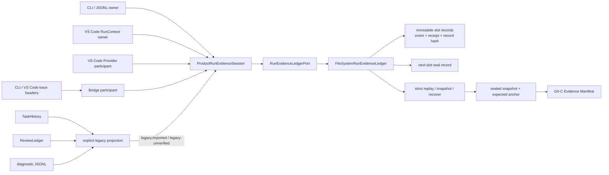

# G0-D 统一运行证据账本实施报告

- 实施日期：2026-07-12
- 工作包：`G0-D-UNIFIED-RUN-EVIDENCE-LEDGER`
- 当前结论：产品运行诊断纵切已接入 Shared、CLI/JSONL、VS Code 与 Bridge；**它不是资格证据，Gate 0 尚未通过**
- 提交身份：以“最近一次包含本文的提交”动态解析；单次提交不能在自身内容中嵌入自己的最终 hash，精确解析与发布核对命令见 [15](15-新窗口与跨模型接管手册.md)

## 1. 结论先行

G0-D 已建立单一 `RunEvidenceLedgerPort`，把产品运行中的 owner open、command、Provider、side effect、verification、quality gate、settlement、seal、replay 与 legacy import 统一到一个本地追加式协议。CLI/JSONL、VS Code 和 Bridge 已有产品接线，但 VS Code 细粒度事实、全入口不可绕过性和诊断 fail-soft 完整性尚未形成资格纵切，因此 `C0-RUN-EVIDENCE-LEDGER` 的**实现状态**保守记为 `implemented`，不记为 `wired`。

这里的 `implemented` 表示共享 authority、适配器和真实产品接线已经存在，但尚未证明所有声明入口都不可绕过，也不说明证据达到资格等级。全部记录固定为 `integrity_scope=product-run-diagnostics`、`qualification_eligible=false`；能力账本继续保持 `qualification_claims=[]`、`qualification_level_view=null`。产品账本只陈述运行事实，不产生 qualification verdict，G0-C 也不得把它单独升级成 claim。

## 2. 软件架构框图



Authority 边界只有一个：Surface 可以负责“何时记录”，但不能各自定义 hash、幂等、CAS、seal、replay 或恢复语义。Bridge 只能作为 participant 附着到 owner 已创建的 run，不能替 CLI/VS Code 发明 owner run。

## 3. 协议、双 head 与 record 链

### 3.1 单一端口

`RunEvidenceLedgerPort` 提供 `openRun`、`append`、`head`、`read`、`readSnapshot`、`getSeal`、`seal`、`recover` 与 `verify`。共享协议定义 29 种封闭事件，覆盖：

- run open/recovery/settlement；
- command accepted 与 Provider requested/completed/failed；
- side effect requested/authorized/started/committed/failed/indeterminate；
- verification 与 quality gate 的 started/pass/fail/veto；
- checkpoint、recovery 和 `legacy.imported`。

29 种事件的机器枚举是：

```text
run.opened, run.recovered, run.settled
command.accepted, agent.status, tool.activity
provider.requested, provider.completed, provider.failed
side_effect.requested, side_effect.authorized, side_effect.started,
side_effect.committed, side_effect.failed, side_effect.indeterminate
verification.started, verification.completed, verification.failed
quality_gate.started, quality_gate.passed, quality_gate.failed, quality_gate.vetoed
checkpoint.created, checkpoint.restored
recovery.detected, recovery.completed, recovery.failed
evidence.degraded, legacy.imported
```

该数量与枚举由 machine checker 从 TypeScript authority 和 JSON Schema 交叉核对；添加第 30 种事件属于协议变更，不能由 Surface 临时扩展。

未知事件类型、非有限数值、非规范时间、错误 run/correlation、非法 hash 或不完整 seal 都在 ledger 边界 fail closed。

### 3.2 持久 authority 与每次变更认证

raw writer 仍作为 Shared 内部实现存在，但 `openRun` / `append` / `seal` 每次变更都必须携带运行时 credential。owner 首次 open 时只把 owner/participant token 的不同 SHA-256 摘要写入 `run.opened.payload._devseek_run_evidence_authority`；明文 token、credential 对象和 `participantToken` 字段不进入 event、receipt、record、snapshot 或 seal。

之后的每次写入都以重放后的持久 `run.opened` 为唯一认证依据，不信任会话对象中可被替换的角色。CAS 丢失后重读、成功提交后回读以及 seal 竞争后重读都重新验证持久摘要；`run.settled` 与 seal 只允许 owner。产品端 Bridge/CLI/VS Code 只能导入 `ProductRunEvidenceSession`，机器 checker 会静态拒绝它们导入或引用 `FileSystemRunEvidenceLedger` / `run-evidence-ledger`。

持久秘密边界也只有一个：共享 `persisted-secret` guard 递归扫描对象键、字符串值、嵌套对象和数组，任何完整或嵌入其他文本的 `devseek-ra1_...` capability 都在持久前被拒绝。`openRun` 在创建 run 目录前检查，`append` / `seal` 在 record/CAS 前检查，`settleAndSeal` 在写入 settlement 前同时检查 settlement 与 seal 输入；因此拒绝后的 head、records、staging 和未存在 run 的根目录都保持原样。closed-envelope replay 对已被篡改并重算全部 hash 的 capability 同样 fail closed。

这条边界还覆盖诊断与历史：诊断 logger 在落盘前清理完整 event，包括顶层 source/runId、payload 文本与对象键；历史 adapter 只能收到窄化的 prompt/track/display 值，prompt、旧 history 或 Provider response 一旦含 capability，就在 history sink 之前拒绝。因而明文 credential 不进入 event、receipt、record、snapshot、seal、trace 或 history。

### 3.3 为什么必须是双 head

每次 CAS 不只比较 event head，而是比较：

```text
expectedHead = { sequence, eventSha256, recordSha256 }
```

两条链承担不同职责：

1. **事件链**：`previous_event_sha256 → event_sha256` 绑定产品事实的语义顺序。
2. **record 链**：`previous_record_sha256 → record_sha256` 把 event、durable receipt 和上一 record 一起纳入 hash，避免只改 receipt 而事件链仍看似有效。

每个 slot 是一个不可变 record 文件。event 与 receipt 先形成完整 record，再以 hard-link 竞争目标 slot；文件和目录执行 `fsync`。相同 idempotency key 重试会核对完整 fingerprint；结果同时返回当初提交产生的 `committedHead` 和重试时观察到的 `currentHead`，防止把历史幂等结果误写成当前 head。

### 3.4 seal、snapshot 与外部 anchor

seal 与 append 竞争同一个“下一 slot”，并绑定 `event_count`、`final_event_sha256`、`final_record_sha256`、seal fingerprint 和 seal hash。seal 成功后拒绝晚到 append。`readSnapshot` 保留 record、receipt、record hash 和 seal；replay digest 覆盖完整 snapshot，而不是只摘要事件数组。

本地链无法凭空知道一段完整尾部曾经存在。因此 `verify/recover` 可以接收独立保留的 expected anchor：`eventCount + finalEventSha256 + finalRecordSha256 + sealSha256`。有 anchor 时，可检测 seal 或完整尾部删除；没有独立 anchor 时，只能检测现存前缀内部的篡改、fork、gap、torn record 与孤儿 staging，不能证明“本地目录从未被整体回滚”。G0-C 必须冻结并校验这个 sealed head，但同机保存的副本仍不等于外部可信锚。

### 3.5 写前前缀归约与结算闭包

一个无 I/O 的纯 `reduceRunEvidencePrefix` 是 append、raw append、settlement、seal 和 replay 的共同语义 authority。它允许未结算前存在 pending 操作，但在 record/CAS 之前立即拒绝：未 request 先 terminal、重复/矛盾 terminal、绕过 authorized 的 side effect、不合法 recovery resolution、未闭包 settlement、`completed` 携带未解决 adverse/degraded 事实，以及 `run.settled` 之后任何事件。

这把旧的“先写入毒化前缀，到 settlement 才失败”改为“第一个不可能转移写入前失败”。拒绝路径的 head、records 与 staging 保持不变；CAS 重试会重读、重新认证并重做归约。seal 不再代替 settlement，只能封存已通过同一 reducer 的 `run.settled` 前缀。

CLI 的修复成功路径现在也按这一 authority 发出精确闭环：旧 verification/quality gate 先以 failed 终结，然后 `recovery.detected`，再以同一 `recovery_operation_id` 记录修复 side effect 的 requested → authorized → started → committed，之后以同一新 verification operation 记录 verification started → completed 与 quality gate started → passed，最后 `recovery.completed` 显式写入 `resolves_operation_ids` 和 `verification_operation_id`。修复调用、应用或复验失败只能以 `recovery.failed` 闭合，不得解除原 adverse operation。

### 3.6 恢复语义

`recover` 是只读验证，不自动重写、补链、丢弃失败或把 staging 提升为成功。有效 run 返回 `none`；发现结构或完整性问题返回/抛出需要人工介入的事实。这样恢复不会改变原始证据，也不会通过“修复账本”覆盖产品失败。

### 3.7 闭合 envelope 与资格隔离边界

event、receipt、event record、seal record 与 seal 都经过共享 closed-envelope validator：根字段必须精确匹配，未知键、过长文本、非规范 UTC 时间、非安全整数、非法 hash、primitive event payload 和未知事件类型在 append/raw writer/replay 边界一致失败。Provider、side effect、verification、quality gate 与 recovery 的观察事件还必须携带 `operation_id`、与事件后缀相同的 `status` 和 `trust=product-runtime-observation`；`evidence.degraded` 必须显式给出 trusted reason，并 veto `completed` settlement。

runtime 与 6 份机器 Schema 现在共用同一封闭语义：持久 observation 文本不再对 null/boolean/number/array/object 做字符串强转，`legacy.imported` 必须是精确键集，expected anchor 必须精确为 `eventCount/finalEventSha256/finalRecordSha256/sealSha256`。event、receipt、record、seal、snapshot 和 expected-anchor Schema 与 append/replay 保持双向一致；详见[机器生成契约视图](../process/generated/devseek-run-evidence-contract.md)。

资格隔离不是只检查根字段。共享 validator 会递归扫描完整持久 envelope 与 payload：除 `legacy.imported.payload.projection` 这个明确不可信的 opaque 区域外，任意大小写、camel/snake case 或在字母间插入任意数量下划线的 `qualification*` verdict/claim/level、把同类变形的 `qualification_eligible` 提升为非 `false`，或把变形的 `integrity_scope` 改离 `product-run-diagnostics`，即使攻击者重算 event/receipt/record/seal 全部 hash，也必须在写入或重放时失败。legacy projection 外层仍固定 `trust=legacy-unverified` 和非资格属性，不能借 opaque 内容提权。

## 4. 产品纵切与真实覆盖

| 入口/层 | owner/participant | 已接事实 | 当前限制 |
| --- | --- | --- | --- |
| Shared | authority | canonical JSON、hash、双 head CAS、receipt、seal、snapshot、replay、expected anchor、只读 recover | 本地文件系统，不是 WORM |
| CLI / JSONL | owner | open、command、Provider、文件副作用、verification、quality gate、settlement/seal；Bridge 请求传播同一 run/workspace identity；修复成功使用精确 correlated side-effect/verification/gate/recovery 闭环 | 诊断写入失败为 fail-soft；不构成资格 runner |
| VS Code RunContext | owner | open、command、agent/tool/checkpoint、mutation、verification、quality/recovery 投影；首次终态 sticky，证据降级或结算失败拒绝 completed，并尽力形成 failed settlement/seal | 尚未证明所有 tool/mutation/validation sibling 都满足 exact-one、严格顺序和同 operation id；见 14 的 deferred hardening |
| VS Code Provider wrapper | participant | direct/Bridge Provider requested/completed/failed，保持原异常语义 | 单元/集成覆盖，不代表 natural-UI live 资格 |
| VS Code terminal permission coordinator | participant | terminal/validation 统一记录 requested/authorized/started/committed/failed/indeterminate；permission deny、异常与可见 terminal 不确定性保真；失败只有经过可观察 recovery + quality gate 才能解除，未解除时阻断 completed | 只覆盖 terminal/validation command authority，不外推到其他 tool 或 workspace mutation；诊断仍 fail-soft |
| Bridge server | participant | 只附着 owner run，记录 DeepSeek Web Provider requested/completed/failed；拒绝替缺失 owner 建 run；participant capability 只经 Bridge 专用 `evidenceCapability` envelope 映射为 authority header | 没有本轮真实浏览器/live Bridge E2E；请求侧错误采用 fail-soft 日志 |
| Legacy migration | migration owner | TaskHistory、ReviewLedger、diagnostic JSONL 显式投影成 `legacy.imported`，完成后 seal | 不自动迁移，不恢复旧事实的可信度 |

这里的 Bridge-only 是类型和组合边界，不是字符串清理约定：通用 `LLMChatOptions` 不存在 participant capability 字段，非 Bridge Provider 只收到 capability-free request；Bridge transport 才能收到 `{ role: "participant", token }` 窄 envelope。history adapter 的输入面同样只有 prompt/track/display，因而普通 Provider 与持久 history 都不能观察该 capability。

这张表解释了为什么已有真实入口接线仍只记为 `implemented`：局部可达不等于所有声明入口不可绕过，入口 reachability 与证据完整性/独立性也是不同的事。

## 5. Legacy migration 决策

旧存储不做“原地升级”，也不伪装成新协议原生事实：

| 旧来源 | 导入内容 | 明确不导入/不声称 |
| --- | --- | --- |
| TaskHistory | 输入 digest、状态/模式/Provider、引用和文件数量、时间摘要 | prompt、文件内容、成功真实性与资格 |
| ReviewLedger | snapshot digest、文件/验证/quality gate/unfinished 数量摘要 | 把可变 UI projection 当 append-only proof |
| diagnostic JSONL | 原始 UTF-8 字节 digest、有效/无效行数、受限 run/source/phase 索引 | 任意 payload 进入受信事件 taxonomy |

每项导入都固定 `trust=legacy-unverified`、`qualification_eligible=false`，并使用独立 migration run。导入是显式操作而非启动时自动执行；相同 source kind/ref/digest 幂等，不同内容不能借同一个 key 覆盖历史。

## 6. 攻击面与自动验证

G0-D 的确定性验证覆盖以下缺陷类：

| 缺陷类 | 必须阻断的行为 |
| --- | --- |
| canonical/hash | key 顺序漂移、NaN/Infinity/undefined、event/receipt/record/seal 任一改写 |
| event/record chain | gap、fork、错误 previous event、错误 previous record、重复 `run.opened` |
| durability | torn record、orphan staging、receipt rewrite、sealed tail truncation |
| CAS | 多进程 append 同 slot、append 与 seal 同 slot、相同 key 并发、旧 key 晚重试 |
| idempotency | 同 key 不同 payload/type/surface、历史 committed head 与当前 head 混淆 |
| clean-tail | 使用独立 expected anchor 检测 seal 或完整本地尾部删除 |
| ownership | 无 credential、错误 token、participant 写 settlement/seal、构造后替换 authority、凭证意外落盘 |
| persisted secret | payload/数组/嵌套值/对象键或任何 envelope 文本中的完整、嵌入 capability；open/append/seal/settle 拒绝后目录、head 与 record 必须不变；trace/history 不得持久明文 credential |
| terminal permission | 两个 Agent 入口、UI command 与 validation runner 必须共用 coordinator；permission deny 在执行前关闭为 failed；visible terminal 固定 indeterminate/cancelled；异常和 non-zero/timeout 不得被完成文本覆盖；只有 recovery + quality gate 可解除 adverse operation |
| prefix reducer | terminal-before-request、矛盾 terminal、未授权 side effect、无效 recovery resolution、未闭包 settlement、settled 后续写；均必须写前失败 |
| schema/replay | 严格持久类型、`legacy.imported`/expected-anchor 精确键、capability 嵌入、跨大小写/camel/snake/任意下划线的 qualification 变形、额外键与 primitive payload；即使全量重 hash 也必须被 Ajv 和 replay 同时拒绝 |
| legacy | 导入始终 unverified/非资格；相同来源幂等，旧 payload 不提升信任 |
| Surface | CLI/JSONL 传播同一 identity 并 seal；VS Code owner/provider/migration；Bridge attach-only |

主要回归入口为：

```bash
npm run shared:build
npm run shared:test
npm run verify:run-evidence-contract
npm run cli:typecheck
npm run cli:build
npm run cli:test
npm run compile --workspace=packages/vscode-extension
node --test packages/vscode-extension/test/unit/run-context.test.mjs \
  packages/vscode-extension/test/unit/provider-run-evidence.test.mjs \
  packages/vscode-extension/test/unit/legacy-run-evidence-migration.test.mjs \
  packages/vscode-extension/test/unit/terminal-permission-evidence.test.mjs
npm run build --workspace=packages/bridge
npm run test --workspace=packages/bridge
npm run verify:capability-ledger
```

最终 P1 收敛后的本地确定性结果为：`verify:run-evidence-contract` `38/38`，独立 checker 检查 6 份 Schema、29 种事件、19 类 critical operation 与 55 个负向 Schema 攻击；Shared `82/82`；Bridge build 及 test `23/23`；CLI typecheck/build 及 test `20/20`。Surface focused `159/159`，VS Code 全量 `119/119` suites、`1287/1287` cases，Shared integration `22/22`，VS TypeScript、Extension compile 与 Shared build 均通过。独立只读发布复审另执行 Core focused `21/21` 和 Surface focused `274/274`，两侧结论均为 `P0=0、P1=0`。

新增反例覆盖严格 JSON 与 Proxy 单快照、getter/history/request/error 二次读取、Bridge 分片文本、写入前零目录副作用、workspace symlink/父目录替换/并发 CAS/批量回滚、执行模式全链传播、首次终态粘性和所有主要成功 UI/auto-accept 对最终 settlement 的消费。

最终集成自闭环首轮还正确拒绝了两类回退：新职责使冻结编排文件越过架构预算，以及 Agent Core 评测把 Provider chunk 数硬编码成公开 `chat.delta` 数。本轮没有抬高 budget：`extension.ts` 从 2314 行收缩到 2054/2061，`agentic-loop.ts` 回到 1416/1416，`tool-loop.ts` 从 1346 行收缩到 1178/1299。Harness、写确认、workflow/MCP/Provider evidence、settlement 投影和 Markdown artifact apply 分别进入专责 adapter/service，静态守卫迁到新 owner 而非被删除。

Agent Core oracle 现在验证事件起止、中间项全为 delta、按序拼接等于唯一 `chat.completed.response`，不再要求流式安全 guard 一定保留 Provider 的 chunk 边界。独立定向验证为 Agent 抽取相关 `67/67`、Extension 架构/Surface 抽取相关 `202/202`；根集成复核的 architecture/workflow/mutation 守卫 `138/138`、Agent loop 必需层 `5/5`，architecture drift 与 VS TypeScript 通过。

这些结果属于 deterministic product-diagnostics regression；即使全部通过，也不生成 L2、Surface、live 或 holdout claim。

## 7. 诚实边界与保留风险

1. **固定为产品诊断**：所有事件、receipt、record、seal 和 snapshot 都是 `product-run-diagnostics` 且 `qualification_eligible=false`；产品 ledger 永不自行判定候选合格。
2. **非 WORM、无外部 anchor**：hard-link、CAS 与 `fsync` 提升本地崩溃/并发一致性，不抵御拥有文件系统权限的删除或整体替换。expected anchor 只有被独立保留才有 clean-tail 证明力；本轮没有外部 retention lock、透明日志或可信时间戳服务。
3. **VS Code 细粒度尚未全覆盖**：Run owner、command、Provider 与 terminal permission/validation command authority 已接线；terminal adverse operation 还会以 recovery + quality gate 决定是否允许 completed。但其他 tool、workspace mutation、通用 verification、quality gate、checkpoint 尚未全部逐事件投影。不能从现有 sealed run 推断完整软件工程过程。
4. **Bridge 没有 live E2E**：attach-only 和 Provider 事件有 deterministic 测试；本轮没有用真实 DeepSeek 网页、浏览器会话和网络异常完成 same-trace live 证明。
5. **Surface 是 fail-soft**：ledger 核心遇到损坏会 fail closed；产品入口为避免诊断存储故障阻断用户任务，会记录 warning/error 后继续。因此“任务完成”可能伴随证据缺口；G0-C 的 reader 会把未 seal、无独立 anchor 或链不完整输入拒绝，真正 protected qualification 仍必须把所有产品诊断缺口视为 veto/不可聚合，不能解释为 pass。
6. **不是副作用 exactly-once 系统**：账本可以记录 requested/authorized/started/committed/indeterminate，却不让外部世界与本地文件系统共享原子事务。它不把 callback at-most-once 或 receipt durable 写成真实外部效果 exactly-once。
7. **恢复不补真相**：只读 recover 保护原始事实，但不能自动完成业务补偿；真正 retry/compensation 仍应由后续统一 Kernel 的 side-effect authority 决策。
8. **没有资格 claim**：`C0-RUN-EVIDENCE-LEDGER` 仅为 `implemented`，并保持 `qualification_claims=[]`、`qualification_level_view=null`；Gate 0 七项尚未按精确 tuple 达到要求，R1 不得开始。
9. **没有可信时间或独立签名**：本轮 hash/receipt/seal 证明本地内容自洽，不证明写入者的独立身份，也不证明时间来自外部可信服务；物理不可抵赖仍未建立。
10. **同步全链扫描的规模边界**：当前安全优先的 append/verify 会同步重放本地链，长 run 的累计成本可达到 O(n²)。首轮产品诊断可接受，但在大规模/长任务启用前必须以 checkpoint/index 等不降低验证强度的方式做性能专项。
11. **四项非阻断 hardening 尚未关闭**：directory/undo 的最终 route/inode/content postcondition、MCP unknown-tool 的启动前拒绝、所有 validation/quality 入口的 exact-count/order/operation-id oracle、local repair 只读命令的静态 authority 仍是 P2；统一登记在 [14](14-未完成事项与后续整体迭代计划.md)，不能因本轮 P0/P1 为零而删除。

## 8. G0-D 完成判定与当前 Gate 0 交接

G0-D 的完成含义是：单一协议与 authority 已实现，声明产品入口已可达，旧证据有明确不提权的迁移通道，攻击回归与诚实边界已落盘。它不包含外部可信存储、独立 runner 或 qualification aggregation。

G0-C 已按 [13](13-G0-C资格证据清单与独立聚合协议实施报告.md) 实现本地 Manifest/独立复算/retention 协议，并消费本节定义的 sealed snapshot + expected anchor；但仓库策略固定为 local/test-only，仍然产生零 claim。当前不再以“只实现 G0-C”为交接语句，而是进入 **Gate 0 资格缺口闭合与复核**：

1. 为所有真实 qualification runner 入口证明 G0-B/C/D 边界不可绕过；
2. 建立独立受审计的 protected policy、active 非测试 signer、外部 retention/WORM、独立 anchor 与可信时间；
3. 冻结最终 candidate/VSIX/Bridge/Provider/Surface/platform/environment，再按签名 plan 采集 profile 要求的完整证据；
4. 由有效 protected Manifest 派生精确 tuple claim，并让机器 Gate 复核七个 C0 节点。

在此之前，`C0-RUN-EVIDENCE-LEDGER` 只记 `implemented`，`qualification_claims=[]`、`qualification_level_view=null`；没有 live，Gate 0 未通过，R1 禁止开始。
