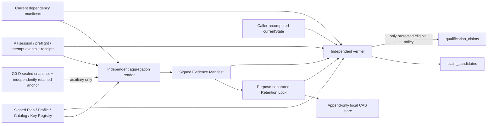

# G0-C 资格证据清单与独立聚合协议实施报告

- 实施日期：2026-07-12
- 工作包：`G0-C-QUALIFICATION-EVIDENCE-MANIFEST-AND-AGGREGATOR`
- 当前结论：本地确定性协议纵切已实现；**仓库没有资格 claim，Gate 0 尚未通过，R1 不得开始**
- 提交身份：以“最近一次包含本文的提交”动态解析；单次提交不能静态自引用最终 hash
- Phase 0～12 / VSIX 身份：属于 post-commit 动态发布证据，按 [15](15-新窗口与跨模型接管手册.md) 的命令从最终 commit、报告、VSIX 与已安装扩展复算，不在本文硬编码易过期值

## 1. 结论先行

G0-C 已实现 `devseek.qualification-evidence-manifest/v1`、聚合策略、retention lock、独立复算 reader 和本地 append-only CAS retention store。聚合器会重新验证 G0-B 的 profile、catalog、key registry、plan、全部事件和 receipt，枚举预注册分母与每次 attempt，保留失败和 veto，并按精确 claim tuple 重新派生结果。G0-D 的产品 Run Evidence 只有在 sealed snapshot 与独立 expected anchor 同时存在时才能作为辅助输入，且始终保持 `product-run-diagnostics`、`qualification_eligible=false`。

这次“已实现”只表示协议、Schema、reader/store 和攻击回归形成了可执行本地纵切，不表示已经建立组织上独立的资格服务。仓库策略是 `test-fixture`，两把 key 均为 `test-only`，retention class 是本机 `append-only-local-cas`，`claim_rules=[]`，没有 protected policy trust root、外部 WORM、独立可信时间或冻结 live candidate。因此：

- `C0-QUALIFICATION-EVIDENCE-MANIFEST`：`implementation_state=implemented`；
- `C0-QUALIFICATION-AGGREGATOR`：`implementation_state=implemented`；
- 两者 `qualification_claims=[]`、`qualification_level_view=null`；
- 本地 fixture 即使在攻击测试中派生出 `claim_candidates`，也不得进入 `qualification_claims` 或充当 dependency claim；
- Gate 0 七个节点尚未按精确 tuple 达到 `wired/L2`，没有任何 live、candidate、stable 或 top-tier 结论。

## 2. 架构与信任边界



这里的“独立”是**相对 manifest writer 的重新读取与重新推导边界**：reader 不信任 manifest 内的分母、失败、veto、candidate 或 claim 结果，而是从被冻结的签名输入复算。当前实现与 fixture keys 仍和代码处在同一仓库/主机，不能据此声称组织、主机或保管职责已经独立。

## 3. Manifest 的完整冻结与复算

### 3.1 冻结身份

Manifest 固定以下身份，任一改变都会使当前验证失败：

- candidate identity、Git commit、source tree；
- installed artifact、packaged Bridge、prompt bundle、runtime config；
- Provider connector、execution environment、Provider、Surface set、platform profile；
- qualification plan、profile、catalog、key registry、oracle、corpus、metric/statistical plan；
- dependency snapshot 与递归 dependency claim manifests；
- plan/session/attempt 全部 event stream heads。

`currentQualificationState(frozenEvidence)` 由调用方当前提供的冻结证据重新计算。reader 要求调用方给出的 `currentState` 与该复算结果完全一致，再逐字段对照 Manifest；它不是独立观察在线部署状态的探针。因此，当前实现不能单靠传入对象证明“正在运行的 VSIX/Bridge 就是该 candidate”。

### 3.2 分母、失败与 veto 守恒

聚合器不接受 writer 提供的汇总数字。它重新执行：

1. 验证 profile/catalog/key registry/plan hash、签名、有效期与相互绑定；
2. 验证每条 plan/session/attempt event 和一次性 receipt，并重建所有 stream head；
3. 枚举每个预注册 preflight/coverage slot 与全部 attempt，拒绝重复、跨 slot、跨 tuple 或非法 retry；
4. 以 preflight/session 状态机识别 missing、blocked、Ready 冲突、infra adjudication 与非法 terminal；
5. 保留 primary failure，合法 infra retry 不能以最后一次 pass 覆盖历史失败；
6. 重新计算 `planned/started/valid/infra-invalid/pass/product-miss/veto`、numerator、denominator 与依赖；
7. 只有 policy 中存在完全匹配 `profile/profile_sha256/scope/surface/provider/platform` 的 claim rule，所有必需 slots、阈值、veto、重复尝试和递归依赖均通过，才产生该 tuple 的 candidate。

仓库策略的 `claim_rules=[]`，所以当前仓库本身不产生 candidate 或 claim。测试中临时构造的规则只验证算法，不能回写为仓库资格事实。

### 3.3 G0-D 输入只能辅助

G0-D 输入必须同时提供完整 sealed snapshot 与独立保留的 expected anchor。reader 重新检查 event/receipt/record 双链、seal slot、final event/record hash 和 seal hash，并只把其摘要写入 `run_evidence_auxiliary[]`。任何未 seal、无 anchor、head 不一致或链重放失败都会 fail closed。

即使验证通过，写入 Manifest 的属性仍固定为：

```text
integrity_scope = product-run-diagnostics
qualification_eligible = false
auxiliary_only = true
```

产品 Run Evidence 不能自行签发资格 verdict，也不能把 G0-D 的 fail-soft 诊断缺口解释成 pass。

## 4. 签名、策略与当前资格隔离

Manifest 与 retention lock 使用 Ed25519 且 purpose 分离；policy 还要求二者的 key id、identity 和 key material 互不复用，并与 plan/event actors 分离。`audited-local` 模式把策略 ID 与 SHA-256 固定为代码常量，checker 再做反向校验，fresh-root TOFU 替换不能让相邻恶意 policy/key 自建信任。

资格可用性由 policy 与 plan 双重收窄。只要出现 local/test key、`test-fixture`、本地 CAS 或 `local-protocol-conformance`，policy 必须是 `qualification_eligible=false`；Manifest Schema 也强制该 scope 下 `qualification_claims` 为空。若请求 `protected-qualification`，实现还要求：

- 被独立审计并内置 allowlist 的 protected policy digest；
- `verified` policy 与 active、非测试、职责分离的 signer；
- `retention-lock-or-worm` 外部 retention 和独立 expected anchor；
- 资格有效的真实 plan 与完整证据。

当前 `PROTECTED_QUALIFICATION_POLICY_DIGESTS` 为空，因此 protected 模式明确 fail closed，而不是回退到本地 fixture。

## 5. Retention store 的安全边界

本地 `ImmutableQualificationManifestStore` 为 manifests、locks、manifest-id bindings 和 chain records 建立不可变文件/CAS 链，并要求 caller 在每次 retain/audit 时提供独立 expected anchor。genesis anchor 只允许用于构造器已固定且完全 pristine 的目录；已有记录后重放 genesis 会失败。manifest id 不能重签后绑定另一 hash，supersession 与 previous lock/record 必须连续。

POSIX 安全边界还包括：

- root 与四个子目录必须归当前用户所有，group/other 不得可写；
- 路径逐级拒绝 symlink，操作使用 nofollow/procfd capability；
- 构造时固定 root、manifests、locks、ids、records 五个目录描述符及 inode identity；
- 枚举、读取、原子创建、hard-link publish 与 pristine 检查都相对固定 capability 执行；
- 普通或瞬时目录树替换、替换后恢复、尾部删除与 genesis replay 都必须被检测；
- `close()` / `dispose()` 幂等关闭全部描述符，关闭后永久 fail closed。

这仍不是外部 WORM。non-POSIX 或缺失 nofollow/procfd 能力会 fail closed；同机高权限操作者和 store 生命周期之外的整体替换风险只能通过真正独立保留的 anchor、外部 retention 与职责隔离收敛。本轮没有把本地 CAS 描述成物理不可抵赖。

## 6. 攻击回归与确定性结果

主要入口：

```bash
npm run verify:qualification-evidence-manifest
```

2026-07-12 定向结果：Node test `35/35`；checker 编译 3 个 G0-C Schema，确认 35 个攻击断言全部通过、13 个必需攻击场景均存在，`repository_claim_count=0`、`qualification_eligible=false`。覆盖包括：

- 签名伪造、purpose/key material/actor 复用、fresh-root TOFU；
- 漏记失败、补跑覆盖、跨 tuple claim 与错误 infra 分类；
- candidate/artifact/dependency/Provider/Surface/platform/environment/event-head 漂移；
- manifest 过期、key revoke、递归 dependency 当前失效与 retention loss；
- G0-D 未 seal/无独立 anchor/篡改链输入；
- manifest-id rebind、删除/替换、尾部删除、genesis replay、symlink 与瞬时四目录替换；
- 不安全 POSIX 权限、descriptor 生命周期和关闭后调用。

这些是 deterministic local protocol conformance，不是 live、Surface 或 protected qualification evidence。

## 7. 集成发布字段

| 字段 | 当前记录 |
| --- | --- |
| G0-C focused verification | `verify:qualification-evidence-manifest`：`35/35`，checker `ok=true` |
| G0-D contract / Surface boundary | machine contract `38/38`、event types `29`、6 schemas、Schema attacks `55`；Shared `82/82`、Bridge `23/23`、CLI `20/20`、Surface `1287/1287`；Core/Surface 独立复审均为 P0=0、P1=0 |
| capability ledger | `verify:capability-ledger`：`10/10`；76 capabilities / 138 edges / R1 closure 45；ledger SHA-256 `b9e0e10f03d933992e22662596d9a45d3aa5a1ff84738b1e710a4d8fc3914d2c` |
| 最终 Phase 0～12 report | 按 [15 第 3 节](15-新窗口与跨模型接管手册.md#3-动态基线提交与制品身份) 解析与 containing commit 匹配的动态报告 |
| 最终 VSIX 路径 / SHA-256 / installed identity | 按 15 从本地精确 artifact 与 installed package 动态复算；不得硬编码会过期值 |
| 最终 Git commit | 最近一次包含本文/15 的统一 source integration commit；用 `git log -1 --format=%H -- <doc>` 解析 |
| Surface / live / holdout | exact-VSIX controlled 与用户当前 DevSeek 窗口仿真按 [17](17-Gate0本地纵切机器裁决用户窗口仿真与GPT5.5接管报告.md) 动态复算；均为 development/product evidence；live protected holdout **未运行** |

Focused pass 不替代最终全量门禁，也不自动提升 implementation state 到 `wired`。

## 8. Gate 0 交接，不是 R1 开工许可

G0-A/B/C/D 和一个本地 nonqualification runner 纵切已经存在，但 Gate 0 要求的是七个 C0 节点全部满足机器 profile 的 `wired/L2` 精确 tuple，而不是“四个工作包或本地 runner 写完”。当前机器 decision 仍报告 5 个 repository blocker、6 个 external blocker 和 0 claims。后续按 14 的原子卡进入 **Gate 0 资格缺口闭合与复核**，至少包括：

1. 保持唯一 runner composition root，逐 profile executor 证明真实声明入口接到 G0-B guard/event/receipt 与 G0-C reader；catalog metadata 不得冒充执行；
2. 建立独立受审计的 protected policy/trust root、active 非测试 signer、外部 retention/WORM、独立 anchor 与可信时间边界；
3. 冻结 commit、source tree、最终 VSIX、packaged/installed Bridge、Provider/Surface/platform/environment 身份；
4. 按签名 plan 运行 profile 要求的 deterministic/replay/Surface，以及被明确授权且 profile 要求的 live 配额；
5. 由有效 protected Manifest 派生逐 tuple claim，再让机器 Gate 复核七个节点。

在这些条件实际满足前：Gate 0 保持未通过；同窗口 development simulation 不等于 protected live；`qualification_claims=[]`、`qualification_level_view=null`；R1-KERNEL-DG01-03 和任何 candidate/stable/top-tier 宣称均被禁止。后续工作不再表述为“只实现 G0-C”，也不能绕过资格缺口直接开始 Kernel 迁移。
