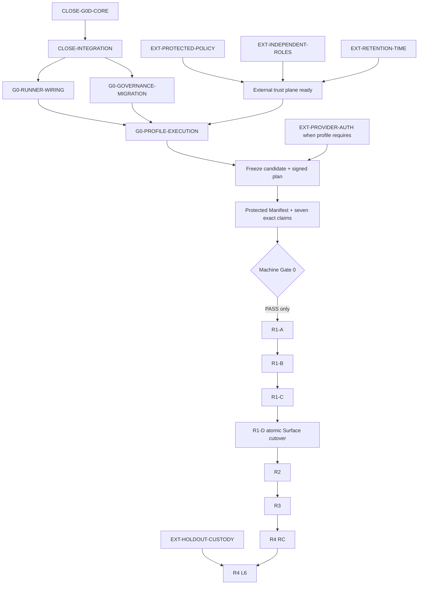

# DevSeek 未完成事项与后续整体迭代计划

- 盘点日期：2026-07-12
- 盘点范围：本目录 `README`、01～16，及其引用的机器账本、验证协议和历史接管入口
- 当前结论：G0-A/B/C/D 已形成不同深度的本地实现纵切，但没有有效 qualification claim；Gate 0 未通过，R1 尚未开始
- 本文责任：把分散在审计包中的未完成事项收成一个 backlog、依赖图和批次验收顺序；它不生成资格等级

## 1. 状态词只有四种

本文所有状态都使用下列固定词义，且分别判断“文档交付”和“对应产品/资格能力”：

| 状态 | 含义 |
| --- | --- |
| `completed` | 该文档或明确限定的工作切片已完成其承诺；不自动说明产品已接线或已取得资格 |
| `implemented-but-unqualified` | 代码、Schema、协议、接线或确定性测试已经存在，但仍缺真实入口不可绕过证明、受保护证据或有效精确 tuple claim |
| `pending` | 仓库内仍有可执行的实现、接线、迁移、测试或收口工作，不能归因于外部权限 |
| `blocked-by-external-authority` | 仅靠当前仓库和本地主机无法诚实完成，必须取得用户/组织授权、独立受保护身份、外部保留设施、账号条款或密封评测职责 |

硬规则：**deterministic、local、test-fixture、同机签名、本地 CAS、生成 Markdown、编译成功或测试全绿，单独或合并都永远不能把 Gate 0 判为通过。** Gate 0 只能由当前有效、受保护、可独立复算的 Evidence Manifest 对七个 C0 节点授予所需精确 claim tuple 后，由机器 Gate 裁决。

## 2. README 与 01～16 完成度真值矩阵

“文档状态”只判断该文件是否完成了自己的审计、设计或实施报告责任；“产品/资格状态”判断它所描述的能力是否真正进入当前产品和资格链。两列不得互相推导。

| 文档 | 文档状态 | 产品/资格状态 | 已经成立的事实 | 尚未成立或下一步 |
| --- | --- | --- | --- | --- |
| `README` | `completed` | `pending` | 已给出统一结论、01～16 导航和零 claim 边界 | Active Baseline、迁移 banner 和 README 机器生成仍未完整落地 |
| 01 现状与回退根因 | `completed` | `pending` | 多 Loop、多 owner、Surface/CLI 分叉和历史资格误读已被事实审计 | 这些物理缺陷尚未通过单 Kernel cutover 删除 |
| 02 三方架构对比 | `completed` | `pending` | 官方公开事实、DevSeek 推导和本地事实已分栏 | DevSeek 仍未达到目标行为；外部页面/版本变化后需重新取证 |
| 03 目标软件架构 | `completed` | `pending` | Kernel、authority、事务/effect、状态、恢复和信任边界已形成可实施设计 | 尚未成为已接线的唯一产品内核；旧 owner 仍可达 |
| 04 分能力路线图 | `completed` | `pending` | C0～C14、等级、DAG、root/seam 和量化门槛已定义 | Gate 0 未过；R1～R4 都未取得路线图规定的机器退出证据 |
| 05 黄金旅程与资格方案 | `completed` | `pending` | T0～T6、D/H 分仓、RC/L6、attempt identity 和 veto 规则已定义 | 自然 UI、same-trace live、密封 holdout、条款授权和独立评测尚未执行；其中外部部分见第 3 节 |
| 06 能力追踪与治理 | `completed` | `implemented-but-unqualified` | 机器 ledger/profile/plan/event/manifest 规范和部分 G0 实现已落地 | Active 文档迁移、受保护资格服务、逐 tuple claim 与生成视图闭环仍未完成 |
| 07 旧需求/架构裁决 | `completed` | `pending` | 旧文档已逐项分为保留、修订、废止和历史 | machine migration manifest、front matter、banner 与 Active Baseline 尚未全量应用 |
| 08 最短收敛方案 | `completed` | `pending` | Gate 0 前置与 Gate 0 后 R1 Slice A～D 已明确 | 当前只能闭合 Gate 0；不得把该设计当作 R1 已开工 |
| 09 自闭环反证审计 | `completed` | `pending` | 已反证长事务、双裁决、覆盖失败、统计作弊和资格外推等缺陷类 | 所列残余实现、外部信任和 live 风险仍真实存在 |
| 10 G0-A | `completed` | `implemented-but-unqualified` | 76 capability、138 typed edge、milestone profile 和目标 manifest 已形成；Catalog/Profile 后续已接成 `wired` | 目标 manifest 不是当前成绩；七项仍为零 claim，机器 Gate 0 未通过 |
| 11 G0-B | `completed` | `implemented-but-unqualified` | 本地签名 plan/event/receipt/store/guard、CAS/retry 和攻击测试已形成 | Plan/guard 未由受保护真实 runner 全入口不可绕过地消费；本地 keys/time/store 不构成资格信任 |
| 12 G0-D | `completed` | `implemented-but-unqualified` | 单一 Run Evidence Ledger、双 head/record 链、CLI/VS Code/Bridge 接线、strict snapshot、workspace CAS、sticky settlement 和 legacy 降级已形成；Core/Surface 独立复审均为 P0=0、P1=0 | 全入口 qualification runner 不可绕过证明仍不存在；它始终是 product diagnostics，不是 qualification evidence；4 项 active Surface P2、1 组架构 follow-up 与 1 项条件性 retry 要求见本节 backlog |
| 13 G0-C | `completed` | `implemented-but-unqualified` | Manifest Schema、独立复算 reader、本地 retention/CAS 和攻击矩阵已形成 | protected policy allowlist、非测试 signer、外部 WORM/anchor/time、真实冻结候选和有效 claim 均不存在 |
| 14 整体迭代计划 | `completed` | `pending` | README/01～16 真值矩阵、统一 backlog、依赖 DAG、验收与停止条件已形成 | 表中 `pending` 与外部 blocked 项仍须按依赖执行，文档完成不代表 backlog 完成 |
| 15 跨窗口接管 | `completed` | `pending` | 无聊天上下文的动态 commit/Phase/VSIX/installed identity 复算和条件分支已形成 | 每次接管仍必须现场复算，不得沿用文档内的历史快照 |
| 16 原则、标准与 Skills | `completed` | `pending` | 不可违反原则、全生命周期 DoD、固定作业模板和 15 个 Skill 候选契约已形成 | Skills 均仅为 `candidate-design`，必须逐个实现、接线、Surface 反证和资格化，不得把规划写成产品能力 |

本表中的 `completed` 绝不表示“产品完成”。10～13 是实施报告正文完成；commit、Phase、VSIX、Bridge 与 installed identity 是动态集成/发布事实。由于一次提交不能在自身内容中静态嵌入最终 hash，本文不保存易过期的自引用值；必须按 [15](15-新窗口与跨模型接管手册.md) 从“包含接管文档的提交”、Phase 报告、精确 VSIX 和已安装扩展复算。

## 3. 统一未完成事项清单

### 3.1 仓库内可直接推进

| ID | 状态 | 原子结果 | 当前最小动作 | 完成证据 |
| --- | --- | --- | --- | --- |
| `CLOSE-G0D-CORE` | `completed` | 关闭本轮独立复审发现的 G0-D Core/Surface P1 缺陷类 | 已完成 strict snapshot、全边界 secret non-observation、runtime/Schema 一致、workspace CAS、executionMode 与 sticky settlement 收口 | Core/Surface 两次独立只读确认均为 P0=0、P1=0；精确计数见 12 |
| `CLOSE-INTEGRATION` | `pending` | 形成当前唯一集成候选 | 最终全量/Phase 与 staged 审计 → 一个统一 source commit → 从该 commit 重跑 Phase → package / packaged Bridge verify / SHA-256 / install / identity；只在最终交付和动态回执中判定完成 | 干净最终 diff、报告路径、commit/source tree/VSIX/Bridge/installed identity 可复算 |
| `G0-RUNNER-WIRING` | `pending` | 所有声明 qualification runner 入口不可绕过 G0-B guard/event/receipt 与 G0-C reader | 建 reachability map、composition-root 单入口、旁路静态守卫和真实 runner conformance | 入口覆盖 100%，bypass 0；缺 plan/session/slot/receipt 时外部动作 0 |
| `G0D-DEFERRED-HARDENING` | `pending` | 关闭本轮不阻断发布的 4 项 active Surface P2、1 组 Provider/Bridge 架构 follow-up 与 1 项条件性 retry 要求，且不另建平行 owner | 按下方归属并入最近一次触碰相同 authority 的原子批次；若在此前复现用户功能错误则升级并单独收口 | 每项有最小反例、唯一 owner、静态/运行时 guard；不得靠 prompt/case 特判 |
| `G0-GOVERNANCE-MIGRATION` | `pending` | 方向包升级为可治理 Active Baseline | 建 Active Baseline、旧文档 inventory/migration manifest、front matter/banner 和生成 README/status 视图 | selector 全裁决、SSOT 冲突 0、重新生成后 diff 0 |
| `G0-PROFILE-EXECUTION` | `pending` | 真实 profile/corpus/slot 可以由 runner 完整执行与复算 | 补足逐节点 Gate 0 profile、runner/toolchain identity、deterministic/replay/Surface 执行及双向 Schema/runtime 攻击 | 计划分母守恒、全部事件链可复算、无 wildcard/default claim |
| `G0-MACHINE-DECISION` | `pending` | 机器 Gate 0 裁决 | 在外部信任条件齐备后冻结候选、执行签名计划、生成受保护 Manifest，逐 tuple 复核七节点 | 七个 C0 节点均满足要求的 `wired/L2` 精确 tuple；机器 Gate 输出 PASS |
| `R1-A` | `pending` | D-G01 最薄单 Kernel seam | 统一 TaskContract/command/event/settlement，附件只作 ContextRef，VS Code/CLI 只适配 | Headless D-G01 与架构守卫通过；不宣称 L4 |
| `R1-B` | `pending` | D-G02 mutation 完整性 | 所有 write/edit/delete/mkdir/move/undo/CLI 写入迁入同一 mutation authority，删除旧 writer | CAS/dirty worktree/fault/rollback 攻击通过；mutation bypass 0 |
| `R1-C` | `pending` | D-G03 验证与完成唯一化 | verifier/diagnosis/repair/Settlement 收口；无 verifier 不通过；删除旧 completion owner | false completion 0、validation source write 0、terminal owner 1 |
| `R1-D` | `pending` | 全 Surface 原子 cutover | 所有声明入口同时经同一 Kernel，旧 owner=0，再做一次最终 VSIX 安装与自然 UI development canary | Headless/VS Code/CLI conformance；installed identity；真实 UI 同 trace，但不自动产生 L4/L5 |
| `R2` | `pending` | 软件工程脑 | C2～C5 完整 profile，工程定向/探索/需求/grounding/设计接入同一 Kernel | D-G00/05/06/09 与逐原子 L4 claim |
| `R3` | `pending` | 可靠性、协作、记忆和适用扩展 | C10～C13 按 applicability 原子推进；cancel/resume 分开 | D-G07、两个 D-G08 slot、D-G10～14；无权限旁路/重复 effect |
| `R4` | `pending` | RC 与顶级资格 | 冻结候选先 3/2/1 RC，再执行完全 disjoint L6 holdout 与盲评 | RC 只得 RC-smoke；L6 满足 05 的 cluster/paired/veto 门槛后才可声明 |

`G0D-DEFERRED-HARDENING` 的已登记内容与合并归属如下：

1. directory 创建与 pending undo 的最终 route/inode/content/absence postcondition → 合入 `R1-B` Mutation authority；
2. MCP unknown-tool 必须在 permission、用户确认和 mutation started 前由 registry/manager preflight 拒绝 → 合入 `R1-B` Permission/Effect authority；
3. 所有 validation/quality sibling 的 exact-count、严格顺序和同 operation id oracle → 合入 `R1-C` Validation/Settlement authority；
4. local repair 的只读 grep/git 状态移除动态 terminal import，进入静态只读/证据约束边界 → 合入 `R1-B` 或后续 Context Discovery，取先触碰者；
5. 增加静态架构守卫，生产 `LLMProvider.chat()` 只能由 `AgentApplicationService` 调用，并将 Bridge 安全错误摘要收口到 Shared helper → 合入下一次 Provider/Bridge authority 批次；
6. 只有未来为 Bridge 增加自动重试时，才强制加入“第一次调用污染 transport request、第二次仍得到全新副本”的回归；在未增加重试前不是活动缺陷。

这些项不能被删除或写成“已解决”，但也不应打断 `CLOSE-INTEGRATION → G0-RUNNER-WIRING` 的 Gate 0 最短路径；一旦变为可复现 P0/P1，则按 16 的停止规则立即升级。

### 3.2 必须由外部 authority 提供

以下项目状态是 `blocked-by-external-authority`。仓库实现可以为它们准备 port、Schema、mock 和 fail-closed 测试，但不得自签、自批或以本机替代：

| ID | 必需外部事实 | 不能接受的本地替代 |
| --- | --- | --- |
| `EXT-PROTECTED-POLICY` | 独立审计并批准的 protected policy digest/allowlist | 相邻 JSON、自哈希 policy、开发者临时常量 |
| `EXT-INDEPENDENT-ROLES` | active 非测试 plan/runner/watchdog/oracle/adjudicator/aggregator 身份与职责分离密钥 | fixture keys、同一操作者换 key id、同仓库私钥 |
| `EXT-RETENTION-TIME` | 外部 WORM/retention lock、独立 expected anchor、可信不可回拨时间及写入 receipt | hard-link CAS、同机副本、本地 high-water mark |
| `EXT-PROVIDER-AUTH` | DeepSeek/Codex/Claude 账号、自动化条款、数据出境和 fixture 使用授权 | 先登录/触网再补 plan，或把不可访问写成 N/A/pass |
| `EXT-HOLDOUT-CUSTODY` | H-* catalog/oracle 的独立保管、解封、盲审与冲突裁决 | 实现者可见 oracle、开发用例改名、RC formal 重用 |

任一外部项缺失时，正确结果是 blocked/未资格，不是降低 profile、减少分母、重建 session 或用 deterministic PASS 顶替。

## 4. 依赖 DAG 与批次顺序



并行只允许发生在无写冲突且依赖真实独立的节点之间。例如 runner wiring、治理迁移和外部 trust plane 可以并行准备；冻结 candidate 必须等待三者全部闭合。Gate 0 的 `PASS` 是 R1 的硬边，不能由人工评论、文档状态或 focused test 越过。

## 5. 每批最小变更、验收与停止条件

| 批次 | 最小变更边界 | 机器验收与攻击审计 | 真实 UI 验收 | commit / VSIX 循环 | 立即停止或回滚条件 |
| --- | --- | --- | --- | --- | --- |
| G0-C/D 统一集成 | 只修 Core/Surface 已确认的协议缺陷类与集成门禁暴露的同类架构回退；不扩产品功能 | canonical/secret/Unicode-time/snapshot-no-I/O/recovery 属性攻击；contract + Shared + Bridge + CLI + Surface focused + architecture drift + Phase | 不运行 live，不产生资格 | 子代理不提交、不打包；根代理全量后一个统一 commit，再从该 commit 执行默认本地 release loop | token 可观察/持久化、验证前建目录、Ajv/runtime 分叉、cycle 崩栈、编排文件越过冻结预算、原有回归任一出现 |
| G0 runner wiring | 只把声明入口接到既有 guard/reader authority，删除旁路 | reachability、forbidden import、未注册动作=0、并发/replay/time-window/receipt 攻击 | 仅受控 T3/T4 runner conformance；不得触网除非已授权 | 一个可回滚 commit；若 Extension/Bridge 行为改变，按 AGENTS compile/package/verify/install | 仍存在旁路、TOFU、runner 自批 policy、外部动作先于 durable registration |
| External trust plane | 只实现已批准的 adapter/identity/store/time port，不把外部 policy 写死进 Core | 独立验签、撤销、retention、anchor、clock rollback、职责复用攻击 | 无产品 UI 要求 | 基础设施独立变更记录；产品 repo 只提交 adapter/配置契约，最终 artifact 仍走 release loop | 无书面 authority、职责不独立、外部 receipt 不可审计、需要把 secret 放进 repo |
| Gate 0 profile run | 不改产品；只冻结身份并消费预注册 slots | 全分母/失败/veto/infra/stream head 守恒；七项逐 tuple 机器复算 | 仅运行 profile 明确要求且已授权的 Surface/live；同 trace | 冻结前先 commit/package/install并记录 hash；运行中任何产品改动都关闭候选并清零 | 普通 product failure（L0～L5/RC）、veto、身份漂移、缺证据、未分类或外部 authority 失效 |
| R1-A～C | 每批只迁移一个 semantic authority；旧 API 只能无语义 delegator | focused/property/replay/Headless + owner/import 守卫；不得手工提升 claim | 不向日常用户发布混合内核；只有受控开发路径 | A～C 允许 checkpoint commit，但按 04/08 保持同一未发布候选；若执行环境要求 AGENTS 默认安装而用户未明确批准该例外，先停止确认 | 第二 Kernel、双写/双终态、fallback、测试弱化或任务外 diff |
| R1-D | 一次收口全部声明 Surface 与删除旧 owner | 全入口 conformance、D-G01～04、artifact/installed identity、Phase 0～12 | 一条自然 UI development canary；失败转 replay，不扩 live | 最终 cutover commit后 compile → package → packaged Bridge verify → local install；仅安装完整新 artifact | legacy owner 可达、Surface 结果不等价、自然 UI 绕过、回退需要 runtime dual flag |
| R2 / R3 | 一次只提升一个原子 capability 和一个 authority | profile corpus、相邻契约、受影响黄金旅程、故障注入、DAG impact closure | 达到相应 L4 时跑真实 VS Code/CLI；live 只在冻结 wave | 行为改变按 AGENTS 走 release loop；每个原子专项一个可回滚 commit | 同类失败第二次仍靠样例特判、引入平行 owner、资格跨 scope 外推 |
| R4 | 不再修产品；只执行冻结 RC/L6 计划 | 3/2/1 与 L6 disjoint、slot 唯一、cluster stats、paired blind review、veto=0 | same-trace natural UI × real Provider 是强制证据之一 | 候选先冻结 commit/artifact/installed identity；运行后不得 amend 或补跑覆盖失败 | 任一 veto、oracle 泄漏、条款/账号失效、候选变化、RC case 被重用为 L6 |

### 5.1 通用验证顺序

每一批从便宜、局部、可定位的证据向昂贵证据推进：

1. Schema/runtime 双向校验、unit/property 与新增攻击反例；
2. 受影响 package 的 compile/typecheck/test；
3. captured replay、Headless journey、architecture/reachability/生成物 drift；
4. Phase 0～12；
5. Extension/Bridge 行为改变时，由有权限的集成 owner 执行 compile → package → packaged Bridge verify → SHA-256 → local install → installed identity；
6. 只有 profile、candidate、计划、外部 authority 和用户授权同时成立，才进入 controlled natural UI、live 或 holdout。

早层失败时不得跳到后层“看看能不能过”。后层失败必须固化为 replay/fixture并回到唯一 authority 修复；同类真实失败不得盲目重跑。

## 6. 提交、VSIX 与回滚协议

### 6.1 本轮统一集成批次

- G0-C/G0-D、产品接线、生成物、测试与 12～16 必须位于同一个 source integration commit；子代理不得单独提交、amend、package 或 install。
- Core 与 Surface 已分别取得独立只读复审 `P0=0、P1=0`；提交前仍必须完成最终全量/Phase、审计 staged paths 和 `git diff --check`。
- Extension 与 Bridge 行为改变后，必须从该 commit 执行默认本地 release loop，并验证 packaged Bridge、VSIX SHA-256 和 installed extension identity。
- 一次提交无法在自身内容中静态嵌入最终 hash，VSIX 也只能 post-commit 构建；精确身份按 15 动态解析并在最终交付/生成报告中记录，不为“回填 Markdown”创建第二个混合提交。

### 6.2 后续批次

- 每个独立缺陷类/原子 capability 使用一个可回滚 commit；不能把无关格式化或旧 dirty 改动带入。
- 回滚发布只能安装上一份完整、已记录身份的 artifact；禁止在当前 artifact 中保留旧 Kernel、dual writer、dual settlement 或按 case 切换的 runtime flag。
- 候选一旦进入 Gate/RC/L6，任何代码、prompt、profile、case、oracle、artifact、Bridge、Provider、Surface 或环境身份变化都生成新候选并清零相应配额。

## 7. 动态集成回执模板

根代理和新窗口必须以命令输出和最终 artifact 解析下列字段；不把 focused pass 写成 Gate 0/live，也不在 tracked Markdown 保存自引用 hash：

```text
integration_status: RESOLVE_FROM_CONTAINING_COMMIT_AND_MATCHING_PHASE
final_git_commit: RESOLVE_LATEST_COMMIT_CONTAINING_DOC_15
final_source_tree: REQUIRE_CLEAN_TRACKED_TREE_AT_FINAL_COMMIT
final_phase0_12_report: RESOLVE_MATCHING_FINAL_COMMIT
final_vsix_path_and_sha256: RESOLVE_LOCAL_ARTIFACT
packaged_extension_version_build_git_commit: REQUIRE_MATCH_FINAL_COMMIT
packaged_bridge_verification: REQUIRE_PASS
installed_extension_identity: REQUIRE_MATCH_VSIX
focused_contract_shared_bridge_cli_surface: SEE_DOC_12_EXACT_COUNTS
live_natural_ui_holdout: NOT_RUN_DO_NOT_UPGRADE
qualification_claims: []
gate_0: NOT_PASSED
r1: NOT_STARTED
```

## 8. 下一次开工选择规则

1. 若 15 的 containing commit、matching Phase、VSIX/Bridge/installed identity 无法动态复算，只恢复 `CLOSE-INTEGRATION` 的证据闭环，不重新实现 G0-C/D。
2. 若动态集成身份成立且 Gate 0 未过，唯一当前任务是 `G0-RUNNER-WIRING`；外部 authority 可并行申请，但缺失时保持 blocked。
3. 只有机器 Gate 0 明确输出 PASS，才选择 `R1-A`；任何人读“实现完成”都不能替代该边。
4. 每次只从本清单选择一个原子 ID，写明 owner、输入、最小变更、必跑集、删除项和退出证据，再开始代码修改。
5. 若新事实与本表冲突，先更新机器 SSOT/证据并在本文登记 superseding fact；禁止通过静默改口继续下一批。

审计包总入口见 [README.md](README.md)；新窗口和跨模型的完整无聊天接管协议见 [15-新窗口与跨模型接管手册.md](15-新窗口与跨模型接管手册.md)；跨批次不变的工程原则、全生命周期 DoD 与候选 Skills 标准见 [16-顶级编程智能体收敛迭代原则质量标准与Skills规划.md](16-顶级编程智能体收敛迭代原则质量标准与Skills规划.md)。
