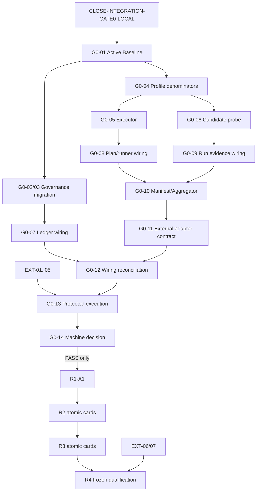

# DevSeek 未完成事项与 GPT-5.5 后续整体迭代计划

- 更新日期：2026-07-12
- 接管模型：下一窗口使用 GPT-5.5；模型变化不改变权限、门禁、资格或任务范围
- 盘点范围：本目录 `README`、01～17，以及 `docs/process` 机器账本、runner inventory、Gate 0 decision 和默认 Phase
- 当前结论：G0-A/B/C/D、一个本地非资格 runner 纵切和机器 decision contract 已实现；**Gate 0=`NOT_PASSED`、claims=`[]`、R1=`NOT_STARTED`**
- 本文责任：提供唯一 backlog、依赖、GPT-5.5 可领取的原子作业卡、验证证据和停止条件；不生成资格等级

## 1. 状态与机器真值

### 1.1 状态词只有四种

| 状态 | 含义 |
| --- | --- |
| `completed` | 明确限定的文档或工程切片已完成自己的承诺；不自动代表产品接线或资格 |
| `implemented-but-unqualified` | 实现、Schema、协议、接线或本地测试存在，但缺真实全入口、受保护证据或精确 claim |
| `pending` | 仓库内仍有可执行的实现、迁移、接线、测试或收口工作 |
| `blocked-by-external-authority` | 本地仓库不能诚实完成，必须由独立授权、受保护身份/设施、账号条款或 holdout 保管方提供 |

硬规则：deterministic、replay、Phase、同机签名、本地 CAS、exact-VSIX、安装成功、用户同窗口仿真或 Markdown 全绿，单独或组合都不能把 Gate 0 判为通过。只有受保护 Manifest 对七个 C0 节点产生当前有效的精确 tuple claims，机器 decision 才可能输出 `PASS`。

### 1.2 当前机器快照

动态源是 `docs/process/devseek-gate0-decision-report.json` 与 `docs/process/devseek-qualification-runner-inventory.json`；数字变化必须先由机器生成物和 checker 证明。

| 项目 | 当前值 |
| --- | --- |
| runner inventory | 19：本地非资格 runner 1、catalog metadata 10、production disabled 4、historical disabled 4 |
| restricted entrypoint scan | 248 files；known forbidden authority imports 0 |
| Gate 0 capabilities | 7 |
| implementation requirements | 2/7 satisfied；5 repository blockers |
| protected authority | v1 无 external attestation adapter；external trust 结构性 false |
| external blockers | 6 |
| exact claims | 0 |
| local conformance | `PASSED`，仅本地协议源契约 |
| Gate 0 / R1 | `NOT_PASSED` / `NOT_STARTED` |

五个 repository blockers 精确对应：`C0-CAPABILITY-LEDGER-SCHEMA`、`C0-PREREGISTRATION-PLAN`、`C0-QUALIFICATION-AGGREGATOR`、`C0-QUALIFICATION-EVIDENCE-MANIFEST`、`C0-RUN-EVIDENCE-LEDGER`。不得手工把它们从 `implemented` 改成 `wired`；必须先有 reachability、bypass=0、运行证据和生成物门禁。

## 2. 文档包完成度

| 文档 | 文档责任 | 对应产品/资格仍未完成的边界 |
| --- | --- | --- |
| README、01～09 | `completed`：事实审计、三方对标、目标架构、路线、黄金旅程、治理和反证 | 单 Kernel 物理 cutover、各 capability 晋级和正式资格未完成 |
| 10 G0-A | `completed` / `implemented-but-unqualified` | 七节点仍只有 2 项 machine `wired`；Active Baseline/迁移未闭合 |
| 11 G0-B | `completed` / `implemented-but-unqualified` | 本地 runner 已接 guard，但 production entries disabled，外部 trust/roles 不存在 |
| 12 G0-D | `completed` / `implemented-but-unqualified` | 统一 product diagnostics 已接线；永不自行签发 qualification claim |
| 13 G0-C | `completed` / `implemented-but-unqualified` | 本地 reader/retention/CAS 存在；在线 candidate probe、外部 WORM/time/attestation 缺失 |
| 14 | `completed`：本 backlog 与 GPT-5.5 编排 | 表中 pending/blocked 工作尚未完成 |
| 15 | `completed`：动态跨窗口接管 | 每次接管仍须现场复算，不能沿用聊天 hash |
| 16 | `completed`：原则、DoD、Skills 与 GPT-5.5 作业协议 | Skills 仍是 candidate design，不能写成产品能力 |
| 17 | `completed`：本轮 runner/decision/仿真边界报告 | Gate 0 仍未 PASS；动态 release/同窗口结果需现场核验 |

## 3. GPT-5.5 原子任务总队列

### 3.1 当前批次关闭条件

`CLOSE-INTEGRATION-GATE0-LOCAL` 只有在下列事实全部成立时为 `completed`：

1. 当前 runner、decision、Surface harness、文档和 machine SSOT 位于同一个 reviewed source commit；
2. focused、受影响 full、独立复审 P0=0/P1=0、Phase 0～12 都通过；
3. Phase 实际包含 `qualification-runner-wiring` 和 `gate0-machine-decision-contract`；
4. 从该 commit 编译、package、验证 packaged Bridge、计算 SHA-256 并安装 exact VSIX；
5. package、Bridge、installed extension 的 version/build/gitCommit 一致；
6. 在用户当前 DevSeek 窗口完成简单编程仿真，或明确记录不可执行的环境阻塞；不得以隔离窗口代替；
7. Gate 0 仍诚实输出 `NOT_PASSED`、claims=0。

若新窗口复算其中任一项不成立，唯一任务仍是 `CLOSE-INTEGRATION-GATE0-LOCAL`；不得开始下面的 G0-01。

### 3.2 Gate 0 仓库内原子卡

GPT-5.5 一次只领取一行。每行一个 semantic authority、一个可回滚 commit；“允许边界”之外的发现只登记新卡。

| 顺序 / ID | 前置与唯一结果 | 允许修改边界 | 必须验证与完成证据 | 立即停止条件 |
| --- | --- | --- | --- | --- |
| `G0-01-ACTIVE-BASELINE-SELECTOR` | 当前集成身份全匹配；建立机器可读 Active Baseline selector，能唯一指出 active requirement/architecture/process 文档 | capability/document governance schema、selector、checker、最小 generated view；不改产品 loop | selector 对全部 active 类型唯一；unknown/duplicate/conflict fail closed；generated drift=0；Phase | 需要人工默契选文档、出现第二 selector、准备顺手迁移全部旧文档 |
| `G0-02-LEGACY-DOC-INVENTORY` | G0-01；给历史需求/设计/接管文档逐文件登记 keep/revise/supersede/archive | migration manifest、inventory schema/checker；不改运行时代码 | 所有受治理文档 coverage=100%，路径/链接存在，未裁决=0 | broad rewrite、删除历史证据、根据标题猜状态 |
| `G0-03-FRONTMATTER-BANNER-GENERATION` | G0-02；让 front matter、superseded banner、README/status 只由 manifest 生成 | docs generator、approved docs、drift tests | 第二次生成 diff=0；Active 与 historical 链接无冲突；Phase | 手工批量粘 banner、生成器覆盖正文、机器 SSOT 冲突 |
| `G0-04-PROFILE-DENOMINATOR-REGISTRY` | G0-01；为七个 C0 节点定义精确 profile/corpus/catalog/slot/applicability 分母 | qualification profile/catalog schema、generator、攻击 fixture | 无 wildcard/default claim；分母、slot、attempt identity 守恒；schema/runtime 双向攻击 | 为通过而删 case/降分母、把 catalog metadata 当已执行结果 |
| `G0-05-PROFILE-EXECUTOR-CONFORMANCE` | G0-04；每种已声明攻击语义有真实 executor contract，并经唯一 runner root | runner adapter/executor registry/inventory/tests；production 仍可 fail closed | executor coverage=100%，每个语义有独立 oracle；空/替换输入、错轮、缺 receipt 外部动作=0 | 用一个通用 happy path 映射所有 catalog、引入第二 guard/reader |
| `G0-06-CURRENT-CANDIDATE-IDENTITY-PROBE` | G0-04；reader 可独立观察实际 source/VSIX/Bridge/installed/runtime identity，不再只信 caller 对象 | identity ports、read-only probes、schemas/tests | caller forged identity 被拒；package/install/runtime 全字段 exact match；无 secret observation | probe 需要写产品状态、把本地路径存在当身份相同、在线状态不可读却标 pass |
| `G0-07-C0-LEDGER-WIRING` | G0-01/03；所有 governed selector/status 消费唯一 capability ledger schema | ledger authority、generated views、import/reachability guards | ledger schema owner=1、consumers coverage=100%、bypass=0；只有证据满足才将对应项升 `wired` | 直接编辑 state、Markdown 反向驱动 ledger、第二份状态文件 |
| `G0-08-C0-PREREGISTRATION-WIRING` | G0-04/05；真实 profile executor 必经 plan/session/slot/authorization/receipt | existing runner composition、plan adapters、entrypoint inventory | production declaration 入口 coverage=100%；missing/expired/replay/clock rollback dispatch=0 | 普通产品任务被误当 qualification、TOFU、durable registration 后置 |
| `G0-09-C0-RUN-EVIDENCE-WIRING` | G0-06/08；qualification attempt 与 product Run Evidence 通过显式 correlation/anchor 连接但不混权 | G0-D adapter、evidence correlation schema、reader tests | operation/attempt/candidate exact binding；unsealed/错 anchor/错 scope 不可聚合 | G0-D 自行产生 verdict、复制第二本账、隐藏原始 failure |
| `G0-10-C0-MANIFEST-AGGREGATOR-WIRING` | G0-04/06/08/09；aggregator 从冻结源独立复算 manifest，而非信 writer summary | G0-C reader/manifest adapter/policy port/tests | denominator/failure/veto/retention/provenance 逐项复算；writer forged summary 无效 | 同仓 self-hash 被当 trust、`.some()` 任一 profile 替代 exact claim binding |
| `G0-11-EXTERNAL-AUTHORITY-ADAPTER-CONTRACT` | G0-10；只实现外部 attestation/trusted registry/retention/time 的 fail-closed ports，不导入本地假凭据 | adapter interfaces、receipt schemas、crypto verification、negative tests | 普通 object/boolean 不能伪造；撤销、角色复用、clock rollback、manifest/provenance mismatch 拒绝 | 没有已批准 trust root 却启用、secret 写入 repo、回退到 self-hash |
| `G0-12-C0-WIRING-RECONCILIATION` | G0-07～11；由 reachability 和 checker 逐项关闭 5 个 repository blockers | machine ledger generator/checker/report only；不增加功能 | repository blockers 只能随可复算证据下降；fresh clone 重生成一致；独立 P0/P1=0 | 人工调 state、外部 blocker 被误删、claims 被本地 fixture 写入 |
| `G0-13-PROTECTED-PROFILE-EXECUTION` | G0-12 + 全部外部 authority；冻结 candidate 并消费预注册 slots | 不改产品；只执行批准 profile/runner | 全事件链、分母、失败、veto、roles、WORM/time/anchor 守恒；exact claims 可复算 | 任一身份变化、普通 product miss、veto、证据缺口、授权失效 |
| `G0-14-MACHINE-DECISION-EXECUTION` | G0-13；由受保护 Manifest 对七项作最终机器裁决 | decision input/report；不修改实现迎合结果 | 七项均满足 required `wired/L2` exact tuple 才 `PASS`；否则保持 `NOT_PASSED` | 人工 override、跨 scope 外推、checker pass 被称 Gate pass |

### 3.3 外部 authority 队列

这些卡可并行申请，但 GPT-5.5 不能在仓库中自造完成证据。

| ID | 外部交付 | 仓库可做 | 不可接受替代 |
| --- | --- | --- | --- |
| `EXT-01-SOURCE-REGISTRY-BINDING` | 独立批准的 profile/evidence registry digests 与版本/撤销策略 | adapter/schema/fail-closed test | 同仓 JSON 自哈希、临时常量 |
| `EXT-02-INDEPENDENT-ATTESTATION` | 可验证的外部 authority attestation 与受信根 | crypto verifier、receipt/provenance contract | caller boolean、普通对象、开发者自签 |
| `EXT-03-PROTECTED-PROFILE-POLICY` | protected profile、aggregator allowlist 和 claim rules | import/validation port | 本地 fixture 改 `qualification_eligible=true` |
| `EXT-04-ROLES-KEYS` | active 非测试 plan/runner/watchdog/oracle/adjudicator/aggregator 职责隔离身份 | role/purpose/revoke checks | 同一操作者换 key id、仓库私钥 |
| `EXT-05-RETENTION-TIME` | 外部 WORM/retention lock、独立 stream anchor、可信不可回拨时间 receipts | storage/time adapter | hard-link CAS、同机副本、高水位文件 |
| `EXT-06-PROVIDER-AUTH` | 账号、自动化条款、数据出境和测试 fixture 授权 | redaction/preflight/blocked state | 先登录触网后补 plan |
| `EXT-07-HOLDOUT-CUSTODY` | H-* catalog/oracle 独立保管、解封、盲审、冲突裁决 | sealed import/reader | 开发用例改名或实现者可见 oracle |

### 3.4 Gate 0 PASS 后的 R1 原子卡

以下所有卡前置条件都是机器 `Gate 0=PASS`。未 PASS 时只读这些定义，禁止改 R1 产品代码。

| 顺序 / ID | 单一结果 | 核心验证 / 删除门 |
| --- | --- | --- |
| `R1-A1-TASK-CONTRACT` | 用户原文、修订、项目规则进入版本化最小 TaskContract | 中英文否定/范围/修订/blocked property tests；旧自由文本 completion 输入删除 |
| `R1-A2-KERNEL-COMPOSITION-SEAM` | 唯一 Kernel composition root 接收 TaskContract 并拥有 run identity/event/settlement | D-G01 Headless create；Kernel owner=1；附件只是 ContextRef |
| `R1-A3-EVIDENCE-AND-SETTLEMENT-MINIMUM` | 原始结果先入 Evidence，唯一 Settlement 依据 acceptance 封存终态 | exactly-one terminal、pending/adverse/degraded attacks；模型文本无完成权 |
| `R1-B1-MUTATION-INVENTORY-GUARD` | 枚举 write/edit/delete/mkdir/move/undo/CLI writer 并先建立 bypass fail gate | writer coverage=100%；新增未注册 writer 令 gate 失败 |
| `R1-B2-WRITE-EDIT-TRANSACTION` | write/edit 经唯一 Mutation authority、CAS/read-back/rollback | dirty/ABA/symlink/ENOSPC/crash attacks；旧 writer 删除或无语义委托 |
| `R1-B3-REMAINING-MUTATIONS` | delete/mkdir/move/undo/CLI 写入迁入同一事务 | inode/content/absence postconditions；pending undo 不假完成 |
| `R1-B4-PERMISSION-EFFECT` | terminal/MCP/network/workspace effects 使用统一 operation/authorization/receipt | unknown mutable、deny-before-call、retry/idempotency、secret non-observation |
| `R1-C1-VALIDATION-PLAN` | acceptance 生成最小有效 VerificationPlan，验证器不写源码 | missing command/weak oracle/manual GUI classification tests |
| `R1-C2-DIAGNOSIS-REPAIR-RECOVERY` | sticky failure、最小 diagnosis、有界 repair/checkpoint/resume | 后续成功不覆盖失败；no-progress/budget/ABA/stale checkpoint attacks |
| `R1-C3-SINGLE-COMPLETION` | verifier→quality gate→recovery→Settlement 唯一完成链 | false completion=0、validation source write=0、terminal owner=1；旧 completion owner=0 |
| `R1-D1-SURFACE-CONFORMANCE-INVENTORY` | VS Code/CLI/附件/命令等全部声明 Surface 映射同一 Kernel contract | entry coverage=100%、结果同构、legacy owner reachability=0 |
| `R1-D2-ATOMIC-CUTOVER` | 所有 Surface 同一候选一次切换并物理删除旧 owner | D-G01～04、Phase、architecture guard；禁止 runtime dual-track/fallback |
| `R1-D3-RELEASE-USER-WINDOW-CANARY` | 从冻结 commit package/install，并在用户 DevSeek 窗口跑 development canary | artifact/Bridge/installed identity + same trace；只得 development evidence，不自动 L4 |

### 3.5 R2 软件工程能力原子卡

R2 每卡先 Design→Implemented→Wired→Surface verified，再按受保护 profile 请求 Qualified；不能把一张 Skill 表一次实现。

| ID | 能力结果 | 关键反例 / 黄金旅程 |
| --- | --- | --- |
| `R2-01-INTENT-REVISION` | 意图、否定、修订、暂停/继续和破坏性限制合并成 TaskContract | D-G00；跨轮改口、中文否定、范围收缩 |
| `R2-02-REQUIREMENT-CONTRACT` | objectives/deliverables/constraints/acceptance/applicability 可执行 | 禁止关键词特判、固定文档数、隐式扩需求 |
| `R2-03-CONTEXT-DISCOVERY` | repo/rules/build/callers/registries/external boundaries 形成 EvidenceRef graph | D-G05；symlink/path escape/大目录/missing AGENTS |
| `R2-04-SOURCE-GROUNDING` | 需求与设计引用实际源码、调用链和构建事实 | D-G06；过期 symbol、generated/handwritten 混淆 |
| `R2-05-ARCHITECTURE-DECISION` | 最小 ADR/ChangePlan 明确 owner、状态、故障、删除项和验证 | D-G09；parallel owner、双写、Surface 业务规则 |
| `R2-06-IMPLEMENTATION-PLANNING` | ChangePlan 转符号级 ChangeSet，影响闭包完整 | sibling/import/generated boundary、scope creep |
| `R2-07-PROVIDER-TOOL-NORMALIZATION` | Provider/tool 只适配统一 command/event/effect contract | capability negotiation、unknown tool、partial stream |
| `R2-08-VALIDATION-SELECTION` | 按 acceptance 和变更图选择 focused→full 验证 | 漏测、弱 oracle、GUI 误判、补跑覆盖 |
| `R2-09-REVIEW-DELIVERY` | 独立 review 与 DeliveryManifest 给出 diff、验证、artifact、风险 | P0/P1 independence、虚假完成、身份漂移 |

### 3.6 R3、R4 与扩展原子卡

| 阶段 / ID | 单一结果 | 关键门 |
| --- | --- | --- |
| `R3-01-CANCEL` | cancel 后无新 effect，in-flight 明确结算 | D-G08-CANCEL 独立 slot；重复 effect=0 |
| `R3-02-RESUME` | checkpoint/receipts 驱动幂等 resume，不重放已提交 effect | D-G08-RESUME 独立 slot；stale checkpoint/ABA attacks |
| `R3-03-STEER` | 用户 steer 生成 TaskContract revision 并重新规划未提交部分 | committed effect 不被改写；权限不扩大 |
| `R3-04-CONTEXT-COMPACTION` | 至少三次 compaction 后关键约束/决定保真 | 30 长会话；secret leak=0、stale memory<=2% |
| `R3-05-MEMORY-POLICY` | scope、来源、过期、撤销、redaction 可审计 | 外部内容提权/跨 scope memory veto |
| `R3-06-SUBAGENT-COLLABORATION` | child 只交 evidence/proposal，主 Kernel 唯一结算 | 并行写冲突、child terminal claim=0 |
| `R3-07-SKILL-PLUGIN-HOOK-MCP` | 每种扩展复用 Permission/Mutation/Evidence/Settlement | 每种 20 tasks + 100 permission/fault sequences；未签名/旁路 veto |
| `R3-08-SURFACE-ACCESSIBILITY` | 关键交互、进度、审批、取消和恢复在声明平台可达 | required Surface checklist=100%；不能只测 DOM fixture |
| `R4-01-FREEZE-CANDIDATE` | 冻结 commit/tree/artifact/Bridge/Provider/Surface/profile/oracle | 任一变化生成新候选并清零配额 |
| `R4-02-RC-3-2-1` | 依次执行 canary 3、medium 2、formal 1 的 frozen RC smoke | 失败粘性、slot 唯一、不得补跑覆盖；RC 不等于 L6 |
| `R4-03-SEALED-L6` | 完全 disjoint holdout、same-trace natural UI × real Provider、盲评 | 24 family×3 execution、cluster/paired/veto 规则以 05/06 为准 |
| `R4-04-RELEASE-DECISION` | 独立 authority 依据完整 manifest 作发布/不发布裁决 | 任一 veto、oracle 泄漏、条款失效即不发布 |

### 3.7 已登记但不抢占的 P2

以下内容并入最先触碰其 authority 的原子卡；若复现为用户功能错误则升级为独立 P0/P1：

1. directory 创建与 pending undo 的 route/inode/content/absence postcondition → `R1-B3`；
2. MCP unknown-tool 在 permission/确认/mutation 前拒绝 → `R1-B4`；
3. validation/quality sibling 的 exact-count、顺序和 operation id oracle → `R1-C1/C3`；
4. local repair 只读 grep/git 状态的动态 terminal import → `R1-B4` 或 `R2-03`；
5. `LLMProvider.chat()` 只能由 Application Service 调用及 Bridge 安全摘要 helper → `R2-07`；
6. Bridge 未来增加自动重试时，必须证明每轮 request 是全新副本；未增加重试前不活动；
7. VS Code 1.112 旧 extension-host replay Webview 不回 `harnessReport` → 下次触碰该 harness 时修复，不能用它覆盖 exact-VSIX/用户窗口结果；
8. 外部 authority adapter 未来必须逐 claim 绑定受信 profile、evidence manifest、retention 和 provenance，绝不能放开普通 source fields 自证。

## 4. 依赖 DAG



治理迁移与外部 authority 申请可在无写冲突时并行，但 GPT-5.5 的仓库 WIP 仍为 `1`。Gate 0 的机器 `PASS` 是 R1 的硬边，不能由文档、评论或测试数量越过。

## 5. GPT-5.5 每轮输入卡

新窗口必须把选中行扩成下列完整 payload 后再修改代码；缺字段时先只读补齐，不能凭模型记忆猜测。

```text
task_id:
model: GPT-5.5
authority_mode: read-only | implementation | integration-release

user_outcome:
machine_state_before:
source_of_truth_files:
baseline_branch_head:
dirty_staged_untracked_state:
containing_commit_phase_vsix_installed_identity:

prerequisites_and_dependency_ids:
semantic_authority:
input_output_contract_and_schema:
defect_class_or_atomic_capability:

allowed_paths:
no_touch_paths:
non_goals:
external_actions_forbidden_or_explicitly_authorized:

minimal_failing_evidence:
sibling_entrypoints:
state_protocol_persistence_recovery_ui_audit:
minimal_change:
replaced_or_deleted_paths:

focused_commands_and_expected_counts:
affected_package_commands:
architecture_generated_drift_commands:
independent_review_requirement:
phase_command:
release_identity_commands_if_applicable:

evidence_paths_hashes_and_receipts:
qualification_scope_and_claim_effect:
not_run_items:
new_p2_backlog:

stop_if:
done_iff:
next_atomic_id_or_blocked_reason:
```

## 6. 固定验证与停止语义

验证顺序不可倒置：

```text
minimal failing replay / schema / property / attacks
  → focused authority tests
  → affected package compile/typecheck/full tests
  → captured replay/headless/architecture/reachability/generated drift
  → independent review: P0=0 and P1=0
  → Phase 0–12
  → docs + machine SSOT reconciliation
  → staged boundary and diff review
  → one source commit
  → Phase 0–12 from the clean commit
  → exact package / Bridge verify / SHA-256 / install identity
  → user-current-window simulation when the card changes Surface/Bridge or explicitly requires it
```

每卡只能以三种终态结束：

- `PASS`：`done_iff` 全部有本轮证据；可以提交并指向下一卡。
- `BLOCKED`：缺用户选择、外部 authority 或环境能力；不得降低门槛，记录精确 blocker 后停止。
- `FAIL`：产品/测试/架构门失败；保留首个失败，回 semantic authority 修复，不以重跑覆盖。

立即停止：P0/P1 非零、未知 bypass、未授权 external action、缺 receipt、Schema/runtime/generated drift、候选身份变化、需要第二 owner/dual-track、需要手工 claim/state、Gate 0 未 PASS 却准备修改 R1。

## 7. 下一窗口的唯一首卡

当且仅当第 3.1 节六项动态身份全部成立，GPT-5.5 首卡是 `G0-01-ACTIVE-BASELINE-SELECTOR`：

- 先只读盘点现有 document selector、front matter、status generator 和 README 来源；使用定向 `rg`，不扫 backups/node_modules/dist/media/制品。
- 先写最小失败测试：两个 active 文档、未知状态、路径不存在、循环 supersedes、一个类型无 active owner 都必须 fail closed。
- 只实现 selector/schema/checker 和一个最小 generated view；不在同卡迁移全量历史文档，不改产品 Kernel，不触网。
- focused + generated drift + architecture + Phase 全绿，独立 P0/P1=0 后一个 commit；文档-only/治理-only不需要虚构 live 结果。
- `done_iff`：每个受治理类型恰有一个 Active Baseline，selector 输出确定且第二次生成 diff=0；下一卡为 `G0-02-LEGACY-DOC-INVENTORY`。

如果当前集成身份任一不成立，则首卡自动退回 `CLOSE-INTEGRATION-GATE0-LOCAL`，只修身份/证据闭环，不重复实现 runner/decision。

## 8. 提交、发布与动态回执

- 每个 atomic ID 一个可回滚 commit；不夹带无关格式化或旧 dirty。
- Extension/Bridge 行为改变必须从 reviewed commit 执行 compile→package→packaged Bridge verify→SHA-256→install→installed identity。
- 用户要求本轮最终仿真直接使用当前 DevSeek 窗口；隔离 harness 仍可诊断，但不能替代该结果。
- 一次 commit 不能静态嵌入自身 hash，VSIX/同窗口结果又发生在 commit 后；15/17 使用动态解析，禁止为回填 hash 形成无限 docs commit。
- future live/canary/holdout 不继承本轮授权；新窗口必须重新核对 profile、候选、条款和用户授权。

动态回执至少包含：branch/commit/tree、dirty 解释、Phase report 与 gate 列表、runner checker、Gate decision 5+6 blockers、VSIX path/SHA/build/gitCommit、packaged Bridge、installed identity、用户同窗口 prompt marker/changed path/validation/cleanup、未运行项、claims=[]、Gate 0、R1、next task。

新窗口具体命令与首轮提示见 [15](15-新窗口与跨模型接管手册.md)，工程原则与 Skills 见 [16](16-顶级编程智能体收敛迭代原则质量标准与Skills规划.md)，本轮实现/仿真边界见 [17](17-Gate0本地纵切机器裁决用户窗口仿真与GPT5.5接管报告.md)。
