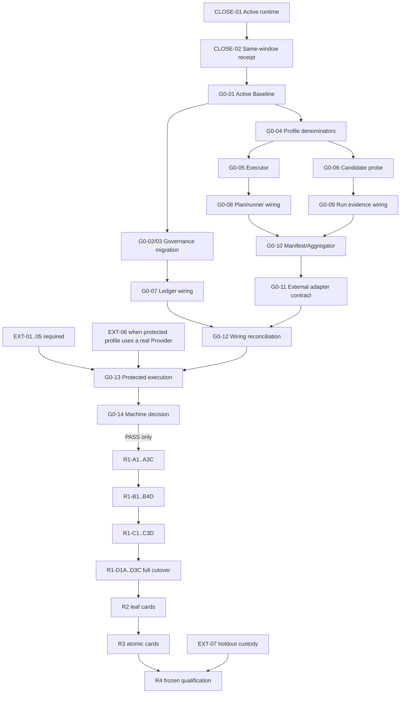

---
devseek_governance:
  generator: "devseek-doc-governance/v1"
  status: "active-baseline"
  path: "docs/top-agent-convergence-audit-20260711/14-未完成事项与后续整体迭代计划.md"
  source_group: "handoff"
  decision: "active"
  relationship: "primary"
  document_id: "PROCESS-14-GPT55-BACKLOG-BASELINE"
  document_type: "process"
  active_baselines: []
  machine_sources:
    active_selector: "docs/process/devseek-active-baseline-selector.json"
    legacy_inventory: "docs/process/devseek-legacy-doc-inventory.json"
  asserts_gate_pass: false
---

# DevSeek 未完成事项与 GPT-5.5 后续整体迭代计划

- 更新日期：2026-07-14
- 接管模型：下一窗口使用 GPT-5.5；模型变化不改变权限、门禁、资格或任务范围
- 盘点范围：本目录 `README`、核心 01～18 与派生启动入口 19，`docs/architecture` 01～18 的承接关系，以及 `docs/process` 机器账本、runner inventory、Gate 0 decision 和默认 Phase
- 当前结论：G0-A/B/C/D、一个本地非资格 runner 纵切、机器 decision contract 和 G0-01～04 机器治理迭代已实现；**Gate 0=`NOT_PASSED`、claims=`[]`、R1=`NOT_STARTED`**
- 本文责任：提供唯一 backlog、依赖、GPT-5.5 可领取的原子作业卡、验证证据和停止条件；不生成资格等级

## 1. 状态与机器真值

### 1.1 状态词只有四种

| 状态 | 含义 |
| --- | --- |
| `completed` | 明确限定的文档或工程切片已完成自己的承诺；不自动代表产品接线或资格 |
| `implemented-but-unqualified` | 实现、Schema、协议、接线或本地测试存在，但缺真实全入口、受保护证据或精确 claim |
| `pending` | 仓库内仍有可执行的实现、迁移、接线、测试或收口工作 |
| `blocked-by-external-authority` | 本地仓库不能诚实完成，必须由独立授权、受保护身份/设施、账号条款或 holdout 保管方提供 |

硬规则：deterministic、replay、Phase、同机签名、本地 CAS、exact-VSIX、安装成功、用户同窗口仿真或 Markdown 全绿，单独或组合都不能把 Gate 0 判为通过。只有受保护 Manifest 对七个 C0 节点产生当前有效的精确 tuple claims，机器 decision 才可能输出 `PASS`。

### 1.2 当前机器快照

动态源是 `docs/process/devseek-gate0-decision-report.json` 与 `docs/process/devseek-qualification-runner-inventory.json`；数字变化必须先由机器生成物和 checker 证明。

| 项目 | 当前值 |
| --- | --- |
| runner inventory | 19：本地非资格 runner 1、catalog metadata 10、production disabled 4、historical disabled 4 |
| restricted entrypoint scan | 253 files；known forbidden authority imports 0 |
| Gate 0 capabilities | 7 |
| implementation requirements | 2/7 satisfied；5 repository blockers |
| protected authority | v1 无 external attestation adapter；external trust 结构性 false |
| external blockers | 6 |
| exact claims | 0 |
| local conformance | `PASSED`，仅本地协议源契约 |
| Gate 0 / R1 | `NOT_PASSED` / `NOT_STARTED` |

五个 repository blockers 精确对应：`C0-CAPABILITY-LEDGER-SCHEMA`、`C0-PREREGISTRATION-PLAN`、`C0-QUALIFICATION-AGGREGATOR`、`C0-QUALIFICATION-EVIDENCE-MANIFEST`、`C0-RUN-EVIDENCE-LEDGER`。不得手工把它们从 `implemented` 改成 `wired`；必须先有 reachability、bypass=0、运行证据和生成物门禁。

## 2. 文档包完成度

| 文档 | 文档责任 | 对应产品/资格仍未完成的边界 |
| --- | --- | --- |
| README、01～09 | `completed`：事实审计、三方对标、目标架构、路线、黄金旅程、治理和反证 | 单 Kernel 物理 cutover、各 capability 晋级和正式资格未完成 |
| 10 G0-A | `completed` / `implemented-but-unqualified` | 七节点仍只有 2 项 machine `wired`；Active Baseline/迁移未闭合 |
| 11 G0-B | `completed` / `implemented-but-unqualified` | 本地 runner 已接 guard，但 production entries disabled，外部 trust/roles 不存在 |
| 12 G0-D | `completed` / `implemented-but-unqualified` | 统一 product diagnostics 已接线；永不自行签发 qualification claim |
| 13 G0-C | `completed` / `implemented-but-unqualified` | 本地 reader/retention/CAS 存在；在线 candidate probe、外部 WORM/time/attestation 缺失 |
| 14 | `completed`：本 backlog 与 GPT-5.5 编排 | 表中 pending/blocked 工作尚未完成 |
| 15 | `completed`：动态跨窗口接管 | 每次接管仍须现场复算，不能沿用聊天 hash |
| 16 | `completed`：原则、DoD、Skills 与 GPT-5.5 作业协议 | Skills 仍是 candidate design，不能写成产品能力 |
| 17 | `completed`：本轮 runner/decision/release/仿真边界报告 | 当前 active Bridge 与稳定安装包不同，同窗口仿真 `NOT_RUN`；Gate 0 仍未 PASS |
| 18 | `completed`：旧 architecture/ARCH-05 到当前 capability/atomic ID 的承接与缺口矩阵 | 人工执行权已切换；机器 Active Baseline/banner 仍待 G0-01～03 |
| 19 | `completed`：可复制的 GPT-5.5 只读启动、回执和条件授权文本 | 便利入口不发卡、不产生授权；动态事实仍须现场复算 |

## 3. GPT-5.5 原子任务总队列

### 3.1 当前唯一工作包：`CLOSE-INTEGRATION-GATE0-LOCAL`

当前工作包是 `pending`，不是 `PASS`：

| 身份层 | 2026-07-12 持久快照 | 判定 |
| --- | --- | --- |
| implementation / Phase source | `6d26aa6abe80d8bfd921a1ee176ece279487e9c3`；matching Phase run `2026-07-12T12-11-26-901Z` | PASS，仅对该 source |
| release artifact | `devseek-netai-latest.vsix`，SHA-256 `bc4359d444ab791c42aa4509e1bda03c37a3d546907eb6402cd2c37a59679cff`，build `20260712-t201401`，gitCommit `6d26aa6` | package/packaged Bridge 已 PASS |
| stable installed package | id `devseek-netai.devseek-netai`，version `1.0.0`，build/gitCommit 与 artifact 一致 | PASS |
| active user-window Bridge | 运行路径仍为 `...1.0.0-debug.20260711.t205615.g368cacf/bridge/server.js` | **MISMATCH** |
| same-user-window simulation | 用户将当前任务切换为“只更新文档后停止”，本轮未继续 UI 操作 | `NOT_RUN / AUTHORIZATION_NOT_CARRIED_FORWARD` |
| qualification | claims `[]`，Gate 0 `NOT_PASSED`，R1 `NOT_STARTED` | 不受上述本地集成结果提升 |

该工作包本身不可直接领取或一次结算；它按单一 authority 拆成两个顺序 leaf，不得修改产品源码或重做 runner/decision：

```text
task_id: CLOSE-01-ACTIVE-RUNTIME-IDENTITY
authority_mode: integration-release
semantic_authority: ActiveRuntimeIdentityReceipt

allowed_actions:
  read-only Git/Phase/VSIX/install/process identity checks;
  after fresh explicit user authorization, reload the existing user window without replacing its workspace,
  retire only the stale DevSeek debug Bridge;
  update approved handoff/receipt docs only.

no_touch:
  product source, runner/decision semantics, machine claims/ledger state,
  Provider prompt, external accounts/live/holdout, other extensions and all user project files.

focused_evidence:
  resolve every short SHA with `git rev-parse <sha>^{commit}` before comparison;
  Phase source contains both new gates;
  VSIX/package/installed/active runtime identity resolves to the intended artifact source.

stop_if:
  user has not freshly authorized a required reload/Bridge retirement;
  current workspace would be closed/replaced; active runtime identity is not observable;
  any source change or unrelated user file mutation is needed.

done_iff:
  active runtime no longer points to the stale debug package;
  exact installed artifact identity is observed in the existing user window;
  claims=[], Gate0=NOT_PASSED, R1=NOT_STARTED remain unchanged.

terminal_state: PASS | BLOCKED | FAIL
next_on_pass: CLOSE-02-SAME-WINDOW-SURFACE-RECEIPT
```

```text
task_id: CLOSE-02-SAME-WINDOW-SURFACE-RECEIPT
authority_mode: integration-release
prerequisites: CLOSE-01 PASS；当前窗口/指定 Provider action/隔离 probe path 的 fresh explicit authorization
semantic_authority: SameWindowDevelopmentReceipt
allowed_actions: 只在用户现有 DevSeek 窗口运行一个带 marker 的简单编程 probe；验证并清理唯一隔离路径
no_touch: product source、其他用户文件、claim/ledger、资格/live/holdout、隔离窗口替代路径
focused_evidence: active artifact + prompt marker/file/command/settlement/UI/cleanup 全部互相绑定
stop_if: 授权缺失/过期；active identity 漂移；changed paths 越界；Provider/窗口不可用
done_iff: same-window receipt PASS、cleanup PASS、qualification effect=NONE；或用户后来明确永久取消该门并留下 applicability
terminal_state: PASS | BLOCKED | FAIL
next_on_pass: G0-01-ACTIVE-BASELINE-SELECTOR
```

2026-07-14 运行证据结算修复回执：

- 最新同窗口 probe 日志 `.devseek/runs/20260714-022900830-28a9d4d1598e3a49.log` 显示隔离 probe 文件、JavaScript 语法命令和 UI 任务层已完成，但 durable run settlement 被 `evidence-degraded` 拒绝；历史记录显示 `未完成：运行证据结算失败` 是真实结算状态，不是单纯 UI 回显错误。
- 根因是 Bridge server 已收到 Provider 文本并记录 `bridge-server:provider.completed`，随后 VS Code client integrity checker 将内容判为 `RESPONSE_CORRUPTED:incomplete-tool-block` 并记录 `vscode-provider-client:provider.failed`；旧 evidence contract 错把这种本地完整性拒绝要求成 Bridge 也必须 `provider.failed`。
- 本轮修复限定在 `provider-run-evidence` owner：client completed 仍必须对应 Bridge completed；client failed 时接受 Bridge completed 或 failed，但仍要求同一 operation exactly-one requested 与 exactly-one terminal。qualification effect 仍为 `NONE`。
- 旧 CLOSE-02 日志不可事后升级为 `PASS`；下一 atomic leaf 仍是 `CLOSE-02-SAME-WINDOW-SURFACE-RECEIPT`，必须用新 release artifact 在用户现有 DevSeek 窗口重新执行 marker probe、验证 cleanup 与 durable settlement。`claims=[]`、Gate 0=`NOT_PASSED`、R1=`NOT_STARTED` 不变。

2026-07-14 CLOSE-02 新产物复测与展示修正回执：

- 新 release artifact 在用户当前 DevSeek 窗口重新执行 `CLOSE02-20260713-manual-probe` 后，日志 `.devseek/runs/20260714-025316449-de1aff1ac07c8393.log` 可重放为 `issues=[]`，durable run settlement、UI 完成态与重启后的历史恢复均显示 `completed`；产品运行层和历史结算层的 CLOSE-02 阻断已解除。
- 用户截图暴露的后续展示缺陷不改变 same-window 事实：运行中进度标题被过早截断、展开态仍使用灰色/低不透明度、历史缺少类似 Codex 的“做了什么/结论”摘要。当前展示修正限定在 `AgentDisplayPresenter`、WebView activity CSS 和 `agentic-history` 投影：普通进度焦点不再 56 字预截断，展开态使用正常前景色并允许换行，缺少模型 summary 时由任务、文件和 QualityGate 证据合成结果摘要。
- Formal CLOSE-02 仍必须诚实记录 cleanup/applicability：若隔离 probe 残留由用户明确保留或另行授权清理，需在接管回执中绑定；qualification effect 仍为 `NONE`，`claims=[]`、Gate 0=`NOT_PASSED`、R1=`NOT_STARTED` 不变。完成或明确取消该门后，下一 leaf 才是 `G0-01-ACTIVE-BASELINE-SELECTOR`。

领取顺序仍按可复算事实决定：若 active runtime 身份再次 mismatch，先回 `CLOSE-01-ACTIVE-RUNTIME-IDENTITY`；若 active runtime 匹配当前 release artifact，当前唯一可领取 leaf 是 `CLOSE-02-SAME-WINDOW-SURFACE-RECEIPT`。任何需要用户窗口变更或 Provider action 的动作未获 fresh authorization 时只能 `BLOCKED`。两个 leaf 都 `PASS`（或用户明确取消相应门）后才能开始 G0-01。

2026-07-14 G0-01 Active Baseline selector 回执：

- 新增机器源 `docs/process/devseek-active-baseline-selector.json`、Schema、checker 和 generated view `docs/process/generated/devseek-active-baseline-selector.md`；selector SHA-256=`869219726bd2b5e23a4b03ec7d9b6ea58fb02efb4903ca6672de2bbac7cb0332`，`asserts_gate_pass=false`。
- 当前唯一 active baselines：requirement=`docs/requirements/02-顶级编程智能体需求基线.md`；architecture=`docs/architecture/01-顶级编程智能体总体架构设计.md`；process=`docs/top-agent-convergence-audit-20260711/14-未完成事项与后续整体迭代计划.md`。审计包 README/03/04/15/16/18 与 Gate 0 decision report 是 supporting refs，不成为第二 active owner。
- Checker 覆盖 duplicate active、unknown status、missing path、missing type、duplicate id、supersedes cycle 与 generated view drift；Phase 0-12 新增 `active-baseline-selector-governance` gate。新增脚本使 restricted entrypoint scan 从 249 变为 250，forbidden authority imports 仍为 0。
- terminal_state=`PASS`；qualification effect=`NONE`；`claims=[]`、Gate 0=`NOT_PASSED`、R1=`NOT_STARTED` 不变。下一 atomic ID=`G0-02-LEGACY-DOC-INVENTORY`。

2026-07-14 G0-02 Legacy Document Inventory 回执：

- 新增机器源 `docs/process/devseek-legacy-doc-inventory.json`、Schema、checker 和 generated view `docs/process/generated/devseek-legacy-doc-inventory.md`；inventory SHA-256=`91bece15aaa5d623fc7a08c87f9004c45be67c5cd10c196e09ca4d0c08beb339`，`asserts_gate_pass=false`。
- G0-01 active baselines 保持三份且排除出 legacy inventory：requirement=`docs/requirements/02-顶级编程智能体需求基线.md`；architecture=`docs/architecture/01-顶级编程智能体总体架构设计.md`；process=`docs/top-agent-convergence-audit-20260711/14-未完成事项与后续整体迭代计划.md`。
- 受治理 Markdown 总数=`52`，active baseline 排除=`3`，legacy inventory 覆盖=`49/49`，缺失=`0`，越界=`0`，未裁决=`0`；decision counts：keep=`43`、supersede=`2`、not-applicable=`4`、revise/archive=`0`；G0-01 Markdown supporting refs 反向覆盖=`6/6`。
- Checker 覆盖 missing doc、missing path、duplicate decision、unknown decision、active baseline listed、supporting ref missing reverse coverage 与 generated view drift；Phase 0-12 新增 `legacy-doc-inventory-governance` gate。新增脚本使 restricted entrypoint scan 从 250 变为 251，forbidden authority imports 仍为 0。
- terminal_state=`PASS`；qualification effect=`NONE`；`claims=[]`、Gate 0=`NOT_PASSED`、R1=`NOT_STARTED` 不变。下一 atomic ID=`G0-03-FRONTMATTER-BANNER-GENERATION`。

2026-07-14 G0-03 Frontmatter/Banner Generation 回执：

- 新增文档治理生成器 `scripts/devseek-doc-governance-check.mjs` 与库 `scripts/lib/devseek-doc-governance.mjs`，机器输入仅为 `docs/process/devseek-active-baseline-selector.json` 和 `docs/process/devseek-legacy-doc-inventory.json`；generated status view=`docs/process/generated/devseek-doc-governance-status.md`。
- 受管文档 front matter=`52/52`，legacy/reference banner=`49/49`，README status=`1/1`；active baseline=`3` 均无 legacy banner，historical/superseded/reference 均链接到当前 active authority。
- Focused oracle 覆盖 generated view stale、active baseline 误加 legacy banner、legacy 文档缺 banner、README/status 漂移与正文被生成器覆盖；第二次 `npm run generate:doc-governance` 未产生额外 diff。
- Phase 0-12 新增 `doc-governance-generation` gate；qualification effect=`NONE`，该状态视图只陈述文档治理事实，不声明 Gate 0 通过或任何产品资格。
- terminal_state=`PASS`；`claims=[]`、Gate 0=`NOT_PASSED`、R1=`NOT_STARTED` 不变。下一 atomic ID=`G0-04-PROFILE-DENOMINATOR-REGISTRY`。

2026-07-14 G0-04 Profile Denominator Registry 回执：

- 新增机器源 `docs/process/devseek-profile-denominator-registry.json`、Schema、checker 和 generated view `docs/process/generated/devseek-profile-denominator-registry.md`；registry SHA-256=`da1c555ce3952b59c9f5d2100c1971771b0310547821f31dbb3be755cd4789cb`。
- 七个 C0 denominator 全部从当前 capability ledger 与 `R1-MINIMAL-SEAM/v1` 的 `gate0` group 复算：capabilities=`7`、slots=`35`、attempts=`70`、catalog metadata executions=`0`、qualification claims=`0`。
- Focused oracle 覆盖 missing denominator、duplicate slot、attempt identity drift、profile applicability lowering、wildcard/default claim、schema claim promotion 与 generated view drift；runtime validator 同步检查 profile/corpus/catalog/slot/applicability/hash 守恒。
- Phase 0-12 新增 `profile-denominator-registry-governance` gate；qualification effect=`NONE`，该 registry 只冻结未来 profile executor 的分母，不声明执行结果、Gate 0 通过或任何资格。
- terminal_state=`PASS`；`claims=[]`、Gate 0=`NOT_PASSED`、R1=`NOT_STARTED` 不变。下一 atomic ID=`G0-05-PROFILE-EXECUTOR-CONFORMANCE`（`G0-06-CURRENT-CANDIDATE-IDENTITY-PROBE` 仍为 G0-04 后的并列后继，但不自动进入）。

2026-07-14 G0-05 Profile Executor Contract Conformance 回执：

- 新增机器源 `docs/process/devseek-profile-executor-contracts.json`、Schema、checker 和 generated view `docs/process/generated/devseek-profile-executor-contracts.md`；contract registry SHA-256=`7ead83ffd8a8baf0f77ab4cd62ac05265dd7296a0e0d3a7c4c0a2ff3e4c11250`。
- 五类 G0-04 slot semantics 全部绑定唯一 executor contract 与独立 oracle：slot semantics=`5`、denominator slots=`35`、denominator attempts=`70`、executor coverage=`100%`、oracle contracts=`5`、zero-action attack oracles=`25`、execution results=`0`、qualification claims=`0`。
- Executor contract 全部经唯一 runner root `scripts/lib/devseek-qualification-runner.mjs#createQualificationRunner`，production/product entry 仍为 qualification disabled；catalog metadata 仍不计 execution，runner inventory 维持 local runner=`1`、catalog metadata executor=`10`、production disabled=`4`、historical disabled=`4`、forbidden authority imports=`0`。
- Focused oracle 覆盖 missing semantic、重复通用 contract/oracle、registry source drift、slot/attempt identity replacement、缺 zero-action oracle、schema claim promotion、generated view drift；runner path 同步覆盖空请求、替换 signed case、错 slot/attempt、缺 authorization receipt、未授权 external action 均在 dispatch 前失败且 external actions=`0`。
- Phase 0-12 新增 `profile-executor-contract-conformance` gate；qualification effect=`NONE`，该 registry 只证明本地 executor contract conformance，不声明 Gate 0 通过、protected qualification 或任何产品资格。
- terminal_state=`PASS`；`claims=[]`、Gate 0=`NOT_PASSED`、R1=`NOT_STARTED` 不变。下一 atomic ID=`G0-06-CURRENT-CANDIDATE-IDENTITY-PROBE`（或按第 3.2 节依赖进入后续 C0 wiring；不得自动进入 R1）。

2026-07-14 产品缺陷修复回执：`PRODUCT-FIX-SIMPLE-PROGRAMMING-ARTIFACT-AUTHORITY`

- 用户窗口日志显示“编写一个 C++ 程序，打印下午好”已被正确路由为 Agent 编辑任务，但 `tool-write` 写入 `hello.cpp` / `code/hello_afternoon.cpp` 时因 `TaskContract` 未把无显式路径的简单编程请求识别为源码产物，最终被 `target-file-write-prohibited` 拒绝；上层因此反复进入“交付证据不足，继续执行”。
- 修复限定在 `task-contract` / `agent-file-write-policy` 边界：独立编程请求可形成 bounded `source-change`，且只授权像源码的主产物目标；显式目标、禁止写文件、只写某文件、Markdown 源码事实报告和报告内代码块仍按原保护规则 fail closed。
- Focused oracle 覆盖 `userRequested=false` 的 `tool-write` 复现路径、`hello.cpp` 与 `code/hello_afternoon.cpp` 允许、`notes.txt` 拒绝、`不要创建文件` 拒绝、显式 `main.cpp` 不授权 sibling；回归覆盖 task contract、file write policy、intent matrix、tool loop terminal guard、Markdown deliverable flow。
- 完整扩展单测 `node test/run-all.mjs` 结果为 Suites=`119`、passed=`119`、failed=`0`。qualification effect=`NONE`，`claims=[]`、Gate 0=`NOT_PASSED`、R1=`NOT_STARTED` 不变；该修复是产品行为收敛，不是资格 claim。
- terminal_state=`PASS`；下一正式治理 atomic ID 仍为 `G0-05-PROFILE-EXECUTOR-CONFORMANCE`（若 active runtime / user-window evidence 再次漂移，仍先回 CLOSE 工作包对应 leaf）。

2026-07-14 产品缺陷修复回执：`PRODUCT-FIX-STANDALONE-PROGRAM-QUALITY-GATE`

- 用户在新窗口输入“编写C++程序，打印helloworld,编译执行”后，日志显示 `file-write-decision=allow`、`command-complete exitCode=0` 且输出 `helloworld`；失败发生在后置 `formal_project_source_quality`，它把用户明确要求的独立 `hello.cpp` / `main()` 误判为正式项目孤岛入口，最终 UI 显示“正式项目质量门禁未通过”。
- 漏检原因已确认：上一轮 oracle 只覆盖“简单编程请求是否能写源码文件”和 CLOSE-02 receipt，没有覆盖真实用户小任务的端到端结算链路（任务形态 → 展示路线 → 写文件 → 编译运行 → QualityGate）；既有正式项目源码门禁测试只有“应拦截正式项目孤岛 main”的正向用例，缺少“独立程序必须允许 main 并以 compile-run 结算通过”的反向用例。
- 修复限定在任务形态/展示/门禁唯一边界：`TaskContract` 与 `TaskShape` 将无既有项目锚点的简单代码生成归入 `standalone`，不再附加正式项目修改计划；运行展示切换为轻量编程路线；`formal_project_*_quality` 只对 `existing-project` 语义生效，正式项目内的孤岛 main、缺验证钩子、坏验证脚本仍按原规则 fail closed。
- 新增最小反例 oracle：`编写C++程序，打印helloworld,编译执行` 必须分类为 standalone、展示不得出现原项目/通信链路/接口证据，`hello.cpp` compile-run 成功后 QualityGate=`pass` 且不得出现 `formal_project_source_quality`；同时保留正式项目 source/doc quality、completion evidence 回归。
- 验证：focused tests `task-shape`、`agent-run-display`、`task-contract`、`agent-auto-validation`、`formal-project-document-quality`、`completion-evidence` 全部通过；完整扩展单测 `node packages/vscode-extension/test/run-all.mjs` 结果 Suites=`119`、passed=`119`、failed=`0`。
- qualification effect=`NONE`，`claims=[]`、Gate 0=`NOT_PASSED`、R1=`NOT_STARTED` 不变；terminal_state=`PASS`。下一正式治理 atomic ID 仍为 `G0-05-PROFILE-EXECUTOR-CONFORMANCE`（若 active runtime / user-window evidence 再次漂移，仍先回 CLOSE 工作包对应 leaf）。

2026-07-14 产品缺陷修复回执：`PRODUCT-FIX-CPP-COMPILE-RUN-CONVERGENCE`

- 用户在本轮 release 后打开的 live VS Code 窗口继续测试，工作区 `/tmp/devseek-live-standalone-ozKdt6` 的日志 `.devseek/runs/20260714-075137664-a33c7d513fd752b5.log` 显示 active runtime 已是 `buildId=20260714-t153406` / `gitCommit=7c31348`，且任务进入“独立编程任务/轻量编程路线”；`hello.cpp` 已写入，自动验证 compile-only 通过，但模型随后尝试 `cd /tmp/devseek-live-standalone-ozKdt6 && g++ hello.cpp -o hello && ./hello` 时被 `TerminalCommandPolicy` 判为 `unclassified-command`，导致本应收束的简单任务继续安全续跑/重试。
- 本轮现场复盘的漏检原因：上一轮修复覆盖了 standalone 任务形态与 formal source QualityGate，不覆盖 `run_terminal` 手工验证入口；既有终端策略测试只验证 `npm test`/`tsc --noEmit` 和危险命令 fail closed，缺少 C/C++ compile-run 的 allow oracle；`shouldRunCppValidation` 也只把“运行/执行/测试”视为运行意图，没有把“打印/print/stdout/cout”绑定到小程序 stdout 证据。
- 对标 Codex 的修复边界：简单 C/C++ 打印程序应在源码写入后走最短闭环（编译、运行、核对 stdout、总结），而不是反复列目录或停在 compile-only。修复限定在验证/终端 owner：`TerminalCommandPolicy` 将工作区内 C/C++ 编译器段和工作区内可执行产物段归为 `validation`，仍阻止 shell 重定向写源码、`patch`/`git apply`/destructive/mutating 命令；`VerificationPlanner.shouldRunCppValidation` 将 `打印`、`print`、`stdout`、`std::cout`、`cout`、`console` 识别为 C++ compile-run 意图；旧 `agent-loop` 分支复用同一判定；`shell-command-analysis` 修复 `g++` 的证据分类边界，使 `g++ ... && ./app` 结算为 `compile-run`。
- 新增最小反例 oracle：`cd <workspace> && g++ hello.cpp -o hello && ./hello` 必须通过 run_terminal terminal guard 并产生 `compile-run` evidence；`编写一个C++程序，打印下午好` 的自动验证计划必须是 `compile-run` 而非 `compile-only`；`g++` compile+run 必须被 completion evidence 分类为 `compile-run`。同时保留负向 oracle：shell 写文件、in-place edit、destructive/mutating commands、CLOSE-02 JavaScript probe 的 negative run constraints、formal project source/doc gates 不被放宽。
- 验证：focused tests `terminal-command-policy`、`agent-tool-loop-terminal-guard`、`verification-planner`、`completion-evidence`、`agent-auto-validation`、`terminal-launch-classifier`、`task-contract`、`task-shape` 全部通过；完整扩展单测 `node packages/vscode-extension/test/run-all.mjs` 结果 Suites=`119`、passed=`119`、failed=`0`。
- qualification effect=`NONE`，`claims=[]`、Gate 0=`NOT_PASSED`、R1=`NOT_STARTED` 不变；terminal_state=`PASS`。下一正式治理 atomic ID 仍为 `G0-05-PROFILE-EXECUTOR-CONFORMANCE`（若 active runtime / user-window evidence 再次漂移，仍先回 CLOSE 工作包对应 leaf）。

2026-07-14 文档检讨与后续计划回执：`PLAN-INTENT-SEMANTIC-CONTRACT`

- 结论：本目录已在 `README`、16 和本文件 R1/R2 表中把意图识别纳入 TaskContract，但此前只是原则和宽行；没有把本次简单 C++ 任务暴露的缺陷类写清楚：`TaskShape`、`VerificationPlanner`、`TerminalCommandPolicy`、`CompletionEvidence`、QualityGate 和 UI route 可能各自重新解析用户 prompt，导致 standalone 程序被误归入正式项目、compile-run 被降成 compile-only、已满足 stdout 仍被结算失败。
- 对标 Codex 的目标行为：先由单一 host-owned 语义契约吸收用户原文、会话修订、项目规则和上下文证据，再让计划、写盘、终端、验证、结算和 UI 消费同一 contract；简单任务按 contract 的 `done_iff` 走最短闭环，复杂任务才展开工程计划，任何下游模块不得凭关键词另起一个意图 owner。
- 后续重构方式：Gate 0 PASS 后，`R1-A1-TASK-CONTRACT` 扩为版本化 `TaskSemanticContract/TaskContract`。最小字段覆盖 `task_kind`、`project_context`、`mutation_scope`、`target_artifacts`、`runtime_output_obligation`、`validation_obligation`、`command_side_effect_profile`、`completion_done_iff`、`ambiguity_state` 和 revision lineage；`VerificationPlanner`、`TerminalCommandPolicy`、`TaskShape`、`CompletionEvidence`、QualityGate、UI route 只消费这些字段，缺字段时 blocked，不得读取原始 prompt 做独立语义裁决。
- Oracle matrix 必须覆盖 standalone vs existing-project、print/stdout vs compile-only、禁止运行/禁止写文件/只写某文件、中文否定、跨轮修订、repair/resume、显式路径/隐式路径、正式项目 main 入口修改 vs 临时单文件程序；completion evidence 和 UI summary 必须引用同一 contract id/revision。
- qualification effect=`NONE`，`claims=[]`、Gate 0=`NOT_PASSED`、R1=`NOT_STARTED` 不变；本回执只更新后续迭代计划，不声明产品能力已完成。下一正式治理 atomic ID 仍为 `G0-05-PROFILE-EXECUTOR-CONFORMANCE`。

### 3.2 Gate 0 仓库内原子卡

GPT-5.5 一次只领取一行。每行一个 semantic authority、一个可回滚 commit；“允许边界”之外的发现只登记新卡。

| 顺序 / ID | 前置与唯一结果 | 允许修改边界 | 必须验证与完成证据 | 立即停止条件 |
| --- | --- | --- | --- | --- |
| `G0-01-ACTIVE-BASELINE-SELECTOR` | `CLOSE-02=PASS` 或用户明确取消相应门；建立机器可读 Active Baseline selector，能唯一指出 active requirement/architecture/process 文档 | capability/document governance schema、selector、checker、最小 generated view；不改产品 loop | selector 对全部 active 类型唯一；unknown/duplicate/conflict fail closed；generated drift=0；Phase | 需要人工默契选文档、出现第二 selector、准备顺手迁移全部旧文档 |
| `G0-02-LEGACY-DOC-INVENTORY` | G0-01；给历史需求/设计/接管文档逐文件登记 keep/revise/supersede/archive | migration manifest、inventory schema/checker；不改运行时代码 | 所有受治理文档 coverage=100%，路径/链接存在，未裁决=0 | broad rewrite、删除历史证据、根据标题猜状态 |
| `G0-03-FRONTMATTER-BANNER-GENERATION` | G0-02；让 front matter、superseded banner、README/status 只由 manifest 生成 | docs generator、approved docs、drift tests | 第二次生成 diff=0；Active 与 historical 链接无冲突；Phase | 手工批量粘 banner、生成器覆盖正文、机器 SSOT 冲突 |
| `G0-04-PROFILE-DENOMINATOR-REGISTRY` | G0-01；为七个 C0 节点定义精确 profile/corpus/catalog/slot/applicability 分母 | qualification profile/catalog schema、generator、攻击 fixture | 无 wildcard/default claim；分母、slot、attempt identity 守恒；schema/runtime 双向攻击 | 为通过而删 case/降分母、把 catalog metadata 当已执行结果 |
| `G0-05-PROFILE-EXECUTOR-CONFORMANCE` | G0-04；每种已声明攻击语义有真实 executor contract，并经唯一 runner root | runner adapter/executor registry/inventory/tests；production 仍可 fail closed | executor coverage=100%，每个语义有独立 oracle；空/替换输入、错轮、缺 receipt 外部动作=0 | 用一个通用 happy path 映射所有 catalog、引入第二 guard/reader |
| `G0-06-CURRENT-CANDIDATE-IDENTITY-PROBE` | G0-04；reader 可独立观察实际 source/VSIX/Bridge/installed/runtime identity，不再只信 caller 对象 | identity ports、read-only probes、schemas/tests | caller forged identity 被拒；package/install/runtime 全字段 exact match；无 secret observation | probe 需要写产品状态、把本地路径存在当身份相同、在线状态不可读却标 pass |
| `G0-07-C0-LEDGER-WIRING` | G0-01/03；所有 governed selector/status 消费唯一 capability ledger schema | ledger authority、generated views、import/reachability guards | ledger schema owner=1、consumers coverage=100%、bypass=0；只有证据满足才将对应项升 `wired` | 直接编辑 state、Markdown 反向驱动 ledger、第二份状态文件 |
| `G0-08-C0-PREREGISTRATION-WIRING` | G0-04/05；真实 profile executor 必经 plan/session/slot/authorization/receipt | existing runner composition、plan adapters、entrypoint inventory | production declaration 入口 coverage=100%；missing/expired/replay/clock rollback dispatch=0 | 普通产品任务被误当 qualification、TOFU、durable registration 后置 |
| `G0-09-C0-RUN-EVIDENCE-WIRING` | G0-06/08；qualification attempt 与 product Run Evidence 通过显式 correlation/anchor 连接但不混权 | G0-D adapter、evidence correlation schema、reader tests | operation/attempt/candidate exact binding；unsealed/错 anchor/错 scope 不可聚合 | G0-D 自行产生 verdict、复制第二本账、隐藏原始 failure |
| `G0-10-C0-MANIFEST-AGGREGATOR-WIRING` | G0-04/06/08/09；aggregator 从冻结源独立复算 manifest，而非信 writer summary | G0-C reader/manifest adapter/policy port/tests | denominator/failure/veto/retention/provenance 逐项复算；writer forged summary 无效 | 同仓 self-hash 被当 trust、`.some()` 任一 profile 替代 exact claim binding |
| `G0-11-EXTERNAL-AUTHORITY-ADAPTER-CONTRACT` | G0-10；只实现外部 attestation/trusted registry/retention/time 的 fail-closed ports，不导入本地假凭据 | adapter interfaces、receipt schemas、crypto verification、negative tests | 普通 object/boolean 不能伪造；撤销、角色复用、clock rollback、manifest/provenance mismatch 拒绝 | 没有已批准 trust root 却启用、secret 写入 repo、回退到 self-hash |
| `G0-12-C0-WIRING-RECONCILIATION` | G0-07～11；由 reachability 和 checker 逐项关闭 5 个 repository blockers | machine ledger generator/checker/report only；不增加功能 | repository blockers 只能随可复算证据下降；fresh clone 重生成一致；独立 P0/P1=0 | 人工调 state、外部 blocker 被误删、claims 被本地 fixture 写入 |
| `G0-13-PROTECTED-PROFILE-EXECUTION` | G0-12 + EXT-01～05；profile 用真实 Provider 时另需 EXT-06；冻结 candidate 并消费预注册 slots | 不改产品；只执行批准 profile/runner | 全事件链、分母、失败、veto、roles、WORM/time/anchor 守恒；exact claims 可复算 | 任一身份变化、普通 product miss、veto、证据缺口、授权失效 |
| `G0-14-MACHINE-DECISION-EXECUTION` | G0-13；由受保护 Manifest 对七项作最终机器裁决 | decision input/report；不修改实现迎合结果 | 七项均满足 required `wired/L2` exact tuple 才 `PASS`；否则保持 `NOT_PASSED` | 人工 override、跨 scope 外推、checker pass 被称 Gate pass |

### 3.3 外部 authority 队列

这些卡可并行申请，但 GPT-5.5 不能在仓库中自造完成证据。

| ID | 外部交付 | 仓库可做 | 不可接受替代 |
| --- | --- | --- | --- |
| `EXT-01-SOURCE-REGISTRY-BINDING` | 独立批准的 profile/evidence registry digests 与版本/撤销策略 | adapter/schema/fail-closed test | 同仓 JSON 自哈希、临时常量 |
| `EXT-02-INDEPENDENT-ATTESTATION` | 可验证的外部 authority attestation 与受信根 | crypto verifier、receipt/provenance contract | caller boolean、普通对象、开发者自签 |
| `EXT-03-PROTECTED-PROFILE-POLICY` | protected profile、aggregator allowlist 和 claim rules | import/validation port | 本地 fixture 改 `qualification_eligible=true` |
| `EXT-04-ROLES-KEYS` | active 非测试 plan/runner/watchdog/oracle/adjudicator/aggregator 职责隔离身份 | role/purpose/revoke checks | 同一操作者换 key id、仓库私钥 |
| `EXT-05-RETENTION-TIME` | 外部 WORM/retention lock、独立 stream anchor、可信不可回拨时间 receipts | storage/time adapter | hard-link CAS、同机副本、高水位文件 |
| `EXT-06-PROVIDER-AUTH` | 账号、自动化条款、数据出境和测试 fixture 授权 | redaction/preflight/blocked state | 先登录触网后补 plan |
| `EXT-07-HOLDOUT-CUSTODY` | H-* catalog/oracle 独立保管、解封、盲审、冲突裁决 | sealed import/reader | 开发用例改名或实现者可见 oracle |

每个 EXT 项必须先生成 `ExternalAuthorityRequest`，不允许 GPT-5.5 用自己或仓库 fixture 代理外部角色：

```text
request_id / atomic_id
requesting_owner / independent_decision_owner
requested_decision_and_scope
required_input_digests
required_artifact_schema_and_signature_purpose
trusted_root_or_registry_reference
role_separation_and_conflict_rules
valid_from / expires_at / revocation_source
repository_import_port_and_fail_closed_verifier
redaction_and_secret_non_observation
terminal_state: APPROVED | DENIED | EXPIRED | BLOCKED
```

EXT-01 由 registry owner 裁决，EXT-02 由独立 attestation/security authority 裁决，EXT-03 由 qualification policy owner 裁决，EXT-04 由组织身份/密钥管理方裁决，EXT-05 由外部 storage/time authority 裁决。这五项是 G0-13 硬前置。EXT-06 仅在 profile 需要真实 Provider 或账号动作时必需；EXT-07 只在 R4/L6 holdout 必需。所有外部产物都必须通过 G0-11 的 import verifier，不得由 Markdown 抄写成已授权。

### 3.4 Gate 0 PASS 后的 R1 capability groups

以下所有行的前置条件都是机器 `Gate 0=PASS`。未 PASS 时只读这些定义，禁止改 R1 产品代码。第 3.7 节存在 child ID 的行是不可直接领取的 parent；只有没有 child 的窄行和第 3.7 节 leaf 才可编译成作业卡。

| 顺序 / ID | 单一结果 | 核心验证 / 删除门 |
| --- | --- | --- |
| `R1-A1-TASK-CONTRACT` | 用户原文、修订、项目规则和上下文证据进入版本化最小 `TaskSemanticContract/TaskContract`，统一 `task_kind`、工程上下文、mutation scope、目标产物、验证/运行义务、副作用等级、完成 `done_iff` 与歧义状态 | 中英文否定/范围/修订/blocked property tests；standalone/existing-project、print/stdout、compile-only/compile-run、禁止运行/禁止写入/只写某文件 oracle；`TaskShape`、Validation、Terminal、Completion、QualityGate、UI route 的旧自由文本意图输入删除或降为无语义委托 |
| `R1-A2-KERNEL-COMPOSITION-SEAM` | 唯一 Kernel composition root 接收 TaskContract 并拥有 run identity/event/settlement | D-G01 Headless create；Kernel owner=1；附件只是 ContextRef |
| `R1-A3-EVIDENCE-AND-SETTLEMENT-MINIMUM` | 原始结果先入 Evidence，唯一 Settlement 依据 acceptance 封存终态 | exactly-one terminal、pending/adverse/degraded attacks；模型文本无完成权 |
| `R1-B1-MUTATION-INVENTORY-GUARD` | 枚举 write/edit/delete/mkdir/move/undo/CLI writer 并先建立 bypass fail gate | writer coverage=100%；新增未注册 writer 令 gate 失败 |
| `R1-B2-WRITE-EDIT-TRANSACTION` | write/edit 经唯一 Mutation authority、CAS/read-back/rollback | dirty/ABA/symlink/ENOSPC/crash attacks；旧 writer 删除或无语义委托 |
| `R1-B3-REMAINING-MUTATIONS` | delete/mkdir/move/undo/CLI 写入迁入同一事务 | inode/content/absence postconditions；pending undo 不假完成 |
| `R1-B4-PERMISSION-EFFECT` | terminal/MCP/network/workspace effects 使用统一 operation/authorization/receipt | unknown mutable、deny-before-call、retry/idempotency、secret non-observation |
| `R1-C1-VALIDATION-PLAN` | acceptance 生成最小有效 VerificationPlan，验证器不写源码 | missing command/weak oracle/manual GUI classification tests |
| `R1-C2-DIAGNOSIS-REPAIR-RECOVERY` | sticky failure、最小 diagnosis、有界 repair/checkpoint/resume | 后续成功不覆盖失败；no-progress/budget/ABA/stale checkpoint attacks |
| `R1-C3-SINGLE-COMPLETION` | verifier→quality gate→recovery→Settlement 唯一完成链 | false completion=0、validation source write=0、terminal owner=1；旧 completion owner=0 |
| `R1-D1-SURFACE-CONFORMANCE-INVENTORY` | VS Code/CLI/附件/命令等全部声明 Surface 映射同一 Kernel contract | entry coverage=100%、结果同构、legacy owner reachability=0 |
| `R1-D2-ATOMIC-CUTOVER` | 所有 Surface 同一候选一次切换并物理删除旧 owner | D-G01～04、Phase、architecture guard；禁止 runtime dual-track/fallback |
| `R1-D3-RELEASE-USER-WINDOW-CANARY` | 从冻结 commit package/install，并在用户 DevSeek 窗口跑 development canary | artifact/Bridge/installed identity + same trace；只得 development evidence，不自动 L4 |

### 3.5 R2 软件工程能力原子卡

R2 下表是 program outcome，不是 GPT-5.5 可一次领取的 mega-card。实际执行使用第 3.7 节 child ID，先 Design→Implemented→Wired→Surface verified，再按受保护 profile 请求 Qualified；不能把一张 Skill 表一次实现。

| ID | 能力结果 | 关键反例 / 黄金旅程 |
| --- | --- | --- |
| `R2-01-INTENT-REVISION` | 意图、否定、修订、暂停/继续和破坏性限制合并成同一 `TaskSemanticContract` revision graph，下游只消费 revision 后字段 | D-G00；跨轮改口、中文否定、范围收缩、简单 standalone 程序不被正式项目门禁接管、compile-run 不被 completion/validation 重新解释 |
| `R2-02-REQUIREMENT-CONTRACT` | objectives/deliverables/constraints/acceptance/applicability 可执行 | 禁止关键词特判、固定文档数、隐式扩需求 |
| `R2-03-CONTEXT-DISCOVERY` | repo/rules/build/callers/registries/external boundaries 形成 EvidenceRef graph | D-G05；symlink/path escape/大目录/missing AGENTS |
| `R2-04-SOURCE-GROUNDING` | 需求与设计引用实际源码、调用链和构建事实 | D-G06；过期 symbol、generated/handwritten 混淆 |
| `R2-05-ARCHITECTURE-DECISION` | 最小 ADR/ChangePlan 明确 owner、状态、故障、删除项和验证 | D-G09；parallel owner、双写、Surface 业务规则 |
| `R2-06-IMPLEMENTATION-PLANNING` | ChangePlan 转符号级 ChangeSet，影响闭包完整 | sibling/import/generated boundary、scope creep |
| `R2-07-PROVIDER-TOOL-NORMALIZATION` | Provider/tool 只适配统一 command/event/effect contract | capability negotiation、unknown tool、partial stream |
| `R2-08-VALIDATION-SELECTION` | 按 acceptance 和变更图选择 focused→full 验证 | 漏测、弱 oracle、GUI 误判、补跑覆盖 |
| `R2-09-REVIEW-DELIVERY` | 独立 review 与 DeliveryManifest 给出 diff、验证、artifact、风险 | P0/P1 independence、虚假完成、身份漂移 |

### 3.6 R3、R4 与扩展原子卡

R3 中 Memory、Subagent、Skill/Hook/MCP/Plugin、Surface/platform 均为 program group，必须按第 3.7 节 child ID 分卡；R4 的冻结执行卡只在全部前置 claim 和外部 authority 成立后可领取。

| 阶段 / ID | 单一结果 | 关键门 |
| --- | --- | --- |
| `R3-01-CANCEL` | cancel 后无新 effect，in-flight 明确结算 | D-G08-CANCEL 独立 slot；重复 effect=0 |
| `R3-02-RESUME` | checkpoint/receipts 驱动幂等 resume，不重放已提交 effect | D-G08-RESUME 独立 slot；stale checkpoint/ABA attacks |
| `R3-03-STEER` | 用户 steer 生成 TaskContract revision 并重新规划未提交部分 | committed effect 不被改写；权限不扩大 |
| `R3-04-CONTEXT-COMPACTION` | 至少三次 compaction 后关键约束/决定保真 | 30 长会话；secret leak=0、stale memory<=2% |
| `R3-05-MEMORY-POLICY` | scope、来源、过期、撤销、redaction 可审计 | 外部内容提权/跨 scope memory veto |
| `R3-06-SUBAGENT-COLLABORATION` | child 只交 evidence/proposal，主 Kernel 唯一结算 | 并行写冲突、child terminal claim=0 |
| `R3-07-SKILL-PLUGIN-HOOK-MCP` | parent（不可领取）：每种扩展复用 Permission/Mutation/Evidence/Settlement | 先完成 3.7.3 的基础 leaf，再按 kind 领取 plan、单 slot、kind aggregate 和 required-kinds aggregate；每种 20 tasks + 100 permission/fault sequences |
| `R3-08-SURFACE-ACCESSIBILITY` | 关键交互、进度、审批、取消和恢复在声明平台可达 | required Surface checklist=100%；不能只测 DOM fixture |
| `R3-09-OBSERVABILITY-BUDGET` | token/tool/latency/retry/evidence-size 与预算决策可追踪 | 无 secret；超预算可 blocked；性能优化不降正确性 |
| `R4-01-FREEZE-CANDIDATE` | 冻结 commit/tree/artifact/Bridge/Provider/Surface/profile/oracle | 任一变化生成新候选并清零配额 |
| `R4-02-RC-3-2-1` | parent：依次执行 canary 3、medium 2、formal 1 的 frozen RC smoke | 使用 3.7.4 的 6 个 slot leaf + aggregate；RC 不等于 L6 |
| `R4-03-SEALED-L6` | parent：完全 disjoint holdout、same-trace natural UI × real Provider、盲评 | 使用受保护 plan 生成的 slot leaf + 独立 aggregate；不得一窗口跑完整分母 |
| `R4-04-RELEASE-DECISION` | 独立 authority 依据完整 manifest 作发布/不发布裁决 | 任一 veto、oracle 泄漏、条款失效即不发布 |

### 3.7 GPT-5.5 可直接领取的 leaf cards

3.4～3.6 的宽行是 capability/program group；如下表存在 child ID，则宽行**不可直接领取或在一个窗口宣称完成**。GPT-5.5 每轮只编译一个 leaf 为第 5 节作业卡；先完成 Design/Schema/Core，再单独 Wiring/Surface/Qualification，不得同轮跨 semantic authority。

所有下列 leaf 当前初始状态都是 `pending`，但不等于 `claimable`。领取条件必须同时满足：机器 Gate/claim 前置成立、依赖注册表中的全部 ID=`PASS`、外部 action 有当前授权、作业卡第 5 节字段完整。若多个 leaf 同时 ready，选择当前阶段表格中最靠上的一个；不得由模型按兴趣挑选。

依赖注册表：

| 任务组 | 硬前置与组内顺序 |
| --- | --- |
| R1 | Gate 0 PASS → A1 → A2 → A3A～C → B1 → B2 → B3A～C → B4A～D → C1 → C2A～C → C3A～D → D1A～D → D2A～D → D3A～C |
| R2-01/03/02 | R1-D3C PASS → 01A→01B→01C → 03A→03B→03C→03D→03E→03F → 02A→02B→02C |
| R2-04/05/06 | 04A 需 03B+03E，随后 04B→04C；05A 需 02B+04B，随后 05B→05C；06A→06B→06C 且 06A 需 05C |
| R2-07/08/09 | 07A 需 R1-B4D+03C，随后 07B→07C→07D→07E→07F；08A 需 02B+06A，随后 08B→08C；09A 需 06C+08C，随后 09B→09C→09D→09E |
| R3 core | R2-09E PASS → 01→02→03；04 需 03+R2-03F；05A→F；06A→B；07A→E 且 07A 需 06B+R1-B4D；随后每个 required kind 独立执行 `07F-<kind>` plan → 该 plan 签发的全部 `07S-<kind>-<slot>` → `07G-<kind>`，最后 `07H` 汇总 |
| R3 Surface/budget | 08A→F 且 08A 需 R3-03；09A→B 且 09A 需 R3-04+R2-03F；阶段完成要求声明 applicability 内的 05～09 required leaves 全 PASS/有诚实 N/A |
| R4 | required R1～R3 exact claims + external authority → R4-01 → R4-02 slot chain/aggregate → R4-03 protected plan/slots/aggregate → R4-04 |

每个 leaf 的具体 source paths 和命令不在路线文档静态猜测；GPT-5.5 领取时先定向发现唯一 owner/test registration，并把精确 allowlist、命令、expected count 和 stop_if 持久化到第 5 节作业卡。发现依赖与本表冲突时登记 governance finding 并停止，不得静默改顺序。

#### 3.7.1 R1 副作用、Surface 与 cutover leaf

| Child ID | 唯一结果 / authority | 必须的反例、证据与删除门 |
| --- | --- | --- |
| `R1-A3A-EVIDENCE-REF-INGEST` | tool/file/command/artifact 原始结果先进入唯一 EvidenceRef authority | hash/source/version/read-back；模型摘要不是原始事实 |
| `R1-A3B-SETTLEMENT-STATE` | acceptance/evidence/adverse/pending 归一到唯一 Settlement state | exactly-one terminal；pending/degraded 不得 completed |
| `R1-A3C-EVIDENCE-SETTLEMENT-SEAL` | Evidence 与 Settlement 绑定 run/contract/version 并封存 | stale/cross-run/fake-recovery/duplicate terminal attacks；旧模型完成权=0 |
| `R1-B3A-DIRECTORY-CREATE` | mkdir/parent creation 进入唯一 Mutation transaction | route/inode/absence/readback；无 direct-fs bypass |
| `R1-B3B-DELETE-MOVE` | delete/move/rename 共用 baseline/CAS/receipt | symlink/ABA/cross-device/partial failure；旧 writer=0 |
| `R1-B3C-UNDO-TRANSACTION` | hunk/file/Undo All 以 commit token 与后置条件回退 | dirty-user-edit 不丢；pending undo 不假完成 |
| `R1-B4A-TERMINAL-EFFECT` | terminal command 的 operation/authorization/receipt 唯一 | deny-before-call、cancel、timeout、secret non-observation |
| `R1-B4B-MCP-EFFECT` | MCP tool schema/risk/permission 并入同一 Effect authority | unknown mutable 在确认/调用前拒绝；retry 不重复 effect |
| `R1-B4C-NETWORK-GIT-RELEASE-EFFECT` | network/Git/publish 使用独立权限域和 durable receipt | 未授权外部动作=0；不承诺外部 exactly-once |
| `R1-B4D-EFFECT-RECONCILIATION` | outbox/idempotency/reconcile 处理崩溃与未知结果 | crash-before/after-call、duplicate receipt、unknown terminal |
| `R1-C2A-FAILURE-DIAGNOSIS` | sticky failure 分类并定位有 EvidenceRef 的最小根因 | 后续成功不覆盖；相关性不足明确 unknown |
| `R1-C2B-BOUNDED-REPAIR-POLICY` | repair budget/no-progress/replan 由唯一 policy 决定 | 无限重试=0；验证器仍无源码写权 |
| `R1-C2C-CHECKPOINT-RECOVERY` | checkpoint/resume/compensation 复用 mutation/effect receipts | crash/ABA/stale checkpoint/already-committed effect 不重放 |
| `R1-C3A-VERIFICATION-RESULT-AUTHORITY` | runner 原始结果归一，不自行结算或改源码 | missing/not-run/flaky/manual 明确；validation source write=0 |
| `R1-C3B-QUALITY-GATE-DECISION` | contract acceptance + verification 产生唯一 gate verdict | weak oracle/adverse/pending 为 veto；模型文本无投票权 |
| `R1-C3C-RECOVERY-SETTLEMENT-INTEGRATION` | gate/recovery 只通过 Settlement authority 产生终态 | false completion=0、terminal owner=1、恢复因果链完整 |
| `R1-C3D-LEGACY-COMPLETION-OWNER-REMOVAL` | 删除/无语义委托全部旧完成判定路径 | reachability/import guard；legacy completion owner=0 |
| `R1-D1A-SURFACE-ENTRY-INVENTORY` | VS Code/CLI/JSONL/附件/命令入口百分百清单 | unknown entry fail；legacy semantic reachability=0 |
| `R1-D1B-VSCODE-CONFORMANCE` | VS Code 只投影 AgentCommand/Event | 同 TaskContract/trace/settlement；UI 不自裁完成 |
| `R1-D1C-CLI-JSONL-CONFORMANCE` | CLI text/JSONL 与 Headless 同构 | event schema/order/exit code/cancel/resume 一致 |
| `R1-D1D-PLATFORM-ADAPTER-PROFILE` | 每个声明 OS/shell/path/storage adapter 有独立 profile | Linux 不外推 Windows/macOS/WSL；unknown platform fail closed |
| `R1-D2A-VSCODE-ATOMIC-CUTOVER` | VS Code 声明入口一次切到同一 Kernel candidate | 无 runtime fallback；同 trace/contract/event/settlement |
| `R1-D2B-CLI-JSONL-ATOMIC-CUTOVER` | CLI/JSONL 声明入口一次切换 | exit/schema/backpressure/cancel/resume 同构 |
| `R1-D2C-ATTACHMENT-COMMAND-CUTOVER` | 附件、命令和辅助入口只形成 ContextRef/AgentCommand | simple/deterministic/attachment 旁路 reachability=0 |
| `R1-D2D-LEGACY-LOOP-PHYSICAL-REMOVAL` | 删除旧 owner、flag、fallback 和 dead registration | D-G01～04、Phase、architecture/import guard；dual track=0 |
| `R1-D3A-FREEZE-DEVELOPMENT-CANDIDATE` | 冻结 source/tree/profile/oracle 与 release applicability | 任何 source/oracle 变化产生新 candidate |
| `R1-D3B-PACKAGE-INSTALL-IDENTITY` | 从冻结 source compile/package/Bridge/hash/install 并观察 active identity | source/artifact/stable/active 分层全匹配 |
| `R1-D3C-USER-WINDOW-DEVELOPMENT-CANARY` | fresh authorization 下同一用户窗口跑一个 same-trace development canary | prompt/effect/validation/settlement/UI/cleanup 绑定；qualification effect=NONE |

#### 3.7.2 R2 软件工程能力 leaf

| Parent / Child ID | 唯一结果 / authority | 最小反例与验收 |
| --- | --- | --- |
| `R2-01A-ORIENTATION-DECISION` | mode/risk/confidence/evidence 归一为 OrientationDecision | 含糊、中英混合、错路径、发布词无授权 |
| `R2-01B-INTENT-REVISION-LINEAGE` | 否定、更正、缩小范围和 steer 生成版本化契约 | 已提交 effect 不被改写；新修订不隐式扩权 |
| `R2-01C-CLARIFICATION-RISK` | 只对高影响歧义询问，将答案合并回 TaskContract | 低风险无多余询问；未答时 blocked |
| `R2-02A-REQUIREMENT-SCHEMA` | functional/quality/constraint/non-goal 可执行 | 无关键词特判、固定文档数、自动扩需求 |
| `R2-02B-ACCEPTANCE-APPLICABILITY` | 每个 deliverable 到 acceptance/verifier/scope 可追踪 | 不可验证验收不得默认 PASS；N/A 有依据 |
| `R2-02C-EXTERNAL-BOUNDARY` | API/version/license/deployment/data 外部边界进入契约 | 时效信息需可归因来源；不可访问时明确 unknown |
| `R2-03A-INSTRUCTIONS-INIT` | AGENTS/CLAUDE/DevSeek rules 作用域、冲突和 `/init` 草稿唯一 | nested rules、missing rules、草稿不自动写盘 |
| `R2-03B-REPOSITORY-MAP` | root/package/entry/build/test/generated/exclude 生成 EvidenceRef graph | monorepo、symlink/path escape、大目录、忽略不是安全 deny |
| `R2-03C-ENV-LANGUAGE-DEPENDENCY` | EnvironmentProfile/LanguageRuntime/DependencyPolicy 分权 | toolchain/version/lockfile/offline/missing runtime；不猜命令 |
| `R2-03D-FILE-CONTEXT-LARGE-FILE` | 渐进读取、range/truncation/symbol outline 与来源保真 | 大文件、生成文件、同名 symbol、截断不得伪装完整 |
| `R2-03E-WORKTREE-CONFLICT-GENERATED` | dirty/staged/untracked/generated/handwritten 差异可观察 | 用户修改不覆盖；生成边界不反向写错 owner |
| `R2-03F-PREVIEW-USAGE-BUDGET` | Preview/ContextBudget/UsageBudget 与 omission 报告可追踪 | 超预算 blocked/replan；不牺牲 critical evidence |
| `R2-04A-SOURCE-EVIDENCE-GRAPH` | 需求/设计中每个关键事实指向源码位置/版本 | stale symbol、错分支、过期 snapshot 必须失效 |
| `R2-04B-INTEGRATION-CALL-GRAPH` | caller/callee/registry/protocol/build 影响闭包 | 不得把正式项目做成孤立 demo/main |
| `R2-04C-EXTERNAL-DOC-GROUNDING` | 官方文档、MCP/网络来源带版本/访问日/置信 | 来源冲突显式；外部内容不提权 |
| `R2-05A-ADR-OWNER-LIFECYCLE` | 最小 ADR 指定 owner/state/failure/ports/non-goals | parallel owner、Surface 业务规则、双写均 veto |
| `R2-05B-IMPACT-MIGRATION-ROLLBACK` | ImpactSet、migration/delete/rollback 及 acceptance mapping | 所有 caller/generated/schema/release 影响可追踪 |
| `R2-05C-PLAN-REVISION-GUARD` | 新证据只通过 plan revision 变更实现 | 依赖方向/import/reachability 静态守卫 |
| `R2-06A-SYMBOL-CHANGESET` | ChangePlan 生成 symbol/file 级 ChangeSet | 影响闭包完整；超范围必须 revision |
| `R2-06B-MINIMAL-INTEGRATED-IMPLEMENTATION` | 在现有主流程做最小完整变更 | sibling 同类缺陷收口；无样例特判/新旁路 |
| `R2-06C-GENERATED-COMPAT-MIGRATION` | generated/handwritten、API 兼容与旧 owner 删除有单一迁移语义 | 无长期 runtime flag/fallback；守卫阻止复活 |
| `R2-07A-PROVIDER-CONFIG-SECRET` | API/OpenAI-compatible/local/VS Code LM 配置、secretRef 和 capability negotiation 归 Adapter | secret 不观测/不日志；unknown capability fail closed |
| `R2-07B-TOOL-NORMALIZATION` | native/text 方言统一为 ToolCall/Result envelope | malformed/partial/unknown tool 在 permission/effect 前拒绝 |
| `R2-07C-FALLBACK-CONTINUITY` | fallback/retry 保持 run/tool/effect identity，不重放已提交动作 | partial stream、provider switch、新鲜 request copy |
| `R2-07D-DEEPSEEK-AUTH-SESSION-DOM` | DeepSeek Web auth/session/page/DOM fingerprint 独立 connector | 登录失效、页面变化可诊断；Core 无 DOM |
| `R2-07E-DEEPSEEK-CORRELATION-RECOVERY` | request↔stream、cancel/dedup/reconnect/rate-limit/backoff 可追踪 | 错 stream、截断、重复输出/effect=0 |
| `R2-07F-CONNECTOR-SECURITY-REPLAY` | connector 脱敏 trace、错误分类与 replay contract | secret 泄漏=0；replay 不伪装 live |
| `R2-08A-VERIFICATION-BUILD-PLAN` | acceptance/context 选 compile/type/lint/unit/e2e/package/runtime | missing command 是 unverified；verifier 不改源码 |
| `R2-08B-ORACLE-FLAKY-MANUAL` | hard oracle、flaky 分类、GUI/manual 证据语义统一 | 补跑不覆盖失败；弱 oracle 不进级 |
| `R2-08C-ARTIFACT-INSTALLED-VERIFY` | source→build→artifact→installed/runtime 身份归一 | 短 SHA 解析 full commit；stale/mixed artifact 拒绝 |
| `R2-09A-INDEPENDENT-REVIEW` | 独立上下文审 contract/diff/evidence/risk | reviewer 不兼 writer/完成裁判；P0=0/P1=0 |
| `R2-09B-REVIEW-LEDGER-UNDO` | per-file/per-hunk Keep/Undo/Undo All 与 Surface 投影 | receipt/commit token 绑定；UI 不自建事实 |
| `R2-09C-DELIVERY-MANIFEST` | changed/verified/not-run/risk/follow-up 完整交付 | 虚假完成=0；每个 acceptance 有 evidence/refusal |
| `R2-09D-GIT-CI-PR` | commit/PR/CI 作为可选授权 effect | dirty/staged 边界、CI failure、push 需显式授权 |
| `R2-09E-RELEASE-ROLLBACK` | artifact/deploy/smoke/observe/rollback 使用版本化发布状态机 | 可回滚到上一完整 artifact；无混合 Kernel |

#### 3.7.3 R3 记忆、历史、扩展、Surface 与平台 leaf

| Parent / Child ID | 唯一结果 / authority | 最小反例与验收 |
| --- | --- | --- |
| `R3-05A-MEMORY-SCOPE-PROVENANCE-APPROVAL` | instruction/workspace/task/preference/ephemeral 分类，持久写入需审批 | external content 不提权；source/scope 完整 |
| `R3-05B-MEMORY-CONFLICT-TTL-REVOCATION` | conflict/dedupe/TTL/disable/delete/revoke 语义唯一 | stale memory<=profile；删除/撤销可证明 |
| `R3-05C-MEMORY-SECRET-LEGACY-IMPORT` | 敏感阻断/redaction 与旧存储导入失效 | secret leak=0；不信任 legacy provenance |
| `R3-05D-MEMORY-MANAGEMENT-SURFACE` | 列表/查看/禁用/删除只是 Memory 事实投影 | 键盘/辅助功能可达；Surface 不直改状态 |
| `R3-05E-TASK-HISTORY-PROJECTION` | TaskHistory 从 Run Evidence/checkpoint 生成列表/详情/时间线 | 历史不成为第二账本；失败不删除 |
| `R3-05F-HISTORY-LIFECYCLE-EXPORT` | archive/delete/retention/redacted export/cross-window 续作 | 幂等 resume；过期/版本不兼容诚实 blocked |
| `R3-06A-SUBAGENT-CONTRACT-ISOLATION` | child role/input/output/budget/permission 和 evidence-only 返回 | child terminal claim=0；secret/context 隔离 |
| `R3-06B-SUBAGENT-PARALLEL-MERGE-CANCEL` | 主 Kernel 裁决 merge/conflict/cancel/receipt | 并行写冲突、孤儿 effect、取消后动作=0 |
| `R3-07A-SKILL-DISCOVERY-EXECUTION` | SKILL.md 渐进发现、trigger、schema、permission 接入 Kernel | 未命中不加载；Skill 无完成权 |
| `R3-07B-HOOK-POLICY-EVIDENCE` | hook 是可版本化 veto/warning/evidence，不是 trust root | hook failure/bypass 不隐藏；无直接 writer |
| `R3-07C-MCP-TRUST-PERMISSION` | MCP discovery/trust/risk/capability 复用 B4 Effect authority | 未签名/unknown mutable/permission escape veto |
| `R3-07D-PLUGIN-SUPPLY-CHAIN` | manifest/signature/version/dependency/revoke/update 唯一 | unsigned/tampered/stale/revoked plugin 拒绝 |
| `R3-07E-WORKTREE-ISOLATION` | subtask/worktree baseline、merge、cleanup 经 Mutation/Evidence | 用户 dirty 不丢；跨 worktree path/effect 拒绝 |
| `R3-07F-<kind>-PROFILE-PLAN` | 为一个 `skill\|hook\|mcp\|plugin\|subagent` kind 冻结并签发 profile、20 个 task slot、100 个 permission/fault slot 和 oracle | 一卡只生成一个 kind 的不可变 plan；绑定 candidate/schema/slot IDs，不能执行分母 |
| `R3-07S-<kind>-<slot>` | 执行该 kind 已签名 plan 中一个具体 task 或 permission/fault slot | 一窗口一个 slot；保留 attempt、失败、veto、effect/receipt，禁止补跑替换 |
| `R3-07G-<kind>-AGGREGATE` | 独立聚合一个 kind 的完整 20 tasks + 100 permission/fault 分母 | 只读已签名 slot receipts；缺失、失败、重复、越 candidate 均 veto，不执行新 slot |
| `R3-07H-REQUIRED-KINDS-AGGREGATE` | 合并 applicability 要求的各 kind 独立 claims | 只聚合各 `07G` claim，不执行新任务；一种 kind 不能替代另一种 |
| `R3-08A-VSCODE-USER-COLLABORATION` | 澄清/进度/计划/diff/取消/恢复在 VS Code 可达 | same trace/event；不只验 DOM fixture |
| `R3-08B-CLI-JSONL-USER-COLLABORATION` | CLI text/JSONL 同样可达且 machine-readable | exit/status/schema/backpressure/cancel 一致 |
| `R3-08C-ACCESSIBILITY` | keyboard/screen-reader/focus/status 不单靠颜色 | required checklist=100%；声明 Surface 分别验证 |
| `R3-08D-LINUX-CONFORMANCE` | Linux 的 shell/path/storage/browser bridge 独立 profile | native/container/permission/path 故障序列 |
| `R3-08E-WINDOWS-WSL-CONFORMANCE` | Windows native 与 WSL 是两个 applicability/profile | path/shell/line-ending/permission/interop；未测不外推 |
| `R3-08F-MACOS-CONFORMANCE` | macOS 的 shell/path/keychain/browser/runtime 独立 profile | 未具备环境则 deferred，不计 pass |
| `R3-09A-RUN-METRICS-SCHEMA` | token/tool/latency/retry/cost/evidence-size 进 append-only evidence | secret/contents 不进 metrics；缺失显式 unknown |
| `R3-09B-BUDGET-POLICY-DECISION` | 预算分配/超限/replan/blocked 由策略裁决 | 不因成本跳过安全/验收；无进展有界 |

`<kind>` 与 `<slot>` 是发卡模板，不是可直接领取的 literal ID。实际 ID 必须由对应 `R3-07F-<kind>-PROFILE-PLAN` 以签名计划生成并持久化，例如一个具体 kind 的一个具体 task/fault slot；GPT-5.5 每个窗口只能领取一个已生成的 plan、slot 或 aggregate ID。`07F` 不跑分母，`07S` 不做聚合，`07G/07H` 不产生新 execution，因此任一卡都不是隐藏 mega-task。

#### 3.7.4 R4 frozen RC 与 holdout leaf

| Child ID | 唯一结果 / authority | 前置、反例与完成证据 |
| --- | --- | --- |
| `R4-02A-CANARY-01` | 执行冻结 plan 的 canary slot 1 | R4-01 PASS；独立 slot/attempt receipt；失败粘性 |
| `R4-02B-CANARY-02` | 执行 canary slot 2 | 02A terminal；不得补跑替换 slot 1 |
| `R4-02C-CANARY-03` | 执行 canary slot 3 | 02B terminal；candidate/oracle 不变 |
| `R4-02D-MEDIUM-01` | 执行 medium slot 1 | 三个 canary 按 plan 均可晋级；否则停止 |
| `R4-02E-MEDIUM-02` | 执行 medium slot 2 | 02D terminal；失败/配额分母不可删除 |
| `R4-02F-FORMAL-01` | 执行 formal slot 1 | 02E terminal；全部外部授权在有效期 |
| `R4-02G-RC-AGGREGATE` | 独立聚合 3/2/1 RC smoke manifest | 消费全部六个 slot，不执行新 case；RC 不生成 L6 claim |
| `R4-03A-PROTECTED-HOLDOUT-PLAN` | 外部 authority 冻结 disjoint family/slot denominator 与盲评规则 | 实现者不可见 oracle；计划签名/有效期/角色分离 |
| `R4-03S-<family>-<attempt>` | 只执行受保护计划签发的一个 holdout slot | ID 由 signed plan 生成而非模型自造；same-trace UI×Provider；一 slot 一 receipt |
| `R4-03B-SEALED-HOLDOUT-AGGREGATE` | 独立聚合器消费所有签发 slots 并应用 cluster/paired/veto | 缺 slot、失败、oracle leak、identity drift 均 fail closed；不补跑覆盖 |

`R4-03S-*` 是一个参数化 leaf 模板，不是 mega-card。实际 24 family×3 的精确 ID、分母和顺序只能由 `R4-03A` 的受保护 plan 机器生成；每个新窗口最多领取一个已签发 slot。不得把 72 个执行写进一个模型上下文，也不得由本仓预先伪造 holdout 名单。

### 3.8 ARCH-05 Phase 遗留承接

| 旧 ARCH-05 Phase | 当前唯一承接 ID | 旧口径处置 |
| --- | --- | --- |
| Phase 0 架构守卫 | G0-01～03、R1-B1、R1-D1A/D2A～D | 行数基线是历史证据，owner/reachability/bypass 才是退出门 |
| Phase 1 指令/上下文 | R2-03A～F、R2-04A～C | 类/测试存在不等于主链 wired |
| Phase 2 Memory | R3-05A～D | 旧 MemoryService P0 是 donor，不是当前资格 |
| Phase 3 Tool/Permission | R1-B4A～D、R2-07A～F | 权限、工具、Provider/connector 不再一卡混做 |
| Phase 4 Workflow | R1-A1/A2/A3A～C、R2-01A～C、R3-01～03 | 多状态机/多完成权废止 |
| Phase 5 File/Review | R1-B1～B3C、R2-09B | 旧 writer/review 只作 donor，接管后必须删 owner |
| Phase 6 QualityGate | R1-C1/C2A～C/C3A～D、R2-08A～C | 验证不得改源码，无 verifier 不是成功 |
| Phase 7 History/Recovery | R1-C2A～C、R3-01～05F | History 是 Evidence/checkpoint 投影，不是第二事实源 |
| Phase 8 Provider | R2-07A～F | DeepSeek connector 与 Provider/tool normalization 分卡 |
| Phase 9/10 UI/Surface | R1-D1A～D/D2A～D/D3A～C、R3-08A～F | 全入口原子 cutover；平台分 profile |
| Phase 11 工程完整性 | R2-02～06 child、R2-08～09 child、R3-09 | repo/env/dependency/file/budget 已拆成可领取 leaf |
| Phase 12 顶级增强 | R3-06A～09B、R2-09D/E | Skill/Hook/MCP/Plugin 分权，不再用一张 mega-card |

ARCH-05 的旧 L0～L5 定义由 04 的 L0 `specified`～L6 `top-tier-qualified` 取代；旧 `3/2/1=stable` 由 05/06 降为 frozen RC smoke，不是 Gate 0 或顶级资格。旧 DoD 中的 changelog、`TOP_AGENT_CHANGE_GATE`、compile/package/install 保留为受影响作业验证输入，但由第 5/6 节的 allowlist 和 impact 决定，不再默认每张文档卡都打包。

### 3.9 已登记但不抢占的 P2

以下内容并入最先触碰其 authority 的原子卡；若复现为用户功能错误则升级为独立 P0/P1：

1. directory 创建与 pending undo 的 route/inode/content/absence postcondition → `R1-B3A` / `R1-B3C`；
2. MCP unknown-tool 在 permission/确认/mutation 前拒绝 → `R1-B4B`；
3. validation/quality sibling 的 exact-count、顺序和 operation id oracle → `R1-C1/C3`；
4. local repair 只读 grep/git 状态的动态 terminal import → `R1-B4A` 或 `R2-03C`；
5. `LLMProvider.chat()` 只能由 Application Service 调用及 Bridge 安全摘要 helper → `R2-07A` / `R2-07F`；
6. Bridge 未来增加自动重试时，必须证明每轮 request 是全新副本；未增加重试前不活动；
7. VS Code 1.112 旧 extension-host replay Webview 不回 `harnessReport` → 下次触碰该 harness 时修复，不能用它覆盖 exact-VSIX/用户窗口结果；
8. 外部 authority adapter 未来必须逐 claim 绑定受信 profile、evidence manifest、retention 和 provenance，绝不能放开普通 source fields 自证。

## 4. 依赖 DAG



治理迁移与外部 authority 申请可在无写冲突时并行，但 GPT-5.5 的仓库 WIP 仍为 `1`。Gate 0 的机器 `PASS` 是 R1 的硬边，不能由文档、评论或测试数量越过。

## 5. GPT-5.5 每轮输入卡

新窗口必须把选中行扩成下列完整 payload 后再修改代码；缺字段时先只读补齐，不能凭模型记忆猜测。

```text
task_id:
model: GPT-5.5
authority_mode: read-only | implementation | integration-release

user_outcome:
machine_state_before:
source_of_truth_files:
baseline_branch_head:
dirty_staged_untracked_state:
handoff_doc_commit_and_ancestor:
implementation_commit:
phase_report_and_resolved_source_commit:
artifact_source_commit_and_applicability:
stable_installed_identity:
active_runtime_identity:

prerequisites_and_dependency_ids:
semantic_authority:
input_output_contract_and_schema:
defect_class_or_atomic_capability:

allowed_paths:
no_touch_paths:
non_goals:
external_actions_forbidden_or_explicitly_authorized:

minimal_failing_evidence:
sibling_entrypoints:
state_protocol_persistence_recovery_ui_audit:
minimal_change:
replaced_or_deleted_paths:

focused_commands_and_expected_counts:
affected_package_commands:
architecture_generated_drift_commands:
independent_review_requirement:
phase_command:
release_identity_commands_if_applicable:

evidence_paths_hashes_and_receipts:
qualification_scope_and_claim_effect:
not_run_items:
new_p2_backlog:

stop_if:
done_iff:
terminal_state: PASS | BLOCKED | FAIL
next_atomic_id_or_blocked_reason:
```

## 6. 固定验证与停止语义

验证顺序不可倒置：

```text
minimal failing replay / schema / property / attacks
  → focused authority tests
  → affected package compile/typecheck/full tests
  → captured replay/headless/architecture/reachability/generated drift
  → independent review: P0=0 and P1=0
  → Phase 0–12
  → docs + machine SSOT reconciliation
  → staged boundary and diff review
  → one reviewed task commit (source/docs as applicable)
  → Phase 0–12 from the clean commit
  → [仅当 Extension/Bridge 行为变化或作业卡明确要求 release] exact package / Bridge verify / SHA-256 / stable install identity
  → user-current-window simulation when the card changes Surface/Bridge or explicitly requires it
```

每卡只能以三种终态结束：

- `PASS`：`done_iff` 全部有本轮证据；可以提交并指向下一卡。
- `BLOCKED`：缺用户选择、外部 authority 或环境能力；不得降低门槛，记录精确 blocker 后停止。
- `FAIL`：产品/测试/架构门失败；保留首个失败，回 semantic authority 修复，不以重跑覆盖。

立即停止：P0/P1 非零、未知 bypass、未授权 external action、缺 receipt、Schema/runtime/generated drift、候选身份变化、需要第二 owner/dual-track、需要手工 claim/state、Gate 0 未 PASS 却准备修改 R1。

## 7. 下一窗口的唯一首卡与后继卡

按第 3.1 节已持久的快照，下一窗口唯一工作包仍是 `CLOSE-INTEGRATION-GATE0-LOCAL`。下一窗口先复算 active runtime 身份：若 mismatch 则回 `CLOSE-01-ACTIVE-RUNTIME-IDENTITY`；若匹配当前 release artifact，则唯一首卡是 `CLOSE-02-SAME-WINDOW-SURFACE-RECEIPT` 的新产物同窗口回执。不得根据旧聊天假定 active runtime 或同窗口回执已成立；需要用户窗口动作却未获得新授权时以 `BLOCKED` 结算并停止。

`CLOSE-01` 与 `CLOSE-02-SAME-WINDOW-SURFACE-RECEIPT` 已完成当前产品运行层、历史结算层与 cleanup/applicability 收口；`G0-01-ACTIVE-BASELINE-SELECTOR`、`G0-02-LEGACY-DOC-INVENTORY`、`G0-03-FRONTMATTER-BANNER-GENERATION`、`G0-04-PROFILE-DENOMINATOR-REGISTRY` 与 `G0-05-PROFILE-EXECUTOR-CONFORMANCE` 已新增机器 source/schema/checker/generated view 与对应 Phase gate。GPT-5.5 后继首选卡是 `G0-06-CURRENT-CANDIDATE-IDENTITY-PROBE`：

- 为当前 candidate/source、VSIX/package、Bridge、stable installed package 与 active runtime identity 建立 read-only probe，不再相信 caller 对象或 Markdown。
- 先写最小失败测试：caller forged identity、package/install/runtime field mismatch、缺包内 commit、active runtime 旧 debug path、无法读取运行时 identity 都必须 fail closed。
- 只实现 identity ports/read-only probes/schema/tests；不改产品 Kernel，不运行 Provider/live/holdout，不提升 claims，不进入 protected qualification。
- focused + generated drift + Phase 全绿，独立 P0/P1=0 后一个 commit；G0-06 PASS 后才可领取 `G0-07-C0-LEDGER-WIRING` 或第 3.2 节满足前置的后续 C0 wiring 卡。
- `done_iff`：caller forged identity 被拒；source/package/install/runtime 全字段 exact match；无 secret observation；qualification effect=`NONE`。

后续任一动态身份再次不成立时，退回 CLOSE 工作包中拥有该事实的 leaf，只修身份/证据闭环，不重复实现 runner/decision。

## 8. 提交、发布与动态回执

- 每个 atomic ID 一个可回滚 commit；不夹带无关格式化或旧 dirty。
- Extension/Bridge 行为改变必须从 reviewed commit 执行 compile→package→packaged Bridge verify→SHA-256→install→installed identity。
- 本轮同窗口授权已被用户后续“只更新文档后停止”的指令取代，因此持久为 `NOT_RUN`；新窗口不得继承授权。若用户重新授权，仍必须直接使用当前 DevSeek 窗口，隔离 harness 只可诊断。
- 一次 commit 不能静态嵌入自身 hash，docs-only handoff 又不应强制重打未变更的 VSIX。15/17 因此分别解析 `HANDOFF_DOC_COMMIT`、`IMPLEMENTATION_COMMIT`、`PHASE_SOURCE_COMMIT`、`ARTIFACT_SOURCE_COMMIT`、stable install 和 active runtime；短 SHA 必须先唯一解析为 full commit，禁止原字符串比较或为回填 hash 形成无限 docs commit。
- future live/canary/holdout 不继承本轮授权；新窗口必须重新核对 profile、候选、条款和用户授权。

动态回执至少包含：branch/`HANDOFF_DOC_COMMIT`/implementation/Phase/artifact full commit、dirty 解释、Phase report 与 gate 列表、runner checker、Gate decision 5+6 blockers、VSIX path/SHA/build/gitCommit、packaged Bridge、stable installed identity、active extension/Bridge 实际路径与身份、用户同窗口 `PASS|FAIL|NOT_RUN` 及 authorization/marker/changed path/validation/cleanup/reason、未运行项、claims=[]、Gate 0、R1、current leaf/next task。

新窗口具体命令与首轮提示见 [15](15-新窗口与跨模型接管手册.md)，工程原则与 Skills 见 [16](16-顶级编程智能体收敛迭代原则质量标准与Skills规划.md)，本轮实现/仿真边界见 [17](17-Gate0本地纵切机器裁决用户窗口仿真与GPT5.5接管报告.md)，旧 architecture 与 leaf card 的完整承接见 [18](18-旧架构实施计划承接矩阵与GPT5.5唯一执行基线.md)。
