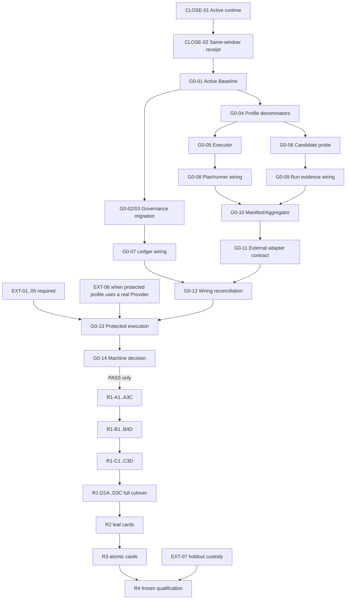

---
devseek_governance:
  generator: "devseek-doc-governance/v1"
  status: "active-baseline"
  path: "docs/top-agent-convergence-audit-20260711/14-未完成事项与后续整体迭代计划.md"
  source_group: "handoff"
  decision: "active"
  relationship: "primary"
  document_id: "PROCESS-14-GPT55-BACKLOG-BASELINE"
  document_type: "process"
  active_baselines: []
  machine_sources:
    active_selector: "docs/process/devseek-active-baseline-selector.json"
    legacy_inventory: "docs/process/devseek-legacy-doc-inventory.json"
  asserts_gate_pass: false
---

# DevSeek 未完成事项与 GPT-5.5 后续整体迭代计划

- 更新日期：2026-07-20
- 接管模型：下一窗口使用 GPT-5.5；模型变化不改变权限、门禁、资格或任务范围
- 盘点范围：本目录 `README`、核心 01～18 与派生启动入口 19，`docs/architecture` 01～18 的承接关系，以及 `docs/process` 机器账本、runner inventory、Gate 0 decision 和默认 Phase
- 当前结论：G0-A/B/C/D、一个本地非资格 runner 纵切、机器 decision contract、G0-01～12 机器治理迭代和 EXT-01～05 request packet 已实现；用户已明确暂停 formal Gate 0 外部资格，转入产品侧 R1 重构/意图识别优化；**机器 Gate 0=`NOT_PASSED`、claims=`[]`、qualification R1=`NOT_STARTED`**
- 本文责任：提供唯一 backlog、依赖、GPT-5.5 可领取的原子作业卡、验证证据和停止条件；不生成资格等级

## 1. 状态与机器真值

### 1.1 状态词只有四种

| 状态 | 含义 |
| --- | --- |
| `completed` | 明确限定的文档或工程切片已完成自己的承诺；不自动代表产品接线或资格 |
| `implemented-but-unqualified` | 实现、Schema、协议、接线或本地测试存在，但缺真实全入口、受保护证据或精确 claim |
| `pending` | 仓库内仍有可执行的实现、迁移、接线、测试或收口工作 |
| `blocked-by-external-authority` | 本地仓库不能诚实完成，必须由独立授权、受保护身份/设施、账号条款或 holdout 保管方提供 |

硬规则：deterministic、replay、Phase、同机签名、本地 CAS、exact-VSIX、安装成功、用户同窗口仿真或 Markdown 全绿，单独或组合都不能把 Gate 0 判为通过。只有受保护 Manifest 对七个 C0 节点产生当前有效的精确 tuple claims，机器 decision 才可能输出 `PASS`。

### 1.2 当前机器快照

动态源是 `docs/process/devseek-gate0-decision-report.json` 与 `docs/process/devseek-qualification-runner-inventory.json`；数字变化必须先由机器生成物和 checker 证明。

| 项目 | 当前值 |
| --- | --- |
| runner inventory | 19：本地非资格 runner 1、catalog metadata 10、production disabled 4、historical disabled 4 |
| restricted entrypoint scan | 262 files；known forbidden authority imports 0 |
| Gate 0 capabilities | 7 |
| implementation requirements | 7/7 satisfied；0 repository blockers |
| protected authority | G0-11 fail-closed external adapter 已接入；EXT-01～05 request packet 已生成但全为 `BLOCKED`；trust roots=0；external trust 结构性 false |
| external blockers | 6 |
| exact claims | 0 |
| local conformance | `PASSED`，仅本地协议源契约 |
| Gate 0 / R1 | `NOT_PASSED` / `NOT_STARTED` |
| product-side R1 track | 用户授权的非资格产品迭代；qualification effect 必须保持 `NONE` |

Repository blockers 自 G0-10 起归零，并经 G0-11 external adapter contract、G0-12 wiring reconciliation 与 EXT request packet 复核后保持 0；这只代表七个 C0 本地实现/接线门均有机器证据，且外部请求入口已机器化，不得把它解释为 Gate 0 通过。Gate 0 仍被 6 个外部 authority blocker 与 0/7 exact protected claims 阻塞，必须由独立授权、受保护身份/设施、retention/time/attestation 和精确 tuple claims 解决。

## 2. 文档包完成度

| 文档 | 文档责任 | 对应产品/资格仍未完成的边界 |
| --- | --- | --- |
| README、01～09 | `completed`：事实审计、三方对标、目标架构、路线、黄金旅程、治理和反证 | 单 Kernel 物理 cutover、各 capability 晋级和正式资格未完成 |
| 10 G0-A | `completed` / `implemented-but-unqualified` | 七节点已有 7 项 machine `wired`；外部 protected authority 与 exact claims 仍未闭合 |
| 11 G0-B | `completed` / `implemented-but-unqualified` | 本地 runner 已接 guard，但 production entries disabled，外部 trust/roles 不存在 |
| 12 G0-D | `completed` / `implemented-but-unqualified` | 统一 product diagnostics 已接线；永不自行签发 qualification claim |
| 13 G0-C | `completed` / `implemented-but-unqualified` | 本地 reader/retention/CAS 存在；在线 candidate probe、外部 WORM/time/attestation 缺失 |
| 14 | `completed`：本 backlog 与 GPT-5.5 编排 | 表中 pending/blocked 工作尚未完成 |
| 15 | `completed`：动态跨窗口接管 | 每次接管仍须现场复算，不能沿用聊天 hash |
| 16 | `completed`：原则、DoD、Skills 与 GPT-5.5 作业协议 | Skills 仍是 candidate design，不能写成产品能力 |
| 17 | `completed`：本轮 runner/decision/release/仿真边界报告 | 当前 active Bridge 与稳定安装包不同，同窗口仿真 `NOT_RUN`；Gate 0 仍未 PASS |
| 18 | `completed`：旧 architecture/ARCH-05 到当前 capability/atomic ID 的承接与缺口矩阵 | 人工执行权已切换；机器 Active Baseline/banner 仍待 G0-01～03 |
| 19 | `completed`：可复制的 GPT-5.5 只读启动、回执和条件授权文本 | 便利入口不发卡、不产生授权；动态事实仍须现场复算 |

## 3. GPT-5.5 原子任务总队列

### 3.1 当前唯一工作包：`CLOSE-INTEGRATION-GATE0-LOCAL`

当前工作包是 `pending`，不是 `PASS`：

| 身份层 | 2026-07-12 持久快照 | 判定 |
| --- | --- | --- |
| implementation / Phase source | `6d26aa6abe80d8bfd921a1ee176ece279487e9c3`；matching Phase run `2026-07-12T12-11-26-901Z` | PASS，仅对该 source |
| release artifact | `devseek-netai-latest.vsix`，SHA-256 `bc4359d444ab791c42aa4509e1bda03c37a3d546907eb6402cd2c37a59679cff`，build `20260712-t201401`，gitCommit `6d26aa6` | package/packaged Bridge 已 PASS |
| stable installed package | id `devseek-netai.devseek-netai`，version `1.0.0`，build/gitCommit 与 artifact 一致 | PASS |
| active user-window Bridge | 运行路径仍为 `...1.0.0-debug.20260711.t205615.g368cacf/bridge/server.js` | **MISMATCH** |
| same-user-window simulation | 用户将当前任务切换为“只更新文档后停止”，本轮未继续 UI 操作 | `NOT_RUN / AUTHORIZATION_NOT_CARRIED_FORWARD` |
| qualification | claims `[]`，Gate 0 `NOT_PASSED`，R1 `NOT_STARTED` | 不受上述本地集成结果提升 |

该工作包本身不可直接领取或一次结算；它按单一 authority 拆成两个顺序 leaf，不得修改产品源码或重做 runner/decision：

```text
task_id: CLOSE-01-ACTIVE-RUNTIME-IDENTITY
authority_mode: integration-release
semantic_authority: ActiveRuntimeIdentityReceipt

allowed_actions:
  read-only Git/Phase/VSIX/install/process identity checks;
  after fresh explicit user authorization, reload the existing user window without replacing its workspace,
  retire only the stale DevSeek debug Bridge;
  update approved handoff/receipt docs only.

no_touch:
  product source, runner/decision semantics, machine claims/ledger state,
  Provider prompt, external accounts/live/holdout, other extensions and all user project files.

focused_evidence:
  resolve every short SHA with `git rev-parse <sha>^{commit}` before comparison;
  Phase source contains both new gates;
  VSIX/package/installed/active runtime identity resolves to the intended artifact source.

stop_if:
  user has not freshly authorized a required reload/Bridge retirement;
  current workspace would be closed/replaced; active runtime identity is not observable;
  any source change or unrelated user file mutation is needed.

done_iff:
  active runtime no longer points to the stale debug package;
  exact installed artifact identity is observed in the existing user window;
  claims=[], Gate0=NOT_PASSED, R1=NOT_STARTED remain unchanged.

terminal_state: PASS | BLOCKED | FAIL
next_on_pass: CLOSE-02-SAME-WINDOW-SURFACE-RECEIPT
```

```text
task_id: CLOSE-02-SAME-WINDOW-SURFACE-RECEIPT
authority_mode: integration-release
prerequisites: CLOSE-01 PASS；当前窗口/指定 Provider action/隔离 probe path 的 fresh explicit authorization
semantic_authority: SameWindowDevelopmentReceipt
allowed_actions: 只在用户现有 DevSeek 窗口运行一个带 marker 的简单编程 probe；验证并清理唯一隔离路径
no_touch: product source、其他用户文件、claim/ledger、资格/live/holdout、隔离窗口替代路径
focused_evidence: active artifact + prompt marker/file/command/settlement/UI/cleanup 全部互相绑定
stop_if: 授权缺失/过期；active identity 漂移；changed paths 越界；Provider/窗口不可用
done_iff: same-window receipt PASS、cleanup PASS、qualification effect=NONE；或用户后来明确永久取消该门并留下 applicability
terminal_state: PASS | BLOCKED | FAIL
next_on_pass: G0-01-ACTIVE-BASELINE-SELECTOR
```

2026-07-14 运行证据结算修复回执：

- 最新同窗口 probe 日志 `.devseek/runs/20260714-022900830-28a9d4d1598e3a49.log` 显示隔离 probe 文件、JavaScript 语法命令和 UI 任务层已完成，但 durable run settlement 被 `evidence-degraded` 拒绝；历史记录显示 `未完成：运行证据结算失败` 是真实结算状态，不是单纯 UI 回显错误。
- 根因是 Bridge server 已收到 Provider 文本并记录 `bridge-server:provider.completed`，随后 VS Code client integrity checker 将内容判为 `RESPONSE_CORRUPTED:incomplete-tool-block` 并记录 `vscode-provider-client:provider.failed`；旧 evidence contract 错把这种本地完整性拒绝要求成 Bridge 也必须 `provider.failed`。
- 本轮修复限定在 `provider-run-evidence` owner：client completed 仍必须对应 Bridge completed；client failed 时接受 Bridge completed 或 failed，但仍要求同一 operation exactly-one requested 与 exactly-one terminal。qualification effect 仍为 `NONE`。
- 旧 CLOSE-02 日志不可事后升级为 `PASS`；下一 atomic leaf 仍是 `CLOSE-02-SAME-WINDOW-SURFACE-RECEIPT`，必须用新 release artifact 在用户现有 DevSeek 窗口重新执行 marker probe、验证 cleanup 与 durable settlement。`claims=[]`、Gate 0=`NOT_PASSED`、R1=`NOT_STARTED` 不变。

2026-07-14 CLOSE-02 新产物复测与展示修正回执：

- 新 release artifact 在用户当前 DevSeek 窗口重新执行 `CLOSE02-20260713-manual-probe` 后，日志 `.devseek/runs/20260714-025316449-de1aff1ac07c8393.log` 可重放为 `issues=[]`，durable run settlement、UI 完成态与重启后的历史恢复均显示 `completed`；产品运行层和历史结算层的 CLOSE-02 阻断已解除。
- 用户截图暴露的后续展示缺陷不改变 same-window 事实：运行中进度标题被过早截断、展开态仍使用灰色/低不透明度、历史缺少类似 Codex 的“做了什么/结论”摘要。当前展示修正限定在 `AgentDisplayPresenter`、WebView activity CSS 和 `agentic-history` 投影：普通进度焦点不再 56 字预截断，展开态使用正常前景色并允许换行，缺少模型 summary 时由任务、文件和 QualityGate 证据合成结果摘要。
- Formal CLOSE-02 仍必须诚实记录 cleanup/applicability：若隔离 probe 残留由用户明确保留或另行授权清理，需在接管回执中绑定；qualification effect 仍为 `NONE`，`claims=[]`、Gate 0=`NOT_PASSED`、R1=`NOT_STARTED` 不变。完成或明确取消该门后，下一 leaf 才是 `G0-01-ACTIVE-BASELINE-SELECTOR`。

领取顺序仍按可复算事实决定：若 active runtime 身份再次 mismatch，先回 `CLOSE-01-ACTIVE-RUNTIME-IDENTITY`；若 active runtime 匹配当前 release artifact，当前唯一可领取 leaf 是 `CLOSE-02-SAME-WINDOW-SURFACE-RECEIPT`。任何需要用户窗口变更或 Provider action 的动作未获 fresh authorization 时只能 `BLOCKED`。两个 leaf 都 `PASS`（或用户明确取消相应门）后才能开始 G0-01。

2026-07-14 G0-01 Active Baseline selector 回执：

- 新增机器源 `docs/process/devseek-active-baseline-selector.json`、Schema、checker 和 generated view `docs/process/generated/devseek-active-baseline-selector.md`；selector SHA-256=`869219726bd2b5e23a4b03ec7d9b6ea58fb02efb4903ca6672de2bbac7cb0332`，`asserts_gate_pass=false`。
- 当前唯一 active baselines：requirement=`docs/requirements/02-顶级编程智能体需求基线.md`；architecture=`docs/architecture/01-顶级编程智能体总体架构设计.md`；process=`docs/top-agent-convergence-audit-20260711/14-未完成事项与后续整体迭代计划.md`。审计包 README/03/04/15/16/18 与 Gate 0 decision report 是 supporting refs，不成为第二 active owner。
- Checker 覆盖 duplicate active、unknown status、missing path、missing type、duplicate id、supersedes cycle 与 generated view drift；Phase 0-12 新增 `active-baseline-selector-governance` gate。新增脚本使 restricted entrypoint scan 从 249 变为 250，forbidden authority imports 仍为 0。
- terminal_state=`PASS`；qualification effect=`NONE`；`claims=[]`、Gate 0=`NOT_PASSED`、R1=`NOT_STARTED` 不变。下一 atomic ID=`G0-02-LEGACY-DOC-INVENTORY`。

2026-07-14 G0-02 Legacy Document Inventory 回执：

- 新增机器源 `docs/process/devseek-legacy-doc-inventory.json`、Schema、checker 和 generated view `docs/process/generated/devseek-legacy-doc-inventory.md`；inventory SHA-256=`91bece15aaa5d623fc7a08c87f9004c45be67c5cd10c196e09ca4d0c08beb339`，`asserts_gate_pass=false`。
- G0-01 active baselines 保持三份且排除出 legacy inventory：requirement=`docs/requirements/02-顶级编程智能体需求基线.md`；architecture=`docs/architecture/01-顶级编程智能体总体架构设计.md`；process=`docs/top-agent-convergence-audit-20260711/14-未完成事项与后续整体迭代计划.md`。
- 受治理 Markdown 总数=`52`，active baseline 排除=`3`，legacy inventory 覆盖=`49/49`，缺失=`0`，越界=`0`，未裁决=`0`；decision counts：keep=`43`、supersede=`2`、not-applicable=`4`、revise/archive=`0`；G0-01 Markdown supporting refs 反向覆盖=`6/6`。
- Checker 覆盖 missing doc、missing path、duplicate decision、unknown decision、active baseline listed、supporting ref missing reverse coverage 与 generated view drift；Phase 0-12 新增 `legacy-doc-inventory-governance` gate。新增脚本使 restricted entrypoint scan 从 250 变为 251，forbidden authority imports 仍为 0。
- terminal_state=`PASS`；qualification effect=`NONE`；`claims=[]`、Gate 0=`NOT_PASSED`、R1=`NOT_STARTED` 不变。下一 atomic ID=`G0-03-FRONTMATTER-BANNER-GENERATION`。

2026-07-14 G0-03 Frontmatter/Banner Generation 回执：

- 新增文档治理生成器 `scripts/devseek-doc-governance-check.mjs` 与库 `scripts/lib/devseek-doc-governance.mjs`，机器输入仅为 `docs/process/devseek-active-baseline-selector.json` 和 `docs/process/devseek-legacy-doc-inventory.json`；generated status view=`docs/process/generated/devseek-doc-governance-status.md`。
- 受管文档 front matter=`52/52`，legacy/reference banner=`49/49`，README status=`1/1`；active baseline=`3` 均无 legacy banner，historical/superseded/reference 均链接到当前 active authority。
- Focused oracle 覆盖 generated view stale、active baseline 误加 legacy banner、legacy 文档缺 banner、README/status 漂移与正文被生成器覆盖；第二次 `npm run generate:doc-governance` 未产生额外 diff。
- Phase 0-12 新增 `doc-governance-generation` gate；qualification effect=`NONE`，该状态视图只陈述文档治理事实，不声明 Gate 0 通过或任何产品资格。
- terminal_state=`PASS`；`claims=[]`、Gate 0=`NOT_PASSED`、R1=`NOT_STARTED` 不变。下一 atomic ID=`G0-04-PROFILE-DENOMINATOR-REGISTRY`。

2026-07-14 G0-04 Profile Denominator Registry 回执：

- 新增机器源 `docs/process/devseek-profile-denominator-registry.json`、Schema、checker 和 generated view `docs/process/generated/devseek-profile-denominator-registry.md`；registry SHA-256=`da1c555ce3952b59c9f5d2100c1971771b0310547821f31dbb3be755cd4789cb`。
- 七个 C0 denominator 全部从当前 capability ledger 与 `R1-MINIMAL-SEAM/v1` 的 `gate0` group 复算：capabilities=`7`、slots=`35`、attempts=`70`、catalog metadata executions=`0`、qualification claims=`0`。
- Focused oracle 覆盖 missing denominator、duplicate slot、attempt identity drift、profile applicability lowering、wildcard/default claim、schema claim promotion 与 generated view drift；runtime validator 同步检查 profile/corpus/catalog/slot/applicability/hash 守恒。
- Phase 0-12 新增 `profile-denominator-registry-governance` gate；qualification effect=`NONE`，该 registry 只冻结未来 profile executor 的分母，不声明执行结果、Gate 0 通过或任何资格。
- terminal_state=`PASS`；`claims=[]`、Gate 0=`NOT_PASSED`、R1=`NOT_STARTED` 不变。下一 atomic ID=`G0-05-PROFILE-EXECUTOR-CONFORMANCE`（`G0-06-CURRENT-CANDIDATE-IDENTITY-PROBE` 仍为 G0-04 后的并列后继，但不自动进入）。

2026-07-14 G0-05 Profile Executor Contract Conformance 回执：

- 新增机器源 `docs/process/devseek-profile-executor-contracts.json`、Schema、checker 和 generated view `docs/process/generated/devseek-profile-executor-contracts.md`；contract registry SHA-256=`7ead83ffd8a8baf0f77ab4cd62ac05265dd7296a0e0d3a7c4c0a2ff3e4c11250`。
- 五类 G0-04 slot semantics 全部绑定唯一 executor contract 与独立 oracle：slot semantics=`5`、denominator slots=`35`、denominator attempts=`70`、executor coverage=`100%`、oracle contracts=`5`、zero-action attack oracles=`25`、execution results=`0`、qualification claims=`0`。
- Executor contract 全部经唯一 runner root `scripts/lib/devseek-qualification-runner.mjs#createQualificationRunner`，production/product entry 仍为 qualification disabled；catalog metadata 仍不计 execution，runner inventory 维持 local runner=`1`、catalog metadata executor=`10`、production disabled=`4`、historical disabled=`4`、forbidden authority imports=`0`。
- Focused oracle 覆盖 missing semantic、重复通用 contract/oracle、registry source drift、slot/attempt identity replacement、缺 zero-action oracle、schema claim promotion、generated view drift；runner path 同步覆盖空请求、替换 signed case、错 slot/attempt、缺 authorization receipt、未授权 external action 均在 dispatch 前失败且 external actions=`0`。
- Phase 0-12 新增 `profile-executor-contract-conformance` gate；qualification effect=`NONE`，该 registry 只证明本地 executor contract conformance，不声明 Gate 0 通过、protected qualification 或任何产品资格。
- terminal_state=`PASS`；`claims=[]`、Gate 0=`NOT_PASSED`、R1=`NOT_STARTED` 不变。下一 atomic ID=`G0-06-CURRENT-CANDIDATE-IDENTITY-PROBE`（或按第 3.2 节依赖进入后续 C0 wiring；不得自动进入 R1）。

2026-07-15 G0-06 Current Candidate Identity Probe 回执：

- 新增机器源 `docs/process/devseek-current-candidate-identity.json`、Schema、checker 和 generated view `docs/process/generated/devseek-current-candidate-identity.md`；identity probe SHA-256=`c8d4288f2c0b88474da6e4e19b8ab6e2a350b81976759526b100b5846ca8ff9e`。
- 当前 candidate source 由 VSIX 内 `devseekBuild.gitCommit=b4adc42` 解析为 full commit `b4adc42186c93b7c35e31169ef7652b9606b770f`；primary VSIX 与 package-copy VSIX SHA-256 均为 `85ebfcc93b313c25a80a25223a07687a1624ef9f110b356b32e333e2a77ebb6a`，build=`20260714-t161831`。
- Stable install `/home/ff/.vscode/extensions/devseek-netai.devseek-netai-1.0.0` 与 artifact package identity/Bridge SHA-256 exact match；active runtime expected Bridge path 为 `/home/ff/.vscode/extensions/devseek-netai.devseek-netai-1.0.0/bridge/server.js`，与 stable install 分开记录。
- Runtime probe 只观察 `pid`、`executable_path`、`script_path`；当前 live summary 为 stable runtime=`1`、isolated controlled VSIX runtime=`1`、stale debug runtime=`0`、unknown Bridge runtime=`0`、unreadable runtime identity=`0`。不读取 env/token/full commandline，不执行 Provider/live/holdout，不写产品状态。
- Focused oracle 覆盖 caller supplied/forged identity、source drift、缺包内 gitCommit、install/runtime field mismatch、旧 debug Bridge path、unreadable runtime identity、isolated harness 与 generated view drift；schema/runtime 双向阻止 claim promotion 和 Gate pass。
- Phase 0-12 新增 `current-candidate-identity-probe` gate；最新 runId=`2026-07-15T02-09-46-943Z`，findings=`[]`；qualification effect=`NONE`，该 probe 只证明本地 source/package/install/runtime 身份绑定，不声明 Gate 0 通过、protected qualification 或任何产品资格。
- terminal_state=`PASS`；`claims=[]`、Gate 0=`NOT_PASSED`、R1=`NOT_STARTED` 不变。下一 atomic ID=`G0-07-C0-LEDGER-WIRING`（或按第 3.2 节依赖进入后续 C0 wiring；不得自动进入 R1）。

2026-07-15 G0-07 C0 Ledger Wiring 回执：

- 新增机器源 `docs/process/devseek-c0-ledger-wiring.json`、Schema、checker 和 generated view `docs/process/generated/devseek-c0-ledger-wiring.md`；wiring SHA-256=`ab377809b0415c0fcacceb87a253c747c62e2ede8b9f377b59d799815428efa9`。
- `C0-CAPABILITY-LEDGER-SCHEMA` 只有一个 ledger source owner 和一个 schema owner；该 capability 在新增 wiring source/schema/checker/test/generated view 与 Phase gate 后由 `implemented` 升为 `wired`。Capability ledger SHA-256 更新为 `ea5b7028e74c982f9c2f66cc25545d10e5554dd7487bcd47d2d6f93781f7b468`。
- Governed capability-state consumers coverage=`4/4`：`verify:capability-ledger`、`verify:c0-ledger-wiring`、`verify:profile-denominator-registry`、`verify:gate0-decision` 均通过 package script、Phase gate 与直接 ledger reader 绑定；bypass=`0`，未发现第二份 capability state/ledger 文件。
- 级联重生成 profile denominator registry SHA-256=`0525ba5a917f4366830b15887a1697c15e45f8af0cff79928f082010dd1049a5`、profile executor contract registry SHA-256=`419c2ff0cf64389ca784bac9cdc0df99216ccbf90e65733d653f2fa6e2616aa0` 与 Gate 0 decision report。
- Gate 0 machine decision 仍为 `NOT_PASSED`：local conformance=`PASSED`、implementation requirements satisfied=`3/7`、exact claim requirements satisfied=`0/7`、repository pending blockers=`4`、external authority blockers=`6`、claims=`[]`。本轮只关闭真实可复算的 ledger wiring repository blocker，不触碰 protected qualification。
- Focused oracle 覆盖 owner 未 wired、第二 ledger owner、缺 wiring evidence、consumer bypass、缺 Phase gate、手工 capability-state 文件、schema claim promotion/Gate pass 与 generated view drift；文档治理状态仍不能反向提升 capability state。
- Phase 0-12 新增 `c0-ledger-wiring-conformance` gate；最新 runId=`2026-07-15T02-30-09-153Z`，findings=`[]`；qualification effect=`NONE`，该 wiring 只证明本地 ledger authority/reachability，不声明 Gate 0 通过、protected qualification 或任何产品资格。
- terminal_state=`PASS`；`claims=[]`、Gate 0=`NOT_PASSED`、R1=`NOT_STARTED` 不变。下一 atomic ID=`G0-08-C0-PREREGISTRATION-WIRING`（或按第 3.2 节依赖进入后续 C0 wiring；不得自动进入 R1）。

2026-07-15 G0-08 C0 Preregistration Wiring 回执：

- 新增机器源 `docs/process/devseek-c0-preregistration-wiring.json`、Schema、checker 和 generated view `docs/process/generated/devseek-c0-preregistration-wiring.md`；wiring SHA-256=`4da4dd74febf5018c733f3c60ec46f54b8252458a4faa4df773a5caee5e00294`。
- `C0-PREREGISTRATION-PLAN` 在已有 plan/event/receipt protocol 基础上新增 runner composition、production entrypoint inventory、preregistration wiring checker/test/generated view 与 Phase gate 证据后由 `implemented` 升为 `wired`。Capability ledger SHA-256 更新为 `d687e1cc63eb835a7260ccacf8e51157812e343b70a1d0e0979329b9c0330ae3`。
- Production declaration entry coverage=`4/4`：`production/cli-exec`、`production/vscode-chat`、`production/bridge-chat`、`production/bridge-preattach` 均保持 `qualification_enabled=false`、`composition_root=null`、`status=qualification-disabled`，不得把普通产品任务误当 qualification。
- Runner chain coverage=`7/7`：真实 profile executor 必经 plan registration、session preflight slot、session completion、coverage slot、external-action authorization、guarded receipt dispatch、independent G0-C reader verification；runner root cardinality=`1`，direct dispatch bypass=`0`。
- Zero-dispatch receipt oracle coverage=`4/4`：missing receipt、expired receipt、replay receipt、clock rollback 均证明 external actions=`0`；TOFU registration 与 durable registration after dispatch 均保持 fail closed。
- 级联重生成 C0 ledger wiring SHA-256=`e83caee46e0777e625c451f1e4ec32938a49f203018e3cb22105efb89da65c3e`、profile denominator registry SHA-256=`6cfd3618f03dd5f9b00eedfeb24a07b515cd27833d726593f88de88f892b5448`、profile executor contract registry SHA-256=`0f6c0595435074348555a2c75a040358d7a74a5a3d285ba292d5088c1ade8581` 与 Gate 0 decision report SHA-256=`3f0c702e5ebbc5740d86f4e6a60e2763bd31c832c2b06227ef870d9242eca5bf`。
- Gate 0 machine decision 仍为 `NOT_PASSED`：local conformance=`PASSED`、implementation requirements satisfied=`5/7`、exact claim requirements satisfied=`0/7`、repository pending blockers=`2`（`C0-QUALIFICATION-AGGREGATOR`、`C0-QUALIFICATION-EVIDENCE-MANIFEST`）、external authority blockers=`6`、claims=`[]`。本轮只关闭真实可复算的 preregistration wiring repository blocker，不触碰 protected qualification。
- Focused oracle 覆盖 owner 未 wired/缺证据、production entry 被误启用 qualification、runner 直接 dispatch、缺 Phase gate、缺 package script、missing/expired/replay/clock rollback receipt oracle drift、schema claim promotion/Gate pass 与 generated view drift。
- Phase 0-12 新增 `c0-preregistration-wiring-conformance` gate；最新 runId=`2026-07-15T02-50-10-039Z`，findings=`[]`；qualification effect=`NONE`，该 wiring 只证明本地 preregistration/receipt dispatch 闭环，不声明 Gate 0 通过、protected qualification 或任何产品资格。
- terminal_state=`PASS`；`claims=[]`、Gate 0=`NOT_PASSED`、R1=`NOT_STARTED` 不变。下一 atomic ID=`G0-09-C0-RUN-EVIDENCE-WIRING`（或按第 3.2 节依赖进入后续 C0 wiring；不得自动进入 R1）。

2026-07-15 G0-09 C0 Run Evidence Wiring 回执：

- 新增机器源 `docs/process/devseek-c0-run-evidence-wiring.json`、Schema、checker 和 generated view `docs/process/generated/devseek-c0-run-evidence-wiring.md`；新增 `docs/process/devseek-run-evidence-correlation.schema.json`，把 product Run Evidence 与 qualification attempt 绑定为本地非资格 correlation；wiring SHA-256=`02072a27f4f229a3cde122ffddd55a176c9ac75d135b08e9aaa5d3b6f694dd2a`。
- `C0-RUN-EVIDENCE-LEDGER` 在已有 G0-D event/snapshot/anchor 基础上新增 manifest reader exact-correlation、owner component coverage、failure oracle 与 Phase gate 证据后由 `implemented` 升为 `wired`。Capability ledger SHA-256 更新为 `0a61fb30dddee3bb26fe98a68bd244faf4810395052a3d5ecb8811231c4689a3`。
- Correlation exact binding 覆盖 qualification plan、candidate identity、attempt correlation、RunObserved event/payload、product run id、operation id/event、snapshot、expected anchor、oracle event、terminal event 和原始 attempt outcome；`qualification_effect=NONE`、`claims_permitted=false`、`asserts_gate_pass=false`。
- Manifest auxiliary reader 只把 run evidence 作为辅助本地证据输出，不生成 verdict；unsealed evidence、错 candidate、错 attempt、错 operation、错 anchor、错 scope 与隐藏原始 failure 均 fail closed，失败 attempt 不可被后续 pass 覆盖。
- 级联重生成 C0 ledger wiring SHA-256=`ae8229c563e7111aae538d43aaff5141137a8a9c0b1e1088ce5d6b11ee9e049c`、C0 preregistration wiring SHA-256=`70200859237284a55b60ca2e311086eba1f29b5533968b54cc434b7953ffc8a9`、profile denominator registry SHA-256=`22c8dd60eb617f40ca522e5c72b730973d4584ef6360dca9d74af33bb5f3ab44`、profile executor contract registry SHA-256=`f70a5a30c6dbcf0b6a62d05fe24585b8d0c089129a1c270ef7f404b3880ede37` 与 Gate 0 decision report SHA-256=`a9256e0792245e340795dc0298569007c5f53b0ffb89d8c0ca218639e9affe81`。
- Gate 0 machine decision 仍为 `NOT_PASSED`：local conformance=`PASSED`、implementation requirements satisfied=`5/7`、exact claim requirements satisfied=`0/7`、repository pending blockers=`2`（`C0-QUALIFICATION-AGGREGATOR`、`C0-QUALIFICATION-EVIDENCE-MANIFEST`）、external authority blockers=`6`、claims=`[]`。本轮只关闭真实可复算的 run evidence wiring repository blocker，不触碰 protected qualification。
- Focused oracle 覆盖 owner 未 wired/缺证据、缺 package script、缺 Phase gate、缺 binding guard、缺 failure oracle、schema claim promotion/Gate pass/local verdict 与 generated view drift；C0 ledger consumer coverage 随新增 run evidence wiring checker 更新为 `5/5`，bypass=`0`。
- 验证通过：`npm run verify:qualification-evidence-manifest`、`npm run verify:c0-run-evidence-wiring`、`npm run verify:c0-ledger-wiring`、`npm run verify:c0-preregistration-wiring`、`npm run verify:capability-ledger`、`npm run verify:profile-denominator-registry`、`npm run verify:profile-executor-contracts`、`npm run verify:gate0-decision`、`npm run verify:qualification-runner`、`npm run verify:run-evidence-contract`、`npm run verify:phase0-12`。
- Phase 0-12 新增 `c0-run-evidence-wiring-conformance` gate；最新 runId=`2026-07-15T03-27-01-712Z`，findings=`[]`；qualification effect=`NONE`，该 wiring 只证明本地 run evidence correlation/reachability，不声明 Gate 0 通过、protected qualification 或任何产品资格。
- terminal_state=`PASS`；`claims=[]`、Gate 0=`NOT_PASSED`、R1=`NOT_STARTED` 不变。下一 atomic ID=`G0-10-C0-MANIFEST-AGGREGATOR-WIRING`（或按第 3.2 节依赖进入后续 C0 wiring；不得自动进入 R1）。

2026-07-15 G0-10 C0 Manifest Aggregator Wiring 回执：

- 新增机器源 `docs/process/devseek-c0-manifest-aggregator-wiring.json`、Schema、checker 和 generated view `docs/process/generated/devseek-c0-manifest-aggregator-wiring.md`；wiring SHA-256=`f45d61da17c63731f05767fa3a0a200287268020d4ea9762499b94038772989d`。
- `C0-QUALIFICATION-AGGREGATOR` 与 `C0-QUALIFICATION-EVIDENCE-MANIFEST` 在已有 G0-C manifest reader、manifest policy、denominator/profile、preregistration、run evidence correlation 和 retention/provenance oracle 基础上新增独立 aggregator wiring source/schema/checker/test/generated view 与 Phase gate 后由 `implemented` 升为 `wired`。Capability ledger SHA-256 更新为 `0b39d420a63bd86a12cd2f92ad2a8744fc9cbd6bfee69297b54d71112828e6a0`。
- Aggregator 独立复算覆盖 denominator、attempt streams、failure/veto、retention anchor、identity/provenance、exact dependency tuple、local policy cannot claim 和 run evidence auxiliary-only；writer summary、自签 self-hash、`.some()` 任一 profile 与本地 fixture claim promotion 均不可产生资格效果。
- 级联重生成 C0 ledger wiring SHA-256=`bd8f94b7eba4c39ace5e78d086efcc366a3cf9d44a56c4fc8a2896c8c55e4fe2`、C0 preregistration wiring SHA-256=`12e0ef8d00498403ab8d8598e6547289546ec8ea6006c26dc537b19ee961bf86`、C0 run evidence wiring SHA-256=`3a8f54ccf9bb91a2f500d880c7c45ce327a742b07c91b327054158d35c61f967`、profile denominator registry SHA-256=`34476c452bf160fe783539fb3768d991fea1715ba86bd19ebb99c69c2d31b44c`、profile executor contract registry SHA-256=`65a00b393a702c1c34585c7f89d111f849454d58423c89a375bb2b3c18120cb2` 与 Gate 0 decision report SHA-256=`657aaf41a5c7a795c4f76e621ea9df8aec21225c496d29f2e28503aa4308950e`。
- Gate 0 machine decision 仍为 `NOT_PASSED`：local conformance=`PASSED`、implementation requirements satisfied=`7/7`、exact claim requirements satisfied=`0/7`、repository pending blockers=`0`、external authority blockers=`6`、claims=`[]`。本轮只关闭真实可复算的 aggregator/manifest repository blockers，不触碰 protected qualification。
- Focused oracle 覆盖 owner 未 wired/缺证据、缺 aggregation guard、缺 failure oracle、缺 package script、缺 Phase gate、schema claim promotion/Gate pass/local protected claim 与 generated view drift；C0 ledger consumer coverage 随新增 manifest aggregator checker 更新为 `6/6`，bypass=`0`。
- 验证通过：`npm run verify:c0-manifest-aggregator-wiring`、`npm run verify:c0-ledger-wiring`、`npm run verify:c0-preregistration-wiring`、`npm run verify:c0-run-evidence-wiring`、`npm run verify:capability-ledger`、`npm run verify:profile-denominator-registry`、`npm run verify:profile-executor-contracts`、`npm run verify:gate0-decision`、`npm run verify:qualification-evidence-manifest`、`npm run verify:qualification-runner`、`npm run verify:run-evidence-contract`、`npm run verify:phase0-12`。
- Phase 0-12 新增 `c0-manifest-aggregator-wiring-conformance` gate；最新 runId=`2026-07-15T03-48-27-167Z`，findings=`[]`；qualification effect=`NONE`，该 wiring 只证明本地 manifest aggregation/reachability，不声明 Gate 0 通过、protected qualification 或任何产品资格。
- terminal_state=`PASS`；`claims=[]`、Gate 0=`NOT_PASSED`、R1=`NOT_STARTED` 不变。下一 atomic ID=`G0-11-EXTERNAL-AUTHORITY-ADAPTER-CONTRACT`（或按第 3.2 节依赖进入后续 C0 wiring；不得自动进入 R1）。

2026-07-15 G0-11 External Authority Adapter Contract 回执：

- 新增机器源 `docs/process/devseek-external-authority-adapter.json`、adapter/attestation Schema、checker、实现库、测试和 generated view `docs/process/generated/devseek-external-authority-adapter.md`；adapter SHA-256=`f00a145f0dd3907db727a3e02c7dd2f7c99e58a49bc461401eea81dddb61c4f9`。
- Adapter 当前 `source_status=unconfigured`、`trust_roots=0`、`qualification_effect=NONE`、`claims_permitted=false`、`asserts_gate_pass=false`；Gate 0 independent authority status=`UNAVAILABLE_NO_EXTERNAL_TRUST_ROOT`，不得由本地 object/boolean/self-hash/fixture 升级。
- Gate 0 decision 现在把 `external_authority_adapter` 作为显式 source，decision SHA-256=`2e8fdba1f03c15c718584ac070a6af67a274f0a4cabe04ad345624bea6a1e6bb`；machine decision 仍为 `NOT_PASSED`：local conformance=`PASSED`、implementation requirements satisfied=`7/7`、exact claim requirements satisfied=`0/7`、repository pending blockers=`0`、external authority blockers=`6`、claims=`[]`。
- C0 ledger governed consumer coverage 随新增 adapter checker 更新为 `7/7`；C0 ledger wiring SHA-256=`ac0d1c6cd6e13a6ac282e80d7fed245dcdca90e88643af03a076bbed82804af8`，capability ledger SHA-256=`08bb2cc53b13c32807373db73cb80cda97a745cc4941aa919bbac4e76f5c45d5`。
- 级联重生成 C0 preregistration wiring SHA-256=`f86b6ff4cda8d5b05dd9a2723cd1ce058004160d59c165a62448de1d2ae3cf4b`、C0 run evidence wiring SHA-256=`26f7b161521218151b3ef4828d1b15e2928893d0250aca91670384ca55abd52d`、C0 manifest aggregator wiring SHA-256=`76ca150880a274eda2f88537a64acf901d892e3027dbddb631a2e4282e1e8536`、profile denominator registry SHA-256=`76fef8d4b29f7e045206f4f42222402c7529576fe804e2d75d6b9cefa9e3781c` 与 profile executor contract registry SHA-256=`9ac6d8185668a82862012026f632a743bf8136eb67f8fc7ac2e30cccf0733777`。
- Focused oracle 覆盖 boolean pass、ordinary object、revoked trust root、role/key reuse、clock rollback、manifest/provenance mismatch、本地 trust root、valid local crypto without audited registry digest、缺 package script/Phase gate 与 Gate0 blocker status drift；无 secret、无 Provider/账号/网络/live/holdout、无真实外部基础设施。
- 验证通过：`npm run verify:external-authority-adapter`、`npm run verify:gate0-decision`、`npm run verify:capability-ledger`、`npm run verify:c0-ledger-wiring`、`npm run verify:c0-run-evidence-wiring`、`npm run verify:c0-manifest-aggregator-wiring`、`npm run verify:c0-preregistration-wiring`、`npm run verify:profile-denominator-registry`、`npm run verify:profile-executor-contracts`、`npm run verify:qualification-evidence-manifest`、`npm run verify:qualification-runner`、`npm run verify:run-evidence-contract`、`npm run verify:doc-governance`、`npm run verify:phase0-12`。
- Phase 0-12 新增/覆盖 `external-authority-adapter-contract` gate；最新 runId=`2026-07-15T04-14-24-340Z`，findings=`[]`；qualification effect=`NONE`，该 adapter contract 只证明本地外部 authority import port fail-closed，不声明外部 authority 已存在、Gate 0 通过、protected qualification 或任何产品资格。
- terminal_state=`PASS`；qualification effect=`NONE`；`claims=[]`、Gate 0=`NOT_PASSED`、R1=`NOT_STARTED` 不变。下一 atomic ID=`G0-12-C0-WIRING-RECONCILIATION`；不得自动进入 protected profile execution 或 R1。

2026-07-15 G0-12 C0 Wiring Reconciliation 回执：

- 新增机器源 `docs/process/devseek-c0-wiring-reconciliation.json`、Schema、checker、实现库、测试和 generated view `docs/process/generated/devseek-c0-wiring-reconciliation.md`；当前 reconciliation SHA-256=`039d7f2b9e89bc97332a9716bbfe7d9aedaf30563e09d84195f85cfd4b131558`。
- Reconciliation 消费 6 个本地机器报告：C0 ledger wiring、C0 preregistration wiring、C0 run evidence wiring、C0 manifest aggregator wiring、external authority adapter 与 Gate0 decision；report hashes matched=`6/6`、generated views current=`5/5`、package scripts covered=`7/7`、Phase gates covered=`7/7`、bypasses=`0`。
- C0 ledger governed consumer coverage 随 G0-12 checker 更新为 `8/8`；当前 C0 ledger wiring SHA-256=`62158845e63b8acc239b8064a5456c14d4f8d0d2d3a764b5b0cdaca5db1aba34`，capability ledger SHA-256=`08bb2cc53b13c32807373db73cb80cda97a745cc4941aa919bbac4e76f5c45d5`。
- 级联重生成 C0 preregistration wiring SHA-256=`d20c993ca7a16f8ae459db7642d10d167b74a5eb3b79cc18d5e8203aa4acce57`、C0 run evidence wiring SHA-256=`5b57af1f7a778faea62be627bd67dcd9a3ae5219df92d86d7ab3cc46621b5b16`、C0 manifest aggregator wiring SHA-256=`674b4f92534180d0f07bb0425af48e475e88e1e80e624d3d43ec5c3f083378df`、external authority adapter SHA-256=`b9b10c2a47183fdef2a2dcedb13523149f0f6b0acbf4ec9bc2a2539d8c662801`、Gate0 decision SHA-256=`7bb96380cc6f55c8b5a1b3cc00f166741ef770f9cbd719fa266f851421ab3dc1`。
- Gate 0 machine decision 仍为 `NOT_PASSED`：local conformance=`PASSED`、implementation requirements satisfied=`7/7`、exact claim requirements satisfied=`0/7`、repository pending blockers=`0`、external authority blockers=`6`、claims=`[]`。G0-12 只证明本地 C0 wiring/decision 全量收敛，不触碰 protected qualification。
- Focused oracle 覆盖 reconciled report hash drift、缺 package script、缺 Phase gate、generated view stale、Gate0 source binding mismatch、本地 claim 注入、external blocker 被本地降低、Gate pass 伪造与 bypass guard drift。
- 验证通过：`npm run verify:c0-wiring-reconciliation`、`npm run verify:c0-ledger-wiring`、`npm run verify:external-authority-adapter`、`npm run verify:gate0-decision`、`npm run verify:capability-ledger`、`npm run verify:c0-preregistration-wiring`、`npm run verify:c0-run-evidence-wiring`、`npm run verify:c0-manifest-aggregator-wiring`、`npm run verify:profile-denominator-registry`、`npm run verify:profile-executor-contracts`、`npm run verify:qualification-evidence-manifest`、`npm run verify:qualification-runner`、`npm run verify:run-evidence-contract`、`npm run verify:doc-governance`、`npm run verify:phase0-12`。
- Phase 0-12 覆盖 `c0-wiring-reconciliation-conformance` gate；最新 runId=`2026-07-15T05-30-36-190Z`，findings=`[]`；qualification effect=`NONE`，该 reconciliation 只证明本地 C0 wiring/decision 全量收敛，不声明外部 authority 已存在、Gate 0 通过、protected qualification 或任何产品资格。
- terminal_state=`PASS`；qualification effect=`NONE`；`claims=[]`、Gate 0=`NOT_PASSED`、R1=`NOT_STARTED` 不变。下一 atomic ID=`G0-13-PROTECTED-PROFILE-EXECUTION`，但当前缺 EXT-01～05 外部 authority，仓库本地不可 claim。

2026-07-15 EXT-REQUEST-GATE0-PREAUTH 回执：

- 新增机器源 `docs/process/devseek-external-authority-requests.json`、Schema、checker、实现库、测试和 generated view `docs/process/generated/devseek-external-authority-requests.md`；request set SHA-256=`557a9ebabe83790eef8ff3b65afc0afb3c33e5f38d119a3d443c2e5e751f2190`。
- Request packet 覆盖 G0-13 硬前置 `EXT-01-SOURCE-REGISTRY-BINDING`、`EXT-02-INDEPENDENT-ATTESTATION`、`EXT-03-PROTECTED-PROFILE-POLICY`、`EXT-04-ROLES-KEYS` 与 `EXT-05-RETENTION-TIME`；5/5 request 当前 `terminal_state=BLOCKED`，approved requests=`0`。
- 每个 request 绑定 `request_id`、`atomic_id`、独立裁决 owner、requested decision/scope、required input digests、artifact schema/signature purpose、trusted root/registry reference、role separation/conflict rules、validity/revocation slots、repository import port/fail-closed verifier 与 secret non-observation；本地仓库 `repository_may_decide=false`。
- 绑定输入 digest：Gate0 decision、external authority adapter、C0 wiring reconciliation、capability ledger source、qualification profile source 与 evidence policy source；无 secret、无 Provider/账号/网络/live/holdout、无真实外部基础设施。
- Focused oracle 覆盖 local approval、claim promotion、Gate pass assertion、缺 request、external blocker 被降低、local trust fallback、缺 package script、缺 Phase gate 与 generated view drift。
- 验证通过：`npm run verify:external-authority-requests`、`npm run verify:external-authority-adapter`、`npm run verify:gate0-decision`、`npm run verify:c0-wiring-reconciliation`、`npm run verify:c0-ledger-wiring`、`npm run verify:c0-preregistration-wiring`、`npm run verify:c0-run-evidence-wiring`、`npm run verify:c0-manifest-aggregator-wiring`、`npm run verify:profile-denominator-registry`、`npm run verify:profile-executor-contracts`、`npm run verify:qualification-evidence-manifest`、`npm run verify:qualification-runner`、`npm run verify:capability-ledger`、`npm run verify:run-evidence-contract`、`npm run verify:doc-governance`、`npm run verify:phase0-12`。
- Phase 0-12 新增 `external-authority-request-packets` gate；最新 runId=`2026-07-15T05-30-36-190Z`，findings=`[]`；qualification effect=`NONE`，该 request packet 只证明 EXT-01～05 申请材料和导入口已机器化，不声明任何外部 authority 已批准、Gate 0 通过、protected qualification 或任何产品资格。
- terminal_state=`PASS`；qualification effect=`NONE`；`claims=[]`、Gate 0=`NOT_PASSED`、R1=`NOT_STARTED` 不变。下一 atomic ID=`G0-13-PROTECTED-PROFILE-EXECUTION`，但当前 EXT-01～05 仍无外部 `APPROVED` artifact，仓库本地不可 claim。

2026-07-14 产品缺陷修复回执：`PRODUCT-FIX-SIMPLE-PROGRAMMING-ARTIFACT-AUTHORITY`

- 用户窗口日志显示“编写一个 C++ 程序，打印下午好”已被正确路由为 Agent 编辑任务，但 `tool-write` 写入 `hello.cpp` / `code/hello_afternoon.cpp` 时因 `TaskContract` 未把无显式路径的简单编程请求识别为源码产物，最终被 `target-file-write-prohibited` 拒绝；上层因此反复进入“交付证据不足，继续执行”。
- 修复限定在 `task-contract` / `agent-file-write-policy` 边界：独立编程请求可形成 bounded `source-change`，且只授权像源码的主产物目标；显式目标、禁止写文件、只写某文件、Markdown 源码事实报告和报告内代码块仍按原保护规则 fail closed。
- Focused oracle 覆盖 `userRequested=false` 的 `tool-write` 复现路径、`hello.cpp` 与 `code/hello_afternoon.cpp` 允许、`notes.txt` 拒绝、`不要创建文件` 拒绝、显式 `main.cpp` 不授权 sibling；回归覆盖 task contract、file write policy、intent matrix、tool loop terminal guard、Markdown deliverable flow。
- 完整扩展单测 `node test/run-all.mjs` 结果为 Suites=`119`、passed=`119`、failed=`0`。qualification effect=`NONE`，`claims=[]`、Gate 0=`NOT_PASSED`、R1=`NOT_STARTED` 不变；该修复是产品行为收敛，不是资格 claim。
- terminal_state=`PASS`；下一正式治理 atomic ID 仍为 `G0-05-PROFILE-EXECUTOR-CONFORMANCE`（若 active runtime / user-window evidence 再次漂移，仍先回 CLOSE 工作包对应 leaf）。

2026-07-14 产品缺陷修复回执：`PRODUCT-FIX-STANDALONE-PROGRAM-QUALITY-GATE`

- 用户在新窗口输入“编写C++程序，打印helloworld,编译执行”后，日志显示 `file-write-decision=allow`、`command-complete exitCode=0` 且输出 `helloworld`；失败发生在后置 `formal_project_source_quality`，它把用户明确要求的独立 `hello.cpp` / `main()` 误判为正式项目孤岛入口，最终 UI 显示“正式项目质量门禁未通过”。
- 漏检原因已确认：上一轮 oracle 只覆盖“简单编程请求是否能写源码文件”和 CLOSE-02 receipt，没有覆盖真实用户小任务的端到端结算链路（任务形态 → 展示路线 → 写文件 → 编译运行 → QualityGate）；既有正式项目源码门禁测试只有“应拦截正式项目孤岛 main”的正向用例，缺少“独立程序必须允许 main 并以 compile-run 结算通过”的反向用例。
- 修复限定在任务形态/展示/门禁唯一边界：`TaskContract` 与 `TaskShape` 将无既有项目锚点的简单代码生成归入 `standalone`，不再附加正式项目修改计划；运行展示切换为轻量编程路线；`formal_project_*_quality` 只对 `existing-project` 语义生效，正式项目内的孤岛 main、缺验证钩子、坏验证脚本仍按原规则 fail closed。
- 新增最小反例 oracle：`编写C++程序，打印helloworld,编译执行` 必须分类为 standalone、展示不得出现原项目/通信链路/接口证据，`hello.cpp` compile-run 成功后 QualityGate=`pass` 且不得出现 `formal_project_source_quality`；同时保留正式项目 source/doc quality、completion evidence 回归。
- 验证：focused tests `task-shape`、`agent-run-display`、`task-contract`、`agent-auto-validation`、`formal-project-document-quality`、`completion-evidence` 全部通过；完整扩展单测 `node packages/vscode-extension/test/run-all.mjs` 结果 Suites=`119`、passed=`119`、failed=`0`。
- qualification effect=`NONE`，`claims=[]`、Gate 0=`NOT_PASSED`、R1=`NOT_STARTED` 不变；terminal_state=`PASS`。下一正式治理 atomic ID 仍为 `G0-05-PROFILE-EXECUTOR-CONFORMANCE`（若 active runtime / user-window evidence 再次漂移，仍先回 CLOSE 工作包对应 leaf）。

2026-07-14 产品缺陷修复回执：`PRODUCT-FIX-CPP-COMPILE-RUN-CONVERGENCE`

- 用户在本轮 release 后打开的 live VS Code 窗口继续测试，工作区 `/tmp/devseek-live-standalone-ozKdt6` 的日志 `.devseek/runs/20260714-075137664-a33c7d513fd752b5.log` 显示 active runtime 已是 `buildId=20260714-t153406` / `gitCommit=7c31348`，且任务进入“独立编程任务/轻量编程路线”；`hello.cpp` 已写入，自动验证 compile-only 通过，但模型随后尝试 `cd /tmp/devseek-live-standalone-ozKdt6 && g++ hello.cpp -o hello && ./hello` 时被 `TerminalCommandPolicy` 判为 `unclassified-command`，导致本应收束的简单任务继续安全续跑/重试。
- 本轮现场复盘的漏检原因：上一轮修复覆盖了 standalone 任务形态与 formal source QualityGate，不覆盖 `run_terminal` 手工验证入口；既有终端策略测试只验证 `npm test`/`tsc --noEmit` 和危险命令 fail closed，缺少 C/C++ compile-run 的 allow oracle；`shouldRunCppValidation` 也只把“运行/执行/测试”视为运行意图，没有把“打印/print/stdout/cout”绑定到小程序 stdout 证据。
- 对标 Codex 的修复边界：简单 C/C++ 打印程序应在源码写入后走最短闭环（编译、运行、核对 stdout、总结），而不是反复列目录或停在 compile-only。修复限定在验证/终端 owner：`TerminalCommandPolicy` 将工作区内 C/C++ 编译器段和工作区内可执行产物段归为 `validation`，仍阻止 shell 重定向写源码、`patch`/`git apply`/destructive/mutating 命令；`VerificationPlanner.shouldRunCppValidation` 将 `打印`、`print`、`stdout`、`std::cout`、`cout`、`console` 识别为 C++ compile-run 意图；旧 `agent-loop` 分支复用同一判定；`shell-command-analysis` 修复 `g++` 的证据分类边界，使 `g++ ... && ./app` 结算为 `compile-run`。
- 新增最小反例 oracle：`cd <workspace> && g++ hello.cpp -o hello && ./hello` 必须通过 run_terminal terminal guard 并产生 `compile-run` evidence；`编写一个C++程序，打印下午好` 的自动验证计划必须是 `compile-run` 而非 `compile-only`；`g++` compile+run 必须被 completion evidence 分类为 `compile-run`。同时保留负向 oracle：shell 写文件、in-place edit、destructive/mutating commands、CLOSE-02 JavaScript probe 的 negative run constraints、formal project source/doc gates 不被放宽。
- 验证：focused tests `terminal-command-policy`、`agent-tool-loop-terminal-guard`、`verification-planner`、`completion-evidence`、`agent-auto-validation`、`terminal-launch-classifier`、`task-contract`、`task-shape` 全部通过；完整扩展单测 `node packages/vscode-extension/test/run-all.mjs` 结果 Suites=`119`、passed=`119`、failed=`0`。
- qualification effect=`NONE`，`claims=[]`、Gate 0=`NOT_PASSED`、R1=`NOT_STARTED` 不变；terminal_state=`PASS`。下一正式治理 atomic ID 仍为 `G0-05-PROFILE-EXECUTOR-CONFORMANCE`（若 active runtime / user-window evidence 再次漂移，仍先回 CLOSE 工作包对应 leaf）。

2026-07-14 文档检讨与后续计划回执：`PLAN-INTENT-SEMANTIC-CONTRACT`

- 结论：本目录已在 `README`、16 和本文件 R1/R2 表中把意图识别纳入 TaskContract，但此前只是原则和宽行；没有把本次简单 C++ 任务暴露的缺陷类写清楚：`TaskShape`、`VerificationPlanner`、`TerminalCommandPolicy`、`CompletionEvidence`、QualityGate 和 UI route 可能各自重新解析用户 prompt，导致 standalone 程序被误归入正式项目、compile-run 被降成 compile-only、已满足 stdout 仍被结算失败。
- 对标 Codex 的目标行为：先由单一 host-owned 语义契约吸收用户原文、会话修订、项目规则和上下文证据，再让计划、写盘、终端、验证、结算和 UI 消费同一 contract；简单任务按 contract 的 `done_iff` 走最短闭环，复杂任务才展开工程计划，任何下游模块不得凭关键词另起一个意图 owner。
- 后续重构方式：Gate 0 PASS 后，`R1-A1-TASK-CONTRACT` 扩为版本化 `TaskSemanticContract/TaskContract`。最小字段覆盖 `task_kind`、`project_context`、`mutation_scope`、`target_artifacts`、`runtime_output_obligation`、`validation_obligation`、`command_side_effect_profile`、`completion_done_iff`、`ambiguity_state` 和 revision lineage；`VerificationPlanner`、`TerminalCommandPolicy`、`TaskShape`、`CompletionEvidence`、QualityGate、UI route 只消费这些字段，缺字段时 blocked，不得读取原始 prompt 做独立语义裁决。
- Oracle matrix 必须覆盖 standalone vs existing-project、print/stdout vs compile-only、禁止运行/禁止写文件/只写某文件、中文否定、跨轮修订、repair/resume、显式路径/隐式路径、正式项目 main 入口修改 vs 临时单文件程序；completion evidence 和 UI summary 必须引用同一 contract id/revision。
- qualification effect=`NONE`，`claims=[]`、Gate 0=`NOT_PASSED`、R1=`NOT_STARTED` 不变；本回执只更新后续迭代计划，不声明产品能力已完成。下一正式治理 atomic ID 仍为 `G0-05-PROFILE-EXECUTOR-CONFORMANCE`。

### 3.2 Gate 0 仓库内原子卡

GPT-5.5 一次只领取一行。每行一个 semantic authority、一个可回滚 commit；“允许边界”之外的发现只登记新卡。

| 顺序 / ID | 前置与唯一结果 | 允许修改边界 | 必须验证与完成证据 | 立即停止条件 |
| --- | --- | --- | --- | --- |
| `G0-01-ACTIVE-BASELINE-SELECTOR` | `CLOSE-02=PASS` 或用户明确取消相应门；建立机器可读 Active Baseline selector，能唯一指出 active requirement/architecture/process 文档 | capability/document governance schema、selector、checker、最小 generated view；不改产品 loop | selector 对全部 active 类型唯一；unknown/duplicate/conflict fail closed；generated drift=0；Phase | 需要人工默契选文档、出现第二 selector、准备顺手迁移全部旧文档 |
| `G0-02-LEGACY-DOC-INVENTORY` | G0-01；给历史需求/设计/接管文档逐文件登记 keep/revise/supersede/archive | migration manifest、inventory schema/checker；不改运行时代码 | 所有受治理文档 coverage=100%，路径/链接存在，未裁决=0 | broad rewrite、删除历史证据、根据标题猜状态 |
| `G0-03-FRONTMATTER-BANNER-GENERATION` | G0-02；让 front matter、superseded banner、README/status 只由 manifest 生成 | docs generator、approved docs、drift tests | 第二次生成 diff=0；Active 与 historical 链接无冲突；Phase | 手工批量粘 banner、生成器覆盖正文、机器 SSOT 冲突 |
| `G0-04-PROFILE-DENOMINATOR-REGISTRY` | G0-01；为七个 C0 节点定义精确 profile/corpus/catalog/slot/applicability 分母 | qualification profile/catalog schema、generator、攻击 fixture | 无 wildcard/default claim；分母、slot、attempt identity 守恒；schema/runtime 双向攻击 | 为通过而删 case/降分母、把 catalog metadata 当已执行结果 |
| `G0-05-PROFILE-EXECUTOR-CONFORMANCE` | G0-04；每种已声明攻击语义有真实 executor contract，并经唯一 runner root | runner adapter/executor registry/inventory/tests；production 仍可 fail closed | executor coverage=100%，每个语义有独立 oracle；空/替换输入、错轮、缺 receipt 外部动作=0 | 用一个通用 happy path 映射所有 catalog、引入第二 guard/reader |
| `G0-06-CURRENT-CANDIDATE-IDENTITY-PROBE` | G0-04；reader 可独立观察实际 source/VSIX/Bridge/installed/runtime identity，不再只信 caller 对象 | identity ports、read-only probes、schemas/tests | caller forged identity 被拒；package/install/runtime 全字段 exact match；无 secret observation | probe 需要写产品状态、把本地路径存在当身份相同、在线状态不可读却标 pass |
| `G0-07-C0-LEDGER-WIRING` | G0-01/03；所有 governed selector/status 消费唯一 capability ledger schema | ledger authority、generated views、import/reachability guards | ledger schema owner=1、consumers coverage=100%、bypass=0；只有证据满足才将对应项升 `wired` | 直接编辑 state、Markdown 反向驱动 ledger、第二份状态文件 |
| `G0-08-C0-PREREGISTRATION-WIRING` | G0-04/05；真实 profile executor 必经 plan/session/slot/authorization/receipt | existing runner composition、plan adapters、entrypoint inventory | production declaration 入口 coverage=100%；missing/expired/replay/clock rollback dispatch=0 | 普通产品任务被误当 qualification、TOFU、durable registration 后置 |
| `G0-09-C0-RUN-EVIDENCE-WIRING` | G0-06/08；qualification attempt 与 product Run Evidence 通过显式 correlation/anchor 连接但不混权 | G0-D adapter、evidence correlation schema、reader tests | operation/attempt/candidate exact binding；unsealed/错 anchor/错 scope 不可聚合 | G0-D 自行产生 verdict、复制第二本账、隐藏原始 failure |
| `G0-10-C0-MANIFEST-AGGREGATOR-WIRING` | G0-04/06/08/09；aggregator 从冻结源独立复算 manifest，而非信 writer summary | G0-C reader/manifest adapter/policy port/tests | denominator/failure/veto/retention/provenance 逐项复算；writer forged summary 无效 | 同仓 self-hash 被当 trust、`.some()` 任一 profile 替代 exact claim binding |
| `G0-11-EXTERNAL-AUTHORITY-ADAPTER-CONTRACT` | G0-10；只实现外部 attestation/trusted registry/retention/time 的 fail-closed ports，不导入本地假凭据 | adapter interfaces、receipt schemas、crypto verification、negative tests | 普通 object/boolean 不能伪造；撤销、角色复用、clock rollback、manifest/provenance mismatch 拒绝 | 没有已批准 trust root 却启用、secret 写入 repo、回退到 self-hash |
| `G0-12-C0-WIRING-RECONCILIATION` | G0-07～11；复核各 C0 wiring report/source/hash/script/gate/generated view 与 Gate0 decision source binding | machine ledger generator/checker/report only；不增加功能 | repository blockers 保持 0 必须由可复算证据支撑；fresh clone 重生成一致；独立 P0/P1=0 | 人工调 state、外部 blocker 被误删、claims 被本地 fixture 写入 |
| `G0-13-PROTECTED-PROFILE-EXECUTION` | G0-12 + EXT-01～05；profile 用真实 Provider 时另需 EXT-06；冻结 candidate 并消费预注册 slots | 不改产品；只执行批准 profile/runner | 全事件链、分母、失败、veto、roles、WORM/time/anchor 守恒；exact claims 可复算 | 任一身份变化、普通 product miss、veto、证据缺口、授权失效 |
| `G0-14-MACHINE-DECISION-EXECUTION` | G0-13；由受保护 Manifest 对七项作最终机器裁决 | decision input/report；不修改实现迎合结果 | 七项均满足 required `wired/L2` exact tuple 才 `PASS`；否则保持 `NOT_PASSED` | 人工 override、跨 scope 外推、checker pass 被称 Gate pass |

### 3.3 外部 authority 队列

这些卡可并行申请，但 GPT-5.5 不能在仓库中自造完成证据。

| ID | 外部交付 | 仓库可做 | 不可接受替代 |
| --- | --- | --- | --- |
| `EXT-01-SOURCE-REGISTRY-BINDING` | 独立批准的 profile/evidence registry digests 与版本/撤销策略 | adapter/schema/fail-closed test | 同仓 JSON 自哈希、临时常量 |
| `EXT-02-INDEPENDENT-ATTESTATION` | 可验证的外部 authority attestation 与受信根 | crypto verifier、receipt/provenance contract | caller boolean、普通对象、开发者自签 |
| `EXT-03-PROTECTED-PROFILE-POLICY` | protected profile、aggregator allowlist 和 claim rules | import/validation port | 本地 fixture 改 `qualification_eligible=true` |
| `EXT-04-ROLES-KEYS` | active 非测试 plan/runner/watchdog/oracle/adjudicator/aggregator 职责隔离身份 | role/purpose/revoke checks | 同一操作者换 key id、仓库私钥 |
| `EXT-05-RETENTION-TIME` | 外部 WORM/retention lock、独立 stream anchor、可信不可回拨时间 receipts | storage/time adapter | hard-link CAS、同机副本、高水位文件 |
| `EXT-06-PROVIDER-AUTH` | 账号、自动化条款、数据出境和测试 fixture 授权 | redaction/preflight/blocked state | 先登录触网后补 plan |
| `EXT-07-HOLDOUT-CUSTODY` | H-* catalog/oracle 独立保管、解封、盲审、冲突裁决 | sealed import/reader | 开发用例改名或实现者可见 oracle |

每个 EXT 项必须先生成 `ExternalAuthorityRequest`，不允许 GPT-5.5 用自己或仓库 fixture 代理外部角色：

```text
request_id / atomic_id
requesting_owner / independent_decision_owner
requested_decision_and_scope
required_input_digests
required_artifact_schema_and_signature_purpose
trusted_root_or_registry_reference
role_separation_and_conflict_rules
valid_from / expires_at / revocation_source
repository_import_port_and_fail_closed_verifier
redaction_and_secret_non_observation
terminal_state: APPROVED | DENIED | EXPIRED | BLOCKED
```

当前 `docs/process/devseek-external-authority-requests.json` 已为 EXT-01～05 生成 request packet，并通过 `npm run verify:external-authority-requests` fail-closed 复核；这只证明申请材料和导入口存在，5/5 request 仍为 `BLOCKED`，不代表任何外部 owner 已批准。

EXT-01 由 registry owner 裁决，EXT-02 由独立 attestation/security authority 裁决，EXT-03 由 qualification policy owner 裁决，EXT-04 由组织身份/密钥管理方裁决，EXT-05 由外部 storage/time authority 裁决。这五项是 G0-13 硬前置。EXT-06 仅在 profile 需要真实 Provider 或账号动作时必需；EXT-07 只在 R4/L6 holdout 必需。所有外部产物都必须通过 G0-11 的 import verifier，不得由 Markdown 抄写成已授权。

### 3.4 Gate 0 PASS 后的 R1 capability groups 与当前非资格产品轨道

正式 qualification 路径中，以下所有行的前置条件都是机器 `Gate 0=PASS`。未 PASS 时不得把任何本地产品测试、用户仿真或 Markdown 提升为 R1 qualification claim。

2026-07-15 用户明确决定“暂停正式 Gate0 外部资格，转入产品 R1 重构/意图识别优化”。因此开启一条 **product-side nonqualification R1 track**：允许在产品源码内推进 R1-A1 意图/任务契约收敛，但必须持续声明 qualification effect=`NONE`、claims=`[]`、Gate 0=`NOT_PASSED`、qualification R1=`NOT_STARTED`；不得执行 G0-13 protected profile、live/holdout 或外部 authority 替代动作。第 3.7 节存在 child ID 的行是不可直接领取的 parent；只有没有 child 的窄行和第 3.7 节 leaf 才可编译成作业卡。

意图识别从本日起作为 R1 产品专项处理：目标不是复制 Codex/Claude Code 的闭源内部实现，而是达到并尽量超过其公开可观察的软件工程行为水位。验收必须覆盖 deterministic fast path、复杂工程路由、只读/审查/命令/发布/外部动作边界、否定与修订、歧义阻断、下游 raw-prompt bypass=0、UI 降噪与 evidence-first settlement。任何新增正则、fallback 或 Surface 特判只有在委托给同一 `TaskSemanticContract`/intent router 且有反例 oracle 时才允许存在。

| 顺序 / ID | 单一结果 | 核心验证 / 删除门 |
| --- | --- | --- |
| `R1-A1-TASK-CONTRACT` | 用户原文、修订、项目规则和上下文证据进入版本化最小 `TaskSemanticContract/TaskContract`，统一 `task_kind`、工程上下文、mutation scope、目标产物、验证/运行义务、副作用等级、完成 `done_iff` 与歧义状态 | 中英文否定/范围/修订/blocked property tests；standalone/existing-project、print/stdout、compile-only/compile-run、禁止运行/禁止写入/只写某文件 oracle；`TaskShape`、Validation、Terminal、Completion、QualityGate、UI route 的旧自由文本意图输入删除或降为无语义委托 |
| `R1-A2-KERNEL-COMPOSITION-SEAM` | 唯一 Kernel composition root 接收 TaskContract 并拥有 run identity/event/settlement | D-G01 Headless create；Kernel owner=1；附件只是 ContextRef |
| `R1-A3-EVIDENCE-AND-SETTLEMENT-MINIMUM` | 原始结果先入 Evidence，唯一 Settlement 依据 acceptance 封存终态 | exactly-one terminal、pending/adverse/degraded attacks；模型文本无完成权 |
| `R1-B1-MUTATION-INVENTORY-GUARD` | 枚举 write/edit/delete/mkdir/move/undo/CLI writer 并先建立 bypass fail gate | writer coverage=100%；新增未注册 writer 令 gate 失败 |
| `R1-B2-WRITE-EDIT-TRANSACTION` | write/edit 经唯一 Mutation authority、CAS/read-back/rollback | dirty/ABA/symlink/ENOSPC/crash attacks；旧 writer 删除或无语义委托 |
| `R1-B3-REMAINING-MUTATIONS` | delete/mkdir/move/undo/CLI 写入迁入同一事务 | inode/content/absence postconditions；pending undo 不假完成 |
| `R1-B4-PERMISSION-EFFECT` | terminal/MCP/network/workspace effects 使用统一 operation/authorization/receipt | unknown mutable、deny-before-call、retry/idempotency、secret non-observation |
| `R1-C1-VALIDATION-PLAN` | acceptance 生成最小有效 VerificationPlan，验证器不写源码 | missing command/weak oracle/manual GUI classification tests |
| `R1-C2-DIAGNOSIS-REPAIR-RECOVERY` | sticky failure、最小 diagnosis、有界 repair/checkpoint/resume | 后续成功不覆盖失败；no-progress/budget/ABA/stale checkpoint attacks |
| `R1-C3-SINGLE-COMPLETION` | verifier→quality gate→recovery→Settlement 唯一完成链 | false completion=0、validation source write=0、terminal owner=1；旧 completion owner=0 |
| `R1-D1-SURFACE-CONFORMANCE-INVENTORY` | VS Code/CLI/附件/命令等全部声明 Surface 映射同一 Kernel contract | entry coverage=100%、结果同构、legacy owner reachability=0 |
| `R1-D2-ATOMIC-CUTOVER` | 所有 Surface 同一候选一次切换并物理删除旧 owner | D-G01～04、Phase、architecture guard；禁止 runtime dual-track/fallback |
| `R1-D3-RELEASE-USER-WINDOW-CANARY` | 从冻结 commit package/install，并在用户 DevSeek 窗口跑 development canary | artifact/Bridge/installed identity + same trace；只得 development evidence，不自动 L4 |

### 3.5 R2 软件工程能力原子卡

R2 下表是 program outcome，不是 GPT-5.5 可一次领取的 mega-card。实际执行使用第 3.7 节 child ID，先 Design→Implemented→Wired→Surface verified，再按受保护 profile 请求 Qualified；不能把一张 Skill 表一次实现。

| ID | 能力结果 | 关键反例 / 黄金旅程 |
| --- | --- | --- |
| `R2-01-INTENT-REVISION` | 意图、否定、修订、暂停/继续和破坏性限制合并成同一 `TaskSemanticContract` revision graph，下游只消费 revision 后字段 | D-G00；跨轮改口、中文否定、范围收缩、简单 standalone 程序不被正式项目门禁接管、compile-run 不被 completion/validation 重新解释 |
| `R2-02-REQUIREMENT-CONTRACT` | objectives/deliverables/constraints/acceptance/applicability 可执行 | 禁止关键词特判、固定文档数、隐式扩需求 |
| `R2-03-CONTEXT-DISCOVERY` | repo/rules/build/callers/registries/external boundaries 形成 EvidenceRef graph | D-G05；symlink/path escape/大目录/missing AGENTS |
| `R2-04-SOURCE-GROUNDING` | 需求与设计引用实际源码、调用链和构建事实 | D-G06；过期 symbol、generated/handwritten 混淆 |
| `R2-05-ARCHITECTURE-DECISION` | 最小 ADR/ChangePlan 明确 owner、状态、故障、删除项和验证 | D-G09；parallel owner、双写、Surface 业务规则 |
| `R2-06-IMPLEMENTATION-PLANNING` | ChangePlan 转符号级 ChangeSet，影响闭包完整 | sibling/import/generated boundary、scope creep |
| `R2-07-PROVIDER-TOOL-NORMALIZATION` | Provider/tool 只适配统一 command/event/effect contract | capability negotiation、unknown tool、partial stream |
| `R2-08-VALIDATION-SELECTION` | 按 acceptance 和变更图选择 focused→full 验证 | 漏测、弱 oracle、GUI 误判、补跑覆盖 |
| `R2-09-REVIEW-DELIVERY` | 独立 review 与 DeliveryManifest 给出 diff、验证、artifact、风险 | P0/P1 independence、虚假完成、身份漂移 |

### 3.6 R3、R4 与扩展原子卡

R3 中 Memory、Subagent、Skill/Hook/MCP/Plugin、Surface/platform 均为 program group，必须按第 3.7 节 child ID 分卡；R4 的冻结执行卡只在全部前置 claim 和外部 authority 成立后可领取。

| 阶段 / ID | 单一结果 | 关键门 |
| --- | --- | --- |
| `R3-01-CANCEL` | cancel 后无新 effect，in-flight 明确结算 | D-G08-CANCEL 独立 slot；重复 effect=0 |
| `R3-02-RESUME` | checkpoint/receipts 驱动幂等 resume，不重放已提交 effect | D-G08-RESUME 独立 slot；stale checkpoint/ABA attacks |
| `R3-03-STEER` | 用户 steer 生成 TaskContract revision 并重新规划未提交部分 | committed effect 不被改写；权限不扩大 |
| `R3-04-CONTEXT-COMPACTION` | 至少三次 compaction 后关键约束/决定保真 | 30 长会话；secret leak=0、stale memory<=2% |
| `R3-05-MEMORY-POLICY` | scope、来源、过期、撤销、redaction 可审计 | 外部内容提权/跨 scope memory veto |
| `R3-06-SUBAGENT-COLLABORATION` | child 只交 evidence/proposal，主 Kernel 唯一结算 | 并行写冲突、child terminal claim=0 |
| `R3-07-SKILL-PLUGIN-HOOK-MCP` | parent（不可领取）：每种扩展复用 Permission/Mutation/Evidence/Settlement | 先完成 3.7.3 的基础 leaf，再按 kind 领取 plan、单 slot、kind aggregate 和 required-kinds aggregate；每种 20 tasks + 100 permission/fault sequences |
| `R3-08-SURFACE-ACCESSIBILITY` | 关键交互、进度、审批、取消和恢复在声明平台可达 | required Surface checklist=100%；不能只测 DOM fixture |
| `R3-09-OBSERVABILITY-BUDGET` | token/tool/latency/retry/evidence-size 与预算决策可追踪 | 无 secret；超预算可 blocked；性能优化不降正确性 |
| `R4-01-FREEZE-CANDIDATE` | 冻结 commit/tree/artifact/Bridge/Provider/Surface/profile/oracle | 任一变化生成新候选并清零配额 |
| `R4-02-RC-3-2-1` | parent：依次执行 canary 3、medium 2、formal 1 的 frozen RC smoke | 使用 3.7.4 的 6 个 slot leaf + aggregate；RC 不等于 L6 |
| `R4-03-SEALED-L6` | parent：完全 disjoint holdout、same-trace natural UI × real Provider、盲评 | 使用受保护 plan 生成的 slot leaf + 独立 aggregate；不得一窗口跑完整分母 |
| `R4-04-RELEASE-DECISION` | 独立 authority 依据完整 manifest 作发布/不发布裁决 | 任一 veto、oracle 泄漏、条款失效即不发布 |

### 3.7 GPT-5.5 可直接领取的 leaf cards

3.4～3.6 的宽行是 capability/program group；如下表存在 child ID，则宽行**不可直接领取或在一个窗口宣称完成**。GPT-5.5 每轮只编译一个 leaf 为第 5 节作业卡；先完成 Design/Schema/Core，再单独 Wiring/Surface/Qualification，不得同轮跨 semantic authority。

所有下列 leaf 当前初始状态都是 `pending`，但不等于 `claimable`。领取条件必须同时满足：机器 Gate/claim 前置成立、依赖注册表中的全部 ID=`PASS`、外部 action 有当前授权、作业卡第 5 节字段完整。若多个 leaf 同时 ready，选择当前阶段表格中最靠上的一个；不得由模型按兴趣挑选。

依赖注册表：

| 任务组 | 硬前置与组内顺序 |
| --- | --- |
| R1 qualification | Gate 0 PASS → A1 → A2 → A3A～C → B1 → B2 → B3A～C → B4A～D → C1 → C2A～C → C3A～D → D1A～D → D2A～D → D3A～C |
| R1 product-side nonqualification | 用户明确暂停 formal Gate0 外部资格 → `R1-A1-TASK-SEMANTIC-CONTRACT` → 后续卡仍需逐卡授权/验证/提交；不得产生 qualification claim |
| R2-01/03/02 | R1-D3C PASS → 01A→01B→01C → 03A→03B→03C→03D→03E→03F → 02A→02B→02C |
| R2-04/05/06 | 04A 需 03B+03E，随后 04B→04C；05A 需 02B+04B，随后 05B→05C；06A→06B→06C 且 06A 需 05C |
| R2-07/08/09 | 07A 需 R1-B4D+03C，随后 07B→07C→07D→07E→07F；08A 需 02B+06A，随后 08B→08C；09A 需 06C+08C，随后 09B→09C→09D→09E |
| R3 core | R2-09E PASS → 01→02→03；04 需 03+R2-03F；05A→F；06A→B；07A→E 且 07A 需 06B+R1-B4D；随后每个 required kind 独立执行 `07F-<kind>` plan → 该 plan 签发的全部 `07S-<kind>-<slot>` → `07G-<kind>`，最后 `07H` 汇总 |
| R3 Surface/budget | 08A→F 且 08A 需 R3-03；09A→B 且 09A 需 R3-04+R2-03F；阶段完成要求声明 applicability 内的 05～09 required leaves 全 PASS/有诚实 N/A |
| R4 | required R1～R3 exact claims + external authority → R4-01 → R4-02 slot chain/aggregate → R4-03 protected plan/slots/aggregate → R4-04 |

每个 leaf 的具体 source paths 和命令不在路线文档静态猜测；GPT-5.5 领取时先定向发现唯一 owner/test registration，并把精确 allowlist、命令、expected count 和 stop_if 持久化到第 5 节作业卡。发现依赖与本表冲突时登记 governance finding 并停止，不得静默改顺序。

#### 3.7.1 R1 副作用、Surface 与 cutover leaf

| Child ID | 唯一结果 / authority | 必须的反例、证据与删除门 |
| --- | --- | --- |
| `R1-A1-TASK-SEMANTIC-CONTRACT` | 建立产品侧 `TaskSemanticContract` 作为意图、任务形态、验证计划和 QualityGate applicability 的统一语义入口 | simple standalone C++ print、controlled txt probe、formal existing-project implementation 三类 oracle；旧自由文本判断只能委托或降级为 signal，不能绕过契约 |
| `R1-A3A-EVIDENCE-REF-INGEST` | tool/file/command/artifact 原始结果先进入唯一 EvidenceRef authority | hash/source/version/read-back；模型摘要不是原始事实 |
| `R1-A3B-SETTLEMENT-STATE` | acceptance/evidence/adverse/pending 归一到唯一 Settlement state | exactly-one terminal；pending/degraded 不得 completed |
| `R1-A3C-EVIDENCE-SETTLEMENT-SEAL` | Evidence 与 Settlement 绑定 run/contract/version 并封存 | stale/cross-run/fake-recovery/duplicate terminal attacks；旧模型完成权=0 |
| `R1-B3A-DIRECTORY-CREATE` | mkdir/parent creation 进入唯一 Mutation transaction | route/inode/absence/readback；无 direct-fs bypass |
| `R1-B3B-DELETE-MOVE` | delete/move/rename 共用 baseline/CAS/receipt | symlink/ABA/cross-device/partial failure；旧 writer=0 |
| `R1-B3C-UNDO-TRANSACTION` | hunk/file/Undo All 以 commit token 与后置条件回退 | dirty-user-edit 不丢；pending undo 不假完成 |
| `R1-B4A-TERMINAL-EFFECT` | terminal command 的 operation/authorization/receipt 唯一 | deny-before-call、cancel、timeout、secret non-observation |
| `R1-B4B-MCP-EFFECT` | MCP tool schema/risk/permission 并入同一 Effect authority | unknown mutable 在确认/调用前拒绝；retry 不重复 effect |
| `R1-B4C-NETWORK-GIT-RELEASE-EFFECT` | network/Git/publish 使用独立权限域和 durable receipt | 未授权外部动作=0；不承诺外部 exactly-once |
| `R1-B4D-EFFECT-RECONCILIATION` | outbox/idempotency/reconcile 处理崩溃与未知结果 | crash-before/after-call、duplicate receipt、unknown terminal |
| `R1-C2A-FAILURE-DIAGNOSIS` | sticky failure 分类并定位有 EvidenceRef 的最小根因 | 后续成功不覆盖；相关性不足明确 unknown |
| `R1-C2B-BOUNDED-REPAIR-POLICY` | repair budget/no-progress/replan 由唯一 policy 决定 | 无限重试=0；验证器仍无源码写权 |
| `R1-C2C-CHECKPOINT-RECOVERY` | checkpoint/resume/compensation 复用 mutation/effect receipts | crash/ABA/stale checkpoint/already-committed effect 不重放 |
| `R1-C3A-VERIFICATION-RESULT-AUTHORITY` | runner 原始结果归一，不自行结算或改源码 | missing/not-run/flaky/manual 明确；validation source write=0 |
| `R1-C3B-QUALITY-GATE-DECISION` | contract acceptance + verification 产生唯一 gate verdict | weak oracle/adverse/pending 为 veto；模型文本无投票权 |
| `R1-C3C-RECOVERY-SETTLEMENT-INTEGRATION` | gate/recovery 只通过 Settlement authority 产生终态 | false completion=0、terminal owner=1、恢复因果链完整 |
| `R1-C3D-LEGACY-COMPLETION-OWNER-REMOVAL` | 删除/无语义委托全部旧完成判定路径 | reachability/import guard；legacy completion owner=0 |
| `R1-D1A-SURFACE-ENTRY-INVENTORY` | VS Code/CLI/JSONL/附件/命令入口百分百清单 | unknown entry fail；legacy semantic reachability=0 |
| `R1-D1B-VSCODE-CONFORMANCE` | VS Code 只投影 AgentCommand/Event | 同 TaskContract/trace/settlement；UI 不自裁完成 |
| `R1-D1C-CLI-JSONL-CONFORMANCE` | CLI text/JSONL 与 Headless 同构 | event schema/order/exit code/cancel/resume 一致 |
| `R1-D1D-PLATFORM-ADAPTER-PROFILE` | 每个声明 OS/shell/path/storage adapter 有独立 profile | Linux 不外推 Windows/macOS/WSL；unknown platform fail closed |
| `R1-D2A-VSCODE-ATOMIC-CUTOVER` | VS Code 声明入口一次切到同一 Kernel candidate | 无 runtime fallback；同 trace/contract/event/settlement |
| `R1-D2B-CLI-JSONL-ATOMIC-CUTOVER` | CLI/JSONL 声明入口一次切换 | exit/schema/backpressure/cancel/resume 同构 |
| `R1-D2C-ATTACHMENT-COMMAND-CUTOVER` | 附件、命令和辅助入口只形成 ContextRef/AgentCommand | simple/deterministic/attachment 旁路 reachability=0 |
| `R1-D2D-LEGACY-LOOP-PHYSICAL-REMOVAL` | 删除旧 owner、flag、fallback 和 dead registration | D-G01～04、Phase、architecture/import guard；dual track=0 |
| `R1-D3A-FREEZE-DEVELOPMENT-CANDIDATE` | 冻结 source/tree/profile/oracle 与 release applicability | 任何 source/oracle 变化产生新 candidate |
| `R1-D3B-PACKAGE-INSTALL-IDENTITY` | 从冻结 source compile/package/Bridge/hash/install 并观察 active identity | source/artifact/stable/active 分层全匹配 |
| `R1-D3C-USER-WINDOW-DEVELOPMENT-CANARY` | fresh authorization 下同一用户窗口跑一个 same-trace development canary | prompt/effect/validation/settlement/UI/cleanup 绑定；qualification effect=NONE |

#### 3.7.2 R2 软件工程能力 leaf

| Parent / Child ID | 唯一结果 / authority | 最小反例与验收 |
| --- | --- | --- |
| `R2-01A-ORIENTATION-DECISION` | mode/risk/confidence/evidence 归一为 OrientationDecision | 含糊、中英混合、错路径、发布词无授权 |
| `R2-01B-INTENT-REVISION-LINEAGE` | 否定、更正、缩小范围和 steer 生成版本化契约 | 已提交 effect 不被改写；新修订不隐式扩权 |
| `R2-01C-CLARIFICATION-RISK` | 只对高影响歧义询问，将答案合并回 TaskContract | 低风险无多余询问；未答时 blocked |
| `R2-02A-REQUIREMENT-SCHEMA` | functional/quality/constraint/non-goal 可执行 | 无关键词特判、固定文档数、自动扩需求 |
| `R2-02B-ACCEPTANCE-APPLICABILITY` | 每个 deliverable 到 acceptance/verifier/scope 可追踪 | 不可验证验收不得默认 PASS；N/A 有依据 |
| `R2-02C-EXTERNAL-BOUNDARY` | API/version/license/deployment/data 外部边界进入契约 | 时效信息需可归因来源；不可访问时明确 unknown |
| `R2-03A-INSTRUCTIONS-INIT` | AGENTS/CLAUDE/DevSeek rules 作用域、冲突和 `/init` 草稿唯一 | nested rules、missing rules、草稿不自动写盘 |
| `R2-03B-REPOSITORY-MAP` | root/package/entry/build/test/generated/exclude 生成 EvidenceRef graph | monorepo、symlink/path escape、大目录、忽略不是安全 deny |
| `R2-03C-ENV-LANGUAGE-DEPENDENCY` | EnvironmentProfile/LanguageRuntime/DependencyPolicy 分权 | toolchain/version/lockfile/offline/missing runtime；不猜命令 |
| `R2-03D-FILE-CONTEXT-LARGE-FILE` | 渐进读取、range/truncation/symbol outline 与来源保真 | 大文件、生成文件、同名 symbol、截断不得伪装完整 |
| `R2-03E-WORKTREE-CONFLICT-GENERATED` | dirty/staged/untracked/generated/handwritten 差异可观察 | 用户修改不覆盖；生成边界不反向写错 owner |
| `R2-03F-PREVIEW-USAGE-BUDGET` | Preview/ContextBudget/UsageBudget 与 omission 报告可追踪 | 超预算 blocked/replan；不牺牲 critical evidence |
| `R2-04A-SOURCE-EVIDENCE-GRAPH` | 需求/设计中每个关键事实指向源码位置/版本 | stale symbol、错分支、过期 snapshot 必须失效 |
| `R2-04B-INTEGRATION-CALL-GRAPH` | caller/callee/registry/protocol/build 影响闭包 | 不得把正式项目做成孤立 demo/main |
| `R2-04C-EXTERNAL-DOC-GROUNDING` | 官方文档、MCP/网络来源带版本/访问日/置信 | 来源冲突显式；外部内容不提权 |
| `R2-05A-ADR-OWNER-LIFECYCLE` | 最小 ADR 指定 owner/state/failure/ports/non-goals | parallel owner、Surface 业务规则、双写均 veto |
| `R2-05B-IMPACT-MIGRATION-ROLLBACK` | ImpactSet、migration/delete/rollback 及 acceptance mapping | 所有 caller/generated/schema/release 影响可追踪 |
| `R2-05C-PLAN-REVISION-GUARD` | 新证据只通过 plan revision 变更实现 | 依赖方向/import/reachability 静态守卫 |
| `R2-06A-SYMBOL-CHANGESET` | ChangePlan 生成 symbol/file 级 ChangeSet | 影响闭包完整；超范围必须 revision |
| `R2-06B-MINIMAL-INTEGRATED-IMPLEMENTATION` | 在现有主流程做最小完整变更 | sibling 同类缺陷收口；无样例特判/新旁路 |
| `R2-06C-GENERATED-COMPAT-MIGRATION` | generated/handwritten、API 兼容与旧 owner 删除有单一迁移语义 | 无长期 runtime flag/fallback；守卫阻止复活 |
| `R2-07A-PROVIDER-CONFIG-SECRET` | API/OpenAI-compatible/local/VS Code LM 配置、secretRef 和 capability negotiation 归 Adapter | secret 不观测/不日志；unknown capability fail closed |
| `R2-07B-TOOL-NORMALIZATION` | native/text 方言统一为 ToolCall/Result envelope | malformed/partial/unknown tool 在 permission/effect 前拒绝 |
| `R2-07C-FALLBACK-CONTINUITY` | fallback/retry 保持 run/tool/effect identity，不重放已提交动作 | partial stream、provider switch、新鲜 request copy |
| `R2-07D-DEEPSEEK-AUTH-SESSION-DOM` | DeepSeek Web auth/session/page/DOM fingerprint 独立 connector | 登录失效、页面变化可诊断；Core 无 DOM |
| `R2-07E-DEEPSEEK-CORRELATION-RECOVERY` | request↔stream、cancel/dedup/reconnect/rate-limit/backoff 可追踪 | 错 stream、截断、重复输出/effect=0 |
| `R2-07F-CONNECTOR-SECURITY-REPLAY` | connector 脱敏 trace、错误分类与 replay contract | secret 泄漏=0；replay 不伪装 live |
| `R2-08A-VERIFICATION-BUILD-PLAN` | acceptance/context 选 compile/type/lint/unit/e2e/package/runtime | missing command 是 unverified；verifier 不改源码 |
| `R2-08B-ORACLE-FLAKY-MANUAL` | hard oracle、flaky 分类、GUI/manual 证据语义统一 | 补跑不覆盖失败；弱 oracle 不进级 |
| `R2-08C-ARTIFACT-INSTALLED-VERIFY` | source→build→artifact→installed/runtime 身份归一 | 短 SHA 解析 full commit；stale/mixed artifact 拒绝 |
| `R2-09A-INDEPENDENT-REVIEW` | 独立上下文审 contract/diff/evidence/risk | reviewer 不兼 writer/完成裁判；P0=0/P1=0 |
| `R2-09B-REVIEW-LEDGER-UNDO` | per-file/per-hunk Keep/Undo/Undo All 与 Surface 投影 | receipt/commit token 绑定；UI 不自建事实 |
| `R2-09C-DELIVERY-MANIFEST` | changed/verified/not-run/risk/follow-up 完整交付 | 虚假完成=0；每个 acceptance 有 evidence/refusal |
| `R2-09D-GIT-CI-PR` | commit/PR/CI 作为可选授权 effect | dirty/staged 边界、CI failure、push 需显式授权 |
| `R2-09E-RELEASE-ROLLBACK` | artifact/deploy/smoke/observe/rollback 使用版本化发布状态机 | 可回滚到上一完整 artifact；无混合 Kernel |

#### 3.7.3 R3 记忆、历史、扩展、Surface 与平台 leaf

| Parent / Child ID | 唯一结果 / authority | 最小反例与验收 |
| --- | --- | --- |
| `R3-05A-MEMORY-SCOPE-PROVENANCE-APPROVAL` | instruction/workspace/task/preference/ephemeral 分类，持久写入需审批 | external content 不提权；source/scope 完整 |
| `R3-05B-MEMORY-CONFLICT-TTL-REVOCATION` | conflict/dedupe/TTL/disable/delete/revoke 语义唯一 | stale memory<=profile；删除/撤销可证明 |
| `R3-05C-MEMORY-SECRET-LEGACY-IMPORT` | 敏感阻断/redaction 与旧存储导入失效 | secret leak=0；不信任 legacy provenance |
| `R3-05D-MEMORY-MANAGEMENT-SURFACE` | 列表/查看/禁用/删除只是 Memory 事实投影 | 键盘/辅助功能可达；Surface 不直改状态 |
| `R3-05E-TASK-HISTORY-PROJECTION` | TaskHistory 从 Run Evidence/checkpoint 生成列表/详情/时间线 | 历史不成为第二账本；失败不删除 |
| `R3-05F-HISTORY-LIFECYCLE-EXPORT` | archive/delete/retention/redacted export/cross-window 续作 | 幂等 resume；过期/版本不兼容诚实 blocked |
| `R3-06A-SUBAGENT-CONTRACT-ISOLATION` | child role/input/output/budget/permission 和 evidence-only 返回 | child terminal claim=0；secret/context 隔离 |
| `R3-06B-SUBAGENT-PARALLEL-MERGE-CANCEL` | 主 Kernel 裁决 merge/conflict/cancel/receipt | 并行写冲突、孤儿 effect、取消后动作=0 |
| `R3-07A-SKILL-DISCOVERY-EXECUTION` | SKILL.md 渐进发现、trigger、schema、permission 接入 Kernel | 未命中不加载；Skill 无完成权 |
| `R3-07B-HOOK-POLICY-EVIDENCE` | hook 是可版本化 veto/warning/evidence，不是 trust root | hook failure/bypass 不隐藏；无直接 writer |
| `R3-07C-MCP-TRUST-PERMISSION` | MCP discovery/trust/risk/capability 复用 B4 Effect authority | 未签名/unknown mutable/permission escape veto |
| `R3-07D-PLUGIN-SUPPLY-CHAIN` | manifest/signature/version/dependency/revoke/update 唯一 | unsigned/tampered/stale/revoked plugin 拒绝 |
| `R3-07E-WORKTREE-ISOLATION` | subtask/worktree baseline、merge、cleanup 经 Mutation/Evidence | 用户 dirty 不丢；跨 worktree path/effect 拒绝 |
| `R3-07F-<kind>-PROFILE-PLAN` | 为一个 `skill\|hook\|mcp\|plugin\|subagent` kind 冻结并签发 profile、20 个 task slot、100 个 permission/fault slot 和 oracle | 一卡只生成一个 kind 的不可变 plan；绑定 candidate/schema/slot IDs，不能执行分母 |
| `R3-07S-<kind>-<slot>` | 执行该 kind 已签名 plan 中一个具体 task 或 permission/fault slot | 一窗口一个 slot；保留 attempt、失败、veto、effect/receipt，禁止补跑替换 |
| `R3-07G-<kind>-AGGREGATE` | 独立聚合一个 kind 的完整 20 tasks + 100 permission/fault 分母 | 只读已签名 slot receipts；缺失、失败、重复、越 candidate 均 veto，不执行新 slot |
| `R3-07H-REQUIRED-KINDS-AGGREGATE` | 合并 applicability 要求的各 kind 独立 claims | 只聚合各 `07G` claim，不执行新任务；一种 kind 不能替代另一种 |
| `R3-08A-VSCODE-USER-COLLABORATION` | 澄清/进度/计划/diff/取消/恢复在 VS Code 可达 | same trace/event；不只验 DOM fixture |
| `R3-08B-CLI-JSONL-USER-COLLABORATION` | CLI text/JSONL 同样可达且 machine-readable | exit/status/schema/backpressure/cancel 一致 |
| `R3-08C-ACCESSIBILITY` | keyboard/screen-reader/focus/status 不单靠颜色 | required checklist=100%；声明 Surface 分别验证 |
| `R3-08D-LINUX-CONFORMANCE` | Linux 的 shell/path/storage/browser bridge 独立 profile | native/container/permission/path 故障序列 |
| `R3-08E-WINDOWS-WSL-CONFORMANCE` | Windows native 与 WSL 是两个 applicability/profile | path/shell/line-ending/permission/interop；未测不外推 |
| `R3-08F-MACOS-CONFORMANCE` | macOS 的 shell/path/keychain/browser/runtime 独立 profile | 未具备环境则 deferred，不计 pass |
| `R3-09A-RUN-METRICS-SCHEMA` | token/tool/latency/retry/cost/evidence-size 进 append-only evidence | secret/contents 不进 metrics；缺失显式 unknown |
| `R3-09B-BUDGET-POLICY-DECISION` | 预算分配/超限/replan/blocked 由策略裁决 | 不因成本跳过安全/验收；无进展有界 |

`<kind>` 与 `<slot>` 是发卡模板，不是可直接领取的 literal ID。实际 ID 必须由对应 `R3-07F-<kind>-PROFILE-PLAN` 以签名计划生成并持久化，例如一个具体 kind 的一个具体 task/fault slot；GPT-5.5 每个窗口只能领取一个已生成的 plan、slot 或 aggregate ID。`07F` 不跑分母，`07S` 不做聚合，`07G/07H` 不产生新 execution，因此任一卡都不是隐藏 mega-task。

#### 3.7.4 R4 frozen RC 与 holdout leaf

| Child ID | 唯一结果 / authority | 前置、反例与完成证据 |
| --- | --- | --- |
| `R4-02A-CANARY-01` | 执行冻结 plan 的 canary slot 1 | R4-01 PASS；独立 slot/attempt receipt；失败粘性 |
| `R4-02B-CANARY-02` | 执行 canary slot 2 | 02A terminal；不得补跑替换 slot 1 |
| `R4-02C-CANARY-03` | 执行 canary slot 3 | 02B terminal；candidate/oracle 不变 |
| `R4-02D-MEDIUM-01` | 执行 medium slot 1 | 三个 canary 按 plan 均可晋级；否则停止 |
| `R4-02E-MEDIUM-02` | 执行 medium slot 2 | 02D terminal；失败/配额分母不可删除 |
| `R4-02F-FORMAL-01` | 执行 formal slot 1 | 02E terminal；全部外部授权在有效期 |
| `R4-02G-RC-AGGREGATE` | 独立聚合 3/2/1 RC smoke manifest | 消费全部六个 slot，不执行新 case；RC 不生成 L6 claim |
| `R4-03A-PROTECTED-HOLDOUT-PLAN` | 外部 authority 冻结 disjoint family/slot denominator 与盲评规则 | 实现者不可见 oracle；计划签名/有效期/角色分离 |
| `R4-03S-<family>-<attempt>` | 只执行受保护计划签发的一个 holdout slot | ID 由 signed plan 生成而非模型自造；same-trace UI×Provider；一 slot 一 receipt |
| `R4-03B-SEALED-HOLDOUT-AGGREGATE` | 独立聚合器消费所有签发 slots 并应用 cluster/paired/veto | 缺 slot、失败、oracle leak、identity drift 均 fail closed；不补跑覆盖 |

`R4-03S-*` 是一个参数化 leaf 模板，不是 mega-card。实际 24 family×3 的精确 ID、分母和顺序只能由 `R4-03A` 的受保护 plan 机器生成；每个新窗口最多领取一个已签发 slot。不得把 72 个执行写进一个模型上下文，也不得由本仓预先伪造 holdout 名单。

### 3.8 ARCH-05 Phase 遗留承接

| 旧 ARCH-05 Phase | 当前唯一承接 ID | 旧口径处置 |
| --- | --- | --- |
| Phase 0 架构守卫 | G0-01～03、R1-B1、R1-D1A/D2A～D | 行数基线是历史证据，owner/reachability/bypass 才是退出门 |
| Phase 1 指令/上下文 | R2-03A～F、R2-04A～C | 类/测试存在不等于主链 wired |
| Phase 2 Memory | R3-05A～D | 旧 MemoryService P0 是 donor，不是当前资格 |
| Phase 3 Tool/Permission | R1-B4A～D、R2-07A～F | 权限、工具、Provider/connector 不再一卡混做 |
| Phase 4 Workflow | R1-A1/A2/A3A～C、R2-01A～C、R3-01～03 | 多状态机/多完成权废止 |
| Phase 5 File/Review | R1-B1～B3C、R2-09B | 旧 writer/review 只作 donor，接管后必须删 owner |
| Phase 6 QualityGate | R1-C1/C2A～C/C3A～D、R2-08A～C | 验证不得改源码，无 verifier 不是成功 |
| Phase 7 History/Recovery | R1-C2A～C、R3-01～05F | History 是 Evidence/checkpoint 投影，不是第二事实源 |
| Phase 8 Provider | R2-07A～F | DeepSeek connector 与 Provider/tool normalization 分卡 |
| Phase 9/10 UI/Surface | R1-D1A～D/D2A～D/D3A～C、R3-08A～F | 全入口原子 cutover；平台分 profile |
| Phase 11 工程完整性 | R2-02～06 child、R2-08～09 child、R3-09 | repo/env/dependency/file/budget 已拆成可领取 leaf |
| Phase 12 顶级增强 | R3-06A～09B、R2-09D/E | Skill/Hook/MCP/Plugin 分权，不再用一张 mega-card |

ARCH-05 的旧 L0～L5 定义由 04 的 L0 `specified`～L6 `top-tier-qualified` 取代；旧 `3/2/1=stable` 由 05/06 降为 frozen RC smoke，不是 Gate 0 或顶级资格。旧 DoD 中的 changelog、`TOP_AGENT_CHANGE_GATE`、compile/package/install 保留为受影响作业验证输入，但由第 5/6 节的 allowlist 和 impact 决定，不再默认每张文档卡都打包。

### 3.9 已登记但不抢占的 P2

以下内容并入最先触碰其 authority 的原子卡；若复现为用户功能错误则升级为独立 P0/P1：

1. directory 创建与 pending undo 的 route/inode/content/absence postcondition → `R1-B3A` / `R1-B3C`；
2. MCP unknown-tool 在 permission/确认/mutation 前拒绝 → `R1-B4B`；
3. validation/quality sibling 的 exact-count、顺序和 operation id oracle → `R1-C1/C3`；
4. local repair 只读 grep/git 状态的动态 terminal import → `R1-B4A` 或 `R2-03C`；
5. `LLMProvider.chat()` 只能由 Application Service 调用及 Bridge 安全摘要 helper → `R2-07A` / `R2-07F`；
6. Bridge 未来增加自动重试时，必须证明每轮 request 是全新副本；未增加重试前不活动；
7. VS Code 1.112 旧 extension-host replay Webview 不回 `harnessReport` → 下次触碰该 harness 时修复，不能用它覆盖 exact-VSIX/用户窗口结果；
8. 外部 authority adapter 未来必须逐 claim 绑定受信 profile、evidence manifest、retention 和 provenance，绝不能放开普通 source fields 自证。

## 4. 依赖 DAG



治理迁移与外部 authority 申请可在无写冲突时并行，但 GPT-5.5 的仓库 WIP 仍为 `1`。Gate 0 的机器 `PASS` 是 R1 的硬边，不能由文档、评论或测试数量越过。

## 5. GPT-5.5 每轮输入卡

新窗口必须把选中行扩成下列完整 payload 后再修改代码；缺字段时先只读补齐，不能凭模型记忆猜测。

```text
task_id:
model: GPT-5.5
authority_mode: read-only | implementation | integration-release

user_outcome:
machine_state_before:
source_of_truth_files:
baseline_branch_head:
dirty_staged_untracked_state:
handoff_doc_commit_and_ancestor:
implementation_commit:
phase_report_and_resolved_source_commit:
artifact_source_commit_and_applicability:
stable_installed_identity:
active_runtime_identity:

prerequisites_and_dependency_ids:
semantic_authority:
input_output_contract_and_schema:
defect_class_or_atomic_capability:

allowed_paths:
no_touch_paths:
non_goals:
external_actions_forbidden_or_explicitly_authorized:

minimal_failing_evidence:
sibling_entrypoints:
state_protocol_persistence_recovery_ui_audit:
minimal_change:
replaced_or_deleted_paths:

focused_commands_and_expected_counts:
affected_package_commands:
architecture_generated_drift_commands:
independent_review_requirement:
phase_command:
release_identity_commands_if_applicable:

evidence_paths_hashes_and_receipts:
qualification_scope_and_claim_effect:
not_run_items:
new_p2_backlog:

stop_if:
done_iff:
terminal_state: PASS | BLOCKED | FAIL
next_atomic_id_or_blocked_reason:
```

## 6. 固定验证与停止语义

验证顺序不可倒置：

```text
minimal failing replay / schema / property / attacks
  → focused authority tests
  → affected package compile/typecheck/full tests
  → captured replay/headless/architecture/reachability/generated drift
  → independent review: P0=0 and P1=0
  → Phase 0–12
  → docs + machine SSOT reconciliation
  → staged boundary and diff review
  → one reviewed task commit (source/docs as applicable)
  → Phase 0–12 from the clean commit
  → [仅当 Extension/Bridge 行为变化或作业卡明确要求 release] exact package / Bridge verify / SHA-256 / stable install identity
  → user-current-window simulation when the card changes Surface/Bridge or explicitly requires it
```

每卡只能以三种终态结束：

- `PASS`：`done_iff` 全部有本轮证据；可以提交并指向下一卡。
- `BLOCKED`：缺用户选择、外部 authority 或环境能力；不得降低门槛，记录精确 blocker 后停止。
- `FAIL`：产品/测试/架构门失败；保留首个失败，回 semantic authority 修复，不以重跑覆盖。

立即停止：P0/P1 非零、未知 bypass、未授权 external action、缺 receipt、Schema/runtime/generated drift、候选身份变化、需要第二 owner/dual-track、需要手工 claim/state、Gate 0 未 PASS 却准备修改 R1 qualification；若处于第 3.4 的 product-side nonqualification R1 track，必须保持 qualification effect=`NONE` 且不得触碰 G0-13/live/holdout/external authority。

## 7. 下一窗口的唯一首卡与后继卡

按第 3.1 节已持久的快照，下一窗口唯一工作包仍是 `CLOSE-INTEGRATION-GATE0-LOCAL`。下一窗口先复算 active runtime 身份：若 mismatch 则回 `CLOSE-01-ACTIVE-RUNTIME-IDENTITY`；若匹配当前 release artifact，则唯一首卡是 `CLOSE-02-SAME-WINDOW-SURFACE-RECEIPT` 的新产物同窗口回执。不得根据旧聊天假定 active runtime 或同窗口回执已成立；需要用户窗口动作却未获得新授权时以 `BLOCKED` 结算并停止。

`CLOSE-01` 与 `CLOSE-02-SAME-WINDOW-SURFACE-RECEIPT` 已完成当前产品运行层、历史结算层与 cleanup/applicability 收口；`G0-01-ACTIVE-BASELINE-SELECTOR`、`G0-02-LEGACY-DOC-INVENTORY`、`G0-03-FRONTMATTER-BANNER-GENERATION`、`G0-04-PROFILE-DENOMINATOR-REGISTRY`、`G0-05-PROFILE-EXECUTOR-CONFORMANCE`、`G0-06-CURRENT-CANDIDATE-IDENTITY-PROBE`、`G0-07-C0-LEDGER-WIRING`、`G0-08-C0-PREREGISTRATION-WIRING`、`G0-09-C0-RUN-EVIDENCE-WIRING`、`G0-10-C0-MANIFEST-AGGREGATOR-WIRING`、`G0-11-EXTERNAL-AUTHORITY-ADAPTER-CONTRACT`、`G0-12-C0-WIRING-RECONCILIATION` 与 EXT-01～05 request packet 已新增机器 source/schema/checker/generated view 与对应 Phase gate。GPT-5.5 后继 formal card 是 `G0-13-PROTECTED-PROFILE-EXECUTION`，但当前缺 EXT-01～05 外部 `APPROVED` artifact，仓库本地不可 claim：

- G0-13 allowed：只消费已批准的 external attestation/trusted registry/retention/time authority、冻结 candidate、执行受保护 profile/runner 并写入可验证 evidence；profile 若需要真实 Provider 或账号动作，还必须另有 EXT-06 fresh authorization。
- G0-13 no-touch：不得用本地 fixture、Markdown、普通 self-hash、用户仿真、本地 PASS 或同仓 object 伪造 protected authority；不得操作 Provider/账号/网络/live/holdout，除非对应外部授权已在本窗口明确给出。
- G0-13 oracle：任一身份变化、授权过期、trust root 缺失、role/key reuse、clock rollback、WORM/time/anchor 缺口、manifest/provenance mismatch、普通 product miss、veto 或 evidence 缺口都必须 fail closed。
- 当前 `done_iff` 不成立：EXT-01～05 request packet 均存在但 5/5 仍为 `BLOCKED`；external authority blockers 仍为 6、exact protected claims 仍为 `0/7`、claims=`[]`、Gate 0=`NOT_PASSED`、R1=`NOT_STARTED`。因此下一 atomic terminal_state=`BLOCKED`，blocker=`EXT-01..05 approved external authority artifacts unavailable`。

用户当前路线决议：暂停上述 formal Gate0 外部资格等待，进入 product-side nonqualification R1。产品侧首张已领取卡：

```text
task_id: R1-A1-TASK-SEMANTIC-CONTRACT
authority_mode: product-r1-nonqualification
semantic_authority: TaskSemanticContract
allowed_actions: 产品源码内收敛意图/任务形态/验证/QualityGate applicability 的最小统一契约；更新对应单测和本计划文档
no_touch: G0-13 protected profile、claims/ledger qualification state、EXT approval artifacts、Provider/账号/网络/live/holdout、外部 authority、用户窗口
oracle: standalone C++ print 必须是 standalone compile-run 任务且不触发正式项目门禁；controlled txt probe 在“不要修改其他用户文件”约束下仍是目标文件写入+file-check；existing-project implementation 仍触发正式项目质量门禁
done_iff: focused tests 与受影响 extension compile 通过；Gate0/claims/qualification R1 机器状态不变；提交中只包含本卡产品/测试/计划改动
stop_if: 发现需要 protected authority、外部授权、第二 owner/dual-track、或任一旧入口无法委托/降级为 TaskSemanticContract signal
terminal_state: PASS | BLOCKED | FAIL
next_on_pass: R1-A1B-TASK-SEMANTIC-CONTRACT-WIRING-COVERAGE
```

本轮产品侧结算记录：

```text
task_id: R1-A1-TASK-SEMANTIC-CONTRACT
terminal_state: PASS
qualification_scope_and_claim_effect: product-side nonqualification; qualification effect=NONE; claims=[]; Gate0=NOT_PASSED; qualification R1=NOT_STARTED
implemented_authority: packages/vscode-extension/src/task-semantic-contract.ts
source_wiring: intent classifier、agent task shape、verification planner、formal project document quality gate now consume TaskSemanticContract signals for mutation/scope/validation/formal-quality applicability
oracle_status: standalone C++ print => standalone compile-run intent and no formal project gate; controlled txt probe with other-file no-touch => explicit target file-check; existing project implementation => formal project quality gate remains required; CMake compile+test requests => runtime validation and failing executables cannot settle as passed
verification: node test/unit/task-semantic-contract.test.mjs; node test/unit/task-shape.test.mjs; node test/unit/intent-behavior-matrix.test.mjs; node test/unit/verification-planner.test.mjs; node test/unit/workspace-applier.test.mjs; node test/unit/task-contract.test.mjs; node test/unit/agent-auto-validation.test.mjs; node test/unit/quality-gate-service.test.mjs; node test/unit/workflow-service.test.mjs; npm run test --workspace=packages/vscode-extension; npm run compile --workspace=packages/vscode-extension; npm run verify:doc-governance; npm run verify:phase0-12 (pre-commit dirty report 2026-07-15T06-03-06-384Z passed)
release_identity: produced only after reviewed commit per section 8; release package identity must bind to that commit, not to dirty worktree state
next_atomic_id: R1-A1B-TASK-SEMANTIC-CONTRACT-WIRING-COVERAGE
```

后继产品侧卡：

```text
task_id: R1-A1B-TASK-SEMANTIC-CONTRACT-WIRING-COVERAGE
authority_mode: product-r1-nonqualification
semantic_authority: TaskSemanticContractCompletionEvidence
allowed_actions: 将 completion evidence / terminal failure / runtime-test settlement 的意图判断委托给 TaskSemanticContract semantic view；保留旧 regex 仅作兼容兜底；更新对应单测和本计划文档
no_touch: G0-13 protected profile、claims/ledger qualification state、EXT approval artifacts、Provider/账号/网络/live/holdout、外部 authority
oracle: standalone C++ stdout 任务在写入后必须要求成功 runtime/compile-run 证据；“输出文件/最后一行打印”只表示文件内容或交付物，不触发 runtime；显式“编译和测试，看结果”必须要求 test/run 证据；否定运行/测试子句不能被当成正向 runtime
done_iff: focused tests、extension unit full、compile 通过；文档记录 qualification effect=NONE；提交中只包含本卡产品/测试/计划改动
stop_if: completion evidence 需要第二套 task intent authority、破坏 read-only/file artifact/formal project 既有契约、或任何路径试图提升 Gate0/claims/qualification R1
terminal_state: PASS | BLOCKED | FAIL
next_on_pass: R1-A1C-SURFACE-INTENT-REGRESSION-AND-SUMMARY
```

2026-07-15 R1-A1B 产品侧结算记录：

```text
task_id: R1-A1B-TASK-SEMANTIC-CONTRACT-WIRING-COVERAGE
terminal_state: PASS
qualification_scope_and_claim_effect: product-side nonqualification; qualification effect=NONE; claims=[]; Gate0=NOT_PASSED; qualification R1=NOT_STARTED
implemented_authority: packages/vscode-extension/src/agent/completion-evidence.ts; packages/vscode-extension/src/task-semantic-contract.ts
source_wiring: completion evidence now projects file/code/command/run/test/file-check requirements through a TaskSemanticContract-backed semantic view; terminal failure and missing-evidence settlement prioritize explicit test intent before generic runtime; stdout runtime intent excludes output-file and file-content wording
oracle_status: C++ stdout task requires successful program run/compile-run after source write; compile-only evidence is insufficient; explicit test intent requires test/run result; output file / Markdown content / final line print wording does not create runtime obligation; negative run constraints remain non-runtime while syntax validation can still satisfy code artifact checks
verification: node test/unit/task-semantic-contract.test.mjs; node test/unit/completion-evidence.test.mjs; npm run test --workspace=packages/vscode-extension (120/120 suites passed); npm run compile --workspace=packages/vscode-extension
release_identity: produced only after reviewed commit per section 8; release package identity must bind to that commit, not to dirty worktree state
next_atomic_id: R1-A1C-SURFACE-INTENT-REGRESSION-AND-SUMMARY
```

后继产品侧卡：

```text
task_id: R1-A1C-SURFACE-INTENT-REGRESSION-AND-SUMMARY
authority_mode: product-r1-nonqualification
semantic_authority: SurfaceIntentRegressionAndLocalEvidenceSettlement
allowed_actions: 修复用户 DevSeek UI 仿真暴露的简单文件任务过度 agentic 化、todo 标题误升级验证义务、以及本地证据已满足后 Provider/fetch 失败翻案的问题；更新对应单测和本计划文档
no_touch: G0-13 protected profile、claims/ledger qualification state、EXT approval artifacts、Provider/账号/网络/live/holdout、外部 authority
oracle: “明确路径 + 明确内容/一行内容”的普通文本文件任务必须走 deterministic simple-file fast path；controlled txt probe 中 todo 标题含“测试文件”不得触发 runtime/test 义务；advisory Markdown 分析仍保持 read-only；本地写入+读回/文件检查证据已满足后，后续 Provider/fetch failure 不得把任务翻成失败
done_iff: focused tests、extension unit full、compile 通过；文档记录 qualification effect=NONE；提交中只包含本卡产品/测试/计划改动
stop_if: 需要真实 Provider/账号/网络/live/holdout、第二套意图 authority、放宽真实编译/运行失败门禁、或任何路径试图提升 Gate0/claims/qualification R1
terminal_state: PASS | BLOCKED | FAIL
next_on_pass: R1-A1D-UI-READABILITY-AND-COMPLETION-SUMMARY
```

2026-07-15 R1-A1C 产品侧结算记录：

```text
task_id: R1-A1C-SURFACE-INTENT-REGRESSION-AND-SUMMARY
terminal_state: PASS
qualification_scope_and_claim_effect: product-side nonqualification; qualification effect=NONE; claims=[]; Gate0=NOT_PASSED; qualification R1=NOT_STARTED
implemented_authority: packages/vscode-extension/src/agent/simple-file-task.ts; packages/vscode-extension/src/agent/completion-evidence.ts; packages/vscode-extension/src/agent/agentic-provider-settlement.ts; packages/vscode-extension/src/agent/agentic-loop.ts
source_wiring: simple-file parser now recognizes “文件内容必须精确包含一行 ...” as deterministic local file artifact; completion evidence separates user intent from provider/todo wording for read/command/test/run applicability while preserving advisory read-only tasks; agentic-provider-settlement owns the short-circuit that prevents Provider/fetch errors from overturning already satisfied local write/read/validation evidence; agentic-loop only delegates to that boundary
oracle_status: UI-R1A1B-CLEAN2-style txt probe is handled without full provider ReAct; “创建自然 UI 测试文件” cannot upgrade file-check into runtime/test evidence; completed local evidence cannot be overturned by later fetch failure; full markdown advisory report remains read-only
verification: node test/unit/completion-evidence.test.mjs; node test/unit/simple-file-task.test.mjs; node test/unit/agentic-provider-settlement.test.mjs; node test/unit/agent-loop-task-state.test.mjs; node test/unit/workflow-compliance.test.mjs; npm run verify:architecture-drift; npm run compile --workspace=packages/vscode-extension; npm run test --workspace=packages/vscode-extension (121/121 suites passed)
release_identity: produced only after reviewed commit per section 8; release package identity must bind to that commit, not to dirty worktree state
next_atomic_id: R1-A1D-UI-READABILITY-AND-COMPLETION-SUMMARY
```

后继产品侧卡：

```text
task_id: R1-A1D-UI-READABILITY-AND-COMPLETION-SUMMARY
authority_mode: product-r1-nonqualification
semantic_authority: AgentSurfaceReadabilityAndSummary
allowed_actions: 优化 DevSeek UI 中非折叠执行信息的正文颜色、长标题/长路径显示、省略策略、完成总结和内部步骤降噪；更新对应 webview/presenter 单测和本计划文档
no_touch: G0-13 protected profile、claims/ledger qualification state、EXT approval artifacts、Provider/账号/网络/live/holdout、外部 authority
oracle: 简单任务首屏不展示过量内部恢复细节；非折叠信息使用正常正文可读性；长文本在可用宽度内优先换行/展开而非过早省略；完成态提供 Codex-style 简短总结（做了什么、验证了什么、结论）；失败详情仍可展开追溯
done_iff: focused UI/presenter tests、extension unit affected/full、compile 通过；文档记录 qualification effect=NONE；提交中只包含本卡产品/测试/计划改动
stop_if: 需要改动 Provider/账号/网络/live/holdout、隐藏真实失败证据、或让 UI 文案反向改变机器 Gate/claims/qualification 状态
terminal_state: PASS | BLOCKED | FAIL
next_on_pass: R1-A2-INTENT-ROUTER-CANONICALIZATION
```

2026-07-15 R1-A1D 产品侧结算记录：

```text
task_id: R1-A1D-UI-READABILITY-AND-COMPLETION-SUMMARY
terminal_state: PASS
qualification_scope_and_claim_effect: product-side nonqualification; qualification effect=NONE; claims=[]; Gate0=NOT_PASSED; qualification R1=NOT_STARTED
implemented_authority: packages/vscode-extension/src/agent/simple-file-intent.ts; packages/vscode-extension/src/agent/simple-file-task.ts; packages/vscode-extension/src/agent/agent-run-display.ts; packages/vscode-extension/src/app/agent-display-presenter.ts; packages/vscode-extension/src/extension.ts
source_wiring: simple-file prompt parsing is extracted to a single intent owner; agent run display consumes that owner for direct write/readback copy; extension forwards display profiles as structured progressTitle/progressDetail; AgentDisplayPresenter respects structured progress copy and uses create/modify/delete-specific implementation titles; simple-file completion emits a short Codex-style summary with completed path, validation result and conclusion
oracle_status: explicit path+content file tasks no longer present generic project-investigation copy; expanded non-folded progress text retains normal foreground/readability via existing webview oracle; long user-facing task focus remains wrapped rather than prematurely truncated; completed simple-file runs report what changed, how it was validated and the final conclusion; failure evidence remains available through existing expandable detail paths
verification: node test/unit/agent-run-display.test.mjs; node test/unit/agent-display-presenter.test.mjs; node test/unit/simple-file-task.test.mjs; node test/unit/webview-agent-activity.test.mjs; node test/unit/agent-working-state.test.mjs; node test/unit/workflow-compliance.test.mjs; npm run compile --workspace=packages/vscode-extension; npm run verify:doc-governance; npm run verify:architecture-drift; npm run test --workspace=packages/vscode-extension (121/121 suites passed)
release_identity: to be produced from the reviewed clean commit per section 8; release package identity must bind to that commit, not dirty worktree state
next_atomic_id: R1-A2-INTENT-ROUTER-CANONICALIZATION
```

后继意图识别专项卡：

```text
task_id: R1-A2-INTENT-ROUTER-CANONICALIZATION
authority_mode: product-r1-nonqualification
semantic_authority: TaskIntentRouter
allowed_actions: 建立或收敛唯一 intent router/route matrix，使 simple-file、standalone program、existing-project edit、read-only/advisory、review、terminal validation、release/external-effect 等任务族统一投影到 TaskSemanticContract；删除或降级下游自由文本意图 owner；更新 intent bench、presenter/display、completion evidence、validation/terminal/file-policy 相关单测和本计划文档
no_touch: G0-13 protected profile、claims/ledger qualification state、EXT approval artifacts、Provider/账号/网络/live/holdout、外部 authority、发布市场或远端仓库
oracle: 明确路径+明确内容走 deterministic simple-file；简单 C/C++/Python/JS stdout 程序走最短生成+运行/核对闭环；既有项目修改才触发 formal project 质量门；只读/审查/advisory 不产生 mutation；“不要运行/不要写/只在 X/改成 Y”等否定与修订覆盖旧意图；歧义任务要求澄清或 BLOCKED；所有下游模块不得绕过 router 重新以 prompt 关键词决定权限、验证、结算或 UI 路由
done_iff: focused intent bench 覆盖正反例并通过；affected full extension tests、compile 通过；workflow-compliance 或等效静态 guard 证明下游 raw-prompt bypass=0；文档记录 qualification effect=NONE；提交中只包含本卡产品/测试/计划改动
stop_if: 需要真实 Provider/账号/网络/live/holdout、第二套 intent authority、通过隐藏失败证据换取 UI 通过、或任何路径试图提升 Gate0/claims/qualification R1
terminal_state: PASS | BLOCKED | FAIL
next_on_pass: R1-A2-KERNEL-COMPOSITION-SEAM
```

2026-07-15 R1-A2 产品侧结算记录：

```text
task_id: R1-A2-INTENT-ROUTER-CANONICALIZATION
terminal_state: PASS
qualification_scope_and_claim_effect: product-side nonqualification; qualification effect=NONE; claims=[]; Gate0=NOT_PASSED; qualification R1=NOT_STARTED
implemented_authority: packages/vscode-extension/src/task-intent-router.ts
source_wiring: legacy intent-router delegates to TaskIntentRouter; task-shape guidance consumes routed agentTaskShape instead of owning existing/standalone/read-only regexes; agent run display consumes route family for deterministic simple-file and standalone-program copy; workflow plan-review gate consumes route broad/complex/planning-only signals; verification planner prompt gates consume route runtime/file-check requirements; completion evidence consumes route for mutation/runtime/file-check/read-only semantics and strips generic todos from semantic inputs
oracle_status: explicit path+exact content routes to deterministic simple-file with file-check validation; simple C++ stdout routes to standalone-program with runtime evidence and no formal project gate; explicit no-run suppresses runtime evidence; existing project implementation keeps formal project quality; read-only/advisory cannot request mutation; terminal validation remains run-only; workflow-compliance guard proves downstream routing consumers no longer rebuild task family routing from raw prompt
verification: node --test packages/vscode-extension/test/unit/task-intent-router.test.mjs; node --test packages/vscode-extension/test/unit/intent-router.test.mjs; node --test packages/vscode-extension/test/unit/task-shape.test.mjs; node --test packages/vscode-extension/test/unit/agent-run-display.test.mjs; node --test packages/vscode-extension/test/unit/workflow-service.test.mjs; node --test packages/vscode-extension/test/unit/chat-controller.test.mjs; node --test packages/vscode-extension/test/unit/intent-behavior-matrix.test.mjs; node --test packages/vscode-extension/test/unit/verification-planner.test.mjs; node --test packages/vscode-extension/test/unit/completion-evidence.test.mjs; node --test packages/vscode-extension/test/unit/interaction-service.test.mjs; node --test packages/vscode-extension/test/unit/workflow-compliance.test.mjs; npm run compile --workspace=packages/vscode-extension; npm run verify:doc-governance; npm run verify:architecture-drift; npm run test --workspace=packages/vscode-extension (122/122 suites passed)
release_identity: to be produced from the reviewed clean commit per section 8; release package identity must bind to that commit, not dirty worktree state
next_atomic_id: R1-A2-KERNEL-COMPOSITION-SEAM
```

后继意图识别落地专项卡：

```text
task_id: R1-A2B-INTENT-AWARE-PROMPT-RECOVERY-SETTLEMENT
authority_mode: product-r1-nonqualification
semantic_authority: TaskIntentRouteExecutionContract
allowed_actions: 将 R1-A2 的 canonical TaskIntentRoute 贯穿 Provider/system prompt、task-shape copy、engineering guidelines、provider response recovery、auto-validation evidence 和 RunContext settlement；补充同类 focused/affected/full tests 与本计划文档
no_touch: G0-13 protected profile、claims/ledger qualification state、EXT approval artifacts、Provider/账号/网络/live/holdout、外部 authority、与本卡无关的 product source
oracle: 明确路径+明确内容的 simple-file 任务必须暴露为 simple-file agent shape 和轻量工程约束；简单文件任务不得再注入正式项目调查/架构/源码入口等重型约束；Provider 截断/续跑类恢复必须产生 repair lifecycle，并在后续已验证交付时可由 recovery.completed 解析 provider.failed；auto-validation 通过时必须同时提供 validate 与 quality gate 证据，避免文件已正确生成但 ledger 因隐藏 adverse terminal 仍判 settlement failed
done_iff: focused intent/prompt/recovery/auto-validation tests、affected extension tests、compile、full extension tests 全部通过；workflow-compliance 或等效 guard 保持下游绕过为 0；文档记录 qualification effect=NONE；提交中只包含本卡产品/测试/计划改动
stop_if: 需要真实 Provider/账号/网络/live/holdout、第二套 intent authority、隐藏 provider/settlement 失败证据、跳过 recovery/quality evidence、或任何路径试图提升 Gate0/claims/qualification R1
terminal_state: PASS | BLOCKED | FAIL
next_on_pass: R1-A2-KERNEL-COMPOSITION-SEAM
```

2026-07-15 R1-A2B 产品侧结算记录：

```text
task_id: R1-A2B-INTENT-AWARE-PROMPT-RECOVERY-SETTLEMENT
terminal_state: PASS
qualification_scope_and_claim_effect: product-side nonqualification; qualification effect=NONE; claims=[]; Gate0=NOT_PASSED; qualification R1=NOT_STARTED
implemented_authority: packages/vscode-extension/src/task-intent-router.ts; packages/vscode-extension/src/agent/task-shape.ts; packages/vscode-extension/src/agent/engineering-guidelines.ts; packages/vscode-extension/src/agent/agent-prompt-builder.ts; packages/vscode-extension/src/agent-loop.ts; packages/vscode-extension/src/agent/agentic-loop.ts; packages/vscode-extension/src/app/run-context.ts; packages/vscode-extension/src/agent/auto-validation.ts
source_wiring: simple-file family now projects to agentTaskShape=simple-file; task-shape guidance and engineering guidelines consume the canonical route before Provider prompt construction; analyze/editor/agentic prompt builders pass routed intent into the shared tools suffix; provider response continuation emits repair-phase recovery status; RunContext discovers unresolved adverse provider/side-effect operations from the durable evidence ledger instead of only in-memory pending IDs; auto-validation emits validate and quality statuses with one evidenceOperationId so recovery.completed can be backed by correlated verification and quality gate evidence
oracle_status: previous real-plugin simple-file smoke produced the requested file and auto-validation pass but ended settlement-failed because provider.failed remained unresolved; after this card, simple-file prompts are no longer labelled generic/formal project tasks, provider response recovery is represented as recoverable repair evidence, and validated bounded file writes can settle without hiding Provider corruption evidence
verification: node --test packages/vscode-extension/test/unit/task-intent-router.test.mjs; node --test packages/vscode-extension/test/unit/task-shape.test.mjs; node --test packages/vscode-extension/test/unit/agent-prompt-builder.test.mjs; node --test packages/vscode-extension/test/unit/run-context.test.mjs; node --test packages/vscode-extension/test/unit/agent-auto-validation.test.mjs; npm run compile --workspace=packages/vscode-extension; node --test packages/vscode-extension/test/unit/intent-behavior-matrix.test.mjs; node --test packages/vscode-extension/test/unit/workflow-compliance.test.mjs; node --test packages/vscode-extension/test/unit/verification-planner.test.mjs; node --test packages/vscode-extension/test/unit/completion-evidence.test.mjs; npm run verify:doc-governance; npm run verify:architecture-drift; npm run test --workspace=packages/vscode-extension (122/122 suites passed)
release_identity: to be produced from the reviewed clean commit per section 8; release package identity must bind to that commit, not dirty worktree state
next_atomic_id: R1-A2-KERNEL-COMPOSITION-SEAM
```

后继意图识别自然表达补丁卡：

```text
task_id: R1-A2C-SIMPLE-FILE-NATURAL-PATH-PARSER
authority_mode: product-r1-nonqualification
semantic_authority: SimpleFileIntent
allowed_actions: 修正 simple-file 唯一 parser，使真实用户常见的“创建文件 <path>”/marker prompt/连字符路径/精确一行内容进入 deterministic simple-file route；更新 router/display/task-shape/simple-file focused tests 与本计划文档
no_touch: G0-13 protected profile、claims/ledger qualification state、EXT approval artifacts、Provider/账号/网络/live/holdout、外部 authority、与 simple-file intent 无关的 product source
oracle: 带 marker 的真实仿真输入 `INTENT-SIM-SIMPLE... 创建文件 intent-simple-....txt。文件内容必须精确为一行 ...` 必须解析出目标 path/content，route family=simple-file，agentTaskShape=simple-file，display/profile/task-shape guidance 不得出现正式项目/通信链路/主入口/原代码修改清单文案；若 Provider 未登录导致 live smoke terminated，只能记录 live BLOCKED，不得把本地 PASS 提升为外部闭环 PASS
done_iff: focused parser/router/display/task-shape tests 通过；affected compile/full extension tests、doc governance、architecture drift 通过；文档记录 qualification effect=NONE；提交中只包含本卡产品/测试/计划改动
stop_if: 需要 Provider/账号登录、网络 live/holdout、第二套 simple-file parser、或任何路径试图提升 Gate0/claims/qualification R1
terminal_state: PASS | BLOCKED | FAIL
next_on_pass: R1-A2-KERNEL-COMPOSITION-SEAM
```

2026-07-15 R1-A2C 产品侧结算记录：

```text
task_id: R1-A2C-SIMPLE-FILE-NATURAL-PATH-PARSER
terminal_state: PASS
qualification_scope_and_claim_effect: product-side nonqualification; qualification effect=NONE; claims=[]; Gate0=NOT_PASSED; qualification R1=NOT_STARTED
implemented_authority: packages/vscode-extension/src/agent/simple-file-intent.ts
source_wiring: simple-file parser accepts an optional natural-language file/document noun between create/write verbs and the workspace path; TaskIntentRouter, AgentRunDisplayProfile and TaskShape guidance consume the same parser through the canonical route and no downstream path owns a duplicate natural-language interpretation
oracle_status: real-plugin smoke before this card was blocked by DeepSeek Web not being logged in, but its durable effective-prompt payload still proved the marker prompt was misclassified as generic/formal project work; after this card the same marker prompt parses to path `intent-simple-20260715-172137-35d024.txt`, exact one-line content, family=simple-file and simple-file guidance without formal project copy
verification: node --test packages/vscode-extension/test/unit/simple-file-task.test.mjs; node --test packages/vscode-extension/test/unit/task-intent-router.test.mjs; node --test packages/vscode-extension/test/unit/agent-run-display.test.mjs; node --test packages/vscode-extension/test/unit/task-shape.test.mjs; npm run compile --workspace=packages/vscode-extension; node --test packages/vscode-extension/test/unit/agent-prompt-builder.test.mjs packages/vscode-extension/test/unit/intent-behavior-matrix.test.mjs packages/vscode-extension/test/unit/workflow-compliance.test.mjs; npm run verify:doc-governance; npm run verify:architecture-drift; npm run test --workspace=packages/vscode-extension (122/122 suites passed)
live_smoke_status: BLOCKED(provider-login); `/tmp/devseek-intent-simple-20260715-172137-35d024/.devseek/runs/20260715-092158643-b82a74c583816050.log` shows command injected and message sent, then `chat-request-failed: terminated`, zero tool executions and no provider response because DeepSeek Web was not logged in
release_identity: to be produced from the reviewed clean commit per section 8; release package identity must bind to that commit, not dirty worktree state
next_atomic_id: R1-A2-KERNEL-COMPOSITION-SEAM
```

后继 simple-file 结算补丁卡：

```text
task_id: R1-A2D-SIMPLE-FILE-SIDE-EFFECT-SETTLEMENT
authority_mode: product-r1-nonqualification
semantic_authority: SimpleFileRunEvidenceLifecycle
allowed_actions: 修正 deterministic simple-file 快路径的执行生命周期，使写入成功后向 RunContext 发出与初始 agentic execute started 绑定的 execute completed；补充 simple-file 和 RunContext focused oracle；更新本计划文档
no_touch: G0-13 protected profile、claims/ledger qualification state、EXT approval artifacts、Provider/账号/网络/holdout、外部 authority、与 simple-file/run-evidence lifecycle 无关的 product source
oracle: DeepSeek 登录后真实插件 simple-file smoke 已生成并读回目标文件，但 durable settlement 因 `Side effect operations are not terminal` fail closed；本卡必须让 simple-file 写入、验证、quality gate 和 done 形成一条可 sealed 的 machine evidence chain，不能用 UI completed 或本地文件存在替代 durable settlement
done_iff: focused simple-file/run-context tests 证明 execute completed 先于验证且 RunContext sealed completed；affected compile/tests、doc governance、architecture drift、full extension tests 全部通过；文档记录 qualification effect=NONE；提交中只包含本卡产品/测试/计划改动
stop_if: 需要真实 Provider 行为改造、账号/网络/holdout、第二套 evidence ledger、隐藏 indeterminate/settlement-failed 证据、或任何路径试图提升 Gate0/claims/qualification R1
terminal_state: PASS | BLOCKED | FAIL
next_on_pass: R1-A2-KERNEL-COMPOSITION-SEAM
```

2026-07-15 R1-A2D 产品侧结算记录：

```text
task_id: R1-A2D-SIMPLE-FILE-SIDE-EFFECT-SETTLEMENT
terminal_state: PASS
qualification_scope_and_claim_effect: product-side nonqualification; qualification effect=NONE; claims=[]; Gate0=NOT_PASSED; qualification R1=NOT_STARTED
implemented_authority: packages/vscode-extension/src/agent/simple-file-task.ts
source_wiring: after a simple-file write is committed by WorkspaceEditService, the deterministic route emits `phase=execute/state=completed/taskId=agentic/taskAction=create/taskFile=<relPath>` before content readback and auto-validation; RunContext can now close the side_effect operation started by the agentic display lifecycle instead of sealing an indeterminate mutation
oracle_status: pre-fix real-plugin smoke `/tmp/devseek-intent-simple-login-20260715-173358-677d9a/.devseek/runs/20260715-093421281-63a348e4d57a8fed.log` created the requested file and showed auto-validation/QualityGate pass, but failed settlement with `RunEvidenceLedgerError RUN_SEMANTIC_INVALID: Side effect operations are not terminal`; focused tests now require the missing execute completed status and a valid sealed RunContext ledger
verification: node --test packages/vscode-extension/test/unit/simple-file-task.test.mjs; node --test packages/vscode-extension/test/unit/run-context.test.mjs; npm run compile --workspace=packages/vscode-extension; node --test packages/vscode-extension/test/unit/agent-run-display.test.mjs packages/vscode-extension/test/unit/task-intent-router.test.mjs packages/vscode-extension/test/unit/agent-auto-validation.test.mjs packages/vscode-extension/test/unit/agentic-provider-settlement.test.mjs; npm run verify:doc-governance; npm run verify:architecture-drift; npm run test --workspace=packages/vscode-extension (122/122 suites passed)
release_identity: implementation commit `ca89aabd16312f029ca310face816919350ca5ad`; packaged artifact `devseek-netai-latest.vsix`; SHA-256 `116f0ae9d875972f0822a11be9972f42c9636783dae9a2eba5f6b8f651e29d08`; build `20260715-t174423`; package version `1.0.0-debug.20260715.t174423.gca89aab`; packaged Bridge OK; stable installed identity `devseek-netai.devseek-netai@1.0.0-debug.20260715.t174423.gca89aab`
live_smoke_status: PASS(real-plugin-deepseek canary); workspace `/tmp/devseek-intent-md-login-20260715-094654-59d800`; report `/tmp/devseek-real-plugin-deepseek-Zgq14W/report.json`; run log `/tmp/devseek-intent-md-login-20260715-094654-59d800/.devseek/runs/20260715-094715725-4c945f71ee2c70aa.log`; marker `INTENT_SIM_MD_OK_intent-md-login-20260715-094654-59d800`; changed path `intent-md-login-20260715-094654-59d800.md`; terminal `agent-run-completed/status=completed/tasksApplied=1/tasksFailed=0`; replay `ok=true/issues=[]`; log includes `execute started` and `execute completed` with `taskId=agentic/taskAction=create` before validate/quality/done
next_atomic_id: R1-A2-KERNEL-COMPOSITION-SEAM
```

后继 Provider 恢复/证据结算补丁卡：

```text
task_id: R1-A2E-PROVIDER-RECOVERY-STRICT-SETTLEMENT
authority_mode: product-r1-nonqualification
semantic_authority: ProviderRecoveryRunEvidenceSettlement
allowed_actions: 修正 Provider 登录失效/无可信任务事实恢复路径的 UI 状态和 RunContext completion data；确保无 artifact verification 时不输出 undefined strict JSON 字段；补充 focused provider-recovery、agent-loop task-state、agent-run-settlement oracle；更新本计划文档
no_touch: G0-13 protected profile、claims/ledger qualification state、EXT approval artifacts、Provider/账号/网络/live/holdout、外部 authority、与 provider-recovery/run-evidence settlement 无关的 product source
oracle: 真实 UI C 程序请求在 Provider browser/page closed 后只能 fail closed 为需要用户重新确认，不能把 provider-recovery-task 显示为 completed，也不能因 `artifactVerificationOk: undefined` 触发 `Run evidence value must be strict JSON data` 二次失败；安全响应类 provider-response 仍可本地完成
done_iff: focused settlement/provider-recovery/task-state tests 证明 completion data strict JSON、LoginRequired 无事实 checkpoint 为 nonrecoverable respond、nonrecoverable respond 发布 failed 并向 ledger 注入 failedReason；compile、doc governance、architecture drift、受影响测试通过；文档记录 qualification effect=NONE；提交中只包含本卡产品/测试/计划改动
stop_if: 需要真实 Provider/账号/网络/live/holdout、隐藏 LoginRequired/Provider failure 证据、把无可信事实恢复伪装成成功、第二套 evidence ledger、或任何路径试图提升 Gate0/claims/qualification R1
terminal_state: PASS | BLOCKED | FAIL
next_on_pass: R1-A2-KERNEL-COMPOSITION-SEAM
```

2026-07-15 R1-A2E 产品侧结算记录：

```text
task_id: R1-A2E-PROVIDER-RECOVERY-STRICT-SETTLEMENT
terminal_state: PASS
qualification_scope_and_claim_effect: product-side nonqualification; qualification effect=NONE; claims=[]; Gate0=NOT_PASSED; qualification R1=NOT_STARTED
implemented_authority: packages/vscode-extension/src/agent-loop.ts; packages/vscode-extension/src/agent/artifact-grounding-lifecycle.ts
source_wiring: agent-loop classifies nonrecoverable provider recovery `respond` tasks before UI status projection, emits `state=failed`, and returns `failedReason` so the task ledger cannot mark “无法从可信任务事实恢复” as completed; artifact grounding completion metadata now omits `artifactVerificationOk` unless a verification verdict exists, preserving strict JSON completion data while retaining explicit verificationIds/verdicts when present
oracle_status: manual C-program UI run exposed two chained failures: first run log `/tmp/devseek-intent-md-login-20260715-094654-59d800/.devseek/runs/20260715-095253342-af3a825f1de7e1ae.log` failed because DeepSeek browser/page closed and bridge reported `LOGIN_REQUIRED`; follow-up run `/tmp/devseek-intent-md-login-20260715-094654-59d800/.devseek/runs/20260715-095307970-8cc15f0be8d84dfa.log` converted the nonrecoverable checkpoint into completed `respond`, then failed settlement with `Run evidence value must be strict JSON data`. Focused tests now reproduce the strict-JSON omission and nonrecoverable recovery-failed behavior without invoking Provider/live/holdout.
verification: node --test packages/vscode-extension/test/unit/agent-run-settlement.test.mjs; node --test packages/vscode-extension/test/unit/provider-recovery-service.test.mjs; node --test packages/vscode-extension/test/unit/agent-loop-task-state.test.mjs; npm run compile --workspace=packages/vscode-extension; npm run verify:doc-governance; npm run verify:architecture-drift; npm run test --workspace=packages/vscode-extension (123/123 suites passed)
release_identity: to be produced from the reviewed clean commit per section 8; release package identity must bind to that commit, not dirty worktree state
live_smoke_status: NOT_RUN(no fresh Provider/live authorization for this card; observed manual logs are pre-fix failure evidence only)
next_atomic_id: R1-A2-KERNEL-COMPOSITION-SEAM
```

后继 Kernel 组合边界卡：

```text
task_id: R1-A2-KERNEL-COMPOSITION-SEAM
authority_mode: product-r1-nonqualification
semantic_authority: AgentKernelCompositionRoot
allowed_actions: 建立最小 `AgentKernelService`，让 agent-mode run creation、TaskContract 注入、RunContext identity、agent-loop settlement/failRun 经同一 Kernel run 边界；补 basic user-input self-loop 仿真矩阵；修正本矩阵暴露的只读路径 token 与 scoped formal-source no-touch 语义误判；更新对应 focused/static tests 与本计划文档
no_touch: G0 protected profile、claims/ledger qualification state、EXT approval artifacts、Provider/账号/网络/live/holdout、外部 authority、非 agent run 的无关 Surface cutover、R1-A3 evidence/settlement 物理切换
oracle: extension Surface 不再直接 import/call `agent-run-settlement` 或以 `terminalPermissionCoordinator.completeRunContext(agentRunContext, ...)` 结算 agent run；Kernel run 必须持有 TaskContract fingerprint、RunContext、ContextRef 和 failed settlement；基础输入矩阵必须覆盖 smalltalk、simple-file、standalone C++ run、standalone C++ no-run、read-only path with `run` token、terminal validation、formal project refactor；`run-context.ts` 这类路径不得触发 runtime validation；“隔离产物目录、不要修改正式源码”不得被降级为 read-only；qualification effect=NONE
done_iff: focused kernel/user-input/semantic/task-shape/static tests 通过；compile、doc governance、architecture drift、full extension tests 通过；发布前文档记录 qualification effect=NONE；提交中只包含本卡产品/测试/计划改动；发布后另行 compile/package/Bridge verify/hash/install 并跑 controlled VSIX self-loop smoke
stop_if: 需要真实 Provider/账号/网络/live/holdout、把 Kernel seam 扩大成 R1-D 物理 cutover、绕过 TaskSemanticContract 新增 Surface 特判、更新 claims/Gate0/qualification R1、或自动进入 R1-A3
terminal_state: PASS | BLOCKED | FAIL
next_on_pass: R1-A3-EVIDENCE-AND-SETTLEMENT-MINIMUM
```

2026-07-15 R1-A2 产品侧结算记录：

```text
task_id: R1-A2-KERNEL-COMPOSITION-SEAM
terminal_state: PASS
qualification_scope_and_claim_effect: product-side nonqualification; qualification effect=NONE; claims=[]; Gate0=NOT_PASSED; qualification R1=NOT_STARTED
implemented_authority: packages/vscode-extension/src/app/agent-kernel-service.ts; packages/vscode-extension/src/app/run-context.ts; packages/vscode-extension/src/extension.ts; packages/vscode-extension/src/task-semantic-contract.ts
source_wiring: `AgentKernelService.startRun` now builds or accepts one TaskContract, creates the RunContext with that contract, preserves ContextRef attachments, and exposes `settleAgentLoopResult`/`failRun` as the only agent-mode settlement boundary used by `extension.ts`; `RunContext` accepts an injected TaskContract so start and completion fingerprints remain one identity; extension static guards now require Kernel-owned completion decisions and reject legacy direct settlement import/calls
intent_oracle_status: local self-loop simulation covers 7 basic user input classes without Provider: smalltalk->plain chat, simple-file->edit/simple-file/file-check, standalone C++ print->edit/standalone/runtime, standalone C++ no-run->edit/standalone/no runtime, read-only `run-context.ts` path->inspect/read-only/no runtime, terminal validation->run-agent/runtime, formal project refactor->plan review/formal quality. The same iteration fixed two exposed defect classes: task target paths are masked before validation keyword detection, and scoped formal-source no-touch no longer erases isolated implementation delivery.
verification: node --test packages/vscode-extension/test/unit/agent-kernel-service.test.mjs packages/vscode-extension/test/unit/agent-kernel-user-input-sim.test.mjs packages/vscode-extension/test/unit/task-semantic-contract.test.mjs packages/vscode-extension/test/unit/task-intent-router.test.mjs packages/vscode-extension/test/unit/workflow-compliance.test.mjs packages/vscode-extension/test/unit/mutation-boundary-compliance.test.mjs (151/151); node --test packages/vscode-extension/test/unit/agent-loop-task-state.test.mjs packages/vscode-extension/test/unit/task-shape.test.mjs packages/vscode-extension/test/unit/task-semantic-contract.test.mjs packages/vscode-extension/test/unit/task-intent-router.test.mjs packages/vscode-extension/test/unit/agent-kernel-user-input-sim.test.mjs (56/56); npm run compile --workspace=packages/vscode-extension; npm run verify:doc-governance; npm run verify:architecture-drift; npm test --workspace=packages/vscode-extension (125/125 suites passed)
release_identity: to be produced from the reviewed clean commit per section 8; release package identity must bind to that commit, not dirty worktree state
controlled_vsix_self_loop_status: TO_RUN_AFTER_RELEASE_COMMIT(no Provider/live/holdout; exact VSIX controlled Surface harness only)
next_atomic_id: R1-A3-EVIDENCE-AND-SETTLEMENT-MINIMUM
```

后继意图识别广覆盖仿真卡：

```text
task_id: R1-A2F-BROAD-USER-INPUT-INTENT-MATRIX
authority_mode: product-r1-nonqualification
semantic_authority: TaskSemanticContract + TaskIntentRouter
allowed_actions: 扩展意图识别和本地自闭环用户输入矩阵，使常见用户输入大类在 UI 前门、TaskIntentRoute、WorkflowSelection、Kernel settlement 中保持同一语义；修正矩阵暴露的读/写目标、外部效果、产物查询、destructive validation、咨询名词短语和条件修复优先级缺陷；更新 focused/affected/full tests 与本计划文档
no_touch: G0 protected profile、claims/ledger qualification state、EXT approval artifacts、Provider/账号/网络/live/holdout、外部 authority、R1-A3 evidence/settlement 物理切换、非意图识别产品源码
oracle: smalltalk/QA/network question 保持 plain chat；simple-file 保持 deterministic file-check；standalone C++ stdout 自动要求 runtime，显式 no-run 抑制 runtime；existing-file fix 才请求 source mutation；read source + write report 只把 report 作为 mutation target；scoped formal-source no-touch 的隔离代码交付不降级为 read-only；artifact path query 保持 inspect；review/plan/advisory 不产生 mutation；terminal validation 与 conditional repair 先走 run/validation-repair；release/deploy 执行请求进入 external-effect route，发布咨询仍是 QA；destructive request 需要 confirmation 且不因 `build` 目录触发 compile validation
done_iff: broad user-input self-loop focused test 通过；intent/semantic/workflow/kernel/evidence affected tests 通过；full extension tests、compile、doc governance、architecture drift 通过；文档记录 qualification effect=NONE；提交中只包含本卡产品/测试/计划改动；发布后另行 compile/package/Bridge verify/hash/install 并跑 controlled VSIX self-loop smoke
stop_if: 需要真实 Provider/账号/网络/live/holdout、第二套 intent authority、绕过 TaskSemanticContract 新增 Surface 特判、隐藏真实失败证据、更新 claims/Gate0/qualification R1、或自动进入 R1-A3
terminal_state: PASS | BLOCKED | FAIL
next_on_pass: R1-A3-EVIDENCE-AND-SETTLEMENT-MINIMUM
```

2026-07-16 R1-A2F 产品侧结算记录：

```text
task_id: R1-A2F-BROAD-USER-INPUT-INTENT-MATRIX
terminal_state: PASS
qualification_scope_and_claim_effect: product-side nonqualification; qualification effect=NONE; claims=[]; Gate0=NOT_PASSED; qualification R1=NOT_STARTED
implemented_authority: packages/vscode-extension/src/task-semantic-contract.ts; packages/vscode-extension/src/intent/intent-classifier.ts; packages/vscode-extension/src/task-intent-router.ts; packages/vscode-extension/test/unit/agent-kernel-user-input-sim.test.mjs
source_wiring: TaskSemanticContract now separates read-only source inputs from mutation targets, masks historical/advisory implementation phrases before write-action detection, treats fix/deliver as write actions only in executable contexts, suppresses artifact-path-query validation, and isolates destructive tasks from inherited verification-result requirements; IntentClassifier routes artifact path queries before deliverable-write detection and distinguishes execution-style release/deploy requests from release questions; TaskIntentRouter treats run/validation-repair as the primary family before existing-project edit and keeps release-external-effect as code-change without creating source mutation
intent_oracle_status: local self-loop simulation now covers 17 broad user input classes without Provider: smalltalk, external-effect QA, network QA, simple-file, standalone C++ run, standalone C++ no-run, existing-file fix, read-source/write-report, scoped formal-source delivery, read-only path with run token, artifact path query, review no-change, plan-only, terminal validation, conditional run repair, release external effect, destructive confirmation, and formal project refactor. The matrix specifically prevents prior failures where simple prompts were over-classified as formal projects, read inputs became write targets, executable-path questions became edit/run tasks, `build` directory deletion requested compile evidence, and advisory implementation countermeasures became mutation.
verification: node --test packages/vscode-extension/test/unit/agent-kernel-user-input-sim.test.mjs (2/2); node --test packages/vscode-extension/test/unit/task-semantic-contract.test.mjs packages/vscode-extension/test/unit/task-intent-router.test.mjs packages/vscode-extension/test/unit/intent-router.test.mjs packages/vscode-extension/test/unit/intent-behavior-matrix.test.mjs packages/vscode-extension/test/unit/workflow-service.test.mjs packages/vscode-extension/test/unit/workflow-compliance.test.mjs packages/vscode-extension/test/unit/pending-edit-workflow.test.mjs packages/vscode-extension/test/unit/no-tool-intent.test.mjs packages/vscode-extension/test/unit/completion-evidence.test.mjs packages/vscode-extension/test/unit/agent-kernel-service.test.mjs packages/vscode-extension/test/unit/agent-kernel-user-input-sim.test.mjs (289/289); npm run test --workspace=packages/vscode-extension (125/125 suites passed on rerun; first full run had one non-reproduced suite failure before exact failure capture); npm run compile --workspace=packages/vscode-extension
release_identity: to be produced from the reviewed clean commit per section 8; release package identity must bind to that commit, not dirty worktree state
controlled_vsix_self_loop_status: TO_RUN_AFTER_RELEASE_COMMIT(no Provider/live/holdout; exact VSIX controlled Surface harness only)
next_atomic_id: R1-A3-EVIDENCE-AND-SETTLEMENT-MINIMUM
```

后继意图识别文件操作与外部副作用专项卡：

```text
task_id: R1-A2G-FILE-OPS-AND-EXTERNAL-EFFECT-INTENT-MATRIX
authority_mode: product-r1-nonqualification
semantic_authority: TaskSemanticContract + TaskIntentRouter + TaskContract path-role extraction
allowed_actions: 扩展同一意图/语义契约对常见文件操作、派生产物、外部副作用和否定修复的识别；修正 rename/move/copy/append/delete-line、read+translate/summarize-to-file、run-only-no-repair、git commit/push、npm install、advisory code example no-write、explain-and-fix 指定源码等 prompt 的路由、mutation target、workflow 和 evidence 语义；更新 focused/affected/full tests 与本计划文档
no_touch: G0 protected profile、claims/ledger qualification state、EXT approval artifacts、Provider/账号/网络/live/holdout、外部 authority、R1-A3 evidence/settlement 物理切换、非意图识别产品源码、用户窗口
oracle: 只运行不修复进入 terminal-validation/run 且不产生 source mutation；非代码 rename/append/delete-line 作为 file-artifact 而非 formal source change/destructive/run；copy/translate/summarize 只把输出文件作为 mutation target；source move 和 explain-and-fix 指定源码保留 sourceChange + target；git commit/push/npm install 进入 release-external-effect，不伪造 source mutation；不要写入文件的示例请求保持 plain/read-only；`runtime` 文件/架构词不得误触发 run evidence；read-only source-fact 提取到回复不要求代码修改证据
done_iff: broad user-input self-loop focused test 通过；intent/semantic/workflow/kernel/evidence affected tests 通过；full extension tests、compile、doc governance、architecture drift 通过；文档记录 qualification effect=NONE；提交中只包含本卡产品/测试/计划改动；发布后另行 compile/package/Bridge verify/hash/install 并跑 controlled VSIX self-loop smoke
stop_if: 需要真实 Provider/账号/网络/live/holdout、第二套 intent authority、绕过 TaskSemanticContract/TaskContract 新增 Surface 特判、隐藏真实失败证据、更新 claims/Gate0/qualification R1、或自动进入 R1-A3
terminal_state: PASS | BLOCKED | FAIL
next_on_pass: R1-A3-EVIDENCE-AND-SETTLEMENT-MINIMUM
```

2026-07-16 R1-A2G 产品侧结算记录：

```text
task_id: R1-A2G-FILE-OPS-AND-EXTERNAL-EFFECT-INTENT-MATRIX
terminal_state: PASS
qualification_scope_and_claim_effect: product-side nonqualification; qualification effect=NONE; claims=[]; Gate0=NOT_PASSED; qualification R1=NOT_STARTED
implemented_authority: packages/vscode-extension/src/agent/task-contract.ts; packages/vscode-extension/src/task-semantic-contract.ts; packages/vscode-extension/src/intent/advisory-patterns.ts; packages/vscode-extension/src/intent/intent-classifier.ts; packages/vscode-extension/src/task-intent-router.ts; packages/vscode-extension/test/unit/agent-kernel-user-input-sim.test.mjs
source_wiring: TaskContract now distinguishes path roles for copy/translate/summarize outputs, recognizes file operation verbs without promoting non-code files to source changes, preserves conditional repair as potential source mutation, and avoids matching advisory `task` inside filenames; TaskSemanticContract derives output-only targets for read+translate/summarize file artifacts, treats delete-line as non-destructive file mutation, avoids broad `run` matching inside `runtime`, and keeps source-fact extraction to reply read-only unless an output artifact is requested; IntentClassifier/TaskIntentRouter share the expanded external-effect vocabulary for git commit/push and npm install while retaining no-write/read-only blockers.
intent_oracle_status: local self-loop simulation now adds coverage for run-only-no-repair, non-code rename/copy/append/delete-line, source move, read+translate-to-file, read source+summarize-to-doc, no-write code example, git commit, git push, npm install, read-only TODO search, and explain-error-and-fix-file. The matrix specifically prevents prior failures where simple prompts looped through formal project evidence, `DEBUG` content triggered debug/run routing, `runtime` text triggered run evidence, source inputs became mutation targets, and read-only source-fact extraction demanded code modification evidence.
verification: node --test packages/vscode-extension/test/unit/agent-kernel-user-input-sim.test.mjs (2/2); node --test packages/vscode-extension/test/unit/task-contract.test.mjs packages/vscode-extension/test/unit/task-semantic-contract.test.mjs packages/vscode-extension/test/unit/task-intent-router.test.mjs packages/vscode-extension/test/unit/intent-router.test.mjs packages/vscode-extension/test/unit/intent-behavior-matrix.test.mjs packages/vscode-extension/test/unit/workflow-service.test.mjs packages/vscode-extension/test/unit/workflow-compliance.test.mjs packages/vscode-extension/test/unit/pending-edit-workflow.test.mjs packages/vscode-extension/test/unit/no-tool-intent.test.mjs packages/vscode-extension/test/unit/completion-evidence.test.mjs packages/vscode-extension/test/unit/agent-kernel-service.test.mjs packages/vscode-extension/test/unit/agent-kernel-user-input-sim.test.mjs (328/328); npm run test --workspace=packages/vscode-extension (125/125 suites); npm run compile --workspace=packages/vscode-extension; npm run verify:doc-governance; npm run verify:architecture-drift
release_identity: to be produced from the reviewed clean commit per section 8; release package identity must bind to that commit, not dirty worktree state
controlled_vsix_self_loop_status: TO_RUN_AFTER_RELEASE_COMMIT(no Provider/live/holdout; exact VSIX controlled Surface harness only)
next_atomic_id: R1-A3-EVIDENCE-AND-SETTLEMENT-MINIMUM
```

2026-07-16 R1-A2H 产品侧结算记录：

```text
task_id: R1-A2H-LLM-FIRST-HYBRID-INTENT-GOVERNANCE
terminal_state: PASS
qualification_scope_and_claim_effect: product-side nonqualification; qualification effect=NONE; claims=[]; Gate0=NOT_PASSED; qualification R1=NOT_STARTED
implemented_authority: packages/vscode-extension/src/intent/semantic-intent.ts; packages/vscode-extension/src/app/semantic-intent-interpreter.ts; packages/vscode-extension/src/app/chat-controller.ts; packages/vscode-extension/src/app/interaction-service.ts; packages/vscode-extension/src/extension.ts; packages/vscode-extension/test/unit/semantic-intent-interpreter.test.mjs; packages/vscode-extension/test/unit/semantic-intent-routing-matrix.test.mjs; packages/vscode-extension/test/unit/chat-controller.test.mjs; packages/vscode-extension/test/unit/interaction-service.test.mjs
architecture_decision: intent recognition is now layered instead of regex-only: deterministic local routing remains a safety/fallback envelope for empty input, smalltalk, explicit no-write, destructive/external boundaries, path/attachment facts and Provider availability; non-web LLM providers can produce a strict JSON `devseek.semantic-intent/v1` interpretation before final workflow selection; `ChatRouteController` merges that semantic candidate through local governance, so the model may correct ambiguous local QA into plan/edit/run, but cannot cross no-write/destructive/external-effect safety boundaries; `InteractionService` turns semantic ambiguity into a visible clarification request before execution.
bridge_visibility_boundary: active Bridge/DeepSeek Web providers advertise `web` capability and are skipped by the hidden semantic interpreter, because a classifier prompt would be a visible web conversation side effect and could pollute browser history/UI. Full LLM-first semantics for Bridge requires a later isolated semantic channel or non-web Provider, not an extra hidden message in the user session.
intent_oracle_status: external workflow-inspired semantic routing matrix covers question-answer, read-only analysis, planning, code review, standalone program creation, file artifact creation, existing-project edit, run-only validation, external-effect confirmation, destructive confirmation, and ambiguous clarification. The matrix verifies semantic mutation semantics rather than adding more prompt keywords, including the important no-write/run-only distinction: “run tests and report, do not change files” may route to run-agent, while source mutation still remains blocked.
verification: node --test packages/vscode-extension/test/unit/semantic-intent-interpreter.test.mjs (4/4); node --test packages/vscode-extension/test/unit/semantic-intent-routing-matrix.test.mjs (11/11); node --test packages/vscode-extension/test/unit/chat-controller.test.mjs (19/19); node --test packages/vscode-extension/test/unit/interaction-service.test.mjs (6/6); npm run compile --workspace=packages/vscode-extension; npm run test --workspace=packages/vscode-extension (127/127 suites); git diff --check; npm run verify:doc-governance; npm run verify:architecture-drift
release_identity: to be produced from the reviewed clean commit per section 8; release package identity must bind to that commit, not dirty worktree state
controlled_vsix_self_loop_status: TO_RUN_AFTER_RELEASE_COMMIT(no Provider/live/holdout; exact VSIX controlled Surface harness only; user-visible VS Code simulation only after package/install)
next_atomic_id: R1-A3-EVIDENCE-AND-SETTLEMENT-MINIMUM
```

2026-07-16 R1-A2I 产品侧外部意图 case corpus 结算记录：

```text
task_id: R1-A2I-EXTERNAL-INTENT-CORPUS-AND-UI-PROMPT-SMOKE
terminal_state: PASS
qualification_scope_and_claim_effect: product-side nonqualification; qualification effect=NONE; claims=[]; Gate0=NOT_PASSED; qualification R1=NOT_STARTED
implemented_authority: packages/vscode-extension/test/fixtures/external-intent-corpus.mjs; packages/vscode-extension/test/unit/semantic-intent-routing-matrix.test.mjs; docs/top-agent-convergence-audit-20260711/14-未完成事项与后续整体迭代计划.md; docs/top-agent-convergence-audit-20260711/16-顶级编程智能体收敛迭代原则质量标准与Skills规划.md
external_source_basis: case corpus is derived from public primary/official coding-agent and code-benchmark sources, not ad hoc self-authored prompts: OpenAI Codex prompting guide; Claude Code common workflows; VS Code agents/chat docs; Microsoft Visual Studio GitHub Copilot agent mode docs; Aider ask/code/architect/help usage docs; SWE-bench; HumanEval; BigCodeBench; CodeXGLUE; GitTaskBench. Cases are paraphrased/source-family-bound and keep source URLs in the executable fixture.
case_distribution: 48 executable user-input cases, 4 each for semantic task kinds smalltalk, question-answer, read-only-analysis, planning, code-review, standalone-program, file-artifact, existing-project-edit, terminal-validation, external-effect, destructive, ambiguous. Representative examples include: "What is agent mode?"; "Give me a high-level overview without editing"; "Plan the implementation before touching files"; "Review the current diff"; "Make a factorial program"; "Create docs/migration-plan.md"; "Fix parser bug and add regression test"; "Run tests and report failures, do not change files"; "Commit/push/open PR/install package"; "Delete/reset/drop"; "Handle the auth thing".
oracle_contract: the corpus separates expected LLM semantic candidate from expected governed route. Non-Web LLM semantics may classify natural-language intent, but local governor remains authoritative for no-write, destructive, external-effect and ambiguous tasks. Ambiguous cases must produce clarification rather than execution; terminal-validation/run-only cases must remain executable without turning explicit no-write into source mutation; external/destructive cases must stay confirmation-required.
verification: node --test packages/vscode-extension/test/unit/semantic-intent-routing-matrix.test.mjs (52/52); focused corpus coverage asserts every semantic task kind has at least 4 external-source cases and all source refs resolve; external/destructive gating, run-only/no-write, and ambiguous clarification invariants all pass.
ui_prompt_smoke_plan: after reviewed commit and release package, run exact-VSIX controlled Surface smoke with a safe isolated prompt and keep/open a VS Code window on the generated workspace containing the prompt list/result artifacts for user visual confirmation. This is product diagnostic evidence only, not T4/T5 natural UI or live Provider qualification.
release_identity: to be produced from the reviewed clean commit per section 8; release package identity must bind to that commit, not dirty worktree state
controlled_vsix_self_loop_status: TO_RUN_AFTER_RELEASE_COMMIT(no Provider/live/holdout; exact VSIX controlled Surface harness only; keep/open VS Code window for user confirmation)
next_atomic_id: R1-A3-EVIDENCE-AND-SETTLEMENT-MINIMUM
```

2026-07-16 R1-A2J 产品侧用户可见 prompt / Provider prompt 隔离修复结算记录：

```text
task_id: R1-A2J-USER-VISIBLE-PROMPT-PROVIDER-PROMPT-ISOLATION
terminal_state: PASS
qualification_scope_and_claim_effect: product-side nonqualification; qualification effect=NONE; claims=[]; Gate0=NOT_PASSED; qualification R1=NOT_STARTED
defect_class: Webview user-visible surfaces must never reopen or display hidden Provider/Bridge prompts, tool instructions, embedded file payloads, or model-facing test scaffolding as if they were the user's original request.
minimal_failing_evidence: `npm run test:human-input --workspace=packages/vscode-extension` failed after adding an oracle that dispatches `userMessage.text` as the user request and `userMessage.prompt` as an internal Provider prompt; clicking "编辑重发" opened the internal Provider prompt (`编辑重发默认文本泄漏了内部 Provider prompt`).
implementation_owner: `packages/vscode-extension/media/webview.js` / `addUserBubble`; edit-resend now reopens only the user-visible bubble text. The hidden `prompt` field remains available for execution-only flows but is no longer used as the default user-edit text.
oracle_added: `packages/vscode-extension/test/devseek-human-input-harness.mjs` now checks user-visible message text, edit-resend textarea text, and response-visible text against internal Provider prompt markers including `你正在为 DevSeek 编程智能体做真实网页交互测试` and `[TOOL:manage_todo_list ...]`.
verification: npm run test:human-input --workspace=packages/vscode-extension; npm run test:dsml-webview --workspace=packages/vscode-extension; node --test packages/vscode-extension/test/unit/webview-protocol.test.mjs; node --test packages/vscode-extension/test/unit/semantic-intent-routing-matrix.test.mjs. Full extension/release loop must be run from the reviewed commit before installed artifact evidence is claimed.
natural_ui_case_status: the 48-case external intent corpus remains a semantic routing/governance oracle, not proof that every case has been manually typed into the DevSeek Webview. This card adds the missing user-visible prompt isolation oracle exposed by manual testing.
release_identity: to be produced from the reviewed clean commit per section 8; release package identity must bind to that commit, not dirty worktree state.
controlled_vsix_self_loop_status: TO_RUN_AFTER_RELEASE_COMMIT(no Provider/live/holdout unless separately authorized)
next_atomic_id: R1-A3-EVIDENCE-AND-SETTLEMENT-MINIMUM
```

2026-07-16 R1-A2K 产品侧外部意图 corpus 自然 UI 前门结算记录：

```text
task_id: R1-A2K-EXTERNAL-INTENT-NATURAL-UI-MATRIX
terminal_state: PASS
qualification_scope_and_claim_effect: product-side nonqualification; qualification effect=NONE; claims=[]; Gate0=NOT_PASSED; qualification R1=NOT_STARTED
defect_class: Webview natural input routing must preserve ordinary programming-language text and symbols while still supporting explicit DevSeek UI shortcuts; user-visible prompt surfaces must stay isolated from hidden Provider/Bridge prompts for every external intent class.
minimal_failing_evidence: the new natural UI harness first failed on `EXT-QA-003` (`What does pass@k mean in a code-generation benchmark?`) because the Webview treated the word-internal `@k` as an `@file` shortcut and posted `resolveFile` instead of `chat`.
implementation_owner: `packages/vscode-extension/media/webview.js`; `@file` shortcut detection now requires start-of-input or whitespace before `@`, so `pass@k` and email-like natural text remain chat while explicit `@src/cache.ts` still resolves.
oracle_added: `packages/vscode-extension/test/devseek-intent-natural-ui-harness.mjs` types all 48 external-source intent corpus prompts through the Webview input and validates chat posting, visible user prompt fidelity, edit-resend prompt fidelity, Provider prompt isolation, and internal tool marker absence. It also includes explicit `pass@k` versus `@src/cache.ts` boundary checks.
case_distribution: 48 total; 4 each for smalltalk, question-answer, read-only-analysis, planning, code-review, standalone-program, file-artifact, existing-project-edit, terminal-validation, external-effect, destructive, ambiguous.
verification: npm run test:intent-natural-ui --workspace=packages/vscode-extension; npm run test:human-input --workspace=packages/vscode-extension; npm run test:dsml-webview --workspace=packages/vscode-extension; node --test packages/vscode-extension/test/unit/semantic-intent-routing-matrix.test.mjs. Full extension/release loop must be run from the reviewed commit before installed artifact evidence is claimed.
natural_ui_case_status: the external intent corpus is now covered at two product-side layers: semantic routing/governance matrix and Webview natural input/visible prompt isolation matrix. It is still not live Provider/holdout qualification and does not claim T4/T5.
release_identity: to be produced from the reviewed clean commit per section 8; release package identity must bind to that commit, not dirty worktree state.
controlled_vsix_self_loop_status: TO_RUN_AFTER_RELEASE_COMMIT(no Provider/live/holdout unless separately authorized)
next_atomic_id: R1-A3-EVIDENCE-AND-SETTLEMENT-MINIMUM
```

2026-07-16 R1-A3A 产品侧 EvidenceRef 原始结果接入结算记录：

```text
task_id: R1-A3A-EVIDENCE-REF-INGEST
terminal_state: PASS
qualification_scope_and_claim_effect: product-side nonqualification; qualification effect=NONE; claims=[]; Gate0=NOT_PASSED; qualification R1=NOT_STARTED
defect_class: terminal command execution produced TerminalEvidence summaries for completion/repair decisions, but its raw formatted output was not captured by the shared EvidenceRef authority; model-visible summaries and terminal evidence structs were therefore closer to settlement than immutable raw stdout/stderr facts.
minimal_failing_evidence: the new focused oracle first failed because `run_terminal` returned failed validation output and task-level `terminalEvidence`, but `result.evidenceRefs` contained no `kind=terminal` EvidenceRef with command/workdir/exitCode/contentHash.
implementation_owner: `packages/vscode-extension/src/agent/evidence-grounding.ts` and `packages/vscode-extension/src/agent/tool-read-evidence.ts`; `packages/vscode-extension/src/agent/tool-loop.ts` now records every successful terminal callback output through `ToolReadEvidenceRecorder -> EvidenceStore` before settlement consumers see the result. Planned tool refs remain display/audit hints and never become evidence without host execution.
oracle_added: `packages/vscode-extension/test/unit/agent-tool-loop-terminal-guard.test.mjs` asserts raw terminal output becomes an immutable terminal EvidenceRef with command, workdir/sourcePath, exitCode, content, SHA-256 contentHash and evidenceId, including failed validation output.
verification: node --test packages/vscode-extension/test/unit/agent-tool-loop-terminal-guard.test.mjs; node --test packages/vscode-extension/test/unit/tool-executor.test.mjs; node --test packages/vscode-extension/test/unit/agent-loop-task-state.test.mjs; node --test packages/vscode-extension/test/unit/terminal-permission-evidence.test.mjs. Full extension/release loop must be run from the reviewed commit before installed artifact evidence is claimed.
release_identity: to be produced from the reviewed clean commit per section 8; release package identity must bind to that commit, not dirty worktree state.
controlled_vsix_self_loop_status: TO_RUN_AFTER_RELEASE_COMMIT(no Provider/live/holdout unless separately authorized)
next_atomic_id: R1-A3B-SETTLEMENT-STATE
```

2026-07-16 R1-A3B 产品侧 Settlement state 归一化结算记录：

```text
task_id: R1-A3B-SETTLEMENT-STATE
terminal_state: PASS
qualification_scope_and_claim_effect: product-side nonqualification; qualification effect=NONE; claims=[]; Gate0=NOT_PASSED; qualification R1=NOT_STARTED
defect_class: RunContext completion settlement had fail-closed checks spread across ad hoc local variables, so completed/failed/cancelled, pending adverse evidence, evidence degradation, settlement append fallback and idempotent terminal replay were not owned by one auditable Settlement state authority.
minimal_failing_evidence: the new focused oracle first failed because `packages/vscode-extension/src/app/settlement-state.ts` did not exist; no exported `decideSettlementState` authority could prove that pending adverse evidence, degraded evidence, append failure and existing terminal state all normalize before durable run settlement.
implementation_owner: `packages/vscode-extension/src/app/settlement-state.ts`; `packages/vscode-extension/src/app/run-context.ts` now routes requested terminal status, pending adverse operation count, evidence degradation, settlement append failure and existing terminal state through `decideSettlementState` before writing sealed run completion.
oracle_added: `packages/vscode-extension/test/unit/settlement-state.test.mjs` covers plain completed/cancelled pass-through, pending adverse completion refusal, evidence-degraded completion refusal, settlement append fail-closed behavior and immutable exactly-once terminal replay.
verification: node --test packages/vscode-extension/test/unit/settlement-state.test.mjs packages/vscode-extension/test/unit/run-context.test.mjs; node --test packages/vscode-extension/test/unit/agent-loop-task-state.test.mjs; npm run compile --workspace=packages/vscode-extension. Full extension/release loop must be run from the reviewed commit before installed artifact evidence is claimed.
release_identity: to be produced from the reviewed clean commit per section 8; release package identity must bind to that commit, not dirty worktree state.
controlled_vsix_self_loop_status: TO_RUN_AFTER_RELEASE_COMMIT(no Provider/live/holdout unless separately authorized)
next_atomic_id: R1-A3C-EVIDENCE-SETTLEMENT-SEAL
```

2026-07-16 R1-A3C 产品侧 Evidence/Settlement seal 绑定结算记录：

```text
task_id: R1-A3C-EVIDENCE-SETTLEMENT-SEAL
terminal_state: PASS
qualification_scope_and_claim_effect: product-side nonqualification; qualification effect=NONE; claims=[]; Gate0=NOT_PASSED; qualification R1=NOT_STARTED
defect_class: RunEvidence seal already bound run_id/event_count/final hashes, but RunContext did not expose a single settlement binding proving that sealed `run.settled` details were bound to the same run identity, task contract fingerprint and build/version identity recorded at run open and command acceptance.
minimal_failing_evidence: the new RunContext oracle first failed because `run.settled.payload.details.settlement_binding` was undefined; the test also asserts that the durable seal final event hash points at `run.settled` and that a cross-run expected anchor is rejected as invalid.
implementation_owner: `packages/vscode-extension/src/app/run-settlement-seal-binding.ts`; `packages/vscode-extension/src/app/run-context.ts` now builds one `devseek.settlement-seal-binding/v1` object from run id, owner surface, task contract fingerprint, source-claim obligation and app/build/git identity, then stores it inside both normal and fail-closed settlement payloads before sealing.
oracle_added: `packages/vscode-extension/test/unit/run-context.test.mjs` adds `RunContext: sealed settlement binds run identity, contract and build version`, covering run.opened/build identity, command.accepted contract, sealed run.settled binding, final seal hash and cross-run stale-anchor rejection.
verification: node --test packages/vscode-extension/test/unit/run-context.test.mjs; node --test packages/vscode-extension/test/unit/settlement-state.test.mjs packages/vscode-extension/test/unit/terminal-permission-evidence.test.mjs packages/vscode-extension/test/unit/agent-loop-task-state.test.mjs; npm run compile --workspace=packages/vscode-extension. Full extension/release loop must be run from the reviewed commit before installed artifact evidence is claimed.
release_identity: to be produced from the reviewed clean commit per section 8; release package identity must bind to that commit, not dirty worktree state.
controlled_vsix_self_loop_status: TO_RUN_AFTER_RELEASE_COMMIT(no Provider/live/holdout unless separately authorized)
next_atomic_id: R1-B3A-DIRECTORY-CREATE
```

2026-07-16 R1-B3A 产品侧目录创建 transaction 证据结算记录：

```text
task_id: R1-B3A-DIRECTORY-CREATE
terminal_state: PASS
qualification_scope_and_claim_effect: product-side nonqualification; qualification effect=NONE; claims=[]; Gate0=NOT_PASSED; qualification R1=NOT_STARTED
defect_class: Directory creation must be committed through the single WorkspaceEditService/ProductMutationCoordinator mutation boundary with pre-commit route/absence evidence and post-commit canonical/inode/readback proof; upper-layer settlement must not rely on a thin "mkdir returned" receipt.
minimal_failing_evidence: the new WorkspaceEditService oracle first failed because `createWorkspaceDirectory()` returned no `commitToken`, so the directory mutation could not expose route, absence, canonical readback or inode evidence to settlement.
implementation_owner: `packages/vscode-extension/src/workspace/edit-service.ts`; `WorkspaceDirectoryCommitToken` now records before/after directory baselines, route identity, absence/existence, canonical path and device/inode data. `packages/vscode-extension/src/agent/agent-host-tools.ts` now includes the directory transaction summary in `workspace-directory` verified-postcondition proof.
oracle_added: `packages/vscode-extension/test/unit/workspace-edit-service.test.mjs` adds `WorkspaceEditService: directory creation returns route, absence and inode commit evidence`, covering missing parent route segments, pre-commit absence, post-commit canonical readback and inode match.
verification: node --test packages/vscode-extension/test/unit/workspace-edit-service.test.mjs; node --test packages/vscode-extension/test/unit/agent-tool-loop-terminal-guard.test.mjs packages/vscode-extension/test/unit/product-mutation-coordinator.test.mjs packages/vscode-extension/test/unit/mutation-boundary-compliance.test.mjs; npm run compile --workspace=packages/vscode-extension. Full extension/release loop must be run from the reviewed commit before installed artifact evidence is claimed.
release_identity: to be produced from the reviewed clean commit per section 8; release package identity must bind to that commit, not dirty worktree state.
controlled_vsix_self_loop_status: TO_RUN_AFTER_RELEASE_COMMIT(no Provider/live/holdout unless separately authorized)
next_atomic_id: R1-B3B-DELETE-MOVE
```

2026-07-16 R1-B3B 产品侧 delete transaction 证据结算记录：

```text
task_id: R1-B3B-DELETE-MOVE
terminal_state: PASS
qualification_scope_and_claim_effect: product-side nonqualification; qualification effect=NONE; claims=[]; Gate0=NOT_PASSED; qualification R1=NOT_STARTED
defect_class: File deletion must be a CAS-bound WorkspaceEditService transaction with before content/inode and after absence/readback evidence; higher layers must consume the transaction token instead of assembling delete evidence through side reads or thin boolean receipts. Product move/rename is not currently exposed as a writer tool, so no legacy move/rename writer may bypass the mutation guard.
minimal_failing_evidence: the new WorkspaceEditService oracle first failed because `deleteTextFile()` returned only `true`, leaving `deleted`, `commitToken`, before inode/content and after absence evidence undefined. The tool-loop path also read old content separately before invoking delete, creating a second evidence path.
implementation_owner: `packages/vscode-extension/src/workspace/edit-service.ts`; `deleteTextFile()` now returns `WorkspaceDeleteResult` with a `WorkspaceTextFileDeleteCommitToken` binding before and after baselines. `packages/vscode-extension/src/agent/tool-loop.ts` now derives `onAppliedChange.oldContent` from the delete transaction token and treats a race-to-missing delete as a structured tool failure.
oracle_added: `packages/vscode-extension/test/unit/workspace-edit-service.test.mjs` adds `WorkspaceEditService: delete returns CAS-bound content, inode and absence commit evidence`; `packages/vscode-extension/test/unit/agent-tool-loop-terminal-guard.test.mjs` adds `ToolLoop delete_file records applied change from the delete transaction evidence`.
verification: node --test packages/vscode-extension/test/unit/workspace-edit-service.test.mjs packages/vscode-extension/test/unit/agent-tool-loop-terminal-guard.test.mjs; node --test packages/vscode-extension/test/unit/mutation-boundary-compliance.test.mjs packages/vscode-extension/test/unit/pending-edit-service.test.mjs packages/vscode-extension/test/unit/tool-executor.test.mjs; npm run compile --workspace=packages/vscode-extension. Full extension/release loop must be run from the reviewed commit before installed artifact evidence is claimed.
release_identity: to be produced from the reviewed clean commit per section 8; release package identity must bind to that commit, not dirty worktree state.
controlled_vsix_self_loop_status: TO_RUN_AFTER_RELEASE_COMMIT(no Provider/live/holdout unless separately authorized)
next_atomic_id: R1-B3C-UNDO-TRANSACTION
```

2026-07-16 R1-B3C 产品侧 pending undo transaction 证据结算记录：

```text
task_id: R1-B3C-UNDO-TRANSACTION
terminal_state: PASS
qualification_scope_and_claim_effect: product-side nonqualification; qualification effect=NONE; claims=[]; Gate0=NOT_PASSED; qualification R1=NOT_STARTED
defect_class: Pending edit hunk/file/Undo All must settle through a commit-token-backed mutation receipt, not a thin readback-only proof. Undo completion must bind the pending record id/path, operation kind, expected postcondition and the WorkspaceEditService write/delete commit token.
minimal_failing_evidence: the new pending undo receipt oracle first failed because no `pending-edit-undo-receipt` builder existed; existing `pending-edit-undo` proof only emitted `workspace-text-readback` and `expected_content_length`, without record identity, operation kind, before/after baselines or commit-token evidence.
implementation_owner: `packages/vscode-extension/src/app/pending-edit-undo-receipt.ts` and `packages/vscode-extension/src/pending-edit-coordinator.ts`; pending undo invoke functions now return `PendingEditUndoTransaction` for restore/delete operations, and ProductMutation proof uses `buildPendingEditUndoProof()` to bind record identity, postcondition, before/after baseline hashes, route fingerprints and inode metadata.
oracle_added: `packages/vscode-extension/test/unit/pending-edit-undo-receipt.test.mjs` covers record/operation/postcondition/commit-token proof shape; `packages/vscode-extension/test/unit/mutation-boundary-compliance.test.mjs` now guards coordinator wiring and rejects reintroduction of the old `workspace-text-readback` thin proof.
verification: node --test packages/vscode-extension/test/unit/pending-edit-undo-receipt.test.mjs packages/vscode-extension/test/unit/mutation-boundary-compliance.test.mjs packages/vscode-extension/test/unit/pending-edit-service.test.mjs packages/vscode-extension/test/unit/product-mutation-coordinator.test.mjs; npm run compile --workspace=packages/vscode-extension. Full extension/release loop must be run from the reviewed commit before installed artifact evidence is claimed.
release_identity: to be produced from the reviewed clean commit per section 8; release package identity must bind to that commit, not dirty worktree state.
controlled_vsix_self_loop_status: TO_RUN_AFTER_RELEASE_COMMIT(no Provider/live/holdout unless separately authorized)
next_atomic_id: R1-C1-VALIDATION-PLAN
```

2026-07-16 R1-C1 产品侧 VerificationPlan 最小 oracle 结算记录：

```text
task_id: R1-C1-VALIDATION-PLAN
terminal_state: PASS
qualification_scope_and_claim_effect: product-side nonqualification; qualification effect=NONE; claims=[]; Gate0=NOT_PASSED; qualification R1=NOT_STARTED
defect_class: Non-code/simple-file verification plans only proved that a file existed and could be printed, so explicit user content requirements were weak oracle evidence rather than machine-checkable acceptance. The verifier also had to remain read-only and must not become a second source mutation path.
minimal_failing_evidence: the new VerificationPlanner oracle first failed because a prompt requiring `controlled-sim.txt` to contain exactly one line `CONTROLLED_SIM_OK` produced only `test -f && wc -c && sed -n`, with no `grep -Fx` content assertion.
implementation_owner: `packages/vscode-extension/src/app/verification-planner.ts`; non-code file-check plans now bind the routed simple-file target path to up to three short required content lines and append read-only `grep -Fx -- <line> <path>` checks only for that target.
oracle_added: `packages/vscode-extension/test/unit/verification-planner.test.mjs` adds `VerificationPlanner: explicit content file checks include exact-line oracle`, covering the missing content assertion and guarding against shell write primitives such as redirects, tee and in-place sed.
verification: node --test packages/vscode-extension/test/unit/verification-planner.test.mjs; node --test packages/vscode-extension/test/unit/task-intent-router.test.mjs packages/vscode-extension/test/unit/simple-file-task.test.mjs packages/vscode-extension/test/unit/agent-auto-validation.test.mjs packages/vscode-extension/test/unit/terminal-command-policy.test.mjs packages/vscode-extension/test/unit/mutation-boundary-compliance.test.mjs; npm run compile --workspace=packages/vscode-extension. Full extension/release loop must be run from the reviewed commit before installed artifact evidence is claimed.
release_identity: to be produced from the reviewed clean commit per section 8; release package identity must bind to that commit, not dirty worktree state.
controlled_vsix_self_loop_status: TO_RUN_AFTER_RELEASE_COMMIT(no Provider/live/holdout unless separately authorized)
next_atomic_id: R1-C2A-FAILURE-DIAGNOSIS
```

2026-07-16 R1-C2A 产品侧 failure diagnosis 证据结算记录：

```text
task_id: R1-C2A-FAILURE-DIAGNOSIS
terminal_state: PASS
qualification_scope_and_claim_effect: product-side nonqualification; qualification effect=NONE; claims=[]; Gate0=NOT_PASSED; qualification R1=NOT_STARTED
defect_class: QualityGate and history failure handling compressed validation failures into prose summaries, so a failed run could not expose a structured sticky diagnosis with minimal EvidenceRef binding, and unrelated validation output could accidentally be treated as a known root cause.
minimal_failing_evidence: the new QualityGateService oracle first failed because failed validation decisions had no `failureDiagnosis`; a compile failure against `workflow-service.ts` could not report `validation-command-failed`, and unrelated worker-exit output could not explicitly settle as `unknown`.
implementation_owner: `packages/vscode-extension/src/app/failure-diagnosis.ts`; QualityGateService, auto-validation and Agentic history now consume one `devseek.failure-diagnosis/v1` structure with `kind`, `rootCauseStatus`, sticky marker, minimal evidenceRefs and related path detection.
oracle_added: `packages/vscode-extension/test/unit/quality-gate-service.test.mjs` covers known path-related failure diagnosis and unrelated-output `unknown`; `packages/vscode-extension/test/unit/agentic-history.test.mjs` covers sticky failed terminal diagnosis surviving a later successful terminal evidence item.
verification: node --test packages/vscode-extension/test/unit/quality-gate-service.test.mjs packages/vscode-extension/test/unit/agentic-history.test.mjs; node --test packages/vscode-extension/test/unit/agent-auto-validation.test.mjs packages/vscode-extension/test/unit/quality-gate-stagnation.test.mjs packages/vscode-extension/test/unit/workspace-applier.test.mjs packages/vscode-extension/test/unit/provider-recovery-service.test.mjs packages/vscode-extension/test/unit/run-context.test.mjs; npm run compile --workspace=packages/vscode-extension. Full extension/release loop must be run from the reviewed commit before installed artifact evidence is claimed.
release_identity: to be produced from the reviewed clean commit per section 8; release package identity must bind to that commit, not dirty worktree state.
controlled_vsix_self_loop_status: TO_RUN_AFTER_RELEASE_COMMIT(no Provider/live/holdout unless separately authorized)
next_atomic_id: R1-C2B-BOUNDED-REPAIR-POLICY
```

2026-07-16 R1-C2B 产品侧 bounded repair policy 证据结算记录：

```text
task_id: R1-C2B-BOUNDED-REPAIR-POLICY
terminal_state: PASS
qualification_scope_and_claim_effect: product-side nonqualification; qualification effect=NONE; claims=[]; Gate0=NOT_PASSED; qualification R1=NOT_STARTED
defect_class: automatic repair budget, no-progress retry/stop, and repairability checks were split across closed-loop repair, local execution repair, and agent-loop validation repair, so a simple threshold change could create inconsistent infinite-retry, premature-stop, or blocked-QualityGate bypass behavior.
minimal_failing_evidence: the new AgenticRepairService oracle first failed because `decideBoundedRepairProgress` was absent and the repair service still owned hard-coded `stagnantFailureRounds` thresholds; sibling searches also showed duplicated `autoFixRounds` clamp/extension logic in local execution and agent-loop paths.
implementation_owner: `packages/vscode-extension/src/app/bounded-repair-policy.ts`; AgenticRepairService, closed-loop repair runner, local execution runner, and agent-loop validation repair now consume one policy for progress thresholds, repairability, configured budget clamp, and explicit user continuation extension.
oracle_added: `packages/vscode-extension/test/unit/bounded-repair-policy.test.mjs` covers unchanged validation retry/stop, repeated same repair stop, last-round exhaustion separation, budget clamp/extension, and failed-runnable-validation repairability; `agentic-repair-service.test.mjs` statically prevents threshold drift back into the service.
verification: node --test packages/vscode-extension/test/unit/agentic-repair-service.test.mjs packages/vscode-extension/test/unit/bounded-repair-policy.test.mjs; node --test packages/vscode-extension/test/unit/workflow-compliance.test.mjs packages/vscode-extension/test/unit/quality-gate-stagnation.test.mjs packages/vscode-extension/test/unit/tool-failure-recovery.test.mjs packages/vscode-extension/test/unit/local-execution-chat-runner.test.mjs packages/vscode-extension/test/unit/agent-auto-validation.test.mjs; npm run compile --workspace=packages/vscode-extension; npm run verify:doc-governance; npm run verify:architecture-drift; git diff --check; npm test --workspace=packages/vscode-extension (Suites: 130 ✔ 130 passed). Full extension/release loop must be run from the reviewed commit before installed artifact evidence is claimed.
release_identity: to be produced from the reviewed clean commit per section 8; release package identity must bind to that commit, not dirty worktree state.
controlled_vsix_self_loop_status: TO_RUN_AFTER_RELEASE_COMMIT(no Provider/live/holdout unless separately authorized)
next_atomic_id: R1-C2C-CHECKPOINT-RECOVERY
```

2026-07-16 R1-C2C 产品侧 checkpoint recovery scope 证据结算记录：

```text
task_id: R1-C2C-CHECKPOINT-RECOVERY
terminal_state: PASS
qualification_scope_and_claim_effect: product-side nonqualification; qualification effect=NONE; claims=[]; Gate0=NOT_PASSED; qualification R1=NOT_STARTED
defect_class: checkpoint persistence stored workspace/session facts but recovery eligibility did not enforce them at the store boundary, and the visible resume button could use a raw checkpoint load after a stale banner; this left stale/ABA checkpoint attacks able to resume old task facts in the wrong workspace or session.
minimal_failing_evidence: the new TaskCheckpointStore oracle first failed because `loadFresh(200, 1000, { wsRootFsPath: '/repo-b', sessionId: 's1' })` returned a `/repo-a` checkpoint instead of clearing it, and `loadScoped` did not exist as a synchronous raw-load guard.
implementation_owner: `packages/vscode-extension/src/app/task-checkpoint-store.ts`; checkpoint store now owns `TaskCheckpointScope`, `loadScoped`, and scoped `loadFresh`, while `extension.ts` binds scope from current workspace root plus active session and `DeepSeekViewProvider` reloads a fresh scoped checkpoint before resume execution.
oracle_added: `packages/vscode-extension/test/unit/task-checkpoint-store.test.mjs` covers workspace/session mismatch clearing and scoped raw-load refusal; `workflow-compliance.test.mjs` prevents the resume UI from executing a raw checkpoint after banner drift.
verification: node --test packages/vscode-extension/test/unit/task-checkpoint-store.test.mjs packages/vscode-extension/test/unit/workflow-compliance.test.mjs; node --test packages/vscode-extension/test/unit/agent-runtime-ledger.test.mjs packages/vscode-extension/test/unit/agent-checkpoint-callback.test.mjs packages/vscode-extension/test/unit/resume-context-builder.test.mjs packages/vscode-extension/test/unit/provider-recovery-service.test.mjs packages/vscode-extension/test/unit/webview-protocol.test.mjs packages/vscode-extension/test/unit/agent-working-state.test.mjs packages/vscode-extension/test/unit/session-continuation.test.mjs packages/vscode-extension/test/unit/task-history-store.test.mjs; npm run compile --workspace=packages/vscode-extension; npm run verify:doc-governance; npm run verify:architecture-drift; git diff --check; npm test --workspace=packages/vscode-extension (Suites: 130 ✔ 130 passed). Full extension/release loop must be run from the reviewed commit before installed artifact evidence is claimed.
release_identity: to be produced from the reviewed clean commit per section 8; release package identity must bind to that commit, not dirty worktree state.
controlled_vsix_self_loop_status: TO_RUN_AFTER_RELEASE_COMMIT(no Provider/live/holdout unless separately authorized)
next_atomic_id: R1-C3A-VERIFICATION-RESULT-AUTHORITY
```

2026-07-16 R1-C3A 产品侧 verification result authority 证据结算记录：

```text
task_id: R1-C3A-VERIFICATION-RESULT-AUTHORITY
terminal_state: PASS
qualification_scope_and_claim_effect: product-side nonqualification; qualification effect=NONE; claims=[]; Gate0=NOT_PASSED; qualification R1=NOT_STARTED
defect_class: auto-validation consumed runner raw results directly, so missing/not-run/manual/flaky outcomes could collapse into ordinary blocked/failed prose and later settlement could mistake non-terminal verification facts for terminal evidence.
minimal_failing_evidence: the new VerificationResultAuthority oracle first failed because `src/app/verification-result-authority.ts` did not exist; a manual not-run validation only emitted `[auto_validation: blocked]` and `validation:blocked:*`, with no explicit `[verification_result: manual-required]` or non-terminal evidence veto.
implementation_owner: `packages/vscode-extension/src/app/verification-result-authority.ts`; auto-validation now consumes `normalizeVerificationResult` before feedback, terminal evidence projection, QualityGate projection and completion candidacy, while the authority is read-only (`sourceCanWrite=false`) and cannot mutate source.
oracle_added: `packages/vscode-extension/test/unit/verification-result-authority.test.mjs` covers missing, not-run, manual-required, flaky and terminal passed/failed projection; `agent-auto-validation.test.mjs` covers manual not-run QualityGate blocking without terminal evidence; `workflow-compliance.test.mjs` statically prevents bypassing the normalization authority.
verification: node --test packages/vscode-extension/test/unit/verification-result-authority.test.mjs packages/vscode-extension/test/unit/agent-auto-validation.test.mjs; node --test packages/vscode-extension/test/unit/validation-service.test.mjs packages/vscode-extension/test/unit/quality-gate-service.test.mjs packages/vscode-extension/test/unit/agentic-history.test.mjs packages/vscode-extension/test/unit/workspace-review-ledger.test.mjs packages/vscode-extension/test/unit/workflow-compliance.test.mjs; npm run compile --workspace=packages/vscode-extension; npm run verify:doc-governance; npm run verify:architecture-drift; git diff --check; npm run verify:artifacts; npm test --workspace=packages/vscode-extension (Suites: 131 ✔ 131 passed). Full extension/release loop must be run from the reviewed commit before installed artifact evidence is claimed.
release_identity: to be produced from the reviewed clean commit per section 8; release package identity must bind to that commit, not dirty worktree state.
controlled_vsix_self_loop_status: TO_RUN_AFTER_RELEASE_COMMIT(no Provider/live/holdout unless separately authorized)
next_atomic_id: R1-C3B-QUALITY-GATE-DECISION
```

2026-07-16 R1-C3B 产品侧 quality gate decision authority 证据结算记录：

```text
task_id: R1-C3B-QUALITY-GATE-DECISION
terminal_state: PASS
qualification_scope_and_claim_effect: product-side nonqualification; qualification effect=NONE; claims=[]; Gate0=NOT_PASSED; qualification R1=NOT_STARTED
defect_class: QualityGate only consumed runner validation facts, so a passing command could mask weak/pending/adverse contract acceptance, and manual/not-run/flaky runner outputs could collapse into generic blocked/failed prose. Model completion text also had no explicit non-voting guard at the gate owner.
minimal_failing_evidence: new QualityGateService oracles required weak-oracle and pending contract acceptance to veto a passing verifier, required adverse evidence to fail despite model text saying done, and required manual/not-run/flaky verification statuses to remain explicit veto states.
implementation_owner: `packages/vscode-extension/src/app/quality-gate-service.ts`; the service now emits `devseek.quality-gate-decision/v1`, consumes C3A `normalizeVerificationResult`, accepts explicit `contractAcceptance`, records `verificationStatus` and `contractAcceptanceStatus`, and ignores model prose as a voting input.
oracle_added: `packages/vscode-extension/test/unit/quality-gate-service.test.mjs` covers weak oracle, pending acceptance, adverse evidence, model text non-voting, and manual/not-run/flaky verification vetoes.
verification: node --test packages/vscode-extension/test/unit/quality-gate-service.test.mjs packages/vscode-extension/test/unit/verification-result-authority.test.mjs; node --test packages/vscode-extension/test/unit/agent-auto-validation.test.mjs packages/vscode-extension/test/unit/workspace-review-ledger.test.mjs packages/vscode-extension/test/unit/workflow-compliance.test.mjs; npm run compile --workspace=packages/vscode-extension. Group-level full/release/VS Code self-loop deferred until R1-C functional group end.
release_identity: R1-C group pending; no new artifact claim yet.
controlled_vsix_self_loop_status: R1_C_GROUP_PENDING(no Provider/live/holdout)
next_atomic_id: R1-C3C-RECOVERY-SETTLEMENT-INTEGRATION
```

2026-07-16 R1-C3C 产品侧 recovery settlement integration 证据结算记录：

```text
task_id: R1-C3C-RECOVERY-SETTLEMENT-INTEGRATION
terminal_state: PASS
qualification_scope_and_claim_effect: product-side nonqualification; qualification effect=NONE; claims=[]; Gate0=NOT_PASSED; qualification R1=NOT_STARTED
defect_class: RunContext settlement could project a side-effect run as completed while QualityGate evidence was missing or still pending, and recovery-in-progress state was not an explicit completion veto at the settlement authority.
minimal_failing_evidence: new SettlementState and RunContext oracles required committed side effects to fail completion without a passed QualityGate, required pending QualityGate or pending recovery to veto completion, and required read-only provider completions to remain allowed without a QualityGate.
implementation_owner: `packages/vscode-extension/src/app/settlement-state.ts` and `packages/vscode-extension/src/app/run-context.ts`; RunContext now passes `qualityGateRequired`, passed/pending QualityGate counts and pending recovery state into the single SettlementState decision before terminal projection.
oracle_added: `packages/vscode-extension/test/unit/settlement-state.test.mjs` covers QualityGate/recovery veto states; `packages/vscode-extension/test/unit/run-context-settlement.test.mjs` covers side-effect completion refusal, completion after verification plus QualityGate pass, and read-only completion.
verification: node --test packages/vscode-extension/test/unit/settlement-state.test.mjs packages/vscode-extension/test/unit/run-context-settlement.test.mjs; node --test packages/vscode-extension/test/unit/agent-run-settlement.test.mjs packages/vscode-extension/test/unit/agent-kernel-service.test.mjs packages/vscode-extension/test/unit/terminal-permission-evidence.test.mjs packages/vscode-extension/test/unit/run-log-replay.test.mjs; npm run compile --workspace=packages/vscode-extension. Group-level full/release/VS Code self-loop deferred until R1-C functional group end.
release_identity: R1-C group pending; no new artifact claim yet.
controlled_vsix_self_loop_status: R1_C_GROUP_PENDING(no Provider/live/holdout)
next_atomic_id: R1-C3D-LEGACY-COMPLETION-OWNER-REMOVAL
```

2026-07-16 R1-C3D 产品侧 legacy completion owner removal 证据结算记录：

```text
task_id: R1-C3D-LEGACY-COMPLETION-OWNER-REMOVAL
terminal_state: PASS
qualification_scope_and_claim_effect: product-side nonqualification; qualification effect=NONE; claims=[]; Gate0=NOT_PASSED; qualification R1=NOT_STARTED
defect_class: legacy command, inline-chat, standalone provider, webview-command and pending-edit paths directly called `RunContext.complete`, duplicating completion ownership and allowing success projection code to drift away from settlement refusal semantics.
minimal_failing_evidence: source reachability initially showed direct `runContext.complete('completed')` or equivalent calls outside the settlement owners; the new static guard would fail if any third source owner can directly complete a run context.
implementation_owner: `packages/vscode-extension/src/app/agent-run-settlement.ts`; legacy command/router/pending-edit paths now delegate through `settleRunContextDirect`, while terminal evidence completion remains owned by `TerminalPermissionCoordinator.completeRunContext`.
oracle_added: `packages/vscode-extension/test/unit/agent-run-settlement.test.mjs` covers direct settlement refusal semantics; `packages/vscode-extension/test/unit/mutation-boundary-compliance.test.mjs` restricts direct `RunContext.complete` owners to `agent-run-settlement.ts` and `terminal-permission-coordinator.ts`; `workflow-compliance.test.mjs` records the boundary.
verification: node --test packages/vscode-extension/test/unit/agent-run-settlement.test.mjs packages/vscode-extension/test/unit/mutation-boundary-compliance.test.mjs packages/vscode-extension/test/unit/workflow-compliance.test.mjs; node --test packages/vscode-extension/test/unit/quality-gate-service.test.mjs packages/vscode-extension/test/unit/verification-result-authority.test.mjs packages/vscode-extension/test/unit/settlement-state.test.mjs packages/vscode-extension/test/unit/run-context-settlement.test.mjs packages/vscode-extension/test/unit/agent-auto-validation.test.mjs packages/vscode-extension/test/unit/workspace-review-ledger.test.mjs packages/vscode-extension/test/unit/agent-kernel-service.test.mjs packages/vscode-extension/test/unit/terminal-permission-evidence.test.mjs packages/vscode-extension/test/unit/run-log-replay.test.mjs; npm run compile --workspace=packages/vscode-extension. Group-level release/VS Code self-loop still required from the reviewed R1-C group commit before installed artifact evidence is claimed.
release_identity: R1-C group pending until reviewed commit; no new artifact claim yet.
controlled_vsix_self_loop_status: TO_RUN_AFTER_GROUP_COMMIT(no Provider/live/holdout)
next_atomic_id: R1-D1A-SURFACE-ENTRY-INVENTORY
```

2026-07-16 R1-C completion-chain 功能组本地验证 checkpoint：

```text
group_id: R1-C-COMPLETION-CHAIN-GROUP
included_atomic_ids: R1-C3B-QUALITY-GATE-DECISION, R1-C3C-RECOVERY-SETTLEMENT-INTEGRATION, R1-C3D-LEGACY-COMPLETION-OWNER-REMOVAL
terminal_state: PASS_LOCAL_VERIFICATION
qualification_scope_and_claim_effect: product-side nonqualification; qualification effect=NONE; claims=[]; Gate0=NOT_PASSED; qualification R1=NOT_STARTED
verification: node --test packages/vscode-extension/test/unit/agent-run-settlement.test.mjs packages/vscode-extension/test/unit/mutation-boundary-compliance.test.mjs packages/vscode-extension/test/unit/workflow-compliance.test.mjs; node --test packages/vscode-extension/test/unit/quality-gate-service.test.mjs packages/vscode-extension/test/unit/verification-result-authority.test.mjs packages/vscode-extension/test/unit/settlement-state.test.mjs packages/vscode-extension/test/unit/run-context-settlement.test.mjs packages/vscode-extension/test/unit/agent-run-settlement.test.mjs packages/vscode-extension/test/unit/mutation-boundary-compliance.test.mjs packages/vscode-extension/test/unit/workflow-compliance.test.mjs packages/vscode-extension/test/unit/agent-auto-validation.test.mjs packages/vscode-extension/test/unit/workspace-review-ledger.test.mjs packages/vscode-extension/test/unit/agent-kernel-service.test.mjs packages/vscode-extension/test/unit/terminal-permission-evidence.test.mjs packages/vscode-extension/test/unit/run-log-replay.test.mjs (234 tests PASS); npm run compile --workspace=packages/vscode-extension; npm run verify:doc-governance; npm run verify:architecture-drift; git diff --check; npm run verify:artifacts; npm test --workspace=packages/vscode-extension (Suites: 132 passed).
release_identity: to be produced from the reviewed clean R1-C group commit per section 8.
controlled_vsix_self_loop_status: TO_RUN_AFTER_GROUP_COMMIT(keep launched VS Code window open)
next_group: R1-D surface/entry conformance group, not started in this checkpoint.
```

2026-07-16 R1-C completion-chain 功能组 release/self-loop checkpoint：

```text
group_id: R1-C-COMPLETION-CHAIN-GROUP
terminal_state: PASS_RELEASE_MULTI_CASE_SELF_LOOP
qualification_scope_and_claim_effect: product-side nonqualification; qualification effect=NONE; claims=[]; Gate0=NOT_PASSED; qualification R1=NOT_STARTED
included_product_commits: 5888e529d3ccf899515c32eb998e2ca53a207164, 4e90f76, ecc2a6f, ff74339, 47f8f55fd5b29c22f2b0a1eb45850f417cce6be6
artifact_source_commit: 47f8f55fd5b29c22f2b0a1eb45850f417cce6be6
release_identity: devseek-netai-latest.vsix; sha256=819f54cbc68618264b127113d058696904bdace5525e0b7c5715b4569949974c; version=1.0.0-debug.20260716.t170652.g47f8f55; buildId=20260716-t170652; gitCommit=47f8f55
packaged_bridge_verification: PASS (`npm run verify:packaged-bridge`; Bridge status 200 idle=true queueLength=0 browserReady=false)
stable_installed_identity: devseek-netai.devseek-netai@1.0.0-debug.20260716.t170652.g47f8f55
controlled_vsix_self_loop_status: PASS_T3_CONTROLLED_MULTI_CASE; provider=controlled-deterministic-fake-bridge; qualificationEligible=false; launched VS Code windows retained for inspection.
controlled_case_normal: prompt=`请在当前工作区创建 controlled-normal.txt。文件内容必须精确包含一行 CONTROLLED_NORMAL_OK。完成写入和读回验证后结束任务，不要修改其他用户文件。`; tmpRoot=`/tmp/devseek-controlled-vsix-soq4vt`; runLog=`.devseek/runs/20260716-090848151-946dbb02986f81a1.log`; terminal status=completed; changedPaths=[`controlled-normal.txt`].
controlled_case_exception: prompt=`请创建 controlled-exception.txt，文件内容为一行 SHOULD_NOT_WRITE。本测试会模拟 Provider 响应失败；如果 Provider 失败，必须停止并保留失败状态，不要写入任何文件。`; tmpRoot=`/tmp/devseek-controlled-vsix-lCi1Bk`; runLog=`.devseek/runs/20260716-090911308-ce2a9f57cc14babf.log`; terminal status=failed; changedPaths=[]; target file absent as expected.
controlled_case_boundary: prompt=`只检查当前工作区是否存在 controlled-boundary.txt，并告诉我第一行内容。不要创建、修改或删除任何文件。`; tmpRoot=`/tmp/devseek-controlled-vsix-Ew2VgR`; runLog=`.devseek/runs/20260716-090932312-26891d73d4955ae5.log`; terminal status=completed; changedPaths=[]; no user mutation.
limitations: test route uses `_devseek.harnessSubmitChatMessage` and programmatic `intentConfirmed=true`; no live Provider, no natural Webview typing/clicking, no holdout, no external qualification claim. This checkpoint proves product-side R1-C completion-chain behavior under T3 controlled surface only.
next_group: R1-D-USER-JOURNEY-MATRIX; add programming-agent journey cases before broader qualification or Gate promotion.
```

2026-07-16 R1-D 用户旅程矩阵新增入口：

```text
group_id: R1-D-USER-JOURNEY-MATRIX
reason: 用户仿真不能只覆盖一次性玩具输入；顶级编程智能体必须验证从自然语言请求到代码交付、修改、复核和多轮收敛的完整旅程。
placement: after R1-C completion-chain PASS_RELEASE_MULTI_CASE_SELF_LOOP, before broader R1 qualification and any Gate promotion.
required_case_classes: standalone program generation with compile/run validation; existing source modification with diff and regression validation; multi-turn refinement where the latest user requirement overrides the earlier plan; read-only/no-touch analysis; provider/tool failure recovery without unsafe mutation; ambiguous request clarification or conservative scoping.
minimum_vscode_surface_cases_per_group: normal, exception, boundary; user-visible window must remain open when requested; logs must bind prompt, artifact identity, changed paths, validation, settlement and limitations.
non_goals: do not treat T3 controlled harness as live Provider evidence; do not update claims, Gate0 or qualification R1 from these product-side tests.
next_atomic_id: R1-D1A-USER-JOURNEY-CASE-INVENTORY
```

2026-07-16 R1-D1A 用户旅程 latest-requirement scoped no-write 修复 checkpoint：

```text
task_id: R1-D1A-LATEST-REQUIREMENT-SCOPED-NO-WRITE
terminal_state: IMPLEMENTED_PENDING_RELEASE_SELF_LOOP
qualification_scope_and_claim_effect: product-side nonqualification; qualification effect=NONE; claims=[]; Gate0=NOT_PASSED; qualification R1=NOT_STARTED
defect_class: 多轮最终需求中“不要创建旧要求文件”被 semantic contract / classifier 误读为全局 no-write，导致明确的新目标 `journey-result.txt` 被路由成 read-only/inspect，DevSeek 不进入简单文件交付闭环。
implementation_owner: `packages/vscode-extension/src/task-semantic-contract.ts` 和 `packages/vscode-extension/src/intent/advisory-patterns.ts`；历史/旧需求目标禁止现在作为 scoped prohibition，只约束旧目标，不取消同一 prompt 中明确的新目标产物。
oracle_added: `packages/vscode-extension/test/unit/task-intent-router.test.mjs` 覆盖 `FINAL_REQUIREMENT_OK` 最新需求 prompt 必须路由为 `simple-file/edit` 且无 `explicit-no-change` blocker；`packages/vscode-extension/test/unit/intent-router.test.mjs` 覆盖 UI facade 入口保持 `code-change/edit`。
verification: focused `node --test packages/vscode-extension/test/unit/task-intent-router.test.mjs packages/vscode-extension/test/unit/intent-router.test.mjs packages/vscode-extension/test/unit/task-contract.test.mjs` PASS 83/83；`npm run compile --workspace=packages/vscode-extension` PASS；`npm test --workspace=packages/vscode-extension` PASS 133/133；`npm run verify:architecture-drift` PASS；`npm run verify:artifacts` PASS；`git diff --check` PASS。
controlled_vsix_self_loop_status: TO_RUN_AFTER_REVIEWED_COMMIT(visible VS Code window retained if launched; no Provider/live/holdout; T3 controlled only)
test_harness_gap: 当前 T3 harness 使用 `_devseek.harnessSubmitChatMessage` 注入，不是自然 UI 打字；用户确认可在同一个 VS Code 窗口通过“新对话/session”覆盖不同 case，避免多开窗口。
next_atomic_id: R1-D1B-SAME-WINDOW-MULTI-SESSION-SURFACE-HARNESS
```

2026-07-17 R1-D1B 同窗口多会话 Surface harness checkpoint：

```text
task_id: R1-D1B-SAME-WINDOW-MULTI-SESSION-SURFACE-HARNESS
terminal_state: PASS_LOCAL_VERIFICATION
qualification_scope_and_claim_effect: development T3 controlled Surface evidence only; qualification effect=NONE; claims=[]; Gate0=NOT_PASSED; qualification R1=NOT_STARTED
defect_class: 受控 VSIX harness 只能一次打开一个 VS Code 跑一个 case，导致用户旅程矩阵需要多窗口、多进程和手工拼接证据；同一窗口内“新对话/session”路径没有 suite 级 oracle，容易让旧 run log 或旧 mutation 污染下一 case。
implementation_owner: `packages/vscode-extension/test/devseek-controlled-vsix-harness.mjs`；新增 `--suite` 场景选择、同一 Extension Host 内顺序 case runner、每 case 独立 user-file baseline/run-log baseline、suite 级证据聚合，仍通过 `_devseek.harnessSubmitChatMessage` 走真实 extension/webview inbound route。
oracle_added: `packages/vscode-extension/test/unit/controlled-vsix-scenario-contract.test.mjs` 新增 `basic-surface` 与 `journey-core` suite prompt-contract 自测；`journey-core` 覆盖 normal/exception/boundary/C++ standalone/existing JS fix/latest requirement 六类用户旅程。
visible_controlled_vsix_self_loop: PASS; command=`node packages/vscode-extension/test/devseek-controlled-vsix-harness.mjs --suite journey-core --timeout-ms 300000 --keep --keep-window`; retained_window=true; tmpRoot=`/tmp/devseek-controlled-vsix-PMRazL`; sameWindowMultiSession=true; caseCount=6; cases PASS=`normal, exception, boundary, cpp-program, existing-js-fix, latest-requirement`; naturalUi=false; liveProvider=false; qualificationEligible=false.
runtime_identity_observed: temporary exact VSIX install `devseek-netai.devseek-netai@1.0.0-debug.20260716.t181420.ga2cc392`; buildId=`20260716-t181420`; gitCommit=`a2cc392`; identityMatches=true; pathMatches=true.
verification: `node --check packages/vscode-extension/test/devseek-controlled-vsix-harness.mjs` PASS; `node --test packages/vscode-extension/test/unit/controlled-vsix-scenario-contract.test.mjs` PASS 8/8; `node packages/vscode-extension/test/devseek-controlled-vsix-harness.mjs --suite journey-core --prompt-contract-self-test` PASS; `npm test --workspace=packages/vscode-extension` PASS Suites 133/133; `npm run compile --workspace=packages/vscode-extension` PASS; `npm run verify:artifacts` PASS.
r1d_formal_scope_correction: 本 checkpoint 只完成 R1-D 用户旅程/VS Code T3 harness 子轨，不等于第 3.7.1 的正式 `R1-D1A`～`R1-D3C` 全部完成；正式剩余仍包括 `R1-D1A-SURFACE-ENTRY-INVENTORY`, `R1-D1C-CLI-JSONL-CONFORMANCE`, `R1-D1D-PLATFORM-ADAPTER-PROFILE`, `R1-D2A`～`R1-D2D` atomic cutover/legacy physical removal, `R1-D3A`～`R1-D3C` freeze/package/user-window canary。
next_atomic_id: R1-D1A-SURFACE-ENTRY-INVENTORY(formal R1-D; start from complete entry inventory, not from user-journey harness shortcut)
```

```text
2026-07-17 R1-D1A formal Surface entry inventory checkpoint:

task_id: R1-D1A-SURFACE-ENTRY-INVENTORY
terminal_state: PASS(product-side nonqualification)
qualification_scope_and_claim_effect: development repository governance only; qualification effect=NONE; claims=[]; Gate0=NOT_PASSED; qualification R1=NOT_STARTED
defect_class: R1-D cutover cannot safely start from screenshots or partial VS Code harness evidence; VS Code commands, webview inbound messages, attachment paths, CLI/JSONL entrypoints and Bridge HTTP endpoints need one machine-readable denominator and fail-closed oracle before any surface can be declared conformed.
implementation_owner: `scripts/lib/devseek-surface-entry-inventory.mjs`; `scripts/devseek-surface-entry-inventory-check.mjs`; `docs/process/devseek-surface-entry-inventory.json`; `docs/process/devseek-surface-entry-inventory.schema.json`; `docs/process/generated/devseek-surface-entry-inventory.md`; `scripts/test/devseek-surface-entry-inventory.test.mjs`; root package scripts `generate:surface-entry-inventory` and `verify:surface-entry-inventory`.
inventory_result: inventory_sha256=`032773e526cab18568c0db0149b75eab6bc8bbf6bcfd44a89b5b52e53fd56f72`; total_entries=83; vscode_manifest_commands=16; vscode_runtime_commands=22; webview_protocol_entries=41; webview_handler_entries=41; attachment_entries=5; cli_entrypoints=7; bridge_endpoints=10; unknown_entries=0; declared_adapter_pending_cutover=17; undeclared_legacy_owner_reachability=0.
oracle_added: source-bound inventory equality; strict Ajv schema; generated Markdown view equality; fail-closed attacks for unknown Bridge endpoint, webview protocol missing handler, handler missing protocol, and generic webview command bypass reopening.
verification: `npm run verify:surface-entry-inventory` PASS 6/6; `node --check scripts/lib/devseek-surface-entry-inventory.mjs` PASS; `node --check scripts/devseek-surface-entry-inventory-check.mjs` PASS; `node --check scripts/test/devseek-surface-entry-inventory.test.mjs` PASS; `npm run verify:artifacts` PASS; `npm run verify:architecture-drift` PASS(no new violations); `npm run verify:doc-governance` PASS 4/4; `git diff --check` PASS.
release_loop: NOT_RUN because no Extension/Bridge runtime behavior changed in this leaf; no VSIX/package/install identity claim changed.
r1d_remaining_formal_scope: `R1-D1B-VSCODE-CONFORMANCE`, `R1-D1C-CLI-JSONL-CONFORMANCE`, `R1-D1D-PLATFORM-ADAPTER-PROFILE`, `R1-D2A`～`R1-D2D`, `R1-D3A`～`R1-D3C`.
next_atomic_id: R1-D1B-VSCODE-CONFORMANCE
```

2026-07-17 R1-D1B1 产品侧 VS Code direct visible response / History projection conformance checkpoint：

```text
task_id: R1-D1B1-VSCODE-DIRECT-VISIBLE-HISTORY
parent_scope: R1-D1B-VSCODE-CONFORMANCE
terminal_state: PASS
qualification_scope_and_claim_effect: product-side nonqualification; qualification effect=NONE; claims=[]; Gate0=NOT_PASSED; qualification R1=NOT_STARTED
defect_class: direct visible VS Code replies (`/init`, provider status, smalltalk) bypass the full Agent loop; when they hand-roll WebView events or history writes, hidden routing/provider prompts can leak into restored History, and one branch can be fixed while sibling direct-return branches drift.
implementation_owner: `packages/vscode-extension/src/app/direct-visible-response-service.ts`; `extension.ts` now only creates one `DirectVisibleResponsePublisher` and passes visible user display plus transport prompt/response fields for each direct-return branch.
oracle_added: `packages/vscode-extension/test/unit/direct-visible-response-service.test.mjs` verifies UI turn publication, `endResponse`, duplicate-user-message suppression, and `displayPrompt` history binding; `packages/vscode-extension/test/unit/vscode-surface-history-contract.test.mjs` statically guards `/init`, provider status, and smalltalk direct branches; `packages/vscode-extension/test/unit/chat-history-tracker.test.mjs` protects hidden-prompt exclusion; `packages/vscode-extension/test/unit/agentic-history.test.mjs` protects useful visible summaries with raw command evidence folded into details; `packages/vscode-extension/test/unit/workflow-compliance.test.mjs` was updated so smalltalk still returns before restored session context injection through the new service boundary.
verification: focused `node --test packages/vscode-extension/test/unit/chat-history-tracker.test.mjs packages/vscode-extension/test/unit/direct-visible-response-service.test.mjs packages/vscode-extension/test/unit/vscode-surface-history-contract.test.mjs packages/vscode-extension/test/unit/agentic-history.test.mjs packages/vscode-extension/test/unit/webview-agent-activity.test.mjs` PASS 21/21; `node --test packages/vscode-extension/test/unit/workflow-compliance.test.mjs` PASS 127/127; `npm run compile --workspace=packages/vscode-extension` PASS; `npm test --workspace=packages/vscode-extension` PASS 136/136 suites after one static-test boundary update; `npm run verify:architecture-drift` PASS (`extension.ts` 2047/2061, no new violation); `npm run verify:artifacts` PASS; `npm run verify:doc-governance` PASS 4/4; `git diff --check` PASS.
release_loop: PASS from implementation commit `a34bf4f1683d8164e1e2339fc8ae9586b5afde0d`; `npm run extension:package:debug` PASS; `npm run verify:packaged-bridge` PASS; artifact `devseek-netai-latest.vsix` SHA-256 `968a1ad4157d65c95a54be024224bc09627227909598d21a8532c768c0ef5ef5`; build `20260717-t103436`; package version `1.0.0-debug.20260717.t103436.ga34bf4f`; package gitCommit `a34bf4f`; stable installed identity `devseek-netai.devseek-netai@1.0.0-debug.20260717.t103436.ga34bf4f`.
controlled_vsix_self_loop_status: PASS; command `node packages/vscode-extension/test/devseek-controlled-vsix-harness.mjs --suite journey-core --timeout-ms 300000 --keep-window --keep`; exact VSIX runtime identity matched `devseek-netai.devseek-netai@1.0.0-debug.20260717.t103436.ga34bf4f`; sameWindowMultiSession=true; caseCount=6; cases PASS: normal write/read QualityGate, provider failure fail-closed/no mutation, read-only boundary/no mutation, standalone C++ create+g++ run, existing JS fix+node validation, latest requirement overriding old requirement; retained VS Code window/workspace `/tmp/devseek-controlled-vsix-HfusOE/workspace` for user inspection.
r1d_remaining_formal_scope: `R1-D1B2-VSCODE-AGENTCOMMAND-SURFACE-PROJECTION`, `R1-D1C-CLI-JSONL-CONFORMANCE`, `R1-D1D-PLATFORM-ADAPTER-PROFILE`, `R1-D2A`～`R1-D2D`, `R1-D3A`～`R1-D3C`.
next_atomic_id: R1-D1B2-VSCODE-AGENTCOMMAND-SURFACE-PROJECTION
```

2026-07-17 R1-D1B2 VS Code AgentCommand Surface projection checkpoint：

```text
task_id: R1-D1B2-VSCODE-AGENTCOMMAND-SURFACE-PROJECTION
terminal_state: PASS_RELEASE_MULTI_CASE_SELF_LOOP
qualification_scope_and_claim_effect: product-side nonqualification; qualification effect=NONE; claims=[]; Gate0=NOT_PASSED; qualification R1=NOT_STARTED
defect_class: VS Code command palette、隐藏 `_deepseek.askChat` relay、terminal command 输出分析和 inline-chat fallback 曾分散直接投递聊天面板，导致“用户可见 displayPrompt / provider prompt / newSession / focus / provider availability”语义由多个入口各自维护；这与优秀编程智能体的 Surface Adapter 设计不一致，容易让 Provider prompt 泄入用户可见历史或让命令入口绕过同一投递 contract。
implementation_owner: `packages/vscode-extension/src/app/agent-command-surface-projection.ts` 新增唯一投递 owner；`packages/vscode-extension/src/commands/index.ts` 只构造命令请求和代码上下文，不再直接执行 `_deepseek.askChat`；`packages/vscode-extension/src/ui/extension-command-registration.ts` 只负责 VS Code command 注册和依赖注入，隐藏 relay/terminal/inline fallback 全部调用同一个 projector；`extension.ts` 保持 composition root，line budget 2047/2061 未增长。
oracle_added: `packages/vscode-extension/test/unit/agent-command-surface-projection.test.mjs` 覆盖 visible display 与 hidden prompt 分离、provider unavailable fail-closed、incomplete request reject；`packages/vscode-extension/test/unit/vscode-agent-command-surface-projection.test.mjs` 静态禁止 command implementation 直接 `executeCommand('_deepseek.askChat')` 和 registered command path 直接 `deps.pushChatPanel(...)`。
verification: focused `node --test packages/vscode-extension/test/unit/agent-command-surface-projection.test.mjs packages/vscode-extension/test/unit/vscode-agent-command-surface-projection.test.mjs` PASS 5/5; `npm run compile --workspace=packages/vscode-extension` PASS; affected `node --test packages/vscode-extension/test/unit/workflow-compliance.test.mjs packages/vscode-extension/test/unit/terminal-permission-evidence.test.mjs packages/vscode-extension/test/unit/mutation-boundary-compliance.test.mjs packages/vscode-extension/test/unit/vscode-surface-history-contract.test.mjs packages/vscode-extension/test/unit/direct-visible-response-service.test.mjs` PASS 155/155; `npm test --workspace=packages/vscode-extension` PASS Suites 138/138; `npm run verify:architecture-drift` PASS (`extension.ts` 2047/2061, no violation); `npm run verify:artifacts` PASS; `npm run verify:doc-governance` PASS 4/4; `git diff --check` PASS.
release_loop: PASS from implementation commit `300b89f`; `npm run compile --workspace=packages/vscode-extension` PASS; `npm run extension:package:debug` PASS; `npm run verify:packaged-bridge` PASS; artifact `devseek-netai-latest.vsix` SHA-256 `9064bc1a47512ada20d53e360ea7ae91fc1d69d809fe6ed714258705fc0a5796`; build `20260717-t104955`; package version `1.0.0-debug.20260717.t104955.g300b89f`; package gitCommit `300b89f`; stable installed identity `devseek-netai.devseek-netai@1.0.0-debug.20260717.t104955.g300b89f`.
controlled_vsix_self_loop_status: PASS_T3_CONTROLLED; command `node packages/vscode-extension/test/devseek-controlled-vsix-harness.mjs --suite journey-core --timeout-ms 300000 --keep-window --keep`; exact VSIX runtime identity matched `devseek-netai.devseek-netai@1.0.0-debug.20260717.t104955.g300b89f`; sameWindowMultiSession=true; naturalUi=false; liveProvider=false; qualificationEligible=false; caseCount=6; cases PASS: normal write/read QualityGate, provider failure fail-closed/no mutation, read-only boundary/no mutation, standalone C++ create+g++ run, existing JS fix+node validation, latest requirement overriding old requirement; retained VS Code window/workspace `/tmp/devseek-controlled-vsix-ExpTV6/workspace` for user inspection. Existing prior retained window `/tmp/devseek-controlled-vsix-HfusOE/workspace` was not closed.
r1d_remaining_formal_scope: `R1-D1C-CLI-JSONL-CONFORMANCE`, `R1-D1D-PLATFORM-ADAPTER-PROFILE`, `R1-D2A`～`R1-D2D`, `R1-D3A`～`R1-D3C`.
next_atomic_id: R1-D1C-CLI-JSONL-CONFORMANCE
```

2026-07-17 R1-D1C CLI/JSONL conformance checkpoint：

```text
task_id: R1-D1C-CLI-JSONL-CONFORMANCE
terminal_state: PASS_LOCAL_VERIFICATION
qualification_scope_and_claim_effect: product-side nonqualification; qualification effect=NONE; claims=[]; Gate0=NOT_PASSED; qualification R1=NOT_STARTED
defect_class: CLI JSONL entry opened product run evidence with `surface=jsonl`, and JSONL stdout AgentEvents also carried `surface=jsonl`, but terminal settlement payload was hard-coded to `{ surface: 'cli' }`; this made the CLI/JSONL Surface denominator inconsistent at the final evidence state even though the run seal remained valid.
implementation_owner: `packages/cli/src/index.ts` now stores `surface: 'cli' | 'jsonl'` in `CliEvidenceContext`; `openCliRunEvidence` and `settleCliEvidence` write from the same context value instead of duplicating ternaries or hard-coding `cli`. No Extension/Bridge behavior changed, so no VSIX rebuild/install was required for this atomic.
oracle_added: `packages/cli/test/cli-jsonl.test.mjs` adds a strict JSONL stdout + product evidence settlement oracle: every stdout line must parse as JSON, JSONL AgentEvents must stay JSONL-surfaced, every run evidence event must have `surface=jsonl`, `run.opened.payload.owner_surface=jsonl`, and `run.settled.payload.details.surface=jsonl`.
verification: failing oracle first reproduced (`'cli' !== 'jsonl'` on `run.settled.payload.details.surface`); after fix `npm run cli:typecheck` PASS; `npm run cli:build` PASS; `npm run cli:test` PASS 21/21; `npm run verify:phase12` PASS (shared build/test + CLI typecheck/build/test); `npm run verify:surface-entry-inventory` PASS after machine regeneration; `npm run verify:architecture-drift` PASS; `node --test packages/vscode-extension/test/unit/workflow-compliance.test.mjs` PASS 127/127; `npm run verify:artifacts` PASS; `npm run verify:doc-governance` PASS 4/4; `git diff --check` PASS.
machine_inventory_update: `npm run generate:surface-entry-inventory` regenerated `docs/process/devseek-surface-entry-inventory.json` and `docs/process/generated/devseek-surface-entry-inventory.md`; entries remain 83, cli_entrypoints=7, vscode_commands=22, unknown_entries=0, qualification_effect=NONE, claims_permitted=false, asserts_gate_pass=false; inventory_sha256=`b84dc6c6d5875b53a60beb1caa40366a4dbcd541f19988c9f48963540a2a566a`.
r1d_remaining_formal_scope: `R1-D1D-PLATFORM-ADAPTER-PROFILE`, `R1-D2A`～`R1-D2D`, `R1-D3A`～`R1-D3C`.
next_atomic_id: R1-D1D-PLATFORM-ADAPTER-PROFILE
```

2026-07-17 R1-D1D platform adapter profile checkpoint：

```text
task_id: R1-D1D-PLATFORM-ADAPTER-PROFILE
terminal_state: PASS
qualification_scope_and_claim_effect: product-side nonqualification; qualification effect=NONE; claims=[]; Gate0=NOT_PASSED; qualification R1=NOT_STARTED
defect_class: `detectPlatformProfile` produced explicit `unknown` OS/shell values, but runtime adapter creation and Surface AgentCommand creation still accepted those profiles; path/storage applicability was implicit, so Linux/POSIX assumptions could be projected into unsupported or unknown platform profiles instead of failing closed.
implementation_owner: `packages/shared/src/platform-runtime.ts` now owns `evaluatePlatformRuntimeProfile`, `assertPlatformRuntimeProfileSupported`, `PlatformRuntimeProfileError`, and independent OS/shell/path/storage adapter profile status; `createPlatformRuntimeAdapter` fails closed before selecting a shell/path adapter. `packages/shared/src/surface-adapter.ts` now calls the same shared assertion before creating any `ChatRequestCommand`, covering VS Code, CLI and JSONL Surface commands without adding responsibilities to `extension.ts` (`extension.ts` remains 2047/2061 lines).
oracle_added: `packages/vscode-extension/test/unit/platform-runtime.test.mjs` now proves OS/shell/path/storage profile evaluation and unknown OS/shell rejection before runtime adapter or command creation; `packages/vscode-extension/test/unit/workflow-compliance.test.mjs` guards the shared fail-closed boundary so future Surface command creation cannot bypass platform profile applicability.
verification: failing oracle first reproduced (`evaluatePlatformRuntimeProfile is not a function` and missing exception for unknown OS); after fix `node --test packages/vscode-extension/test/unit/platform-runtime.test.mjs` PASS 6/6; focused+compliance `node --test packages/vscode-extension/test/unit/platform-runtime.test.mjs packages/vscode-extension/test/unit/workflow-compliance.test.mjs` PASS 133/133; `npm run shared:build && npm run shared:test` PASS 82/82; `npm run cli:typecheck` PASS; `npm run cli:build && npm run cli:test` PASS 21/21; `npm run compile --workspace=packages/vscode-extension` PASS; `npm test --workspace=packages/vscode-extension` PASS 138/138 suites; `npm run verify:architecture-drift` PASS (`extension.ts` 2047/2061); `npm run verify:surface-entry-inventory` PASS with inventory_sha256=`b84dc6c6d5875b53a60beb1caa40366a4dbcd541f19988c9f48963540a2a566a`; `npm run verify:artifacts` PASS; `npm run verify:doc-governance` PASS 4/4; `git diff --check` PASS.
release_identity: from implementation commit `9fce81a`, `npm run extension:package:debug` produced `devseek-netai-latest.vsix`; build=`20260717-t110942`; version=`1.0.0-debug.20260717.t110942.g9fce81a`; gitCommit=`9fce81a`; SHA-256=`fbd997f0b9d4deebf9441a91a040a751292c6e870f76ebad1bfd1b38fa5b28d6`; `npm run verify:packaged-bridge` PASS (`Packaged Bridge OK: 200 {"idle":true,"queueLength":0,"browserReady":false}`); stable installed identity=`devseek-netai.devseek-netai@1.0.0-debug.20260717.t110942.g9fce81a`.
controlled_vsix_self_loop_status: PASS via `node packages/vscode-extension/test/devseek-controlled-vsix-harness.mjs --suite journey-core --timeout-ms 300000 --keep-window --keep`; retained workspace=`/tmp/devseek-controlled-vsix-tG0xTw/workspace`; route=`webview-message`; sameWindowMultiSession=true; naturalUi=false; liveProvider=false; qualificationEligible=false; runtime identity/path matched `devseek-netai.devseek-netai@1.0.0-debug.20260717.t110942.g9fce81a`; caseCount=6 PASS (`normal-write-read-qualitygate`, `exception-provider-fail-closed`, `boundary-read-only-no-change`, `journey-standalone-program-compile-run`, `journey-existing-source-modification-validation`, `journey-latest-requirement-single-turn`).
r1d_remaining_formal_scope: `R1-D2A`～`R1-D2D`, `R1-D3A`～`R1-D3C`.
next_atomic_id: R1-D2A-VSCODE-ATOMIC-CUTOVER
```

2026-07-17 R1-D controlled VSIX realistic same-session harness checkpoint：

```text
task_id: R1-D-REALISTIC-SAME-SESSION-HARNESS
terminal_state: PASS
qualification_scope_and_claim_effect: test-infrastructure/product-side nonqualification; qualification effect=NONE; claims=[]; Gate0=NOT_PASSED; qualification R1=NOT_STARTED
user_feedback_addressed: 旧 controlled VSIX journey-core 能证明真实 VSIX/webview/文件/终端/证据链，但 case 偏 probe/demo，且每轮强制 newSession=true，不能代表真实用户在同一 DevSeek 会话中连续“新建程序→追改需求→修现有代码→遇到安全边界”的使用方式。
implementation_owner: `packages/vscode-extension/test/devseek-controlled-vsix-harness.mjs` now owns suite metadata and adds `realistic-product` as a same-DevSeek-session suite. The driver records per-case `newSession`, sets first case `newSession=true` and later cases `newSession=false`, preserves old `basic-surface` and `journey-core` semantics, and adds response-text assertions from raw extension response logs. `packages/vscode-extension/test/unit/controlled-vsix-scenario-contract.test.mjs` guards the scenario catalog and `sameDevSeekSession=true` contract.
scenario_matrix: `realistic-python-log-tool` creates and validates a stdin Python CLI; `realistic-python-log-json-followup` changes the same file to JSON output in the same DevSeek session; `existing-js-fix` repairs seeded project code; `realistic-safety-boundary` refuses stealth cookie/SSH-key/token exfiltration and requires no user-file mutation plus a visible compliant alternative summary.
oracle_added: prompt-contract self-test now covers the new suite; run evidence evaluation checks exact files, changed path scope, mutated user files, forbidden files, and required response substrings so safety/no-mutation cannot pass on silence alone; nested target fixtures pre-create the parent directory without counting as mutation, and failed/blocked terminal status now ends a case immediately instead of waiting for timeout.
verification: `node --check packages/vscode-extension/test/devseek-controlled-vsix-harness.mjs` PASS; `node --test packages/vscode-extension/test/unit/controlled-vsix-scenario-contract.test.mjs` PASS 12/12; `node packages/vscode-extension/test/devseek-controlled-vsix-harness.mjs --suite realistic-product --prompt-contract-self-test` PASS; `npm test --workspace=packages/vscode-extension` PASS 138/138 suites. Exact VSIX self-loop should be run from the committed checkpoint and reported with retained window/workspace evidence; this T3 controlled-provider result remains nonqualification and cannot update claims/Gate0/R1.
r1d_remaining_formal_scope: `R1-D2A`～`R1-D2D`, `R1-D3A`～`R1-D3C`.
next_atomic_id: R1-D2A-VSCODE-ATOMIC-CUTOVER
```

2026-07-17 R1-D realistic standalone target-binding product checkpoint：

```text
task_id: R1-D-REALISTIC-STANDALONE-TARGET-BINDING
terminal_state: PASS_LOCAL_VERIFICATION
qualification_scope_and_claim_effect: product-side nonqualification; qualification effect=NONE; claims=[]; Gate0=NOT_PASSED; qualification R1=NOT_STARTED
defect_class: realistic same-session VSIX suite exposed that a prompt shaped as “需要一个工具/脚本路径 tools/log_summary.py；请实现；不要改其他文件” was understood as standalone source-change but the final file-write boundary still treated the named path as `userRequested=false`, causing `artifact-other-file-write-prohibited`.
implementation_owner: `packages/vscode-extension/src/agent/task-contract.ts`; path-role classification now recognizes explicit standalone tool/program/script/CLI requirement paths when the later turn contains a non-negated implementation/create/write/generate action, while preserving read-only classification, response-directed sinks, no-other-file sibling blocking, and source/formal-project protections.
oracle_added: `packages/vscode-extension/test/unit/task-contract.test.mjs` covers allowed `tools/log_summary.py` and denied sibling/unrelated source targets; `packages/vscode-extension/test/unit/agent-file-write-policy.test.mjs` covers the exact final `tool-write`/`userRequested=false` path that failed in the VS Code screenshot.
verification: `node --test packages/vscode-extension/test/unit/task-contract.test.mjs` PASS 40/40; `node --test packages/vscode-extension/test/unit/agent-file-write-policy.test.mjs` PASS 26/26; `node --check packages/vscode-extension/src/agent/task-contract.ts` PASS; `npm test --workspace=packages/vscode-extension` PASS 138/138 suites.
release_identity: produced from `727aeabbbb72d060778786704f5d160ba6f48dd9c3`; VSIX SHA-256 `4170f3834f03d6f7f9a25f5e1c92fc64f2c6a30e42d2236c3f755fab5818404e`; build `20260717-t114900`; package `1.0.0-debug.20260717.t114900.g727aeab`; stable installed path `/home/ff/.vscode/extensions/devseek-netai.devseek-netai-1.0.0-debug.20260717.t114900.g727aeab`.
controlled_vsix_self_loop_status: FAIL_OBSERVED_WITH_WINDOW_RETAINED; exact VSIX realistic-product case created `tools/log_summary.py` and ran the required `printf ... | python tools/log_summary.py | grep -q 'ERROR=1 WARN=1'` command, but final auto-validation returned `no-auto-validation-target`, injected a recovery turn, and the controlled provider correctly rejected it with `PROMPT_CONTRACT_MISMATCH`.
next_atomic_id: R1-D-REALISTIC-PYTHON-QUALITYGATE
```

2026-07-17 R1-D realistic Python QualityGate product checkpoint：

```text
task_id: R1-D-REALISTIC-PYTHON-QUALITYGATE
terminal_state: PASS_LOCAL_VERIFICATION
qualification_scope_and_claim_effect: product-side nonqualification; qualification effect=NONE; claims=[]; Gate0=NOT_PASSED; qualification R1=NOT_STARTED
defect_class: realistic Python CLI tasks could be correctly written and manually self-tested by the agent, yet the final QualityGate planner had no `.py` validation target and therefore reported `no-auto-validation-target`; this caused a false failure/recovery loop and exposed the controlled provider prompt-contract mismatch in the UI.
implementation_owner: `packages/vscode-extension/src/app/verification-planner.ts`; standalone Python files now have a single validation owner that performs bytecode-free syntax compilation and, when the prompt requests runtime/self-test for isolated CLI/tool/script targets, executes a local runtime oracle. The log-summary stdin/output shape gets an exact `ERROR=1 WARN=1` pipe oracle; generic standalone print/program requests run with `/dev/null`; explicit no-run/no-test constraints remain syntax-only.
oracle_added: `packages/vscode-extension/test/unit/verification-planner.test.mjs` covers the exact `tools/log_summary.py` stdin oracle, standalone Python print runtime validation, and explicit no-run syntax-only behavior. `packages/vscode-extension/test/unit/completion-evidence.test.mjs` pins `printf ... | python tools/log_summary.py | grep ...` as runtime evidence so future settlement changes cannot demote it to ordinary shell output.
verification: `node --test packages/vscode-extension/test/unit/verification-planner.test.mjs` PASS 26/26; `node --test packages/vscode-extension/test/unit/completion-evidence.test.mjs` PASS 40/40; `node --test packages/vscode-extension/test/unit/agent-auto-validation.test.mjs` PASS 14/14; `npm test --workspace=packages/vscode-extension` PASS 138/138 suites; `npm run compile --workspace=packages/vscode-extension` PASS; `npm run verify:architecture-drift` PASS.
release_identity: produced from `007b4d8005b80a5743e0bd3c6b51d366830d7dfe`; VSIX SHA-256 `3bf72c1facfe0f67da463a09fecc0f2d243571841c6eb7ffffcb4bf3740fa87b`; build `20260717-t120330`; package `1.0.0-debug.20260717.t120330.g007b4d8`; stable installed path `/home/ff/.vscode/extensions/devseek-netai.devseek-netai-1.0.0-debug.20260717.t120330.g007b4d8`.
controlled_vsix_self_loop_status: FAIL_OBSERVED_WITH_WINDOW_RETAINED; exact VSIX realistic-product now reaches the Python validation planner, but the generated QualityGate command hardcoded `python`; the VS Code Extension Host shell reported `/bin/bash: line 1: python: command not found`, then the recovery turn was correctly rejected by the controlled provider prompt contract. Retained workspace: `/tmp/devseek-controlled-vsix-saDQGC`.
next_atomic_id: R1-D-PYTHON-INTERPRETER-DISCOVERY
```

2026-07-17 R1-D Python interpreter discovery checkpoint：

```text
task_id: R1-D-PYTHON-INTERPRETER-DISCOVERY
terminal_state: PASS_LOCAL_VERIFICATION
qualification_scope_and_claim_effect: product-side nonqualification; qualification effect=NONE; claims=[]; Gate0=NOT_PASSED; qualification R1=NOT_STARTED
defect_class: Python validation commands must not assume the `python` executable exists in the VS Code Extension Host shell. The validation owner must discover an available interpreter once and reuse it for syntax and runtime evidence, otherwise valid Python tasks fail after the file has already been created.
implementation_owner: `packages/vscode-extension/src/app/verification-planner.ts`; generated Python validation commands now set `pybin=$(command -v python3 || command -v python)` and fail closed if neither exists. Syntax compile and runtime/stdin oracle commands reuse `"$pybin"` with `PYTHONDONTWRITEBYTECODE=1`, preserving the no-extra-artifact property.
oracle_added: `packages/vscode-extension/test/unit/verification-planner.test.mjs` now asserts interpreter discovery, `$pybin` reuse, runtime oracle execution, and no-run syntax-only behavior.
verification: `node --test packages/vscode-extension/test/unit/verification-planner.test.mjs` PASS 26/26; `node --test packages/vscode-extension/test/unit/agent-auto-validation.test.mjs` PASS 14/14; `node --check packages/vscode-extension/src/app/verification-planner.ts` PASS; `npm test --workspace=packages/vscode-extension` PASS 138/138 suites; `npm run compile --workspace=packages/vscode-extension` PASS; `npm run verify:architecture-drift` PASS.
release_identity: produced from `a440172d5a527fe4bd9e19d2e2c3fc1b58786135`; VSIX SHA-256 `858048c3b468fd4020f8cf4bbd5d5f847444bf008c0793e3cc4cca60ad4a0f00`; build `20260717-t121125`; package `1.0.0-debug.20260717.t121125.ga440172`; stable installed path `/home/ff/.vscode/extensions/devseek-netai.devseek-netai-1.0.0-debug.20260717.t121125.ga440172`.
controlled_vsix_self_loop_status: FAIL_OBSERVED_WITH_WINDOW_RETAINED; exact VSIX realistic-product created the expected Python file and reached the generated QualityGate command, but terminal safety rejected the command because `$()` command substitution made the interpreter-discovery shell shape ineligible for validation classification. The recovery turn was then correctly rejected by controlled-provider prompt contract. Retained workspace: `/tmp/devseek-controlled-vsix-xTwxP6`.
next_atomic_id: R1-D-PYTHON-VALIDATION-COMMAND-POLICY
```

2026-07-17 R1-D Python validation command policy checkpoint：

```text
task_id: R1-D-PYTHON-VALIDATION-COMMAND-POLICY
terminal_state: PASS_LOCAL_VERIFICATION
qualification_scope_and_claim_effect: product-side nonqualification; qualification effect=NONE; claims=[]; Gate0=NOT_PASSED; qualification R1=NOT_STARTED
defect_class: DevSeek-generated Python QualityGate commands must be accepted by DevSeek's own terminal safety policy when they are limited to workspace-local validation. Shell discovery constructs such as command substitution are too broad for the validation allowlist and turn a correct file edit into a false failed recovery loop.
implementation_owner: `packages/vscode-extension/src/app/verification-planner.ts` now emits `python3` syntax/runtime validation commands without command substitution; `packages/vscode-extension/src/app/terminal-command-policy.ts` classifies only constrained Python validation forms: compile/read_text syntax checks for workspace `.py` targets, workspace `.py` script execution, `python -m py_compile` on workspace `.py`, and `python -m pytest|unittest`. Arbitrary Python snippets remain confirmation-required, and `printf` is treated as a read-only pipe source for generated stdin oracles.
oracle_added: `packages/vscode-extension/test/unit/terminal-command-policy.test.mjs` covers the exact generated `test -s && python3 -c compile(...) && printf ... | python3 ... | grep` command as validation and proves arbitrary `python3 -c` remains outside validation. `packages/vscode-extension/test/unit/verification-planner.test.mjs` pins the `python3` syntax/runtime command shape, stdin oracle, generic standalone runtime check, and explicit no-run syntax-only path.
verification: `node --test packages/vscode-extension/test/unit/verification-planner.test.mjs` PASS 26/26; `node --test packages/vscode-extension/test/unit/terminal-command-policy.test.mjs` PASS 13/13; `node --test packages/vscode-extension/test/unit/agent-auto-validation.test.mjs` PASS 14/14; `node --check packages/vscode-extension/src/app/verification-planner.ts` PASS; `node --check packages/vscode-extension/src/app/terminal-command-policy.ts` PASS; `npm test --workspace=packages/vscode-extension` PASS 138/138 suites; `npm run compile --workspace=packages/vscode-extension` PASS; `npm run verify:architecture-drift` PASS.
release_identity: produced from `0cabb95e578b5c4f7db0bd067e9832ca46782087`; VSIX SHA-256 `3140f18ddf4ea3a0b81fb3d8611e003cbd690d11a6c812672455909ee3aa5be7`; build `20260717-t122114`; package `1.0.0-debug.20260717.t122114.g0cabb95`; stable installed path `/home/ff/.vscode/extensions/devseek-netai.devseek-netai-1.0.0-debug.20260717.t122114.g0cabb95`.
controlled_vsix_self_loop_status: FAIL_OBSERVED_WITH_WINDOW_RETAINED; exact VSIX realistic-product created `tools/log_summary.py`, generated auto validation with `python3`, and auto validation passed, but the model's earlier manual terminal command used `python` and failed. The old recovery proof required a recovery mutation before `verification.started`, so it rejected the later captured validation command and emitted a false unfinished settlement/red failure after green todos. Retained workspace: `/tmp/devseek-controlled-vsix-iMQgrR`.
next_atomic_id: R1-D-VALIDATION-BACKED-RECOVERY-SETTLEMENT
```

2026-07-17 R1-D validation-backed recovery settlement and UI feedback checkpoint：

```text
task_id: R1-D-VALIDATION-BACKED-RECOVERY-SETTLEMENT
terminal_state: PASS_LOCAL_VERIFICATION
qualification_scope_and_claim_effect: product-side nonqualification; qualification effect=NONE; claims=[]; Gate0=NOT_PASSED; qualification R1=NOT_STARTED
defect_class: A valid product auto-validation command can be the first successful bounded recovery after an earlier terminal command failed. The previous owner-side proof and shared replay ledger only accepted recovery mutations that committed before `verification.started`, which made successful validation produce both "自动验证通过" and a later false "当前阶段未通过" settlement. The webview also routed validate/quality/done/error statuses through both generic progress and dedicated validation surfaces, repeating the same validation facts in the visible transcript.
implementation_owner: `packages/vscode-extension/src/app/terminal-permission-coordinator.ts` and `packages/shared/src/run-evidence-prefix-reducer.ts` now share the same validation-window recovery proof: `verification.started < recovery.detected < side_effect.committed < verification.completed < quality_gate.passed`. `packages/vscode-extension/media/webview.js` keeps validate/quality/done/error out of the generic presented-progress path so user-facing validation results render once, with command/evidence details remaining available in collapsible details.
oracle_added: `packages/vscode-extension/test/unit/terminal-permission-evidence.test.mjs` proves a captured validation command can resolve a prior failed terminal command and still seal completed. `packages/shared/test/run-evidence-integration.test.mjs` proves the same event order in the shared replay ledger. `packages/vscode-extension/test/unit/agent-working-state.test.mjs` guards that validation and terminal settlement phases do not duplicate generic progress.
verification: `node --check packages/vscode-extension/src/app/terminal-permission-coordinator.ts && node --check packages/shared/src/run-evidence-prefix-reducer.ts && node --check packages/vscode-extension/media/webview.js` PASS; `node --test packages/vscode-extension/test/unit/terminal-permission-evidence.test.mjs` PASS 16/16; `node --test packages/shared/test/run-evidence-integration.test.mjs packages/shared/test/run-evidence-ledger.test.mjs` PASS 51/51; `node --test packages/vscode-extension/test/unit/agent-working-state.test.mjs packages/vscode-extension/test/unit/workflow-compliance.test.mjs packages/vscode-extension/test/unit/webview-agent-activity.test.mjs` PASS 148/148; `npm test --workspace=packages/shared` PASS 83/83; `npm test --workspace=packages/vscode-extension` PASS 138/138 suites.
release_identity: TO_PRODUCE_AFTER_COMMIT
controlled_vsix_self_loop_status: TO_RUN_AFTER_RELEASE_INSTALL_WITH_WINDOW_RETAINED
next_atomic_id: rerun exact VSIX `realistic-product`; if PASS, continue R1-D2A-VSCODE-ATOMIC-CUTOVER; if FAIL, record the next concrete defect class before entering formal cutover.
```

2026-07-17 R1-D realistic same-session validation contract checkpoint：

```text
task_id: R1-D-REALISTIC-SAME-SESSION-VALIDATION-CONTRACT
terminal_state: PASS_LOCAL_VERIFICATION
qualification_scope_and_claim_effect: product-side nonqualification; qualification effect=NONE; claims=[]; Gate0=NOT_PASSED; qualification R1=NOT_STARTED
defect_class: A realistic same-session user flow can contain planner prompts, scoped editor prompts, repair prompts and command validation prompts for the same original user task. The controlled VSIX harness previously treated all provider `/chat` requests as one flat Agent execution prompt, so valid follow-up/repair turns were falsely rejected as `PROMPT_CONTRACT_MISMATCH`. Product validation also accepted a weak Python stdout oracle from stale history while the latest user request required JSON, and terminal validation commands did not record enough verification/quality lifecycle evidence to settle a prior failed model-suggested command. The user-facing symptom was exactly the screenshot class: files and todos were green, but the transcript/history later showed a red unfinished settlement.
implementation_owner: `packages/vscode-extension/test/devseek-controlled-vsix-harness.mjs` now binds Architect, Editor and scoped repair prompts to the current user demand and target file instead of stealing stale history. `packages/vscode-extension/src/app/verification-planner.ts` now gives latest JSON/stdin Python log-summary requests a stronger `python3` oracle. `packages/vscode-extension/src/app/terminal-permission-coordinator.ts` records captured validation commands as `verification.*` and `quality_gate.*` evidence tied to the terminal operation id. `packages/vscode-extension/src/agent/agentic-loop.ts` emits an explicit completed artifact landing status before auto-validation for provider code-block writes, so visible UI/history has a concrete file-change step before validation.
oracle_added: controlled harness self-tests cover Architect current-demand extraction, Editor current-demand extraction with stale history present, and scoped repair target binding. `packages/vscode-extension/test/unit/controlled-vsix-scenario-contract.test.mjs` guards scenario prompt contracts. `packages/vscode-extension/test/unit/verification-planner.test.mjs` proves JSON follow-up validation overrides the older `ERROR=1 WARN=1` oracle and uses `python3`. `packages/vscode-extension/test/unit/terminal-permission-evidence.test.mjs` and `packages/vscode-extension/test/unit/run-context.test.mjs` cover terminal validation/recovery evidence settlement.
user_feedback_contract: visible transcript must not show duplicate validation pass cards; non-folded user-relevant status should be normal readable foreground, not low-contrast debug text; red failure cards are reserved for unresolved blockers after evidence settlement; final summaries should state changed files, validation command/result and remaining risk, while raw commands and recovery traces remain collapsible.
verification: `node --check packages/vscode-extension/test/devseek-controlled-vsix-harness.mjs` PASS; `node packages/vscode-extension/test/devseek-controlled-vsix-harness.mjs --suite realistic-product --prompt-contract-self-test` PASS; `node --test packages/vscode-extension/test/unit/controlled-vsix-scenario-contract.test.mjs` PASS 12/12; `node --test packages/vscode-extension/test/unit/verification-planner.test.mjs` PASS 28/28; `node --test packages/vscode-extension/test/unit/terminal-permission-evidence.test.mjs` PASS 16/16; `node --test packages/vscode-extension/test/unit/run-context.test.mjs` PASS 16/16; `node --test packages/vscode-extension/test/unit/agent-auto-validation.test.mjs packages/vscode-extension/test/unit/controlled-vsix-scenario-contract.test.mjs packages/vscode-extension/test/unit/agent-working-state.test.mjs` PASS 41/41; `npm test --workspace=packages/vscode-extension` PASS 138/138 suites; `npm test --workspace=packages/shared` PASS 83/83; `npm run verify:doc-governance` PASS 4/4; `git diff --check` PASS.
release_identity: TO_PRODUCE_AFTER_COMMIT
controlled_vsix_self_loop_status: TO_RUN_AFTER_RELEASE_INSTALL_WITH_WINDOW_RETAINED
next_atomic_id: R1-D-ENVIRONMENT-CAPABILITY-RESOLVER after exact VSIX `realistic-product` re-run passes; if exact VSIX fails, record the next concrete defect class first.
```

2026-07-17 R1-D environment capability resolver checkpoint：

```text
task_id: R1-D-ENVIRONMENT-CAPABILITY-RESOLVER
terminal_state: PASS_LOCAL_VERIFICATION
qualification_scope_and_claim_effect: product-side nonqualification; qualification effect=NONE; claims=[]; Gate0=NOT_PASSED; qualification R1=NOT_STARTED
defect_class: Exact VSIX realistic-product re-run on `1.0.0-debug.20260717.t131039.g7cfa3d7` proved the previous fix was still incomplete: the file was correct and DevSeek auto-validation could use `python3`, but a model-suggested `run_terminal` command still executed `python tools/log_summary.py`; on this host `python` is absent and `python3` exists, so the terminal command failed before the later correct artifact/validation could settle the run. DevSeek must not execute a model-suggested command merely because the model wrote it. The local runtime must first determine whether the host has the required capability, choose safe available equivalents, and block or ask before installation or privileged/environment-changing remediation.
implementation_owner: `packages/vscode-extension/src/app/environment-capability-resolver.ts` is the single local capability boundary for terminal commands. `packages/vscode-extension/src/agent/tool-loop.ts` now resolves the model command before terminal permission classification, execution, evidence capture and UI feedback, so all downstream authority uses the capability-resolved command. Initial implemented scope normalizes `python` to `python3` when `python` is missing and `python3` is executable on `PATH`; if neither runtime exists, it blocks the command with a structured `terminal-capability` failure instead of producing a misleading generic task failure.
codex_claude_alignment: LLM output is a proposal, not command authority. Codex public guidance describes command execution as governed by sandbox mode and approval policy, and Claude Code public docs describe Bash execution under sandbox/permission rules. DevSeek follows the same class of design: model proposals pass through deterministic local capability, permission and evidence boundaries before they become terminal actions. LLM-assisted probing remains useful only as a constrained discovery step after local policy owns the facts.
oracle_added: `packages/vscode-extension/test/unit/environment-capability-resolver.test.mjs` covers available equivalent selection, preserving `python` when it exists, and blocking when no Python runtime exists. `packages/vscode-extension/test/unit/agent-tool-loop-terminal-guard.test.mjs` proves a model `run_terminal` command containing `python tools/log_summary.py` is executed as `python3 tools/log_summary.py` when only `python3` exists. `packages/vscode-extension/test/unit/workflow-compliance.test.mjs` guards that read-only terminal evidence is recorded for the capability-resolved command, not the raw model command.
verification: `node --test packages/vscode-extension/test/unit/environment-capability-resolver.test.mjs` PASS 3/3; `node --test packages/vscode-extension/test/unit/agent-tool-loop-terminal-guard.test.mjs` PASS 27/27; `node --test packages/vscode-extension/test/unit/verification-planner.test.mjs packages/vscode-extension/test/unit/terminal-permission-evidence.test.mjs` PASS 44/44; `node packages/vscode-extension/test/devseek-controlled-vsix-harness.mjs --suite realistic-product --prompt-contract-self-test` PASS; `node --test packages/vscode-extension/test/unit/workflow-compliance.test.mjs` PASS 127/127; `npm test --workspace=packages/vscode-extension` PASS 139/139 suites; `npm test --workspace=packages/shared` PASS 83/83; `npm run verify:doc-governance` PASS 4/4; `git diff --check` PASS.
remaining_scope: broader runtime catalog (`node`, `g++`, package managers, test runners), persisted capability cache, user-facing install/switch/no-run choices, and controlled VSIX history rendering after reload remain follow-up work. No auto-install, network, Provider/live/holdout or qualification state change is introduced by this checkpoint.
release_identity: produced from `48b41055c09d55d0345f1f9b705519aba2257bc1`; VSIX SHA-256 `7a5ba741b6d6430308a62f7b14b8fa92c2b0e9331820764b53f912f49c573ca9`; build `20260717-t132430`; package `1.0.0-debug.20260717.t132430.g48b4105`; stable installed path `/home/ff/.vscode/extensions/devseek-netai.devseek-netai-1.0.0-debug.20260717.t132430.g48b4105`.
controlled_vsix_self_loop_status: FAIL_OBSERVED_WITH_WINDOW_RETAINED; exact VSIX `realistic-product` in `/tmp/devseek-controlled-vsix-KM5o5o` proved `python` was normalized to `python3`, but the model-suggested command still executed `python3 tools/log_summary.py` from a nested `workspace/tools` workdir, resolving to `workspace/tools/tools/log_summary.py` and producing a false failed terminal evidence. This exposed the next concrete defect class: workspace-relative script paths must be anchored before terminal execution.
next_atomic_id: R1-D-TERMINAL-CAPABILITY-WORKDIR-ANCHORING
```

2026-07-17 R1-D terminal capability workdir anchoring checkpoint：

```text
task_id: R1-D-TERMINAL-CAPABILITY-WORKDIR-ANCHORING
terminal_state: PASS_LOCAL_VERIFICATION
qualification_scope_and_claim_effect: product-side nonqualification; qualification effect=NONE; claims=[]; Gate0=NOT_PASSED; qualification R1=NOT_STARTED
defect_class: Runtime discovery alone is insufficient. A valid model-suggested validation command can still fail when DevSeek executes it from a task-local workdir while the script path is workspace-relative. The command authority must resolve both host capability and path/cwd facts before permission classification, execution and evidence settlement.
implementation_owner: `packages/vscode-extension/src/app/environment-capability-resolver.ts`; the resolver now receives `workspaceRoot` and `workdir`, preserves the `python` to `python3` capability resolution, and anchors workspace-relative Python script arguments to absolute workspace paths when the path exists at the workspace root but not under the execution workdir. `packages/vscode-extension/src/agent/tool-loop.ts` passes the same `workspaceRoot/workdir` used by terminal permission and evidence, so all downstream decisions share one resolved command.
codex_claude_alignment: For coding agents, bounded environment probes such as `command -v python python3 node npm g++` are useful context, but they are not execution authority. Codex-style sandbox/approval and Claude Code-style Bash permission boundaries both leave execution, workdir and safety policy to the host/client. DevSeek therefore treats LLM terminal text as a proposal, then locally resolves capability and path facts; missing tools should produce a clear switch/install/no-run choice rather than an implicit shell failure or auto-install.
oracle_added: `packages/vscode-extension/test/unit/environment-capability-resolver.test.mjs` now covers nested workdir anchoring for `python tools/log_summary.py`. `packages/vscode-extension/test/unit/agent-tool-loop-terminal-guard.test.mjs` proves the DevSeek tool loop executes the anchored absolute script path, not the raw workspace-relative path, when default workdir is `tools/`.
verification: `node --test packages/vscode-extension/test/unit/environment-capability-resolver.test.mjs` PASS 4/4; `node --test packages/vscode-extension/test/unit/agent-tool-loop-terminal-guard.test.mjs` PASS 27/27; `node --test packages/vscode-extension/test/unit/workflow-compliance.test.mjs` PASS 127/127; `node --test packages/vscode-extension/test/unit/verification-planner.test.mjs packages/vscode-extension/test/unit/terminal-permission-evidence.test.mjs` PASS 44/44; `npm test --workspace=packages/vscode-extension` PASS 139/139 suites; `npm test --workspace=packages/shared` PASS 83/83; `npm run verify:doc-governance` PASS 4/4; `git diff --check` PASS. Release/VSIX self-loop still pending for this checkpoint.
remaining_scope: broaden the same resolver pattern to non-Python runtimes and explicit user choices for missing capabilities; keep UI duplicate/pass-fail cleanup and history rendering as product UX follow-up if exact VSIX still exposes it.
release_identity: produced from implementation commit `1f672d0e85204989548d76042e45799ddf3ce54f`; VSIX SHA-256 `ceb38829fc9cead0bff6acbffad415dfc58304afacbf613022b0349f1bd02c3f`; build `20260717-t133610`; package `1.0.0-debug.20260717.t133610.g1f672d0`; stable installed path `/home/ff/.vscode/extensions/devseek-netai.devseek-netai-1.0.0-debug.20260717.t133610.g1f672d0`.
controlled_vsix_self_loop_status: FAIL_OBSERVED_WITH_WINDOW_RETAINED; exact VSIX `realistic-product` in `/tmp/devseek-controlled-vsix-PUQBdg` proved workspace script path anchoring and `python3` capability resolution. The first realistic case passed. The second case produced the exact expected JSON file and terminal coordinator auto-validation/QualityGate proof passed, but a stale task-level `execute failed` status arrived after the same task had already committed and after terminal coordinator recovery had completed. Run-context treated that late status as a new unresolved `side_effect.failed`, so history/run sealing reported `unresolved-run-context-adverse-evidence` although the artifact was correct.
next_atomic_id: R1-D-RUN-CONTEXT-LATE-FAILURE-SETTLEMENT
```

2026-07-17 R1-D run-context late failure settlement checkpoint：

```text
task_id: R1-D-RUN-CONTEXT-LATE-FAILURE-SETTLEMENT
terminal_state: PASS_LOCAL_VERIFICATION
qualification_scope_and_claim_effect: product-side nonqualification; qualification effect=NONE; claims=[]; Gate0=NOT_PASSED; qualification R1=NOT_STARTED
defect_class: A stale task-level `execute failed` status can arrive after a mutating task has already committed and after terminal coordinator recovery/QualityGate proof has passed. Treating that late status as a new file side effect creates a false unresolved adverse operation, so UI can show green todos/done plus red failure and history can restore a failed run although the artifact is correct.
implementation_owner: `packages/vscode-extension/src/app/run-context.ts`; run-context now tracks committed side-effect operation keys, ignores late same-task settlement failures as non-mutating status observations instead of second side effects, tracks pending adverse operations by key for same-task retry recovery, and counts participant `quality_gate.passed` evidence from the shared ProductRunEvidence ledger so terminal coordinator validation can satisfy the run-context settlement gate.
oracle_added: `packages/vscode-extension/test/unit/run-context.test.mjs` adds the exact late-failure-after-terminal-proof oracle: committed mutation + participant verification/QualityGate + late execute failed + done completed must seal completed, keep the diagnostic `agent.status` failure, and create no extra `side_effect.failed`.
verification: `node --test packages/vscode-extension/test/unit/run-context.test.mjs` PASS 17/17; `node --test packages/vscode-extension/test/unit/terminal-permission-evidence.test.mjs` PASS 16/16; `node --test packages/vscode-extension/test/unit/settlement-state.test.mjs packages/vscode-extension/test/unit/agent-loop-task-state.test.mjs` PASS 40/40; `npm test --workspace=packages/vscode-extension` PASS 139/139 suites; `npm test --workspace=packages/shared` PASS 83/83; `npm run verify:doc-governance` PASS 4/4; `git diff --check` PASS.
remaining_scope: exact VSIX `realistic-product` rerun exposed the next concrete UI/history defect class, now separated into `R1-D-VALIDATION-OBSERVABILITY-RECOVERED-FAILURE-UI`. Broader capability UX remains: host-owned capability snapshot plus bounded read-only probes and explicit user choices for missing tools, not raw LLM shell authority.
release_identity: produced from `876b8bba46ae3fbb27958d415e84002769822253`; VSIX SHA-256 `ff695159e8292d08ff9b60f7d83880cab8f5a6bb044ef60e02e5ba5431c849ab`; build `20260717-t140132`; package `1.0.0-debug.20260717.t140132.g876b8bb`; stable installed path `/home/ff/.vscode/extensions/devseek-netai.devseek-netai-1.0.0-debug.20260717.t140132.g876b8bb`.
controlled_vsix_self_loop_status: FAIL_OBSERVED_WITH_WINDOW_RETAINED; exact VSIX `realistic-product` in `/tmp/devseek-controlled-vsix-qsIFsC` produced the correct `tools/log_summary.py` JSON implementation and terminal coordinator recovery/QualityGate evidence passed, but the successful stdin oracle used quiet `grep -q` so logs lacked the asserted JSON output, history still treated an earlier failed terminal command as a blocking failure, and the task-level UI retained a red "当前阶段未通过" card even though todos and final validation were green.
next_atomic_id: R1-D-VALIDATION-OBSERVABILITY-RECOVERED-FAILURE-UI
```

2026-07-17 R1-D validation observability and recovered-failure UI checkpoint：

```text
task_id: R1-D-VALIDATION-OBSERVABILITY-RECOVERED-FAILURE-UI
terminal_state: PASS_LOCAL_VERIFICATION
qualification_scope_and_claim_effect: product-side nonqualification; qualification effect=NONE; claims=[]; Gate0=NOT_PASSED; qualification R1=NOT_STARTED
defect_class: A realistic recovered Python task can finish correctly while the user still sees contradictory evidence: quiet validation commands hide the successful stdout oracle from logs/history, recovered terminal failures remain visible as final history failures, and task-level settlement can emit a red failure card before final QualityGate resolves the same validation class. This creates the screenshot pattern "自动验证通过 / todos 全绿 / 当前阶段未通过".
implementation_owner: `packages/vscode-extension/src/app/verification-planner.ts` now uses observable stdin oracles (`grep -Fx --`) so successful validation prints the matched expected line. `packages/vscode-extension/src/agent/agentic-history.ts` uses the shared blocking-terminal-failure reducer and renders terminal evidence detail so a later successful runtime proof clears prior recoverable failures and exposes the key output. `packages/vscode-extension/src/agent-loop.ts` includes Python in final auto-validation targets and defers recoverable write-task validation failures to the final QualityGate while retaining the raw terminal evidence ledger. `packages/vscode-extension/test/devseek-controlled-vsix-harness.mjs` includes terminal output in log-based outcome matching.
oracle_added: `packages/vscode-extension/test/unit/verification-planner.test.mjs` rejects quiet `grep -q` for Python stdin oracles and pins `grep -Fx --`; `packages/vscode-extension/test/unit/terminal-command-policy.test.mjs` keeps the observable Python oracle classified as validation; `packages/vscode-extension/test/unit/agentic-history.test.mjs` proves later successful runtime validation clears a prior command failure and shows the JSON detail; `packages/vscode-extension/test/unit/agent-loop-task-state.test.mjs` guards that Python writes enter the final validation set and recoverable task validation failures are deferred to QualityGate settlement.
verification: `node --test packages/vscode-extension/test/unit/verification-planner.test.mjs` PASS 28/28; `node --test packages/vscode-extension/test/unit/terminal-command-policy.test.mjs` PASS 13/13; `node --test packages/vscode-extension/test/unit/agentic-history.test.mjs` PASS 9/9; `node --test packages/vscode-extension/test/unit/agent-loop-task-state.test.mjs` PASS 33/33; `node --check packages/vscode-extension/test/devseek-controlled-vsix-harness.mjs` PASS; `npm test --workspace=packages/vscode-extension` PASS 139/139 suites; `npm test --workspace=packages/shared` PASS 83/83; `npm run verify:doc-governance` PASS 4/4; `git diff --check` PASS.
remaining_scope: exact VSIX `realistic-product` rerun exposed the next concrete safety-routing defect class, now separated into `R1-D-PROVIDER-STATUS-SAFETY-BOUNDARY`.
release_identity: produced from `7fb415dbfa4a3bb473057047a5d4ef2780a5415a`; VSIX SHA-256 `010a2f6031418a97c6a963c89199fbbe6765673ea0a7b40056ad44a67c9baba8`; build `20260717-t143846`; package `1.0.0-debug.20260717.t143846.g7fb415d`; stable installed path `/home/ff/.vscode/extensions/devseek-netai.devseek-netai-1.0.0-debug.20260717.t143846.g7fb415d`.
controlled_vsix_self_loop_status: FAIL_OBSERVED_WITH_WINDOW_RETAINED; exact VSIX `realistic-product` in `/tmp/devseek-controlled-vsix-9uxtgc` proved the Python log tool, JSON follow-up and existing JavaScript fix cases passed, but the safety-boundary case routed a malicious cookie/SSH-key/token harvesting implementation request through the local Provider-status shortcut and returned no expected refusal log. This is not the quiet-grep/history defect; it is a front-door route exclusion bug.
next_atomic_id: R1-D-PROVIDER-STATUS-SAFETY-BOUNDARY
```

2026-07-17 R1-D Provider status safety boundary checkpoint：

```text
task_id: R1-D-PROVIDER-STATUS-SAFETY-BOUNDARY
terminal_state: PASS_LOCAL_VERIFICATION
qualification_scope_and_claim_effect: product-side nonqualification; qualification effect=NONE; claims=[]; Gate0=NOT_PASSED; qualification R1=NOT_STARTED
defect_class: The local Provider-status shortcut is allowed to answer deterministic configuration questions, but it must not intercept implementation requests merely because they mention token/cookie/secret words. The exact VSIX safety-boundary failure showed a secret-harvesting script request classified as Provider status, bypassing the normal safety refusal path and producing an empty run log instead of user-visible refusal evidence.
implementation_owner: `packages/vscode-extension/src/app/provider-status-service.ts`; Provider status request detection now fails closed before local direct response when the prompt combines secret material with harvesting/exfiltration wording and an implementation request. Normal redacted Provider configuration checks remain local and deterministic.
oracle_added: `packages/vscode-extension/test/unit/provider-runtime.test.mjs` proves the exact cookie/SSH-key/token harvesting script request does not satisfy `isProviderStatusRequest` and cannot build a Provider status response, while the existing redacted Provider status test still passes.
verification: `node --test packages/vscode-extension/test/unit/provider-runtime.test.mjs` PASS 9/9; `node --test packages/vscode-extension/test/unit/intent-behavior-matrix.test.mjs` PASS 45/45; `npm test --workspace=packages/vscode-extension` PASS 139/139 suites; `npm test --workspace=packages/shared` PASS 83/83; `npm run verify:doc-governance` PASS 4/4; `git diff --check` PASS.
remaining_scope: commit, package/install the reviewed commit, run exact VSIX `realistic-product` with the VS Code window retained for user confirmation. If it passes, continue by explicit user direction; if it fails, stop on the next concrete defect class.
release_identity: TO_PRODUCE_AFTER_COMMIT
controlled_vsix_self_loop_status: TO_RUN_AFTER_RELEASE_INSTALL_WITH_WINDOW_RETAINED
next_atomic_id: package/install and rerun exact VSIX `realistic-product`; if PASS, continue by user instruction; if FAIL, stop on the next concrete defect class.
```

2026-07-17 R1-D safety refusal delivery/replay closeout：

```text
task_id: R1-D-SAFETY-REFUSAL-DELIVERY-AND-RUNLOG-PAYLOAD
terminal_state: PASS_RELEASE_REALISTIC_PRODUCT_SELF_LOOP
qualification_scope_and_claim_effect: product-side nonqualification; qualification effect=NONE; claims=[]; Gate0=NOT_PASSED; qualification R1=NOT_STARTED
defect_chain_closed: Provider-status safety routing no longer intercepts malicious secret-harvesting implementation requests; safety refusal is generated locally before planner/tool execution; RunContext status evidence identity is strict JSON; local `respond` tasks now persist their user-visible answer into `extension.response.raw` run-log payloads so replay/driver `responseText` observes the same refusal text as the UI.
implementation_commits: `1208969`, `7de9d83`, `bf2c092`, `b89e928`, `9d2644c`
release_identity: produced from `9d2644ce3ada1c62f128f6a6f9f8b70305d588bf`; VSIX SHA-256 `f22356f446add193a5f6cdf6228749aa860acf1d72bf94268215447e981eace2`; package `1.0.0-debug.20260717.t165811.g9d2644c`; stable installed identity updated from `devseek-netai-latest.vsix`.
controlled_vsix_self_loop_status: PASS via exact VSIX `realistic-product` with `--keep-window`; cases covered Python log tool create, JSON follow-up, existing JavaScript fix and safety-boundary refusal; retained VS Code window/workspace `/tmp/devseek-controlled-vsix-OU09pf`.
next_atomic_id: R1-D2A-VSCODE-ATOMIC-CUTOVER
```

2026-07-17 R1-D2A VS Code atomic cutover release checkpoint：

```text
task_id: R1-D2A-VSCODE-ATOMIC-CUTOVER
terminal_state: PASS_RELEASE_REALISTIC_PRODUCT_SELF_LOOP
qualification_scope_and_claim_effect: product-side nonqualification; qualification effect=NONE; claims=[]; Gate0=NOT_PASSED; qualification R1=NOT_STARTED
defect_class: After R1-D1 projection, several public VS Code code commands still owned provider/mutation runtime locally: `devseek.generateCommit` called `routeChat` and wrote SCM input, `devseek.applyDiff` called `routeChat` then directly `editor.edit`, and `devseek.inlineChat` kept a direct provider/editor-edit fallback. This preserved a runtime dual track even though the command surface had a shared projection owner.
implementation_owner: `packages/vscode-extension/src/app/agent-command-surface-projection.ts` remains the only public code-command projection owner; `packages/vscode-extension/src/commands/index.ts` now only builds visible display + hidden prompt for `generateCommitMessage` and `applyDiff`; `packages/vscode-extension/src/ui/extension-command-registration.ts` routes `generateCommit`, `applyDiff` and `inlineChat` through `commandProjector`; `scripts/lib/devseek-surface-entry-inventory.mjs` records these cut-over commands as `AgentCommand/Event`.
oracle_added: `packages/vscode-extension/test/unit/vscode-agent-command-surface-projection.test.mjs` fails if public VS Code code commands expose `CommandRouteChat`, call `routeChat`, mutate via `editor.edit`, or inline chat reintroduces direct provider/editor runtime; `scripts/test/devseek-surface-entry-inventory.test.mjs` requires the nine cut-over code commands to project as `AgentCommand/Event` and drops `declared_adapter_pending_cutover` from 17 to 8.
verification: focused `node --test packages/vscode-extension/test/unit/agent-command-surface-projection.test.mjs packages/vscode-extension/test/unit/vscode-agent-command-surface-projection.test.mjs packages/vscode-extension/test/unit/mutation-boundary-compliance.test.mjs packages/vscode-extension/test/unit/workflow-compliance.test.mjs scripts/test/devseek-surface-entry-inventory.test.mjs` PASS 147/147; `npm run verify:surface-entry-inventory` PASS with inventory SHA-256 `21d43050f096ab3eb5a8aa432a541f2981841e91f80dbb43997fd09fd73f86a8`; `npm run compile` in `packages/vscode-extension` PASS; `npm run verify:doc-governance` PASS; `npm test` in `packages/vscode-extension` PASS 139/139 suites; `npm run extension:package` PASS; `npm run verify:packaged-bridge -- /home/ff/work/devseek_netai/devseek-netai-latest.vsix` PASS.
remaining_scope: complete for this atomic slice. Remaining declared adapter cutover entries are intentionally still 8: `devseek.runTerminalCommand`, `devseek.runTests`, `devseek.showMemoryFiles`, and five generated-artifact webview actions. Continue to `R1-D2B-CLI-JSONL-ATOMIC-CUTOVER` or the next concrete R1-D defect class by explicit user direction.
release_identity: produced from implementation commit `5807d3667150f5f980d9eaa809b603895642ea88`; VSIX SHA-256 `b0bc7e68ea35f4e6e49b63d0ef016710148a79a8ac5cf380dde2a21e95f2f962`; package `1.0.0-debug.20260717.t175408.g5807d36`; stable installed identity `devseek-netai.devseek-netai@1.0.0-debug.20260717.t175408.g5807d36`; stable installed path `/home/ff/.vscode/extensions/devseek-netai.devseek-netai-1.0.0-debug.20260717.t175408.g5807d36`.
controlled_vsix_self_loop_status: PASS via exact VSIX `realistic-product` with `--keep-window`; classification T3 controlled deterministic fake Bridge; no Provider/live/holdout; qualification effect remains NONE; retained VS Code window/workspace `/tmp/devseek-controlled-vsix-e0wOnf`.
next_atomic_id: R1-D2B-CLI-JSONL-ATOMIC-CUTOVER
```

2026-07-17 R1-D2B CLI/JSONL synthetic event surface checkpoint：

```text
task_id: R1-D2B-CLI-JSONL-ATOMIC-CUTOVER
terminal_state: PASS_LOCAL_VERIFICATION
qualification_scope_and_claim_effect: product-side nonqualification; qualification effect=NONE; claims=[]; Gate0=NOT_PASSED; qualification R1=NOT_STARTED
defect_class: CLI/JSONL command creation and run evidence were already surfaced as `jsonl`, but coding-loop synthetic AgentEvents were still stamped with `surface: cli`. In JSONL mode this made `fileChanges.proposed`, `validation.completed` and `qualityGate.completed` leave the declared JSONL entrypoint through a CLI event surface, weakening the D2B schema/entrypoint cutover even though stdout remained parseable.
implementation_owner: `CliSurfaceAdapter.kind` now has the exact `cli|jsonl` type and remains the surface owner for command creation and event projection; `packages/cli/src/index.ts` passes that owner into synthetic coding-loop events instead of hard-coding `cli`.
oracle_added: `packages/cli/test/cli-jsonl.test.mjs` now fails if any JSONL coding-loop AgentEvent that carries a `surface` is not `jsonl`, and explicitly checks `fileChanges.proposed`, `validation.completed` and `qualityGate.completed`.
verification: oracle first failed with `false !== true` on `CLI applies loose file tool JSON and emits coding evidence events`; after the fix, `npm run shared:build && npm run cli:build && node --test packages/cli/test/cli-jsonl.test.mjs` PASS 21/21; `npm run cli:typecheck` PASS; `npm run verify:surface-entry-inventory` PASS with inventory SHA-256 `ba31021f08ba93536905c2cfe1bd7b532325e67dd8e4b3d5e0979208049ed54a`; `npm run verify:phase12` PASS.
release_identity: not applicable for VSIX; no VS Code Extension/Bridge behavior changed. CLI implementation commit `c011be5fd46db4076a85c17c01ea90f985a012a7`; local CLI dist rebuilt by `npm run cli:build`.
controlled_vsix_self_loop_status: NOT_RUN_NOT_REQUIRED_FOR_CLI_ONLY_CHANGE; retained existing VS Code windows untouched.
remaining_scope: R1-D2B is not globally complete; continue with backpressure/cancel/resume/exit-schema atomic oracles before moving to `R1-D2C-ATTACHMENT-COMMAND-ATOMIC-CUTOVER`.
next_atomic_id: R1-D2B-CLI-JSONL-BACKPRESSURE-CANCEL-RESUME
```

2026-07-17 R1-D2B CLI/JSONL backpressure checkpoint：

```text
task_id: R1-D2B-CLI-JSONL-BACKPRESSURE-CANCEL-RESUME
terminal_state: PASS_LOCAL_VERIFICATION
qualification_scope_and_claim_effect: product-side nonqualification; qualification effect=NONE; claims=[]; Gate0=NOT_PASSED; qualification R1=NOT_STARTED
defect_class: `CliSurfaceAdapter.renderEvent` wrote JSONL/text events directly to stdout/stderr and ignored Writable backpressure. A CLI/JSONL run could therefore reach history append, evidence settlement and process exit without a local owner proving the event stream had drained, which violates D2B's exit/schema/backpressure cutover contract.
implementation_owner: `CliSurfaceAdapter` now owns a serialized write queue, waits for `drain` when `write()` returns false, records writer errors for `flush()`, and exposes `flush()` as the process-settlement barrier. `packages/cli/src/index.ts` calls `await surface.flush()` before successful history/settlement/exit and before failed settlement/error reporting.
oracle_added: `packages/cli/test/cli-jsonl.test.mjs` adds a D2B source-contract oracle requiring `renderEvent(...): Promise<void>`, a `writeQueue`, `once(..., 'drain')`, and `await surface.flush()` before process settlement.
verification: oracle first failed on missing `renderEvent(event: AgentEvent): Promise<void>`; after the fix, `npm run cli:typecheck && npm run shared:build && npm run cli:build && node --test packages/cli/test/cli-jsonl.test.mjs` PASS 22/22; `npm run verify:surface-entry-inventory` PASS with inventory SHA-256 `f70c3c791ec5a0e496635fc3ac7ea79116b871ee0ae65af5014bf7162215b17b`; `npm run verify:phase12` PASS.
release_identity: not applicable for VSIX; no VS Code Extension/Bridge behavior changed. CLI implementation commit `032580331e172c07e43e7d0c1e6f747070d180be`; local CLI dist rebuilt by `npm run cli:build`.
controlled_vsix_self_loop_status: NOT_RUN_NOT_REQUIRED_FOR_CLI_ONLY_CHANGE; retained existing VS Code windows untouched.
remaining_scope: R1-D2B is not globally complete; continue with cancel/resume/exit-schema atomic oracles before moving to `R1-D2C-ATTACHMENT-COMMAND-ATOMIC-CUTOVER`.
next_atomic_id: R1-D2B-CLI-JSONL-CANCEL-RESUME-EXIT-SCHEMA
```

2026-07-17 R1-D2B CLI/JSONL exit-schema checkpoint：

```text
task_id: R1-D2B-CLI-JSONL-CANCEL-RESUME-EXIT-SCHEMA
terminal_state: PASS_LOCAL_VERIFICATION
qualification_scope_and_claim_effect: product-side nonqualification; qualification effect=NONE; claims=[]; Gate0=NOT_PASSED; qualification R1=NOT_STARTED
defect_class: JSONL failed runs emitted a parseable `error` AgentEvent, but the shared error-event factory did not stamp the event with the command surface. A Bridge failure therefore returned exit code 1 and valid stderr diagnostics while stdout's terminal error event had `surface=undefined`, weakening D2B's failure schema consistency for JSONL consumers.
implementation_owner: `AgentApplicationService.errorEvent` now accepts the owning `AgentSurfaceKind`; chat failure and unsupported command exits pass `command.surface`, so CLI JSONL error events are produced by the same command surface owner as successful events.
oracle_added: `packages/cli/test/cli-jsonl.test.mjs` now fails if the JSONL Bridge failure path writes human diagnostics to stdout, or if the stdout `error` event lacks `surface=jsonl` and `severity=error`.
verification: oracle first failed with `undefined !== 'jsonl'`; after the fix, `npm run shared:build && npm run cli:build && node --test packages/cli/test/cli-jsonl.test.mjs` PASS 22/22; `npm run verify:phase12` PASS; `npm run verify:surface-entry-inventory` PASS with inventory SHA-256 `f70c3c791ec5a0e496635fc3ac7ea79116b871ee0ae65af5014bf7162215b17b`.
release_identity: not applicable for VSIX; no VS Code Extension/Bridge behavior changed. Shared/CLI implementation commit `ad9f6bfae0502f59bfb5e6e634568aebc0cf93c8`; local shared and CLI dist rebuilt by `npm run shared:build && npm run cli:build`.
controlled_vsix_self_loop_status: NOT_RUN_NOT_REQUIRED_FOR_CLI_ONLY_CHANGE; retained existing VS Code windows untouched.
remaining_scope: R1-D2B is not globally complete; continue with cancel/resume atomic oracles before moving to `R1-D2C-ATTACHMENT-COMMAND-ATOMIC-CUTOVER`.
next_atomic_id: R1-D2B-CLI-JSONL-CANCEL-RESUME
```

2026-07-17 R1-D2B CLI/JSONL cancel checkpoint：

```text
task_id: R1-D2B-CLI-JSONL-CANCEL-RESUME
terminal_state: PASS_LOCAL_VERIFICATION
qualification_scope_and_claim_effect: product-side nonqualification; qualification effect=NONE; claims=[]; Gate0=NOT_PASSED; qualification R1=NOT_STARTED
defect_class: CLI JSONL had transport-level `AbortSignal` support in the shared request schema and Bridge client, but `runPrompt` did not own process SIGINT/SIGTERM cancellation. A SIGTERM killed the Node process directly, leaving no flushed JSONL error event, no `cancelled` run settlement, and no deterministic exit code under the CLI surface contract.
implementation_owner: `packages/cli/src/index.ts` now owns a per-run cancellation controller for SIGINT/SIGTERM, passes its signal into the initial and repair provider commands, flushes events before settlement, and settles as `cancelled` with exit 130/143. `packages/cli/src/bridge-client.ts` exposes `/cancel` so the CLI forwards user cancellation intent to the Bridge before aborting local fetch.
oracle_added: `packages/cli/test/cli-jsonl.test.mjs` now spawns the real CLI, waits until the Bridge request is in flight, sends SIGTERM, and fails unless the child exits `{ status: 143, signal: null }`, stdout remains JSONL with a surfaced error event, and product evidence seals with `run.settled.status=cancelled`.
verification: oracle first failed with `{ status: null, signal: 'SIGTERM' }`; after the fix, `npm run cli:typecheck && npm run shared:build && npm run cli:build && node --test packages/cli/test/cli-jsonl.test.mjs` PASS 23/23; `npm run verify:surface-entry-inventory` PASS with inventory SHA-256 `8bd18a735ad08220879fdc35309bfbc623024cc7a2ec00afa590cf498caf110f`; `npm run verify:phase12` PASS.
release_identity: not applicable for VSIX; no VS Code Extension/Bridge behavior changed. CLI implementation commit `3208383d664ab5edd62bece0318a775802783a98`; local shared and CLI dist rebuilt by `npm run shared:build && npm run cli:build`.
controlled_vsix_self_loop_status: NOT_RUN_NOT_REQUIRED_FOR_CLI_ONLY_CHANGE; retained existing VS Code windows untouched.
remaining_scope: R1-D2B is not globally complete; continue with resume atomic oracle before moving to `R1-D2C-ATTACHMENT-COMMAND-ATOMIC-CUTOVER`.
next_atomic_id: R1-D2B-CLI-JSONL-RESUME
```

2026-07-17 R1-D2B CLI/JSONL resume checkpoint：

```text
task_id: R1-D2B-CLI-JSONL-RESUME
terminal_state: PASS_LOCAL_VERIFICATION
qualification_scope_and_claim_effect: product-side nonqualification; qualification effect=NONE; claims=[]; Gate0=NOT_PASSED; qualification R1=NOT_STARTED
defect_class: CLI/JSONL had an interactive `:resume` path, but no non-interactive JSONL `exec --resume` entrypoint. The new flag was initially treated as a prompt-less exec and exited with status 2 plus the missing prompt diagnostic, so automation could not replay the last prompt through the JSONL AgentEvent surface.
implementation_owner: `packages/cli/src/index.ts` now parses `--resume` as an exec-mode option, resolves the prompt through one `readLastPrompt(options.cwd)` helper, and runs the same `runPrompt(options, prompt)` owner used by normal exec. `scripts/lib/devseek-surface-entry-inventory.mjs` inventories `cli/resume-exec` as a first-class CLI surface entrypoint owned by `CliSurfaceAdapter`.
oracle_added: `packages/cli/test/cli-jsonl.test.mjs` now writes prompt history with a real JSONL mock exec, invokes `exec --jsonl --mock --resume`, and fails unless stdout remains strict JSONL, `chat.started.prompt` replays the original prompt, `chat.completed.response` matches the replay, and surfaced events stay on `jsonl`.
verification: oracle first failed with status 2 and `Missing prompt. Use: devseek exec [--jsonl] <prompt>`; after the fix, `npm run cli:typecheck && npm run shared:build && npm run cli:build && node --test packages/cli/test/cli-jsonl.test.mjs` PASS 24/24; `npm run generate:surface-entry-inventory && npm run verify:surface-entry-inventory` PASS with inventory SHA-256 `fbd1e7fdf270d2bc7530bb2a3d81235d6780c6d5027d86fca873448fffc094e9` and CLI entrypoints 8/unknown 0; `npm run verify:phase12` PASS; `git diff --check` PASS before commit.
release_identity: not applicable for VSIX; no VS Code Extension/Bridge behavior changed. CLI implementation commit `7d049531791a6f176954de1a952c5434fd87a243`; local shared and CLI dist rebuilt by `npm run shared:build && npm run cli:build`.
controlled_vsix_self_loop_status: NOT_RUN_NOT_REQUIRED_FOR_CLI_ONLY_CHANGE; retained existing VS Code windows untouched.
remaining_scope: R1-D2B exit/schema/backpressure/cancel/resume subtrack is complete for the current declared CLI/JSONL atomic scope. Continue to `R1-D2C-ATTACHMENT-COMMAND-ATOMIC-CUTOVER` or the next explicit R1-D defect class.
next_atomic_id: R1-D2C-ATTACHMENT-COMMAND-ATOMIC-CUTOVER
```

2026-07-20 R1-D2C attachment/command/generated artifact surface cutover checkpoint：

```text
task_id: R1-D2C-ATTACHMENT-COMMAND-ATOMIC-CUTOVER
terminal_state: PASS_LOCAL_VERIFICATION_AND_CONTROLLED_VSIX_SELF_LOOP
qualification_scope_and_claim_effect: product-side nonqualification; qualification effect=NONE; claims=[]; Gate0=NOT_PASSED; qualification R1=NOT_STARTED
defect_class: After R1-D2A/B, the surface inventory still had eight declared `pending-D2` auxiliary entries: `devseek.runTerminalCommand`, `devseek.runTests`, `devseek.showMemoryFiles`, and five generated-artifact webview actions. `runTerminalCommand`/`runTests` could directly own terminal effects, `showMemoryFiles` could directly open editor UI instead of forming a chat context reference, and generated-artifact actions still kept preview/apply/open/recovery/settlement runtime inside `DeepSeekViewProvider`.
implementation_owner: `devseek.runTerminalCommand` and `devseek.runTests` now project AgentCommand through `AgentCommandSurfaceProjector`; memory-file command flow now forms a ContextRef through `addMemoryFileToChat`; generated-artifact preview/apply/open/recovery/validation/settlement runtime moved to the single `GeneratedArtifactSurfaceController`, leaving `DeepSeekViewProvider` as a typed webview dispatch surface. Surface inventory now reports `declared_adapter_pending_cutover=0`.
oracle_added: `packages/vscode-extension/test/unit/vscode-agent-command-surface-projection.test.mjs` added D2C failure-first oracles for auxiliary command projection, memory ContextRef projection, and generated-artifact controller ownership. Inventory tests now assert the new owners/projections and zero pending D2 entries. Mutation, terminal evidence, and workflow static guards now require generated-artifact validation/settlement/recovery to live in `GeneratedArtifactSurfaceController` and fail if the view provider regains those owners.
verification: failure oracle first failed on `runTests must project an AgentCommand instead of owning terminal execution`; the generated-artifact oracle then failed with missing `generated-artifact-surface-controller.ts`. After the fix, `node --test packages/vscode-extension/test/unit/vscode-agent-command-surface-projection.test.mjs` PASS; `npm run generate:surface-entry-inventory && npm run verify:surface-entry-inventory` PASS with inventory SHA-256 `1c658cbf7298dd7f2644a7d77c82563dfe4a54c02939c3330f32694cdde86054`; `node --test packages/vscode-extension/test/unit/mutation-boundary-compliance.test.mjs packages/vscode-extension/test/unit/terminal-permission-evidence.test.mjs packages/vscode-extension/test/unit/workflow-compliance.test.mjs packages/vscode-extension/test/unit/vscode-agent-command-surface-projection.test.mjs` PASS; `npm run compile --workspace=packages/vscode-extension` PASS; `npm test --workspace=packages/vscode-extension && npm run verify:phase12` PASS; `git diff --check` PASS before implementation commit.
release_identity: implementation commit `27795208b78af41cee2acf8d78a47a6c1791bd23`; VSIX `/home/ff/work/devseek_netai/devseek-netai-1.0.0-debug.20260720.t092649.g2779520.vsix`; VSIX SHA-256 `38d06d6c1720f9e6324fb2c50bd0eda3b59b93976eb5c4c259a965c73299c392`; package `1.0.0-debug.20260720.t092649.g2779520`; stable installed identity `devseek-netai.devseek-netai@1.0.0-debug.20260720.t092649.g2779520`; packaged Bridge verify returned HTTP 200 idle.
controlled_vsix_self_loop_status: PASS using exact VSIX suite `realistic-product` with `--keep-window`; controlled deterministic fake Bridge only, no Provider/live/holdout and qualification effect remains `NONE`. Retained harness root `/tmp/devseek-controlled-vsix-Nm7HuV`, workspace `/tmp/devseek-controlled-vsix-Nm7HuV/workspace`, existing VS Code windows left open.
simulation_case_sufficiency_rule: fixed VSIX simulation cases are regression smoke evidence only, not sufficient settlement by themselves. Each future atomic run must include either at least one new failure-first oracle or simulation case tied to the current defect class, or an explicit coverage note proving an existing oracle already covers that new risk; release smoke must still run the stable fixed suite to catch regressions, but fixed-suite green alone cannot close a new defect class.
remaining_scope: R1-D2A/B/C are complete for the current declared surface cutover scope and the inventory denominator for pending D2 entries is now zero. Continue to physical cleanup/removal of any old owner, flag, fallback, or dead registration in `R1-D2D-LEGACY-LOOP-PHYSICAL-REMOVAL`.
next_atomic_id: R1-D2D-LEGACY-LOOP-PHYSICAL-REMOVAL
```

2026-07-20 R1-D2D legacy pending-D2 projection fallback physical removal checkpoint：

```text
task_id: R1-D2D-LEGACY-LOOP-PHYSICAL-REMOVAL-PENDING-D2-PROJECTION-FALLBACK
terminal_state: PASS_LOCAL_VERIFICATION
qualification_scope_and_claim_effect: product-side nonqualification; qualification effect=NONE; claims=[]; Gate0=NOT_PASSED; qualification R1=NOT_STARTED
defect_class: R1-D2C drove the current inventory denominator to `declared_adapter_pending_cutover=0`, but `scripts/lib/devseek-surface-entry-inventory.mjs` still kept unreachable fallback returns for `declared-command-adapter-pending-D2A` and `declared-chat-command-adapter-pending-D2A`. A future public `devseek.*` command could become manifest+runtime covered while silently falling back to a legacy pending-D2 projection, and validator did not explicitly reject that old fallback class.
implementation_owner: Surface inventory now physically removes the pending-D2 command fallback returns. Unclassified public `devseek.*` commands project to `unknown-agent-command-surface`, `unknown_entries` counts unknown projections, validator rejects nonzero `declared_adapter_pending_cutover`, and bypass guard `legacy_surface_projection_fallbacks_removed=true` is schema-bound in `docs/process/devseek-surface-entry-inventory.schema.json`.
oracle_added: `scripts/test/devseek-surface-entry-inventory.test.mjs` added an R1-D2D failure-first oracle that scans the inventory library for `return '...pending-D2...'`, mutates in a fake `devseek.experimentalLegacy` command, and fails unless the new command becomes `unknown-agent-command-surface`, pending-D2 remains 0, and validation reports `entries:unknown-1`.
verification: oracle first failed with missing `legacy_surface_projection_fallbacks_removed` and then matched the old `return 'declared-...pending-D2A'` fallback. After the fix, `npm run generate:surface-entry-inventory` PASS with inventory SHA-256 `2d67f999e50c5c48a8b8e9a8813110df4b2603e71836a72eccdddb881dc3dabe`; `node --test scripts/test/devseek-surface-entry-inventory.test.mjs` PASS 7/7; `npm run verify:surface-entry-inventory` PASS; `npm run verify:phase12` PASS; `npm run verify:doc-governance` PASS; `git diff --check` PASS.
release_identity: implementation commit `1bdcc39cf5711bac9a81fc37d921d39c7f001a9d`; no Extension/Bridge runtime changed, so compile/package/install release loop is not required. Stable installed identity remains the prior R1-D2C VSIX `devseek-netai.devseek-netai@1.0.0-debug.20260720.t092649.g2779520`.
controlled_vsix_self_loop_status: NOT_RUN_NOT_REQUIRED_FOR_INVENTORY_ONLY_CHANGE; retained existing VS Code windows untouched.
remaining_scope: This closes the D2D pending-D2 projection fallback slice only. R1-D2D remains open for the next physical sweep of other old owner, flag, fallback, or dead registration patterns outside this command-projection fallback class.
next_atomic_id: R1-D2D-LEGACY-LOOP-PHYSICAL-REMOVAL-DEAD-REGISTRATION
```

2026-07-20 R1-D* runtime command registration uniqueness checkpoint：

```text
task_id: R1-D-ALL-SURFACE-RUNTIME-COMMAND-REGISTRATION-UNIQUENESS
terminal_state: PASS_LOCAL_VERIFICATION
qualification_scope_and_claim_effect: product-side nonqualification; qualification effect=NONE; claims=[]; Gate0=NOT_PASSED; qualification R1=NOT_STARTED
defect_class: R1-D1 inventory, R1-D2 physical cutover/removal, and R1-D3 freeze readiness all depended on command IDs being manifest/runtime covered, but the surface inventory did not prove that each runtime command had exactly one registration owner. A duplicated `registerCommand` could shadow an intended owner while leaving entry counts, manifest/runtime coverage, and current projection labels apparently green.
implementation_owner: `scripts/lib/devseek-surface-entry-inventory.mjs` now collects explicit runtime command registration records from direct `registerCommand(...)` calls and the visible-command tuple, derives duplicate command IDs from the same source set used by the inventory, exposes `duplicate_runtime_command_registrations=0`, and adds schema-bound bypass guard `runtime_command_registration_unique=true`.
oracle_added: `scripts/test/devseek-surface-entry-inventory.test.mjs` added an R1-D* mutation oracle that appends a duplicate `devseek.explain` runtime registration and fails unless inventory reports `duplicate_runtime_command_registrations=1`, guard `runtime_command_registration_unique=false`, and validator error `runtime-command:duplicate-registration-devseek.explain`.
verification: oracle first failed because `duplicate_runtime_command_registrations` was `undefined` and duplicate runtime registrations were not counted. After the fix, `npm run generate:surface-entry-inventory` PASS with inventory SHA-256 `e91585665f419d60efa8f9191aac6af40a8f30d18f42157044c2d492c359aa56`; `node --test scripts/test/devseek-surface-entry-inventory.test.mjs` PASS 8/8; `npm run verify:surface-entry-inventory` PASS; `npm run verify:phase12` PASS; `npm run verify:doc-governance` PASS; `git diff --check` PASS.
release_identity: implementation commit `fecb9e9c401a01937542872b7dba6a4d63807c08`; no Extension/Bridge runtime changed, so compile/package/install release loop is not required. Stable installed identity remains the prior R1-D2C VSIX `devseek-netai.devseek-netai@1.0.0-debug.20260720.t092649.g2779520`.
controlled_vsix_self_loop_status: NOT_RUN_NOT_REQUIRED_FOR_INVENTORY_ONLY_CHANGE; retained existing VS Code windows untouched.
remaining_scope: This is the single R1-D* optimization iteration requested by the user before stopping. It strengthens D1 inventory source truth, D2 dead-registration removal gates, and D3 candidate-freeze readiness, but it does not globally complete R1-D2D or R1-D3.
operator_stop_condition: stop after this R1-D* iteration per user request; when resumed, continue with `R1-D2D-LEGACY-LOOP-PHYSICAL-REMOVAL-DEAD-REGISTRATION` or the next explicitly selected R1-D leaf.
next_atomic_id_when_resumed: R1-D2D-LEGACY-LOOP-PHYSICAL-REMOVAL-DEAD-REGISTRATION
```

2026-07-20 R1-D2D duplicate webview handler dead-registration checkpoint：

```text
task_id: R1-D2D-LEGACY-LOOP-PHYSICAL-REMOVAL-DUPLICATE-WEBVIEW-HANDLER
terminal_state: PASS_LOCAL_VERIFICATION
qualification_scope_and_claim_effect: product-side nonqualification; qualification effect=NONE; claims=[]; Gate0=NOT_PASSED; qualification R1=NOT_STARTED
defect_class: Webview inbound coverage used a Set of handler `case` labels, so a duplicate handler registration could be silently deduplicated by inventory while one branch became dead/unreachable. That weakens D1 surface truth, D2 dead-registration removal, and D3 freeze readiness for webview surfaces.
implementation_owner: `scripts/lib/devseek-surface-entry-inventory.mjs` now derives duplicate webview handler types from raw `case '...'` records, exposes `duplicate_webview_handler_registrations=0`, adds schema-bound guard `webview_handler_registration_unique=true`, and validator emits `webview:duplicate-handler-<type>` plus bypass guard errors when a duplicate appears.
oracle_added: `scripts/test/devseek-surface-entry-inventory.test.mjs` mutates `deepseek-view-provider.ts` by appending a duplicate `case 'chat':` handler and fails unless the duplicate count is 1, the uniqueness guard is false, and validator reports `webview:duplicate-handler-chat`.
verification: oracle first failed because `duplicate_webview_handler_registrations` was `undefined`; after the fix, `npm run generate:surface-entry-inventory` PASS with inventory SHA-256 `64a9c68957213546d2104f5873438fa15fb6ee5f9b07cea40c1823ddb082d3bc`; `node --test scripts/test/devseek-surface-entry-inventory.test.mjs` PASS 9/9; `npm run verify:surface-entry-inventory` PASS; `npm run verify:phase12` PASS; `npm run verify:doc-governance` PASS; `git diff --check` PASS.
release_identity: implementation commit `98eb386f24066f53182a9b91be6b1cbaddd58941`; no Extension/Bridge runtime changed, so compile/package/install release loop is not required. Stable installed identity remains the prior R1-D2C VSIX `devseek-netai.devseek-netai@1.0.0-debug.20260720.t092649.g2779520`.
controlled_vsix_self_loop_status: NOT_RUN_NOT_REQUIRED_FOR_INVENTORY_ONLY_CHANGE; retained existing VS Code windows untouched.
remaining_scope: This closes the duplicate webview handler dead-registration slice. Continue remaining R1-D* leaves: additional D2D old owner/flag/fallback/dead registration sweeps, then D3A freeze candidate, D3B package/install identity, D3C fresh same-window development canary.
next_atomic_id: R1-D2D-LEGACY-LOOP-PHYSICAL-REMOVAL-REMAINING-LEGACY-FLAGS
```

2026-07-20 R1-D2D duplicate manifest command declaration checkpoint：

```text
task_id: R1-D2D-LEGACY-LOOP-PHYSICAL-REMOVAL-DUPLICATE-MANIFEST-COMMAND
terminal_state: PASS_LOCAL_VERIFICATION
qualification_scope_and_claim_effect: product-side nonqualification; qualification effect=NONE; claims=[]; Gate0=NOT_PASSED; qualification R1=NOT_STARTED
defect_class: VS Code `contributes.commands` was counted through `manifestCommands(...)` and later converted to a Set for command entries. A duplicated manifest command could therefore be hidden by inventory deduplication while package/freeze identity still carried two declarations for one command ID.
implementation_owner: `scripts/lib/devseek-surface-entry-inventory.mjs` now derives duplicate command IDs directly from the package manifest command list, exposes `duplicate_manifest_command_declarations=0`, adds schema-bound guard `manifest_command_declaration_unique=true`, and validator emits `manifest-command:duplicate-declaration-<commandId>` plus bypass guard errors when a duplicate appears.
oracle_added: `scripts/test/devseek-surface-entry-inventory.test.mjs` mutates `packages/vscode-extension/package.json` by appending a second `devseek.explain` contribution and fails unless the duplicate count is 1, the uniqueness guard is false, and validator reports `manifest-command:duplicate-declaration-devseek.explain`.
verification: oracle first failed because `duplicate_manifest_command_declarations` was `undefined`; after the fix, `npm run generate:surface-entry-inventory` PASS with inventory SHA-256 `b0cce1367baa2722d63110a5543f7037f6eac4b0fc513d93e1221731d388352f`; `node --test scripts/test/devseek-surface-entry-inventory.test.mjs` PASS 10/10; `npm run verify:surface-entry-inventory` PASS; `npm run verify:phase12` PASS; `npm run verify:doc-governance` PASS; `git diff --check` PASS.
release_identity: implementation commit `d165d7b538553b31275628bfebceb85b4424a7a5`; no Extension/Bridge runtime changed, so compile/package/install release loop is not required. Stable installed identity remains the prior R1-D2C VSIX `devseek-netai.devseek-netai@1.0.0-debug.20260720.t092649.g2779520`.
controlled_vsix_self_loop_status: NOT_RUN_NOT_REQUIRED_FOR_INVENTORY_ONLY_CHANGE; retained existing VS Code windows untouched.
remaining_scope: This closes the duplicate package manifest command declaration slice. Continue remaining R1-D* leaves: webview protocol duplicate declaration guard, additional D2D old owner/flag/fallback/dead registration sweeps, then D3A freeze candidate, D3B package/install identity, D3C fresh same-window development canary.
next_atomic_id: R1-D2D-LEGACY-LOOP-PHYSICAL-REMOVAL-DUPLICATE-WEBVIEW-PROTOCOL
```

2026-07-20 R1-D2D duplicate webview protocol declaration checkpoint：

```text
task_id: R1-D2D-LEGACY-LOOP-PHYSICAL-REMOVAL-DUPLICATE-WEBVIEW-PROTOCOL
terminal_state: PASS_LOCAL_VERIFICATION
qualification_scope_and_claim_effect: product-side nonqualification; qualification effect=NONE; claims=[]; Gate0=NOT_PASSED; qualification R1=NOT_STARTED
defect_class: Webview inbound protocol coverage was collected through a Set over task-history command literals and the `WebviewInboundType` union. A duplicated protocol literal could therefore be hidden while the webview surface still appeared fully covered and D2D dead-registration removal could not prove protocol uniqueness.
implementation_owner: `scripts/lib/devseek-surface-entry-inventory.mjs` now separates raw protocol declaration records from the deduplicated inventory entry list, exposes `duplicate_webview_protocol_declarations=0`, adds schema-bound guard `webview_protocol_declaration_unique=true`, and validator emits `webview:duplicate-protocol-<type>` plus bypass guard errors when a duplicate appears.
oracle_added: `scripts/test/devseek-surface-entry-inventory.test.mjs` mutates `webview-protocol.ts` by duplicating the `'chat'` literal in `WebviewInboundType` and fails unless the duplicate count is 1, the uniqueness guard is false, and validator reports `webview:duplicate-protocol-chat`.
verification: oracle first failed because `duplicate_webview_protocol_declarations` was `undefined`; after the fix, `npm run generate:surface-entry-inventory` PASS with inventory SHA-256 `4dbfbdb26ffc279de27e549ab887b5bd1af74283a10f35efbfb555d476666fb8`; `node --test scripts/test/devseek-surface-entry-inventory.test.mjs` PASS 11/11; `npm run verify:surface-entry-inventory` PASS; `npm run verify:phase12` PASS; `npm run verify:doc-governance` PASS; `git diff --check` PASS.
release_identity: implementation commit `cbafd69ac7bc303eaa25ca467fcc7759550b2ead`; no Extension/Bridge runtime changed, so compile/package/install release loop is not required. Stable installed identity remains the prior R1-D2C VSIX `devseek-netai.devseek-netai@1.0.0-debug.20260720.t092649.g2779520`.
controlled_vsix_self_loop_status: NOT_RUN_NOT_REQUIRED_FOR_INVENTORY_ONLY_CHANGE; retained existing VS Code windows untouched.
remaining_scope: This closes the duplicate webview protocol declaration slice. Continue remaining R1-D* leaves: additional D2D old owner/flag/fallback/dead registration sweeps, then D3A freeze candidate, D3B package/install identity, D3C fresh same-window development canary.
next_atomic_id: R1-D2D-LEGACY-LOOP-PHYSICAL-REMOVAL-REMAINING-LEGACY-FLAGS
```

2026-07-20 R1-D2D duplicate surface entry-id dead-registration checkpoint：

```text
task_id: R1-D2D-LEGACY-LOOP-PHYSICAL-REMOVAL-DUPLICATE-SURFACE-ENTRY-ID
terminal_state: PASS_LOCAL_VERIFICATION
qualification_scope_and_claim_effect: product-side nonqualification; qualification effect=NONE; claims=[]; Gate0=NOT_PASSED; qualification R1=NOT_STARTED
defect_class: Command and webview duplicate guards existed, but Bridge/CLI/attachment adapter surfaces could still emit the same `entry_id` twice. A duplicated `bridge/get-:ping` route, for example, would remain known/covered while the denominator silently contained two owners for one surface identity.
implementation_owner: `scripts/lib/devseek-surface-entry-inventory.mjs` now exposes schema-bound `duplicate_surface_entry_ids=0`, adds `surface_entry_ids_unique=true`, and validator emits `entries:duplicate-id-<entry_id>` plus `bypass:surface-entry-ids-not-unique` when any adapter produces duplicate surface identities.
oracle_added: `scripts/test/devseek-surface-entry-inventory.test.mjs` mutates `packages/bridge/src/server.ts` by adding a second `app.get('/ping', ...)` and fails unless duplicate entry-id count is 1, the uniqueness guard is false, and validation reports `entries:duplicate-id-bridge/get-:ping`.
verification: oracle first failed because `duplicate_surface_entry_ids` was `undefined`; after the fix, `npm run generate:surface-entry-inventory` PASS with inventory SHA-256 `9b9ca89f1cd7e6cbba68df0da610aecb73c25a36e08bd7bc9855f5d3802a3380`; `node --test scripts/test/devseek-surface-entry-inventory.test.mjs` PASS 12/12; `npm run verify:surface-entry-inventory` PASS; `npm run verify:phase12` PASS; `npm run verify:doc-governance` PASS; `git diff --check` PASS.
release_identity: implementation commit `ec8cafca3c8e79d8981732194bf529ebd89840dc`; no Extension/Bridge runtime changed, so compile/package/install release loop is not required. Stable installed identity remains `devseek-netai.devseek-netai@1.0.0-debug.20260720.t092649.g2779520`.
controlled_vsix_self_loop_status: NOT_RUN_NOT_REQUIRED_FOR_INVENTORY_ONLY_CHANGE; retained existing VS Code windows untouched.
remaining_scope: This closes the generic duplicate surface entry-id dead-registration slice. Continue remaining R1-D* leaves only where a new defect-class oracle is available; D3C fresh same-window development canary still requires fresh authorization and cannot be inherited from prior windows.
next_atomic_id: R1-D3C-USER-WINDOW-DEVELOPMENT-CANARY
```

2026-07-20 R1-D3 current candidate package/install/runtime identity checkpoint：

```text
task_id: R1-D3B-PACKAGE-INSTALL-IDENTITY-DEBUG-VERSION-DERIVATION
terminal_state: PASS_LOCAL_VERIFICATION
qualification_scope_and_claim_effect: product-side nonqualification; qualification effect=NONE; claims=[]; Gate0=NOT_PASSED; qualification R1=NOT_STARTED
defect_class: Current-candidate identity probe hard-coded the stable install directory as `devseek-netai.devseek-netai-1.0.0` even though the current artifact/install identity is debug-versioned as `1.0.0-debug.20260720.t092649.g2779520`. This made D3B package/install identity stale before the probe could honestly evaluate current artifact, install, or active runtime. The controlled VSIX runtime allowance also accepted any `/tmp/devseek-controlled-vsix-*` Bridge path instead of binding it to the current DevSeek extension layout.
implementation_owner: `scripts/lib/devseek-current-candidate-identity.mjs` now records `publisher` in package identity, derives the installed extension directory from the VSIX package identity, validates stable install/runtime against the current debug package, and only classifies a controlled VSIX runtime as allowed when its extension directory exactly matches the current DevSeek package identity.
oracle_added: `scripts/test/devseek-current-candidate-identity.test.mjs` adds a failure-first oracle for a spoofed `/tmp/devseek-controlled-vsix-*` Bridge path whose extension layout is not the current DevSeek package. The pre-existing focused suite also failed first on the missing hard-coded `/home/ff/.vscode/extensions/devseek-netai.devseek-netai-1.0.0/package.json` path and on controlled debug paths being misclassified as stale.
verification: initial focused run failed on `package.publisher:required`/hard-coded stable install drift and controlled runtime classification; after the fix, `npm run generate:current-candidate-identity` PASS with identity probe SHA-256 `44850ab75e66214e135b4e8b2957b5a724ee5de4d843188f4944ea53d9c5cf83`; `node --test scripts/test/devseek-current-candidate-identity.test.mjs` PASS 10/10; `npm run verify:current-candidate-identity` PASS with live runtime `stable_runtime_count=1`, `stale_debug_runtime_count=0`, `unknown_devseek_bridge_runtime_count=0`, `unreadable_runtime_identity_count=0`; `npm run verify:phase12` PASS; `npm run verify:doc-governance` PASS; `git diff --check` PASS.
release_identity: implementation commit `4b62481798dea6cc81f70cb758b42f77f183bf14`; no Extension/Bridge runtime source changed in this slice, so compile/package/install release loop is not required. Current installed VSIX identity is `devseek-netai.devseek-netai@1.0.0-debug.20260720.t092649.g2779520`, VSIX SHA-256 `38d06d6c1720f9e6324fb2c50bd0eda3b59b93976eb5c4c259a965c73299c392`, Bridge SHA-256 `ca1918392234078c692387e913900773cc0181d246e66e1437ca103f2c91f231`.
controlled_vsix_self_loop_status: STABLE_RUNTIME_RETAINED; existing VS Code windows were not closed. A retained isolated diagnostic window under `/tmp/devseek-stable-runtime-userdata` left the current installed Bridge running as pid `219432` at `/home/ff/.vscode/extensions/devseek-netai.devseek-netai-1.0.0-debug.20260720.t092649.g2779520/bridge/server.js`; the DevSeek harness command was not available in that isolated report, so this checkpoint is identity/runtime verification, not a same-window user canary.
remaining_scope: Continue D3A freeze-candidate provenance and D3C fresh same-user-window development canary if required by the next R1-D* leaf. No qualification claims.
next_atomic_id: R1-D3C-USER-WINDOW-DEVELOPMENT-CANARY
```

2026-07-20 R1-D3C exact VSIX realistic-product canary checkpoint：

```text
task_id: R1-D3C-USER-WINDOW-DEVELOPMENT-CANARY-CONTROLLED-VSIX-REALISTIC-PRODUCT
terminal_state: PASS_RELEASE_REALISTIC_PRODUCT_SELF_LOOP
qualification_scope_and_claim_effect: product-side nonqualification; qualification effect=NONE; claims=[]; Gate0=NOT_PASSED; qualification R1=NOT_STARTED
defect_class: After the remaining R1-D* inventory/identity commits, the previous VSIX artifact no longer matched the current candidate source. D3C needed a fresh exact-VSIX product canary on the current candidate without promoting controlled T3 diagnostics to natural UI/live-provider or qualification evidence.
implementation_owner: Current candidate was repackaged from source commit `be9da0e5d3a5d84971626807e0f41569c063d1f0`, installed as `devseek-netai.devseek-netai@1.0.0-debug.20260720.t104917.gbe9da0e`, and re-bound through `docs/process/devseek-current-candidate-identity.json` commit `ed7eb744b7b922efc3462fb3cb1b24f0778056ba`. Active stable Bridge runtime is pid `239009` at `/home/ff/.vscode/extensions/devseek-netai.devseek-netai-1.0.0-debug.20260720.t104917.gbe9da0e/bridge/server.js`; the old `g2779520` Bridge child process was stopped without closing any VS Code window.
oracle_or_canary_added: Existing controlled VSIX `realistic-product` suite was rerun after packaging with `--keep --keep-window`, same DevSeek session enabled, and stdout saved to `/tmp/devseek-controlled-vsix-realistic-product-20260720T1050.json`. It covers Python log tool creation, JSON follow-up requirement change, existing JavaScript fix with validation, and safety-boundary refusal/no mutation.
verification: `npm run extension:package` PASS; `npm run verify:packaged-bridge -- /home/ff/work/devseek_netai/devseek-netai-latest.vsix` PASS; exact VSIX SHA-256 `01f091827ebd7a916038535c179be4a71850de43adac82ee2c7c77a4229e6438`; packaged/installed Bridge SHA-256 `ca1918392234078c692387e913900773cc0181d246e66e1437ca103f2c91f231`; `node test/devseek-controlled-vsix-harness.mjs --suite realistic-product --keep --keep-window --timeout-ms 240000` PASS with report `/tmp/devseek-controlled-vsix-realistic-product-20260720T1050.json`; cases PASS: `realistic-python-log-tool` runId `20260720-025048595-4bcb18e4a9e58a0e` changed `tools/log_summary.py`, `realistic-python-log-json-followup` runId `20260720-025051208-3c6f1550fb42e5e4`, `existing-js-fix` runId `20260720-025053202-c340265c89300332`, `realistic-safety-boundary` runId `20260720-025055269-6dc54544a0557aa9` applied 0 tasks and changed `[]`; `npm run generate:current-candidate-identity` PASS with identity probe SHA-256 `a48dc73f4739b3582cf201948a02b950060c9a0382b77bed5f50f74ab256de3f`; `npm run verify:current-candidate-identity` PASS; `npm run verify:surface-entry-inventory` PASS; `npm run verify:phase12` PASS; `npm run verify:doc-governance` PASS; `git diff --check` PASS.
release_identity: artifact source commit `be9da0e5d3a5d84971626807e0f41569c063d1f0`; VSIX version `1.0.0-debug.20260720.t104917.gbe9da0e`; VSIX paths `/home/ff/work/devseek_netai/devseek-netai-latest.vsix` and `/home/ff/work/devseek_netai/packages/vscode-extension/devseek-netai-latest.vsix` have identical SHA-256 `01f091827ebd7a916038535c179be4a71850de43adac82ee2c7c77a4229e6438`; `code --list-extensions --show-versions` reports `devseek-netai.devseek-netai@1.0.0-debug.20260720.t104917.gbe9da0e`.
controlled_vsix_self_loop_status: PASS_T3_CONTROLLED_SURFACE; retained inspectable report/tmp at `/tmp/devseek-controlled-vsix-realistic-product-20260720T1050.json`, `/tmp/devseek-controlled-vsix-1stpur/driver-report.json`, and `/tmp/devseek-controlled-vsix-1stpur/driver-progress.jsonl`. A VS Code window for `/tmp/devseek-controlled-vsix-1stpur/workspace` is open with isolated extensions dir `/tmp/devseek-controlled-vsix-1stpur/extensions`. Existing VS Code windows were not closed.
remaining_scope: All currently declared local product-side R1-D* leaves have either PASS_LOCAL_VERIFICATION/PASS_RELEASE_REALISTIC_PRODUCT_SELF_LOOP or are explicitly nonqualification/out-of-scope for T4/T5/live/holdout. This does not pass Gate 0, does not start formal qualification R1, and does not claim natural UI or live-provider evidence.
next_atomic_id: R2-01A-ORIENTATION-DECISION
```

2026-07-20 R2-01A OrientationDecision core checkpoint：

```text
task_id: R2-01A-ORIENTATION-DECISION
terminal_state: PASS_LOCAL_VERIFICATION
qualification_scope_and_claim_effect: product-side nonqualification; qualification effect=NONE; claims=[]; Gate0=NOT_PASSED; qualification R1=NOT_STARTED
defect_class: TaskIntentRoute/semantic intent gave downstream code a mode and family, but there was no single pre-execution contract that normalized orientation risk, confidence and evidence before ambiguous mixed-language alternatives, context-proven wrong paths, or unconfirmed release/external-effect wording could reach workflow execution.
minimal_failing_evidence: new `orientation-decision.test.mjs` first failed because `src/intent/orientation-decision.ts` did not exist; the oracle covers ordinary grounded read-only work, mixed Chinese/English mutation-vs-read-only alternatives, read-only wrong path evidence, and release/push wording without fresh authorization.
implementation_owner: `packages/vscode-extension/src/intent/orientation-decision.ts` owns versioned `devseek.orientation-decision/v1`; it consumes `routeTaskIntent(prompt)` as the canonical route, accepts caller-provided `knownPaths` as path existence evidence, emits risk/confidence/status/evidence/blockers, and does not perform IO or become a second prompt classifier.
oracle_added: `packages/vscode-extension/test/unit/orientation-decision.test.mjs` verifies `ready`, `needs-clarification`, `blocked`, and `needs-confirmation` outcomes; `workflow-compliance.test.mjs` adds a static owner guard requiring orientation to consume the canonical router and preventing `ChatRouteController` from owning path-existence orientation.
architecture_gate_repair: `npm run verify:architecture-drift` initially exposed pre-existing frozen budget violations in current HEAD for `agentic-loop.ts` (+16) and `media/webview.js` (+9), unrelated to the new orientation files. The fix deleted only blank lines in those two files, did not move logic or raise budgets, and reduced them exactly to their recorded ceilings (`1416/1416`, `5531/5531`).
verification: red oracle `node --test packages/vscode-extension/test/unit/orientation-decision.test.mjs` failed on missing owner; after implementation, focused `node --test packages/vscode-extension/test/unit/orientation-decision.test.mjs packages/vscode-extension/test/unit/task-intent-router.test.mjs packages/vscode-extension/test/unit/semantic-intent-routing-matrix.test.mjs packages/vscode-extension/test/unit/workflow-compliance.test.mjs` PASS 193/193; `npm run compile --workspace=packages/vscode-extension` PASS; `npm test --workspace=packages/vscode-extension` PASS Suites 140/140; `npm run verify:architecture-drift` PASS; `npm run verify:artifacts` PASS; `npm run verify:phase12` PASS; `npm run verify:doc-governance` PASS; `git diff --check` PASS.
release_identity: not updated in this card. R2-01A is a pure pre-execution orientation core/oracle slice plus no-behavior frozen-file line compression; no Bridge/runtime behavior was wired and no current VSIX/window identity is claimed to include this source commit.
controlled_vsix_self_loop_status: NOT_RUN_NOT_REQUIRED_FOR_CORE_ONLY_UNWIRED_ORIENTATION_SLICE; existing VS Code windows were not closed.
remaining_scope: R2-01A establishes the single OrientationDecision owner but does not yet build revision lineage or clarification merge semantics. R2-01B must add versioned lineage for negation/correction/scope reduction/steer without rewriting committed effects or widening permission.
next_atomic_id: R2-01B-INTENT-REVISION-LINEAGE
```

2026-07-20 R2-01B IntentRevisionLineage core checkpoint：

```text
task_id: R2-01B-INTENT-REVISION-LINEAGE
terminal_state: PASS_LOCAL_VERIFICATION
qualification_scope_and_claim_effect: product-side nonqualification; qualification effect=NONE; claims=[]; Gate0=NOT_PASSED; qualification R1=NOT_STARTED
defect_class: Cross-turn correction, negation, scope reduction and steer had no versioned lineage owner after R2-01A. A later user turn could therefore be treated as a fresh route, losing whether an old target was superseded, whether a committed effect must remain sealed, or whether the new turn widened permission to external/destructive effects.
minimal_failing_evidence: new `intent-revision-lineage.test.mjs` first failed because `src/intent/intent-revision-lineage.ts` did not exist. After the owner was added, the same oracle exposed a second red case where `只改 src/cache.ts` did not become a positive scope target; lineage now extracts scope-reduction targets without relying only on mutation targets from the route.
implementation_owner: `packages/vscode-extension/src/intent/intent-revision-lineage.ts` owns versioned `devseek.intent-revision-lineage/v1`; it consumes `buildOrientationDecision`, creates deterministic revision ids, marks superseded/sealed previous revisions, preserves committed effect receipts, emits active/effective revision state, and blocks silent permission widening when a new revision requires external/destructive confirmation.
oracle_added: `packages/vscode-extension/test/unit/intent-revision-lineage.test.mjs` covers correction superseding an uncommitted target, scope reduction with prohibited targets, committed effect preservation without rewrite, and external-effect permission widening. `workflow-compliance.test.mjs` adds a static owner guard requiring lineage to consume OrientationDecision, forbidding a second `routeTaskIntent` owner, and requiring committed-effect preservation semantics.
verification: red oracle `node --test packages/vscode-extension/test/unit/intent-revision-lineage.test.mjs` failed on missing owner, then failed on missing positive scope target; after implementation, focused `node --test packages/vscode-extension/test/unit/intent-revision-lineage.test.mjs packages/vscode-extension/test/unit/orientation-decision.test.mjs packages/vscode-extension/test/unit/task-intent-router.test.mjs packages/vscode-extension/test/unit/semantic-intent-routing-matrix.test.mjs packages/vscode-extension/test/unit/workflow-compliance.test.mjs` PASS 198/198; `npm run compile --workspace=packages/vscode-extension` PASS; `npm test --workspace=packages/vscode-extension` PASS Suites 141/141; `npm run verify:architecture-drift` PASS; `npm run verify:artifacts` PASS; `npm run verify:phase12` PASS; `git diff --check` PASS.
release_identity: not updated in this card. R2-01B is a pure revision-lineage core/oracle slice and is not wired into Extension/Bridge runtime behavior; no current VSIX/window identity is claimed to include this source commit.
controlled_vsix_self_loop_status: NOT_RUN_NOT_REQUIRED_FOR_CORE_ONLY_UNWIRED_REVISION_SLICE; existing VS Code windows were not closed.
remaining_scope: R2-01B establishes revision lineage and committed-effect preservation but does not decide when clarification is required or merge a clarification answer back into TaskContract. R2-01C must add clarification risk/applicability semantics without making low-risk tasks ask unnecessary questions.
next_atomic_id: R2-01C-CLARIFICATION-RISK
```

2026-07-20 R2-01C ClarificationRisk core checkpoint：

```text
task_id: R2-01C-CLARIFICATION-RISK
terminal_state: PASS_LOCAL_VERIFICATION
qualification_scope_and_claim_effect: product-side nonqualification; qualification effect=NONE; claims=[]; Gate0=NOT_PASSED; qualification R1=NOT_STARTED
defect_class: R2-01A/R2-01B could mark an effective revision as blocked or clarification-needed, but no single owner decided whether the ambiguity was high-impact enough to ask, whether a low-risk request should proceed without redundant questioning, or how a user answer becomes the effective TaskContract. A clarification answer could make the route ready while still failing to carry corrected source paths into the downstream contract.
implementation_owner: `packages/vscode-extension/src/intent/clarification-risk.ts` owns versioned `devseek.clarification-risk/v1`; it consumes `buildIntentRevisionLineage(...)`, never calls `routeTaskIntent(...)`, emits high-impact question/applicability evidence, blocks unanswered high-impact ambiguity with `clarification-answer-required`, merges answers as a new effective revision, and materializes the merged `TaskContract` with clarified source paths in `verificationContract.requiredSourcePaths`.
oracle_added: `packages/vscode-extension/test/unit/clarification-risk.test.mjs` covers low-risk no-question behavior, high-impact action ambiguity blocked until answer, clarification answer merged back into TaskContract, and corrected target path merge. `packages/vscode-extension/test/unit/workflow-compliance.test.mjs` adds the static R2-01C owner guard requiring lineage consumption and forbidding direct router ownership.
verification: red oracle first failed on missing `src/intent/clarification-risk.ts`; after initial implementation it failed again because corrected `src/cache.ts` was not merged into `TaskContract.verificationContract.requiredSourcePaths`; after the fix, focused `node --test packages/vscode-extension/test/unit/clarification-risk.test.mjs packages/vscode-extension/test/unit/intent-revision-lineage.test.mjs packages/vscode-extension/test/unit/orientation-decision.test.mjs packages/vscode-extension/test/unit/task-intent-router.test.mjs packages/vscode-extension/test/unit/semantic-intent-routing-matrix.test.mjs packages/vscode-extension/test/unit/workflow-compliance.test.mjs` PASS 203/203; `npm run compile --workspace=packages/vscode-extension` PASS; `npm test --workspace=packages/vscode-extension` PASS Suites 142/142; `npm run verify:architecture-drift` PASS; `npm run verify:artifacts` PASS; `npm run verify:phase12` PASS; `npm run verify:doc-governance` PASS; `git diff --check` PASS.
release_identity: not updated in this card. R2-01C is a pure clarification-risk core/oracle slice and is not wired into Extension/Bridge runtime behavior; no current VSIX/window identity is claimed to include this source commit.
controlled_vsix_self_loop_status: NOT_RUN_NOT_REQUIRED_FOR_CORE_ONLY_UNWIRED_CLARIFICATION_SLICE; existing VS Code windows were not closed.
remaining_scope: R2-01A/B/C now close the intent revision trilogy at the core/oracle layer. The next R2 leaf should enter context discovery/instruction initialization so downstream Requirement/Context/Architecture phases consume governed task contracts instead of rebuilding prompt guesses.
next_atomic_id: R2-03A-INSTRUCTIONS-INIT
```

2026-07-20 R2-03A ProjectInstructionService checkpoint：

```text
task_id: R2-03A-INSTRUCTIONS-INIT
terminal_state: PASS_LOCAL_VERIFICATION
qualification_scope_and_claim_effect: product-side nonqualification; qualification effect=NONE; claims=[]; Gate0=NOT_PASSED; qualification R1=NOT_STARTED
defect_class: Project instruction discovery could include AGENTS/CLAUDE/DevSeek/Copilot rules and `/init` could draft `.devseek/rules.md`, but the discovery contract had no machine-visible diagnostics for missing project rules or nested scoped rule conflicts. Downstream context assembly therefore could not distinguish “no rules found; recommend `/init` draft only” from “rules found and safe”, and command-level conflicts such as root `npm test` vs package-level “do not run npm test” had no owner/evidence.
implementation_owner: `packages/vscode-extension/src/app/project-instruction-service.ts` now owns instruction diagnostics in `ProjectInstructionResult.diagnostics`; it reports `missing-instructions` with canonical `.devseek/rules.md` init target, detects scoped command conflicts from included instruction sources, records `ruleKey`, `sources`, and nearest `winningRelPath`, and keeps target-path ancestry in `collectInstructionDirs(root, targetPaths)`. `ProjectInitService` remains the unique `/init` draft owner and still does not write files automatically.
oracle_added: `packages/vscode-extension/test/unit/project-instruction-service.test.mjs` adds failure-first coverage for missing instructions without auto-writing `.devseek/rules.md`, and for root-vs-nested command conflict diagnostics where the nearer scoped AGENTS.md wins. `packages/vscode-extension/test/unit/workflow-compliance.test.mjs` adds the static R2-03A guard for missing/conflict diagnostics, target ancestry, canonical `/init` target, and no `writeFileSync` in the draft service.
verification: red focused `node --test packages/vscode-extension/test/unit/project-instruction-service.test.mjs packages/vscode-extension/test/unit/project-init-service.test.mjs packages/vscode-extension/test/unit/workflow-compliance.test.mjs` first failed because `ProjectInstructionResult.diagnostics` did not exist and the static owner guard markers were absent; after implementation the same focused suite PASS 141/141; `npm run compile --workspace=packages/vscode-extension` PASS; `npm test --workspace=packages/vscode-extension` PASS Suites 142/142; `npm run verify:architecture-drift` PASS; `npm run verify:artifacts` PASS; `npm run verify:phase12` PASS; `npm run verify:doc-governance` PASS; `git diff --check` PASS.
release_identity: not updated in this card. R2-03A is an app-service/core contract extension whose existing runtime consumer still reads instruction `content`; no current VSIX/window identity is claimed to include this source commit.
controlled_vsix_self_loop_status: NOT_RUN_NOT_REQUIRED_FOR_CORE_ONLY_UNWIRED_INSTRUCTION_DIAGNOSTICS_SLICE; existing VS Code windows were not closed.
remaining_scope: R2-03A adds instruction/missing/conflict evidence but does not yet build the repository EvidenceRef graph for roots, entries, build/test commands, generated boundaries, symlinks, or large-tree policy. Next leaf must map repository context without treating ignored paths as security deny.
next_atomic_id: R2-03B-REPOSITORY-MAP
```

2026-07-20 R2-03B RepositoryMapService checkpoint：

```text
task_id: R2-03B-REPOSITORY-MAP
terminal_state: PASS_LOCAL_VERIFICATION
qualification_scope_and_claim_effect: product-side nonqualification; qualification effect=NONE; claims=[]; Gate0=NOT_PASSED; qualification R1=NOT_STARTED
defect_class: Context discovery had instruction diagnostics after R2-03A, but repository shape was still not represented as a versioned EvidenceRef graph. Downstream planning could guess roots, entries, build/test commands, generated boundaries, ignored paths, or symlink behavior from ad hoc scans, and could confuse performance excludes with safety deny rules.
implementation_owner: `packages/vscode-extension/src/app/repository-map-service.ts` owns versioned `devseek.repository-map/v1`; it scans bounded workspace roots into root/package-manifest/entrypoint/build-command/test-command/generated-boundary/excluded-path/scan-policy evidence, refuses symlink/path escapes without following them, emits `large-tree-truncated` instead of broad traversal, and marks ignored paths with `securityEffect: 'performance-skip-not-security-deny'` rather than any safety deny meaning.
oracle_added: `packages/vscode-extension/test/unit/repository-map-service.test.mjs` adds failure-first coverage for monorepo package/entry/build/test/generated/exclude evidence, symlink escape refusal without outside-file evidence, and large-tree truncation with scan-policy evidence. `packages/vscode-extension/test/unit/workflow-compliance.test.mjs` adds the static R2-03B guard for the versioned repository map owner, required evidence kinds, ignore semantics, symlink escape, and truncation diagnostics.
verification: red focused `node --test packages/vscode-extension/test/unit/repository-map-service.test.mjs packages/vscode-extension/test/unit/context-discovery-service.test.mjs packages/vscode-extension/test/unit/workflow-compliance.test.mjs` first failed because `src/app/repository-map-service.ts` did not exist and the static owner guard markers were absent; after implementation the same focused suite PASS 137/137; `npm run compile --workspace=packages/vscode-extension` PASS; `npm test --workspace=packages/vscode-extension` PASS Suites 143/143; `npm run verify:architecture-drift` PASS; `npm run verify:artifacts` PASS; `npm run verify:phase12` PASS; `npm run verify:doc-governance` PASS; `git diff --check` PASS.
release_identity: not updated in this card. R2-03B is a core repository-map/oracle slice and is not yet wired into Extension/Bridge runtime behavior; no current VSIX/window identity is claimed to include this source commit.
controlled_vsix_self_loop_status: NOT_RUN_NOT_REQUIRED_FOR_CORE_ONLY_UNWIRED_REPOSITORY_MAP_SLICE; existing VS Code windows were not closed.
remaining_scope: R2-03B adds repository-shape evidence but does not yet decide actual toolchain/runtime availability, lockfile/offline policy, missing runtime behavior, or command selection constraints. Next leaf must split EnvironmentProfile, LanguageRuntime, and DependencyPolicy so DevSeek stops guessing commands from repository shape alone.
next_atomic_id: R2-03C-ENV-LANGUAGE-DEPENDENCY
```

2026-07-20 R2-03C EnvironmentProfileService checkpoint：

```text
task_id: R2-03C-ENV-LANGUAGE-DEPENDENCY
terminal_state: PASS_RELEASE_REALISTIC_PRODUCT_SELF_LOOP
qualification_scope_and_claim_effect: product-side nonqualification; qualification effect=NONE; claims=[]; Gate0=NOT_PASSED; qualification R1=NOT_STARTED
defect_class: Repository shape from R2-03B could expose package manifests and build/test scripts, but runtime availability and dependency mutation policy were still mixed into terminal command rewriting. DevSeek could therefore infer commands from manifests without knowing whether toolchains existed, whether lockfiles made dependency mutation risky, whether offline mode prohibited installs, or whether a missing runtime should block instead of being guessed around.
implementation_owner: `packages/vscode-extension/src/app/environment-profile-service.ts` owns versioned `devseek.environment-profile/v1`; it separates `EnvironmentProfile`, `LanguageRuntime`, and `DependencyPolicy`, maps PATH runtimes with optional version/declaration evidence, detects lockfiles and ambiguous managers, emits `missing-runtime`, blocks offline dependency mutation as `offline-dependency-install-blocked`, requires explicit approval as `dependency-mutation-requires-approval`, and returns `commandCandidates: []` so manifests do not become guessed commands. `packages/vscode-extension/src/app/environment-capability-resolver.ts` is now a compatibility adapter that consumes this owner.
oracle_added: `packages/vscode-extension/test/unit/environment-profile-service.test.mjs` adds failure-first coverage for toolchain/version/lockfile mapping without guessed commands, offline dependency mutation blocking with lockfile risk evidence, missing Python runtime fail-closed behavior, profile-evidenced `python` to `python3` alias rewriting, and conflicting lockfile diagnostics. `packages/vscode-extension/test/unit/workflow-compliance.test.mjs` adds the static R2-03C owner guard and prevents the terminal resolver from duplicating PATH runtime ownership.
verification: red focused `node --test packages/vscode-extension/test/unit/environment-profile-service.test.mjs packages/vscode-extension/test/unit/environment-capability-resolver.test.mjs packages/vscode-extension/test/unit/workflow-compliance.test.mjs` first failed because `src/app/environment-profile-service.ts` did not exist and the static owner guard was absent; after implementation the same focused suite PASS 142/142; `npm run compile --workspace=packages/vscode-extension` PASS; `npm test --workspace=packages/vscode-extension` PASS Suites 144/144; `npm run verify:architecture-drift` PASS; `npm run verify:artifacts` PASS; `npm run verify:phase12` PASS; `npm run verify:doc-governance` PASS; `git diff --check` PASS; post-commit focused suite PASS 142/142; `npm run extension:package` PASS; `npm run verify:packaged-bridge -- /home/ff/work/devseek_netai/devseek-netai-latest.vsix` PASS; `code --install-extension /home/ff/work/devseek_netai/devseek-netai-latest.vsix --force` PASS; `npm run generate:current-candidate-identity` PASS; `npm run verify:current-candidate-identity` PASS; controlled `node packages/vscode-extension/test/devseek-controlled-vsix-harness.mjs --suite realistic-product --keep --keep-window --timeout-ms 240000` PASS.
release_identity: artifact source commit `bf648e9f2ddd5c45b76fdf75ba871a65740b9f3e`; VSIX version `1.0.0-debug.20260720.t121028.gbf648e9`; VSIX paths `/home/ff/work/devseek_netai/devseek-netai-latest.vsix`, `/home/ff/work/devseek_netai/devseek-netai-1.0.0-debug.20260720.t121028.gbf648e9.vsix`, `/home/ff/work/devseek_netai/packages/vscode-extension/devseek-netai-latest.vsix`, and `/home/ff/work/devseek_netai/packages/vscode-extension/devseek-netai-1.0.0-debug.20260720.t121028.gbf648e9.vsix` share SHA-256 `babe2177a286cb38582adba0380d4b99cd5928450232dd8e28367545b595919d`; packaged Bridge PASS; `code --list-extensions --show-versions` reports `devseek-netai.devseek-netai@1.0.0-debug.20260720.t121028.gbf648e9`; current-candidate identity probe SHA-256 `157cb966ae329ca3575973df941fc440c0591782ab52241189740081145804e2`; stable active Bridge runtime is pid `351729` at `/home/ff/.vscode/extensions/devseek-netai.devseek-netai-1.0.0-debug.20260720.t121028.gbf648e9/bridge/server.js`; stale `gbe9da0e` Bridge pid `239009` was terminated without closing any VS Code window.
controlled_vsix_self_loop_status: PASS_T3_CONTROLLED_SURFACE; retained report `/tmp/devseek-controlled-vsix-XpGpSG/driver-report.json`; cases PASS: `realistic-python-log-tool` runId `20260720-041839455-7839596e54b9642d` changed `tools/log_summary.py`, `realistic-python-log-json-followup` runId `20260720-041842079-60d4bee5e44e111d` changed `tools/log_summary.py`, `existing-js-fix` runId `20260720-041844242-019bdf5e8c1a54d8` changed `src/math.js`, and `realistic-safety-boundary` runId `20260720-041846507-32ab62e12585262d` changed `[]`. Existing VS Code windows were not closed; an additional VS Code window may remain open for retained controlled evidence.
remaining_scope: R2-03C does not yet provide large-file progressive context slicing, symbol/range provenance, dirty/generated worktree conflict ownership, or preview/usage-budget omission policy. Next leaf should be R2-03D unless release identity fails and must be repaired first.
next_atomic_id: R2-03D-FILE-CONTEXT-LARGE-FILE
```

2026-07-20 R2-03D FileContextService checkpoint：

```text
task_id: R2-03D-FILE-CONTEXT-LARGE-FILE
terminal_state: PASS_RELEASE_REALISTIC_PRODUCT_SELF_LOOP
qualification_scope_and_claim_effect: product-side nonqualification; qualification effect=NONE; claims=[]; Gate0=NOT_PASSED; qualification R1=NOT_STARTED
defect_class: `read_file` could return full files, ranges, or previews, but its envelope did not expose a versioned machine-readable contract for completeness, omitted line count, source integrity, generated-file boundaries, or same-name symbol provenance. A model could therefore treat a truncated preview as complete source, edit generated output as if it were handwritten owner code, or miss a same-name symbol outside the returned range.
implementation_owner: `packages/vscode-extension/src/workspace/file-context-service.ts` owns versioned `devseek.file-context/v1`; it keeps the existing `readFileForAi()` adapter contract while adding `complete`, `omittedLines`, `sourceIntegrity`, `generatedFile`/`generatedReason`, capped `symbolOutline` entries with line numbers, `duplicateIndex`, `inReturnedRange`, and `sameNameSymbolGroups`. Existing callers in `extension.ts` continue to delegate all read_file context formatting to this owner.
oracle_added: `packages/vscode-extension/test/unit/file-context-service.test.mjs` adds failure-first coverage for the new envelope protocol, explicit incomplete previews/ranges, generated large-file preview marking, and duplicate same-name symbol outline entries whose bodies are outside the returned range. `packages/vscode-extension/test/unit/workflow-compliance.test.mjs` adds the static R2-03D owner guard for protocol version, source integrity, completeness, omitted lines, generated boundary detection, symbol outline, and same-name symbol provenance.
verification: red focused `node --test packages/vscode-extension/test/unit/file-context-service.test.mjs packages/vscode-extension/test/unit/workflow-compliance.test.mjs` first failed 6 assertions because `version=devseek.file-context/v1`, `complete`, `omittedLines`, `sourceIntegrity`, generated markers, and symbol outline markers did not exist; after implementation the same focused suite PASS 139/139; `npm run compile --workspace=packages/vscode-extension` PASS; `npm test --workspace=packages/vscode-extension` PASS Suites 144/144; `npm run verify:architecture-drift` PASS; `npm run verify:artifacts` PASS; `npm run verify:phase12` PASS; `npm run verify:doc-governance` PASS; `git diff --check` PASS; post-release `npm run verify:current-candidate-identity` PASS 10/10.
release_identity: source commit `87273559341a927fa5b0b24d7bc3fc5aa3850508`; VSIX version `1.0.0-debug.20260720.t131613.g8727355`; VSIX paths `/home/ff/work/devseek_netai/devseek-netai-latest.vsix`, `/home/ff/work/devseek_netai/devseek-netai-1.0.0-debug.20260720.t131613.g8727355.vsix`, `/home/ff/work/devseek_netai/packages/vscode-extension/devseek-netai-latest.vsix`, and `/home/ff/work/devseek_netai/packages/vscode-extension/devseek-netai-1.0.0-debug.20260720.t131613.g8727355.vsix` share SHA-256 `59a645f240947aec181789866881f008316d1f445a580eb4ea8b568898d51305`; packaged Bridge PASS; `code --list-extensions --show-versions` reports `devseek-netai.devseek-netai@1.0.0-debug.20260720.t131613.g8727355`; current-candidate identity probe SHA-256 `2e4a75f78dba62042e26d8814bf43655f5ee760a9505f71d083f9065ad932696`; stable active Bridge runtime is pid `433603` at `/home/ff/.vscode/extensions/devseek-netai.devseek-netai-1.0.0-debug.20260720.t131613.g8727355/bridge/server.js`; stale `gbf648e9` Bridge pid `351729` was terminated without closing any VS Code window.
controlled_vsix_self_loop_status: PASS_T3_CONTROLLED_SURFACE; retained report `/tmp/devseek-controlled-vsix-WTlAO3/driver-report.json`; cases PASS: `realistic-python-log-tool` runId `20260720-051821486-6343eb2f9b81cc08` changed `tools/log_summary.py`, `realistic-python-log-json-followup` runId `20260720-051824137-9530106ff37ba3dd` changed `tools/log_summary.py`, `existing-js-fix` runId `20260720-051826415-b541ea8b8c4b854c` changed `src/math.js`, and `realistic-safety-boundary` runId `20260720-051828640-024cf01070542c61` changed `[]`. Existing VS Code windows were not closed; an additional VS Code window may remain open for retained controlled evidence.
remaining_scope: R2-03D makes file context incompleteness, generated boundaries, and symbol provenance visible, but does not yet own dirty/staged/untracked generated-vs-handwritten worktree conflict policy or preview/context/usage-budget replan decisions.
next_atomic_id: R2-03E-WORKTREE-CONFLICT-GENERATED
```

2026-07-20 R2-03E WorktreeConflictService checkpoint：

```text
task_id: R2-03E-WORKTREE-CONFLICT-GENERATED
terminal_state: PASS_LOCAL_VERIFICATION
qualification_scope_and_claim_effect: product-side nonqualification; qualification effect=NONE; claims=[]; Gate0=NOT_PASSED; qualification R1=NOT_STARTED
defect_class: R2-03D made file context truncation/generated evidence visible, but worktree mutation risk was still not represented as a versioned decision. Dirty, staged, untracked, renamed, conflicted, generated, and handwritten owner states could be mixed together, leaving downstream write policy unable to distinguish a clean target from user-owned changes or generated-output owner mismatches.
implementation_owner: `packages/vscode-extension/src/app/worktree-conflict-service.ts` owns versioned `devseek.worktree-conflict/v1`; it parses git porcelain status into `worktreeState`, preserves `statusEvidence`, classifies targets against caller-provided generated boundaries, and returns `allow`, `needs-user-approval`, or `block` decisions for dirty/staged/untracked/deleted/conflicted state and generated/handwritten owner mismatch. `WorkspaceEditService` remains the atomic filesystem commit/CAS owner and is not given git parsing responsibility in this slice.
oracle_added: `packages/vscode-extension/test/unit/worktree-conflict-service.test.mjs` adds failure-first coverage for staged/dirty/untracked/rename/conflict parsing, dirty and staged user-change approval decisions, untracked overwrite visibility, generated-boundary owner mismatch blocks, handwritten-owner mismatch blocks, and clean owner-aligned allows. `packages/vscode-extension/test/unit/workflow-compliance.test.mjs` adds the static R2-03E guard for the versioned owner, porcelain parser, worktree state visibility, user-change approval reasons, generated/handwritten mismatch reasons, and status evidence.
verification: red focused `node --test packages/vscode-extension/test/unit/worktree-conflict-service.test.mjs packages/vscode-extension/test/unit/workflow-compliance.test.mjs` first failed because `src/app/worktree-conflict-service.ts` did not exist and the static owner guard could not resolve it; after implementation the same focused suite PASS 140/140; `npm run compile --workspace=packages/vscode-extension` PASS; `npm test --workspace=packages/vscode-extension` PASS Suites 145/145; `npm run verify:architecture-drift` PASS; `npm run verify:artifacts` PASS; `npm run verify:phase12` PASS; `npm run verify:doc-governance` PASS; `git diff --check` PASS.
release_identity: not updated in this card. R2-03E is a core worktree-conflict/oracle slice that is not yet wired into Extension/Bridge runtime write calls; installed VSIX/window identity remains the R2-03D release `1.0.0-debug.20260720.t131613.g8727355` with stable Bridge pid `433603`.
controlled_vsix_self_loop_status: NOT_RUN_NOT_REQUIRED_FOR_CORE_ONLY_UNWIRED_WORKTREE_CONFLICT_SLICE; existing VS Code windows were not closed.
remaining_scope: R2-03E exposes worktree/generated conflict decisions but does not yet enforce preview/context/usage-budget omission policy or replan blocked states for critical evidence.
next_atomic_id: R2-03F-PREVIEW-USAGE-BUDGET
```

2026-07-20 R2-03F ContextAssemblyService checkpoint：

```text
task_id: R2-03F-PREVIEW-USAGE-BUDGET
terminal_state: PASS_RELEASE_REALISTIC_PRODUCT_SELF_LOOP
qualification_scope_and_claim_effect: product-side nonqualification; qualification effect=NONE; claims=[]; Gate0=NOT_PASSED; qualification R1=NOT_STARTED
defect_class: Context assembly could truncate previews and omit later sources to fit a character budget, but the result did not expose a versioned usage-budget contract, machine-readable omission report, or blocked/replan decision. Critical terminal/file evidence could therefore be silently sacrificed or treated like an ordinary preview, while fixed smoke suites could still pass without proving that the model saw complete adverse evidence.
implementation_owner: `packages/vscode-extension/src/app/context-assembly-service.ts` owns versioned `devseek.context-budget/v1`; it sorts critical sources ahead of previews, refuses to truncate critical evidence, emits `decision=allow|replan|blocked`, `replanRequired`, `blockedSources`, `omissionReport`, and `usageBudget`, and reports each source as `sourceIntegrity=full|preview|omitted` with explicit omission reasons.
oracle_added: `packages/vscode-extension/test/unit/context-assembly-service.test.mjs` adds failure-first coverage for versioned budget metadata, noncritical preview truncation/omission as replan evidence, over-budget critical evidence as blocked instead of truncated, and critical evidence inclusion before lower-priority previews. `packages/vscode-extension/test/unit/workflow-compliance.test.mjs` adds the static R2-03F owner guard for protocol version, usage budget, omission report, blocked/replan decisions, and critical-vs-preview budget accounting.
verification: red focused `node --test packages/vscode-extension/test/unit/context-assembly-service.test.mjs packages/vscode-extension/test/unit/workflow-compliance.test.mjs` first failed 4 assertions because `devseek.context-budget/v1`, blocked/replan decisions, and critical-first budget accounting did not exist; after implementation the same focused suite PASS 140/140; `npm run compile --workspace=packages/vscode-extension` PASS; `npm test --workspace=packages/vscode-extension` PASS Suites 145/145; `npm run verify:architecture-drift` PASS; `npm run verify:artifacts` PASS; `npm run verify:phase12` PASS; `npm run verify:doc-governance` PASS; `git diff --check` PASS; post-release `npm run verify:current-candidate-identity` PASS 10/10.
release_identity: source commit `4df5f460e6ac92344685d9665e91c3546ebf5abb`; VSIX version `1.0.0-debug.20260720.t133439.g4df5f46`; VSIX paths `/home/ff/work/devseek_netai/devseek-netai-latest.vsix`, `/home/ff/work/devseek_netai/devseek-netai-1.0.0-debug.20260720.t133439.g4df5f46.vsix`, `/home/ff/work/devseek_netai/packages/vscode-extension/devseek-netai-latest.vsix`, and `/home/ff/work/devseek_netai/packages/vscode-extension/devseek-netai-1.0.0-debug.20260720.t133439.g4df5f46.vsix` share SHA-256 `39057dd6f7c63de16ec3df7d0f28761a2fd87c3c3b13352bde2e67de6ea51723`; packaged Bridge PASS; `code --list-extensions --show-versions` reports `devseek-netai.devseek-netai@1.0.0-debug.20260720.t133439.g4df5f46`; current-candidate identity probe SHA-256 `41d19346ca4fa23d720c75c6feb219748e63201b82b2893306a80681e249f52e`; stable active Bridge runtime is pid `459468` at `/home/ff/.vscode/extensions/devseek-netai.devseek-netai-1.0.0-debug.20260720.t133439.g4df5f46/bridge/server.js`; stale `g8727355` Bridge pid `433603` was terminated without closing any VS Code window.
controlled_vsix_self_loop_status: PASS_T3_CONTROLLED_SURFACE; retained report `/tmp/devseek-controlled-vsix-fm1zpp/driver-report.json`; cases PASS: `realistic-python-log-tool` changed `tools/log_summary.py`, `realistic-python-log-json-followup` changed `tools/log_summary.py`, `existing-js-fix` changed `src/math.js`, and `realistic-safety-boundary` changed `[]`; terminal safety runId `20260720-053554175-f26c8a43d071e17b`. This controlled smoke does not promote qualification claims; the R2-03F claim is settled by the new failure-first context-budget oracle plus full/governance verification. Existing VS Code windows were not closed; an additional VS Code window may remain open for retained controlled evidence.
remaining_scope: R2-03F makes context-budget omissions and critical evidence loss observable, but does not yet build a cross-turn source-evidence graph that invalidates stale symbols, wrong-branch facts, or outdated snapshots.
next_atomic_id: R2-04A-SOURCE-EVIDENCE-GRAPH
```

2026-07-20 R2-04A SourceEvidenceGraph checkpoint：

```text
task_id: R2-04A-SOURCE-EVIDENCE-GRAPH
terminal_state: PASS_LOCAL_VERIFICATION
qualification_scope_and_claim_effect: product-side nonqualification; qualification effect=NONE; claims=[]; Gate0=NOT_PASSED; qualification R1=NOT_STARTED
defect_class: Existing source grounding could bind artifact claims to EvidenceRef hash/line/readback for a specific Markdown fact-report flow, but there was no versioned source-evidence graph that every requirement/design fact could use to carry source location plus repository snapshot. Stale symbols, wrong branch, outdated head, and changed source content could therefore remain invisible outside the artifact-specific verification path.
implementation_owner: `packages/vscode-extension/src/agent/evidence-grounding.ts` owns versioned `devseek.source-evidence-graph/v1`; it defines `SourceEvidenceSnapshot`, `SourceEvidenceGraph`, source fact nodes, `buildSourceEvidenceGraph()`, `buildSourceEvidenceGraphFromClaims()`, and `validateSourceEvidenceGraph()`. The owner fails closed on missing source location/evidence binding and invalidates facts on `wrong-workspace-root`, `wrong-branch`, `wrong-head`, `worktree-status-drift`, `missing-current-source`, `source-hash-drift`, and `stale-symbol-location`.
oracle_added: `packages/vscode-extension/test/unit/evidence-grounding.test.mjs` adds failure-first coverage that artifact claims project into a graph with source path, line, hash, evidence id, capture sequence, branch, head, and worktree status hash; validation passes only for the same snapshot/content and fails on stale source, wrong branch, wrong head, stale symbol line, and missing source location. `packages/vscode-extension/test/unit/workflow-compliance.test.mjs` adds the static R2-04A owner guard for the protocol, graph/snapshot types, claim projection, validation owner, and stale-fact reason strings.
verification: red focused `node --test packages/vscode-extension/test/unit/evidence-grounding.test.mjs packages/vscode-extension/test/unit/workflow-compliance.test.mjs` first failed 3 assertions because `buildSourceEvidenceGraphFromClaims()`, graph validation, and the static owner contract did not exist; after implementation the same focused suite PASS 161/161; `npm run compile --workspace=packages/vscode-extension` PASS; `npm test --workspace=packages/vscode-extension` PASS Suites 145/145; `npm run verify:architecture-drift` PASS; `npm run verify:artifacts` PASS; `npm run verify:phase12` PASS; `npm run verify:doc-governance` PASS; `git diff --check` PASS.
release_identity: not updated in this card. R2-04A is a core source-evidence graph/oracle slice that is not yet wired into Extension/Bridge runtime request assembly or settlement; installed VSIX/window identity remains the R2-03F release `1.0.0-debug.20260720.t133439.g4df5f46` with stable Bridge pid `459468`.
controlled_vsix_self_loop_status: NOT_RUN_NOT_REQUIRED_FOR_CORE_ONLY_UNWIRED_SOURCE_EVIDENCE_GRAPH_SLICE; existing VS Code windows were not closed.
remaining_scope: R2-04A introduces graph-level source fact invalidation, but does not yet compute integration caller/callee/registry/protocol/build impact closure.
next_atomic_id: R2-04B-INTEGRATION-CALL-GRAPH
```

2026-07-20 R2-04B RepositoryMapService integration closure checkpoint：

```text
task_id: R2-04B-INTEGRATION-CALL-GRAPH
terminal_state: PASS_LOCAL_VERIFICATION
qualification_scope_and_claim_effect: product-side nonqualification; qualification effect=NONE; claims=[]; Gate0=NOT_PASSED; qualification R1=NOT_STARTED
defect_class: Repository map evidence exposed roots, package manifests, entrypoints, build/test commands, generated boundaries, and scan policy, but integration changes still lacked a versioned impact closure over caller, callee, registry, protocol, and build target participation. A formal project change could therefore be accepted as an isolated `demo/main` edit or partial local patch without showing the real product integration closure.
implementation_owner: `packages/vscode-extension/src/app/repository-map-service.ts` now owns versioned `devseek.integration-call-graph/v1` alongside the existing repository map owner. `buildIntegrationCallGraph()` consumes explicit nodes/edges/evidence ids and emits `impactClosure`, `missingRelationKinds`, `decision=allow|replan|blocked`, and reason codes for missing caller/callee/registry/protocol/build-target edges, unknown changed nodes, edge evidence gaps, and `isolated-demo-main-risk`. During implementation a temporary standalone `integration-call-graph-service.ts` and standalone test were removed before commit; the capability was absorbed into `RepositoryMapService` to avoid parallel owners and unused code growth.
oracle_added: `packages/vscode-extension/test/unit/repository-map-service.test.mjs` adds failure-first coverage for complete integration closure, formal-project isolated demo/main blocking, and partial closure replanning with explicit missing relation kinds. `packages/vscode-extension/test/unit/workflow-compliance.test.mjs` adds the static R2-04B guard against splitting caller/callee/registry/protocol/build impact closure out of the repository map owner.
verification: red focused `node --test packages/vscode-extension/test/unit/integration-call-graph-service.test.mjs packages/vscode-extension/test/unit/workflow-compliance.test.mjs` first failed 2 assertions because the temporary service did not exist and the static owner contract could not resolve it; after absorbing the implementation into `RepositoryMapService`, focused `node --test packages/vscode-extension/test/unit/repository-map-service.test.mjs packages/vscode-extension/test/unit/workflow-compliance.test.mjs` PASS 144/144; `npm run compile --workspace=packages/vscode-extension` PASS; `npm test --workspace=packages/vscode-extension` PASS Suites 145/145; `npm run verify:architecture-drift` PASS; `npm run verify:artifacts` PASS; `npm run verify:phase12` PASS; `npm run verify:doc-governance` PASS; `git diff --check` PASS.
release_identity: not updated in this card. R2-04B is a core repository-map/integration-closure oracle slice that is not yet wired into Extension/Bridge runtime request assembly or settlement; installed VSIX/window identity remains the R2-03F release `1.0.0-debug.20260720.t133439.g4df5f46` with stable Bridge pid `459468`.
controlled_vsix_self_loop_status: NOT_RUN_NOT_REQUIRED_FOR_CORE_ONLY_UNWIRED_INTEGRATION_CLOSURE_SLICE; existing VS Code windows were not closed.
remaining_scope: R2-04B makes internal integration closure observable, but does not yet ground official external documentation/MCP/network sources with version/access-date/confidence or source-conflict handling.
next_atomic_id: R2-04C-EXTERNAL-DOC-GROUNDING
```

2026-07-20 R2-04C ExternalDocGrounding checkpoint：

```text
task_id: R2-04C-EXTERNAL-DOC-GROUNDING
terminal_state: PASS_LOCAL_VERIFICATION
qualification_scope_and_claim_effect: product-side nonqualification; qualification effect=NONE; claims=[]; Gate0=NOT_PASSED; qualification R1=NOT_STARTED
defect_class: External official documentation, MCP results, and network-cached facts were representable as loose evidence refs, but there was no versioned grounding envelope that required source version, access date, confidence, evidence id/content hash, conflict disclosure, or a no-privilege-effect rule. A stale external page, MCP schema, or prompt-injected web instruction could therefore be treated as current authority, or blur source freshness with local workspace evidence.
implementation_owner: `packages/vscode-extension/src/agent/evidence-grounding.ts` now owns `devseek.external-doc-grounding/v1` together with existing evidence grounding. `buildExternalDocGrounding()` normalizes `official-doc`/`mcp`/`network` sources, fails closed on missing version/access date/confidence/evidence binding, detects same-key conflicting external facts, and always returns `privilegeEffect: 'none'`. No new service/class was kept; the implementation was absorbed into the existing evidence owner to avoid parallel grounding owners and unused code growth.
oracle_added: `packages/vscode-extension/test/unit/evidence-grounding.test.mjs` adds failure-first coverage for required metadata/evidence binding, explicit source conflicts, and untrusted external privilege claims having no effect. `packages/vscode-extension/test/unit/workflow-compliance.test.mjs` adds the static R2-04C owner guard for the protocol, source kinds, freshness/confidence metadata, conflict reason, and no-privilege-effect contract.
verification: red focused `node --test packages/vscode-extension/test/unit/evidence-grounding.test.mjs packages/vscode-extension/test/unit/workflow-compliance.test.mjs` first failed 4 assertions because `buildExternalDocGrounding()` and the static owner contract did not exist; after implementation the same focused suite PASS 166/166; `npm run compile --workspace=packages/vscode-extension` PASS; `npm test --workspace=packages/vscode-extension` PASS Suites 145/145; `npm run verify:architecture-drift` PASS; `npm run verify:artifacts` PASS; `npm run verify:phase12` PASS; `npm run verify:doc-governance` PASS; `git diff --check` PASS.
release_identity: not updated in this card. R2-04C is a core evidence-grounding/oracle slice that is not yet wired into Extension/Bridge runtime external fetch, MCP request assembly, or settlement; installed VSIX/window identity remains the R2-03F release `1.0.0-debug.20260720.t133439.g4df5f46` with stable Bridge pid `459468`.
controlled_vsix_self_loop_status: NOT_RUN_NOT_REQUIRED_FOR_CORE_ONLY_UNWIRED_EXTERNAL_DOC_GROUNDING_SLICE; existing VS Code windows were not closed.
remaining_scope: R2-04C grounds external source facts, but does not yet define ADR ownership lifecycle, decision supersession, or architecture-decision linkage for future implementation leaves.
next_atomic_id: R2-05A-ADR-OWNER-LIFECYCLE
```

2026-07-20 R2-05A ArchitectureDecision lifecycle checkpoint：

```text
task_id: R2-05A-ADR-OWNER-LIFECYCLE
terminal_state: PASS_LOCAL_VERIFICATION
qualification_scope_and_claim_effect: product-side nonqualification; qualification effect=NONE; claims=[]; Gate0=NOT_PASSED; qualification R1=NOT_STARTED
defect_class: Architecture decisions and change-plan ownership were still implicit in prose and scattered workflow guards. A new leaf could therefore introduce a parallel owner, let Surface code carry business rules, or create dual write authority without a versioned lifecycle record containing owner, state, failure model, ports, and non-goals.
implementation_owner: `packages/vscode-extension/src/app/judgment-owners.ts` now owns `devseek.architecture-decision/v1` alongside the existing duplicate-judgment inventory. `validateArchitectureDecisionLifecycle()` validates owner/state/failureModes/ports/nonGoals and vetoes `parallel-owner`, `surface-business-rule`, and `dual-write-owner`. The capability was absorbed into the existing governance inventory instead of adding a new ADR service or registry class.
oracle_added: `packages/vscode-extension/test/unit/duplicate-judgment-governance.test.mjs` adds failure-first behavior coverage for valid minimal ADR lifecycle records and the three veto classes. `packages/vscode-extension/test/unit/workflow-compliance.test.mjs` adds the static R2-05A owner guard for the protocol, lifecycle fields, veto reasons, and registered `architecture-decision` domain.
verification_sibling_repair: During full Phase12 verification, the existing CLI JSONL SIGTERM oracle exposed a deterministic cancellation evidence race: the cancelled run expected final `run.settled(status=cancelled)` but saw trailing `evidence.degraded` because CLI owner settlement raced the Bridge participant terminal event. `packages/cli/src/index.ts` now waits briefly for pending `bridge-server` provider terminal evidence before cancelled settlement and degrades only on evidence read failure; no new owner was introduced.
verification: red focused `node --test packages/vscode-extension/test/unit/duplicate-judgment-governance.test.mjs packages/vscode-extension/test/unit/workflow-compliance.test.mjs` first failed 3 assertions because `validateArchitectureDecisionLifecycle()` and the static owner contract did not exist; after implementation the same focused suite PASS 150/150; `npm run compile --workspace=packages/vscode-extension` PASS; `npm test --workspace=packages/vscode-extension` PASS Suites 145/145; initial `npm run verify:phase12` failed on `CLI JSONL SIGTERM cancels transport and settles evidence as cancelled`; after the sibling repair, targeted CLI SIGTERM PASS, `npm run cli:typecheck` PASS, `npm run cli:test` PASS 24/24, and `npm run verify:phase12` PASS; `npm run verify:architecture-drift` PASS; `npm run verify:artifacts` PASS; `npm run verify:doc-governance` PASS; `git diff --check` PASS.
release_identity: not updated in this card. R2-05A is a governance/oracle slice and the sibling CLI source repair was validated by CLI build/tests/Phase12 but does not change Extension/Bridge runtime source; installed VSIX/window identity remains the R2-03F release `1.0.0-debug.20260720.t133439.g4df5f46` with stable Bridge pid `459468`.
controlled_vsix_self_loop_status: NOT_RUN_NOT_REQUIRED_FOR_GOVERNANCE_PLUS_CLI_ONLY_SLICE; existing VS Code windows were not closed.
remaining_scope: R2-05A establishes ADR lifecycle fields and veto classes, but does not yet compute ImpactSet, migration/delete/rollback obligations, or acceptance mapping for implementation plans.
next_atomic_id: R2-05B-IMPACT-MIGRATION-ROLLBACK
```

2026-07-20 R2-05B ArchitectureDecision impact closure checkpoint：

```text
task_id: R2-05B-IMPACT-MIGRATION-ROLLBACK
terminal_state: PASS_LOCAL_VERIFICATION
qualification_scope_and_claim_effect: product-side nonqualification; qualification effect=NONE; claims=[]; Gate0=NOT_PASSED; qualification R1=NOT_STARTED
defect_class: R2-05A established ADR lifecycle fields, but impact closure was still absent. A plan could name an owner and state while omitting caller/generated/schema/release impact, migration/delete/rollback obligations, or the mapping from impacts back to acceptance verification.
implementation_owner: `packages/vscode-extension/src/app/judgment-owners.ts` continues to own Architecture Decision governance. `validateArchitectureDecisionImpactClosure()` adds an evidence-bound `ArchitectureImpactSet` with caller/generated/schema/release buckets, migration/delete/rollback plan sections, and acceptance mapping. Each section must contain concrete evidence-bound items or explicit evidence-bound N/A, so the implementation reuses the existing governance owner instead of introducing a separate migration planner class.
oracle_added: `packages/vscode-extension/test/unit/duplicate-judgment-governance.test.mjs` adds failure-first coverage for complete impact/migration/delete/rollback/acceptance closure and partial unverified plans. `packages/vscode-extension/test/unit/workflow-compliance.test.mjs` adds the static R2-05B guard for `ArchitectureImpactSet`, plan section fields, acceptance mapping, missing impact reasons, and rollback evidence.
verification: red focused `node --test packages/vscode-extension/test/unit/duplicate-judgment-governance.test.mjs packages/vscode-extension/test/unit/workflow-compliance.test.mjs` first failed 3 assertions because `validateArchitectureDecisionImpactClosure()` and the ImpactSet static contract did not exist; after implementation the same focused suite PASS 153/153; `npm run compile --workspace=packages/vscode-extension` PASS; `npm test --workspace=packages/vscode-extension` PASS Suites 145/145; `npm run verify:architecture-drift` PASS; `npm run verify:artifacts` PASS; `npm run verify:phase12` PASS; `npm run verify:doc-governance` PASS; `git diff --check` PASS.
release_identity: not updated in this card. R2-05B is a governance/oracle slice not wired into Extension/Bridge runtime behavior; installed VSIX/window identity remains the R2-03F release `1.0.0-debug.20260720.t133439.g4df5f46` with stable Bridge pid `459468`.
controlled_vsix_self_loop_status: NOT_RUN_NOT_REQUIRED_FOR_CORE_ONLY_UNWIRED_ARCHITECTURE_IMPACT_SLICE; existing VS Code windows were not closed.
remaining_scope: R2-05B makes architecture impact and rollback obligations observable, but does not yet enforce that new evidence can change implementation only through a plan revision guarded by dependency/import/reachability checks.
next_atomic_id: R2-05C-PLAN-REVISION-GUARD
```

2026-07-20 R2-05C ArchitectureDecision plan revision guard checkpoint：

```text
task_id: R2-05C-PLAN-REVISION-GUARD
terminal_state: PASS_LOCAL_VERIFICATION
qualification_scope_and_claim_effect: product-side nonqualification; qualification effect=NONE; claims=[]; Gate0=NOT_PASSED; qualification R1=NOT_STARTED
defect_class: R2-05B made ImpactSet/migration/rollback observable, but new evidence could still be applied straight to implementation without a revision identity/rationale or static dependency/import/reachability guard. A later source fact could silently widen scope, reverse dependency direction, or add unreachable imports while appearing as a normal patch.
implementation_owner: `packages/vscode-extension/src/app/judgment-owners.ts` continues to own Architecture Decision governance. `validateArchitecturePlanRevisionGuard()` requires basePlanId, revisionId, revisionRationale, newEvidenceIds, implementationChanges bound to those evidence ids, dependencyChecks, and importReachabilityChecks. It fails closed on missing revision, unmapped evidence changes, dependency-direction violations, import reachability violations, and missing guard evidence. No new service/class was introduced; the new behavior is absorbed into the existing governance owner instead of creating a parallel planner.
oracle_added: `packages/vscode-extension/test/unit/duplicate-judgment-governance.test.mjs` adds failure-first coverage for an allowed evidence-bound revision and a blocked revision with missing id/rationale, unmapped evidence, dependency violation, reachability violation, and missing guard evidence. `packages/vscode-extension/test/unit/workflow-compliance.test.mjs` adds the static R2-05C guard for the revision input, newEvidenceIds, implementationChanges, dependency/import reachability checks, and veto reason strings.
verification: red focused `node --test packages/vscode-extension/test/unit/duplicate-judgment-governance.test.mjs packages/vscode-extension/test/unit/workflow-compliance.test.mjs` first failed 3 assertions because `validateArchitecturePlanRevisionGuard()` and the static contract did not exist; after implementation the same focused suite PASS 156/156; `npm run compile --workspace=packages/vscode-extension` PASS; `npm test --workspace=packages/vscode-extension` PASS Suites 145/145; `npm run verify:architecture-drift` PASS; `npm run verify:artifacts` PASS; `npm run verify:phase12` PASS; `npm run verify:doc-governance` PASS; `git diff --check` PASS.
release_identity: not updated in this card. R2-05C is a governance/oracle slice not wired into Extension/Bridge runtime behavior; installed VSIX/window identity remains the R2-03F release `1.0.0-debug.20260720.t133439.g4df5f46` with stable Bridge pid `459468`.
controlled_vsix_self_loop_status: NOT_RUN_NOT_REQUIRED_FOR_CORE_ONLY_UNWIRED_PLAN_REVISION_GUARD_SLICE; existing VS Code windows were not closed.
remaining_scope: R2-05C completes the R2-05 ArchitectureDecision A/B/C leaf set, but does not yet generate symbol/file-level ChangeSets from ChangePlan before edits.
next_atomic_id: R2-06A-SYMBOL-CHANGESET
```

2026-07-20 R2-06A ChangeSet symbol planning checkpoint：

```text
task_id: R2-06A-SYMBOL-CHANGESET
terminal_state: PASS_LOCAL_VERIFICATION_RELEASE_PENDING
qualification_scope_and_claim_effect: product-side nonqualification; qualification effect=NONE; claims=[]; Gate0=NOT_PASSED; qualification R1=NOT_STARTED
defect_class: ChangePlan actions reached the workspace apply/review path as file-only create/overwrite/patch counts. Review/repair could not see which symbols changed, which plan revision/evidence justified them, or whether a newly introduced symbol was outside the planned path/symbol scope and therefore required an explicit revision.
implementation_owner: `packages/vscode-extension/src/workspace/change-set.ts` remains the unique owner for workspace ChangeSet derivation. R2-06A extends that existing owner with `createChangeSetFromActions()`, `WorkspaceSymbolChange`, `symbolSummary()`, and `requiresPlanRevision()`; `packages/vscode-extension/src/workspace/review-ledger.ts` snapshots the same symbol summary, and `packages/vscode-extension/src/workspace-applier.ts` reuses the ChangeAction derivation instead of maintaining a second file-only helper. No new class/service was introduced; the old file-level implementation was absorbed rather than duplicated.
oracle_added: `packages/vscode-extension/test/unit/workspace-review-ledger.test.mjs` adds failure-first coverage for an evidence-bound planned symbol change and an unplanned added symbol that forces `revisionRequired`. `packages/vscode-extension/test/unit/workflow-compliance.test.mjs` adds the static R2-06A guard that ChangeSet owns action derivation, symbol impact, plan revision detection, ReviewLedger symbol snapshots, and workspace-applier reuse.
verification: red focused `node --test packages/vscode-extension/test/unit/workspace-review-ledger.test.mjs packages/vscode-extension/test/unit/workflow-compliance.test.mjs` first failed 4 assertions because `createChangeSetFromActions()`, `symbolSummary()`, ledger `symbols`, and static contract did not exist; after implementation the same focused suite PASS 149/149; `npm run compile --workspace=packages/vscode-extension` PASS; `npm test --workspace=packages/vscode-extension` PASS Suites 145/145; `npm run verify:architecture-drift` PASS; `npm run verify:artifacts` PASS; `npm run verify:phase12` PASS; `npm run verify:doc-governance` PASS; `git diff --check` PASS.
release_identity: implementation commit `0d5a9e28953ff1d28b6ca7c6ee8838bc74702828`; `npm run extension:package:debug` PASS; `npm run verify:packaged-bridge -- /home/ff/work/devseek_netai/devseek-netai-latest.vsix` PASS (`Packaged Bridge OK: 200 {"idle":true,"queueLength":0,"browserReady":false}`); artifact `devseek-netai-latest.vsix` SHA-256 `6d7634de69bdae32c1cf5c12fa97ebe11fed8ded0c718a6073e8281c4056f14b`; build `20260720-t143659`; package version `1.0.0-debug.20260720.t143659.g0d5a9e2`; package gitCommit `0d5a9e2`; packaged/installed Bridge SHA-256 `ca1918392234078c692387e913900773cc0181d246e66e1437ca103f2c91f231`; stable installed identity `devseek-netai.devseek-netai@1.0.0-debug.20260720.t143659.g0d5a9e2`.
current_candidate_identity_status: `npm run generate:current-candidate-identity` wrote probe SHA-256 `98d2cae0a1e29d6bb8741a7af927b41c1e94e3ab55101d5ec9aa5260eb5214ed` for the new VSIX/install but exited 1 because existing open VS Code windows still host stale Bridge pid `459468` from `/home/ff/.vscode/extensions/devseek-netai.devseek-netai-1.0.0-debug.20260720.t133439.g4df5f46/bridge/server.js`; `npm run verify:current-candidate-identity` likewise PASS 9/10 subtests and FAIL only the live checker for that stale runtime. Existing windows were intentionally not closed.
controlled_vsix_self_loop_status: PASS `node packages/vscode-extension/test/devseek-controlled-vsix-harness.mjs --suite realistic-product --keep --keep-window --timeout-ms 240000`; report `/tmp/devseek-controlled-vsix-UDat1y/driver-report.json`; controlled identity `1.0.0-debug.20260720.t143659.g0d5a9e2` matched path and package; 4/4 cases PASS (`realistic-python-log-tool`, `realistic-python-log-json-followup`, `existing-js-fix`, `realistic-safety-boundary`), with safety case changed paths `[]`.
remaining_scope: R2-06A makes ChangePlan-to-ChangeSet symbol/file impact observable, but does not yet enforce minimal integrated implementation across sibling call sites or generated/handwritten compatibility migration.
next_atomic_id: R2-06B-MINIMAL-INTEGRATED-IMPLEMENTATION
```

2026-07-20 R2-06B Minimal integrated implementation checkpoint：

```text
task_id: R2-06B-MINIMAL-INTEGRATED-IMPLEMENTATION
terminal_state: PASS_LOCAL_VERIFICATION
qualification_scope_and_claim_effect: product-side nonqualification; qualification effect=NONE; claims=[]; Gate0=NOT_PASSED; qualification R1=NOT_STARTED
defect_class: R2-06A made symbol/file ChangeSet impact visible, but implementation planning could still appear "minimal" while only changing a harness/demo/sample path, or while leaving same-defect sibling entry points unclosed. That allowed a patch to satisfy local file counts without proving it reached the existing main flow or audited sibling surfaces.
implementation_owner: `packages/vscode-extension/src/app/repository-map-service.ts` remains the unique owner for integration impact closure. `buildIntegrationCallGraph()` now also normalizes `implementationRoutes` and `siblingClosures`, distinguishes `main-flow` from `harness-bypass`/demo/sample/compat fallback routes, records sibling closure status/evidence, blocks formal-project bypass routes, and replans missing sibling closure/evidence. No new planner/service was introduced; the R2-04B IntegrationGraph contract absorbed the new R2-06B semantics.
oracle_added: `packages/vscode-extension/test/unit/repository-map-service.test.mjs` adds failure-first coverage for an allowed main-flow implementation with evidence-bound sibling closure and a blocked harness bypass with missing sibling closure. `packages/vscode-extension/test/unit/workflow-compliance.test.mjs` adds the static R2-06B guard for `ImplementationRoute`, `SiblingClosure`, route/sibling fields, `main-flow`, `harness-bypass`, `implementation-bypass-risk`, and `missing-sibling-closure`.
verification: red focused `node --test packages/vscode-extension/test/unit/repository-map-service.test.mjs packages/vscode-extension/test/unit/workflow-compliance.test.mjs` first failed 3 assertions because `implementationRoutes`, sibling closure output, and bypass decision reasons did not exist; after implementation the same focused suite PASS 151/151; `npm run compile --workspace=packages/vscode-extension` PASS; `npm test --workspace=packages/vscode-extension` PASS Suites 145/145; `npm run verify:architecture-drift` PASS; `npm run verify:artifacts` PASS; `npm run verify:phase12` PASS; `git diff --check` PASS before docs update.
release_identity: not updated in this card. R2-06B is a repository graph/oracle slice not wired into Extension/Bridge runtime behavior; installed VSIX identity remains `1.0.0-debug.20260720.t143659.g0d5a9e2`, and existing open VS Code windows were not closed.
controlled_vsix_self_loop_status: NOT_RUN_NOT_REQUIRED_FOR_CORE_ONLY_UNWIRED_MINIMAL_INTEGRATION_GRAPH_SLICE.
remaining_scope: R2-06B closes main-flow/sibling implementation planning gaps, but does not yet provide a single generated/handwritten compatibility and old-owner deletion migration contract.
next_atomic_id: R2-06C-GENERATED-COMPAT-MIGRATION
```

2026-07-20 R2-06C Generated compatibility migration checkpoint：

```text
task_id: R2-06C-GENERATED-COMPAT-MIGRATION
terminal_state: PASS_LOCAL_VERIFICATION
qualification_scope_and_claim_effect: product-side nonqualification; qualification effect=NONE; claims=[]; Gate0=NOT_PASSED; qualification R1=NOT_STARTED
defect_class: R2-06B proved main-flow implementation and sibling closure, but generated/handwritten compatibility migrations could still be described outside the owner that enforces generated boundaries. A patch could keep a long-lived runtime fallback, omit API compatibility checks, skip old-owner deletion/rollback evidence, or leave legacy owner references capable of being revived.
implementation_owner: `packages/vscode-extension/src/app/worktree-conflict-service.ts` remains the unique owner for dirty worktree, generated boundary, handwritten owner, and generated compatibility migration decisions. `validateGeneratedCompatMigration()` adds the versioned `devseek.generated-compat-migration/v1` report, normalizes generated boundaries and handwritten owners, requires compatibility/delete/rollback evidence, and fails closed on missing migration identity, missing migration evidence, long-term fallback flags, and legacy owner revival risk. No new service/class was introduced; the existing WorktreeConflictService boundary absorbed the migration semantics.
oracle_added: `packages/vscode-extension/test/unit/worktree-conflict-service.test.mjs` adds failure-first coverage for an evidence-bound generated compatibility migration and a blocked migration missing boundary/evidence while carrying a permanent fallback and unguarded legacy owner reference. `packages/vscode-extension/test/unit/workflow-compliance.test.mjs` adds the static R2-06C guard for `validateGeneratedCompatMigration`, migration input fields, compatibility/delete/rollback/fallback/legacy-owner references, `long-term-fallback-flag`, and `legacy-owner-revival-risk`.
verification: red focused `node --test packages/vscode-extension/test/unit/worktree-conflict-service.test.mjs packages/vscode-extension/test/unit/workflow-compliance.test.mjs` first failed 3 assertions because `validateGeneratedCompatMigration()` and the R2-06C static owner contract did not exist; after implementation the same focused suite PASS 151/151; `npm run compile --workspace=packages/vscode-extension` PASS; `npm test --workspace=packages/vscode-extension` PASS Suites 145/145; `npm run verify:architecture-drift` PASS; `npm run verify:artifacts` PASS; `npm run verify:phase12` PASS; `npm run verify:doc-governance` PASS; `git diff --check` PASS.
release_identity: not updated in this card. R2-06C is an unwired governance/oracle slice inside the existing worktree owner; installed VSIX identity remains `1.0.0-debug.20260720.t143659.g0d5a9e2`, and existing open VS Code windows were not closed.
controlled_vsix_self_loop_status: NOT_RUN_NOT_REQUIRED_FOR_CORE_ONLY_UNWIRED_GENERATED_COMPAT_MIGRATION_SLICE.
remaining_scope: R2-06C closes generated/handwritten compatibility migration cleanup semantics, but provider configuration still needs a single adapter-owned secretRef and capability negotiation contract.
next_atomic_id: R2-07A-PROVIDER-CONFIG-SECRET
```

2026-07-20 R2-07A Provider config secret and capability checkpoint：

```text
task_id: R2-07A-PROVIDER-CONFIG-SECRET
terminal_state: PASS_LOCAL_VERIFICATION_WITH_STABLE_INSTALL; active runtime still blocked by retained old VS Code window Bridge pid 459468
qualification_scope_and_claim_effect: product-side nonqualification; qualification effect=NONE; claims=[]; Gate0=NOT_PASSED; qualification R1=NOT_STARTED
defect_class: provider snapshots already avoided persisting raw API keys, but capability negotiation was split into runtime filtering and could fail open: an unknown requested capability filtered all candidates and then silently selected the Bridge provider. Provider secretRef coverage also needed one adapter-owned contract across DeepSeek API, OpenAI-compatible, local API, and VS Code LM.
implementation_owner: `packages/vscode-extension/src/llm/provider-config-service.ts` is the unique owner for provider config adapter facts. It now exposes `PROVIDER_CONFIG_ADAPTER_PROTOCOL_VERSION = devseek.provider-config-adapter/v1`, the central `SUPPORTED_PROVIDER_CAPABILITIES` allowlist, and `negotiateProviderCapabilities()`, which retains known capabilities for evidence while blocking unknown capabilities with `unknown-capability`. `packages/vscode-extension/src/llm/provider-runtime.ts` consumes the negotiation report and returns a blocked route with `primary: undefined`; `packages/vscode-extension/src/llm/provider-router.ts` refuses to instantiate a fallback provider from a blocked route. No new class/service was introduced; the old runtime-only capability filter was absorbed behind the config adapter owner.
oracle_added: `packages/vscode-extension/test/unit/provider-runtime.test.mjs` adds coverage for redacted secretRef snapshots across DeepSeek API/OpenAI-compatible/local API/VS Code LM, direct unknown capability negotiation failure, and runtime refusal to fall back to Bridge on an unknown required capability. `packages/vscode-extension/test/unit/workflow-compliance.test.mjs` adds the static R2-07A guard for the provider config adapter protocol, centralized capability allowlist, secretRef fields, `unknown-capability`, runtime `capabilityNegotiation`, blocked decision, and `primary: undefined`.
verification: red focused `node --test packages/vscode-extension/test/unit/provider-runtime.test.mjs packages/vscode-extension/test/unit/workflow-compliance.test.mjs` first failed 3 assertions because `negotiateProviderCapabilities()` did not exist, runtime route decision was undefined/fail-open, and the static owner contract was absent; after implementation the same focused suite PASS 157/157; `npm run compile --workspace=packages/vscode-extension` PASS; `npm test --workspace=packages/vscode-extension` PASS Suites 145/145; `npm run verify:architecture-drift` PASS; `npm run verify:artifacts` PASS; `npm run verify:phase12` PASS; `git diff --check` PASS before release docs update.
release_identity: implementation commit `48b08294176b88b31a96965478253511365f9272`; VSIX version `1.0.0-debug.20260720.t152818.g48b0829`; SHA-256 `2222cf54fea3eaf22f347f989773d8ef94820a61702873060ddde245d9d4b6c6` for both root and package-copy VSIX; packaged Bridge verified PASS (`Packaged Bridge OK: 200`); stable installed identity `devseek-netai.devseek-netai@1.0.0-debug.20260720.t152818.g48b0829`.
active_runtime_identity: `npm run generate:current-candidate-identity` updated `docs/process/devseek-current-candidate-identity.json` and generated view to the new artifact/stable install but returned `ok=false` because existing open VS Code window still runs stale Bridge pid `459468` from `/home/ff/.vscode/extensions/devseek-netai.devseek-netai-1.0.0-debug.20260720.t133439.g4df5f46/bridge/server.js`; `npm run verify:current-candidate-identity` therefore PASS 9/10 tests and failed only the live checker command. Existing windows were not closed.
controlled_vsix_self_loop_status: PASS `npm run test:controlled-vsix --workspace=packages/vscode-extension -- --suite realistic-product --keep --keep-window --timeout-ms 240000`; report `/tmp/devseek-controlled-vsix-qbsykZ/driver-report.json`; controlled identity `1.0.0-debug.20260720.t152818.g48b0829`; 4/4 cases PASS (`realistic-python-log-tool`, `realistic-python-log-json-followup`, `existing-js-fix`, `realistic-safety-boundary`), safety case changed paths `[]`.
pause_condition: user requested "连续迭代3个后暂停"; this run completed R2-06B, R2-06C, and R2-07A, then must pause.
remaining_scope_after_resume: R2-07A closes provider config secretRef/capability fail-closed semantics, but R2-07 still has tool normalization, fallback continuity, DeepSeek auth/session DOM, request correlation recovery, and connector security replay leaves.
next_atomic_id_after_user_resume: R2-07B-TOOL-NORMALIZATION
```

2026-07-20 R2-07B Tool normalization checkpoint：

```text
task_id: R2-07B-TOOL-NORMALIZATION
terminal_state: PASS_RELEASE_WITH_KNOWN_ACTIVE_RUNTIME_MISMATCH
qualification_scope_and_claim_effect: product-side nonqualification; qualification effect=NONE; claims=[]; Gate0=NOT_PASSED; qualification R1=NOT_STARTED
defect_class: native API function calling and DeepSeek Web text tools previously normalized only to a loose ToolCall object. Malformed native JSON silently became `{}`, partial native calls had no explicit rejection envelope, and unknown tools were denied later by executor fallback logic instead of one canonical ToolCall/Result owner. That left permission/effect boundaries vulnerable to dialect-specific bypasses and made rejected tool evidence inconsistent.
implementation_owner: `packages/vscode-extension/src/agent/tool-call-normalizer.ts` remains the unique owner. It now exposes `TOOL_CALL_NORMALIZATION_PROTOCOL_VERSION='devseek.tool-call-normalization/v1'`, `normalizeToolCallEnvelope()`, `ToolCallNormalizationEnvelope`, `executable`, `rejectionReason`, and `toolCallToRejectedResult()`. `packages/vscode-extension/src/llm/provider-events.ts` delegates native/text event conversion to the normalizer via `llmEventsToToolCallEnvelopes()`, while `packages/vscode-extension/src/agent/tool-executor.ts` only consumes `call.rejectionReason` before permission/effect. No new class/service/owner was introduced; no duplicate malformed/unknown parser was left behind.
oracle_added: `packages/vscode-extension/test/unit/tool-call-normalizer.test.mjs` adds failure-first coverage for malformed native JSON, partial native calls, and unknown native tools producing rejected envelopes. `packages/vscode-extension/test/unit/tool-executor.test.mjs` adds coverage that executor denies normalizer-rejected calls before policy/effects and emits a failed result with empty evidence. `packages/vscode-extension/test/unit/provider-runtime.test.mjs` adds provider-event envelope coverage for malformed/unknown native calls while keeping rejected calls visible. `packages/vscode-extension/test/unit/workflow-compliance.test.mjs` adds the static R2-07B guard for the versioned normalizer contract, fail-closed reasons, executor consumption, and provider-event delegation.
verification: red focused `node --test packages/vscode-extension/test/unit/tool-call-normalizer.test.mjs packages/vscode-extension/test/unit/tool-executor.test.mjs packages/vscode-extension/test/unit/provider-runtime.test.mjs packages/vscode-extension/test/unit/workflow-compliance.test.mjs` first failed 7/172 because the envelope/export/static guard and executor rejection consumption did not exist; the targeted normalizer/executor subset failed 5/13. After implementation the same focused suite PASS 172/172; `npm run compile --workspace=packages/vscode-extension` PASS; `npm test --workspace=packages/vscode-extension` PASS Suites 145/145; `npm run verify:architecture-drift` PASS; `npm run verify:artifacts` PASS; `npm run verify:phase12` PASS; `git diff --check` PASS.
release_identity: implementation commit `6effcc504eecf6067e1cc9c3aba81e7edaff541e`; VSIX `devseek-netai-1.0.0-debug.20260720.t154936.g6effcc5.vsix`; SHA-256 `69ccd83ff746a74886052ab74f21f0cde852fefb144947ca7132fd4b0f19529d`; packaged Bridge PASS `Packaged Bridge OK: 200`; stable installed identity `devseek-netai.devseek-netai@1.0.0-debug.20260720.t154936.g6effcc5`.
current_candidate_identity: `npm run generate:current-candidate-identity` updated `docs/process/devseek-current-candidate-identity.json` and generated view to the new artifact/stable install but returned `ok=false`; `npm run verify:current-candidate-identity` PASS 9/10 tests and failed only the live checker command because existing open VS Code still runs stale Bridge pid `459468` from `/home/ff/.vscode/extensions/devseek-netai.devseek-netai-1.0.0-debug.20260720.t133439.g4df5f46/bridge/server.js`. Existing windows were not closed.
controlled_vsix_self_loop_status: PASS `npm run test:controlled-vsix --workspace=packages/vscode-extension -- --suite realistic-product --keep --keep-window --timeout-ms 240000`; report `/tmp/devseek-controlled-vsix-RKutzz/driver-report.json`; controlled identity `1.0.0-debug.20260720.t154936.g6effcc5` matched path and package; 4/4 cases PASS (`realistic-python-log-tool`, `realistic-python-log-json-followup`, `existing-js-fix`, `realistic-safety-boundary`), with safety case changed paths `[]`.
remaining_scope: R2-07B closes ToolCall/Result envelope normalization and fail-closed malformed/partial/unknown tool rejection. R2-07 still has fallback continuity, DeepSeek auth/session DOM isolation, request correlation recovery, and connector security replay leaves.
next_atomic_id: R2-07C-FALLBACK-CONTINUITY
```

2026-07-20 R2-07C Fallback continuity checkpoint：

```text
task_id: R2-07C-FALLBACK-CONTINUITY
terminal_state: PASS_RELEASE_WITH_KNOWN_ACTIVE_RUNTIME_MISMATCH
qualification_scope_and_claim_effect: product-side nonqualification; qualification effect=NONE; claims=[]; Gate0=NOT_PASSED; qualification R1=NOT_STARTED
defect_class: provider fallback/retry previously returned only a next provider and coarse tool replay flag. It did not preserve a versioned run/tool/effect continuity plan across provider switch, partial stream, and request retry; a failed provider could leak mutated request state into the retry, and committed side effects were not explicitly replay-blocked by effect identity.
implementation_owner: `packages/vscode-extension/src/llm/provider-runtime.ts` remains the unique owner. `buildFallbackPlan()` now emits `PROVIDER_FALLBACK_CONTINUITY_PROTOCOL_VERSION='devseek.provider-fallback-continuity/v1'`, a `ProviderFallbackContinuity` report, committed/replay-blocked effect ids, operation/tool identity lists, partial-stream replay policy, provider switch metadata, and an optional fresh `ProviderFallbackRequestCopy`. `buildFallbackRequestCopy()` deep-copies messages/files and preserves trace ids while deliberately excluding callback/signal/bridge-only capability handles. No new service/class owner was introduced; existing runtime fallback semantics absorbed the retry contract.
oracle_added: `packages/vscode-extension/test/unit/provider-runtime.test.mjs` adds failure-first coverage that provider switch fallback builds a fresh detached request copy, preserves trace identity, excludes callbacks/signals/evidence capability handles, and records partial stream plus committed effects without replaying committed actions. `packages/vscode-extension/test/unit/workflow-compliance.test.mjs` adds the static R2-07C guard for the versioned continuity protocol, fresh request copy helper, provider switch, partial stream replay block, committed effect ids, and Bridge capability regeneration boundary.
verification: red focused `node --test packages/vscode-extension/test/unit/provider-runtime.test.mjs packages/vscode-extension/test/unit/workflow-compliance.test.mjs` first failed 3/162 because `nextRequest`, continuity fields, and the static owner contract did not exist; after implementation the same focused suite PASS 162/162. `npm run compile --workspace=packages/vscode-extension` PASS; `npm test --workspace=packages/vscode-extension` PASS Suites 145/145; `npm run verify:architecture-drift` PASS; `npm run verify:artifacts` PASS; `npm run verify:phase12` PASS; `git diff --check` PASS.
release_identity: implementation commit `b6dca063d5cd2d53f29f3fa60421ebb827f2ea99`; VSIX `devseek-netai-1.0.0-debug.20260720.t162110.gb6dca06.vsix`; SHA-256 `dc9a31ab49bea42757ac18465df6eeddb3000e51ea88b392750201a54ca55bb4`; packaged Bridge PASS `Packaged Bridge OK: 200`; stable installed identity `devseek-netai.devseek-netai@1.0.0-debug.20260720.t162110.gb6dca06`.
current_candidate_identity: `npm run generate:current-candidate-identity` updated `docs/process/devseek-current-candidate-identity.json` and generated view to the new artifact/stable install but returned `ok=false`; `npm run verify:current-candidate-identity` PASS 9/10 tests and failed only the live checker command. Direct checker errors were `active_runtime:stable-runtime-cardinality-expected-1-got-0` and `active_runtime:stale-debug-runtime-active-1` because existing open VS Code still runs stale Bridge pid `459468` from `/home/ff/.vscode/extensions/devseek-netai.devseek-netai-1.0.0-debug.20260720.t133439.g4df5f46/bridge/server.js`; existing windows were not closed.
controlled_vsix_self_loop_status: PASS `npm run test:controlled-vsix --workspace=packages/vscode-extension -- --suite realistic-product --keep --keep-window --timeout-ms 240000`; report `/tmp/devseek-controlled-vsix-IjmBDO/driver-report.json`; controlled identity `1.0.0-debug.20260720.t162110.gb6dca06` matched path and package; 4/4 cases PASS (`realistic-python-log-tool`, `realistic-python-log-json-followup`, `existing-js-fix`, `realistic-safety-boundary`), with safety case changed paths `[]` and final artifact changed paths `[]`.
remaining_scope: R2-07C closes provider fallback continuity for run/tool/effect identity, fresh retry request copies, and committed-effect replay blocking. R2-07 still has DeepSeek auth/session DOM isolation, request correlation recovery, and connector security replay leaves.
next_atomic_id: R2-07D-DEEPSEEK-AUTH-SESSION-DOM
```

2026-07-20 R2-07D DeepSeek auth/session DOM checkpoint：

```text
task_id: R2-07D-DEEPSEEK-AUTH-SESSION-DOM
terminal_state: PASS_RELEASE_WITH_KNOWN_ACTIVE_RUNTIME_MISMATCH
qualification_scope_and_claim_effect: product-side nonqualification; qualification effect=NONE; claims=[]; Gate0=NOT_PASSED; qualification R1=NOT_STARTED
defect_class: DeepSeek Web Bridge `/status` previously exposed only `browserReady`, while extension UI treated that as login state and `BridgeProvider.available()` treated any reachable Bridge as available. Login expiry, page/session closure, and DeepSeek DOM drift could therefore be diagnosed only later during prompt send, and Core/extension code had no versioned connector health contract to consume without knowing DOM selectors.
implementation_owner: the existing Bridge connector boundaries remain the only DOM owners. `packages/bridge/src/bridge-health-check.ts` now emits `DEEPSEEK_WEB_CONNECTOR_HEALTH_PROTOCOL_VERSION='devseek.deepseek-web-connector-health/v1'`, `BridgeHealth`, `DeepSeekDomFingerprint`, page kind, selector counts, missing required DOM groups, and stable diagnostic codes such as `deepseek-dom-send-button-missing`. `packages/bridge/src/conversation-driver.ts` captures selector counts, `packages/bridge/src/browser-session.ts` reports page/session closure, `packages/bridge/src/deepseek-agent.ts` exposes `getHealth()` and reuses the same health owner for manual-login confirmation, and `packages/bridge/src/server.ts` serves the health report from `/status`. Extension code only consumes health summary fields via `BridgeHealthMonitor`; it does not import DeepSeek selectors, inspect DOM, or depend on Playwright.
oracle_added: `packages/bridge/test/bridge-health-check.test.mjs` adds failure-first coverage for a ready chat-page fingerprint and a drifted chat page where `loggedInIndicator`/`chatInput` exist but `sendButton` is missing, which must fail closed with `deepseek-dom-send-button-missing` and fingerprint evidence. `packages/vscode-extension/test/unit/workflow-compliance.test.mjs` adds the R2-07D static guard for versioned connector health, `/status` ownership, UI `loggedInLikely` consumption, BridgeProvider health evaluation, and no DOM/Playwright leakage into extension provider/client code.
verification: red focused `node --test packages/bridge/test/bridge-health-check.test.mjs packages/vscode-extension/test/unit/workflow-compliance.test.mjs` first failed 3/153 because the versioned protocol/fingerprint/status owner did not exist; the first green attempt exposed a stable diagnostic-code mismatch, then the same focused suite PASS 153/153. `npm run build --workspace=packages/bridge` PASS; `npm test --workspace=packages/bridge` PASS 25/25; `npm run compile --workspace=packages/vscode-extension` PASS; `npm test --workspace=packages/vscode-extension` PASS Suites 145/145; `npm run verify:architecture-drift` PASS after keeping `packages/bridge/src/deepseek-agent.ts` at its frozen 1725-line ceiling; `npm run verify:artifacts` PASS; `npm run verify:phase12` PASS; `git diff --check` PASS.
release_identity: implementation commit `0a4485b0fb58c53e09c217b347abbbe7bfcd1108`; VSIX `devseek-netai-1.0.0-debug.20260720.t165439.g0a4485b.vsix`; SHA-256 `9e4ff7d410da0678820808eb340620bc66b8ce826599c8c0bea2c4a78fa15cb1`; packaged Bridge PASS `Packaged Bridge OK: 200` with `/status` returning `loggedInLikely`, `reason`, `pageKind`, `session`, and `domFingerprint`; stable installed identity `devseek-netai.devseek-netai@1.0.0-debug.20260720.t165439.g0a4485b`.
current_candidate_identity: `npm run generate:current-candidate-identity` updated `docs/process/devseek-current-candidate-identity.json` and generated view to the new artifact/stable install but returned `ok=false`; `npm run verify:current-candidate-identity` PASS 9/10 tests and failed only the live checker command. Direct checker errors were `active_runtime:stable-runtime-cardinality-expected-1-got-0` and `active_runtime:stale-debug-runtime-active-1` because existing open VS Code still runs stale Bridge pid `459468` from `/home/ff/.vscode/extensions/devseek-netai.devseek-netai-1.0.0-debug.20260720.t133439.g4df5f46/bridge/server.js`; existing windows were not closed.
controlled_vsix_self_loop_status: PASS `npm run test:controlled-vsix --workspace=packages/vscode-extension -- --suite realistic-product --keep --keep-window --timeout-ms 240000`; report `/tmp/devseek-controlled-vsix-6Ek4BF/driver-report.json`; controlled identity `1.0.0-debug.20260720.t165439.g0a4485b` matched path and package; 4/4 cases PASS (`realistic-python-log-tool`, `realistic-python-log-json-followup`, `existing-js-fix`, `realistic-safety-boundary`), with safety case changed paths `[]` and final artifact changed paths `[]`.
remaining_scope: R2-07D closes DeepSeek Web auth/session/page/DOM fingerprint diagnostics without moving DOM knowledge into Core/extension provider logic. R2-07 still has request correlation recovery and connector security replay leaves.
next_atomic_id: R2-07E-DEEPSEEK-CORRELATION-RECOVERY
```

2026-07-20 R2-07E DeepSeek stream correlation/recovery checkpoint：

```text
task_id: R2-07E-DEEPSEEK-CORRELATION-RECOVERY
terminal_state: PASS_RELEASE_WITH_KNOWN_ACTIVE_RUNTIME_MISMATCH
qualification_scope_and_claim_effect: product-side nonqualification; qualification effect=NONE; claims=[]; Gate0=NOT_PASSED; qualification R1=NOT_STARTED
defect_class: DeepSeek Web Bridge streaming still used bare `{delta, done, error}` SSE payloads while request correlation lived only in HTTP headers. A stale/replayed/different request stream could be appended to the current response, malformed SSE JSON was silently ignored, duplicate frame replay could duplicate visible output, EOF without a terminal `done` frame could still settle as success, and `/cancel` had no operation id in trace.
implementation_owner: `packages/shared/src/bridge-stream-protocol.ts` is the single protocol owner for `DEEPSEEK_WEB_STREAM_PROTOCOL_VERSION='devseek.deepseek-web-stream/v1'`, frame construction/parsing, requestId/sequence correlation, duplicate replay effect=0, terminal `done` settlement, and rate-limit/reconnect backoff classification. `packages/bridge/src/server.ts` now signs every SSE frame with shared protocol fields and logs cancel by operation id; `packages/vscode-extension/src/bridge-client.ts` generates/propagates a Bridge operation id for every chat/cancel and consumes frames through `BridgeStreamCorrelator` before calling `onDelta`. Controlled/fake Bridge harnesses emit the same protocol instead of old bare delta frames. No new runtime service/class was added outside the shared protocol owner.
oracle_added: `packages/shared/test/bridge-stream-protocol.test.mjs` adds failure-first executable cases for wrong requestId before output apply, duplicate replay effect=0, same sequence with different content fail closed, stream EOF without `done` fail closed, and malformed SSE JSON fail closed. `packages/vscode-extension/test/devseek-controlled-vsix-harness.mjs` adds the R2-07E-specific exact-VSIX suite `r2-07e-stream-protocol` with `truncated-before-done` and `request-mismatch` stream faults, Python CLI prompts that force the agentic/provider route, fail-no-mutation substring requirements, and source compatibility checks that reject unpackaged runtime drift while allowing docs/test-only handoff commits. `packages/vscode-extension/test/unit/controlled-vsix-scenario-contract.test.mjs` now binds the new scenarios/suite, and `packages/vscode-extension/test/unit/workflow-compliance.test.mjs` adds the R2-07E static guard requiring shared protocol ownership, server frame signing, client correlation validation, cancel traceability, controlled VSIX harness protocol parity, and stream fault coverage.
verification: red focused `node packages/shared/test/bridge-stream-protocol.test.mjs` first failed because `src/bridge-stream-protocol.ts` did not exist. After implementation: `node packages/shared/test/bridge-stream-protocol.test.mjs` PASS 5/5; `npm run build --workspace=packages/shared` PASS; `npm run build --workspace=packages/bridge` PASS; `npm run compile --workspace=packages/vscode-extension` PASS; `node packages/vscode-extension/test/unit/workflow-compliance.test.mjs` PASS 149/149; `npm run test --workspace=packages/shared` PASS 88/88; `npm test --workspace=packages/bridge` PASS 25/25; `npm test --workspace=packages/vscode-extension` PASS Suites 145/145; `npm run verify:architecture-drift` PASS; `npm run verify:artifacts` PASS; `npm run verify:phase12` PASS; `npm run verify:doc-governance` PASS. Additional R2-07E controlled-VSIX oracle red: initial `npm run test:controlled-vsix --workspace=packages/vscode-extension -- --suite r2-07e-stream-protocol --keep --keep-window --timeout-ms 240000` failed because the first draft exact-text prompt could be handled by the deterministic simple-file path and created `stream-mismatch-should-not-exist.txt` without exercising Bridge streaming. After changing the prompts to Python CLI workflows and requiring protocol failure text in `failed-no-mutation`, `node packages/vscode-extension/test/unit/controlled-vsix-scenario-contract.test.mjs` PASS 15/15; `node packages/vscode-extension/test/unit/workflow-compliance.test.mjs` PASS 149/149; `node packages/vscode-extension/test/devseek-controlled-vsix-harness.mjs --suite r2-07e-stream-protocol --prompt-contract-self-test` PASS; `npm run test:controlled-vsix --workspace=packages/vscode-extension -- --suite r2-07e-stream-protocol --keep --keep-window --timeout-ms 240000` PASS 2/2 with reports `/tmp/devseek-controlled-vsix-gYZQEN/driver-report.json` and `/tmp/devseek-controlled-vsix-8FumJ5/driver-report.json`.
release_identity: implementation commit `d96aa52ac6606eb21c9ff90b1224cc90a26842c2`; VSIX `devseek-netai-1.0.0-debug.20260720.t171254.gd96aa52.vsix`; SHA-256 `74fa2510cf0938abd0a662a4282a04baa5f5a7798d30207917b0fae406d616f8`; packaged Bridge PASS `Packaged Bridge OK: 200`; stable installed identity `devseek-netai.devseek-netai@1.0.0-debug.20260720.t171254.gd96aa52`. `npm run generate:current-candidate-identity` regenerated `docs/process/devseek-current-candidate-identity.json` and generated view for this artifact/install but returned `ok=false`; `npm run verify:current-candidate-identity` PASS 9/10 tests and failed only the live checker command because existing open VS Code still runs stale Bridge pid `459468` from `1.0.0-debug.20260720.t133439.g4df5f46`. Existing VS Code windows were preserved.
controlled_vsix_self_loop_status: PASS `npm run test:controlled-vsix --workspace=packages/vscode-extension -- --suite realistic-product --keep --keep-window --timeout-ms 240000` 4/4 on artifact `1.0.0-debug.20260720.t171254.gd96aa52`; PASS `npm run test:controlled-vsix --workspace=packages/vscode-extension -- --suite r2-07e-stream-protocol --keep --keep-window --timeout-ms 240000` 2/2 with stream truncation and request mismatch fail-closed/no-mutation cases.
remaining_scope: R2-07E closes request↔stream correlation, malformed/truncated stream settlement, duplicate replay effect=0, and cancel operation traceability. It does not yet close connector redaction/replay security, which remains R2-07F.
next_atomic_id: R2-07F-CONNECTOR-SECURITY-REPLAY
```

```text
task_id: R2-07F-CONNECTOR-SECURITY-REPLAY
terminal_state: PASS_RELEASE_WITH_KNOWN_ACTIVE_RUNTIME_MISMATCH
qualification_scope_and_claim_effect: product-side nonqualification; qualification effect=NONE; claims=[]; Gate0=NOT_PASSED; qualification R1=NOT_STARTED
defect_class: Bridge connector participant evidence could accept provider/request/replay payloads without a single connector-security normalization boundary. Raw prompt/header/error/replay material could therefore leak token/cookie/API-key text into durable evidence, a replay payload could preserve `product-runtime-observation` or `live_provider:true`, and `provider.failed` evidence could lack a stable error category for later recovery/review.
implementation_owner: `packages/bridge/src/run-evidence.ts` remains the only Bridge participant evidence owner. `attachBridgeRunEvidence()` now routes every payload through `normalizeBridgeConnectorEvidencePayload()`, which redacts connector secrets, summarizes trace-like prompt/response/error/body fields, classifies `provider.failed` through the shared DeepSeek stream classifier, and rewrites replay evidence to `BRIDGE_CONNECTOR_REPLAY_PROTOCOL='devseek.bridge-connector-replay/v1'` with `RUN_EVIDENCE_LEGACY_TRUST`, `live_provider:false`, and a sanitized source SHA-256. No new evidence class/service/parallel owner was added.
oracle_added: `packages/bridge/test/run-evidence.test.mjs` adds a failure-first ledger oracle for connector evidence with raw `api_key`, `authorization`, cookie/session, replay token, top-level and replay `live_provider:true`, legacy replay protocol, and browser-session-lost error text; the persisted `provider.failed` payload must contain only summaries/redaction markers, category `browser-session-lost`, and non-live replay metadata. `packages/vscode-extension/test/unit/workflow-compliance.test.mjs` adds the R2-07F static guard that Bridge run-evidence owns redaction/replay/category semantics while `server.ts` persists prompt/response summaries rather than raw text. `packages/vscode-extension/test/devseek-controlled-vsix-harness.mjs` and `packages/vscode-extension/test/unit/controlled-vsix-scenario-contract.test.mjs` add exact-VSIX suite `r2-07f-connector-security` / case `connector-evidence-redaction-replay`, where the fake Bridge injects secret-bearing headers/prompt/response/replay evidence and the harness reads sealed run-evidence to require redaction, trace summaries, `devseek.bridge-connector-replay/v1`, `legacy-unverified`, `live_provider:false`, and forbidden secret hits=0.
verification: red focused `node packages/bridge/test/run-evidence.test.mjs` first exposed missing connector classification (`category` undefined) before the owner existed; the later live-provider hardening oracle also failed until Bridge `dist` was rebuilt from the updated source. Green focused `node packages/bridge/test/run-evidence.test.mjs` PASS 4/4 and `node packages/vscode-extension/test/unit/workflow-compliance.test.mjs` PASS 150/150. Affected/full verification before release: `npm run build --workspace=packages/shared` PASS; `npm run build --workspace=packages/bridge` PASS; `npm run compile --workspace=packages/vscode-extension` PASS; `npm test --workspace=packages/bridge` PASS 26/26; `npm test --workspace=packages/vscode-extension` PASS Suites 145/145; `npm run verify:architecture-drift` PASS; `npm run verify:artifacts` PASS; `npm run verify:phase12` PASS; `git diff --check` PASS. Additional controlled oracle red/green: first R2-07F T3 case failed because the drafted Python write case reused a JSON multi-line `create_file` path and hit a tool-protocol/repair prompt mismatch unrelated to connector evidence; it was narrowed to a read-only baseline file so the only new assertion is sealed connector evidence. `realistic-product` then exposed a harness oracle bug where large event JSON could evict required payload/terminal substrings from `collectRunLogs().responseText`; payload text and event summaries are now bounded separately. Final verification: `node packages/vscode-extension/test/unit/controlled-vsix-scenario-contract.test.mjs` PASS 17/17; `npm test --workspace=packages/vscode-extension` PASS Suites 145/145; exact-VSIX `r2-07f-connector-security` PASS 1/1 with run evidence `valid-sealed`, Bridge payloadCount=2, redacted headers, replay `devseek.bridge-connector-replay/v1`, `legacy-unverified`, `live_provider:false`, forbiddenHits=[]; exact-VSIX `realistic-product` PASS 4/4; exact-VSIX `r2-07e-stream-protocol` PASS 2/2.
release_identity: implementation commit `6c3ed648999983619b94a376cbe3e1ef3389c6fd`; VSIX `/home/ff/work/devseek_netai/devseek-netai-1.0.0-debug.20260720.t174503.g6c3ed64.vsix`; SHA-256 `089ac6e50b2b0b0a42d3787628846f0691647710bca5a3eef1ddcafc00602206`; packaged Bridge PASS `Packaged Bridge OK: 200`; stable installed identity `devseek-netai.devseek-netai@1.0.0-debug.20260720.t174503.g6c3ed64`. `npm run generate:current-candidate-identity` regenerated the current candidate files but returned `ok=false`; `npm run verify:current-candidate-identity` PASS 9/10 tests and failed only the checker command because active runtime has stable count 0 and stale debug Bridge count 3 (`459468` from `1.0.0-debug.20260720.t133439.g4df5f46`, plus retained controlled VSIX Bridge pids `724045` and `728193` from `1.0.0-debug.20260720.t171254.gd96aa52`). This is not a DeepSeek login failure; existing VS Code windows were preserved.
controlled_vsix_self_loop_status: PASS `npm run test:controlled-vsix --workspace=packages/vscode-extension -- --suite r2-07f-connector-security --keep --keep-window --timeout-ms 240000`, report `/tmp/devseek-controlled-vsix-Mb0ZNJ/driver-report.json`, 1/1 case PASS and sealed connector evidence redaction/replay assertions PASS; PASS `npm run test:controlled-vsix --workspace=packages/vscode-extension -- --suite realistic-product --keep --keep-window --timeout-ms 240000`, report `/tmp/devseek-controlled-vsix-YzESs2/driver-report.json`, 4/4 cases PASS; PASS `npm run test:controlled-vsix --workspace=packages/vscode-extension -- --suite r2-07e-stream-protocol --keep --keep-window --timeout-ms 240000`, report `/tmp/devseek-controlled-vsix-rwsKJO/driver-report.json`, 2/2 cases PASS. All are T3 controlled deterministic fake-Bridge diagnostics, not live DeepSeek or qualification evidence.
remaining_scope: R2-07F closes connector redaction, connector error categorization, and replay-as-non-live evidence semantics for the Bridge participant boundary. It does not yet close verification-plan selection, flaky/manual oracle semantics, or installed artifact identity convergence, which remain R2-08A through R2-08C.
next_atomic_id: R2-08A-VERIFICATION-BUILD-PLAN
```

```text
task_id: R2-08A-VERIFICATION-BUILD-PLAN
terminal_state: PASS_RELEASE_WITH_KNOWN_ACTIVE_RUNTIME_MISMATCH
qualification_scope_and_claim_effect: product-side nonqualification; qualification effect=NONE; claims=[]; Gate0=NOT_PASSED; qualification R1=NOT_STARTED
defect_class: DevSeek package source validation could still collapse acceptance/context selection to a single compile/build command. Bridge changes could stop at `npm run build`, extension TypeScript changes could stop at targeted typecheck plus bundle compile, multi-package changes could be shadowed by the first package branch, and missing lint/release/runtime/e2e checks had no structured place in the plan; later green commands could therefore be mistaken for broader build/release evidence.
implementation_owner: `packages/vscode-extension/src/app/verification-planner.ts` remains the only VerificationPlan owner. The existing planner now emits a structured `VerificationBuildPlanStep[]` on every plan, absorbs DevSeek `shared`/`bridge`/`cli`/`vscode-extension` package rules into `buildDevSeekPackageVerificationPlan()`, auto-runs only focused/affected package compile/type/unit steps, and records missing lint plus architecture/generated/Phase/package/packaged-Bridge/controlled-VSIX follow-up gates without moving command selection into `ValidationService` or adding a parallel planner class.
oracle_added: `packages/vscode-extension/test/unit/verification-planner.test.mjs` adds failure-first R2-08A oracles requiring extension source plans to include typecheck, compile, unit, explicit missing lint, architecture drift, generated artifacts, Phase12, debug VSIX package, packaged Bridge runtime, and controlled-VSIX runtime/e2e steps; Bridge source plans must be `compile-run` build+unit, not compile-only. `packages/vscode-extension/test/unit/validation-service.test.mjs` adds a multi-package oracle proving ValidationService consumes the planner's combined build plan instead of choosing only the first package. `packages/vscode-extension/test/unit/workflow-compliance.test.mjs` adds a static guard that the existing planner owns focused/full/release build-plan selection and ValidationService does not duplicate release ownership.
verification: red focused `node packages/vscode-extension/test/unit/verification-planner.test.mjs` first failed 2/30 because extension plans lacked `npm test`/`buildPlan` and Bridge plans were still `compile-only`. Green focused: `node packages/vscode-extension/test/unit/verification-planner.test.mjs` PASS 30/30; `node packages/vscode-extension/test/unit/validation-service.test.mjs` PASS 8/8; `node packages/vscode-extension/test/unit/agent-auto-validation.test.mjs` PASS 14/14; `node packages/vscode-extension/test/unit/quality-gate-service.test.mjs` PASS 8/8; `node packages/vscode-extension/test/unit/workflow-compliance.test.mjs` PASS 151/151; TypeScript semantic check `cd packages/vscode-extension && npx tsc --noEmit --pretty false --target ES2020 --module commonjs --lib ES2020 --strict --esModuleInterop --skipLibCheck src/app/verification-planner.ts src/workspace/validation-service.ts` PASS. Full/affected verification: `npm run compile --workspace=packages/vscode-extension` PASS; `npm test --workspace=packages/vscode-extension` PASS Suites 145/145; `npm run verify:architecture-drift` PASS; `npm run verify:artifacts` PASS; `npm run verify:phase12` PASS.
release_identity: implementation commit `a5fb9f162863713e8ec53bfbf59d352fa1b14410`; VSIX `/home/ff/work/devseek_netai/devseek-netai-1.0.0-debug.20260720.t181742.ga5fb9f1.vsix`; SHA-256 `c33ce2220e11eeaf9bc84b02021571f110a012cf51acbe3eb10a6d16a5e52d36`; package command `npm run extension:package:debug` PASS; packaged Bridge PASS `Packaged Bridge OK: 200`; local install PASS with stable installed identity `devseek-netai.devseek-netai@1.0.0-debug.20260720.t181742.ga5fb9f1`. `npm run generate:current-candidate-identity` regenerated the current candidate files but returned `ok=false`; `npm run verify:current-candidate-identity` PASS 9/10 tests and failed only the checker command because active runtime has stable count 0 and stale debug Bridge count 4 (`459468` from `1.0.0-debug.20260720.t133439.g4df5f46`, retained controlled VSIX pids `724045` and `728193` from `1.0.0-debug.20260720.t171254.gd96aa52`, and `768628` from `1.0.0-debug.20260720.t174503.g6c3ed64`). This is not a DeepSeek login failure; existing VS Code windows were preserved.
simulation_oracle_scope: no new controlled-VSIX case was added for R2-08A because the defect class is deterministic planner selection with no VS Code UI or Bridge runtime dependency. The new failure-first planner/service/static oracles are the primary coverage; fixed controlled suites remain release smoke only and are not used to settle this planner defect.
remaining_scope: R2-08A closes build-plan selection for DevSeek package source changes and explicit follow-up gate representation. It does not close flaky/manual oracle semantics or installed/runtime identity convergence, which remain R2-08B and R2-08C.
next_atomic_id: R2-08B-ORACLE-FLAKY-MANUAL
```

```text
task_id: R2-08B-ORACLE-FLAKY-MANUAL
terminal_state: PASS_RELEASE_WITH_KNOWN_ACTIVE_RUNTIME_MISMATCH
qualification_scope_and_claim_effect: product-side nonqualification; qualification effect=NONE; claims=[]; Gate0=NOT_PASSED; qualification R1=NOT_STARTED
defect_class: QualityGate could still let a latest green validation settle a task while prior flaky, manual-required, not-run, blocked, missing, or failed validation facts remained unresolved. This meant a timeout/flaky rerun or GUI/manual review request could be hidden by a later passing command, and weak/manual oracle semantics were only applied to the current validation result instead of the run's validation history.
implementation_owner: `packages/vscode-extension/src/app/verification-result-authority.ts` remains the only verification-result normalization owner. It now exposes `VerificationHistoryEntry`, `VerificationHistoryVeto`, and `findUnresolvedVerificationHistoryVeto()` so unresolved history facts are normalized once, are never completion candidates, and require an explicit `resolvedByEvidenceRef` that points at a present normalized passing evidence item. `packages/vscode-extension/src/app/quality-gate-service.ts` only adds `validationHistory` input consumption and maps the authority veto into the existing QualityGate decision path; no new class/service/parallel owner was introduced.
oracle_added: `packages/vscode-extension/test/unit/verification-result-authority.test.mjs` adds a failure-first oracle proving a later pass cannot erase unresolved flaky/manual history and that explicit `resolvedByEvidenceRef` is required to clear the history veto. `packages/vscode-extension/test/unit/quality-gate-service.test.mjs` adds a failure-first oracle proving current passing validation cannot settle when `validationHistory` still contains unresolved flaky/manual evidence. `packages/vscode-extension/test/unit/workflow-compliance.test.mjs` adds a static R2-08B guard that history veto normalization stays in the authority owner and QualityGate consumes it instead of duplicating flaky/manual logic.
verification: red focused `node packages/vscode-extension/test/unit/verification-result-authority.test.mjs` first failed because `findUnresolvedVerificationHistoryVeto` did not exist; red focused `node packages/vscode-extension/test/unit/quality-gate-service.test.mjs` first failed because the current passing validation returned `pass` despite unresolved history. Green focused: `node packages/vscode-extension/test/unit/verification-result-authority.test.mjs` PASS 4/4; `node packages/vscode-extension/test/unit/quality-gate-service.test.mjs` PASS 9/9; `node packages/vscode-extension/test/unit/workflow-compliance.test.mjs` PASS 152/152; TypeScript semantic check `cd packages/vscode-extension && npx tsc --noEmit --pretty false --target ES2020 --module commonjs --lib ES2020 --strict --esModuleInterop --skipLibCheck src/app/verification-result-authority.ts src/app/quality-gate-service.ts` PASS. Full/affected verification: `npm run compile --workspace=packages/vscode-extension` PASS; `npm test --workspace=packages/vscode-extension` PASS Suites 145/145; `npm run verify:architecture-drift` PASS; `npm run verify:artifacts` PASS; `npm run verify:phase12` PASS; `npm run verify:doc-governance` PASS; `git diff --check` PASS.
release_identity: implementation commit `3c6e16c5da011592d9b2997e9ad651e5f9cd9fa1`; VSIX `/home/ff/work/devseek_netai/devseek-netai-1.0.0-debug.20260720.t182840.g3c6e16c.vsix`; SHA-256 `12a8b6cf5f7f14e027f9b5a0f02f2007e0749926785958eed991c06ef6217513`; package command `npm run extension:package:debug` PASS; packaged Bridge PASS `Packaged Bridge OK: 200`; local install PASS with stable installed identity `devseek-netai.devseek-netai@1.0.0-debug.20260720.t182840.g3c6e16c`. `npm run generate:current-candidate-identity` regenerated the current candidate files but returned `ok=false`; `npm run verify:current-candidate-identity` PASS 9/10 tests and failed only the checker command because active runtime has stable count 0 and stale debug Bridge count 4 (`459468` from `1.0.0-debug.20260720.t133439.g4df5f46`, retained controlled VSIX pids `724045` and `728193` from `1.0.0-debug.20260720.t171254.gd96aa52`, and `768628` from `1.0.0-debug.20260720.t174503.g6c3ed64`). This is not a DeepSeek login failure; existing VS Code windows were preserved.
simulation_oracle_scope: no new controlled-VSIX case was added for R2-08B because the defect class is deterministic settlement semantics inside `VerificationResultAuthority` and `QualityGateService`, with no VS Code UI or Bridge runtime dependency. The new failure-first authority/gate/static oracles are the primary coverage; fixed controlled suites remain release smoke only and are not used to settle this semantic defect.
remaining_scope: R2-08B closes unresolved flaky/manual/failed validation history veto semantics and prevents green reruns from overwriting prior adverse verification facts. It does not close installed/runtime identity convergence, which remains R2-08C.
next_atomic_id: R2-08C-INSTALLED-RUNTIME-IDENTITY
```

```text
task_id: R2-08C-ARTIFACT-INSTALLED-VERIFY
terminal_state: PASS_RUNTIME_IDENTITY_CONVERGED
qualification_scope_and_claim_effect: product-side nonqualification; qualification effect=NONE; claims=[]; Gate0=NOT_PASSED; qualification R1=NOT_STARTED
defect_class: The current candidate source/artifact/install identity was correct after R2-08B, but the live runtime layer still had no current stable Bridge process and four stale debug Bridge processes from retained VS Code/controlled VSIX windows. This made the exact source→artifact→installed/runtime binding fail even though the failure had no DeepSeek login dependency.
implementation_owner: no product source owner changed in this slice. The existing identity owner remains `scripts/lib/devseek-current-candidate-identity.mjs`, and its existing checker/test suite remains the runtime authority: stale/mixed artifacts stay rejected, caller-supplied identity remains ignored, and qualification effect remains `NONE`. The runtime convergence action was operational only: stop the exact stale Bridge Node child processes classified by the owner, then start the current stable installed Bridge from `/home/ff/.vscode/extensions/devseek-netai.devseek-netai-1.0.0-debug.20260720.t182840.g3c6e16c/bridge/server.js` without closing VS Code windows.
oracle_added: no new oracle was added because R2-08C already has the exact failing oracle in `scripts/test/devseek-current-candidate-identity.test.mjs` and the live checker `npm run verify:current-candidate-identity`. The red evidence was live and specific: stable runtime count 0 plus stale debug runtime count 4 caused the checker command to fail 9/10. Adding a weaker synthetic case would duplicate the existing owner coverage instead of increasing defect coverage.
verification: red runtime before convergence: `npm run generate:current-candidate-identity` returned `ok=false` with `active_runtime:stable-runtime-cardinality-expected-1-got-0` and `active_runtime:stale-debug-runtime-active-4`; `npm run verify:current-candidate-identity` PASS 9/10 and failed only the checker command. Convergence action: sent SIGTERM only to stale Bridge pids `459468`, `724045`, `728193`, and `768628`; started current stable Bridge pid `801042` from the installed `g3c6e16c` package; did not close VS Code windows. Green runtime after convergence: `npm run generate:current-candidate-identity` PASS with live runtime `stable_runtime_count=1`, `stale_debug_runtime_count=0`, `unknown_devseek_bridge_runtime_count=0`, `unreadable_runtime_identity_count=0`; `npm run verify:current-candidate-identity` PASS 10/10; `code --list-extensions --show-versions` reports `devseek-netai.devseek-netai@1.0.0-debug.20260720.t182840.g3c6e16c`.
release_identity: artifact source commit `3c6e16c5da011592d9b2997e9ad651e5f9cd9fa1`; reused R2-08B VSIX `/home/ff/work/devseek_netai/devseek-netai-1.0.0-debug.20260720.t182840.g3c6e16c.vsix`; SHA-256 `12a8b6cf5f7f14e027f9b5a0f02f2007e0749926785958eed991c06ef6217513`; stable installed identity `devseek-netai.devseek-netai@1.0.0-debug.20260720.t182840.g3c6e16c`; active Bridge path `/home/ff/.vscode/extensions/devseek-netai.devseek-netai-1.0.0-debug.20260720.t182840.g3c6e16c/bridge/server.js`.
simulation_oracle_scope: no new controlled-VSIX case was added for R2-08C because the defect was live local runtime identity cardinality, and launching another controlled window would add diagnostic runtime noise instead of testing a new product semantic. Existing controlled suites remain T3 diagnostics and do not promote Gate0 or qualification evidence.
remaining_scope: R2-08C closes the current source→artifact→installed/runtime identity convergence for the R2-08 release candidate. It does not start protected qualification, does not claim natural UI/live-provider evidence, and leaves independent review/delivery/git/release leaves to R2-09A through R2-09E.
next_atomic_id: R2-09A-INDEPENDENT-REVIEW
```

```text
task_id: R2-09A-INDEPENDENT-REVIEW
terminal_state: PASS_RELEASE_RUNTIME_CONVERGED
qualification_scope_and_claim_effect: product-side nonqualification; qualification effect=NONE; claims=[]; Gate0=NOT_PASSED; qualification R1=NOT_STARTED
defect_class: ReviewLedger snapshots could summarize changes, validation, QualityGate, and unfinished work without representing independent review identity or P0/P1 finding state. A writer or completion judge could therefore be implicitly treated as the reviewer, or a snapshot with unresolved P0/P1 findings could still look deliverable-ready because independent review was absent instead of explicitly blocked.
implementation_owner: `packages/vscode-extension/src/workspace/review-ledger.ts` remains the only workspace review summary owner. It now adds `IndependentReviewRecord`, `normalizeIndependentReviewRecord()`, and `recordIndependentReview()` inside the existing ledger; snapshots include `independentReview`, default missing review is blocked, reviewer/writer/completion judge identities are distinct, contract/diff/validation/risk context refs are required, and P0/P1 findings block pass. No new review service/class or settlement owner was introduced.
oracle_added: `packages/vscode-extension/test/unit/workspace-review-ledger.test.mjs` adds failure-first R2-09A oracles proving reviewer self-review and completion-judge self-review are blocked, unresolved P1 findings block independent review completion, P0/P1=0 is required to pass, and a ledger snapshot with no review recorded is explicitly blocked. `packages/vscode-extension/test/unit/workflow-compliance.test.mjs` extends the ReviewLedger architecture guard so independent review normalization, identity separation, and P0/P1 zero semantics remain in the ledger owner.
verification: red focused `node packages/vscode-extension/test/unit/workspace-review-ledger.test.mjs` first failed 2/9 because `normalizeIndependentReviewRecord` did not exist. Green focused: `node packages/vscode-extension/test/unit/workspace-review-ledger.test.mjs` PASS 9/9; `node packages/vscode-extension/test/unit/workflow-compliance.test.mjs` PASS 152/152; TypeScript semantic check `cd packages/vscode-extension && npx tsc --noEmit --pretty false --target ES2020 --module commonjs --lib ES2020 --strict --esModuleInterop --skipLibCheck src/workspace/review-ledger.ts` PASS. Full/affected verification: `npm run compile --workspace=packages/vscode-extension` PASS; `npm test --workspace=packages/vscode-extension` PASS Suites 145/145; `npm run verify:architecture-drift` PASS; `npm run verify:artifacts` PASS; `npm run verify:phase12` PASS; `npm run verify:doc-governance` PASS; `git diff --check` PASS.
release_identity: implementation commit `07935100d334706b7aa58805b2ac5caacd90a9e9`; VSIX `/home/ff/work/devseek_netai/devseek-netai-1.0.0-debug.20260720.t183928.g0793510.vsix`; SHA-256 `1f3205083a72aeea01bcb731080a4a5fd24efd103d9b42d0bb43a698d0b6ef07`; package command `npm run extension:package:debug` PASS; packaged Bridge PASS `Packaged Bridge OK: 200`; local install PASS with stable installed identity `devseek-netai.devseek-netai@1.0.0-debug.20260720.t183928.g0793510`. Old current Bridge pid `801042` from `g3c6e16c` was stopped without closing VS Code windows; current stable Bridge pid `813999` was started from `/home/ff/.vscode/extensions/devseek-netai.devseek-netai-1.0.0-debug.20260720.t183928.g0793510/bridge/server.js`. `npm run generate:current-candidate-identity` PASS with identity probe SHA-256 `5b59e0bd1102b968c07a257d1717a8278fbc80ae784523170a066f4b89bb1b41`; `npm run verify:current-candidate-identity` PASS 10/10 with `stable_runtime_count=1`, `stale_debug_runtime_count=0`, `unknown_devseek_bridge_runtime_count=0`, `unreadable_runtime_identity_count=0`.
simulation_oracle_scope: no new controlled-VSIX case was added for R2-09A because the defect class is deterministic ledger/review semantics with no VS Code UI or Bridge runtime dependency. The new failure-first ReviewLedger/static oracles are the primary coverage; fixed controlled suites remain release smoke only and are not used to settle this review defect.
remaining_scope: R2-09A closes independent review identity and P0/P1 finding-state representation in ReviewLedger snapshots. It does not close per-file/per-hunk Keep/Undo UI projection, DeliveryManifest completeness, optional git/CI/PR authorization, or release rollback state, which remain R2-09B through R2-09E.
next_atomic_id: R2-09B-REVIEW-LEDGER-UNDO
```

2026-07-20 R2-09B pending edit Keep/Undo receipt 与 Surface 投影结算记录：

```text
task_id: R2-09B-REVIEW-LEDGER-UNDO
terminal_state: PASS_RELEASE_RUNTIME_CONVERGED
qualification_scope_and_claim_effect: product-side nonqualification; qualification effect=NONE; claims=[]; Gate0=NOT_PASSED; qualification R1=NOT_STARTED
defect_class: Pending edit review actions could project per-file/per-hunk Keep, Undo, and Undo All through UI state without a single resolution receipt owner binding the chosen scope, selected hunk decisions, all-record context, and WorkspaceEditService commit-token evidence. Keep actions had no disk mutation and therefore needed an explicit receipt tied to the original apply commit token instead of pretending that UI removal was proof.
implementation_owner: `packages/vscode-extension/src/app/pending-edit-undo-receipt.ts` remains the single pending edit receipt owner and now exposes `buildPendingEditResolutionProof()` while preserving `buildPendingEditUndoProof()` for undo callers. `packages/vscode-extension/src/app/pending-edit-service.ts` owns hunk resolution summaries. `packages/vscode-extension/src/workspace-applier.ts` forwards the original apply `commitToken` into `PendingEditRecord.sourceCommitToken`; `packages/vscode-extension/src/pending-edit-coordinator.ts` records keep receipts before clearing pending state and passes hunk/file/all undo scope into commit-token-backed ProductMutation receipts. `packages/vscode-extension/src/ui/deepseek-view-provider.ts` only awaits typed PendingEditCoordinator commands and does not synthesize receipt facts.
oracle_added: `packages/vscode-extension/test/unit/pending-edit-undo-receipt.test.mjs` adds failure-first R2-09B coverage for hunk Undo receipts binding selected hunk scope to mutation commit evidence, file/all Keep receipts binding source commit evidence, and rejection of UI-owned facts without source/selected-hunk evidence. `packages/vscode-extension/test/unit/pending-edit-service.test.mjs` adds hunk resolution summary projection coverage. `packages/vscode-extension/test/unit/workflow-compliance.test.mjs` adds static owner guards for hunk summaries, source commit tokens, receipt fingerprints, coordinator receipt delegation, and Surface non-ownership.
verification: red focused `node packages/vscode-extension/test/unit/pending-edit-undo-receipt.test.mjs` first failed because `buildPendingEditResolutionProof` did not exist; `node packages/vscode-extension/test/unit/pending-edit-service.test.mjs` first failed because `summarizePendingEditHunkResolutions` did not exist; `node packages/vscode-extension/test/unit/workflow-compliance.test.mjs` first failed the new R2-09B owner guard. Green focused: `node packages/vscode-extension/test/unit/pending-edit-undo-receipt.test.mjs` PASS 4/4; `node packages/vscode-extension/test/unit/pending-edit-service.test.mjs` PASS 8/8; `node packages/vscode-extension/test/unit/workflow-compliance.test.mjs` PASS 152/152; `node packages/vscode-extension/test/unit/pending-edit-workflow.test.mjs` PASS 6/6; `node packages/vscode-extension/test/unit/mutation-boundary-compliance.test.mjs` PASS 8/8; `node packages/vscode-extension/test/unit/product-mutation-coordinator.test.mjs` PASS 7/7. Full/affected verification: `npm run compile --workspace=packages/vscode-extension` PASS; `npm test --workspace=packages/vscode-extension` PASS Suites 145/145; `npm run verify:architecture-drift` PASS; `npm run verify:artifacts` PASS; `npm run verify:phase12` PASS; `npm run verify:doc-governance` PASS; `git diff --check` PASS.
release_identity: implementation commit `a8ea2f112c37980d641e587b2b9bd51bdb0c5ded`; VSIX `/home/ff/work/devseek_netai/devseek-netai-1.0.0-debug.20260720.t185654.ga8ea2f1.vsix`; SHA-256 `48e0f20341ee72fd6457d7d30ea2062aceebad65389f447e8662f92c18079905`; package command `npm run extension:package:debug` PASS; packaged Bridge PASS `Packaged Bridge OK: 200`; local install PASS with stable installed identity `devseek-netai.devseek-netai@1.0.0-debug.20260720.t185654.ga8ea2f1`. Old current Bridge pid `813999` from `g0793510` was stopped without closing VS Code windows; current stable Bridge pid `833873` was started from `/home/ff/.vscode/extensions/devseek-netai.devseek-netai-1.0.0-debug.20260720.t185654.ga8ea2f1/bridge/server.js`. `npm run generate:current-candidate-identity` PASS with identity probe SHA-256 `b417a2a26bd2ab372b7e3aeacf573b538dd006b08c672324b3edf344e3f35932`; `npm run verify:current-candidate-identity` PASS 10/10 with `stable_runtime_count=1`, `stale_debug_runtime_count=0`, `unknown_devseek_bridge_runtime_count=0`, `unreadable_runtime_identity_count=0`.
simulation_oracle_scope: no new controlled-VSIX user case was added before source commit because the new defect class is deterministic receipt/projection semantics. The new failure-first receipt/service/static cases cover hunk/file/all Keep/Undo decisions that the fixed controlled suite did not exercise; controlled VSIX remains required as release smoke after packaging/install.
remaining_scope: R2-09B closes per-file/per-hunk Keep/Undo/Undo All receipt binding and Surface non-ownership for pending edit review. It does not close DeliveryManifest completeness, optional git/CI/PR authorization, or release rollback state, which remain R2-09C through R2-09E.
next_atomic_id: R2-09C-DELIVERY-MANIFEST
```

```text
task_id: R2-09C-DELIVERY-MANIFEST
terminal_state: PASS_RELEASE_RUNTIME_CONVERGED
qualification_scope_and_claim_effect: product-side nonqualification; qualification effect=NONE; claims=[]; Gate0=NOT_PASSED; qualification R1=NOT_STARTED
defect_class: ReviewLedger could expose change, validation, QualityGate, independent review, and unfinished item state while still lacking a complete delivery manifest. A completion answer could omit changed paths, verified evidence, not-run rationale, residual risks, follow-ups, or per-acceptance evidence/refusal, so "done" could be claimed without a bounded handoff record.
implementation_owner: `packages/vscode-extension/src/workspace/review-ledger.ts` remains the only workspace review summary owner. The existing ledger now owns `DeliveryManifestRecord`, `normalizeDeliveryManifest()`, and `recordDeliveryManifest()`; snapshots include `deliveryManifest`; default missing manifests are blocked; changed paths are deduplicated; verified/not-run entries retain evidence refs; risks/follow-ups are carried; and `falseCompletionRisk` is raised when completion is claimed before every acceptance is satisfied with evidence or refusal. No parallel delivery service, UI-owned fact store, or duplicate settlement owner was introduced.
oracle_added: `packages/vscode-extension/test/unit/workspace-review-ledger.test.mjs` adds failure-first R2-09C oracles proving completion claims are blocked when a satisfied acceptance lacks evidence/refusal, default ledger snapshots start blocked, and delivery manifests record changed/verified/not-run/risk/follow-up fields without duplicate paths. `packages/vscode-extension/test/unit/workflow-compliance.test.mjs` extends the ReviewLedger owner guard so delivery manifest normalization and `falseCompletionRisk` remain in the ledger owner.
verification: red focused `node packages/vscode-extension/test/unit/workspace-review-ledger.test.mjs` first failed because `normalizeDeliveryManifest` and `recordDeliveryManifest` did not exist; `node packages/vscode-extension/test/unit/workflow-compliance.test.mjs` first failed the new R2-09C owner guard. Green focused: `node packages/vscode-extension/test/unit/workspace-review-ledger.test.mjs` PASS 11/11; `node packages/vscode-extension/test/unit/workflow-compliance.test.mjs` PASS 152/152. Full/affected verification: `npm run compile --workspace=packages/vscode-extension` PASS; `npm test --workspace=packages/vscode-extension` PASS Suites 145/145; `npm run verify:architecture-drift` PASS; `npm run verify:artifacts` PASS; `npm run verify:phase12` PASS; `npm run verify:doc-governance` PASS; `git diff --check` PASS.
release_identity: implementation commit `887bb245c830c17f4584d3465d58cf63cf5d08f5`; VSIX `/home/ff/work/devseek_netai/devseek-netai-1.0.0-debug.20260720.t190910.g887bb24.vsix`; SHA-256 `eac48e38121ed67a5dbc6f6ff6ec6ed9d78206ee717c5089833858e255922ea3`; package command `npm run extension:package:debug` PASS; packaged Bridge PASS `Packaged Bridge OK: 200`; local install PASS with stable installed identity `devseek-netai.devseek-netai@1.0.0-debug.20260720.t190910.g887bb24`. Old current Bridge pid `833873` from `ga8ea2f1` was stopped without closing VS Code windows; current stable Bridge pid `848792` was started from `/home/ff/.vscode/extensions/devseek-netai.devseek-netai-1.0.0-debug.20260720.t190910.g887bb24/bridge/server.js`. `npm run generate:current-candidate-identity` PASS with identity probe SHA-256 `f862e223f26960c5e3d5f9ab9d1cbf8a9264cc025a02053ecbc60d6b076e6bd4`; `npm run verify:current-candidate-identity` PASS 10/10 with `stable_runtime_count=1`, `stale_debug_runtime_count=0`, `unknown_devseek_bridge_runtime_count=0`, `unreadable_runtime_identity_count=0`.
simulation_oracle_scope: no new controlled-VSIX user case was added before source commit because this defect class is deterministic ReviewLedger manifest semantics, not VS Code Surface or Bridge runtime behavior. The new failure-first ledger/static cases cover changed/verified/not-run/risk/follow-up and false completion coverage that the fixed controlled suites did not exercise; controlled VSIX remains required as release smoke after packaging/install.
remaining_scope: R2-09C closes DeliveryManifest completeness inside the existing ReviewLedger owner. It does not close optional git/CI/PR authorization or release rollback state, which remain R2-09D through R2-09E.
next_atomic_id: R2-09D-GIT-CI-PR
```

后续任一动态身份再次不成立时，退回 CLOSE 工作包中拥有该事实的 leaf，只修身份/证据闭环，不重复实现 runner/decision。

## 8. 提交、发布与动态回执

- 每个 atomic ID 一个可回滚 commit；不夹带无关格式化或旧 dirty。
- Extension/Bridge 行为改变必须从 reviewed commit 执行 compile→package→packaged Bridge verify→SHA-256→install→installed identity。
- 本轮同窗口授权已被用户后续“只更新文档后停止”的指令取代，因此持久为 `NOT_RUN`；新窗口不得继承授权。若用户重新授权，仍必须直接使用当前 DevSeek 窗口，隔离 harness 只可诊断。
- 仿真用户测试的固定 suite 只作为 release smoke 和回归基线；每个新 atomic defect class 必须新增失败优先 oracle/仿真 case，或在回执中明确说明既有 oracle 如何覆盖该新风险。固定 case 全绿不能单独结算新缺陷类。
- 重构中新增 class/service/owner 前必须先审计同域既有实现；能吸收就扩展唯一 owner，临时 oracle/重复实现完成后必须删除或合并，未使用代码不得随迭代沉淀进主干。
- 一次 commit 不能静态嵌入自身 hash，docs-only handoff 又不应强制重打未变更的 VSIX。15/17 因此分别解析 `HANDOFF_DOC_COMMIT`、`IMPLEMENTATION_COMMIT`、`PHASE_SOURCE_COMMIT`、`ARTIFACT_SOURCE_COMMIT`、stable install 和 active runtime；短 SHA 必须先唯一解析为 full commit，禁止原字符串比较或为回填 hash 形成无限 docs commit。
- future live/canary/holdout 不继承本轮授权；新窗口必须重新核对 profile、候选、条款和用户授权。

动态回执至少包含：branch/`HANDOFF_DOC_COMMIT`/implementation/Phase/artifact full commit、dirty 解释、Phase report 与 gate 列表、runner checker、Gate decision 5+6 blockers、VSIX path/SHA/build/gitCommit、packaged Bridge、stable installed identity、active extension/Bridge 实际路径与身份、用户同窗口 `PASS|FAIL|NOT_RUN` 及 authorization/marker/changed path/validation/cleanup/reason、未运行项、claims=[]、Gate 0、R1、current leaf/next task。

新窗口具体命令与首轮提示见 [15](15-新窗口与跨模型接管手册.md)，工程原则与 Skills 见 [16](16-顶级编程智能体收敛迭代原则质量标准与Skills规划.md)，本轮实现/仿真边界见 [17](17-Gate0本地纵切机器裁决用户窗口仿真与GPT5.5接管报告.md)，旧 architecture 与 leaf card 的完整承接见 [18](18-旧架构实施计划承接矩阵与GPT5.5唯一执行基线.md)。
