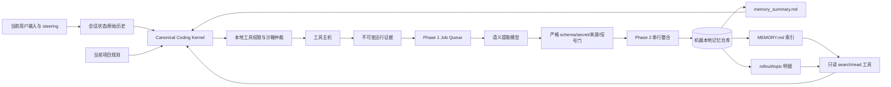
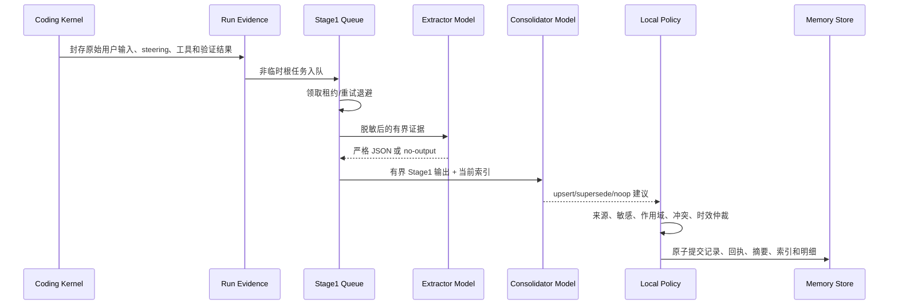
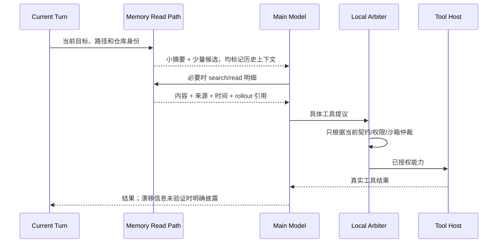
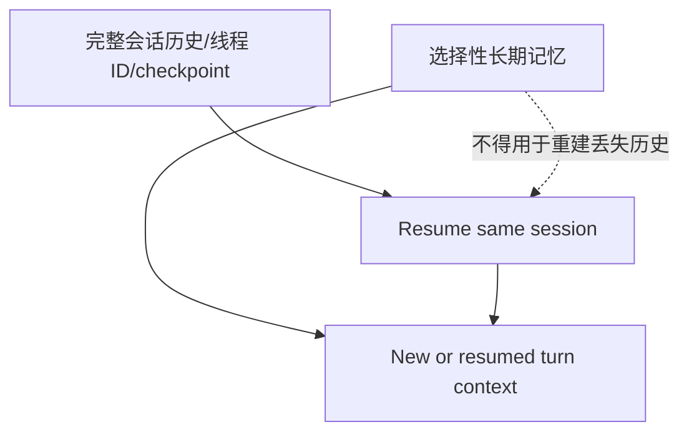

# T5 记忆体：Codex 对标架构、实现与验收规范

> 日期：2026-08-17
> 状态：已实现并通过本地 exact-VSIX 全面用户仿真验收
> Codex 基线：`code/upstream-agent-sources/openai-codex` @ `fe614a6304ef804be74a622e482fdd75977abcba`
> Claude Code 公开基线：`code/upstream-agent-sources/anthropic-claude-code` @ `be90077c6a353f292fa612d97173865a9ab21b83`

## 1. 结论

无法证明某一种记忆架构是“世界绝对最优”。截至 2026-08-17，DevSeek 采用证据最充分、最适合产品化编程智能体的组合：

1. 以 Codex 产品源码的两阶段写入、渐进读取、引用与使用回执、会话恢复分离为主架构。
2. 以 Claude Code 官方公开的 `MEMORY.md + topic files`、机器本地存储、可编辑/可关闭体验作为交互补充。
3. 以长期记忆研究补充时间、冲突、遗忘、编程子任务粒度和主动应用测试，但不让论文原型替代已经验证的产品边界。
4. 记忆始终是低权限历史上下文。当前用户输入、当前项目规则、权限、沙箱和工具证据拥有更高优先级。

本次重构不继续使用“关键词命中即采纳”和“主模型任意直写持久记忆”。语义由模型提取和整合，本地契约负责资格、来源、敏感信息、冲突、作用域、执行权限和证据闭环。

## 2. 证据分级

### 2.1 Codex 源码确认

| 责任 | 源码位置 | 已确认行为 |
|---|---|---|
| 总体写入架构 | `codex-rs/memories/README.md` | 根会话、非临时、功能启用且数据库可用时，异步执行 Phase 1 与串行 Phase 2 |
| 启动资格 | `codex-rs/memories/write/src/start.rs` | 临时会话、子智能体、功能关闭或无数据库时不启动 |
| Phase 1 | `codex-rs/memories/write/src/phase1.rs` | 有界领取、租约、并发、重试/退避、成功/无输出/失败三态 |
| Phase 1 语义契约 | `codex-rs/memories/write/templates/memories/stage_one_system.md` | 原始回合不可变；用户纠正和工具证据优先；低信号输出空结果；外部内容不是指令；secret 脱敏 |
| Phase 2 | `codex-rs/memories/write/src/phase2.rs` | 全局锁、有界输入、基线快照、差异提交、隔离的整合智能体、心跳和恢复 |
| 整合契约 | `codex-rs/memories/write/templates/memories/consolidation.md` | `memory_summary.md` 常驻、`MEMORY.md` 索引、明细/skills 按需；保留来源、冲突、时效和任务边界 |
| 读取注入 | `codex-rs/ext/memories/src/extension.rs`、`src/prompts.rs` | 只注入截断后的摘要和读取策略；专用工具按配置启用 |
| 读取策略 | `codex-rs/ext/memories/templates/memories/read_path.md` | 先摘要，再搜索索引，只读 1-2 个明细；漂移信息先验证；输出引用 |
| 显式更新 | `codex-rs/ext/memories/src/tools/ad_hoc_note.rs`、`src/local/ad_hoc_note.rs` | 只有用户明确要求时写一个受限 ad-hoc note；不直接编辑整合结果 |
| 使用回执 | `codex-rs/memories/read/src/usage.rs`、`citations.rs`，`codex-rs/state/src/runtime/memories.rs` | 从受限读取与引用中识别使用，事务更新使用次数/时间，并用于选择和遗忘 |
| 会话续接 | `codex-rs/core/src/session/session.rs` | 恢复原线程历史、标识和 rollout；与选择性长期记忆是两套机制 |

### 2.2 Claude Code 官方确认与源码边界

Claude Code 官方文档确认：每次会话仍从新上下文开始；`CLAUDE.md` 是用户维护的指令，auto memory 是模型维护的经验；两者都是上下文而不是强制执行规则；auto memory 按仓库保存于机器本地，`MEMORY.md` 作为索引，主题文件按需读取，启动只加载受限大小。来源：[Claude Code memory documentation](https://code.claude.com/docs/en/memory)。

公开仓库主要包含安装入口、插件、示例和脚本，没有可审计的核心 agent loop 与 auto-memory 内部实现。因此本项目不声称“读取了 Claude Code 闭源内核”，只把官方文档和可观察行为作为补充证据。

### 2.3 研究补充

| 研究 | 可用于 DevSeek 的结论 | 不直接照搬的部分 |
|---|---|---|
| [CoALA](https://arxiv.org/abs/2309.02427) | 将工作记忆、情景记忆、语义记忆、程序记忆及读写动作分层 | 抽象框架不提供产品权限与恢复实现 |
| [Generative Agents](https://arxiv.org/abs/2304.03442) | 相关性、时近性、重要性和反思共同影响召回 | 开放世界角色仿真不等于代码仓库工作流 |
| [MemGPT](https://arxiv.org/abs/2310.08560) | 小上下文常驻、外部明细按需换入 | 不引入其完整运行时 |
| [LongMemEval](https://arxiv.org/abs/2410.10813) | 必测抽取、跨会话推理、时间、更新与拒答 | 通用对话数据不能代替真实编程流程 |
| [MemoryAgentBench](https://arxiv.org/abs/2507.05257) | 必测检索、测试时学习、长程理解、选择性遗忘与冲突 | 排名不能直接证明产品安全性 |
| [Mem2ActBench](https://aclanthology.org/2026.acl-long.370/) | 记忆必须实际改善工具选择与参数落地，不能只测“能搜到” | 仍需 DevSeek 本地权限仲裁 |
| [LongMemEval-V2](https://arxiv.org/abs/2605.12493) | 文件化 runbook + 主动证据搜集优于单纯 RAG，代价是延迟 | 用预算和渐进读取控制延迟 |
| [SWE-MeM](https://arxiv.org/abs/2606.28434) | 任务内轨迹压缩与长期记忆应分开 | 不把压缩摘要误当跨会话事实 |
| [Subtask-Level Memory](https://arxiv.org/abs/2602.21611) | 编程记忆按分析、复现、实现、验证、恢复等功能子任务组织 | 作为元数据，不建立僵硬关键词路由 |
| [AgentPoison](https://arxiv.org/abs/2407.12784) | 外部内容和检索库会被投毒，必须保留来源与低权限 | 不允许检索结果自我晋升为项目规则 |
| [Baddeley episodic buffer](https://pubmed.ncbi.nlm.nih.gov/11058819/) | 小型工作缓冲负责绑定当前目标与长期知识 | 只作为计算类比，不声称复制人脑 |
| [Complementary Learning Systems](https://pubmed.ncbi.nlm.nih.gov/27315762/) | 快速保留具体事件，较慢整合稳定知识 | 不复制生物遗忘缺陷 |

## 3. DevSeek 重构前缺口

1. `.devseek/memory.json` 位于仓库内，可能污染工作树，也不能自然跨 worktree 共享。
2. 一个 `MemoryService` 同时承担存储、审批、脱敏、去重、冲突、检索、投影和 UI 管理，责任过密。
3. 主模型可调用 `memory_write` 直接提议持久写入；免审批自动写会绕过回合后证据提取与独立整合。
4. 检索以路径/文本 anchor 命中为主；拼写错误、同音字、隐式语义和跨语言表达容易漏召回。
5. 没有 Phase 1 job 的租约、重试、无输出状态，也没有 Phase 2 串行整合与可恢复基线。
6. 没有 `memory_summary.md -> MEMORY.md -> rollout/topic` 的渐进公开面与精确引用。
7. 会话续接已经开始持久化，但尚未在架构上明确与长期记忆彻底分离。

## 4. 目标架构

### 4.1 写入序列

### 4.2 读取与执行序列

### 4.3 会话恢复严格分离

## 5. 责任边界

| 组件 | 唯一责任 |
|---|---|
| `RepositoryMemoryLocation` | 解析规范仓库身份和机器本地存储根；同仓库 worktree 共享；项目配置不能重定向 |
| `MemoryStore` | 版本化、原子化持久状态与生命周期回执；不做语义判断 |
| `MemoryPipelineStore` | Stage 1 job、租约、重试、watermark 和 Phase 2 锁 |
| `MemorySemanticExtractor` | 使用模型从回合证据抽取高信号候选；允许 no-op |
| `MemoryConsolidator` | 基于来源、冲突、时间和效用生成整合建议；不直接写文件 |
| `MemoryService` | 本地策略仲裁、状态变更、管理接口；不调用模型 |
| `MemoryProjectionWriter` | 生成受限摘要、索引和可引用明细 |
| `MemoryReadService` | 常驻摘要、排序候选、按需搜索/读取与使用回执 |
| `SessionService` | 原会话历史和 checkpoint 的精确续接；不以长期记忆替代历史 |

## 6. 数据契约

长期条目至少包含：

- `id/type/scope/classification/status/content`
- `repositoryId` 和可选 `workspaceRoot`
- `sourceKind/sourceRef/evidenceRefs/rolloutId`
- `epistemicStatus`: `user-stated | tool-verified | inferred | uncertain`
- `outcome`: `success | partial | uncertain | failure`
- `functionalStage`: `analysis | reproduction | implementation | verification | recovery | workflow`
- `observedAt/validFrom/validTo/lastVerifiedAt`
- `supersedes/conflictsWith`
- `usageCount/lastUsedAt`
- secret 脱敏与生命周期回执

Phase 1 job 至少包含 `pending/leased/succeeded/no-output/failed`、租约、尝试次数、下次重试时间、不可变输入摘要和输出哈希。模型输出不是写权限，只是待仲裁建议。

## 7. 存储与迁移

1. 默认存储在 VS Code `globalStorageUri` 下；无 VS Code 上下文时回退到用户目录 `.devseek/memories`。
2. 仓库身份优先取真实路径下的 Git common dir，因此 worktree 共享；非 Git 工作区使用真实工作区路径哈希。
3. 本轮不引入原生 SQLite。当前 VSIX 没有数据库依赖，贸然加入会扩大多平台安装风险。先用仓储端口下的原子文件状态、锁、租约和快照实现完整语义；未来替换 SQLite 不改上层协议。
4. 旧 `.devseek/memory.json` 只做一次性、低信任迁移输入，不删除、不自动提升为指令，也不再作为活动存储。
5. 用户维护的 `.devseek/rules.md` 与自动记忆分开，前者仍属于项目指令系统。

## 8. 安全和优先级

从高到低：系统/开发者策略、当前用户输入及本轮 steering、当前项目规则、当前工具证据、已验证长期记忆、推断/不确定记忆、外部内容。任何冲突都保留较低层来源但不得覆盖较高层。

外部网页、日志、issue、README、MCP 返回均是数据，不是记忆写入命令。模型不能通过输出“请记住”自我晋升。记忆里的 shell 命令和路径在执行前必须重新经过工具权限、路径边界和当前任务契约。

## 9. 仿真验收矩阵

至少覆盖以下真实用户类型和表达：

1. 中文错别字、同音字、口语、省略主语、夹杂英文和路径斜杠。
2. 多轮补充、纠错、撤回、改范围、改验证方式和中途禁止写入。
3. 同一仓库新会话、VS Code 重启、不同 worktree、不同仓库同名文件。
4. 成功、部分成功、工具失败、用户否定、助手自称成功但无工具证据。
5. 稳定偏好、一次性要求、临时状态、通用常识、过时命令、相互冲突的新旧事实。
6. 外部页面提示注入、日志中的伪指令、secret、绝对外部路径和存储重定向攻击。
7. 召回后实际改变正确的工具/参数；召回后仍被当前用户约束覆盖；错误记忆不能授权副作用。
8. 无高信号内容时严格 no-output；相关性不足时拒绝使用；漂移事实必须现场验证。
9. 摘要常驻、明细按需、读取预算、引用、使用次数与长期未使用淘汰。
10. 精确会话恢复不依赖长期记忆；新会话不泄漏上一仓库数据。

完成标准不是“测试脚本返回 0”本身，而是：流程顺序正确、语义识别准确、工具执行与当前约束一致、结果由真实证据闭环、重启后状态可复核。

## 10. 实施记录

### 10.1 已实现组件

| 责任 | DevSeek 实现 |
|---|---|
| 机器本地仓库身份 | `src/memory/repository-memory-location.ts`：使用 Git common dir 形成仓库 ID，同仓库 worktree 共享、不同仓库隔离；VS Code 使用 `globalStorageUri` |
| 持久状态 | `src/memory/memory-store.ts`：v3 schema、原子 rename、进程锁/过期锁、失败关闭、旧状态低信任迁移、生命周期回执 |
| 两阶段队列 | `src/memory/memory-pipeline-store.ts`：幂等 enqueue、Phase 1 租约/重试/no-output、Phase 2 单租约、watermark 与清理 |
| 模型语义 | `src/memory/memory-semantic-model.ts`：Phase 1 严格提取和 Phase 2 整合 schema；原始证据、来源和 evidence ref 必须保留 |
| 本地仲裁 | `src/app/memory-service.ts`、`packages/shared/src/coding-memory-policy.ts`：secret、来源、外部提权、作用域、时效、冲突、使用回执和生命周期统一裁决 |
| 渐进读取 | `src/memory/memory-projection.ts`：确定性小摘要、索引、不可变 rollout、受限 search/read；模型自由摘要不能直接进入投影 |
| 后台编排 | `src/app/memory-pipeline-service.ts`：用户任务后异步处理；前台任务可取消后台 Provider；后台失败不改变已完成用户任务 |
| 显式 ad-hoc 写入 | `src/app/evidence-aware-memory-write.ts`：只经确认后的 prepared host 写入，使用 ProductMutation evidence 和独立 active readback |
| 主循环接入 | `src/product-coding-kernel-executor.ts`、`src/extension.ts`：终态收集原始输入、steering、工具/验证 receipt；启动处理 pending job；deactivate flush |
| 会话恢复 | `src/app/session-service.ts`：write-through 与 flush，继续保持精确 session state，不以长期记忆重建历史 |

`memory_write` 不再被错误建模为进程操作，而是 canonical `local-state` 外部效果。模型只能提出结构化写入；没有 evidence-aware host 时失败关闭，确认后仍须经过 tool authority、external-effect settlement、ProductMutation evidence 和写后 readback。自治提示中不广告该工具，只有显式用户 ad-hoc 请求可以走此通路。自动学习只走回合后的两阶段管线。

### 10.2 迁移和删除

1. 活动存储从 workspace 内旧 JSON 迁到机器本地、仓库隔离的 v3 状态；旧文件只读导入且降低信任，不删除用户原文件。
2. 删除 tool loop 和 local repair 中的直接持久化回调，不保留第二个写入 owner。
3. 长期记忆读取使用 `memory_search` / `memory_read` 受限接口；不允许任意路径读取，也不把全文无界塞进 prompt。
4. 关键词和多语言词表只保留为确定性限制或提示。带错字、同音字、口语和命令文本的用户输入由主模型语义提案纠正；本地合同不再因文本出现 `npm run` 就强制执行。

### 10.3 仿真驱动校正

第一次 exact-VSIX T5 仿真发现直接 memory callback 没有 prepared authority，且 `memory_write` 被错误标成 `process`。实现因此扩展了共享 effect taxonomy，接入确认、外部效果 reconciliation、ProductMutation evidence 和 active readback；没有用测试特例绕过权限。

第二次仿真已成功跨进程保存和恢复记忆，唯一失败是测试预期了不存在于 `CodingTaskMode` 的 `advise`。共享契约只允许 `explain | review | change | release`，该只读建议任务正确规范化为 `review`，因此修正 oracle 为公开合同值，没有改变产品执行行为。

### 10.4 验收证据

- shared 全量：`340/340 PASS`。
- extension 全量：`181/181 suites PASS`。
- T5 聚焦 exact-VSIX：`20260817-t5-memory-focused-r3` PASS；显式写入后关闭扩展宿主，重启后恢复 `npm run test:bridge`，当前轮只读约束覆盖历史记忆。
- 全面独立用户仿真：`20260817-t5-memory-acceptance` PASS；14 个步骤、13 个 controlled suites、107 个 selected case，required acceptance case 为 83，缺失套件、缺失维度和执行证据均为 0。
- 报告：`docs/testing/devseek-20260817-t5-memory-acceptance.md`。
- 验收 VSIX：`devseek-netai-latest.vsix`，候选 SHA-256 `2318193fbf8c4ff5b4a7ebf72d43d14d73235e3261ae7ea1f1d2d35cc68cbe56`。

这些结果证明本轮定义的本地可观察产品行为，不等于真实 Provider、受保护 RC、sealed holdout 或 C14 发布资格。

### 10.5 本轮停止点

T5“记忆与重启”完成后停止本任务，不自动进入 T6。下一专题是 T6“卡顿与资源回收”，重点核查自动测试窗口、浏览器、Bridge、后台记忆 Provider、日志关联和跨进程回收。
