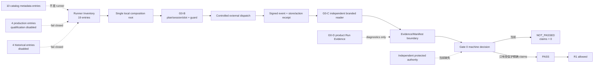

---
devseek_governance:
  generator: "devseek-doc-governance/v1"
  status: "historical"
  path: "docs/top-agent-convergence-audit-20260711/archive/17-Gate0本地纵切机器裁决用户窗口仿真与GPT5.5接管报告.md"
  source_group: "handoff"
  decision: "keep"
  relationship: "handoff-entry"
  active_baselines:
    - "docs/top-agent-convergence-audit-20260711/PLAN-当前收敛迭代计划.md"
  machine_sources:
    active_selector: "docs/process/devseek-active-baseline-selector.json"
    legacy_inventory: "docs/process/devseek-legacy-doc-inventory.json"
  asserts_gate_pass: false
---

<!-- DEVSEEK-GOVERNANCE-BANNER:START -->
> [!NOTE]
> DevSeek governance: this document is archived historical evidence. Current process authority: `docs/top-agent-convergence-audit-20260711/PLAN-当前收敛迭代计划.md`. Machine source: `docs/process/devseek-active-baseline-selector.json`.
<!-- DEVSEEK-GOVERNANCE-BANNER:END -->

> 归档于 2026-08-03。本文仅保留 Gate 0 本地纵切的历史集成回执；动态身份和资格状态必须现场复算。

# Gate 0 本地纵切、机器裁决、用户窗口仿真与 GPT-5.5 接管报告

- 更新日期：2026-07-12
- 适用范围：本轮 Gate 0 仓库内纵切、默认门禁、VSIX 发布验证与用户窗口仿真边界
- 结论：仓库内新增的 runner 与机器裁决契约已达到本地一致性要求；**Gate 0 仍为 `NOT_PASSED`，七项精确 claim 仍为空，R1 仍为 `NOT_STARTED`**
- 集成检查点：implementation/matching Phase、exact VSIX/packaged Bridge 与 stable install 已在各自范围 PASS；当前用户窗口 active Bridge 仍为旧 debug `368cacf`，same-window simulation=`NOT_RUN`
- 身份规则：handoff 文档、implementation/Phase、artifact、stable install、active runtime 必须按第 8 节分别复算；不得强制它们使用同一原始 SHA 字符串

## 1. 本轮到底完成了什么

本轮完成的是 Gate 0 的仓库内可验证地基，不是受保护资格本身：

1. 建立唯一 `createQualificationRunner` composition root；本地 fixture 可走完 plan/session/slot、授权、外部动作、签名 event/receipt 和独立 G0-C reader。
2. 建立 runner inventory 与受限入口扫描；catalog metadata、生产禁用入口和历史入口不再被误写成已执行 runner。
3. 建立 Gate 0 机器裁决报告；它逐项读取七个 C0 节点，分别输出本地一致性、仓库接线缺口、外部 authority 缺口和精确 claim 缺口。
4. 把 runner 与 decision checker 加入默认 Phase 0～12；checker 通过只说明契约自洽，不授予资格。
5. 建立 exact-VSIX controlled Surface harness，并修正 human-input/extension-host sibling 的过时双语 oracle。
6. 已定义“直接在用户正在使用的 DevSeek 窗口完成简单编程仿真”的交付门；本轮因用户随后切换为 docs-only/stop 而未执行，隔离 Extension Host 只能辅助诊断。

没有完成、也没有伪装完成的事项：受保护 policy、独立 evidence authority attestation、非测试职责分离、外部 WORM/retention、可信不可回拨时间、冻结候选的精确 claims、live holdout 和任何 L 级资格。

## 2. 当前架构纵切



关键边界：

- `1` 个本地 runner 证明 composition 与拒绝路径可达，不代表生产 qualification runner 已启用。
- `10` 个 catalog 条目只是 case/executor 元数据一致性，不代表十个攻击语义已由一个 happy path 执行。
- G0-D 是 `product-run-diagnostics`；即使 sealed，也不能签发 qualification verdict。
- 同仓 profile/policy 自哈希最多证明 `source_digests_bound`，不能建立独立信任根。

## 3. 机器真值

以 `docs/process/devseek-gate0-decision-report.json` 为唯一动态结果源，本轮固定不变量如下：

| 项目 | 当前值 | 正确解释 |
| --- | --- | --- |
| C0 节点 | `7` | Gate 0 逐节点，不按“G0-A/B/C/D 四份文档”计数 |
| implementation `wired` | `2/7` | 当前只有 Case Catalog 与 Qualification Profile Schema 达到机器 `wired` |
| repository blockers | `5` | ledger schema、preregistration plan、aggregator、evidence manifest、run-evidence ledger 仍为 `implemented` |
| external blockers | `6` | source digest binding、独立 attestation、protected profile/policy、精确 claims、protected evidence controls |
| local conformance | `PASSED` | 仅本地协议源契约自洽 |
| exact claims | `0` | 不允许人工补 claim |
| qualification eligible | `false` | 当前 v1 没有外部 attestation adapter，结构上 fail closed |
| Gate 0 | `NOT_PASSED` | R1 不得开始 |

机器裁决已专门关闭“自建信任根”缺陷类：即使把同仓 profile/policy 改成 protected、重算其自哈希并把两个 digest 写回 ledger，也只能得到 `source_digests_bound=true`；`independent_authority_attested=false`、`configured_and_bound=false`、`external_authority_trust_anchored=false` 和 `qualification_eligible=false` 必须保持不变。未来外部 adapter 必须逐 claim 验证 profile、manifest、retention、provenance 和 authority attestation，不能重新引入普通 boolean/对象自证。

## 4. Runner 真值

`docs/process/devseek-qualification-runner-inventory.json` 的当前分类是：

| 分类 | 数量 | 资格意义 |
| --- | ---: | --- |
| 本地 test-fixture runner | 1 | `wired-local-nonqualification`；只证明本地纵切 |
| catalog metadata executors | 10 | metadata conformance；不是 runner，不产生 claim |
| production entrypoints | 4 | qualification disabled；不得暗中调用 authority |
| historical entrypoints | 4 | disabled；不得复活成旁路 |

受限静态扫描覆盖 `248` 个生产源与顶层脚本文件，已知 forbidden authority import 为 `0`；composition root 使用模块私有 brand 拒绝伪造 G0-C reader，并验证 `ExternalActionStarted` 的 store receipt 位于授权时间窗。该扫描是当前 allowlist 下的证据，后续新增入口必须更新 inventory/checker，不能以“未被扫描”为通过。

## 5. 用户仿真分层

| 层级 | 本轮用途 | 可以证明 | 不能证明 |
| --- | --- | --- | --- |
| deterministic/unit/replay | 协议、攻击、拒绝和 UI projection | 代码与 oracle 在 fixture 范围一致 | VSIX、真实窗口、live Provider |
| T3 exact-VSIX controlled | 精确 VSIX 临时安装、真实 extension runtime、受控 fake Bridge | package/install/runtime 身份、真实扩展路径、mutation/settlement/Run Evidence | 自然输入、真实审批、live Provider、资格 |
| 用户当前 DevSeek 窗口仿真 | **当前 `NOT_RUN`**；只在 stable artifact 已成为 active runtime 且获 fresh 授权后执行 | 若未来 PASS，可证明该 prompt scope 的入口、写文件、命令验证和最终反馈 | protected authority、holdout、L4/L5/L6 或 Gate 0 PASS |
| T5/live/holdout | 仅在新计划、账号条款、profile 和用户授权齐备后 | 对应冻结 scope 的受保护证据 | 其他 Provider/Surface/platform 的外推 |

未来用户同窗口仿真必须满足：

1. 使用最终安装的 DevSeek 扩展，而不是另起 Extension Host 测试窗口；
2. 从 DevSeek 对话输入框提交一条有唯一 marker 的简单编程任务；
3. 任务限定只创建隔离测试目录中的一个小程序，运行明确验证命令，不修改其他文件；
4. 验证用户提示词 marker、实际文件内容、命令输出、changed paths、terminal settlement 和界面最终摘要相互绑定；
5. 保存动态结果后只清理该测试目录，并恢复为测试临时改变的设置；
6. 结果标为 `same-user-window-development-simulation`、`qualification_eligible=false`。

旧 `test:extension-host --run` 在 VS Code 1.112 上发生于 oracle 之前的 Webview `harnessReport` 超时；首个 fixture 保留在运行主机的 `/tmp`。它不得被重跑成功覆盖，也不得推导产品失败。exact-VSIX controlled gate 已有证据；用户同窗口 gate 当前 `NOT_RUN`。旧 harness 兼容性登记为 P2，后续触碰该 harness 时修复。

## 6. 本轮独立反证收口

本轮复审实际发现并要求关闭两类 P1：

1. **同仓自哈希可建立 future trust root**：已通过结构性 `independent_authority_attested=false`、Schema `const false` 和 fresh-self-hash 负测关闭；未来另开 external adapter 原子任务。
2. **controlled fake Bridge 不绑定用户 prompt**：最终 harness 必须首轮精确绑定 driver prompt/hash，后续轮绑定明确工具反馈 contract；空、替换、跳轮必须 fail closed，最终报告必须验证全部 request `bound=true`。

任何最终复审仍有 P0/P1 时，本轮不得提交、打包或写成完成。

## 7. Gate 0 之后仍未完成的工作

下一模型不得把“本轮 Gate 0 迭代完成”解释为“Gate 0 已 PASS”。仓库内下一任务、外部阻塞和验收条件只以 [当前计划](../PLAN-当前收敛迭代计划.md) 为准；历史无聊天接管协议可参考 [15](15-新窗口与跨模型接管手册.md)；不变工程规则可参考 [16](../16-顶级编程智能体收敛迭代原则质量标准与Skills规划.md)。

当前顺序是：

```text
CLOSE-01 active runtime identity
  → CLOSE-02 same-window Surface receipt
  → G0-01 ACTIVE-BASELINE-SELECTOR
  → G0 governance/profile/executor/candidate/C0 wiring atomic cards
  → import independently authorized trust/evidence controls
  → protected profile execution and exact claims
  → machine Gate 0 PASS only
  → R1-A
```

## 8. 动态完成回执

由于 docs-only handoff commit、实现 source、Phase、VSIX 与运行窗口具有不同生命周期，接管者必须现场分层解析。当前静态锚点只用于发现漂移：implementation=`6d26aa6abe80d8bfd921a1ee176ece279487e9c3`，matching Phase run=`2026-07-12T12-11-26-901Z`，VSIX SHA-256=`bc4359d444ab791c42aa4509e1bda03c37a3d546907eb6402cd2c37a59679cff`，active Bridge 仍是 debug `368cacf`，same-window=`NOT_RUN`。

```text
handoff_doc_commit: git log -1 --format=%H -- docs/top-agent-convergence-audit-20260711/15-*.md; must be HEAD ancestor
tracked_tree: git status --short + explained local artifacts
implementation_commit: full commit that owns runner/decision source
phase0_12_report: resolved source commit must equal implementation_commit and include qualification-runner-wiring + gate0-machine-decision-contract
runner_checker: ok=true; inventory=19; local_runner=1; catalog=10; production_disabled=4; historical_disabled=4; forbidden_imports=0
gate0_decision: local_conformance=PASSED; gate0=NOT_PASSED; claims=0; repository_blockers=5; external_blockers=6
artifact: exact path + sha256 + packaged version/build/resolved source commit + applicability; docs-only handoff need not rebuild
packaged_bridge: PASS and source identity matches applicable implementation
stable_installed_extension: same id/version/build/resolved source commit as exact artifact
active_extension_bridge: actual user-window extension/Bridge path/build/source, observed separately from stable install
same_user_window_simulation: current NOT_RUN/AUTHORIZATION_NOT_CARRIED_FORWARD; future PASS|FAIL needs fresh authorization, prompt marker, changed path, validation output and cleanup receipt
same_user_window_qualification_effect: NONE
qualification_claims: []
gate_0: NOT_PASSED
r1: NOT_STARTED
next_model: GPT-5.5
current_work_package: CLOSE-INTEGRATION-GATE0-LOCAL
next_claimable_leaf: CLOSE-01-ACTIVE-RUNTIME-IDENTITY
```

用户窗口 reload/Bridge retirement、同窗口 probe、真实 live、canary/medium/formal 和 holdout 都不得从历史聊天或本地仿真继承授权；新窗口如需执行，必须重新核对当前 atomic ID、scope/action、profile、冻结候选、账号条款、外部 authority 和用户明确授权。`CLOSE-01` PASS 后停止；不得在同一窗口自动进入 `CLOSE-02` 或 G0-01。
