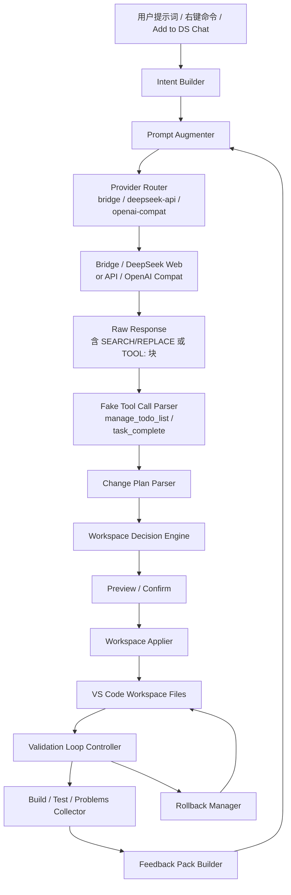

# DeepSeek NetAI 软件设计文档

**项目名称**: deepseek_netai  
**文档版本**: v2.8  
**日期**: 2026-05-15  
**对应需求版本**: v2.18

---

## 一、设计目标

本设计文档针对“让 DeepSeek 插件具备接近 GitHub Copilot 的文件生成与文件修改能力”这一目标，定义一套稳定、可扩展、可验证的软件架构。

设计目标：

1. 支持根据用户提示词和工作区上下文，自动识别目标文件路径。
2. 支持创建目录、创建文件、覆盖文件、局部 patch 修改。
3. 支持 DeepSeek 多种回复形式：JSON 计划、unified diff、路径代码块、自然语言说明。
4. 保持现有聊天、附件、Mermaid、插入代码、登录与重试能力不受影响。
5. 将“文件变更”能力做成独立架构，而不是散落在 webview 文本解析逻辑中。
6. 在 DeepSeek 网页免费版前提下，优先把高频主链路做稳，而不是追求全量 Copilot 功能等价。
7. 对“自编译 / 收错 / 回传修复”能力采用受控闭环设计，而不是无限自治循环。
8. 对任何自动修复都必须设计显式回退能力，避免工程状态被持续污染。

### 1.1 设计边界结论

本设计的前提不是“拥有可控的原生模型 API”，而是“通过 Playwright 驱动 DeepSeek 网页免费版”。这意味着：

1. 设计必须容忍页面结构变化、会话波动、请求不稳定和风控干扰。
2. 设计应优先选择可验证、可回退、可确认的交互，而不是高频隐式自动化。
3. 设计重心应放在“工作区集成能力”而不是“模型底层能力幻觉”。

### 1.2 非目标

以下内容不应作为当前架构的默认承诺：

1. 不承诺逐字符、毫秒级、始终在线的 Copilot 级补全体验。
2. 不承诺全库语义理解达到专用向量检索系统的水平。
3. 不承诺复杂多文件自主重构可以默认自动应用。
4. 不承诺依赖网页结构的能力长期完全稳定。
5. 不承诺无人值守的无限自动修复循环。

这些能力可以探索，但应被设计为增强层，而不是主链路依赖。

---

## 二、设计原则

### 2.1 单一职责

- Bridge 只负责 DeepSeek 网页交互，不负责文件写入。
- WebView 只负责渲染和用户触发，不负责决定最终文件路径。
- Extension Host 负责变更计划解析、决策、确认与应用。

### 2.2 结构化优先

对 DeepSeek 回复的消费顺序必须是：

1. JSON 变更计划
2. unified diff
3. 显式路径代码块
4. 自然语言推断

不能反过来用自然语言推断覆盖更高置信度的结构化输出。

### 2.3 工作区感知

目标路径不能只看模型回复，必须结合：

- 当前工作区目录树
- 用户提示词里的目录/文件意图
- 当前活动文件
- 用户通过“Add to DS Chat”附加的文件/目录

### 2.4 安全与可确认

所有文件写入必须满足：

- 工作区内路径
- 目录可创建
- 已存在文件需要预览或确认
- 批量变更需要统一确认
- patch 失败时不能静默破坏文件
- 自动修复引入问题时必须支持回退到上一轮稳定状态

### 2.5 体验优先级

在免费网页版前提下，最优体验不等于“最像 Copilot 的所有表面交互”，而是：

1. 用户发问后能稳定得到可用回答。
2. 当回答涉及文件变更时，插件能把回复转成清晰的变更计划。
3. 用户能预览、确认、应用，而不是把关键步骤埋在文本里。
4. 对不稳定能力始终提供降级路径，不让主链路被单点能力拖垮。

### 2.6 架构演进治理

为了保证后续持续加功能时架构仍可控，设计层必须额外遵守以下治理规则：

1. **先扩展、后重构、再重写**：默认先寻找现有扩展点；只有现有边界已失效时才进入重构；除非模块职责彻底错误，否则不采用整体重写。
2. **跨层通信收口**：WebView、Extension Host、Bridge 之间的交互必须通过明确消息或接口收口，禁止为了新增功能直接跨层读写对方内部状态。
3. **新增功能挂靠既有主链路**：优先接入现有的 Intent、Plan、Decision、Apply、Validate 链路，不得为单个功能再发明一条独立的“旁路实现”。
4. **回归成本可控**：任何新模块引入后，都应能明确回答“如果出问题，最先看哪个模块、哪份文档、哪个版本备份”。
5. **顶级智能体合规闸门（强制）**：每次代码修改前必须完成“需求 -> 架构 -> 策略 -> 验证 -> 回退”检查，不满足者不得进入实现。
6. **反补丁默认策略（强制）**：禁止以补丁式局部修复作为常规迭代路径；若必须临时补丁，需同时提交结构化重构计划与时间界限。

### 2.11 每次代码修改的统一执行规则

为确保实现始终符合“顶级编程智能体”定位，所有代码变更统一遵循以下流程：

1. 需求归因
- 明确本次问题属于能力缺口还是实现缺陷，避免直接改代码。

2. 架构定位
- 明确变更落在哪个能力层：理解、规划、执行、验证、修复、回退。

3. 方案分层
- 优先策略层/编排层修正，避免把策略问题下沉为散落条件分支。

4. 验证闭环
- 必须验证主目标链路与回退链路，不能只验证“编译通过”。

5. 文档追溯
- 同步更新需求文档、设计文档、变更日志；缺任一项视为不完整交付。

### 2.12 顶级智能体变更闸门实现约束（v2.2）

为把治理规则落到执行层，架构实现必须额外遵守：

1. 闸门入口统一
- 所有功能改动必须先填写 docs/TOP_AGENT_CHANGE_GATE.md 的变更记录模板。
- 记录必须包含：需求归因、能力层影响、方案对比、验证计划、回退方案。

2. 能力层映射强制
- 每次改动必须明确归属至少一个能力层：理解 / 规划 / 执行 / 验证 / 修复 / 回退。
- 禁止“只改 UI 文案不标能力层”的模糊交付。

3. 主链路与回退链路双验收
- 主链路：验证新增能力可达成目标。
- 回退链路：验证失败、取消、回滚至少一种路径可用。
- 仅编译通过不构成完成。

4. 过程区与结果区分离
- Working 区只承载动态过程与阶段摘要。
- 聊天主区只承载结果、文件清单和可执行入口。
- 不允许把步骤噪音持续沉积在主区历史中。

5. 变更审计最小记录
- 必须在 CHANGELOG 记录本次改动对成功判据的影响。
- 必须注明是否引入新的降级/回退行为。

### 2.13 修改队列与接受语义（v2.2）

为对齐 Copilot 的“修改可审阅、可接受、可撤销”体验，新增如下实现约束：

1. Pending Edit Queue（累加）
- 每次文件应用成功后，Extension Host 记录该文件快照：路径、是否原本存在、旧内容、新内容、时间戳。
- 队列按时间逆序展示，未处理项必须保留，不可被新项覆盖。

2. Keep / Undo 语义
- Keep：表示确认保留该次改动，仅从待处理队列移除，不改动当前文件内容。
- Undo：按该项快照恢复文件。
	- 原本存在：恢复旧内容。
	- 新建文件：删除该文件。

3. 批量操作语义
- Keep All：清空待处理队列，不触发额外文件写入。
- Undo All：按时间逆序恢复全部待处理项，确保多次修改同一路径时恢复结果确定。

4. 跨层边界
- Workspace Apply 负责产出“已应用变更快照”。
- Extension Host 负责快照存储与 Keep/Undo 执行。
- WebView 只负责队列渲染与动作触发，不持久化快照。

5. 文案策略表（可配置）
- Working 区文案必须通过策略表统一生成，不允许在事件处理分支中散落硬编码文案。
- 至少支持 `concise` 与 `detailed` 两档风格，并由配置项统一切换。
- 策略表需覆盖：阶段标题、阶段详情、完成总结、失败建议与空闲提示。

### 2.7 推荐设计模式映射

为了减少后续功能扩展时的结构性退化，建议在现有架构上优先使用以下模式：

1. **Strategy**：用于回复解析、变更计划解析、验证策略选择，避免把不同格式处理逻辑堆在一个函数里。
2. **Facade**：用于对 Bridge 能力、Workspace Apply 能力、Validation 能力提供稳定入口，避免调用方依赖内部细节。
3. **Repository**：用于 Session、Rollback、变更批次、构建结果等持久化状态，避免状态读写散落在多个模块中。
4. **Pipeline / Chain of Responsibility**：用于 Intent -> Prompt -> Parse -> Decision -> Apply -> Validate 的顺序处理链，便于在中间插入新能力。
5. **Adapter**：用于把 DeepSeek 网页 DOM、SSE、不同回复格式统一为内部标准结构，降低页面变化对上层的冲击。

### 2.8 Copilot 风格交互扩展设计（v1.7）

为保证后续继续扩展时不退化为“事件堆叠 + 样式散改”，交互层采用以下模式：

1. History Edit Strategy
- 目标：历史用户消息支持“进入编辑态 -> 重发”。
- 设计：把“原始 prompt”作为消息元数据保存在消息节点，编辑重发走独立发送入口。

2. Scroll Policy Strategy
- 目标：流式输出时，用户上翻阅读不被强制打断。
- 设计：引入 `PinnedToBottom` 状态策略：
	- 在底部：自动跟随流式输出。
	- 不在底部：后台继续更新，并显示“新内容”跳转按钮。

3. Message Action Registry
- 目标：按钮能力可扩展（编辑、重发、预览、应用、复制、插入）。
- 设计：统一 action 区域渲染，避免每类消息重复拼接按钮逻辑。

4. Visual Token Layer
- 目标：图标、颜色、状态表达统一。
- 设计：按钮文案 + 图标语义化；状态卡按 state 切换样式。

5. 分层边界
- WebView: 只负责交互、滚动策略、消息局部状态。
- Extension Host: 负责命令分发、视图聚焦、工作流事件。
- Bridge: 保持网页交互职责，不承载 UI 状态。

6. Working 区域（临时动态区）
- 目标：把“进行中状态”从聊天正文中抽离，避免状态刷屏干扰主阅读区。
- 设计：
	- 在消息区上方引入独立 Working 卡片区域。
	- 仅展示当前轮次临时状态（生成中、解析中、应用中、验证中）。
	- Working 区采用三态：`Working` / `Finished` / `Failed`。
	- 完成态显示简要摘要，例如“完成 N 步”与下一步建议。
	- 结束后自动清空或折叠，不沉积为长期历史噪音。
- 价值：与 Copilot 的 Working 体验对齐，主区保留“结果与可执行入口”，过程放在临时区确认。

7. 同路径变更的对比与替换策略
- 目标：当模型再次返回同一路径文件时，支持“先比对再决定如何应用”。
- 交互：
	- 整体入口：`预览` / `应用`（批量）。
	- 文件级入口：`对比`（仅该文件 diff）/ `替换此文件`（仅该文件应用）。
- 规则：
	- 默认鼓励先 `对比` 再 `替换`；
	- 保留 `应用全部` 以支持快速闭环；
	- 文件级操作与批量操作共用同一 apply/validate 审计链路。

### 2.9 编程意图与验证策略扩展设计（v1.8）

为解决“非编程问题误触发自动落盘/自动编译”以及“单文件改动却目录全量编译”问题，新增两个策略模块：

1. Intent Router（Strategy）
- 模块：`intent-router.ts`
- 责任：把请求分为 `chat` / `code-change`，并决定是否追加结构化提示、是否允许自动 apply。
- 关键规则：讨论/分析类 prompt 默认走 chat；仅强变更意图进入自动落盘链路。

2. Validation Planner（Strategy + Policy）
- 模块：`validation-planner.ts`
- 责任：基于变更文件选择最小验证命令。
- 支持模式：`compile-only` / `compile-run` / `cmake`。
- 关键规则：
	- 多 main 场景优先 compile-only；
	- 单一主入口且目标明确时可 compile-run；
	- 仅头文件变更默认 compile-only。

3. 执行链路接入点
- `extension.ts`：`runChat` 中用 Intent Router 控制自动应用入口。
- `workspace-applier.ts`：`runAutoValidation` 中委托 Validation Planner 生成命令。

4. 审计可追溯输出
- 自动验证状态输出追加 `mode` 与 `reason`，用于解释策略命中结果。

### 2.10 顶级智能体编排设计（v1.9）

为实现“本地优先 + 混合理解 + 失败升级”的智能体能力，新增以下设计约束：

1. Action Orchestrator（编排层）
- 输入：用户 prompt、附件文件、上一轮执行计划。
- 输出：`local-execute` / `deepseek-chat` / `deepseek-repair` 三类动作决策。

2. Execution Planner（执行策略层）
- 从附件与 prompt 目录/文件路径解析候选目标。
- 产出本地命令（compile-only / compile-run / cmake / script-run）。

3. Repair Escalation（失败升级层）
- 本地失败后仅发送最小失败上下文与最小相关文件给 DeepSeek。
- DeepSeek 回答经 Workspace Applier 落地后，必须重跑原本地命令。

4. Success Criterion（成功判据）
- 闭环成功以“原本地目标命令通过”为准，不以 compile-only 兜底通过替代。

5. Human-in-the-loop（可选人工审批）
- `executionApproval=confirm` 时，执行前弹出确认。
- `executionApproval=auto` 时，插件自动执行。

6. Context Reuse（上下文复用）
- 对“再次编译/重新运行”请求，优先复用 `lastLocalExecutionPlan`，避免掉回纯对话。

### 2.11 执行确认与超限交互设计（v2.1）

1. Compile -> Execute Confirmation
- 对 compile-only 成功结果，在可安全判定单一入口时追加执行检查。
- 运行失败应覆盖验证结果为失败，并进入修复流程。

2. Multi-main Safety Guard
- 多 main 或入口不唯一时禁止自动运行，仅保留 compile-only，并输出“不可安全执行”的原因。

3. Repair Budget Policy
- 默认修复预算 6 轮。
- 达到预算上限后进入用户交互分叉：
	- 继续 3 轮
	- 生成手动修复建议
	- 停止

4. Deterministic Success Criteria
- 本地执行闭环以“原目标命令重跑通过”为最终成功判据。
- 不能用仅编译通过替代运行通过结论。


### 2.12 Working 区 Copilot 对标设计（v2.12）

#### Copilot 三段行为分析

| 阶段 | Copilot 行为 |
|------|-------------|
| 进行中 | 单条紧凑卡片，仅显示最新步骤标题与详情；旧步骤不堆积 |
| 完成时 | 卡片消失，原位出现一行小字：`已完成 · N步 ∨`（低透明度） |
| 展开后 | 原位展开带序号步骤列表，支持 250px 滚动；再次点击折叠 |

**关键约束**：进行中不累积历史；完成行低对比度、不阻断主内容；步骤折叠/展开不弹浮层。

#### 当前实现方案

**进行中**（`renderWorkingArea()`）：

```javascript
// 仅渲染最新一条 workingEntries，working-card.compact 结构
workingEl.innerHTML = '<div class="working-card compact">'
  + '<span class="working-dot"></span>'
  + '<div class="working-main">'
  + '<div class="wi-title">' + escapeHtml(latest.title) + '</div>'
  + (latest.detail ? '<div class="wi-detail">' + escapeHtml(latest.detail) + '</div>' : '')
  + '</div></div>';
```

流式阶段 delta handler：

```javascript
var progLabel = rawLen > 0 ? ('已接收 ' + rawLen.toLocaleString() + ' 字符') : '正在连接…';
updateWorkingEntry('response', '正在生成回复', progLabel, 'started');
```

**完成后**（`addCompletionSummaryCard()`）：
- 渲染 `fsr-row` 容器，内含 `fsr-btn`（`已完成 · N步 ∨`，`opacity:0.62`，`font-size:11px`）。
- `fsr-body`（默认 `display:none`）：左侧蓝色 2px 边框，内含每步的 `fsr-step`（`fsr-step-num` + `fsr-step-title` + 可选 `fsr-step-detail`）。
- 点击 `fsr-btn` 切换 `fsr-open` class，展开/折叠步骤列表。
- **特殊情况**：无文件且步骤数 ≤ 1 时跳过摘要渲染。
- 文件摘要卡（绿色边框）仅在 `hasFiles`（`refs.length > 0 || queueCount > 0`）时渲染。

#### CSS 类族

| Class | 说明 |
|-------|------|
| `.working-card.compact` | 紧凑工作卡，进行中唯一可见元素 |
| `.working-dot` | 左侧动画小圆点 |
| `.wi-title` / `.wi-detail` | 步骤标题 / 详情文字 |
| `.fsr-row` | 完成后脚注容器行 |
| `.fsr-btn` | 脚注触发按钮，`opacity:.62; font-size:11px` |
| `.fsr-body` | 步骤展开体，`border-left:2px solid rgba(99,179,255,.22); max-height:250px` |
| `.fsr-step` | 单步骤行 |
| `.fsr-step-num` | 步骤序号，蓝色低透明度 |

### 2.13 File Changed 三层交互设计（v2.13）

#### Copilot L1/L2/L3 分析

| 层级 | 内容 | 交互 |
|------|------|------|
| L1（摘要行）| `N files changed  +X -Y  [Keep All] [Undo All]` + `▶` | 点击展开/折叠 L2 |
| L2（文件列表）| 文件名（12px 粗体）+ `<workspace> • <dir>/`（10px 灰色）+ `+X -Y` | 点击进入 L3 |
| L3（diff 编辑器）| VS Code 原生 diff 编辑器 | — |

**无每文件 Keep/Undo 按钮**：操作只在 L1 全局层提供。

#### 当前实现方案

**`renderPendingEdits()`**：
- L1：`.pe-header` 渲染 `N files changed +X -Y`，全局 `[Keep All][Undo All]` 按钮和 `.pe-chevron`。
- L2：`.pe-file-list`（默认隐藏）；每个 `.pe-file-row` 包含：
  - `.pe-basename`：文件名，粗体 12px。
  - `.pe-dirname`：`${wsFolderName} • ${relDir}/`，10px 灰色。
  - `.pe-stat`：`+X -Y`。
  - 点击行发送 `{ type: 'openPendingEdit', ... }`。
- 无每文件 Keep/Undo（`.pe-file-btns` 已移除）。

**工作区前缀注入**（`extension.ts` → `getChatHtml()`）：

```typescript
<script nonce="${nonce}">
  window.__wsFolderName = ${JSON.stringify(
    vscode.workspace.workspaceFolders?.[0]?.name ?? ''
  )};
</script>
```

`pe-dirname` 构建逻辑：

```javascript
var relDir = rel.includes('/') ? rel.substring(0, rel.lastIndexOf('/') + 1) : './';
var wsName = window.__wsFolderName || '';
var dirLabel = wsName ? (wsName + ' • ' + relDir) : relDir;
```

#### CSS 类族

| Class | 说明 |
|-------|------|
| `.pe-header` | L1 摘要行容器 |
| `.pe-chevron` | `▶`/`▼` 折叠箭头 |
| `.pe-file-list` | L2 文件列表，默认 `display:none` |
| `.pe-file-row` | 单文件行，`cursor:pointer` |
| `.pe-basename` | 文件名，`font-weight:600; font-size:12px` |
| `.pe-dirname` | 目录（含工作区前缀），`font-size:10px; opacity:.7` |
| `.pe-stat` | `+X -Y` 差异统计 |

#### 当前实现状态（2026-05-12）

`#agent-file-changes-widget` 已实现并上线（Copilot §10.2 对齐）：

| 层 | 实现位置 | 说明 |
|----|---------|------|
| 协议层 | `src/agent-loop.ts` — `AgentStatusMessage.editedFiles?` | 每条记录含 `path`/`basename`/`linesAdded`/`linesRemoved`/`action` |
| 编排层 | `src/agent-loop.ts` — `runAgentLoop()` | `editedFileRecords[]` 累积后写入 done 消息 |
| 显示层 | `media/webview.js` — `renderFileChangesWidget()` | input 区域上方，持久展示；done 触发；用户新消息清除；`[×]` 手动关闭 |

CSS 类族（`afc-*`）：`afc-header` / `afc-title` / `afc-stats` / `afc-added` / `afc-removed` / `afc-close` / `afc-list` / `afc-row` / `afc-row-name` / `afc-row-stat`（共 9 条规则）。

### 2.14 架构优先原则（v2.13）

所有优化、bug 修复及新功能，**必须作为整体框架的进化**，而不是临时修补：

1. **禁止临时补丁** — 每次修改都应推动架构向更优方向进化，使系统整体具备承载「顶级智能体」能力的结构基础。若当前迭代确实需要临时方案，必须同步提交结构化重构计划与明确时间界限，不允许只留补丁。
2. **框架优先于快速修复** — 若某问题可通过补丁临时解决，但有更优的架构方案，则选择架构方案；衡量标准是「这一改动是否使整个系统更接近顶级智能体定位」，而不是「能否最快消除当前症状」。
3. **演进路径可追溯** — 每次修改的动因必须能在文档中追溯，并明确说明对整体框架演进的贡献（见 §2.12 变更闸门）。
4. **面向顶级智能体设计** — 所有决策均需考量：这是否有助于把插件打造为一个具备实际工程价值、可迭代增强的顶级 AI 编程智能体？凡与该方向相悖的设计均不予采纳。

### 2.15 代码目录设计原则（v2.13）

新增代码、配置文件及任何工程制品的存放位置，**必须符合项目整体能力层划分**，不允许随意散落：

1. **能力层归属（强制）** — 文件必须放在其能力层对应的目录：
	- `src/llm/` → LLM 接入层（provider、路由、类型定义）
	- `src/` 根目录 → Agent 编排与 VS Code 集成层（`agent-*.ts`、`extension.ts` 等）
	- `src/mcp/` → MCP 工具与客户端
	- `media/` → WebView 前端（纯 UI 逻辑，不含业务决策逻辑）
	- `docs/agent/` → Agent 工作流、对标分析、改进需求文档
	- `docs/` → 项目级设计、需求、变更日志、架构决策记录
2. **禁止跨层耦合（强制）** — 新文件不得违反层间边界（见 §2.1 单一职责）；跨层通信必须通过已定义的消息接口或 callback 接口，禁止为功能新增直接跨层读写对方内部状态的代码。
3. **服从现有命名惯例** — 文件命名遵循现有模式（`agent-*.ts`、`llm-*.ts`、`*-planner.ts` 等），不引入不一致的命名风格。
4. **一功能一模块** — 新增的独立能力必须有独立模块文件，禁止把不同能力层的逻辑混入同一文件形成神类/神函数。
5. **通用工具集中** — 通用纯函数放入 `src/utils.ts`，不允许在业务文件中内联重复实现。

> **实现状态（2026-05-12）**：`src/utils.ts` 已创建，包含 `fenceLangForFile()` 和 `roughLineDiff()`；消除了 `extension.ts` 中 `fenceLangForPath` 的重复实现。

### 2.16 文件/目录上下文作用域设计（v2.18）

附件上下文遵循**按消息隔离**原则：

1. **单次有效**：用户在消息 N 附加的文件/目录，仅对消息 N 的请求有效。
2. **无附件清空**：发送不带附件的消息时，自动清空 `lastConversationFiles`，不继承前一条消息的文件列表。
3. **目录过滤**：目录扫描自动跳过 `docs/`、`test/`、`tests/` 子目录（非源码）；`SKIP_DIR_RE` 常量扩展包含这三项。
4. **类型过滤**：prompt 中含扩展名提示（如 `.hpp`）时，只收集该类型文件（`detectExtensionFilter()`）；不含提示时使用默认 `SOURCE_FILE_RE`。
5. **自动发现不持久**：prompt 中路径自动识别到的文件（`discoverFilesFromDirectoryPrompt()`）仅服务当次请求，不写入 `lastConversationFiles`。

**实现位置**：`extension.ts` → `runChat()` 上下文管理块 + `detectExtensionFilter()` + `collectDirectoryFiles()` + `enumerateSourceFilesIn()`。

---

## 三、总体架构



### 3.0 LLM Provider 抽象层（v2.15）

所有 LLM 调用统一经过 `provider-router.ts` 的 `getActiveProvider()` 分发，不再直接依赖 bridge-client。

```
getActiveProvider()
  ├── BridgeProvider        → bridge-client.ts → port 3721 → Playwright → DeepSeek 网页
  ├── DeepSeekAPIProvider   → HTTPS api.deepseek.com/v1/chat/completions（SSE）
  └── OpenAICompatProvider  → 任意 OpenAI Chat Completions 端点（Ollama/LM Studio/Groq 等）
```

**Provider 选择规则：**
- 状态栏右侧图标实时显示当前 Provider
- `Ctrl+Shift+P` → `DeepSeek: 切换模型/Provider` → QuickPick 选择
- 配置 `devseek.provider` 持久化

**Agent 多轮循环（L-1/L-4）：**
- `agent-loop.ts` 的所有 LLM 调用统一经过 `chatViaProvider()`
- `runAgentLoop()` 维护 `sessionHistory: ChatMessage[]`，每任务完成追加摘要
- 后续任务调用时携带历史前缀，感知已完成内容

**AI 工具调用（L-2/L-3）：**
- 系统提示注入 `TOOLS_SYSTEM_SUFFIX`，告知 AI 可通过 `[TOOL:name {...}]` 格式调用内置工具
- `parseFakeToolCalls()` 从 AI 输出中提取工具调用块
- `processFakeTools()` / `executeFakeToolsForLoop()` 执行工具并返回结构化结果

**多任务序列控制（对标 Copilot/Claude Code 架构）：**
- **Orchestrator 拥有任务状态**：`runAgentLoop()` 是 Todo 状态的唯一权威来源；每个任务开始前强制重置为 `{j<i: completed, j=i: in-progress, j>i: not-started}`
- **工具可见性分级**：中间任务的工具提示仅包含工作类工具（`run_terminal / read_file / grep_search / list_dir / get_errors`）；`manage_todo_list` 和 `task_complete` 仅对最后一个/单一任务开放——模型看不到的工具无法被误用（对标 Copilot API-level enforcement）
- **Orchestrator-level 守卫**：`executeFakeToolsForLoop()` 接收 `taskContext`；即使 AI 在中间任务中调用 `manage_todo_list`，系统会将 `id > currentTaskIndex` 且状态为 `completed` 的条目强制覆写为 `not-started`；`task_complete` 在中间任务中只设内部完成标志，不触发 `phase:done` 或 `onTaskComplete`（与 Claude Code 的"无终止信号"原则一致）
- **兼容层**：若中间任务 AI 意外调用 `task_complete`，`runAgentLoop` 将其视为"本任务完成"而非"终止整个序列"，自动推进而不中断

### 3.1 核心思想

Copilot 风格的核心不是“回复后猜路径”，而是“先有变更计划，再应用变更”。

因此系统应拆成两条链：

1. **对话链**：负责正常聊天、Mermaid、代码插入、错误提示。
2. **变更链**：负责识别、解析、决策、预览和应用文件变更。

### 3.2 在 v2.0 前提下的架构取舍

如果目标是“最优 DeepSeek AI 编程插件”，架构重点应排序为：

1. **稳定对话链**：聊天、上下文、附件、错误恢复、登录恢复。
2. **稳定变更链**：Intent、Plan、Decision、Preview、Apply。
3. **受控增强链**：Inline Chat、Ghost Text、/shell、#problems。
4. **实验链**：@workspace 深度索引、Agent 多步骤自主编码、复杂自动重构。

这样排序的原因是：前两条链直接决定用户是否愿意持续使用；后两条链可以逐步增强，但不应反过来决定整体架构。

### 3.3 v2.1 编译-修复闭环取舍

如果要引入“AI 生成后自编译、收错、回传修复”的智能编程体能力，正确设计不是把它并入普通聊天主链路，而是作为一条**受控验证链**附着在变更链之后：

1. 先有变更计划。
2. 再有用户确认和应用。
3. 然后才触发 build/test/check。
4. 根据错误摘要进入下一轮修复。

这个顺序不能反过来，否则系统会退化成“边聊天边乱改工程”。

### 3.4 鲁棒性架构结论

为了兼容常见真实场景，架构上必须明确采用“多级识别 + 多级降级 + 回归用例固化”，而不是把成功建立在单一回复格式上。

核心结论：

1. 同一能力至少要接受两到三种等价输入形式，不能把 JSON 计划当成唯一真相。
2. 路径识别、文件识别、验证目标识别必须彼此解耦，避免某一层误判直接污染整条链路。
3. 任何自动验证都必须允许“编译通过但不自动运行”的中间状态，特别是交互式程序、多文件项目和仅修改头文件的场景。
4. 所有已修复的真实场景都应沉淀为回归用例，否则后续继续迭代时很容易倒退。

建议把高频场景分成四类：

1. 回复解析场景
2. 路径决策场景
3. 编译/运行场景
4. 失败降级/回退场景

典型场景矩阵：

1. 单文件 JSON `actions`
2. unified diff 修改已有文件
3. `文件路径 + 代码块`
4. `项目结构树 + 多个编号文件段`
5. 只有文件名，没有目录，但提示词里给了目标目录
6. Windows 反斜杠路径，如 `code\\main.cpp`
7. 仅修改 `.h/.hpp`，但真正应编译的是同目录 `main.cpp` 或同名实现文件
8. 多文件 C/C++ 项目，需要同目录多个源文件一起编译
9. 交互式程序，只应编译检查，不应直接运行卡死
10. 无法识别目标时，必须明确告知跳过原因，而不是误跑工作区无关脚本

以上场景不要求一次性做到“全自动最佳”，但架构必须允许后续逐项补齐，而不是每加一个场景就把主链路写乱。

### 3.5 回复完整性架构结论

聊天链路除了“流式输出”之外，还必须保证“最终结果一致性”。对于 DeepSeek 网页这种非原生 API 场景，DOM 结构可能在回答过程中发生重排，同一轮回复也可能被拆成多个 AI 消息块。因此正确的设计不应把“最后一个消息块”视为“完整回复”。

核心结论：

1. Bridge 层必须以“本轮新增 AI 消息集合”为抽取单位，而不是以“最后一个 AI 气泡”为抽取单位。
2. 流式链路和最终链路必须双轨存在：前者负责实时展示，后者负责结束态一致性覆盖。
3. WebView 不应假设最后一次流式增量就是最终完整文本；必须接受最终全文重置。
4. 回复完整性问题应被视为主链路稳定性问题，而不是 UI 美化或偶发显示问题。

### 3.6 文档同步与备份架构要求

文档与备份不是流程附属品，而是架构治理的一部分。设计上必须把它们视为“系统的元数据层”。

约束如下：

1. **需求文档** 记录“为什么做、边界是什么、验收口径是什么”。
2. **设计文档** 记录“放在哪一层、依赖哪些模块、为何这样拆分”。
3. **CHANGELOG** 记录“什么时候改了什么、影响到哪里”。
4. **备份目录** 记录“当时的代码和文档状态”，用于快速对比和回退。

因此，一个完整功能迭代的标准输出不是“代码已提交”，而是：

1. 需求条目已更新。
2. 设计条目已更新。
3. 变更日志已更新。
4. 重要版本已具备备份快照。

缺少其中任一项，都会削弱后续排障与架构演进能力。

---

## 四、模块设计

### 4.1 Intent Builder

**职责**：从用户请求和当前上下文中提取任务意图。

**输入**：

- 用户 prompt
- 当前活动文件路径
- 用户附加的文件/目录
- 工作区目录树摘要

**输出示例**：

```ts
interface TaskIntent {
	goal: 'create_file' | 'modify_file' | 'multi_file' | 'unknown';
	preferredDirectory?: string;
	preferredFileName?: string;
	preferredPath?: string;
	language?: string;
	relatedFiles?: string[];
}
```

**实现建议**：

- 第一阶段使用本地规则提取。
- 第二阶段将 intent 注入 prompt，要求 DeepSeek 输出结构化计划。

### 4.1.1 Reply Aggregator

**职责**：从 DeepSeek 网页 DOM 中抽取“本轮完整回复文本”，并为流式显示与结束态覆盖提供统一文本源。

**输入**：

- 当前会话页面 DOM
- 发送前的 AI 消息基线计数
- 发送前最后一条 AI 消息文本

**输出**：

- 本轮新增回复的完整 Markdown 文本

**设计要求**：

1. 当 AI 消息数量增加时，应聚合基线之后的所有 AI 消息，而不是只取最后一个。
2. 当网页复用已有消息容器时，应兼容“消息数量不变但文本变化”的场景。
3. 结束态必须返回完整文本，以便 Extension Host 再做一次全量覆盖渲染。
4. Mermaid、表格、代码块的抽取逻辑应继续复用统一的 DOM -> Markdown 转换过程，而不是为最后一个消息单独写分支。

---

### 4.2 Prompt Augmenter

**职责**：根据意图构造对 DeepSeek 更稳定的提示词。

#### 目标

降低“只返回 shell 命令”“只返回自然语言说明”“只返回片段代码”的概率。

#### 设计结论

可以做，但不能简单理解成“编程相关任务一律强约束”。更合理的结论是：

1. 编程任务应启用模板，但模板强度必须分级。
2. 模板目标不是“替代模型理解”，而是“控制回复形式”。
3. 只有进入文件变更链路时，才应要求强结构化回复契约。
4. 解释类、分析类、方案类问题如果套上强结构化模板，反而会损害回答质量和自然度。

#### 编程任务识别条件

满足任一条件即可进入“编程任务识别”，但不代表一定进入最强约束模式：

- 用户显式要求“创建文件 / 修改文件 / 修复 bug / 重构 / 写代码 / 生成 patch”
- 当前活动文件是源码文件，且用户问题与该文件内容直接相关
- 用户附加了源码文件或目录，并要求实现、修改、分析
- 用户使用 `/shell`、`#problems`、报错栈、测试失败等典型工程上下文

#### 模式划分

编程任务应至少分成三种模式，而不是单一 `codingPrompt`：

1. `explainMode`
	用于解释代码、分析报错、说明方案、回答“为什么”。
	目标是清晰自然，不强制 JSON 或 diff。
2. `planMode`
	用于讨论实现思路、拆分步骤、评估方案。
	允许返回结构化列表，但不要求可直接落盘。
3. `changeMode`
	用于创建文件、修改文件、生成 patch、批量变更。
	只有这个模式才要求 JSON Plan / diff / 显式路径代码块。

因此，真正合理的策略不是“编程类固定提示词”，而是“编程类分模式提示词”。

#### 回复契约

只有在 `changeMode` 下，DeepSeek 才应优先遵守以下返回顺序：

1. 能返回 JSON 变更计划时，优先返回 JSON `actions`
2. 不能返回 JSON 时，返回标准 unified diff
3. 再不行，返回“显式文件路径 + 代码块”
4. 最后才允许自然语言说明

如果处于 `explainMode` 或 `planMode`，则允许普通说明文本、步骤列表、风险说明，不进入 Apply 链路。

#### 推荐补充约束

```text
你正在为 VS Code 插件提供可解析的编程回复。

如果当前请求属于文件创建、文件修改、补丁修复，请优先返回以下格式之一：

1. JSON 变更计划：
{
	"actions": [
		{
			"type": "create_file",
			"path": "code/helloworld.cpp",
			"language": "cpp",
			"content": "..."
		}
	]
}

2. 或标准 unified diff。

不要只返回 shell 步骤。
不要只说“创建某文件并写入以下内容”但不给结构化路径。
如果返回代码块，请在代码块前显式写文件路径。
如果当前请求主要是解释、分析或方案讨论，不要勉强输出 JSON 或 diff，直接给出清晰说明即可。
```

#### 模板分层

建议不要把所有约束硬编码成一段长 prompt，而是拆成三层：

- `basePrompt`：身份、语气、通用限制
- `modePrompt`：按 `explainMode` / `planMode` / `changeMode` 选择不同约束
- `taskPrompt`：本次用户 prompt、当前文件、附件、目录摘要

这样做的原因：

- 后续更容易区分普通聊天和编程链路
- 便于做 A/B 调整，不会影响全部会话
- 便于在桥接层或扩展层记录“本次用了哪种模板”

#### 失败降级策略

即使进入 `changeMode`，也不能假设 DeepSeek 100% 遵守，因此仍要保留降级链：

1. 先尝试 JSON Plan
2. 再尝试 diff
3. 再尝试显式路径代码块
4. 最后退回自然语言解析和只读展示

如果模型连续多次不遵守契约，系统应：

- 继续展示回答内容，避免聊天体验中断
- 不自动写文件
- 在 UI 上提示“本次回复不满足结构化变更要求，仅提供预览/复制”

#### 风险结论

如果把所有编程问题都强行收敛到结构化格式，会出现三个明显副作用：

1. 回答变笨重，解释类问题的阅读体验下降。
2. 模型为了满足格式，可能牺牲真实的分析质量。
3. 用户会觉得插件“总想改文件”，而不是先回答问题。

因此，这项能力应被视为“变更模式增强器”，而不是“所有编程对话的统一硬约束”。

#### 补充判断

从产品角度看，Prompt Augmenter 是本项目最值得投入的部件之一，因为它是“免费网页模型”转化为“可工程化插件输出”的关键杠杆。

但它的职责上限也要说清楚：

1. 它可以提升回复可解析性。
2. 它不能把不稳定网页模型变成严格 schema API。
3. 它不能替代 Preview / Confirm / Apply 这些后置安全层。

---

### 4.3 Change Plan Parser

**职责**：把模型输出转换成统一的变更计划对象。

**输入**：DeepSeek 原始回复文本。

**输出**：

```ts
interface ChangeActionBase {
	path: string;
	confidence: 'high' | 'medium' | 'low';
	source: 'json-plan' | 'diff' | 'code-block' | 'natural-language';
}

interface CreateFileAction extends ChangeActionBase {
	type: 'create_file';
	content: string;
	language?: string;
}

interface ModifyFileAction extends ChangeActionBase {
	type: 'modify_file';
	patch?: string;
	content?: string;
}
```

#### 解析优先级

1. JSON `actions`
2. unified diff
3. 显式路径代码块
4. 自然语言 + 代码块推断

#### 当前代码对应关系

- `generated-file-parser.ts`：可视为当前的 code-block/diff parser
- `generated-file-resolver.ts`：可视为当前的意图 + 路径决策原型

后续应把两者统一纳入 `Change Plan Parser` 与 `Workspace Decision Engine` 的清晰边界。

---

### 4.4 Workspace Decision Engine

**职责**：把模型计划映射成最终可执行路径。

#### 输入

- 解析出的 change actions
- task intent
- workspace 目录树
- 当前活动文件

#### 输出

- `resolvedPath`
- 是否需要创建目录
- 是否需要覆盖确认
- 是否需要 patch 应用

#### 决策规则

1. 如果模型给出完整路径，优先使用，但必须校验工作区范围。
2. 如果模型只给文件名，则结合 prompt 中的目录 hint 推断。
3. 如果 prompt 明确提到 `code` 目录，而工作区中存在 [code](code)，优先落到该目录。
4. 如果存在多个同名目录候选，进入 Preview/Confirm，不静默写入。
5. patch 只应用到已存在文件；文件不存在时退回确认或创建完整文件。

---

### 4.5 Preview / Confirm Layer

**职责**：在真正写入前向用户展示可执行变更。

#### 建议 UI

当前的 `预览文件 / 应用文件` 是基础版。

推荐后续升级为结构化列表：

```text
DeepSeek 检测到 3 个变更：
- create: code/helloworld.cpp
- modify: code/test_count.cpp
- create: code/CMakeLists.txt

[预览全部] [应用全部] [逐个确认]
```

#### 为什么需要这层

这才是接近 Copilot 的核心体验：

- 用户看到“计划”而不是只看到一堆回复文本
- 用户操作的是“变更集”而不是“最后一个代码块”

#### 在本项目中的战略意义

这一层不是附属 UI，而是本项目相对“直接在聊天里吐代码”的核心竞争力。

原因很直接：

1. DeepSeek 网页免费版的基础能力来自模型本身，并不独属于插件。
2. 真正属于插件的差异化价值，是把模型回复转化为“可控工程动作”。
3. 因此 Preview / Confirm / Apply 不是补充功能，而应视为主价值链。

---

### 4.6 Workspace Applier

**职责**：真正执行变更。

#### 能力

- 创建父目录
- 写入新文件
- 覆盖已有文件
- 应用 patch
- 打开 diff / 打开文件

#### 约束

- 路径必须在 workspace 内
- 批量应用过程中出现失败应中止并报告
- 写入应尽量走 VS Code API，保证 undo 栈可用

#### 回退要求

1. 每轮应用前应记录受影响文件的旧内容快照。
2. 多文件应用应形成一次“变更批次”，供后续整体回退。
3. patch 应用失败时不得留下半完成状态。

---

### 4.7 Validation Loop Controller

**职责**：在文件变更应用后，决定是否启动受控编译-验证-修复闭环。

#### 输入

- 已应用的 `ChangeAction` 列表
- 用户选择的 build profile / task
- 当前迭代次数
- 最近一次错误摘要

#### 输出

- 是否继续下一轮修复
- 本轮反馈包（errors + diagnostics + task result）
- 是否终止并交还给用户

#### 核心约束

1. 必须有显式 build profile，不能默认猜所有项目的编译命令。
2. 必须设置最大迭代次数，例如 `maxIterations = 3`。
3. 每轮都必须保留变更预览和错误摘要，不允许黑盒循环。
4. 出现无进展、重复错误或错误扩大时必须停止。
5. 出现错误扩大或用户拒绝结果时，必须调用 Rollback Manager 回退上一轮变更。

#### 设计判断

这一层是 Agent 模式能否落地的关键。如果没有 Validation Loop Controller，所谓“智能编程体”只会变成一串不可控的 shell 调用和反复重写文件。

---

### 4.8 Rollback Manager

**职责**：在自动修复失败、效果恶化或用户拒绝结果时，将工作区恢复到上一轮稳定状态。

#### 输入

- 本轮 `ChangeAction` 列表
- 应用前文件快照
- 本轮 build/test 结果
- 用户确认结果

#### 输出

- 回退后的文件状态
- 回退摘要
- 是否允许继续下一轮闭环

#### 实现要求

1. 优先使用批次级快照恢复，而不是依赖用户手工撤销。
2. 回退应以“轮次”为单位，而不是零散逐文件恢复。
3. 回退完成后应向用户展示：恢复了哪些文件、恢复原因是什么。
4. 回退失败时必须停止自动闭环，并交还用户处理。

---

### 4.9 Build / Test / Problems Collector

**职责**：统一收集工程验证结果。

#### 数据来源优先级

1. VS Code Problems 列表
2. task 退出码
3. task 标准输出 / 标准错误摘要
4. 可选的用户显式 `@terminal` 上下文

#### 为什么不用“原始终端全文”做主来源

因为终端输出在 VS Code 中并不是稳定、完整、可结构化获取的主数据源。对这个项目来说，正确做法是：

- Problems 负责结构化错误
- task 输出负责补充上下文
- 用户必要时补充终端片段

---

### 4.10 Feedback Pack Builder

**职责**：把验证结果压缩成适合回传给 DeepSeek 的反馈包。

#### 输出示例

```ts
interface ValidationFeedbackPack {
	iteration: number;
	changedFiles: string[];
	buildProfile: string;
	status: 'failed' | 'passed' | 'no-progress';
	diagnostics: Array<{
		file: string;
		line: number;
		severity: 'error' | 'warning';
		message: string;
	}>;
	taskSummary: string;
}
```

#### 设计原则

1. 只回传必要错误，不把整段终端日志无裁剪塞给模型。
2. 必须告诉模型“哪些文件刚刚被改过”。
3. 必须告诉模型“这是第几轮修复”。
4. 必须允许返回“停止修复，交给用户处理”。

---

## 五、数据流设计

### 场景 A：用户要求生成新文件

```text
用户：在 code 目录下面，编写一个 helloworld 的 C++ 程序
→ Intent Builder 提取：preferredDirectory=code, preferredFileName=helloworld.cpp, language=cpp
→ Prompt Augmenter 要求 DeepSeek 返回 JSON plan 或路径代码块
→ Change Plan Parser 解析 create_file
→ Decision Engine 校验 code 目录存在，resolvedPath=code/helloworld.cpp
→ Preview / Confirm
→ Workspace Applier 创建文件
```

### 场景 B：用户要求修改已有文件

```text
用户：修改 code/test_count.cpp，增加参数校验
→ Intent Builder 提取：goal=modify_file, preferredPath=code/test_count.cpp
→ DeepSeek 返回 diff 或完整代码
→ Parser 解析 modify_file
→ Decision Engine 校验目标文件存在
→ Preview diff
→ Apply patch 或覆盖写入
```

### 场景 C：受控编译-修复闭环

```text
用户：修复工程中的编译错误，直到通过为止
→ Intent Builder 提取：goal=multi_file / repair_project
→ Prompt Augmenter 要求返回结构化变更计划
→ Change Plan Parser 解析多文件变更
→ Preview / Confirm
→ Workspace Applier 应用变更
→ Validation Loop Controller 触发 build profile
→ Build / Test / Problems Collector 收集错误
→ Feedback Pack Builder 生成错误摘要
→ DeepSeek 返回下一轮修复计划
→ 如果错误扩大或用户拒绝，则 Rollback Manager 回退上一轮变更
→ 达到 maxIterations 或验证通过时停止
```

---

## 六、与当前实现的关系

### 6.1 当前已具备

- 基础 parser
- 基础 resolver
- 预览/应用按钮
- 目录创建与文件写入
- unified diff 基础应用

### 6.2 当前问题

1. 主路径仍偏向“自由文本猜路径”。
2. Preview / Apply 入口是基于回复文本触发，而不是基于结构化计划。
3. Prompt 约束还不够强，DeepSeek 仍容易返回 shell 步骤。
4. 还没有正式的 `TaskIntent` 和 `ChangeAction` 中间层对象。
5. 还没有正式的“编译-验证-修复闭环”控制层。
6. 还没有正式的“按轮次回退”管理层。

### 6.3 重构目标

将当前实现迁移为：

```text
generated-file-parser.ts      → Change Plan Parser 的 fallback 部分
generated-file-resolver.ts    → Workspace Decision Engine 的原型
workspace-applier.ts          → Apply Layer
新增 intent-builder.ts        → Prompt Intent Layer
新增 change-plan.ts           → 统一 Action/Plan 类型定义
```

### 6.4 进一步重构结论

如果从“最优免费 AI 编程插件”视角重新审视，当前实现后续不应平均发力，而应集中在以下三个重构重点：

1. **先稳住 Prompt + Plan + Apply 主链路**，这是最可验证、最可形成差异化的部分。
2. **把高风险能力改成增强项**，不要让 Agent、自主编排、全库深索引反向绑架主流程。
3. **所有自动化都必须允许失败且有降级**，包括登录、上传、流式采集、回复解析、文件应用。
4. **编译-修复闭环必须走受控验证链**，不能直接把任务 shell 化后交给模型无限循环。
5. **自动修复必须与回退能力绑定设计**，否则工程会在多轮迭代中逐步失稳。

---

## 七、推荐实现顺序

### Phase 1：结构化类型收口

新增：

- `intent-builder.ts`
- `change-plan.ts`

目标：让现有 parser/resolver/applier 统一围绕 `TaskIntent` / `ChangeAction` 类型工作。

### Phase 2：Prompt Augmenter

对“生成文件 / 修改文件”任务自动注入结构化输出约束。

目标：优先得到 JSON plan / diff，降低自然语言解析依赖。

### Phase 3：Preview 列表化

将当前按钮升级为结构化变更面板：

- 变更数量
- 变更类型
- 路径
- 置信度
- 来源（JSON/diff/code-block/inferred）

### Phase 4：回滚与逐个确认

支持：

- Apply All
- Apply Selected
- 回滚失败项

### Phase 5：受控编译-修复闭环

新增：

- `validation-loop-controller.ts`
- `rollback-manager.ts`
- `feedback-pack-builder.ts`
- build profile 配置与 task 映射

目标：把“应用文件变更”升级为“应用后验证，并在受控次数内自动回传修复；一旦结果恶化可回退上一轮”。

---

## 八、设计结论

要实现接近 Copilot 的编程辅助体验，正确方向不是继续增强“自由文本解析正则”，而是：

1. 先建立任务意图层。
2. 再要求模型返回结构化变更计划。
3. 再由插件结合工作区上下文做路径与写入决策。
4. 最后通过预览与确认应用到工作区。

因此，本项目针对 DeepSeek 网页版的正确实现路线是：

**Prompt Intent + Structured Change Plan + Workspace Decision + Preview/Apply**

这条路线是可行的，也符合当前项目已有架构的扩展方式。

补充一句更关键的结论：

在“DeepSeek 网页免费版”这个现实前提下，最优设计不是追求对 Copilot 的全量复刻，而是把**稳定对话 + 稳定变更链 + 可控工程落盘**做到足够强。

如果继续增强到“智能编程体”，正确方向也不是追求无限自治，而是：

**稳定变更链 + 受控验证链 + 有上限的修复闭环**

并且必须再加上一条约束：

**每一轮自动修复都必须可回退。**

### 3.1 自动驾驶模式架构（v2.16，L-5）

#### 架构定位

**能力层**：执行层 → 回退层（Pending Edits 交互流程）  
**策略**：新增可选"免审批"执行路径，不触动变更链主流程。

#### 实现路径

```
runAgentLoop() 完成
    ↓
读取 devseek.autopilotMode 配置
    ├── false（默认）→ 变更进入 pendingEdits 队列 → 用户手动 Keep/Undo
    └── true        → pendingEdits.clear() → postMessage({ type:'pendingEdits', items:[] })
                                           → postMessage({ type:'pendingActionNotice', '自动驾驶...' })
```

WebView 端：
- 状态栏新增 `#autopilot-btn`，点击切换 `autopilotMode` 变量并发送 `setAutopilot` 消息
- `uiSettings` 消息推送初始状态（`pushUiSettings()` 包含 `autopilotMode`）
- 按钮激活状态：`.active` CSS 类 → 蓝色高亮边框

Extension 端：
- `case 'setAutopilot'`：调用 `config.update('autopilotMode', ..., Global)` 持久化
- 每次 `runAgentLoop` 完成后检查配置，决定是否自动清空队列

#### 安全设计

- 自动驾驶不绕过文件写入（写入在 `runAgentLoop` 中已发生），仅跳过"事后确认"步骤
- 用户可随时从状态栏关闭，下次 Agent 执行恢复交互审批

### 3.2 Append 风格任务行架构（v2.16，F-4）

#### 架构定位

**能力层**：UI 交互层（WebView 任务进度展示）  
**策略**：将 plan 阶段的"预占位"模式改为 execute 阶段的"追加"模式，对标 Copilot。

#### 之前行为（占位模式）

```
plan completed → 创建 agentExecContainer + 预建 N 行 state-pending 占位行
              → agentTaskCards.set('agent-task-i', row) ← N 次
execute started/completed → 查表找到行 → 更新 className/icon
```

#### 新行为（追加模式）

```
plan completed → 创建 agentExecContainer（只有摘要行，aut-rows 为空）
             → agentTaskCards.clear()（清空，无预填充）
execute started → 在 agentTaskCards 找不到该 taskKey
             → 从 agentTodos[taskIndex-1] 读 action/desc
             → 创建新行追加到 aut-rows
             → agentTaskCards.set(taskKey, newRow)
execute completed → 查表找到行 → 更新 className/icon（同原逻辑）
```

#### 额外健壮性

- execute 阶段若 `agentExecContainer` 为空（无 plan 的纯分析路径），自动创建容器
- 新行包含完整信息：动作 icon（✏/✦/🗑/📋）+ 文件名 + 任务描述文字

---

## 四、Copilot 执行全链路对标实现规格（v2.17）

> 对应需求专题 C（G-1 ~ G-6），基于截图分析与源码逆向。

### 4.1 G-1 规划推理 Bullet（实现规格）

**架构定位**：UI 交互层（WebView Working 区，thinking box 第 0 步）

**实现方案**：

```
Agent 开始执行时，system prompt 已包含规划指令。
AI 输出的第一批 delta 文字（在第一个 [TOOL:...] 块之前）视为"规划推理"。
```

1. `agent-loop.ts`：在第一次 LLM 输出中，若检测到**首段纯文字**（无工具调用块）早于任何工具调用，提取该文字作为 `planningText`，通过 `postAgent({ type: 'agentStatus', phase: 'plan', planningText })` 发送。

2. `media/webview.js`：收到含 `planningText` 的 agentStatus 时，在 thinking box 内渲染第 0 项（`<div class="aut-plan-bullet">`），纯文本，无图标前缀，不计入 N 步计数。

3. CSS 类 `.aut-plan-bullet`：`font-size:12px; opacity:.8; margin-bottom:4px; padding:2px 0;`

**约束**：
- 规划 bullet 只渲染一次，不随后续 delta 叠加。
- 若 AI 首轮立即调用工具无纯文字前缀，静默跳过（不插入空 bullet）。

---

### 4.2 G-2 终端确认内联卡片（实现规格）

**架构定位**：UI 交互层（WebView 聊天流） + Extension Host（命令执行）

**当前问题**：`extension.ts` 的 `onTerminalCommand` 回调使用 `vscode.window.showWarningMessage`（模态），阻塞整个 VS Code 窗口。

**目标架构**：

```
extension.ts onTerminalCommand 回调：
  1. 向 webview 发送 { type: 'terminalConfirm', command, workdir, confirmId }
  2. await 一个 Promise，通过 confirmId 等待 webview 回应
  3. webview 渲染内联确认卡片，用户点击 Allow/Skip 后发送 { type: 'terminalConfirmReply', confirmId, allow }
  4. extension.ts 收到 reply → resolve Promise → 执行或跳过命令
```

**WebView 卡片 HTML 结构**：

```html
<div class="terminal-confirm-card" data-confirm-id="{confirmId}">
  <div class="tc-header">Run bash command within <span class="tc-dir">{workdir}</span>?</div>
  <pre class="tc-command">{command}</pre>
  <div class="tc-actions">
    <div class="tc-allow-group">
      <button class="tc-btn tc-allow" data-action="allow">Allow</button>
      <button class="tc-btn tc-chevron" data-action="expand">∨</button>
    </div>
    <button class="tc-btn tc-skip" data-action="skip">Skip</button>
  </div>
  <!-- 展开时显示的下拉选项（G-6） -->
  <div class="tc-dropdown hidden">
    <div class="tc-option" data-action="allow-always">Always allow in workspace</div>
    <div class="tc-option" data-action="settings">Manage terminal permissions</div>
  </div>
</div>
```

**卡片状态**：
- 初始：按钮可点击。
- Allow 后：按钮变 `opacity:.45; pointer-events:none`，`.tc-header` 文字变为"已允许"。
- Skip 后：按钮变 `opacity:.45`，`.tc-header` 文字变为"已跳过"。

**消息协议**：

```typescript
// extension → webview
{ type: 'terminalConfirm', command: string, workdir: string, confirmId: string }

// webview → extension
{ type: 'terminalConfirmReply', confirmId: string, allow: boolean, alwaysAllow?: boolean }
```

**改动位置**：
- `extension.ts`：`onTerminalCommand` 回调替换 `showWarningMessage` → 发 `terminalConfirm` + await Promise。
- `media/webview.js`：处理 `terminalConfirm` → 渲染卡片；事件委托捕获点击 → 发 `terminalConfirmReply`。

---

### 4.3 G-3 "Ran 命令" 独立行（实现规格）

**架构定位**：UI 交互层（WebView 聊天主流）

**触发时机**：`terminalConfirmReply` allow=true 并且命令实际执行完成后。

**实现方案**：

```
extension.ts → webview 发送:
  { type: 'terminalRanNotice', command: string, exitCode: number }
```

WebView 收到后在聊天主流末尾（`currentResponseEl` 区域）插入：

```html
<div class="ran-command-row">
  <span class="ran-icon codicon codicon-terminal {success|error}"></span>
  <span class="ran-label">Ran</span>
  <span class="ran-cmd">{truncated command}</span>
</div>
```

截断规则：命令超 120 字符时保留前 117 字符 + `…`。

**CSS**：

```css
.ran-command-row {
  display: flex; align-items: center; gap: 6px;
  font-size: 11px; opacity: .75; margin: 6px 0;
  font-family: var(--vscode-editor-font-family);
}
.ran-icon.success { color: var(--vscode-charts-green); }
.ran-icon.error   { color: var(--vscode-errorForeground); }
.ran-cmd          { overflow: hidden; text-overflow: ellipsis; white-space: nowrap; max-width: 400px; }
```

---

### 4.4 G-4 程序输出内联嵌入（实现规格）

**架构定位**：LLM 输出链（tool_result 回传 + AI 响应引用）

**当前问题**：`runValidation()` 中执行的程序输出仅作为 agentStatus detail 展示，未回传给 LLM，导致 AI 最终响应不包含实际输出。

**实现方案**：

```
runValidation() 执行程序后 → 将 output 作为 tool_result 追加到 sessionHistory
  history.push({ role: 'tool', content: `程序输出：\n\`\`\`\n${output}\n\`\`\`` })
→ 后续 LLM 调用自动感知到程序输出
→ AI 在生成最终响应时可引用并展示输出
```

**截断保护**：若程序输出 > 2000 字符，截断并追加 `\n[输出已截断，共 ${output.length} 字符]`。

**无需 WebView 改动**：AI 响应文字中的输出代码块会被现有 `buildResponseWithCollapsedCode()` 正常渲染。

---

### 4.5 G-5 编辑器标题栏 Keep/Undo 覆层（实现规格）

**架构定位**：VS Code Extension Host（TextEditor 装饰层）

**实现方案**：利用 VS Code 的 `EditorDecorationType` + `vscode.window.onDidChangeActiveTextEditor` Hook，在 Diff 编辑器激活时注入自定义按钮。

由于 VS Code 扩展 API 不支持直接向 Diff 编辑器标题注入按钮，可通过 **`vscode.window.createStatusBarItem`（编辑器绑定）** 或 **EditorTitle WebviewView contribution** 近似实现：

**方案 A（StatusBar 模拟，低成本）**：

```typescript
// 监听活跃编辑器变化，若当前文件在 pendingEdits 中：
const bar = vscode.window.createStatusBarItem(vscode.StatusBarAlignment.Right, 1000);
bar.text = '$(check) Keep  $(discard) Undo';
bar.command = 'deepseek.keepOrUndoActive';
bar.show();
// 切走时隐藏
```

- 优点：实现成本极低。
- 缺点：在状态栏而非编辑器标题，视觉位置不完全对齐 Copilot。

**方案 B（EditorTitle contribution，完整对齐）**：  
在 `package.json` 的 `menus.editor/title` contribution point 注册 `deepseek.keepActive` / `deepseek.undoActive` 命令，通过 `when: deepseek.hasPendingEdit` context key 控制可见性。

```json
"menus": {
  "editor/title": [
    { "command": "deepseek.keepActive", "when": "deepseek.hasPendingEdit", "group": "navigation" },
    { "command": "deepseek.undoActive", "when": "deepseek.hasPendingEdit", "group": "navigation" }
  ]
}
```

- 优点：原生标题栏按钮，完全对齐 Copilot 视觉。
- 缺点：需要管理 `deepseek.hasPendingEdit` context key 的生命周期。

**推荐**：方案 B（中期实现），方案 A 可作为快速近似方案先落地。

---

### 4.6 G-6 Allow 下拉选项（实现规格）

**架构定位**：UI 交互层（G-2 终端确认卡片扩展）

在 G-2 卡片实现基础上，扩展 Allow 按钮为 Split Button（主操作 + 下拉展开）：

**下拉菜单选项**：

| 选项 | 动作 |
|------|------|
| Allow once（默认）| `{ allow: true, alwaysAllow: false }` |
| Always allow in workspace | `{ allow: true, alwaysAllow: true }` → 持久化 `devseek.executionApproval=auto` |
| Manage terminal permissions | 发送 `{ type: 'runCommand', command: 'workbench.action.openSettings', query: 'devseek.executionApproval' }` |

**"Always allow" 持久化流程**：

```
webview → { type: 'terminalConfirmReply', confirmId, allow: true, alwaysAllow: true }
extension.ts → 收到 alwaysAllow → 调用 config.update('executionApproval', 'auto', Global)
             → 后续 onTerminalCommand 回调检测到 executionApproval===auto → 自动执行，不再发 terminalConfirm
```

**CSS（Split Button）**：

```css
.tc-allow-group {
  display: flex; border-radius: 4px; overflow: hidden;
  border: 1px solid var(--vscode-button-border, transparent);
}
.tc-allow { border-radius: 4px 0 0 4px; border-right: 1px solid rgba(255,255,255,.15); }
.tc-chevron { padding: 4px 8px; border-radius: 0 4px 4px 0; font-size: 10px; }
```

